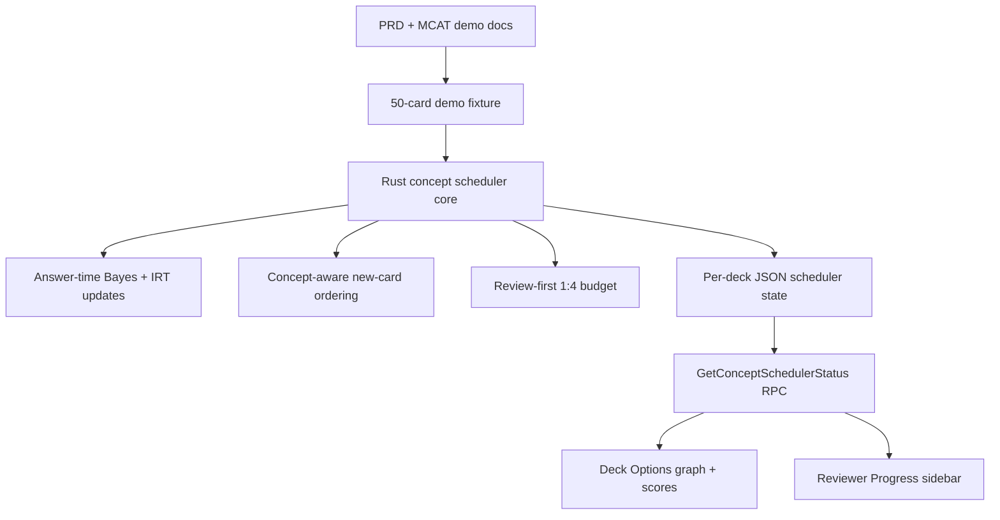

# Concept Scheduler for Anki

This repository is a research/development fork of the desktop version of
[Anki](https://apps.ankiweb.net). It adds a desktop-first **Concept Scheduler**
prototype for MCAT studying while preserving Anki's existing spaced repetition
behavior.

Anki already answers the question:

```text
When should this card be reviewed again?
```

This project adds a second question:

```text
What concept should this learner study next?
```

The MVP is intentionally conservative: it makes a real change inside Anki's
Rust scheduler, keeps the feature deck-specific and off by default, and falls
back to normal Anki behavior whenever evidence is thin, tags are missing, or
the mode is disabled.

## Project Status

Implemented so far:

- Rust concept scheduler core in `rslib/src/scheduler/concept.rs`.
- Per-deck `Concept Scheduler Mode` toggle.
- Versioned per-deck JSON state persistence.
- Bayesian Knowledge Component mastery updates after answers.
- Inner/outer fringe classification for a prerequisite lattice.
- Concept-aware new-card sorting when mode is enabled and evidence is enough.
- Review-first `1 new-topic card : 4 review cards` session budget.
- Prerequisite violation counters.
- Demo MCAT deck import from `added features/mcat_demo_cards.md`.
- Live backend status RPC via `GetConceptSchedulerStatus`.
- Deck Options concept graph/status panel.
- Reviewer `Progress` sidebar with section score/coverage information.
- Home-screen Light/Dark theme toggle.
- IRT section score prototype with honest score refusal and coverage gating.

Recent verification:

```sh
just test-rust
# 569 tests passed

just test-ts
# 53 tests passed
```

`just test` currently reaches unrelated Qt installer template failures in
`qt/tests/test_installer.py`; Rust, pylib, and TypeScript/Vitest tests pass.

## User Persona

The target learner is a busy undergraduate preparing for the MCAT on a compressed
three-month timeline. They are willing to practice every day, but they need the
app to protect their time and tell them what matters most. The goal is not only
memorization: MCAT success also depends on logical reasoning, critical thinking,
and reading comprehension.

## MVP Definition

The MVP must prove one thing clearly:

```text
Anki can choose better new concepts without breaking its existing review system.
```

The first build includes:

- A Rust-side scheduler change, not just Python or UI screens.
- A Knowledge Component lattice where each KC can list prerequisites.
- Inner and outer fringe tracking:
  - Inner fringe: concepts strong enough to build from.
  - Outer fringe: next eligible concepts whose prerequisites are ready.
- Configurable thresholds:
  - Inner fringe default: `P(mastery) >= 0.85` and at least `3` answered cards.
  - Outer fringe default: all prerequisites have `P(mastery) >= 0.70`.
- Review-first study sessions.
- Fixed MVP budget: `1` new-topic card per `4` review/interday-learning cards.
- A small topic-choice/recommendation path based on 3-5 outer-fringe topics.
- Fallback to normal review when no outer-fringe topic is ready.
- Calibration behavior for new users.
- Honest score refusal when there is not enough evidence.

Not in the first desktop-engine build:

- Adaptive new-topic limits.
- Android companion and sync.
- AI-generated explanations/cards/topic maps.
- Full MCAT score prediction without held-back validation data.
- A complex analytics dashboard.

## Architecture



Main implementation locations:

- `rslib/src/scheduler/concept.rs`
  - KC IDs, graph, tag parsing, Bayes updates, IRT scoring, coverage, state.
- `rslib/src/scheduler/concept_demo.rs`
  - MCAT demo deck import, canonical graph, status response construction.
- `rslib/src/scheduler/answering/mod.rs`
  - Answer-time mastery and IRT evidence updates.
- `rslib/src/scheduler/queue/builder/sorting.rs`
  - Concept-aware new-card ordering.
- `rslib/src/scheduler/queue/mod.rs`
  - Live queue/session state and review-first budget.
- `proto/anki/scheduler.proto`
  - Concept status and section score DTOs.
- `proto/anki/deck_config.proto`
  - Deck-level feature toggle.
- `ts/routes/deck-options/ConceptSchedulerOptions.svelte`
  - Deck Options status, graph, score ranges, debug output.
- `qt/aqt/reviewer.py`
  - Reviewer Progress sidebar and KC badge.
- `ts/reviewer/reviewer.scss`
  - Reviewer/Progress styling.
- `qt/aqt/deckbrowser.py`
  - Home-screen MCAT demo import and Light/Dark toggle.

## Data Flow

```text
Card answer
  -> normal Anki answer/revlog behavior
  -> parse note tags
  -> update KC mastery with Bayes
  -> update section IRT evidence
  -> update daily counters and prerequisite violations
  -> persist per-deck concept scheduler JSON state
  -> UI refreshes GetConceptSchedulerStatus
```

The frontend never writes mastery, counters, graph state, or score estimates
directly. It reads a backend DTO from `GetConceptSchedulerStatus`.

## Tagging Format

The MVP uses structured Anki tags:

```text
KC::Biochem::Enzymes
Prereq::Biochem::Protein_Structure_and_Function
MCAT::Bio_Biochem
Difficulty::3
IRT::Discrimination::1.0
IRT::Guessing::0.25
Reasoning::Conceptual
```

Required for MVP:

- `KC::...`
- `Difficulty::1` through `Difficulty::5`

Optional:

- `Prereq::...`
- `MCAT::...`
- `IRT::Discrimination::...`
- `IRT::Guessing::...`
- `Reasoning::...`

## Knowledge Component Model

Each Knowledge Component has state like:

```text
KC node:
  id
  prerequisite edges
  P(mastery)
  answered count
  positive evidence count
  negative evidence count
  unseen cards
```

The graph is a directed prerequisite graph:

```text
Prerequisite KC -> Target KC
```

Demo examples:

```text
Bio::DNA -> Bio::Genetics
Biochem::Amino_Acids -> Biochem::Peptides_and_Proteins
Biochem::Peptides_and_Proteins -> Biochem::Protein_Structure_and_Function
Biochem::Protein_Structure_and_Function -> Biochem::Enzymes
Biochem::Enzymes -> Biochem::Bioenergetics
Biochem::Bioenergetics -> Biochem::Glycolysis
Biochem::Glycolysis -> Biochem::Citric_Acid_Cycle
Bio::Eukaryotic_Cell -> Biochem::Bioenergetics
```

### Inner Fringe

A KC enters the inner fringe when:

```text
P(mastery) >= 0.85
answered_count >= 3
```

### Outer Fringe

A KC enters the outer fringe when:

```text
KC is not already inner fringe
all prerequisite KCs have P(mastery) >= 0.70
```

Only outer-fringe KCs are considered for new-topic recommendations in the MVP.

## Bayesian Mastery Update

Ratings become binary evidence:

```text
Again / Hard -> negative evidence
Good / Easy  -> positive evidence
```

The mastery update is Bayes' theorem:

```text
P(M | E) =
  P(E | M) * P(M)
  -----------------------------------------
  P(E | M) * P(M) + P(E | not M) * P(not M)
```

Defaults:

```text
P(positive evidence | mastered)   = 0.90
P(positive evidence | unmastered) = 0.20

P(negative evidence | mastered)   = 0.10
P(negative evidence | unmastered) = 0.80

Initial P(mastery) = 0.25
```

Example for one positive answer from an unseen KC:

```text
P(M) = 0.25
P(E+ | M) = 0.90
P(E+ | not M) = 0.20

P(M | E+) =
  0.90 * 0.25
  ---------------------------
  0.90 * 0.25 + 0.20 * 0.75

= 0.225 / 0.375
= 0.60
```

## New-Topic Readiness Score

For new-topic ordering:

```text
ReadinessScore(target) =
  P(prerequisites mastered) * (1 - P(target mastered))
```

For multiple prerequisites, the MVP uses the minimum prerequisite mastery:

```text
P(prerequisites mastered) =
  min(P(prereq_1), P(prereq_2), ..., P(prereq_n))
```

Interpretation:

```text
high prerequisite mastery + low target mastery = useful next topic
```

Example:

```text
P(prereqs mastered) = 0.90
P(target mastered) = 0.20

ReadinessScore = 0.90 * (1 - 0.20)
               = 0.72
```

## Review-First Budget

The scheduler preserves Anki's review priority. New concept cards are budgeted:

```text
1 new-topic card earned per 4 completed review/interday-learning cards
```

The queue avoids constant context switching by waiting for a focused block:

```text
focused topic block size = 3 cards
```

If reviews are exhausted, a smaller partial block is allowed.

## IRT Performance Score

The IRT layer estimates section performance separately from KC mastery.

The MVP uses a 3PL model:

```text
P(correct) =
  c + (1 - c) / (1 + exp(-a * (theta - b)))
```

Where:

```text
theta = learner ability
b     = item difficulty
a     = item discrimination
c     = guessing probability
```

For four-choice multiple-choice cards:

```text
c = 0.25
```

Difficulty tags map to `b`:

```text
Difficulty::1 -> b = -2.0
Difficulty::2 -> b = -1.0
Difficulty::3 -> b =  0.0
Difficulty::4 -> b =  1.0
Difficulty::5 -> b =  2.0
```

Defaults:

```text
a = 1.0
c = 0.25
```

Optional cards can override:

```text
IRT::Discrimination::1.2
IRT::Guessing::0.25
```

Theta maps to an MCAT scaled section score:

```text
ScaledScore(theta) =
  clamp(125 + 2.5 * theta, 118, 132)
```

Performance score output:

```text
PerformanceRange =
  PerformanceCenter +/- 1.96 * PerformanceSE
```

## MCAT Section Weights

Section blueprint weights:

```text
Bio/Biochem:
  Biology 65%
  Biochemistry 25%
  General Chemistry 5%
  Organic Chemistry 5%

Chem/Phys:
  General Chemistry 30%
  Biochemistry 25%
  Physics 25%
  Organic Chemistry 15%
  Biology 5%

Psych/Soc:
  Psychology 65%
  Sociology 30%
  Biology 5%

CARS:
  CARS 100%
```

Coverage is capped by discipline slice. One `5%` slice requires one problem.
Therefore:

```text
Biology 65% -> 13 problems to fully cover that bucket
Biochemistry 25% -> 5 problems
Biology 5% in Psych/Soc -> 1 problem
```

Important rule:

```text
100 Biology questions can fill the Biology slice,
but cannot fill Chemistry, Physics, Psychology, Sociology, or CARS.
```

This means Bio evidence contributes to:

```text
Bio/Biochem coverage up to 65%
Chem/Phys coverage up to 5%
Psych/Soc coverage up to 5%
```

## Readiness Score

Readiness is not the same as performance.

```text
Performance = IRT estimate from answered items.
Readiness = performance adjusted for topic coverage and mastery evidence.
```

Section mastery:

```text
SectionMastery =
  sum(TopicWeight_i * P(mastery_i)) / sum(TopicWeight_i)
```

Coverage:

```text
Coverage =
  sum(weight_bucket_i * min(answered_i / required_i, 1.0))
```

Penalties shift the center:

```text
CoveragePenalty = (1 - Coverage) * MaxCoveragePenalty
MasteryPenalty  = (1 - SectionMastery) * MaxMasteryPenalty

ReadinessCenter =
  PerformanceCenter - CoveragePenalty - MasteryPenalty
```

Uncertainty is combined by adding variances:

```text
CoverageSE = (1 - Coverage) * MaxCoverageSE
MasterySE  = MasteryUncertainty * MaxMasterySE

ReadinessVariance =
  PerformanceSE^2 + CoverageSE^2 + MasterySE^2

ReadinessSE = sqrt(ReadinessVariance)
```

Range:

```text
ReadinessRange =
  ReadinessCenter +/- 1.96 * ReadinessSE
```

Default constants:

```text
MaxCoveragePenalty = 4 scaled-score points
MaxMasteryPenalty  = 3 scaled-score points
MaxCoverageSE      = 2
MaxMasterySE       = 2
```

The UI hides performance/readiness ranges until:

```text
section blueprint coverage >= 60%
and section item evidence threshold is met
```

## Score Definitions

The app keeps three score concepts separate:

```text
Memory score:
  KC mastery / retention-style evidence.

Performance score:
  IRT ability estimate from answered items.

Readiness score:
  Performance adjusted for coverage, mastery, and uncertainty.
```

A learner can have high performance but low readiness if they answered a narrow
or biased sample.

## Honesty Rule

The app may not show a readiness score unless it can also show:

- What evidence produced the number.
- What data is still missing.
- How accurate past guesses have been.
- A likely score range, not just one number.
- The single best next thing to study.

If evidence is too thin, the app must refuse to show a score.

## UI

Current desktop UI:

- Deck Options:
  - Concept Scheduler Mode toggle.
  - Live graph/status panel.
  - KC mastery probability and evidence counts.
  - IRT section coverage and score ranges when evidence is sufficient.
- Reviewer:
  - KC badge on the card face.
  - Progress button in the bottom bar.
  - Progress sidebar containing graph, counters, mastery, and section scores.
- Deck Browser:
  - Light/Dark toggle.

The visual design uses:

```text
60% dominant: soft white / muted neutral background
30% secondary: muted blues and soft greens
10% accent: restrained warm markers for attention/locked states
```

## Demo Data

The demo deck source of truth is:

```text
added features/mcat_demo_cards.md
```

It contains:

```text
10 demo KCs
5 cards per KC
50 total cards
```

The demo KC map is drafted in:

```text
added features/mcat.md
```

## Validation Plan

Baseline:

```text
Concept Scheduler Mode off = normal Anki ordering
Concept Scheduler Mode on  = concept-aware ordering
```

Metrics:

- Prerequisite violation count.
- Mastery gain before/after sessions.
- Held-back prediction accuracy.
- IRT vs simpler baselines.

Simpler baselines:

```text
percent correct
average KC mastery
normal Anki new-card order
```

IRT must beat a simpler method before its score is presented as meaningful.

## Commands

Use the repo's `just` recipes:

```sh
just run
just test-rust
just test-py
just test-ts
just test
just check
```

The repo is pinned to Rust `1.92.0` in:

```text
rust-toolchain.toml
```

Make sure `rustup` is on your `PATH` before running tests:

```sh
export PATH="/opt/homebrew/opt/rustup/bin:$PATH"
rustc --version
```

Expected:

```text
rustc 1.92.0
```

## Original Anki Project

[](https://github.com/ankitects/anki/actions/workflows/ci.yml)
[](https://dev-docs.ankiweb.net)

This repository is based on the desktop version of
[Anki](https://apps.ankiweb.net), a spaced repetition program.

For upstream contribution guidelines, see:

```text
docs/contributing.md
docs/development.md
```

Contributors to Anki are listed in:

```text
CONTRIBUTORS
```

## License

Anki is licensed under AGPL-3.0-or-later. See:

```text
LICENSE
```

Some components use BSD-3-Clause or other compatible licenses as documented in
the upstream project.
