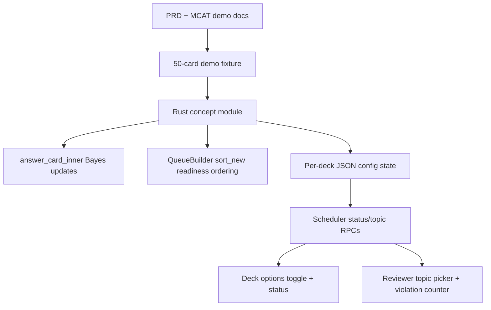
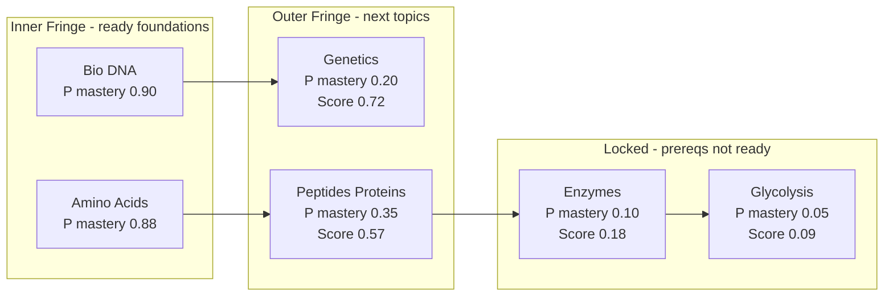

# Concept Scheduler PRD Implementation Plan

## Scope

Build the MVP from `added features/prd.md` against the existing demo materials in `added features/mcat.md` and `added features/mcat_demo_cards.md`.

The first implementation should be desktop-first and Rust-engine-first. The feature must be deck-specific, disabled by default, and must fall back to normal Anki behavior when disabled, untagged, or under-evidenced.

## Architecture Shape

## Visualization Track

The first visual should be a **2D concept lattice**, not a full analytics dashboard. Each KC node should show:

- KC name, for example `Bio::DNA`.
- Mastery probability, for example `P mastery 0.90`.
- Fringe state: inner, outer, locked/not-ready, or unknown.
- Readiness score for candidate new topics.

The 2D MVP should make the learning boundary obvious: mastered/inner concepts on the left, outer-fringe candidates next, and locked advanced concepts farther right. A later post-MVP version can become 3D or interactive, with axes such as prerequisite depth, mastery probability, and learning value/readiness score.

Core Rust integration points:

- `rslib/src/scheduler/queue/builder/sorting.rs`: concept-aware new-card ordering.
- `rslib/src/scheduler/answering/mod.rs`: Bayesian mastery updates after answers.
- `rslib/src/scheduler/queue/mod.rs`: session queue state for review-first and 1:4 budget gating.
- `rslib/src/config/mod.rs`: isolated JSON persistence for KC mastery and daily metrics.
- `proto/anki/deck_config.proto`, `proto/anki/scheduler.proto`: deck toggle and scheduler status/topic RPCs.

## Parallel Agent Strategy

Use parallel agents at each phase boundary instead of serially exploring everything in one pass:

- Rust engine agent: owns scheduler, answering, queue, and concept model implementation.
- Persistence/proto agent: owns JSON state schema, deck toggle, generated protobuf API shape, and backward compatibility checks.
- UI agent: owns deck-options toggle/status and reviewer topic-choice/violation display.
- Test/fixture agent: owns the 50-card demo fixture, Rust scheduler tests, Python/TS integration tests, and verification commands.
- Validation agent later: owns held-back evaluation, baseline comparisons, IRT/readiness refusal, and model metrics.

Keep phases synchronized with small contracts: JSON schema, proto messages, tag convention, and Rust public module API.

## Phase 0: Freeze Demo Contracts

Goal: turn the PRD/demo markdown into a reliable implementation contract before touching scheduler behavior.

- Adopt the hierarchical tag convention already used in the demo: `KC::Bio::DNA`, `Prereq::Bio::DNA`, `MCAT::Bio_Biochem`, `Difficulty::1` through `Difficulty::5`.
- Reconcile the 10-KC graph in `added features/mcat.md` with card-level prereq tags in `added features/mcat_demo_cards.md`, especially edges omitted from card tags.
- Create a machine-readable 10-KC demo graph fixture and a generated 50-card test fixture from the markdown.
- Decide initial Bayesian likelihood defaults, for example configurable positive/negative evidence values with conservative defaults.
- Define versioned JSON state shape for `schemaVersion`, `kcs`, `daily`, `session`, `readiness`, and optional future `irt`.

Acceptance:

- A test can build/import the fake 50-card deck with tags intact.
- The parser contract is frozen before Rust queue behavior depends on it.

## Phase 1: Pure Rust Concept Core

Goal: implement the concept model without touching Anki scheduling yet.

- Add a new Rust module such as `rslib/src/scheduler/concept/`.
- Implement KC IDs, graph edges, card metadata parsing, threshold config, mastery state, inner/outer fringe classification, and readiness scoring.
- Implement the PRD formula: `P(prerequisites mastered) * (1 - P(target KC mastered))`.
- Implement honest refusal objects for insufficient evidence rather than returning invented readiness scores.
- Add cycle/invalid graph handling and fallback score behavior for unknown/untagged cards.

Acceptance:

- Rust unit tests cover tag parsing, graph building, Bayes updates, inner fringe, outer fringe, score refusal, and fallback behavior.
- No existing Anki scheduler behavior changes yet.

## Phase 2: Persistence And Deck Toggle

Goal: make the feature deck-specific, persistent, and off by default.

- Store runtime KC state in an isolated per-deck config key using existing config JSON patterns, for example `_deck_{deckId}_conceptSchedulerState`.
- Add a deck-specific Concept Scheduler Mode flag through deck/deck-config proto wiring, not as a collection-wide FSRS-style toggle.
- Wire the toggle through `rslib/src/deckconfig/update.rs`, `ts/routes/deck-options/lib.ts`, and generated backend bindings.
- Keep thresholds configurable in the JSON/preset path, but use MVP defaults: inner `0.85 + 3 answers`, outer prereq `0.70`, readiness evidence threshold production `500`, demo lower.

Acceptance:

- Toggle persists per deck and defaults off.
- Existing decks behave exactly as before when disabled.
- JSON state round-trips and tolerates missing/older schema fields.

## Phase 3: Answer-Time Bayesian Updates

Goal: update KC mastery from real study answers.

- Hook into `rslib/src/scheduler/answering/mod.rs` after normal answer/revlog handling.
- Map ratings per PRD: Again/Hard as negative evidence, Good/Easy as positive evidence.
- Parse target `KC::` tags from the answered card’s note and update mastery probability, answered count, positive/negative counts, and daily evidence metrics.
- Increment prerequisite-violation counters when a concept-scheduled card is introduced before prereqs are ready.
- Make updates undo-safe by writing state within the same operation/transaction pattern as answering.

Acceptance:

- Answering cards changes KC probabilities predictably.
- Undo restores concept state consistently.
- Untagged cards do not break the answer path.

Implemented:

- `answer_card_inner()` now updates enabled decks' persisted concept state after normal answer/revlog/card writes.
- Again/Hard produce negative evidence; Good/Easy produce positive evidence.
- Daily positive/negative counters and prerequisite-violation counters are stored in the same versioned JSON state and restored by undo.

## Phase 4: Concept-Aware New-Card Ordering

Goal: make the first real scheduler change while preserving reviews, limits, and burying.

- Branch inside new-card sorting when Concept Scheduler Mode is enabled.
- Keep gathering, deck limits, burying, and review priority intact; only reorder the gathered new-card pool.
- Sort concept-tagged new cards by readiness score and keep normal sort behavior for disabled/untagged/fallback cases.
- Use the demo fixture to compare mode-on vs mode-off prerequisite violations.

Acceptance:

- Reviews and learning cards remain prioritized as Anki already does.
- Daily new-card limits and burying behavior still pass existing tests.
- With mode on, eligible outer-fringe concepts appear before advanced concepts; with mode off, baseline order remains.

Implemented:

- After new-card gathering, the queue builder batch-loads note tags and prepares a concept graph for the gathered pool only.
- `sort_new()` uses readiness sorting only when the root deck toggle is enabled, readiness has enough evidence, and the gathered graph has no cycle.
- Disabled, under-evidenced, untagged-only, and cyclic cases fall back to the existing `NewCardSortOrder` behavior.

## Phase 5: Review-First Budget And Topic Choice

Goal: implement the PRD session behavior, which cannot be solved by sort order alone.

- Extend session queue state in `rslib/src/scheduler/queue/mod.rs`, similar in spirit to optional load-balancer state.
- Track review cards completed, new-topic slots earned, budget spent, and selected topic in live queue session state.
- Enforce the 1:4 new-topic budget as a budget, not forced constant alternation: 12 reviews can unlock a focused 3-card concept block.
- Allow a smaller partial block when reviews are exhausted, so the learner is not stranded with earned budget.
- Defer scheduler RPCs in `proto/anki/scheduler.proto` until Phase 6 needs concept status, recommended topics, and selected topic from the UI.

Acceptance:

- Fresh users enter calibration/fallback behavior.
- Review-first flow works across a simulated study session.
- Topic selection gates new-topic cards without bypassing normal Anki daily limits.

Implemented:

- `CardQueues` now owns an optional concept session state, similar to load-balancer state.
- Reviews/interday-learning answers earn one new-topic slot per four completed cards.
- Concept new cards are hidden while reviews remain until enough budget exists for a focused block.
- The block auto-focuses the first readiness-sorted topic unless a selected topic is already set.
- Direct new-only decks still show sorted new cards, because there are no reviews to earn budget from.
- Queue undo/redo snapshots include concept session presentation state.

Remaining:

- Public scheduler RPCs for concept status, recommendations, and topic selection.
- Reviewer UI that lets the user choose the selected topic instead of relying on the internal field/auto-focus fallback.

## Phase 6: Minimal Desktop UI

Goal: expose only the MVP controls and feedback.

- Add `ConceptSchedulerOptions.svelte` under `ts/routes/deck-options/` with a visible toggle and short status panel.
- Add FTL strings in `ftl/core/deck-config.ftl` and study strings in `ftl/core/studying.ftl`.
- Add a simple topic picker in reviewer flow, likely via PyQt first for MVP speed, using `qt/aqt/reviewer.py`.
- Add a small prerequisite-violation counter in the relevant reviewer/deck status view.
- Add a 2D concept graph view showing inner fringe, outer fringe, locked topics, mastery probability, and readiness score for recommended topics.
- Show readiness refusal honestly: what evidence is missing and what to study next, without a fake score.

Acceptance:

- User can enable/disable the feature for one deck.
- User sees 3-5 topic choices only when budget and outer fringe allow it.
- User can visually see why a topic is recommended: strong prereqs, weak target mastery, and high readiness score.
- UI remains small: no dashboard, no full score predictor in MVP.

Implemented:

- Deck options now show Concept Scheduler Mode status copy when the deck toggle is on or off.
- When enabled, deck options show a small 2D learning-boundary preview with inner fringe, outer fringe, and locked topic columns.
- The preview is explicitly sample data until scheduler status/recommendation RPCs expose live graph data.

Remaining:

- Reviewer topic picker and prerequisite-violation display.
- Live status/recommendation RPCs for budget progress, selectable topics, and live graph data.
- Study strings in `ftl/core/studying.ftl` once the reviewer UI is wired.

## Phase 7: Verification And Demo Readiness

Goal: prove the MVP is reliable before expanding scope.

- Rust first: add concept module tests, queue integration tests, and full session simulations using Anki’s existing scheduler test patterns.
- Python next: test pylib scheduler behavior and config round-trips.
- TypeScript next: test deck-options state and toggle save behavior.
- End-to-end/manual: import the 50-card demo deck into a throwaway profile and compare mode-on vs mode-off.
- Verification commands should use project recipes: `just test-rust`, `just test-py`, `just test-ts`, `just test-e2e` when UI flow exists, and final `just check`.

Acceptance:

- Existing scheduler tests still pass.
- Demo deck exercises calibration, outer-fringe unlock, fallback review, topic choice, score refusal, and prerequisite-violation comparison.
- Performance target is checked on the daily gathered pool, not the whole collection.

Current verification:

- Rust concept, answering, and full queue tests pass.
- TypeScript Vitest suite passes, including deck-options Concept Scheduler toggle tests.
- Rust formatting check passes for the `anki` package.
- Full `just check` remains deferred because repository-wide markdown formatting issues are unrelated to the Concept Scheduler code.

## Phase 8: Post-MVP Readiness, IRT, Mobile

Goal: defer larger promises until the core concept scheduler works.

- Add held-back validation and baseline comparison before showing readiness claims.
- Add IRT ability estimates only behind evidence thresholds and score ranges.
- Explore a 3D or interactive concept lattice after the 2D graph proves useful. Candidate axes: prerequisite depth, mastery probability, and readiness/learning value.
- Design Android/mobile sync around the same state model; do not reimplement scheduler logic independently.
- Revisit storage only if JSON payloads become too large or concurrent sync requires conflict-aware merging.

Acceptance:

- Readiness scores refuse when evidence is insufficient.
- Any score shown has a range and validation basis.
- Mobile work consumes the shared engine/state contract instead of forking behavior.

## Risks To Watch

- The Anki queue is built once per session, so the 1:4 budget and topic-choice gate need session state, not just new-card sorting.
- Proto changes require regenerated Rust/Python/TypeScript bindings and likely a broad `just check` pass.
- Config JSON is safe for MVP, but concurrent multi-device updates can overwrite state later; mobile sync needs a stronger merge plan.
- Burying and deck limits are order-sensitive; concept sorting must happen after gather/bury logic and must not bypass limits.
- The PRD’s full MCAT scope is larger than the demo graph; ship against the 10-KC 50-card fixture first, then scale the lattice.