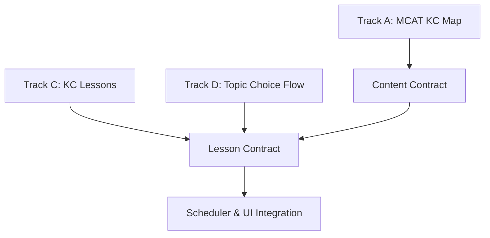
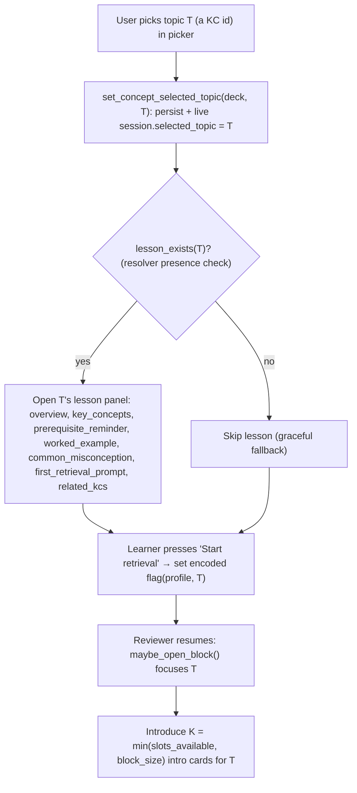

# Lesson Contract (Track C ↔ Track D ↔ Track A)

Design/contract artifact only. This document defines the **Lesson Contract**: the
frozen seam that ties lesson pages (Track C, `added features/lessons.md`) to the
topic picker (Track D, `added features/topic-picker-design.md`) and to the KC map
(Track A, the six `added features/research-kc-*.md` files + `added features/mcat.md`).

It is the `LessonContract` node in the parallelization graph of
`added features/next-feature-expansion-plan.md`:



**Constraints for this doc:** docs only. No code, no builds, no commits, no
changes to any other file. It defines interfaces, not implementations. Judgment
calls are marked `(verify)`.

**What is already frozen (do not redefine here):**

- The per-KC **lesson-page schema** and demo stubs — owned by `lessons.md`.
- The **picker UX + flow** and the single backend write path
  (`set_concept_selected_topic`) — owned by `topic-picker-design.md`.
- The **KC id namespace, prerequisite edges, section overlap, difficulty ladder,
  and KC type** — owned by the Track A research maps and the canonical demo graph
  in `rslib/src/scheduler/concept_demo.rs`.

This contract only pins down *how those three fit together* so implementation has
an unambiguous target.

---

## 0. Shared vocabulary

- **KC id** — the bare component id, `"<Area>::<Topic>"` (e.g. `Biochem::Enzymes`).
  On a card it is the tag `KC::<Area>::<Topic>`. This is the **single join key**
  across all three tracks: Track A authors it, Track D's `recommendations[].id`
  and `graph.nodes[].id` use it verbatim, and Track C keys every lesson on it.
  No new identifier is introduced by lessons.
- **Lesson** — one page per KC, in the Track C schema (seven sections + metadata).
- **Lesson resolver** — a lookup `kc_id -> lesson | none`. Its concrete storage is
  Track C's business; this contract only fixes its *signature and guarantees*.
- **Encoded flag** — a per-`(profile, KC)` local boolean meaning "this learner has
  already been shown the start-of-topic lesson / first-encounter for this KC."
  Local-first, **not synced** (see §2.3).

---

## 1. What a lesson needs FROM the KC map (Track A)

Lessons are a *consumer* of the KC map. They never define graph structure; they
read it. Track A's six research maps share one per-KC row schema (KC id · parent
cluster · **type** ∈ {foundation, mechanism, application, detail} · prerequisites
(`prereq -> this KC`) · overlapping MCAT sections · difficulty ladder · per-KC
scope/sub-topics · common-misconception hook · status ∈ {demo, existing, new}).
The Lesson Contract consumes a defined subset of those fields.

### 1.1 Per-section field feed (which KC field feeds which lesson section)

| Lesson section (Track C) | Fed by Track A field(s) | Derived from graph vs authored |
| --- | --- | --- |
| `id` (`LESSON-<slug>`) | KC id → slug | **Derived** (mechanical slug of `kc`). |
| `kc` | KC id | **Referenced** — must exist as a node in the KC map / demo graph. |
| `title` | KC id humanized (last `::` segment, `_`→space) + per-KC scope | **Authored**, default seeded from the id via the same humanization Track D uses (`topic-picker-design.md` §1.2). |
| `section` (`MCAT::…`) | "MCAT sections" column (primary `*` / primary marker) | **Derived (Track A)** — the KC's blueprint section(s). |
| `overview` | per-KC scope + `type` framing | **Authored**, seeded by Track A scope notes; `type` sets tone (foundation = "what it is", application = "how it integrates"). |
| `key_concepts` | per-KC scope sub-topic list | **Authored**, distilled from Track A scope bullets. |
| `prerequisite_reminder.prerequisite_kcs` | Prerequisites column / prerequisite edge list | **Derived (Track A graph)** — must equal the KC's prerequisites; no hand-drift. |
| `prerequisite_reminder.text` | (the prereq KCs above) | **Authored** one line reactivating those prereqs; foundations get a "foundation" line + empty list. |
| `worked_example` | per-KC scope + `type` + difficulty ladder | **Authored**; **depth tuned by `type`/difficulty** — foundation → one concrete example at the low band; application → a reasoning-style example nearer the high band. |
| `common_misconception` | per-KC "Misconception:" hook (in the scope notes) | **Authored**, seeded by Track A's named misconception hook. |
| `first_retrieval_prompt` | `type` + difficulty ladder (calibration level) | **Authored**; foundation → recall prompt, application → reasoning prompt. Must **not** duplicate any card's `Correct`/`Explanation` for the same KC. |
| `related_kcs` | Prerequisites (upstream) **+** downstream targets (reverse edges) | **Derived (Track A graph)** — prereqs + KCs that list this KC as a prerequisite. |

### 1.2 Derived vs authored — the hard rule

Three fields are **strictly graph-derived** and MUST equal the canonical graph at
build time (this is a lesson-validation rule already stated in `lessons.md`):

- `section` — from the KC's MCAT-section mapping.
- `prerequisite_reminder.prerequisite_kcs` — from the KC's inbound prerequisite edges.
- `related_kcs` — prerequisites ∪ downstream targets (inbound ∪ outbound edges).

Everything else (`overview`, `key_concepts`, `prerequisite_reminder.text`,
`worked_example`, `common_misconception`, `first_retrieval_prompt`, `title`) is
**authored prose**, optionally *seeded* by Track A scope/misconception notes but
owned and edited by a human (or, later and gated, by AI — see §4). The derived
fields are inputs to authoring, never overwritten by it.

### 1.3 Exact Track A field dependencies (the "from A" list)

Lessons depend on these KC-map fields being present and stable:

1. **KC id** (canonical, discipline-owned). Feeds `kc`, `id` slug, and the
   resolver key. Today: the 10 demo KCs in `concept_demo.rs`; at scale: the ~172
   KCs across the six research maps (Bio 34, Biochem 25, GenChem 26, Orgo 27,
   Physics 26, PsychSoc 34).
2. **Prerequisite edges** (`prereq -> target`). Feeds `prerequisite_kcs` and half
   of `related_kcs`. Lessons consume edges; they never author them.
3. **Downstream targets** (reverse of the same edge list). Feeds the other half of
   `related_kcs`.
4. **MCAT section mapping** (primary section per KC). Feeds `section`. `(verify)`
   which source wins for display: the research maps' *content-real* primary
   section (the `*`/primary column) is more precise than the code's blanket
   `derived_mcat_sections_for_topics` (which routes by area prefix). Recommend the
   research-map primary for the lesson `section`, treating the code mapping as the
   superset of evidence tags.
5. **KC `type`** (foundation/mechanism/application/detail). Tunes `worked_example`
   depth and `first_retrieval_prompt` style.
6. **Difficulty ladder**. Secondary tuning signal for worked-example / retrieval
   calibration level.
7. **Per-KC scope + common-misconception hook**. Authoring seeds for `overview`,
   `key_concepts`, `worked_example`, `common_misconception`.
8. **KC `status`** (demo/existing/new). Sequencing signal only — demo KCs get
   stubs now; non-demo KCs wait for the Content Contract freeze (§5).

> Reasoning-emphasis (`Reasoning::…`) and IRT metadata are Track B (card
> generation) concerns and are **not** lesson inputs; a lesson never needs them.

---

## 2. How the topic picker (Track D) drives lessons

Track D is the primary driver of the start-of-topic lesson. The seam is a
**resolver keyed by KC id** plus a **presence check** and a **return path**.

### 2.1 The pick → open lesson → introduce cards flow (keyed by KC id)

This is Track D's flow (`topic-picker-design.md` §5) with the lesson seam made
explicit:



Contract obligations at this seam:

1. **KC-addressable.** The lesson resolver takes the picker's selected id `T`
   straight through — same id space as `recommendations[].id`, `graph.nodes[].id`,
   and the `KC::` tag. Signature (shape, not code):
   `resolve_lesson(kc_id) -> Lesson | None` and `lesson_exists(kc_id) -> bool`.
2. **Presence check drives copy.** Track D's next-action string is
   "Open lesson, then K intro cards" **iff** `lesson_exists(T)`, else
   "Start K intro cards" (`topic-picker-design.md` §1.3, step 3 vs 4). So the
   presence check must be cheap and callable while rendering the picker, before
   any selection.
3. **Return path.** Dismissing the lesson via "Start retrieval" hands control back
   to the reviewer, which opens the focused block for `T`. The reviewer already
   flows lesson → `_showQuestion` → `_showAnswerButton`; the lesson panel is a
   local overlay in front of that flow, not a replacement for it.
4. **Only-authored-renders.** The resolver returns a lesson for display **only** if
   it passes the §4 gate (`source: authored` + `review_status: approved`).
   A gated/`ai_generated`/`draft` lesson is treated by Track D exactly like "no
   lesson" — the picker degrades to "Start K intro cards" and the reviewer skips
   the lesson step. This keeps the gate invisible to the picker's logic.

### 2.2 When a KC has no lesson yet (graceful skip)

Track D must ship and pass its acceptance criteria **without** any lesson
(`topic-picker-design.md` §5.1: "Until Track C lands, the picker ships with the
lesson step skipped"). The contract therefore guarantees:

- `lesson_exists(T) == false` (no stub, or a stub that fails the §4 gate) is a
  **normal, non-error state**. The picker shows "Start K intro cards"; selecting
  `T` goes straight to its intro cards.
- The reviewer's post-answer "Lesson" button (§3b) shows a short
  "No lesson for this concept yet" message instead of failing (`lessons.md`
  entry-point (b), Empty state).
- As lessons are authored KC-by-KC, the lesson step "lights up" automatically for
  those KCs with no Track D change. Coverage is additive.

### 2.3 The first-encounter start-of-topic gate

Purpose: show a KC's lesson **once**, before its first card, without interrupting
normal review of already-known KCs.

- **Encoded flag.** A per-`(profile, KC)` local boolean gates re-display. It is set
  when the learner dismisses the start-of-topic lesson with "Start retrieval".
  Checked before showing the start-of-topic lesson.
- **Two triggers** (both from `lessons.md` entry point (a)):
  - **Picker-driven (primary):** Track D selection of `T` requests the
    start-of-topic lesson before serving `T`'s cards. Fires regardless of the flag
    (the user explicitly chose to start `T`), then sets the flag on "Start
    retrieval". `(verify)` whether an explicit re-pick of an already-encoded KC
    should re-show or skip the lesson; recommend **skip** (respect the flag) with
    an optional "Review lesson" affordance.
  - **First-encounter (fallback):** when a card whose KC is not yet encoded reaches
    `_showQuestion`, show the lesson first, then reveal/answer as usual.
- **Non-blocking rule.** Shown at most once per new KC; **never** blocks review
  cards for already-encoded KCs. Review flow for known KCs is untouched.
- **Sync stance.** The encoded flag is **local-first and not synced**, by design
  (`lessons.md` / `topic-picker-design.md` contract inputs). This is deliberately
  *different* from Concept Scheduler state, which **is** synced via deck config
  (`progress.md`, "AnkiAndroid Backend Contract"). `(verify)` storage location:
  recommend a profile-local store (e.g. profile meta via `mw.pm`), explicitly
  **not** the synced deck-config key `_deck_<id>_conceptSchedulerState`, so it
  never rides the sync path.

---

## 3. Reviewer entry points (concrete `qt/aqt/reviewer.py` spots)

Two entry points, both local overlays modeled on the existing Concept Graph
sidebar. Line references below were verified against the current `reviewer.py`
and match the spots Track C identified in `lessons.md`. Nothing here is
implemented; these are the attachment points.

### 3.1 Shared plumbing (mirrors the concept sidebar)

- **Panel markup:** `revHtml()` injects `#_concept_kc_badge` and
  `#_concept_graph_sidebar` at `reviewer.py:336-339`. A sibling
  `<div id="_concept_lesson_panel" hidden></div>` belongs here, with
  `window._renderLessonPanel(payload)` / `window._hideLessonPanel()` JS modeled on
  `_renderConceptGraphSidebar` / `_hideConceptGraphSidebar`
  (called at `reviewer.py:617` and `:624`; defined in the `revHtml` script block
  Track C cites at `reviewer.py:381-489`).
- **Resolve current KC:** `_concept_labels(card)` (`reviewer.py:526-534`) already
  extracts `KC::` labels for the current card — reuse it to know which lesson to
  open. For multi-KC cards, offer the primary KC first.
- **Toggle/open:** a new `_open_lesson_for_current_card()` / `_toggle_lesson_panel()`
  modeled on `_toggle_concept_graph_sidebar` (`reviewer.py:619-624`).
- **Command routing:** add an `elif url == "lesson":` branch in `_linkHandler`
  right after the existing `elif url == "conceptGraph":` branch
  (`reviewer.py:943-944`).

### 3.2 (a) Start-of-topic lesson (before quizzing)

- **Picker trigger (primary):** when Track D sets the selected topic, it opens that
  KC's lesson panel and serves the KC's cards only after "Start retrieval". Natural
  hook: `nextCard()` (`reviewer.py:248-264`), which fetches the next card and calls
  `_showQuestion()`.
- **First-encounter fallback:** inside `_showQuestion` (`reviewer.py:626-663`),
  immediately after `_update_concept_graph_sidebar(c)` (`reviewer.py:658`) and
  before `_showAnswerButton()` (`reviewer.py:659`), a gate checks the encoded flag
  (§2.3). If the KC is new/unencoded, render the lesson panel first.
- **Non-blocking:** as in §2.3, once per new KC; never for already-encoded KCs.

### 3.3 (b) Post-answer "Lesson" button

- **Where it appears:** on the answer side. Either a `Lesson` button in
  `_bottomHTML` next to the existing `Progress` button (`reviewer.py:1082`, which
  routes `pycmd('conceptGraph')`), enabled once the answer shows; or injected into
  the answer-side controls built by `_answerButtons()` / shown by
  `_showEaseButtons()` (`reviewer.py:1122-1207`) so it only appears after reveal.
- **Answer-reveal hook:** `_showAnswer` (`reviewer.py:718-744`) already refreshes
  concept UI after reveal (`_update_concept_badge(c)` / `_update_concept_graph_sidebar(c)`
  at `reviewer.py:738-739`, then `_showEaseButtons()` at `:740`); enabling/showing
  the Lesson control belongs in the same place.
- **Click flow:** button calls `pycmd("lesson")` → `_linkHandler`
  (`reviewer.py:943`) → `_open_lesson_for_current_card()` → resolve KC via
  `_concept_labels(self.card)` → render `#_concept_lesson_panel` from the resolved
  lesson.
- **Empty/gated state:** if `lesson_exists(kc) == false` (missing or §4-gated),
  show "No lesson for this concept yet" rather than failing.

---

## 4. Governance / AI gating

Lessons stay **local-first and authored**. AI-generated lesson text is gated off
until the bring-your-own-OpenAI-key work (Priority 2 / Track H in
`next-feature-expansion-plan.md`) **and** source/evaluation rules exist.

### 4.1 The two gate fields

Already present in the Track C schema; this contract fixes their semantics as the
**display gate**:

- `source` ∈ { `authored`, `ai_generated` }.
- `review_status` ∈ { `draft`, `needs_review`, `approved` }.

### 4.2 Display gate (single source of truth)

A lesson renders in the live app (start-of-topic **or** post-answer) **iff**:

```text
source == "authored"  AND  review_status == "approved"
```

| `source` | `review_status` | Renders live? | Notes |
| --- | --- | --- | --- |
| `authored` | `approved` | **Yes** | The only live-visible state. |
| `authored` | `draft` / `needs_review` | No | Work-in-progress; hidden. |
| `ai_generated` | `needs_review` | No | Stored, never shown until Track H + eval. |
| `ai_generated` | `approved` | No **until Track H** | Even human-approved AI text stays gated until the Track H key + eval rules exist; then this becomes the promotion target. |
| any | any other combo | No | Fail closed. |

Anything that fails the gate is, to Track D and the reviewer, identical to
"no lesson" (§2.1 obligation 4, §2.2, §3.3 empty state). The gate is enforced in
the **resolver** so callers never need to know about it.

### 4.3 AI lifecycle (post-Track H)

When AI generation is eventually allowed:

- It runs on the **user's own OpenAI key** (Track H), never an embedded/shared key.
  The key is stored per-profile as a secret and **never synced, logged, or
  committed** (Track H acceptance).
- Generated lessons enter as `source: ai_generated`, `review_status: needs_review`
  — **never auto-approved**.
- Promotion to live requires the source/evaluation rules (out of scope here) plus
  the §4.2 gate. Until Track H ships, no `ai_generated` text can reach a learner.
- Studying never requires connectivity or a key; AI is strictly opt-in and additive.

---

## 5. Acceptance criteria (C ↔ D ↔ A) and sequencing

### 5.1 Acceptance criteria

**C ↔ A (lessons vs KC map):**

- [ ] Every lesson's `kc` exists as a node in the KC map / demo graph.
- [ ] `prerequisite_reminder.prerequisite_kcs` **equals** the KC's prerequisites in
      the canonical graph (no drift); foundations have an empty list.
- [ ] Every `related_kcs` entry is a real KC and equals prereqs ∪ downstream targets.
- [ ] `section` equals the KC's Track A primary section mapping.
- [ ] `worked_example` / `first_retrieval_prompt` depth follows the KC's `type`
      (and difficulty ladder).
- [ ] Every **demo** KC (10 in `concept_demo.rs`) has exactly one lesson stub.

**C ↔ D (lessons vs picker):**

- [ ] The picker resolves a lesson purely by the selected KC id (no new id).
- [ ] `lesson_exists(kc)` is available while rendering the picker and correctly
      switches next-action copy ("Open lesson, then K cards" vs "Start K cards").
- [ ] Selecting a topic with a lesson opens the lesson before its intro cards;
      selecting one without a lesson goes straight to intro cards (graceful skip).
- [ ] The start-of-topic lesson shows once per new KC (encoded flag) and never
      blocks review of already-encoded KCs.
- [ ] "Start retrieval" returns control to the reviewer, which then opens the
      focused block for the selected KC.
- [ ] The post-answer "Lesson" button opens the current card's KC lesson, or shows
      an empty-state message when none/gated.

**D ↔ A (picker vs KC map):** already satisfied — `recommendations[].id` and
`graph.nodes[].id` are the same KC id space lessons key on; no new binding needed.

**Governance:**

- [ ] Only `authored` + `approved` lessons render; all other states behave as
      "no lesson".
- [ ] No `ai_generated` text is reachable by a learner before Track H + eval rules.

### 5.2 Sequencing dependency (the freeze rule)

**The Content Contract / KC map must be frozen before lesson stubs scale beyond
the demo.** Rationale: three lesson fields are graph-derived (`section`,
`prerequisite_kcs`, `related_kcs`, per §1.2). If KC ids or edges churn, every
authored lesson's derived fields (and its `kc`/`id`) drift and must be re-audited.

Concretely:

1. **Now (unblocked):** author lesson **stubs for the 10 demo KCs**. The demo graph
   is already frozen in `rslib/src/scheduler/concept_demo.rs`, so demo lessons have
   a stable target. This satisfies Track C's demo acceptance and lets Track D's
   lesson step light up for the demo.
2. **Blocked until freeze:** authoring lessons for the ~172 research-map KCs. This
   waits on the Content Contract freezing (a) the KC id set, (b) the prerequisite
   edges, and (c) the section mapping — including reconciliation of the `(verify)`
   items in the research maps (e.g. GenChem name merges like `Covalent_Bond →
   Chemical_Bonding`, the Physics `Fluids` split, cross-discipline edge directions).
   Track A's own acceptance ("100-150 KCs researched before card generation
   scales") is the same gate that lessons ride behind.
3. **Ordering** matches `next-feature-expansion-plan.md` "Suggested Implementation
   Order": research & freeze KC schema (step 4) → … → lesson schema + demo lessons
   (step 8) → picker + lesson entry points (step 9). Lessons at scale come after
   the freeze; the reviewer/picker wiring comes after the demo lessons exist.

---

## 6. Contract summary (the seam in one place)

- **Join key:** the KC id, shared verbatim by Track A (authors), Track D
  (`recommendations[].id` / `graph.nodes[].id`), and Track C (lesson key).
- **From Track A, lessons need:** KC id, prerequisite edges (+ reverse for
  downstream), primary MCAT section, KC `type` (+ difficulty ladder), and per-KC
  scope/misconception seeds. `section`, `prerequisite_kcs`, and `related_kcs` are
  **graph-derived and must not drift**; the rest is authored.
- **From Track D, lessons need:** the selected KC id, a "topic-selected → open
  lesson before cards" signal, the per-profile first-encounter/encoded flag
  (local, unsynced), the "why recommended" context (optional echo), and a return
  path on "Start retrieval".
- **Track D needs from lessons:** `resolve_lesson(kc_id)`, `lesson_exists(kc_id)`,
  and a return path — nothing more.
- **Reviewer seam:** start-of-topic via `nextCard`/`_showQuestion`
  (`reviewer.py:248-264`, `:626-663`); post-answer "Lesson" via `_showAnswer` +
  `_bottomHTML`/`_answerButtons` (`reviewer.py:718-744`, `:1082`, `:1122-1207`),
  routed through `_linkHandler` (`reviewer.py:943`) and resolved with
  `_concept_labels` (`reviewer.py:526-534`).
- **Gate:** render iff `source == authored && review_status == approved`; AI text
  stays gated until Track H (bring-your-own-key) + evaluation rules.
- **Freeze rule:** demo-KC lessons now; scale only after the Content Contract
  freezes the KC ids + edges + sections.
