# Biochemistry Lessons (Track C — scaled draft)

Auto-drafted lesson pages for the 25 `Biochem::` KCs in the frozen unified map
(`added features/kc-map-unified.md` §6/§7). Schema + style follow
`added features/lessons.md`. All content is synthetic and original (not copied
from any copyrighted prep material). New lessons are `Source: authored`,
`Review Status: needs_review` (hidden behind the display gate until a human
approves them, per `lesson-contract.md` §4).

> Reused demo stubs (`Biochem::Amino_Acids`, `Biochem::Enzymes`,
> `Biochem::Glycolysis`) keep their approved prose from `lessons.md` and stay
> `Review Status: approved`. Their three graph-derived fields (`Section`,
> `Prerequisite Reminder`, `Related KCs`) are re-derived from the unified map so
> they do not drift — the map (§4) flags these demo KCs as gaining new upstream
> prerequisites relative to the 10-KC demo graph.

## Biochem::Amino_Acids

### LESSON-BIOCHEM-AMINO-ACIDS

- **KC:** `Biochem::Amino_Acids`
- **Title:** Amino Acids: The Building Blocks
- **Section:** `MCAT::Bio_Biochem`
- **Source:** authored
- **Review Status:** approved
- **Overview:** Amino acids are the 20 monomers that proteins are built from.
  They share a common core and differ only in a side chain, and that side chain
  is what gives each amino acid its chemical personality.
- **Key Concepts:**
  - Every amino acid has a central (alpha) carbon bonded to an amino group, a
    carboxyl group, a hydrogen, and a variable R side chain.
  - Side chains are grouped as nonpolar, polar uncharged, acidic (negative), or
    basic (positive).
  - Near physiological pH an amino acid is a zwitterion: the amino group is
    protonated (+) and the carboxyl group is deprotonated (-).
  - Side-chain chemistry drives how the eventual protein folds and functions.
- **Prerequisite Reminder:** Build on `GenChem::Acid_Base_Equilibria` (pKa and
  protonation), `GenChem::Chemical_Bonding`, and `Orgo::Functional_Groups`: an
  amino acid's charge comes from its amine and carboxyl groups behaving as a
  linked acid-base pair.
- **Worked Example:** Compare glycine (R = H) with aspartate (R = CH2-COO-).
  Glycine's tiny nonpolar side chain is flexible and fits tight turns; aspartate
  carries a negative charge at physiological pH, so it prefers the water-facing
  surface of a protein and can form salt bridges. Same backbone, very different
  behavior - the side chain decides.
- **Common Misconception:** "All amino acids are acidic because of the carboxyl
  group." Every amino acid has both an acidic carboxyl and a basic amino group;
  whether we call the *side chain* acidic or basic depends only on the R group.
- **First Retrieval Prompt:** From memory, name the four parts bonded to the
  alpha carbon and state which one distinguishes one amino acid from another.
- **Related KCs:** `GenChem::Acid_Base_Equilibria`, `GenChem::Chemical_Bonding`,
  `Orgo::Functional_Groups`, `Biochem::Peptides_and_Proteins`,
  `Biochem::Amino_Acid_Metabolism`
- **Diagram:** Generic amino acid drawn as a zwitterion: a central alpha carbon bonded to a protonated amino group, a deprotonated carboxyl group, a hydrogen, and a variable R side chain

<figure class="lesson-diagram">
<svg xmlns="http://www.w3.org/2000/svg" viewBox="0 0 540 440" role="img" aria-labelledby="t d" font-family="-apple-system, Segoe UI, Roboto, sans-serif">
  <title id="t">Generic amino acid as a zwitterion</title>
  <desc id="d">A central alpha carbon bonded to four groups: a protonated amino group (NH3 plus), a deprotonated carboxyl group (COO minus), a hydrogen, and a variable R side chain. Near physiological pH the amino acid exists as a zwitterion.</desc>
  <rect x="6" y="6" width="528" height="428" rx="14" fill="#ffffff" stroke="#cfd8dc" stroke-width="2"/>
  <text x="270" y="40" text-anchor="middle" font-size="18" font-weight="700" fill="#263238">Amino acid &#8212; zwitterion at physiological pH</text>

  <g stroke="#607d8b" stroke-width="3">
    <line x1="270" y1="194" x2="270" y2="140"/>
    <line x1="270" y1="246" x2="270" y2="300"/>
    <line x1="244" y1="220" x2="184" y2="220"/>
    <line x1="296" y1="220" x2="356" y2="220"/>
  </g>

  <circle cx="270" cy="220" r="26" fill="#eceff1" stroke="#37474f" stroke-width="2"/>
  <text x="270" y="227" text-anchor="middle" font-size="18" font-weight="700" fill="#263238">C&#945;</text>

  <text x="270" y="132" text-anchor="middle" font-size="18" font-weight="700" fill="#37474f">H</text>

  <text x="124" y="186" text-anchor="middle" font-size="11" fill="#607d8b">amino group</text>
  <rect x="64" y="196" width="120" height="48" rx="10" fill="#1565c0"/>
  <text x="124" y="226" text-anchor="middle" font-size="17" font-weight="700" fill="#ffffff">H3N+</text>

  <text x="416" y="186" text-anchor="middle" font-size="11" fill="#607d8b">carboxyl group</text>
  <rect x="356" y="196" width="120" height="48" rx="10" fill="#c62828"/>
  <text x="416" y="226" text-anchor="middle" font-size="17" font-weight="700" fill="#ffffff">COO&#8722;</text>

  <rect x="210" y="300" width="120" height="48" rx="10" fill="#2e7d32"/>
  <text x="270" y="330" text-anchor="middle" font-size="16" font-weight="700" fill="#ffffff">R group</text>

  <text x="270" y="390" text-anchor="middle" font-size="13" font-weight="600" fill="#37474f">&#8722;NH3+ protonated base &#183; &#8722;COO&#8722; deprotonated acid</text>
  <text x="270" y="412" text-anchor="middle" font-size="12" fill="#607d8b">R side chain sets polarity, charge, and identity</text>
</svg>
</figure>
- **Diagram:** Side-chain classes — the R group sets each amino acid's behavior:

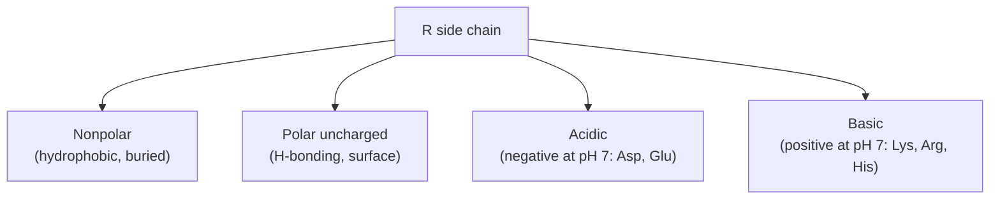

## Biochem::Peptides_and_Proteins

### LESSON-BIOCHEM-PEPTIDES-AND-PROTEINS

- **KC:** `Biochem::Peptides_and_Proteins`
- **Title:** Peptides and Proteins: The Peptide Bond
- **Section:** `MCAT::Bio_Biochem`
- **Source:** authored
- **Review Status:** needs_review
- **Overview:** Peptides and proteins are chains of amino acids joined by peptide
  (amide) bonds. The order of residues and the direction of the chain
  (N-terminus to C-terminus) define the primary structure everything else is
  built on. Reading and writing sequences in the right direction is a basic
  skill the rest of biochemistry assumes.
- **Key Concepts:**
  - A peptide bond is an amide formed by a condensation (dehydration) reaction
    between one residue's carboxyl and the next residue's amino group, releasing
    water.
  - Chains have direction: a free amino group at the N-terminus, a free carboxyl
    at the C-terminus; sequences are written and synthesized N to C.
  - The peptide bond is planar and rigid because of resonance (partial
    double-bond character), which restricts backbone rotation.
  - Hydrolysis (adding water, usually acid- or enzyme-catalyzed) breaks peptide
    bonds back into free amino acids.
- **Prerequisite Reminder:** Build on `Biochem::Amino_Acids` (the monomers and
  their side chains) and `Orgo::Acid_Derivatives` (an amide is the
  acyl-substitution product that forms the backbone).
- **Worked Example:** Join alanine and glycine as Ala-Gly. Alanine's carboxyl
  reacts with glycine's amino group, water leaves, and an amide bond forms; the
  dipeptide now has alanine's free amino group at the N-terminus and glycine's
  free carboxyl at the C-terminus. "Ala-Gly" and "Gly-Ala" are different
  molecules because the chain has direction.
- **Common Misconception:** "A peptide sequence can be read in either
  direction." The chain has a fixed polarity (N to C), so Ala-Gly and Gly-Ala
  are distinct peptides - just as a word spelled backward is a different word.
- **First Retrieval Prompt:** From memory, state which two functional groups
  react to form a peptide bond, what small molecule is released, and which end of
  the chain is the N-terminus.
- **Related KCs:** `Biochem::Amino_Acids`, `Orgo::Acid_Derivatives`,
  `Biochem::Protein_Structure_and_Function`,
  `Biochem::Chromatography_and_Separations`,
  `Biochem::Electrophoresis_and_Immunoassays`, `Bio::Translation`
- **Diagram:** Peptide bond formation: two amino acids undergo a condensation (dehydration) reaction that releases water and forms a planar peptide (amide) bond, giving a dipeptide with a free N-terminus and a free C-terminus

<figure class="lesson-diagram">
<svg xmlns="http://www.w3.org/2000/svg" viewBox="0 0 540 440" role="img" aria-labelledby="t d" font-family="-apple-system, Segoe UI, Roboto, sans-serif">
  <title id="t">Peptide bond formation by condensation</title>
  <desc id="d">Two amino acids join in a condensation (dehydration) reaction: the carboxyl of the first reacts with the amino group of the second, releasing water and forming a planar peptide (amide) bond. The dipeptide has a free amino N-terminus and a free carboxyl C-terminus.</desc>
  <rect x="6" y="6" width="528" height="428" rx="14" fill="#ffffff" stroke="#cfd8dc" stroke-width="2"/>
  <text x="270" y="40" text-anchor="middle" font-size="18" font-weight="700" fill="#263238">Peptide bond formation (loses H2O)</text>

  <rect x="34" y="74" width="200" height="60" rx="10" fill="#e3f2fd" stroke="#1565c0" stroke-width="2"/>
  <text x="134" y="100" text-anchor="middle" font-size="15" font-weight="700" fill="#0d47a1">Amino acid 1</text>
  <text x="134" y="122" text-anchor="middle" font-size="12" fill="#1565c0">reactive &#8212;COOH</text>

  <text x="262" y="112" text-anchor="middle" font-size="22" font-weight="700" fill="#37474f">+</text>

  <rect x="290" y="74" width="200" height="60" rx="10" fill="#e3f2fd" stroke="#1565c0" stroke-width="2"/>
  <text x="390" y="100" text-anchor="middle" font-size="15" font-weight="700" fill="#0d47a1">Amino acid 2</text>
  <text x="390" y="122" text-anchor="middle" font-size="12" fill="#1565c0">reactive H2N&#8212;</text>

  <line x1="270" y1="140" x2="270" y2="232" stroke="#607d8b" stroke-width="3"/>
  <polygon points="264,224 276,224 270,238" fill="#607d8b"/>
  <circle cx="200" cy="188" r="18" fill="#b3e5fc" stroke="#0288d1" stroke-width="2"/>
  <text x="200" y="193" text-anchor="middle" font-size="12" font-weight="700" fill="#01579b">H2O</text>
  <text x="304" y="182" text-anchor="start" font-size="12" fill="#37474f">condensation</text>
  <text x="304" y="200" text-anchor="start" font-size="11" fill="#607d8b">(dehydration)</text>

  <rect x="50" y="250" width="440" height="112" rx="12" fill="#fff8e1" stroke="#ef6c00" stroke-width="2"/>
  <rect x="196" y="286" width="148" height="30" rx="6" fill="#ffe0b2"/>
  <text x="270" y="307" text-anchor="middle" font-size="16" font-weight="700" fill="#263238">+H3N&#8212;CHR&#8212;CO&#8212;NH&#8212;CHR&#8212;COO&#8722;</text>
  <text x="270" y="338" text-anchor="middle" font-size="12" font-weight="700" fill="#e65100">peptide (amide) bond &#8212; planar</text>
  <text x="96" y="338" text-anchor="middle" font-size="11" fill="#37474f">N-terminus</text>
  <text x="444" y="338" text-anchor="middle" font-size="11" fill="#37474f">C-terminus</text>

  <text x="270" y="404" text-anchor="middle" font-size="12" fill="#607d8b">Chain has direction: N-terminus &#8594; C-terminus</text>
</svg>
</figure>

## Biochem::Protein_Structure_and_Function

### LESSON-BIOCHEM-PROTEIN-STRUCTURE-AND-FUNCTION

- **KC:** `Biochem::Protein_Structure_and_Function`
- **Title:** Protein Structure and Function: Four Levels of Organization
- **Section:** `MCAT::Bio_Biochem`
- **Source:** authored
- **Review Status:** needs_review
- **Overview:** Proteins fold into specific 3-D shapes organized in up to four
  levels - primary, secondary, tertiary, and quaternary. Each level is
  stabilized by a characteristic set of interactions, and the final shape is what
  lets a protein do its job. "Structure determines function" is the central
  theme.
- **Key Concepts:**
  - Primary = the amino-acid sequence; secondary = local backbone patterns
    (alpha-helix, beta-sheet) held by backbone hydrogen bonds.
  - Tertiary = the overall 3-D fold of one chain, stabilized by side-chain
    interactions (hydrophobic packing, hydrogen bonds, salt bridges, disulfides).
  - Quaternary = the assembly of multiple folded subunits into one functional
    complex (e.g., hemoglobin's four chains).
  - Losing the 3-D shape (denaturation) usually destroys function even when the
    primary sequence is intact.
- **Prerequisite Reminder:** Build on `Biochem::Peptides_and_Proteins` (the
  backbone being folded), `GenChem::Chemical_Bonding` (covalent disulfides), and
  `GenChem::Intermolecular_Forces` (the noncovalent forces that stabilize the
  fold).
- **Worked Example:** An alpha-helix is stabilized by hydrogen bonds between
  backbone C=O and N-H groups four residues apart, not by side chains. So
  swapping one surface side chain for another of similar character usually leaves
  the helix intact, while inserting a proline (whose ring locks the backbone and
  lacks an amide H) tends to break it. The useful question is always "which level
  does this interaction stabilize?"
- **Common Misconception:** "Secondary structure is held together by R-group
  (side-chain) interactions." Alpha-helices and beta-sheets are stabilized by
  hydrogen bonds along the polypeptide backbone; side-chain interactions dominate
  tertiary structure, not secondary.
- **First Retrieval Prompt:** From memory, match each level of structure to the
  main interaction that stabilizes it, and explain why denaturation can abolish
  function without cutting the chain.
- **Related KCs:** `Biochem::Peptides_and_Proteins`, `GenChem::Chemical_Bonding`,
  `GenChem::Intermolecular_Forces`, `Biochem::Enzymes`,
  `Biochem::Protein_Folding_and_Stability`,
  `Biochem::Nonenzymatic_Protein_Function`, `Biochem::Membranes_and_Transport`,
  `Bio::Cell_Signaling`, `Bio::Immune_System`
- **Diagram:** Four levels of protein structure: primary amino-acid sequence, secondary alpha-helix and beta-sheet held by backbone hydrogen bonds, tertiary three-dimensional fold of one chain, and quaternary assembly of multiple subunits

<figure class="lesson-diagram">
<svg xmlns="http://www.w3.org/2000/svg" viewBox="0 0 540 440" role="img" aria-labelledby="t d" font-family="-apple-system, Segoe UI, Roboto, sans-serif">
  <title id="t">Four levels of protein structure</title>
  <desc id="d">Primary is the amino-acid sequence. Secondary is local backbone patterns (alpha-helix and beta-sheet) held by backbone hydrogen bonds. Tertiary is the overall three-dimensional fold of one chain. Quaternary is the assembly of multiple folded subunits.</desc>
  <rect x="6" y="6" width="528" height="428" rx="14" fill="#ffffff" stroke="#cfd8dc" stroke-width="2"/>
  <text x="270" y="36" text-anchor="middle" font-size="18" font-weight="700" fill="#263238">Protein structure &#8212; four levels</text>

  <rect x="24" y="52" width="234" height="162" rx="10" fill="#f7f9fa" stroke="#cfd8dc" stroke-width="1.5"/>
  <text x="141" y="80" text-anchor="middle" font-size="15" font-weight="700" fill="#263238">1. Primary</text>
  <text x="141" y="100" text-anchor="middle" font-size="12" fill="#607d8b">amino-acid sequence</text>
  <line x1="60" y1="150" x2="222" y2="150" stroke="#607d8b" stroke-width="2"/>
  <circle cx="66" cy="150" r="10" fill="#b0bec5" stroke="#607d8b" stroke-width="2"/>
  <circle cx="102" cy="150" r="10" fill="#b0bec5" stroke="#607d8b" stroke-width="2"/>
  <circle cx="138" cy="150" r="10" fill="#b0bec5" stroke="#607d8b" stroke-width="2"/>
  <circle cx="174" cy="150" r="10" fill="#b0bec5" stroke="#607d8b" stroke-width="2"/>
  <circle cx="210" cy="150" r="10" fill="#b0bec5" stroke="#607d8b" stroke-width="2"/>
  <text x="50" y="154" text-anchor="middle" font-size="12" font-weight="700" fill="#37474f">N</text>
  <text x="228" y="154" text-anchor="middle" font-size="12" font-weight="700" fill="#37474f">C</text>
  <text x="141" y="192" text-anchor="middle" font-size="11" fill="#90a4ae">residue order</text>

  <rect x="282" y="52" width="234" height="162" rx="10" fill="#f7f9fa" stroke="#cfd8dc" stroke-width="1.5"/>
  <text x="399" y="80" text-anchor="middle" font-size="15" font-weight="700" fill="#263238">2. Secondary</text>
  <text x="399" y="100" text-anchor="middle" font-size="12" fill="#607d8b">backbone H-bonds</text>
  <rect x="300" y="118" width="94" height="30" rx="15" fill="#90caf9" stroke="#1565c0" stroke-width="2"/>
  <g stroke="#1565c0" stroke-width="1.5">
    <line x1="314" y1="146" x2="328" y2="120"/>
    <line x1="338" y1="146" x2="352" y2="120"/>
    <line x1="362" y1="146" x2="376" y2="120"/>
  </g>
  <text x="347" y="168" text-anchor="middle" font-size="11" fill="#1565c0">alpha-helix</text>
  <line x1="410" y1="124" x2="492" y2="124" stroke="#2e7d32" stroke-width="6"/>
  <polygon points="492,118 506,124 492,130" fill="#2e7d32"/>
  <line x1="410" y1="140" x2="492" y2="140" stroke="#2e7d32" stroke-width="6"/>
  <polygon points="492,134 506,140 492,146" fill="#2e7d32"/>
  <text x="456" y="168" text-anchor="middle" font-size="11" fill="#2e7d32">beta-sheet</text>

  <rect x="24" y="228" width="234" height="162" rx="10" fill="#f7f9fa" stroke="#cfd8dc" stroke-width="1.5"/>
  <text x="141" y="256" text-anchor="middle" font-size="15" font-weight="700" fill="#263238">3. Tertiary</text>
  <text x="141" y="276" text-anchor="middle" font-size="12" fill="#607d8b">one chain, 3-D fold</text>
  <path d="M60,360 C 96,300 150,306 156,342 C 160,372 214,372 214,336 C 214,300 168,300 120,320 C 92,332 84,352 100,362" fill="none" stroke="#ef6c00" stroke-width="4" stroke-linecap="round" stroke-linejoin="round"/>

  <rect x="282" y="228" width="234" height="162" rx="10" fill="#f7f9fa" stroke="#cfd8dc" stroke-width="1.5"/>
  <text x="399" y="256" text-anchor="middle" font-size="15" font-weight="700" fill="#263238">4. Quaternary</text>
  <text x="399" y="276" text-anchor="middle" font-size="12" fill="#607d8b">assembled subunits</text>
  <circle cx="375" cy="316" r="24" fill="#ef9a9a" stroke="#c62828" stroke-width="2"/>
  <circle cx="423" cy="316" r="24" fill="#90caf9" stroke="#1565c0" stroke-width="2"/>
  <circle cx="375" cy="352" r="24" fill="#a5d6a7" stroke="#2e7d32" stroke-width="2"/>
  <circle cx="423" cy="352" r="24" fill="#ffcc80" stroke="#ef6c00" stroke-width="2"/>
  <text x="399" y="386" text-anchor="middle" font-size="11" fill="#607d8b">e.g., hemoglobin (4)</text>

  <text x="270" y="416" text-anchor="middle" font-size="12" fill="#607d8b">Structure determines function; denaturation unfolds it</text>
</svg>
</figure>
- **Diagram:** Each level and the interaction that stabilizes it:

```mermaid
flowchart LR
    P1["1&#176; Primary: sequence"] --> F1["peptide (covalent) bonds"]
    P2["2&#176; Secondary: helix / sheet"] --> F2["backbone hydrogen bonds"]
    P3["3&#176; Tertiary: 3-D fold"] --> F3["side-chain interactions:<br/>hydrophobic, H-bonds, salt bridges, disulfides"]
    P4["4&#176; Quaternary: subunits"] --> F4["subunit contacts (same forces)"]
```

## Biochem::Protein_Folding_and_Stability

### LESSON-BIOCHEM-PROTEIN-FOLDING-AND-STABILITY

- **KC:** `Biochem::Protein_Folding_and_Stability`
- **Title:** Protein Folding and Stability: The Hydrophobic Effect
- **Section:** `MCAT::Chem_Phys`
- **Source:** authored
- **Review Status:** needs_review
- **Overview:** Folding is the thermodynamically driven process that takes a
  floppy chain to its functional native state. The dominant driver in water is
  the hydrophobic effect, and stability reflects a small net free-energy
  difference between folded and unfolded states. Because that margin is small,
  proteins denature readily and often need help folding.
- **Key Concepts:**
  - The hydrophobic effect is largely entropic: burying nonpolar side chains
    releases ordered water, raising the system's overall entropy.
  - Native stability is a small ΔG from the balance of enthalpy (contacts) and
    entropy (chain vs water); folded proteins are only marginally stable.
  - Chaperones help proteins fold correctly and prevent aggregation; they do not
    encode the final structure (the sequence does).
  - Denaturation by heat, pH, or denaturants disrupts noncovalent interactions;
    misfolding/aggregation underlies diseases (amyloids, prions).
- **Prerequisite Reminder:** Build on `Biochem::Protein_Structure_and_Function`
  (the native fold being stabilized), `GenChem::Intermolecular_Forces`, and
  `GenChem::Thermochemistry` (the enthalpy/entropy bookkeeping behind ΔG).
- **Worked Example:** Why does folding get an entropic boost? Unfolded protein
  forces water into ordered "cages" around exposed nonpolar groups. Folding
  buries those groups and frees that water, so the system's entropy rises; the
  -TΔS term then makes ΔG for folding more negative near body temperature. The
  fold is driven less by nonpolar groups "attracting" and more by water gaining
  entropy.
- **Common Misconception:** "Hydrophobic side chains fold inward because they are
  attracted to each other." The main driver is water's entropy: the system
  minimizes ordered water around nonpolar surfaces, which pushes them together -
  an entropic effect, not a strong direct attraction.
- **First Retrieval Prompt:** From memory, explain what the hydrophobic effect
  contributes to folding and why it is described as entropy-driven rather than a
  simple attraction.
- **Related KCs:** `Biochem::Protein_Structure_and_Function`,
  `GenChem::Intermolecular_Forces`, `GenChem::Thermochemistry`
- **Diagram:** The hydrophobic effect drives folding: an unfolded chain exposes nonpolar side chains and forces water into ordered cages, while folding buries those groups in a core and releases the water, raising entropy so the native state forms but is only marginally stable

<figure class="lesson-diagram">
<svg xmlns="http://www.w3.org/2000/svg" viewBox="0 0 540 440" role="img" aria-labelledby="t d" font-family="-apple-system, Segoe UI, Roboto, sans-serif">
  <title id="t">Protein folding and the hydrophobic effect</title>
  <desc id="d">An unfolded chain exposes nonpolar side chains, forcing water into ordered cages (low entropy). Folding buries those nonpolar groups in a core and releases that water (higher entropy). Folding is driven by the increase in water entropy, and the native state is only marginally stable.</desc>
  <rect x="6" y="6" width="528" height="428" rx="14" fill="#ffffff" stroke="#cfd8dc" stroke-width="2"/>
  <text x="270" y="36" text-anchor="middle" font-size="18" font-weight="700" fill="#263238">Protein folding &#8212; the hydrophobic effect</text>

  <rect x="24" y="54" width="214" height="300" rx="12" fill="#f7f9fa" stroke="#cfd8dc" stroke-width="1.5"/>
  <text x="131" y="82" text-anchor="middle" font-size="15" font-weight="700" fill="#263238">Unfolded</text>
  <path d="M56,116 C 100,100 92,150 128,146 C 172,140 150,196 104,198 C 66,200 74,250 122,252 C 168,254 150,292 112,292" fill="none" stroke="#607d8b" stroke-width="3" stroke-linecap="round"/>
  <circle cx="128" cy="146" r="9" fill="#ffb74d" stroke="#ef6c00" stroke-width="2"/>
  <circle cx="122" cy="252" r="9" fill="#ffb74d" stroke="#ef6c00" stroke-width="2"/>
  <g fill="#bbdefb" stroke="#64b5f6" stroke-width="1">
    <circle cx="104" cy="181" r="4"/>
    <circle cx="119" cy="190" r="4"/>
    <circle cx="119" cy="207" r="4"/>
    <circle cx="104" cy="216" r="4"/>
    <circle cx="89" cy="207" r="4"/>
    <circle cx="89" cy="190" r="4"/>
  </g>
  <circle cx="104" cy="198" r="9" fill="#ffb74d" stroke="#ef6c00" stroke-width="2"/>
  <text x="131" y="316" text-anchor="middle" font-size="11" fill="#ef6c00">nonpolar groups exposed</text>
  <text x="131" y="334" text-anchor="middle" font-size="11" fill="#1976d2">ordered water (low entropy)</text>

  <line x1="246" y1="200" x2="298" y2="200" stroke="#37474f" stroke-width="4"/>
  <polygon points="298,192 314,200 298,208" fill="#37474f"/>
  <text x="282" y="188" text-anchor="middle" font-size="12" font-weight="700" fill="#37474f">fold</text>
  <line x1="300" y1="222" x2="252" y2="222" stroke="#b0bec5" stroke-width="2" stroke-dasharray="5 4"/>
  <polygon points="252,217 242,222 252,227" fill="#b0bec5"/>
  <text x="282" y="240" text-anchor="middle" font-size="10" fill="#90a4ae">denature</text>

  <rect x="302" y="54" width="214" height="300" rx="12" fill="#f7f9fa" stroke="#cfd8dc" stroke-width="1.5"/>
  <text x="409" y="82" text-anchor="middle" font-size="15" font-weight="700" fill="#263238">Folded (native)</text>
  <circle cx="395" cy="196" r="70" fill="#eceff1" stroke="#90a4ae" stroke-width="2"/>
  <g fill="#ffb74d" stroke="#ef6c00" stroke-width="2">
    <circle cx="380" cy="188" r="9"/>
    <circle cx="406" cy="194" r="9"/>
    <circle cx="392" cy="212" r="9"/>
    <circle cx="412" cy="176" r="9"/>
  </g>
  <g fill="#90caf9" stroke="#1565c0" stroke-width="2">
    <circle cx="395" cy="130" r="8"/>
    <circle cx="460" cy="182" r="8"/>
    <circle cx="450" cy="240" r="8"/>
    <circle cx="356" cy="248" r="8"/>
    <circle cx="336" cy="170" r="8"/>
  </g>
  <g fill="#bbdefb" stroke="#64b5f6" stroke-width="1">
    <circle cx="322" cy="108" r="4"/>
    <circle cx="486" cy="120" r="4"/>
    <circle cx="500" cy="250" r="4"/>
    <circle cx="470" cy="300" r="4"/>
    <circle cx="330" cy="300" r="4"/>
    <circle cx="314" cy="150" r="4"/>
  </g>
  <text x="409" y="316" text-anchor="middle" font-size="11" fill="#ef6c00">nonpolar core buried</text>
  <text x="409" y="334" text-anchor="middle" font-size="11" fill="#1976d2">water released (high entropy)</text>

  <text x="270" y="384" text-anchor="middle" font-size="12" fill="#37474f">Burying nonpolar groups frees ordered water, so water entropy rises</text>
  <text x="270" y="406" text-anchor="middle" font-size="12" fill="#607d8b">&#916;S(system) up &#8594; &#916;G(folding) &lt; 0 &#183; native state only marginally stable</text>
</svg>
</figure>

## Biochem::Nonenzymatic_Protein_Function

### LESSON-BIOCHEM-NONENZYMATIC-PROTEIN-FUNCTION

- **KC:** `Biochem::Nonenzymatic_Protein_Function`
- **Title:** Nonenzymatic Protein Function: Binding, Transport, and Motors
- **Section:** `MCAT::Bio_Biochem`
- **Source:** authored
- **Review Status:** needs_review
- **Overview:** Many proteins do their jobs without catalyzing a reaction - they
  bind, transport, defend, and generate force. Binding proteins like hemoglobin
  show how quaternary structure enables cooperativity and regulation. These
  behaviors follow from structure but are best read off binding curves and
  physiological context.
- **Key Concepts:**
  - Myoglobin (one subunit) binds O2 with a hyperbolic curve; hemoglobin (four
    subunits) is cooperative, giving a sigmoidal curve.
  - Cooperativity: O2 binding to one hemoglobin subunit raises the others'
    affinity, ideal for loading in the lungs and unloading in tissues.
  - Regulators shift hemoglobin's curve: low pH, high CO2, and 2,3-BPG lower
    affinity (right shift, the Bohr effect).
  - Other nonenzymatic roles: antibodies (recognition), motor proteins
    (movement), and structural/cytoskeletal proteins (support).
- **Prerequisite Reminder:** Build on
  `Biochem::Protein_Structure_and_Function`: cooperativity and binding come from
  how folded subunits are arranged and communicate.
- **Worked Example:** During exercise, muscle produces CO2 and H+ and warms up.
  Each of these right-shifts hemoglobin's O2 curve (the Bohr effect), lowering
  affinity exactly where O2 is needed, so hemoglobin unloads more oxygen to
  active tissue. Myoglobin, with higher affinity and a hyperbolic curve, holds
  its O2 until demand is very high.
- **Common Misconception:** "Myoglobin is cooperative like hemoglobin."
  Myoglobin has a single binding site, so it cannot be cooperative; its curve is
  hyperbolic. Cooperativity requires multiple interacting subunits, as in
  hemoglobin.
- **First Retrieval Prompt:** From memory, contrast the O2-binding curves of
  myoglobin and hemoglobin and explain why a right shift helps deliver oxygen to
  exercising muscle.
- **Related KCs:** `Biochem::Protein_Structure_and_Function`
- **Diagram:** Oxygen-binding curves: myoglobin is hyperbolic and high-affinity while hemoglobin is sigmoidal and cooperative, with a Bohr right shift at low pH, high carbon dioxide, and 2,3-BPG that unloads oxygen in tissues

<figure class="lesson-diagram">
<svg xmlns="http://www.w3.org/2000/svg" viewBox="0 0 540 440" role="img" aria-labelledby="t d" font-family="-apple-system, Segoe UI, Roboto, sans-serif">
  <title id="t">Oxygen-binding curves of myoglobin and hemoglobin</title>
  <desc id="d">Percent oxygen saturation versus partial pressure of oxygen. Myoglobin gives a hyperbolic, high-affinity curve. Hemoglobin gives a sigmoidal, cooperative curve. Lower pH, higher carbon dioxide, and 2,3-BPG shift the hemoglobin curve to the right (the Bohr effect), lowering affinity to unload oxygen in tissues.</desc>
  <rect x="6" y="6" width="528" height="428" rx="14" fill="#ffffff" stroke="#cfd8dc" stroke-width="2"/>
  <text x="270" y="36" text-anchor="middle" font-size="18" font-weight="700" fill="#263238">Oxygen binding &#8212; myoglobin vs hemoglobin</text>

  <line x1="80" y1="220" x2="490" y2="220" stroke="#cfd8dc" stroke-width="1.5" stroke-dasharray="5 4"/>
  <line x1="80" y1="70" x2="80" y2="360" stroke="#607d8b" stroke-width="2"/>
  <line x1="80" y1="360" x2="490" y2="360" stroke="#607d8b" stroke-width="2"/>

  <g stroke="#607d8b" stroke-width="2">
    <line x1="74" y1="360" x2="80" y2="360"/>
    <line x1="74" y1="220" x2="80" y2="220"/>
    <line x1="74" y1="80" x2="80" y2="80"/>
  </g>
  <text x="66" y="364" text-anchor="end" font-size="11" fill="#607d8b">0</text>
  <text x="66" y="224" text-anchor="end" font-size="11" fill="#607d8b">50</text>
  <text x="66" y="84" text-anchor="end" font-size="11" fill="#607d8b">100</text>
  <text transform="rotate(-90 34 220)" x="34" y="220" text-anchor="middle" font-size="12" fill="#37474f">O2 saturation (%)</text>
  <text x="285" y="392" text-anchor="middle" font-size="12" fill="#37474f">pO2 (partial pressure of O2)</text>

  <path d="M80,360 C 96,190 128,120 190,112 C 300,102 400,100 486,100" fill="none" stroke="#2e7d32" stroke-width="3"/>
  <path d="M80,356 C 150,352 190,338 240,250 C 280,180 340,126 486,116" fill="none" stroke="#1565c0" stroke-width="3"/>
  <path d="M110,357 C 190,354 235,344 290,262 C 335,196 395,150 486,132" fill="none" stroke="#1565c0" stroke-width="2.5" stroke-dasharray="6 5"/>

  <line x1="246" y1="250" x2="292" y2="258" stroke="#c62828" stroke-width="2"/>
  <polygon points="286,250 296,260 282,262" fill="#c62828"/>
  <text x="360" y="238" text-anchor="middle" font-size="11" font-weight="700" fill="#c62828">right shift (Bohr)</text>
  <text x="360" y="254" text-anchor="middle" font-size="10" fill="#b71c1c">low pH &#183; high CO2 &#183; 2,3-BPG</text>

  <g>
    <line x1="306" y1="308" x2="332" y2="308" stroke="#2e7d32" stroke-width="3"/>
    <text x="338" y="312" text-anchor="start" font-size="11" fill="#2e7d32">myoglobin (hyperbolic)</text>
    <line x1="306" y1="328" x2="332" y2="328" stroke="#1565c0" stroke-width="3"/>
    <text x="338" y="332" text-anchor="start" font-size="11" fill="#1565c0">hemoglobin (sigmoidal)</text>
    <line x1="306" y1="348" x2="332" y2="348" stroke="#1565c0" stroke-width="2.5" stroke-dasharray="6 5"/>
    <text x="338" y="352" text-anchor="start" font-size="11" fill="#1565c0">hemoglobin, right-shifted</text>
  </g>
</svg>
</figure>

## Biochem::Enzymes

### LESSON-BIOCHEM-ENZYMES

- **KC:** `Biochem::Enzymes`
- **Title:** Enzymes: Catalysts and Kinetics
- **Section:** `MCAT::Bio_Biochem`
- **Source:** authored
- **Review Status:** approved
- **Overview:** Enzymes are protein catalysts that speed up reactions by
  lowering activation energy without being consumed. Their shape gives them
  specificity, and simple kinetics let us describe how fast they work.
- **Key Concepts:**
  - Enzymes lower activation energy; they do not change the reaction's overall
    energy difference or equilibrium position.
  - The substrate binds a specific active site; shape and chemistry make the fit
    selective.
  - Michaelis-Menten kinetics: Vmax is the maximum rate; Km is the substrate
    concentration at half of Vmax and reflects apparent affinity.
  - Inhibitors change apparent kinetics: competitive inhibitors raise apparent
    Km (same Vmax); noncompetitive inhibitors lower Vmax.
- **Prerequisite Reminder:** Build on `Biochem::Protein_Structure_and_Function`:
  an enzyme's catalytic power comes from its folded 3-D active site, so the same
  forces that fold proteins determine how substrates bind.
- **Worked Example:** Add a competitive inhibitor that resembles the substrate.
  Adding more substrate out-competes it, so the reaction can still reach the same
  Vmax, but it takes more substrate to get to half-max - so measured Km goes up
  while Vmax is unchanged.
- **Common Misconception:** "Enzymes make reactions more thermodynamically
  favorable." Enzymes only change the *rate* (the kinetic barrier). They cannot
  make a non-spontaneous reaction spontaneous or shift the equilibrium constant.
- **First Retrieval Prompt:** From memory, describe what happens to Km and Vmax
  under competitive inhibition, and explain why adding substrate helps.
- **Related KCs:** `Biochem::Protein_Structure_and_Function`,
  `Biochem::Bioenergetics`, `Biochem::Enzyme_Kinetics`,
  `Biochem::Metabolic_Regulation`, `Biochem::Vitamins_and_Cofactors`,
  `Bio::Digestive_System`, `Bio::DNA_Replication`
- **Diagram:** Reaction-coordinate diagram: the enzyme-catalyzed path has a lower activation-energy barrier than the uncatalyzed path, while the overall free-energy change between substrate and product is unchanged

<figure class="lesson-diagram">
<svg xmlns="http://www.w3.org/2000/svg" viewBox="0 0 540 440" role="img" aria-labelledby="t d" font-family="-apple-system, Segoe UI, Roboto, sans-serif">
  <title id="t">Enzyme reaction-coordinate diagram</title>
  <desc id="d">Free energy versus reaction progress. The uncatalyzed reaction has a high activation-energy barrier; the enzyme-catalyzed reaction has a lower barrier. Both share the same reactant and product energies, so the overall free-energy change is unchanged. The enzyme lowers activation energy only.</desc>
  <rect x="6" y="6" width="528" height="428" rx="14" fill="#ffffff" stroke="#cfd8dc" stroke-width="2"/>
  <text x="270" y="36" text-anchor="middle" font-size="18" font-weight="700" fill="#263238">Enzymes lower activation energy (not &#916;G)</text>

  <line x1="80" y1="60" x2="80" y2="360" stroke="#607d8b" stroke-width="2"/>
  <line x1="80" y1="360" x2="490" y2="360" stroke="#607d8b" stroke-width="2"/>
  <text transform="rotate(-90 40 210)" x="40" y="210" text-anchor="middle" font-size="12" fill="#37474f">Free energy (G)</text>
  <text x="285" y="392" text-anchor="middle" font-size="12" fill="#37474f">Reaction progress</text>

  <line x1="110" y1="190" x2="440" y2="190" stroke="#cfd8dc" stroke-width="1.5" stroke-dasharray="5 4"/>
  <line x1="250" y1="300" x2="470" y2="300" stroke="#cfd8dc" stroke-width="1.5" stroke-dasharray="5 4"/>

  <path d="M110,190 C 175,186 210,106 248,106 C 300,106 336,300 470,300" fill="none" stroke="#c62828" stroke-width="3"/>
  <path d="M110,190 C 175,188 214,170 256,170 C 300,170 336,300 470,300" fill="none" stroke="#2e7d32" stroke-width="2.5" stroke-dasharray="7 5"/>

  <text x="150" y="118" text-anchor="middle" font-size="11" font-weight="700" fill="#c62828">higher Ea (no enzyme)</text>
  <line x1="150" y1="126" x2="238" y2="110" stroke="#c62828" stroke-width="1.5"/>
  <text x="368" y="150" text-anchor="middle" font-size="11" font-weight="700" fill="#2e7d32">lower Ea (with enzyme)</text>
  <line x1="330" y1="156" x2="270" y2="172" stroke="#2e7d32" stroke-width="1.5"/>

  <line x1="430" y1="190" x2="430" y2="300" stroke="#37474f" stroke-width="2"/>
  <polygon points="425,196 435,196 430,188" fill="#37474f"/>
  <polygon points="425,294 435,294 430,302" fill="#37474f"/>
  <text x="444" y="250" text-anchor="start" font-size="13" font-weight="700" fill="#37474f">&#916;G</text>
  <text x="444" y="266" text-anchor="start" font-size="10" fill="#607d8b">(unchanged)</text>

  <text x="120" y="184" text-anchor="start" font-size="11" fill="#455a64">substrate</text>
  <text x="452" y="316" text-anchor="middle" font-size="11" fill="#455a64">product</text>

  <text x="270" y="416" text-anchor="middle" font-size="12" fill="#607d8b">Enzyme speeds the rate; it does not shift equilibrium or make a reaction spontaneous</text>
</svg>
</figure>

## Biochem::Enzyme_Kinetics

### LESSON-BIOCHEM-ENZYME-KINETICS

- **KC:** `Biochem::Enzyme_Kinetics`
- **Title:** Enzyme Kinetics: Michaelis-Menten and Km/Vmax
- **Section:** `MCAT::Chem_Phys`
- **Source:** authored
- **Review Status:** needs_review
- **Overview:** Enzyme kinetics quantifies how reaction rate depends on substrate
  concentration. The Michaelis-Menten model gives two key parameters - Vmax and
  Km - that summarize an enzyme's speed and apparent affinity. Linearized plots
  make these easy to read off experimentally.
- **Key Concepts:**
  - Rate rises with [S] and saturates at Vmax when all active sites are occupied.
  - Km is the [S] at half of Vmax; a lower Km means higher apparent affinity for
    substrate.
  - kcat (turnover number) is the maximum reactions per active site per time;
    kcat/Km measures catalytic efficiency.
  - A Lineweaver-Burk (double-reciprocal) plot linearizes the data:
    y-intercept = 1/Vmax, x-intercept = -1/Km.
- **Prerequisite Reminder:** Build on `Biochem::Enzymes` (active sites and
  catalysis) and `GenChem::Kinetics` (rate laws and rate-limiting steps).
- **Worked Example:** An enzyme has Vmax = 100 μmol/min and Km = 5 mM. At
  [S] = 5 mM the rate is half of Vmax, i.e., 50 μmol/min, by the definition of
  Km. At [S] = 50 mM (well above Km) the enzyme is nearly saturated, so the rate
  approaches 100 μmol/min. Notice that adding still more substrate barely helps
  once you are well past Km.
- **Common Misconception:** "Km measures how fast an enzyme works." Km is a
  concentration (the [S] for half-max rate) and reflects apparent affinity, not
  speed; turnover speed is captured by kcat/Vmax. A low-Km enzyme is not
  necessarily a fast one.
- **First Retrieval Prompt:** From memory, define Km in words, state what the
  rate equals when [S] = Km, and explain what a low Km implies about affinity.
- **Related KCs:** `Biochem::Enzymes`, `GenChem::Kinetics`,
  `Biochem::Enzyme_Inhibition`
- **Diagram:** Michaelis-Menten curve of rate versus substrate concentration saturating at Vmax with Km marked at half of Vmax, shown beside the Lineweaver-Burk double-reciprocal plot whose y-intercept is 1 over Vmax and x-intercept is minus 1 over Km

<figure class="lesson-diagram">
<svg xmlns="http://www.w3.org/2000/svg" viewBox="0 0 540 440" role="img" aria-labelledby="t d" font-family="-apple-system, Segoe UI, Roboto, sans-serif">
  <title id="t">Michaelis-Menten and Lineweaver-Burk plots</title>
  <desc id="d">Panel a: rate v versus substrate concentration is a rectangular hyperbola that saturates at Vmax; Km is the substrate concentration at half of Vmax. Panel b: the double-reciprocal Lineweaver-Burk plot linearizes the data, with a y-intercept of 1 over Vmax and an x-intercept of minus 1 over Km.</desc>
  <rect x="6" y="6" width="528" height="428" rx="14" fill="#ffffff" stroke="#cfd8dc" stroke-width="2"/>
  <text x="270" y="34" text-anchor="middle" font-size="17" font-weight="700" fill="#263238">Enzyme kinetics &#8212; two views</text>

  <text x="285" y="72" text-anchor="middle" font-size="13" font-weight="700" fill="#455a64">(a) v vs [S]: rate saturates at Vmax</text>
  <line x1="100" y1="80" x2="100" y2="210" stroke="#607d8b" stroke-width="2"/>
  <line x1="100" y1="210" x2="470" y2="210" stroke="#607d8b" stroke-width="2"/>
  <line x1="100" y1="96" x2="470" y2="96" stroke="#cfd8dc" stroke-width="1.5" stroke-dasharray="5 4"/>
  <line x1="100" y1="153" x2="330" y2="153" stroke="#cfd8dc" stroke-width="1.5" stroke-dasharray="5 4"/>
  <line x1="170" y1="210" x2="170" y2="153" stroke="#cfd8dc" stroke-width="1.5" stroke-dasharray="5 4"/>
  <path d="M100,210 C 128,180 150,162 170,153 C 240,128 340,104 470,98" fill="none" stroke="#1565c0" stroke-width="3"/>
  <text x="466" y="92" text-anchor="end" font-size="11" font-weight="700" fill="#37474f">Vmax</text>
  <text x="150" y="149" text-anchor="middle" font-size="10" fill="#607d8b">Vmax/2</text>
  <text x="170" y="224" text-anchor="middle" font-size="11" font-weight="700" fill="#37474f">Km</text>
  <text transform="rotate(-90 74 150)" x="74" y="150" text-anchor="middle" font-size="12" fill="#37474f">v</text>
  <text x="285" y="236" text-anchor="middle" font-size="12" fill="#37474f">[S]</text>

  <text x="285" y="272" text-anchor="middle" font-size="13" font-weight="700" fill="#455a64">(b) Lineweaver-Burk: 1/v vs 1/[S]</text>
  <line x1="250" y1="288" x2="250" y2="412" stroke="#607d8b" stroke-width="2"/>
  <line x1="110" y1="380" x2="470" y2="380" stroke="#607d8b" stroke-width="2"/>
  <line x1="250" y1="330" x2="450" y2="205" fill="none" stroke="#1565c0" stroke-width="3"/>
  <line x1="250" y1="330" x2="160" y2="386" stroke="#1565c0" stroke-width="2" stroke-dasharray="6 5"/>
  <circle cx="250" cy="330" r="4" fill="#c62828"/>
  <circle cx="170" cy="380" r="4" fill="#c62828"/>
  <text x="262" y="326" text-anchor="start" font-size="11" font-weight="700" fill="#c62828">1/Vmax</text>
  <text x="150" y="400" text-anchor="middle" font-size="11" font-weight="700" fill="#c62828">&#8722;1/Km</text>
  <text x="244" y="298" text-anchor="end" font-size="12" fill="#37474f">1/v</text>
  <text x="466" y="396" text-anchor="end" font-size="12" fill="#37474f">1/[S]</text>
  <text x="392" y="250" text-anchor="middle" font-size="10" fill="#607d8b">slope = Km/Vmax</text>
</svg>
</figure>
- **Diagram:** Michaelis-Menten logic — reversible binding, then catalysis:

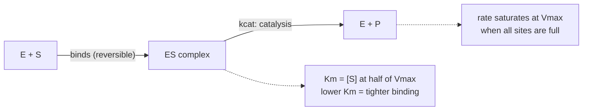

## Biochem::Enzyme_Inhibition

### LESSON-BIOCHEM-ENZYME-INHIBITION

- **KC:** `Biochem::Enzyme_Inhibition`
- **Title:** Enzyme Inhibition: Competitive vs Noncompetitive
- **Section:** `MCAT::Chem_Phys`
- **Source:** authored
- **Review Status:** needs_review
- **Overview:** Inhibitors reduce enzyme activity, and their type is diagnosed by
  how they change the Michaelis-Menten parameters. Competitive, noncompetitive,
  uncompetitive, and mixed inhibition each leave a distinct signature on Km and
  Vmax. Cells also exploit reversible regulation - allostery, feedback, and
  covalent modification.
- **Key Concepts:**
  - Competitive: binds the active site; raises apparent Km, Vmax unchanged
    (excess substrate overcomes it).
  - Noncompetitive (a special case of mixed): binds elsewhere; lowers Vmax, Km
    unchanged.
  - Uncompetitive: binds only the enzyme-substrate complex; lowers both Vmax and
    Km.
  - Physiological control: allosteric effectors, feedback inhibition by a
    pathway's product, and covalent changes (e.g., phosphorylation) or zymogen
    activation.
- **Prerequisite Reminder:** Build on `Biochem::Enzyme_Kinetics`: inhibitor type
  is read directly from shifts in Km and Vmax (and their Lineweaver-Burk plots).
- **Worked Example:** You add an inhibitor and measured Vmax drops while Km stays
  the same. Because raising [S] cannot restore Vmax, the inhibitor is not
  competing for the active site, so this is noncompetitive inhibition. If instead
  Vmax were unchanged but Km rose, adding substrate would rescue the rate - the
  fingerprint of competitive inhibition.
- **Common Misconception:** "Competitive inhibitors lower Vmax." Because
  substrate can out-compete a competitive inhibitor, Vmax is unchanged; only
  apparent Km rises. A drop in Vmax points to noncompetitive/mixed or
  uncompetitive inhibition instead.
- **First Retrieval Prompt:** From memory, state the effect of competitive versus
  noncompetitive inhibition on Km and Vmax, and explain why adding substrate
  rescues one but not the other.
- **Related KCs:** `Biochem::Enzyme_Kinetics`
- **Diagram:** Michaelis-Menten curves comparing a control enzyme with competitive inhibition, which raises the apparent Km while Vmax is unchanged, and noncompetitive inhibition, which lowers Vmax while Km is unchanged

<figure class="lesson-diagram">
<svg xmlns="http://www.w3.org/2000/svg" viewBox="0 0 540 440" role="img" aria-labelledby="t d" font-family="-apple-system, Segoe UI, Roboto, sans-serif">
  <title id="t">Effect of inhibitors on Michaelis-Menten curves</title>
  <desc id="d">Rate versus substrate concentration. A competitive inhibitor raises the apparent Km while Vmax is unchanged, because excess substrate overcomes it. A noncompetitive inhibitor lowers Vmax while Km is unchanged, because added substrate cannot restore the rate.</desc>
  <rect x="6" y="6" width="528" height="428" rx="14" fill="#ffffff" stroke="#cfd8dc" stroke-width="2"/>
  <text x="270" y="36" text-anchor="middle" font-size="18" font-weight="700" fill="#263238">Enzyme inhibition &#8212; curve shifts</text>

  <line x1="90" y1="80" x2="90" y2="360" stroke="#607d8b" stroke-width="2"/>
  <line x1="90" y1="360" x2="480" y2="360" stroke="#607d8b" stroke-width="2"/>
  <text transform="rotate(-90 48 220)" x="48" y="220" text-anchor="middle" font-size="12" fill="#37474f">v (rate)</text>
  <text x="285" y="392" text-anchor="middle" font-size="12" fill="#37474f">[S]</text>

  <line x1="90" y1="112" x2="480" y2="112" stroke="#cfd8dc" stroke-width="1.5" stroke-dasharray="5 4"/>
  <text x="476" y="108" text-anchor="end" font-size="10" fill="#607d8b">Vmax (control &amp; competitive)</text>
  <line x1="90" y1="210" x2="480" y2="210" stroke="#f0c0c0" stroke-width="1.5" stroke-dasharray="5 4"/>
  <text x="476" y="206" text-anchor="end" font-size="10" fill="#c62828">lower Vmax (noncompetitive)</text>

  <line x1="170" y1="360" x2="170" y2="236" stroke="#cfd8dc" stroke-width="1.5" stroke-dasharray="4 4"/>
  <text x="170" y="374" text-anchor="middle" font-size="10" fill="#37474f">Km</text>
  <line x1="250" y1="360" x2="250" y2="236" stroke="#ffe0b2" stroke-width="1.5" stroke-dasharray="4 4"/>
  <text x="256" y="374" text-anchor="start" font-size="10" fill="#ef6c00">Km' (higher)</text>

  <path d="M90,360 C 120,300 150,255 170,236 C 250,196 360,128 480,116" fill="none" stroke="#1565c0" stroke-width="3"/>
  <path d="M90,360 C 140,330 200,270 250,236 C 330,196 420,140 480,120" fill="none" stroke="#ef6c00" stroke-width="2.5" stroke-dasharray="7 5"/>
  <path d="M90,360 C 120,336 150,300 170,285 C 250,250 360,214 480,206" fill="none" stroke="#c62828" stroke-width="2.5" stroke-dasharray="2 4"/>

  <g>
    <line x1="300" y1="300" x2="330" y2="300" stroke="#1565c0" stroke-width="3"/>
    <text x="336" y="304" text-anchor="start" font-size="11" fill="#1565c0">control</text>
    <line x1="300" y1="322" x2="330" y2="322" stroke="#ef6c00" stroke-width="2.5" stroke-dasharray="7 5"/>
    <text x="336" y="326" text-anchor="start" font-size="11" fill="#ef6c00">competitive: Km up, Vmax same</text>
    <line x1="300" y1="344" x2="330" y2="344" stroke="#c62828" stroke-width="2.5" stroke-dasharray="2 4"/>
    <text x="336" y="348" text-anchor="start" font-size="11" fill="#c62828">noncompetitive: Vmax down, Km same</text>
  </g>
</svg>
</figure>
- **Diagram:** Diagnosing inhibitor type from shifts in Km and Vmax:

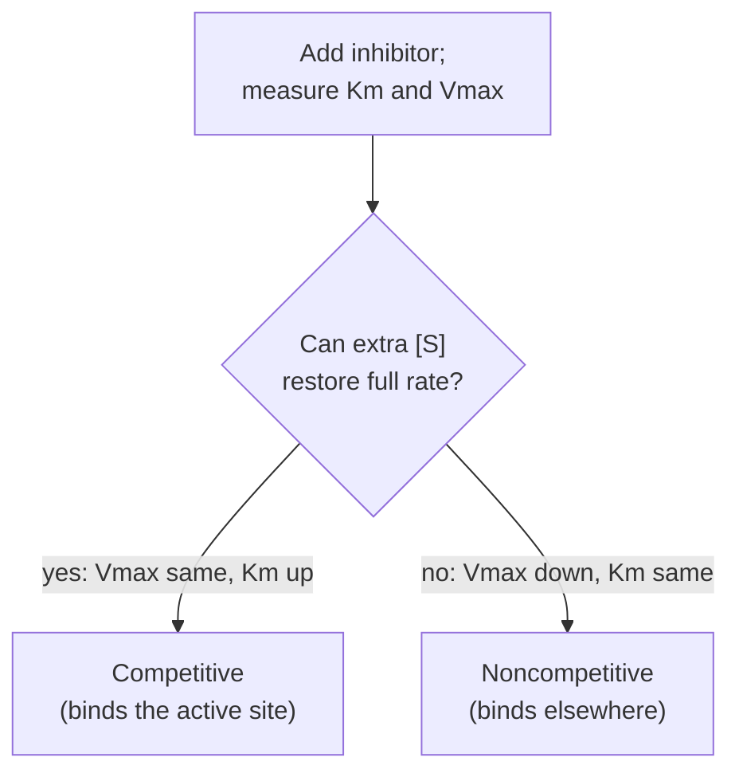

## Biochem::Bioenergetics

### LESSON-BIOCHEM-BIOENERGETICS

- **KC:** `Biochem::Bioenergetics`
- **Title:** Bioenergetics: ATP and Free Energy
- **Section:** `MCAT::Chem_Phys`
- **Source:** authored
- **Review Status:** needs_review
- **Overview:** Bioenergetics is the thermodynamic bookkeeping of metabolism -
  which reactions release usable energy and how cells capture it. ATP is the
  cell's energy currency, and coupling links unfavorable reactions to favorable
  ones. Redox carriers move the electrons that later power ATP synthesis.
- **Key Concepts:**
  - Spontaneity is set by ΔG (actual conditions), not ΔG°′ (standard
    conditions); a positive-ΔG°′ reaction can still run if concentrations are
    right.
  - ATP has a high phosphoryl-transfer potential; its hydrolysis is strongly
    exergonic and is used to drive coupled reactions.
  - Coupling: pairing an endergonic reaction with a more exergonic one (often ATP
    hydrolysis) makes the sum spontaneous.
  - Electron carriers (NAD+/NADH, FAD/FADH2) shuttle reducing power to the
    electron transport chain.
- **Prerequisite Reminder:** Build on `Biochem::Enzymes` (the catalysts that make
  coupling possible), `Bio::Eukaryotic_Cell` (compartments where energy
  metabolism runs), and `GenChem::Thermochemistry` (ΔG, spontaneity, coupling).
- **Worked Example:** The first step of glycolysis phosphorylates glucose, which
  on its own is endergonic. The cell couples it to ATP hydrolysis (strongly
  exergonic), so the summed ΔG is negative and the step proceeds. That is the
  general trick: spend ATP's large negative ΔG of hydrolysis to "pay for"
  reactions that would not run alone.
- **Common Misconception:** "ATP stores energy in special high-energy bonds that
  release energy when broken." Breaking bonds always costs energy; ATP hydrolysis
  is favorable because the products (ADP + Pi) are more stable and better
  solvated than ATP, not because a bond magically releases energy.
- **First Retrieval Prompt:** From memory, explain the difference between ΔG and
  ΔG°′ and describe how reaction coupling lets a cell drive an unfavorable
  reaction.
- **Related KCs:** `Bio::Eukaryotic_Cell`, `Biochem::Enzymes`,
  `GenChem::Thermochemistry`, `Biochem::Glycolysis`,
  `Biochem::Citric_Acid_Cycle`, `Biochem::Metabolic_Regulation`,
  `Biochem::Lipid_Metabolism`, `Bio::Muscular_System`
- **Diagram:** Reaction coupling — ATP hydrolysis pays for an unfavorable step:

```mermaid
flowchart LR
    A["Endergonic reaction<br/>&#916;G &gt; 0"] --> SUM["Coupled sum<br/>&#916;G &lt; 0 (spontaneous)"]
    B["ATP &#8594; ADP + Pi<br/>strongly exergonic"] --> SUM
    SUM --> C["reaction now proceeds"]
```

- **Diagram:** Free-energy ledger for reaction coupling: an endergonic reaction alone has a positive change in free energy, ATP hydrolysis is strongly exergonic with a large negative change, and coupling the two gives a net negative change so the combined reaction is spontaneous

<figure class="lesson-diagram">
<svg xmlns="http://www.w3.org/2000/svg" viewBox="0 0 540 440" role="img" aria-labelledby="t d" font-family="-apple-system, Segoe UI, Roboto, sans-serif">
  <title id="t">Reaction coupling free-energy ledger</title>
  <desc id="d">A free-energy bar diagram. An endergonic reaction alone has a positive change in free energy and will not run. ATP hydrolysis is strongly exergonic with a large negative change. Coupling the two gives a net negative change, so the combined reaction is spontaneous.</desc>
  <rect x="6" y="6" width="528" height="428" rx="14" fill="#ffffff" stroke="#cfd8dc" stroke-width="2"/>
  <text x="270" y="36" text-anchor="middle" font-size="18" font-weight="700" fill="#263238">Reaction coupling &#8212; ATP pays for it</text>

  <line x1="70" y1="70" x2="70" y2="380" stroke="#607d8b" stroke-width="2"/>
  <text transform="rotate(-90 40 225)" x="40" y="225" text-anchor="middle" font-size="12" fill="#37474f">Free-energy change (&#916;G)</text>
  <line x1="70" y1="230" x2="500" y2="230" stroke="#455a64" stroke-width="1.5" stroke-dasharray="6 4"/>
  <text x="496" y="224" text-anchor="end" font-size="11" fill="#455a64">&#916;G = 0</text>

  <rect x="115" y="150" width="70" height="80" fill="#ef9a9a" stroke="#c62828" stroke-width="2"/>
  <text x="150" y="196" text-anchor="middle" font-size="13" font-weight="700" fill="#7f1d1d">+&#916;G</text>
  <text x="150" y="140" text-anchor="middle" font-size="11" fill="#c62828">reaction alone</text>
  <text x="150" y="126" text-anchor="middle" font-size="10" fill="#c62828">(endergonic)</text>

  <text x="210" y="236" text-anchor="middle" font-size="20" font-weight="700" fill="#37474f">+</text>

  <rect x="235" y="230" width="70" height="120" fill="#a5d6a7" stroke="#2e7d32" stroke-width="2"/>
  <text x="270" y="296" text-anchor="middle" font-size="13" font-weight="700" fill="#1b5e20">&#8722;&#916;G</text>
  <text x="270" y="368" text-anchor="middle" font-size="11" fill="#2e7d32">ATP hydrolysis</text>
  <text x="270" y="382" text-anchor="middle" font-size="10" fill="#2e7d32">(large, exergonic)</text>

  <text x="330" y="236" text-anchor="middle" font-size="20" font-weight="700" fill="#37474f">=</text>

  <rect x="355" y="230" width="70" height="62" fill="#90caf9" stroke="#1565c0" stroke-width="2"/>
  <text x="390" y="266" text-anchor="middle" font-size="12" font-weight="700" fill="#0d47a1">net &#8722;&#916;G</text>
  <text x="390" y="368" text-anchor="middle" font-size="11" fill="#1565c0">coupled sum</text>
  <text x="390" y="382" text-anchor="middle" font-size="10" fill="#1565c0">(spontaneous)</text>

  <text x="285" y="410" text-anchor="middle" font-size="12" fill="#607d8b">&#916;G(coupled) = &#916;G(reaction) + &#916;G(ATP) &lt; 0 &#183; spontaneity depends on &#916;G, not &#916;G&#176;'</text>
</svg>
</figure>

## Biochem::Metabolic_Regulation

### LESSON-BIOCHEM-METABOLIC-REGULATION

- **KC:** `Biochem::Metabolic_Regulation`
- **Title:** Metabolic Regulation: Control Points and Energy Charge
- **Section:** `MCAT::Bio_Biochem`
- **Source:** authored
- **Review Status:** needs_review
- **Overview:** Metabolic regulation decides which pathways run, when, and how
  fast, so a cell does not waste energy or run opposing pathways at once. Control
  concentrates at committed, effectively irreversible steps and responds to the
  cell's energy status. Allosteric effectors, hormones, and compartmentalization
  are the main tools.
- **Key Concepts:**
  - Flux is controlled at rate-limiting, committed steps (large negative ΔG, far
    from equilibrium), not at near-equilibrium steps.
  - Energy-charge signals (ATP/AMP, NADH/NAD+) tune these enzymes to supply and
    demand.
  - Opposing pathways (e.g., glycolysis vs gluconeogenesis) are reciprocally
    regulated so they are not both maximally active.
  - Compartmentalization (cytosol vs mitochondrion) and hormonal signals add
    further layers of control.
- **Prerequisite Reminder:** Build on `Biochem::Bioenergetics` (energy status and
  ΔG) and `Biochem::Enzymes` (the regulated catalysts themselves).
- **Worked Example:** When ATP is abundant and AMP is low, phosphofructokinase-1
  (glycolysis's committed step) is inhibited by ATP, so glucose breakdown slows.
  When AMP rises (energy is scarce), it activates the same enzyme, speeding
  glycolysis. Regulating this committed, irreversible step controls flux without
  fighting equilibrium.
- **Common Misconception:** "Cells regulate pathways at their equilibrium steps."
  Regulation targets committed, far-from-equilibrium steps; nudging a
  near-equilibrium reaction would barely change flux and would be easily
  reversed.
- **First Retrieval Prompt:** From memory, explain why the committed step of a
  pathway is the logical control point, and name one signal that reports the
  cell's energy status.
- **Related KCs:** `Biochem::Bioenergetics`, `Biochem::Enzymes`,
  `Biochem::Gluconeogenesis`, `Biochem::Glycogen_Metabolism`,
  `Biochem::Amino_Acid_Metabolism`,
  `Biochem::Hormonal_Regulation_of_Metabolism`
- **Diagram:** Energy charge sets reciprocal flux at the committed step:

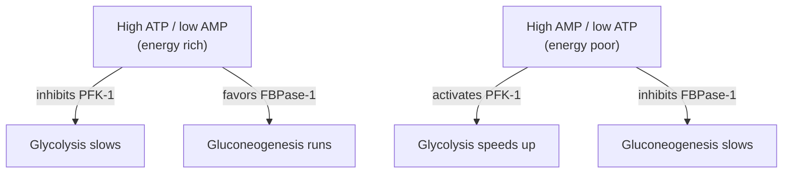

## Biochem::Carbohydrates_and_Lipids

### LESSON-BIOCHEM-CARBOHYDRATES-AND-LIPIDS

- **KC:** `Biochem::Carbohydrates_and_Lipids`
- **Title:** Carbohydrates and Lipids: Biomolecule Structure
- **Section:** `MCAT::Bio_Biochem`
- **Source:** authored
- **Review Status:** needs_review
- **Overview:** This KC covers the structures of two big biomolecule families:
  carbohydrates (sugars and their polymers) and lipids (fats and related nonpolar
  molecules). Knowing their building blocks and linkages sets up every metabolic
  pathway that makes or breaks them. The two families differ sharply in polarity
  and how they store energy.
- **Key Concepts:**
  - Monosaccharides are classified as aldoses/ketoses and by D/L configuration;
    they cyclize into anomers (α/β) and can be epimers of one another.
  - Glycosidic bonds link sugars into di- and polysaccharides (starch, glycogen,
    cellulose).
  - Fatty acids may be saturated or unsaturated; triacylglycerols store energy,
    while phospholipids are amphipathic and build membranes.
  - Lipids are defined by low water solubility (nonpolar), not by a shared
    repeating monomer - they are not true polymers.
- **Prerequisite Reminder:** Build on `Orgo::Aldehydes_and_Ketones` (the carbonyl
  chemistry behind ring formation), `Orgo::Functional_Groups`, and
  `Orgo::Stereochemistry` (sugar chirality, anomers/epimers).
- **Worked Example:** Glucose and galactose share a formula but differ at a
  single stereocenter (C4), so they are epimers. In water, glucose's open-chain
  aldehyde reacts with its own C5 hydroxyl to form a six-membered ring, creating
  a new stereocenter at C1 (the anomeric carbon) that can be α or β. Same atoms,
  different 3-D arrangements - a stereochemistry problem at heart.
- **Common Misconception:** "Lipids are polymers like carbohydrates and
  proteins." Lipids are grouped by being nonpolar/water-insoluble, not by a
  repeating monomer; a triacylglycerol is an ester assembly, not a polymer of one
  unit.
- **First Retrieval Prompt:** From memory, define an anomer versus an epimer for
  sugars, and explain why lipids are classified by solubility rather than by a
  shared monomer.
- **Related KCs:** `Orgo::Aldehydes_and_Ketones`, `Orgo::Functional_Groups`,
  `Orgo::Stereochemistry`, `Biochem::Glycolysis`,
  `Biochem::Glycogen_Metabolism`, `Biochem::Lipid_Metabolism`,
  `Biochem::Membranes_and_Transport`, `Bio::Cell_Membrane_and_Transport`
- **Diagram:** Core biomolecule structures: a glucose ring showing the ring oxygen and the anomeric carbon, a triacylglycerol of glycerol plus three fatty-acid tails joined by ester bonds, and an amphipathic phospholipid with a polar head and two nonpolar tails

<figure class="lesson-diagram">
<svg xmlns="http://www.w3.org/2000/svg" viewBox="0 0 540 440" role="img" aria-labelledby="t d" font-family="-apple-system, Segoe UI, Roboto, sans-serif">
  <title id="t">Core carbohydrate and lipid structures</title>
  <desc id="d">Three families side by side: a monosaccharide drawn as a six-membered ring with a ring oxygen and an anomeric carbon; a triacylglycerol built from glycerol plus three fatty-acid tails joined by ester bonds; and an amphipathic phospholipid with a polar head and two nonpolar tails that build membranes.</desc>
  <rect x="6" y="6" width="528" height="428" rx="14" fill="#ffffff" stroke="#cfd8dc" stroke-width="2"/>
  <text x="270" y="34" text-anchor="middle" font-size="18" font-weight="700" fill="#263238">Carbohydrates &amp; lipids &#8212; core structures</text>

  <rect x="20" y="54" width="160" height="322" rx="10" fill="#f7f9fa" stroke="#cfd8dc" stroke-width="1.5"/>
  <text x="100" y="80" text-anchor="middle" font-size="14" font-weight="700" fill="#263238">Monosaccharide</text>
  <text x="100" y="99" text-anchor="middle" font-size="11" fill="#607d8b">glucose ring</text>
  <polygon points="100,152 142,176 142,220 100,244 58,220 58,176" fill="#ffffff" stroke="#6a1b9a" stroke-width="2.5"/>
  <circle cx="142" cy="176" r="10" fill="#ede7f6" stroke="#6a1b9a" stroke-width="1.5"/>
  <text x="142" y="180" text-anchor="middle" font-size="11" font-weight="700" fill="#4527a0">O</text>
  <line x1="100" y1="152" x2="100" y2="132" stroke="#6a1b9a" stroke-width="2"/>
  <text x="100" y="126" text-anchor="middle" font-size="10" fill="#4527a0">CH2OH</text>
  <line x1="142" y1="220" x2="164" y2="232" stroke="#6a1b9a" stroke-width="2"/>
  <text x="170" y="236" text-anchor="start" font-size="10" fill="#4527a0">OH</text>
  <text x="150" y="212" text-anchor="start" font-size="9" fill="#607d8b">C1</text>
  <text x="100" y="300" text-anchor="middle" font-size="10" fill="#607d8b">ring O + anomeric C1</text>
  <text x="100" y="318" text-anchor="middle" font-size="10" fill="#607d8b">(alpha / beta)</text>
  <text x="100" y="342" text-anchor="middle" font-size="10" fill="#607d8b">glycosidic bonds link</text>
  <text x="100" y="356" text-anchor="middle" font-size="10" fill="#607d8b">sugars into polymers</text>

  <rect x="190" y="54" width="160" height="322" rx="10" fill="#f7f9fa" stroke="#cfd8dc" stroke-width="1.5"/>
  <text x="270" y="80" text-anchor="middle" font-size="14" font-weight="700" fill="#263238">Triacylglycerol</text>
  <text x="270" y="99" text-anchor="middle" font-size="11" fill="#607d8b">energy storage</text>
  <line x1="224" y1="140" x2="224" y2="244" stroke="#455a64" stroke-width="3"/>
  <text transform="rotate(-90 210 192)" x="210" y="192" text-anchor="middle" font-size="10" fill="#455a64">glycerol</text>
  <g stroke="#c62828" stroke-width="2">
    <line x1="224" y1="150" x2="250" y2="150"/>
    <line x1="224" y1="192" x2="250" y2="192"/>
    <line x1="224" y1="234" x2="250" y2="234"/>
  </g>
  <circle cx="252" cy="150" r="4" fill="#ffcdd2" stroke="#c62828"/>
  <circle cx="252" cy="192" r="4" fill="#ffcdd2" stroke="#c62828"/>
  <circle cx="252" cy="234" r="4" fill="#ffcdd2" stroke="#c62828"/>
  <path d="M258,150 l12,-8 12,8 12,-8 12,8 12,-8" fill="none" stroke="#607d8b" stroke-width="2"/>
  <path d="M258,192 l12,-8 12,8 10,10 12,-8 12,8" fill="none" stroke="#607d8b" stroke-width="2"/>
  <path d="M258,234 l12,-8 12,8 12,-8 12,8 12,-8" fill="none" stroke="#607d8b" stroke-width="2"/>
  <text x="284" y="128" text-anchor="middle" font-size="9" fill="#c62828">ester bonds</text>
  <text x="300" y="176" text-anchor="middle" font-size="9" fill="#607d8b">saturated</text>
  <text x="304" y="216" text-anchor="middle" font-size="9" fill="#607d8b">unsaturated (kink)</text>
  <text x="270" y="330" text-anchor="middle" font-size="10" fill="#607d8b">3 fatty acids on glycerol</text>

  <rect x="360" y="54" width="160" height="322" rx="10" fill="#f7f9fa" stroke="#cfd8dc" stroke-width="1.5"/>
  <text x="440" y="80" text-anchor="middle" font-size="14" font-weight="700" fill="#263238">Phospholipid</text>
  <text x="440" y="99" text-anchor="middle" font-size="11" fill="#607d8b">amphipathic</text>
  <circle cx="440" cy="150" r="20" fill="#1565c0" stroke="#0d47a1" stroke-width="2"/>
  <text x="440" y="154" text-anchor="middle" font-size="10" font-weight="700" fill="#ffffff">P</text>
  <text x="440" y="124" text-anchor="middle" font-size="10" fill="#1565c0">polar head</text>
  <path d="M432,170 l-6,16 6,16 -6,16 6,16 -6,16 6,16" fill="none" stroke="#607d8b" stroke-width="2"/>
  <path d="M448,170 l6,16 -6,16 6,16 -6,16 6,16 -6,16" fill="none" stroke="#607d8b" stroke-width="2"/>
  <text x="440" y="296" text-anchor="middle" font-size="10" fill="#607d8b">nonpolar tails</text>
  <text x="440" y="330" text-anchor="middle" font-size="10" fill="#607d8b">builds the bilayer</text>

  <text x="270" y="406" text-anchor="middle" font-size="12" fill="#607d8b">Lipids are grouped by low water solubility, not a shared monomer (not true polymers)</text>
</svg>
</figure>

## Biochem::Glycolysis

### LESSON-BIOCHEM-GLYCOLYSIS

- **KC:** `Biochem::Glycolysis`
- **Title:** Glycolysis: Glucose to Pyruvate
- **Section:** `MCAT::Bio_Biochem`
- **Source:** authored
- **Review Status:** approved
- **Overview:** Glycolysis is the pathway that splits one glucose into two
  pyruvate molecules in the cytoplasm. It is the shared entry point for both
  aerobic and anaerobic energy metabolism, so it shows up everywhere downstream.
- **Key Concepts:**
  - It runs in the cytoplasm and needs no oxygen.
  - An early investment phase spends 2 ATP; a later payoff phase produces 4 ATP
    and 2 NADH.
  - Net yield per glucose: 2 ATP, 2 NADH, and 2 pyruvate.
  - Pyruvate's fate depends on oxygen: it feeds the citric acid cycle when
    oxygen is present, or fermentation when it is not.
- **Prerequisite Reminder:** Build on `Biochem::Bioenergetics` (ATP/NADH
  bookkeeping and reaction coupling) and `Biochem::Carbohydrates_and_Lipids`
  (glucose is the sugar being broken down), so keep the energy ledger in mind.
- **Worked Example:** Track the ATP ledger for one glucose. Investment phase:
  -2 ATP (spent to phosphorylate and prime the sugar). Payoff phase: +4 ATP
  (made as high-energy intermediates are cashed in). Net = 4 - 2 = 2 ATP, plus
  2 NADH carried forward.
- **Common Misconception:** "Glycolysis makes a lot of ATP by itself." Its net
  direct yield is only 2 ATP per glucose; most cellular ATP comes later from the
  citric acid cycle and oxidative phosphorylation using the NADH glycolysis
  hands off.
- **First Retrieval Prompt:** From memory, give the net ATP, NADH, and pyruvate
  produced per glucose, and say where in the cell this happens.
- **Related KCs:** `Biochem::Bioenergetics`,
  `Biochem::Carbohydrates_and_Lipids`, `Biochem::Citric_Acid_Cycle`,
  `Biochem::Gluconeogenesis`, `Biochem::Glycogen_Metabolism`,
  `Biochem::Pentose_Phosphate_Pathway`
- **Diagram:** Stage ordering — investment phase, payoff phase, and pyruvate's two fates:

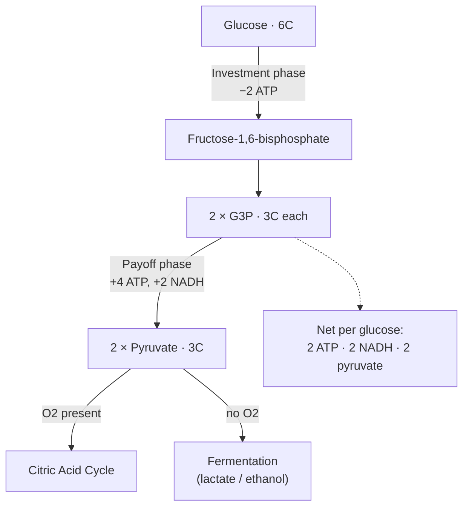

## Biochem::Gluconeogenesis

### LESSON-BIOCHEM-GLUCONEOGENESIS

- **KC:** `Biochem::Gluconeogenesis`
- **Title:** Gluconeogenesis: Making Glucose from Scratch
- **Section:** `MCAT::Bio_Biochem`
- **Source:** authored
- **Review Status:** needs_review
- **Overview:** Gluconeogenesis makes new glucose from non-carbohydrate
  precursors during fasting, mainly in the liver. It resembles glycolysis run
  backward but must bypass glycolysis's three irreversible steps with different
  enzymes. Reciprocal regulation keeps it from running at the same time as
  glycolysis.
- **Key Concepts:**
  - Precursors include lactate, glycerol, and glucogenic amino acids.
  - Four bypass reactions get around the three irreversible glycolytic steps
    (pyruvate carboxylase + PEP carboxykinase, fructose-1,6-bisphosphatase,
    glucose-6-phosphatase).
  - It is energetically costly (consumes ATP/GTP), which is why it is not simply
    glycolysis in reverse.
  - Reciprocal regulation with glycolysis prevents a futile cycle; the liver
    exports glucose (e.g., the Cori cycle).
- **Prerequisite Reminder:** Build on `Biochem::Glycolysis` (the pathway it
  reverses at most steps) and `Biochem::Metabolic_Regulation` (the reciprocal
  control that prevents futile cycling).
- **Worked Example:** Glycolysis's PFK-1 step (fructose-6-P to
  fructose-1,6-bisphosphate) is irreversible, so gluconeogenesis cannot just run
  it backward. A separate enzyme, fructose-1,6-bisphosphatase, removes the
  phosphate to move toward glucose. When ATP is high, this bisphosphatase is
  favored and PFK-1 is inhibited, so the cell makes glucose rather than burning
  it.
- **Common Misconception:** "Gluconeogenesis is just glycolysis run in reverse."
  Three glycolytic steps are irreversible, so gluconeogenesis uses four different
  bypass enzymes and spends extra ATP/GTP; running the exact reverse would be
  thermodynamically impossible.
- **First Retrieval Prompt:** From memory, explain why gluconeogenesis needs
  bypass enzymes instead of simply reversing glycolysis, and name one
  gluconeogenic precursor.
- **Related KCs:** `Biochem::Glycolysis`, `Biochem::Metabolic_Regulation`,
  `Biochem::Hormonal_Regulation_of_Metabolism`
- **Diagram:** Bypassing glycolysis's three irreversible steps with different enzymes:

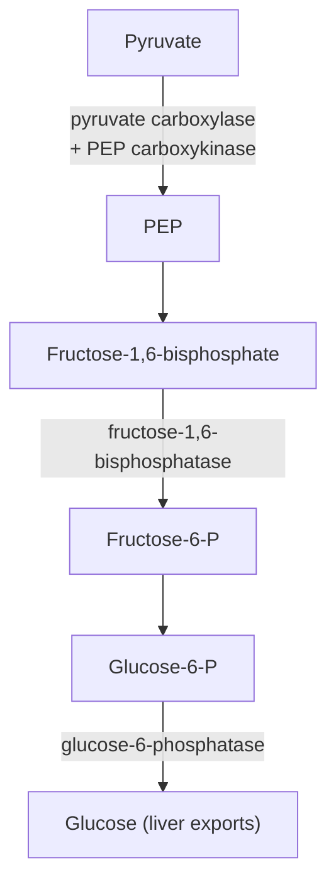

## Biochem::Glycogen_Metabolism

### LESSON-BIOCHEM-GLYCOGEN-METABOLISM

- **KC:** `Biochem::Glycogen_Metabolism`
- **Title:** Glycogen Metabolism: Storage and Mobilization
- **Section:** `MCAT::Bio_Biochem`
- **Source:** authored
- **Review Status:** needs_review
- **Overview:** Glycogen is the branched storage polymer of glucose in liver and
  muscle. Cells build it (glycogenesis) and break it down (glycogenolysis) using
  separate, oppositely regulated enzymes. Hormones switch between storage and
  mobilization to match whole-body needs.
- **Key Concepts:**
  - Glycogen synthase adds glucose in α-1,4 linkages; branching enzyme adds
    α-1,6 branches.
  - Glycogen phosphorylase cleaves α-1,4 bonds to release glucose-1-phosphate;
    debranching enzyme handles branch points.
  - Synthesis and breakdown use different enzymes, so they can be regulated
    reciprocally (often by phosphorylation).
  - Liver glycogen buffers blood glucose for the whole body; muscle glycogen
    fuels the muscle itself.
- **Prerequisite Reminder:** Build on `Biochem::Carbohydrates_and_Lipids`
  (glycosidic-bond structure), `Biochem::Glycolysis` (where mobilized glucose
  goes), and `Biochem::Metabolic_Regulation` (hormonal/phosphorylation control).
- **Worked Example:** Epinephrine signals a need for fuel: it triggers
  phosphorylation that activates glycogen phosphorylase and simultaneously
  inactivates glycogen synthase. So one signal both turns on breakdown and turns
  off synthesis, ensuring the cell is not building and dismantling glycogen at
  the same time.
- **Common Misconception:** "One enzyme builds and breaks glycogen by running in
  reverse." Synthesis (glycogen synthase) and breakdown (glycogen phosphorylase)
  are catalyzed by distinct enzymes, which is exactly what lets them be
  controlled independently and reciprocally.
- **First Retrieval Prompt:** From memory, name the enzyme that breaks down
  glycogen and explain why separate synthesis and breakdown enzymes are useful
  for regulation.
- **Related KCs:** `Biochem::Carbohydrates_and_Lipids`, `Biochem::Glycolysis`,
  `Biochem::Metabolic_Regulation`
- **Diagram:** Storage vs mobilization — separate, reciprocally controlled enzymes:

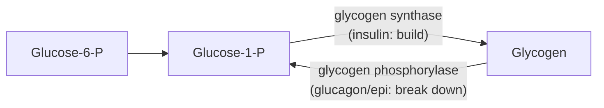

## Biochem::Pentose_Phosphate_Pathway

### LESSON-BIOCHEM-PENTOSE-PHOSPHATE-PATHWAY

- **KC:** `Biochem::Pentose_Phosphate_Pathway`
- **Title:** Pentose Phosphate Pathway: NADPH and Ribose
- **Section:** `MCAT::Bio_Biochem`
- **Source:** authored
- **Review Status:** needs_review
- **Overview:** The pentose phosphate pathway (PPP) branches off
  glucose-6-phosphate to make two things cells need beyond ATP: NADPH for
  biosynthesis and antioxidant defense, and ribose-5-phosphate for nucleotides.
  It runs in the cytosol and makes no ATP. Its activity scales with a cell's
  demand for reducing power or nucleotide precursors.
- **Key Concepts:**
  - The oxidative phase is irreversible and produces NADPH (plus CO2); it is the
    committed, regulated part.
  - The non-oxidative phase is reversible and yields ribose-5-phosphate for
    nucleotide synthesis.
  - NADPH (not NADH) powers reductive biosynthesis and regenerates glutathione
    against oxidative stress.
  - The pathway is flexible: cells can favor NADPH or ribose depending on need.
- **Prerequisite Reminder:** Build on `Biochem::Glycolysis` (shares the
  glucose-6-phosphate entry point) and `Biochem::Nucleotides_and_Nucleic_Acids`
  (ribose-5-phosphate feeds nucleotide synthesis).
- **Worked Example:** A rapidly dividing cell needs ribose for DNA and RNA. It
  routes glucose-6-phosphate into the PPP; the non-oxidative phase can supply
  ribose-5-phosphate even without high NADPH demand, and unused sugars rejoin
  glycolysis. No ATP is made in the process.
- **Common Misconception:** "The PPP makes ATP and uses NADH like glycolysis."
  The PPP produces no ATP and generates NADPH - the phosphorylated cousin used
  for biosynthesis and antioxidant defense, which is functionally distinct from
  the NADH used in energy metabolism.
- **First Retrieval Prompt:** From memory, name the two main products of the
  pentose phosphate pathway and state whether it yields any ATP.
- **Related KCs:** `Biochem::Glycolysis`,
  `Biochem::Nucleotides_and_Nucleic_Acids`
- **Diagram:** The pathway branches from glucose-6-phosphate (makes NADPH and ribose, no ATP):

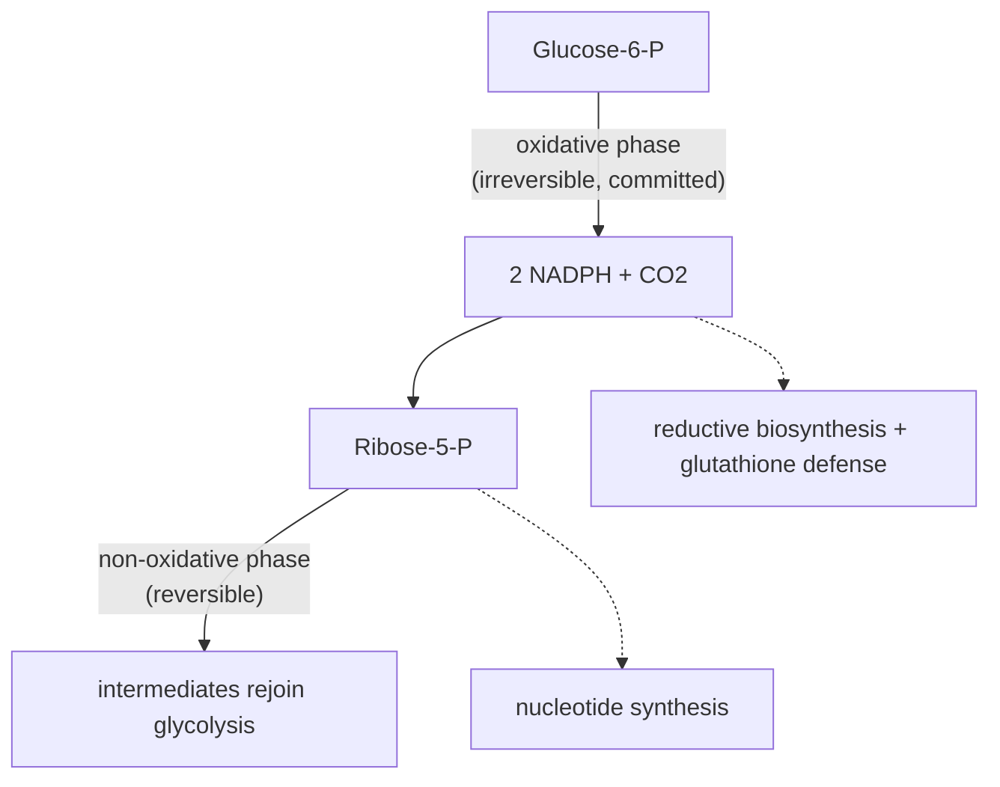

## Biochem::Citric_Acid_Cycle

### LESSON-BIOCHEM-CITRIC-ACID-CYCLE

- **KC:** `Biochem::Citric_Acid_Cycle`
- **Title:** Citric Acid Cycle: Acetyl-CoA to Electron Carriers
- **Section:** `MCAT::Bio_Biochem`
- **Source:** authored
- **Review Status:** needs_review
- **Overview:** The citric acid cycle (Krebs/TCA cycle) oxidizes acetyl-CoA to
  CO2 in the mitochondrial matrix, capturing energy as electron carriers. It is
  the hub where carbohydrate, fat, and protein breakdown converge. Its main
  output is reduced carriers that feed oxidative phosphorylation, not ATP
  directly.
- **Key Concepts:**
  - Acetyl-CoA (2 carbons) condenses with oxaloacetate to start each turn; two
    CO2 are released per turn.
  - Per acetyl-CoA: 3 NADH, 1 FADH2, and 1 GTP (or ATP), plus 2 CO2.
  - It is amphibolic: intermediates are drawn off for biosynthesis
    (cataplerosis) and replenished (anaplerosis).
  - Though its own steps need no O2, it stalls without O2 because NAD+/FAD are
    only regenerated by the O2-dependent electron transport chain.
- **Prerequisite Reminder:** Build on `Biochem::Bioenergetics` (redox carriers
  and energy capture) and `Biochem::Glycolysis` (which supplies the pyruvate that
  becomes acetyl-CoA).
- **Worked Example:** Count the carriers from one glucose's worth of acetyl-CoA.
  Glycolysis gives 2 pyruvate to 2 acetyl-CoA, so the cycle turns twice:
  2 × (3 NADH + 1 FADH2 + 1 GTP) = 6 NADH, 2 FADH2, 2 GTP, and 4 CO2. Most of
  the "payoff" is stored in the carriers, cashed in later.
- **Common Misconception:** "The citric acid cycle produces most of the cell's
  ATP directly." Each turn makes only one GTP/ATP directly; its real value is
  the NADH and FADH2 that drive ATP synthesis later in oxidative
  phosphorylation.
- **First Retrieval Prompt:** From memory, list what one turn produces per
  acetyl-CoA and explain why the cycle stops when oxygen runs out even though O2
  is not a direct reactant.
- **Related KCs:** `Biochem::Bioenergetics`, `Biochem::Glycolysis`,
  `Biochem::Oxidative_Phosphorylation`, `Biochem::Lipid_Metabolism`,
  `Biochem::Amino_Acid_Metabolism`
- **Diagram:** One turn of the cycle per acetyl-CoA (yields 3 NADH, 1 FADH2, 1 GTP, 2 CO2):

```mermaid
flowchart LR
    ACO["Acetyl-CoA (2C)"] --> CIT["Citrate"]
    OAA["Oxaloacetate"] --> CIT
    CIT --> ISO["Isocitrate"]
    ISO -->|"NADH + CO2"| AKG["&#945;-Ketoglutarate"]
    AKG -->|"NADH + CO2"| SUCC["Succinyl-CoA"]
    SUCC -->|"GTP"| SUC["Succinate"]
    SUC -->|"FADH2"| FUM["Fumarate"]
    FUM --> MAL["Malate"]
    MAL -->|"NADH"| OAA
```

## Biochem::Oxidative_Phosphorylation

### LESSON-BIOCHEM-OXIDATIVE-PHOSPHORYLATION

- **KC:** `Biochem::Oxidative_Phosphorylation`
- **Title:** Oxidative Phosphorylation: The Electron Transport Chain
- **Section:** `MCAT::Chem_Phys`
- **Source:** authored
- **Review Status:** needs_review
- **Overview:** Oxidative phosphorylation is where most ATP is made. The electron
  transport chain passes electrons from NADH and FADH2 to oxygen, pumping protons
  to build an electrochemical gradient, and ATP synthase uses that gradient to
  make ATP. It couples redox chemistry to a proton-motive force via chemiosmosis.
- **Key Concepts:**
  - Electrons flow "downhill" through complexes I-IV to O2 (the final acceptor,
    forming water); the released energy pumps H+ across the inner mitochondrial
    membrane.
  - The proton gradient (proton-motive force) stores the energy; ATP synthase
    lets protons flow back and makes ATP.
  - FADH2 enters later (Complex II) than NADH, so it drives fewer protons and
    yields less ATP.
  - Uncouplers (dissipate the gradient) and ETC inhibitors (block electron flow)
    both halt ATP synthesis, but in different ways.
- **Prerequisite Reminder:** Build on `Biochem::Citric_Acid_Cycle` (source of
  NADH/FADH2), `Bio::Eukaryotic_Cell` (the mitochondrial-membrane setting), and
  `GenChem::Electrochemistry` (redox potentials and electron flow).
- **Worked Example:** Add an uncoupler that makes the inner membrane leaky to
  protons. Electrons still flow and O2 is still consumed, but protons leak back
  without passing through ATP synthase, so ATP output falls and the energy is
  lost as heat. Contrast a Complex IV inhibitor (cyanide): electron flow itself
  stops, so O2 consumption and ATP synthesis both cease.
- **Common Misconception:** "ATP synthase makes ATP directly from the electron
  transport chain's electrons." ATP synthase is powered by the proton gradient,
  not by electrons; the ETC's job is to build that gradient. That is why an
  uncoupler can stop ATP synthesis while electrons keep flowing.
- **First Retrieval Prompt:** From memory, explain how the electron transport
  chain and ATP synthase are linked by the proton gradient, and predict what an
  uncoupler does to ATP output and heat.
- **Related KCs:** `Bio::Eukaryotic_Cell`, `Biochem::Citric_Acid_Cycle`,
  `GenChem::Electrochemistry`
- **Diagram:** Electron transport chain in the inner mitochondrial membrane: complexes I to IV pass electrons to oxygen, which is reduced to water, while complexes I, III, and IV pump protons into the intermembrane space, and ATP synthase lets protons flow back to the matrix to make ATP

<figure class="lesson-diagram">
<svg xmlns="http://www.w3.org/2000/svg" viewBox="0 0 540 440" role="img" aria-labelledby="t d" font-family="-apple-system, Segoe UI, Roboto, sans-serif">
  <title id="t">Electron transport chain and chemiosmosis</title>
  <desc id="d">In the inner mitochondrial membrane, electrons from NADH and FADH2 pass through complexes I to IV to oxygen, which is reduced to water. Complexes I, III, and IV pump protons into the intermembrane space, building a gradient. ATP synthase lets protons flow back into the matrix to make ATP.</desc>
  <defs>
    <marker id="oah" markerWidth="9" markerHeight="9" refX="6" refY="3" orient="auto"><path d="M0,0 L6,3 L0,6 Z" fill="#455a64"/></marker>
    <marker id="oahb" markerWidth="9" markerHeight="9" refX="6" refY="3" orient="auto"><path d="M0,0 L6,3 L0,6 Z" fill="#1565c0"/></marker>
  </defs>
  <rect x="6" y="6" width="528" height="428" rx="14" fill="#ffffff" stroke="#cfd8dc" stroke-width="2"/>
  <text x="270" y="34" text-anchor="middle" font-size="17" font-weight="700" fill="#263238">Oxidative phosphorylation &#8212; ETC &amp; chemiosmosis</text>

  <text x="270" y="62" text-anchor="middle" font-size="12" font-weight="700" fill="#1565c0">Intermembrane space &#183; high H+</text>
  <rect x="34" y="118" width="472" height="172" fill="#faf7fb" stroke="none"/>
  <line x1="34" y1="118" x2="506" y2="118" stroke="#cfd8dc" stroke-width="1.5"/>
  <line x1="34" y1="290" x2="506" y2="290" stroke="#cfd8dc" stroke-width="1.5"/>
  <text x="270" y="400" text-anchor="middle" font-size="12" font-weight="700" fill="#455a64">Matrix &#183; low H+</text>

  <rect x="60" y="126" width="52" height="158" rx="8" fill="#90caf9" stroke="#1565c0" stroke-width="2"/>
  <text x="86" y="212" text-anchor="middle" font-size="15" font-weight="700" fill="#0d47a1">I</text>
  <rect x="150" y="210" width="44" height="74" rx="8" fill="#a5d6a7" stroke="#2e7d32" stroke-width="2"/>
  <text x="172" y="252" text-anchor="middle" font-size="14" font-weight="700" fill="#1b5e20">II</text>
  <rect x="214" y="126" width="52" height="158" rx="8" fill="#90caf9" stroke="#1565c0" stroke-width="2"/>
  <text x="240" y="212" text-anchor="middle" font-size="15" font-weight="700" fill="#0d47a1">III</text>
  <rect x="326" y="126" width="52" height="158" rx="8" fill="#90caf9" stroke="#1565c0" stroke-width="2"/>
  <text x="352" y="212" text-anchor="middle" font-size="15" font-weight="700" fill="#0d47a1">IV</text>

  <circle cx="188" cy="250" r="12" fill="#fff3e0" stroke="#ef6c00" stroke-width="2"/>
  <text x="188" y="254" text-anchor="middle" font-size="11" font-weight="700" fill="#e65100">Q</text>
  <circle cx="298" cy="150" r="12" fill="#fce4ec" stroke="#c62828" stroke-width="2"/>
  <text x="298" y="154" text-anchor="middle" font-size="10" font-weight="700" fill="#b71c1c">c</text>

  <g stroke="#455a64" stroke-width="2" stroke-dasharray="5 4" fill="none">
    <line x1="112" y1="250" x2="174" y2="250" marker-end="url(#oah)"/>
    <line x1="194" y1="235" x2="200" y2="228" marker-end="url(#oah)"/>
    <line x1="200" y1="250" x2="212" y2="240" marker-end="url(#oah)"/>
    <line x1="266" y1="160" x2="284" y2="152" marker-end="url(#oah)"/>
    <line x1="310" y1="150" x2="326" y2="152" marker-end="url(#oah)"/>
    <line x1="378" y1="210" x2="406" y2="210" marker-end="url(#oah)"/>
  </g>
  <text x="120" y="336" text-anchor="middle" font-size="10" fill="#455a64">NADH &#8594; NAD+</text>
  <text x="172" y="336" text-anchor="middle" font-size="10" fill="#2e7d32">FADH2</text>
  <text x="452" y="214" text-anchor="middle" font-size="10" fill="#455a64">1/2 O2 &#8594; H2O</text>
  <text x="150" y="112" text-anchor="middle" font-size="10" fill="#455a64">e&#8722; flow: I &#8594; IV</text>

  <g stroke="#1565c0" stroke-width="2.5">
    <line x1="86" y1="118" x2="86" y2="96" marker-end="url(#oahb)"/>
    <line x1="240" y1="118" x2="240" y2="96" marker-end="url(#oahb)"/>
    <line x1="352" y1="118" x2="352" y2="96" marker-end="url(#oahb)"/>
  </g>
  <text x="86" y="90" text-anchor="middle" font-size="10" font-weight="700" fill="#1565c0">H+</text>
  <text x="240" y="90" text-anchor="middle" font-size="10" font-weight="700" fill="#1565c0">H+</text>
  <text x="352" y="90" text-anchor="middle" font-size="10" font-weight="700" fill="#1565c0">H+</text>

  <rect x="420" y="126" width="46" height="158" rx="8" fill="#ffcc80" stroke="#ef6c00" stroke-width="2"/>
  <circle cx="443" cy="300" r="18" fill="#ffb74d" stroke="#ef6c00" stroke-width="2"/>
  <line x1="443" y1="96" x2="443" y2="126" stroke="#ef6c00" stroke-width="2.5" marker-end="url(#oah)"/>
  <text x="443" y="90" text-anchor="middle" font-size="10" font-weight="700" fill="#ef6c00">H+</text>
  <text x="443" y="336" text-anchor="middle" font-size="10" fill="#e65100">ADP + Pi &#8594; ATP</text>
  <text x="443" y="356" text-anchor="middle" font-size="10" font-weight="700" fill="#e65100">ATP synthase</text>

  <text x="270" y="420" text-anchor="middle" font-size="11" fill="#607d8b">Electron flow pumps H+; ATP synthase uses the H+ gradient (uncouplers dissipate it)</text>
</svg>
</figure>
- **Diagram:** Electron flow builds the H+ gradient; ATP synthase spends it (chemiosmosis):

```mermaid
flowchart LR
    NADH["NADH"] --> CI["Complex I"]
    FADH2["FADH2"] --> CII["Complex II"]
    CI --> Q["Q (mobile)"]
    CII --> Q
    Q --> CIII["Complex III"]
    CIII --> CYTC["cyt c"]
    CYTC --> CIV["Complex IV"]
    CIV -->|"final e&#8722; acceptor"| O2["1/2 O2 &#8594; H2O"]
    CI -.->|"pump H+"| IMS["H+ gradient"]
    CIII -.->|"pump H+"| IMS
    CIV -.->|"pump H+"| IMS
    IMS -->|"H+ flows back"| ATPS["ATP synthase &#8594; ATP"]
```

## Biochem::Lipid_Metabolism

### LESSON-BIOCHEM-LIPID-METABOLISM

- **KC:** `Biochem::Lipid_Metabolism`
- **Title:** Lipid Metabolism: Beta-Oxidation and Synthesis
- **Section:** `MCAT::Bio_Biochem`
- **Source:** authored
- **Review Status:** needs_review
- **Overview:** Lipid metabolism stores and mobilizes the body's most
  energy-dense fuel. Beta-oxidation breaks fatty acids into acetyl-CoA for the
  citric acid cycle, while synthesis builds fatty acids when fuel is plentiful.
  Ketone bodies and lipoproteins handle fasting-state fuel and transport.
- **Key Concepts:**
  - Beta-oxidation (in mitochondria) removes two carbons per cycle as acetyl-CoA,
    generating NADH and FADH2; fat yields far more ATP per gram than carbohydrate.
  - Fatty-acid synthesis (in cytosol) uses acetyl-CoA and NADPH and is kept
    separate from breakdown.
  - Ketone bodies form from excess acetyl-CoA during fasting and fuel the brain
    and heart.
  - Lipids travel in lipoproteins (chylomicrons, VLDL, LDL, HDL) because they are
    not water-soluble.
- **Prerequisite Reminder:** Build on `Biochem::Bioenergetics` (energy yield),
  `Biochem::Carbohydrates_and_Lipids` (fatty-acid/triacylglycerol structure), and
  `Biochem::Citric_Acid_Cycle` (where the acetyl-CoA goes).
- **Worked Example:** In prolonged fasting, the liver runs heavy beta-oxidation
  and floods itself with acetyl-CoA faster than the TCA cycle can use it
  (oxaloacetate is diverted to gluconeogenesis). The excess acetyl-CoA is
  converted to ketone bodies, which the brain then uses in place of some glucose.
  That is why fasting raises blood ketones.
- **Common Misconception:** "Humans can turn fatty acids into glucose."
  Even-chain fatty acids yield acetyl-CoA, which cannot be net-converted to
  glucose (the pyruvate dehydrogenase step is irreversible); fats fuel the cycle
  and ketogenesis but are not gluconeogenic in humans.
- **First Retrieval Prompt:** From memory, state what beta-oxidation produces and
  explain why acetyl-CoA from fat cannot be used to make net glucose in humans.
- **Related KCs:** `Biochem::Bioenergetics`,
  `Biochem::Carbohydrates_and_Lipids`, `Biochem::Citric_Acid_Cycle`,
  `Biochem::Hormonal_Regulation_of_Metabolism`
- **Diagram:** Fatty-acid breakdown vs synthesis, and fasting-state ketones:

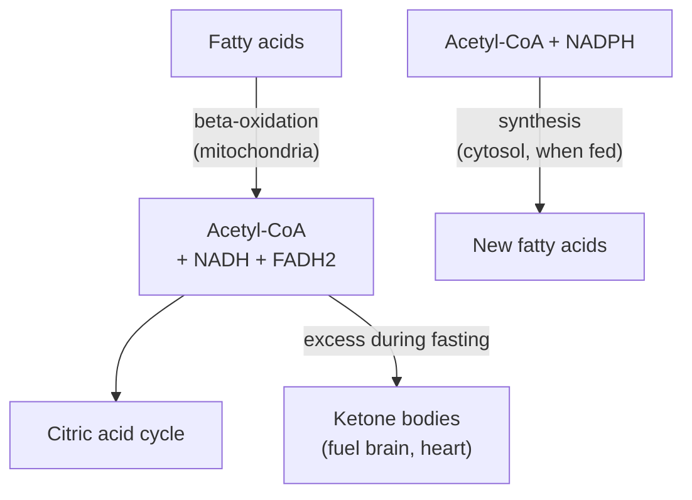

## Biochem::Amino_Acid_Metabolism

### LESSON-BIOCHEM-AMINO-ACID-METABOLISM

- **KC:** `Biochem::Amino_Acid_Metabolism`
- **Title:** Amino Acid Metabolism: Nitrogen Handling and Carbon Skeletons
- **Section:** `MCAT::Bio_Biochem`
- **Source:** authored
- **Review Status:** needs_review
- **Overview:** Amino acid metabolism handles the nitrogen and carbon of amino
  acids when they are made or broken down. Nitrogen is removed and detoxified as
  urea, while carbon skeletons feed energy pathways. Amino acids are classified
  by where their carbons end up.
- **Key Concepts:**
  - Transamination moves an amino group to a keto acid (often forming
    glutamate); oxidative deamination then frees ammonia.
  - The urea cycle converts toxic ammonia into urea for excretion, mostly in the
    liver.
  - Carbon skeletons enter metabolism as TCA-cycle intermediates or acetyl-CoA.
  - Glucogenic amino acids can make glucose; ketogenic amino acids yield
    acetyl-CoA/ketone bodies (some are both).
- **Prerequisite Reminder:** Build on `Biochem::Amino_Acids` (the substrates),
  `Biochem::Citric_Acid_Cycle` (where carbon skeletons enter), and
  `Biochem::Metabolic_Regulation` (integration with fed/fasting states).
- **Worked Example:** Alanine is transaminated to pyruvate, handing its amino
  group to α-ketoglutarate to form glutamate. The pyruvate (a glucogenic
  skeleton) can feed gluconeogenesis, while the nitrogen collected on glutamate
  is routed to the urea cycle for safe disposal. Carbon and nitrogen take
  separate fates.
- **Common Misconception:** "The urea cycle exists to get rid of excess carbon."
  The urea cycle disposes of nitrogen (as ammonia) safely; the carbon skeletons
  are handled separately by feeding energy or glucose pathways.
- **First Retrieval Prompt:** From memory, describe what transamination does and
  explain the difference between a glucogenic and a ketogenic amino acid.
- **Related KCs:** `Biochem::Amino_Acids`, `Biochem::Citric_Acid_Cycle`,
  `Biochem::Metabolic_Regulation`
- **Diagram:** Splitting an amino acid into separate nitrogen and carbon fates:

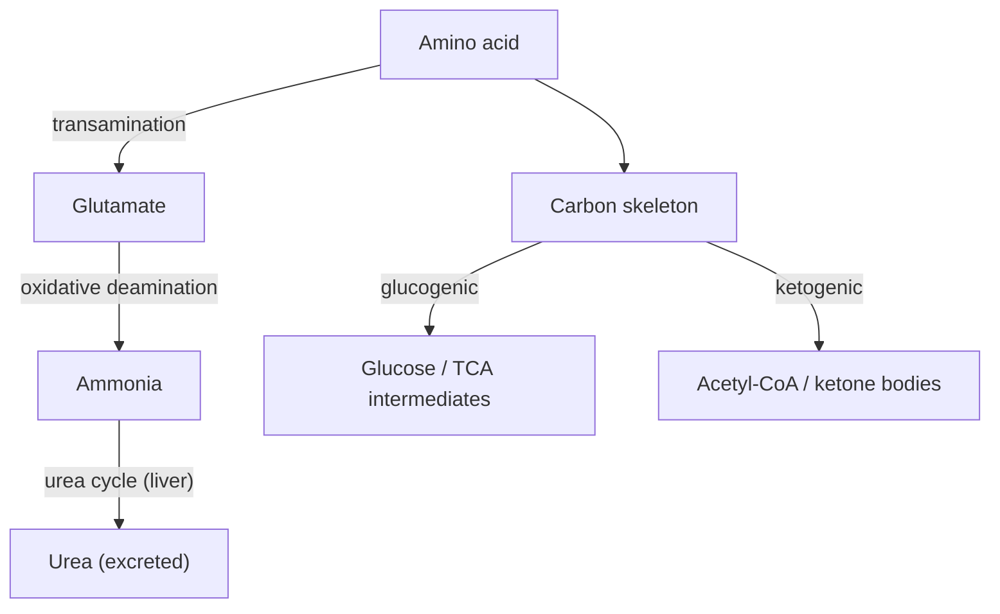

## Biochem::Nucleotides_and_Nucleic_Acids

### LESSON-BIOCHEM-NUCLEOTIDES-AND-NUCLEIC-ACIDS

- **KC:** `Biochem::Nucleotides_and_Nucleic_Acids`
- **Title:** Nucleotides and Nucleic Acids: Building Blocks of DNA and RNA
- **Section:** `MCAT::Bio_Biochem`
- **Source:** authored
- **Review Status:** needs_review
- **Overview:** This KC covers the chemistry and structure of nucleotides and the
  nucleic acids they build. It focuses on the parts of a nucleotide, base
  pairing, and the properties of DNA and RNA - not the biology of replication or
  gene expression. These structural facts underlie melting behavior and lab
  techniques.
- **Key Concepts:**
  - A nucleotide has a nitrogenous base, a five-carbon sugar (ribose or
    deoxyribose), and one or more phosphates.
  - Bases are purines (A, G - two rings) or pyrimidines (C, T, U - one ring); A
    pairs with T/U (2 H-bonds), G with C (3 H-bonds).
  - A phosphodiester backbone links nucleotides 5′ to 3′; strands are
    antiparallel in duplex DNA.
  - Higher G-C content raises melting temperature (Tm) because G-C pairs have
    three hydrogen bonds.
- **Prerequisite Reminder:** Build on `Bio::DNA` (the biological molecule) and
  `GenChem::Chemical_Bonding` (the covalent and hydrogen bonding that hold
  nucleotides and base pairs together).
- **Worked Example:** Two DNA samples melt at different temperatures. Sample A is
  60% G-C and sample B is 30% G-C. Because each G-C pair contributes three
  hydrogen bonds versus two for A-T, sample A needs more heat to separate its
  strands, so it has the higher Tm. Base composition, not length alone, drives
  melting here.
- **Common Misconception:** "More A-T content makes DNA harder to melt." A-T
  pairs have only two hydrogen bonds, so A-T-rich DNA melts more easily; G-C-rich
  DNA (three H-bonds per pair) has the higher melting temperature.
- **First Retrieval Prompt:** From memory, list the three components of a
  nucleotide and explain why G-C-rich DNA has a higher melting temperature than
  A-T-rich DNA.
- **Related KCs:** `Bio::DNA`, `GenChem::Chemical_Bonding`,
  `Biochem::Pentose_Phosphate_Pathway`,
  `Biochem::Electrophoresis_and_Immunoassays`, `Bio::Transcription`
- **Diagram:** Nucleotide anatomy of a phosphate joined to a pentose sugar joined to a nitrogenous base; purines (A, G) have two fused rings while pyrimidines (C, T, U) have one ring; A pairs with T by two hydrogen bonds and G with C by three, so higher G-C content raises the melting temperature

<figure class="lesson-diagram">
<svg xmlns="http://www.w3.org/2000/svg" viewBox="0 0 540 440" role="img" aria-labelledby="t d" font-family="-apple-system, Segoe UI, Roboto, sans-serif">
  <title id="t">Nucleotide anatomy and base pairing</title>
  <desc id="d">A nucleotide is a phosphate joined to a five-carbon sugar joined to a nitrogenous base. Purines (adenine and guanine) have two fused rings; pyrimidines (cytosine, thymine, uracil) have one ring. Adenine pairs with thymine via two hydrogen bonds and guanine pairs with cytosine via three, so higher G-C content raises the melting temperature.</desc>
  <rect x="6" y="6" width="528" height="428" rx="14" fill="#ffffff" stroke="#cfd8dc" stroke-width="2"/>
  <text x="270" y="34" text-anchor="middle" font-size="18" font-weight="700" fill="#263238">Nucleotide anatomy &amp; base pairing</text>
  <text x="270" y="60" text-anchor="middle" font-size="12" fill="#607d8b">one nucleotide = phosphate + sugar + base</text>

  <circle cx="110" cy="128" r="24" fill="#ef6c00" stroke="#e65100" stroke-width="2"/>
  <text x="110" y="133" text-anchor="middle" font-size="15" font-weight="700" fill="#ffffff">P</text>
  <text x="110" y="176" text-anchor="middle" font-size="11" fill="#607d8b">phosphate</text>
  <line x1="134" y1="128" x2="168" y2="128" stroke="#607d8b" stroke-width="3"/>
  <polygon points="196,106 220,124 211,152 181,152 172,124" fill="#eceff1" stroke="#607d8b" stroke-width="2"/>
  <text x="196" y="134" text-anchor="middle" font-size="11" font-weight="700" fill="#455a64">sugar</text>
  <text x="196" y="176" text-anchor="middle" font-size="11" fill="#607d8b">pentose (ribose)</text>
  <line x1="222" y1="128" x2="256" y2="128" stroke="#607d8b" stroke-width="3"/>
  <rect x="256" y="110" width="90" height="36" rx="8" fill="#1565c0" stroke="#0d47a1" stroke-width="2"/>
  <text x="301" y="133" text-anchor="middle" font-size="13" font-weight="700" fill="#ffffff">base</text>
  <text x="301" y="176" text-anchor="middle" font-size="11" fill="#607d8b">nitrogenous base</text>

  <text x="270" y="212" text-anchor="middle" font-size="13" font-weight="700" fill="#455a64">Purines vs pyrimidines</text>
  <polygon points="140,236 161,248 161,272 140,284 119,272 119,248" fill="#c8e6c9" stroke="#2e7d32" stroke-width="2"/>
  <polygon points="161,248 186,252 196,260 186,268 161,272" fill="#a5d6a7" stroke="#2e7d32" stroke-width="2"/>
  <text x="150" y="308" text-anchor="middle" font-size="11" fill="#2e7d32">purine: A, G (2 rings)</text>
  <polygon points="380,236 401,248 401,272 380,284 359,272 359,248" fill="#ffcdd2" stroke="#c62828" stroke-width="2"/>
  <text x="380" y="308" text-anchor="middle" font-size="11" fill="#c62828">pyrimidine: C, T, U (1 ring)</text>

  <text x="270" y="346" text-anchor="middle" font-size="13" font-weight="700" fill="#263238">A = T (2 H-bonds) &#183; G &#8801; C (3 H-bonds)</text>
  <text x="270" y="372" text-anchor="middle" font-size="12" fill="#37474f">Higher G-C content &#8594; more H-bonds &#8594; higher melting Tm</text>
  <text x="270" y="396" text-anchor="middle" font-size="11" fill="#607d8b">a purine always pairs with a pyrimidine (uniform helix width)</text>
</svg>
</figure>

## Biochem::Membranes_and_Transport

### LESSON-BIOCHEM-MEMBRANES-AND-TRANSPORT

- **KC:** `Biochem::Membranes_and_Transport`
- **Title:** Membranes and Transport: The Fluid Mosaic Model
- **Section:** `MCAT::Bio_Biochem`
- **Source:** authored
- **Review Status:** needs_review
- **Overview:** Biological membranes are amphipathic lipid bilayers studded with
  proteins, described by the fluid mosaic model. They are selectively permeable,
  so cells use different transport modes to move solutes. Transport is where
  lipid and protein biochemistry meet cell physiology.
- **Key Concepts:**
  - The bilayer is amphipathic (hydrophilic heads out, hydrophobic tails in);
    fluidity depends on temperature, chain saturation, and cholesterol.
  - Small nonpolar molecules cross directly; ions and large polar solutes need
    protein channels or carriers.
  - Passive transport (simple/facilitated diffusion) moves solutes down their
    gradient with no ATP; active transport moves them against a gradient and
    needs energy.
  - Primary active transport uses ATP directly (e.g., the Na+/K+ pump);
    secondary active transport uses an existing ion gradient.
- **Prerequisite Reminder:** Build on `Bio::Eukaryotic_Cell` (the cellular
  context), `Biochem::Carbohydrates_and_Lipids` (the phospholipids that form the
  bilayer), and `Biochem::Protein_Structure_and_Function` (the transport
  proteins).
- **Worked Example:** Glucose enters many cells by facilitated diffusion through
  GLUT transporters: it moves down its concentration gradient and needs no ATP
  even though it uses a protein. Contrast the Na+/K+-ATPase, which pumps ions
  against their gradients and therefore must hydrolyze ATP. "Uses a protein" and
  "uses energy" are separate questions.
- **Common Misconception:** "Facilitated diffusion requires ATP because it uses a
  protein." Facilitated diffusion is passive - the protein just provides a path
  down the gradient; only active transport (against a gradient) consumes energy.
- **First Retrieval Prompt:** From memory, distinguish passive from active
  transport and explain why facilitated diffusion, despite using a protein, does
  not need ATP.
- **Related KCs:** `Bio::Eukaryotic_Cell`,
  `Biochem::Carbohydrates_and_Lipids`,
  `Biochem::Protein_Structure_and_Function`
- **Diagram:** Fluid-mosaic phospholipid bilayer with polar heads facing water on both sides and nonpolar tails forming the interior; a channel protein permits passive transport down the gradient without ATP while a pump moves a solute against its gradient using ATP

<figure class="lesson-diagram">
<svg xmlns="http://www.w3.org/2000/svg" viewBox="0 0 540 440" role="img" aria-labelledby="t d" font-family="-apple-system, Segoe UI, Roboto, sans-serif">
  <title id="t">Phospholipid bilayer and membrane transport</title>
  <desc id="d">A fluid-mosaic phospholipid bilayer with polar heads facing the water on each side and nonpolar tails forming the interior. A channel protein lets solutes cross passively down their gradient without ATP, while a pump moves solutes against their gradient using ATP.</desc>
  <defs>
    <marker id="mah" markerWidth="9" markerHeight="9" refX="6" refY="3" orient="auto"><path d="M0,0 L6,3 L0,6 Z" fill="#37474f"/></marker>
    <marker id="mahg" markerWidth="9" markerHeight="9" refX="6" refY="3" orient="auto"><path d="M0,0 L6,3 L0,6 Z" fill="#2e7d32"/></marker>
    <marker id="mahr" markerWidth="9" markerHeight="9" refX="6" refY="3" orient="auto"><path d="M0,0 L6,3 L0,6 Z" fill="#c62828"/></marker>
  </defs>
  <rect x="6" y="6" width="528" height="428" rx="14" fill="#ffffff" stroke="#cfd8dc" stroke-width="2"/>
  <text x="270" y="34" text-anchor="middle" font-size="18" font-weight="700" fill="#263238">Membrane bilayer &amp; transport</text>

  <text x="270" y="74" text-anchor="middle" font-size="12" font-weight="700" fill="#455a64">Extracellular side</text>
  <text x="270" y="352" text-anchor="middle" font-size="12" font-weight="700" fill="#455a64">Cytoplasmic side</text>

  <g stroke="#607d8b" stroke-width="2">
    <line x1="60" y1="159" x2="60" y2="206"/><line x1="72" y1="159" x2="72" y2="206"/>
    <line x1="102" y1="159" x2="102" y2="206"/><line x1="114" y1="159" x2="114" y2="206"/>
    <line x1="144" y1="159" x2="144" y2="206"/><line x1="156" y1="159" x2="156" y2="206"/>
    <line x1="270" y1="159" x2="270" y2="206"/><line x1="282" y1="159" x2="282" y2="206"/>
    <line x1="312" y1="159" x2="312" y2="206"/><line x1="324" y1="159" x2="324" y2="206"/>
    <line x1="438" y1="159" x2="438" y2="206"/><line x1="450" y1="159" x2="450" y2="206"/>
  </g>
  <g fill="#90caf9" stroke="#1565c0" stroke-width="1.5">
    <circle cx="66" cy="152" r="8"/><circle cx="108" cy="152" r="8"/><circle cx="150" cy="152" r="8"/>
    <circle cx="276" cy="152" r="8"/><circle cx="318" cy="152" r="8"/><circle cx="444" cy="152" r="8"/>
  </g>
  <g stroke="#607d8b" stroke-width="2">
    <line x1="60" y1="234" x2="60" y2="281"/><line x1="72" y1="234" x2="72" y2="281"/>
    <line x1="102" y1="234" x2="102" y2="281"/><line x1="114" y1="234" x2="114" y2="281"/>
    <line x1="144" y1="234" x2="144" y2="281"/><line x1="156" y1="234" x2="156" y2="281"/>
    <line x1="270" y1="234" x2="270" y2="281"/><line x1="282" y1="234" x2="282" y2="281"/>
    <line x1="312" y1="234" x2="312" y2="281"/><line x1="324" y1="234" x2="324" y2="281"/>
    <line x1="438" y1="234" x2="438" y2="281"/><line x1="450" y1="234" x2="450" y2="281"/>
  </g>
  <g fill="#90caf9" stroke="#1565c0" stroke-width="1.5">
    <circle cx="66" cy="288" r="8"/><circle cx="108" cy="288" r="8"/><circle cx="150" cy="288" r="8"/>
    <circle cx="276" cy="288" r="8"/><circle cx="318" cy="288" r="8"/><circle cx="444" cy="288" r="8"/>
  </g>

  <rect x="182" y="146" width="40" height="148" rx="12" fill="#b39ddb" stroke="#6a1b9a" stroke-width="2"/>
  <rect x="198" y="150" width="8" height="140" rx="4" fill="#ffffff"/>
  <text x="202" y="376" text-anchor="middle" font-size="11" fill="#6a1b9a">channel (passive)</text>

  <rect x="364" y="146" width="44" height="148" rx="12" fill="#80cbc4" stroke="#00796b" stroke-width="2"/>
  <text x="386" y="376" text-anchor="middle" font-size="11" fill="#00695c">pump (active)</text>
  <text x="386" y="224" text-anchor="middle" font-size="10" font-weight="700" fill="#00695c">ATP</text>

  <circle cx="202" cy="112" r="7" fill="#2e7d32"/>
  <line x1="202" y1="120" x2="202" y2="322" stroke="#2e7d32" stroke-width="2.5" marker-end="url(#mahg)"/>
  <text x="150" y="112" text-anchor="end" font-size="10" fill="#2e7d32">down gradient, no ATP</text>

  <circle cx="386" cy="326" r="7" fill="#c62828"/>
  <line x1="386" y1="320" x2="386" y2="120" stroke="#c62828" stroke-width="2.5" marker-end="url(#mahr)"/>
  <text x="430" y="118" text-anchor="start" font-size="10" fill="#c62828">against gradient, uses ATP</text>

  <text x="270" y="412" text-anchor="middle" font-size="12" fill="#607d8b">Passive transport follows the gradient; active transport works against it using energy</text>
</svg>
</figure>
- **Diagram:** Choosing a transport route across the membrane:

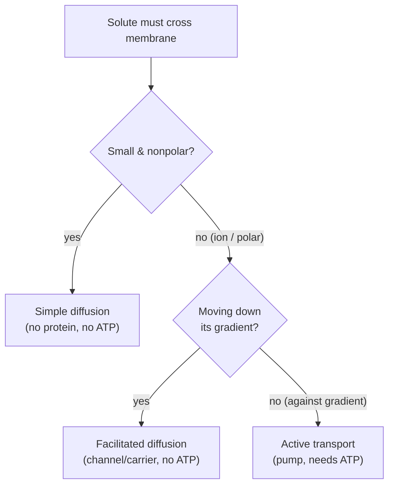

## Biochem::Chromatography_and_Separations

### LESSON-BIOCHEM-CHROMATOGRAPHY-AND-SEPARATIONS

- **KC:** `Biochem::Chromatography_and_Separations`
- **Title:** Chromatography and Separations: Purifying Biomolecules
- **Section:** `MCAT::Chem_Phys`
- **Source:** authored
- **Review Status:** needs_review
- **Overview:** These techniques separate biomolecules by exploiting physical
  differences - size, charge, or specific binding. Chromatography passes a
  mixture over a stationary phase so components move at different rates. They are
  core tools for purifying proteins for study.
- **Key Concepts:**
  - Size-exclusion (gel filtration): large molecules skip the beads' pores and
    elute first; small ones are retained and elute later.
  - Ion-exchange: separates by net charge; bound proteins are eluted by changing
    salt or pH.
  - Affinity chromatography: uses a specific ligand so only the target protein
    binds, giving high purity.
  - Supporting methods: HPLC (high resolution/pressure), plus centrifugation and
    dialysis for bulk separation.
- **Prerequisite Reminder:** Build on `Biochem::Peptides_and_Proteins` (the
  analytes), `GenChem::Intermolecular_Forces` (the interactions that retain
  molecules), and `Orgo::Separations_and_Purifications` (the general separation
  logic).
- **Worked Example:** To isolate one tagged protein from a lysate, affinity
  chromatography is best: a column bearing the matching ligand binds only the
  target while everything else washes through, then the target is eluted
  specifically. If you only need to sort proteins by size, size-exclusion works -
  but remember the large proteins come off first.
- **Common Misconception:** "In size-exclusion chromatography, the largest
  molecules are retained longest and elute last." It is the reverse: large
  molecules cannot enter the pores, so they take the shorter path around the
  beads and elute first, while small molecules are delayed inside the pores.
- **First Retrieval Prompt:** From memory, explain which molecules elute first in
  size-exclusion chromatography and why affinity chromatography gives especially
  high purity.
- **Related KCs:** `Biochem::Peptides_and_Proteins`,
  `GenChem::Intermolecular_Forces`, `Orgo::Separations_and_Purifications`
- **Diagram:** Size-exclusion chromatography column packed with porous beads: large molecules cannot enter the pores and elute first, while small molecules enter the pores, are delayed, and elute later

<figure class="lesson-diagram">
<svg xmlns="http://www.w3.org/2000/svg" viewBox="0 0 540 440" role="img" aria-labelledby="t d" font-family="-apple-system, Segoe UI, Roboto, sans-serif">
  <title id="t">Size-exclusion chromatography</title>
  <desc id="d">Three stages of a size-exclusion (gel-filtration) column packed with porous beads. Large molecules cannot enter the pores, so they take the shorter path around the beads and elute first; small molecules enter the pores, are delayed, and elute later.</desc>
  <rect x="6" y="6" width="528" height="428" rx="14" fill="#ffffff" stroke="#cfd8dc" stroke-width="2"/>
  <text x="270" y="34" text-anchor="middle" font-size="18" font-weight="700" fill="#263238">Size-exclusion chromatography</text>

  <g>
    <circle cx="120" cy="62" r="8" fill="#2e7d32" stroke="#1b5e20" stroke-width="1.5"/>
    <text x="134" y="66" text-anchor="start" font-size="11" fill="#2e7d32">large (skips pores)</text>
    <circle cx="330" cy="62" r="5" fill="#ef6c00" stroke="#e65100" stroke-width="1.5"/>
    <text x="342" y="66" text-anchor="start" font-size="11" fill="#ef6c00">small (enters pores)</text>
  </g>

  <g fill="#dfe6ea" stroke="#b0bec5" stroke-width="1.5">
    <rect x="90" y="100" width="70" height="232" rx="8" fill="#f7f9fa"/>
    <rect x="235" y="100" width="70" height="232" rx="8" fill="#f7f9fa"/>
    <rect x="380" y="100" width="70" height="232" rx="8" fill="#f7f9fa"/>
  </g>

  <g fill="#dfe6ea" stroke="#b0bec5" stroke-width="1">
    <circle cx="108" cy="150" r="9"/><circle cx="140" cy="150" r="9"/>
    <circle cx="108" cy="188" r="9"/><circle cx="140" cy="188" r="9"/>
    <circle cx="108" cy="226" r="9"/><circle cx="140" cy="226" r="9"/>
    <circle cx="108" cy="264" r="9"/><circle cx="140" cy="264" r="9"/>
    <circle cx="108" cy="302" r="9"/><circle cx="140" cy="302" r="9"/>
    <circle cx="253" cy="150" r="9"/><circle cx="285" cy="150" r="9"/>
    <circle cx="253" cy="188" r="9"/><circle cx="285" cy="188" r="9"/>
    <circle cx="253" cy="226" r="9"/><circle cx="285" cy="226" r="9"/>
    <circle cx="253" cy="264" r="9"/><circle cx="285" cy="264" r="9"/>
    <circle cx="253" cy="302" r="9"/><circle cx="285" cy="302" r="9"/>
    <circle cx="398" cy="150" r="9"/><circle cx="430" cy="150" r="9"/>
    <circle cx="398" cy="188" r="9"/><circle cx="430" cy="188" r="9"/>
    <circle cx="398" cy="226" r="9"/><circle cx="430" cy="226" r="9"/>
    <circle cx="398" cy="264" r="9"/><circle cx="430" cy="264" r="9"/>
    <circle cx="398" cy="302" r="9"/><circle cx="430" cy="302" r="9"/>
  </g>

  <g fill="#2e7d32" stroke="#1b5e20" stroke-width="1.5">
    <circle cx="120" cy="122" r="8"/><circle cx="142" cy="130" r="8"/>
    <circle cx="262" cy="252" r="8"/><circle cx="290" cy="242" r="8"/>
    <circle cx="412" cy="308" r="8"/><circle cx="434" cy="318" r="8"/>
    <circle cx="415" cy="360" r="8"/>
  </g>
  <g fill="#ef6c00" stroke="#e65100" stroke-width="1.5">
    <circle cx="112" cy="140" r="5"/><circle cx="150" cy="124" r="5"/><circle cx="130" cy="150" r="5"/>
    <circle cx="270" cy="176" r="5"/><circle cx="252" cy="190" r="5"/><circle cx="292" cy="182" r="5"/>
    <circle cx="400" cy="212" r="5"/><circle cx="430" cy="222" r="5"/><circle cx="414" cy="198" r="5"/>
  </g>

  <g fill="#b0bec5">
    <polygon points="111,332 129,332 120,352"/>
    <polygon points="256,332 274,332 265,352"/>
    <polygon points="401,332 419,332 410,352"/>
  </g>

  <text x="125" y="374" text-anchor="middle" font-size="11" fill="#37474f">1. load mixture</text>
  <text x="270" y="374" text-anchor="middle" font-size="11" fill="#37474f">2. large moves faster</text>
  <text x="415" y="374" text-anchor="middle" font-size="11" fill="#37474f">3. large elutes first</text>

  <text x="270" y="410" text-anchor="middle" font-size="12" fill="#607d8b">Large molecules skip the beads' pores and elute first; small molecules are retained</text>
</svg>
</figure>
- **Diagram:** Choosing a separation method by the property it exploits:

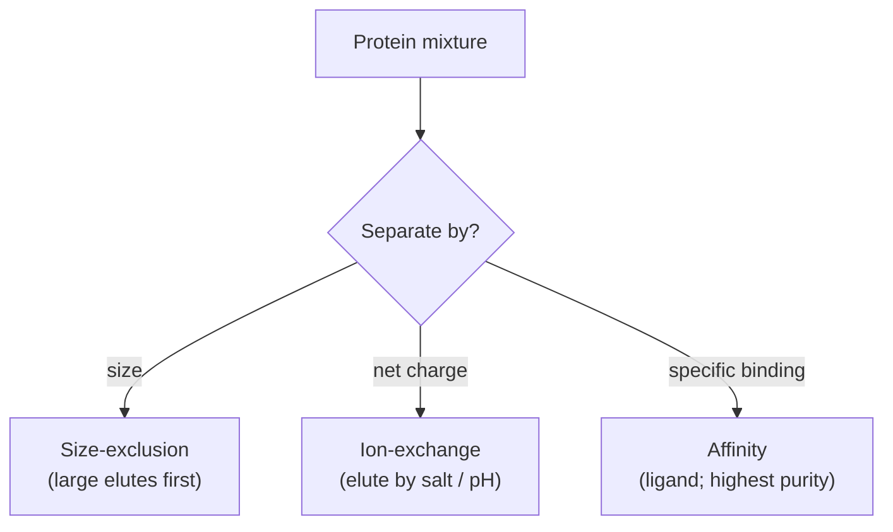

## Biochem::Electrophoresis_and_Immunoassays

### LESSON-BIOCHEM-ELECTROPHORESIS-AND-IMMUNOASSAYS

- **KC:** `Biochem::Electrophoresis_and_Immunoassays`
- **Title:** Electrophoresis and Immunoassays: Charge, Size, and Detection
- **Section:** `MCAT::Chem_Phys`
- **Source:** authored
- **Review Status:** needs_review
- **Overview:** Electrophoresis separates charged biomolecules in a gel under an
  electric field, while immunoassays use antibodies to detect specific targets.
  Together they identify, size, and quantify proteins and nucleic acids.
  Migration depends on charge, size, and how the sample is prepared.
- **Key Concepts:**
  - In an electric field, molecules migrate toward the opposite charge; a gel
    matrix sieves by size.
  - SDS-PAGE coats proteins with uniform negative charge, so they separate
    essentially by size alone.
  - Isoelectric focusing separates proteins by pI (they stop where net charge is
    zero); nucleic acids run by size in agarose.
  - Blotting (Western/Southern/Northern) and ELISA add specific detection using
    antibodies or probes.
- **Prerequisite Reminder:** Build on `Biochem::Nucleotides_and_Nucleic_Acids`
  and `Biochem::Peptides_and_Proteins` (the molecules separated) and
  `GenChem::Acid_Base_Equilibria` (the charge/pH behavior behind pI and
  migration).
- **Worked Example:** Two proteins have the same mass but different charges. On
  native PAGE they migrate differently (charge matters), but on SDS-PAGE they
  co-migrate because SDS masks their intrinsic charge and separation depends only
  on size. The method you choose depends on whether you want to separate by size
  or by native charge.
- **Common Misconception:** "SDS-PAGE separates proteins by their charge." SDS
  gives all proteins a similar charge-to-mass ratio, so SDS-PAGE separates
  essentially by size; native gels and isoelectric focusing are what exploit
  intrinsic charge.
- **First Retrieval Prompt:** From memory, explain what SDS does to proteins
  before PAGE and why that makes migration depend on size rather than native
  charge.
- **Related KCs:** `Biochem::Nucleotides_and_Nucleic_Acids`,
  `Biochem::Peptides_and_Proteins`, `GenChem::Acid_Base_Equilibria`
- **Diagram:** Gel electrophoresis: samples loaded in wells migrate from the cathode toward the anode and separate by size, with small fragments traveling farther; SDS-PAGE gives proteins a uniform charge-to-mass ratio so they separate by size alone

<figure class="lesson-diagram">
<svg xmlns="http://www.w3.org/2000/svg" viewBox="0 0 540 440" role="img" aria-labelledby="t d" font-family="-apple-system, Segoe UI, Roboto, sans-serif">
  <title id="t">Gel electrophoresis separates by size</title>
  <desc id="d">Samples are loaded in wells at the top of a gel. Under an electric field, negatively charged molecules migrate from the cathode toward the anode. The gel sieves by size: large fragments stay near the wells while small fragments travel farther. SDS-PAGE gives proteins a uniform charge-to-mass ratio so they separate by size alone.</desc>
  <defs>
    <marker id="eah" markerWidth="9" markerHeight="9" refX="6" refY="3" orient="auto"><path d="M0,0 L6,3 L0,6 Z" fill="#37474f"/></marker>
  </defs>
  <rect x="6" y="6" width="528" height="428" rx="14" fill="#ffffff" stroke="#cfd8dc" stroke-width="2"/>
  <text x="270" y="34" text-anchor="middle" font-size="18" font-weight="700" fill="#263238">Gel electrophoresis &#8212; separation by size</text>

  <rect x="120" y="72" width="264" height="6" rx="3" fill="#90a4ae"/>
  <text x="120" y="66" text-anchor="start" font-size="12" font-weight="700" fill="#37474f">(&#8722;) cathode</text>
  <rect x="120" y="356" width="264" height="6" rx="3" fill="#90a4ae"/>
  <text x="120" y="380" text-anchor="start" font-size="12" font-weight="700" fill="#37474f">(+) anode</text>

  <rect x="132" y="92" width="250" height="252" rx="8" fill="#eef2f4" stroke="#b0bec5" stroke-width="1.5"/>

  <g fill="#cfd8dc">
    <rect x="158" y="98" width="44" height="8" rx="2"/>
    <rect x="233" y="98" width="44" height="8" rx="2"/>
    <rect x="308" y="98" width="44" height="8" rx="2"/>
  </g>
  <text x="180" y="90" text-anchor="middle" font-size="9" fill="#607d8b">ladder</text>
  <text x="255" y="90" text-anchor="middle" font-size="9" fill="#607d8b">lane 1</text>
  <text x="330" y="90" text-anchor="middle" font-size="9" fill="#607d8b">lane 2</text>

  <g fill="#455a64">
    <rect x="158" y="138" width="44" height="6" rx="2"/>
    <rect x="158" y="174" width="44" height="6" rx="2"/>
    <rect x="158" y="210" width="44" height="6" rx="2"/>
    <rect x="158" y="246" width="44" height="6" rx="2"/>
    <rect x="158" y="282" width="44" height="6" rx="2"/>
    <rect x="158" y="318" width="44" height="6" rx="2"/>
  </g>
  <g fill="#1565c0">
    <rect x="233" y="150" width="44" height="7" rx="2"/>
    <rect x="233" y="300" width="44" height="7" rx="2"/>
    <rect x="308" y="192" width="44" height="7" rx="2"/>
    <rect x="308" y="256" width="44" height="7" rx="2"/>
  </g>

  <line x1="108" y1="110" x2="108" y2="326" stroke="#37474f" stroke-width="2" marker-end="url(#eah)"/>
  <text transform="rotate(-90 92 218)" x="92" y="218" text-anchor="middle" font-size="11" fill="#37474f">migration toward (+)</text>

  <line x1="396" y1="150" x2="384" y2="150" stroke="#607d8b" stroke-width="1.5"/>
  <text x="400" y="146" text-anchor="start" font-size="11" fill="#455a64">large: stays near wells</text>
  <text x="400" y="160" text-anchor="start" font-size="10" fill="#607d8b">(migrates less)</text>
  <line x1="396" y1="303" x2="384" y2="303" stroke="#607d8b" stroke-width="1.5"/>
  <text x="400" y="299" text-anchor="start" font-size="11" fill="#455a64">small: travels far</text>
  <text x="400" y="313" text-anchor="start" font-size="10" fill="#607d8b">(migrates more)</text>

  <text x="270" y="408" text-anchor="middle" font-size="12" fill="#607d8b">SDS-PAGE gives a uniform charge-to-mass ratio, so proteins separate by size</text>
</svg>
</figure>
- **Diagram:** Matching the goal to the electrophoresis / detection method:

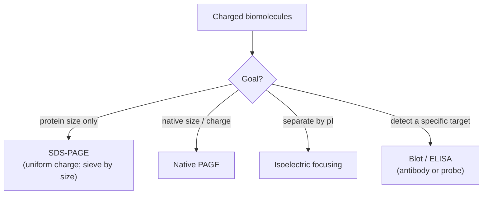

## Biochem::Vitamins_and_Cofactors

### LESSON-BIOCHEM-VITAMINS-AND-COFACTORS

- **KC:** `Biochem::Vitamins_and_Cofactors`
- **Title:** Vitamins and Cofactors: Helpers for Catalysis
- **Section:** `MCAT::Bio_Biochem`
- **Source:** authored
- **Review Status:** needs_review
- **Overview:** Many enzymes need non-protein helpers - cofactors - to work.
  Organic coenzymes are often derived from vitamins, while metal ions serve as
  inorganic cofactors. They participate directly in catalysis, which is why
  vitamin deficiencies impair specific reactions.
- **Key Concepts:**
  - Cofactor is the umbrella term; coenzymes are the organic (often
    vitamin-derived) subset, and metal ions are inorganic cofactors.
  - Water-soluble B vitamins yield coenzymes such as NAD+/NADP+ (niacin), FAD
    (riboflavin), coenzyme A (pantothenate), TPP (thiamine), and PLP (B6).
  - A tightly/covalently bound cofactor is a prosthetic group; the protein
    without its cofactor is an apoenzyme, and the active complex is a holoenzyme.
  - Vitamins are needed in small amounts and are not oxidized for energy - they
    enable reactions rather than fuel them.
- **Prerequisite Reminder:** Build on `Biochem::Enzymes`: cofactors extend what
  an active site can do chemically, so they only make sense once catalysis is
  understood.
- **Worked Example:** The pyruvate dehydrogenase complex needs several
  vitamin-derived coenzymes (including TPP from thiamine and coenzyme A from
  pantothenate). If thiamine is deficient, this reaction slows and pyruvate
  cannot be converted efficiently - a direct link between a missing vitamin and a
  stalled step.
- **Common Misconception:** "Vitamins give you energy." Vitamins are not fuel;
  they become coenzymes/cofactors that enable enzyme reactions. Energy comes from
  carbohydrates, fats, and proteins - the vitamins just help process them.
- **First Retrieval Prompt:** From memory, distinguish an apoenzyme from a
  holoenzyme and give one example of a vitamin-derived coenzyme.
- **Related KCs:** `Biochem::Enzymes`
- **Diagram:** Cofactor vocabulary and how the active enzyme is assembled:

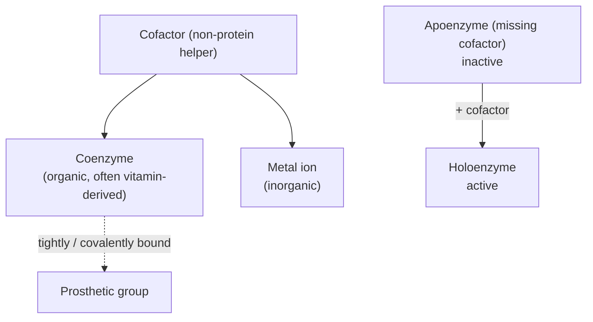

## Biochem::Hormonal_Regulation_of_Metabolism

### LESSON-BIOCHEM-HORMONAL-REGULATION-OF-METABOLISM

- **KC:** `Biochem::Hormonal_Regulation_of_Metabolism`
- **Title:** Hormonal Regulation of Metabolism: Fed and Fasting States
- **Section:** `MCAT::Bio_Biochem`
- **Source:** authored
- **Review Status:** needs_review
- **Overview:** This capstone KC integrates metabolism across the whole body and
  across fed, fasting, and starvation states. Hormones - chiefly insulin and
  glucagon - coordinate liver, muscle, adipose, and brain so fuel is stored or
  mobilized appropriately. It ties the individual pathways into one regulated
  system.
- **Key Concepts:**
  - Insulin is the "fed" signal: it promotes glucose uptake, glycogen and fat
    synthesis, and storage.
  - Glucagon (and epinephrine) is the "fasting/stress" signal: it promotes
    glycogenolysis, gluconeogenesis, and fat mobilization.
  - Tissues specialize: liver buffers blood glucose, muscle uses its own
    glycogen, adipose stores/releases fat, and the brain prefers glucose (ketones
    during prolonged fasting).
  - Cortisol supports longer-term fasting by promoting gluconeogenesis and
    protein/fat breakdown.
- **Prerequisite Reminder:** Build on `Biochem::Metabolic_Regulation`,
  `Biochem::Gluconeogenesis`, and `Biochem::Lipid_Metabolism`, plus
  `Bio::Endocrine_System` (the hormones and their signaling).
- **Worked Example:** A few hours after a meal, blood glucose falls, so insulin
  drops and glucagon rises. In the liver this activates glycogenolysis and then
  gluconeogenesis to export glucose, while adipose releases fatty acids for other
  tissues to burn - sparing glucose for the brain. One hormonal switch
  reorganizes several pathways at once.
- **Common Misconception:** "Insulin and glucagon can be high and fully active at
  the same time." They are reciprocal signals; normally one dominates (the
  insulin-to-glucagon ratio sets the state), so the body is in a net fed or net
  fasting mode rather than storing and mobilizing simultaneously.
- **First Retrieval Prompt:** From memory, contrast the metabolic jobs of insulin
  and glucagon and describe what the liver does a few hours into a fast.
- **Related KCs:** `Bio::Endocrine_System`, `Biochem::Gluconeogenesis`,
  `Biochem::Lipid_Metabolism`, `Biochem::Metabolic_Regulation`
- **Diagram:** Fed vs fasted — insulin and glucagon set the whole-body state:

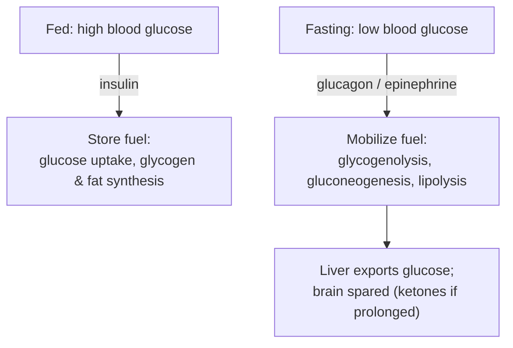
