# Biology Lessons (Track C — scaled draft)

Auto-drafted lesson pages for the 34 `Bio::` KCs in the frozen unified map (`added features/kc-map-unified.md` §6/§7). Schema + style follow `added features/lessons.md`. All content is synthetic and original (not copied from any copyrighted prep material). New lessons are `Source: authored`, `Review Status: needs_review` (hidden behind the display gate until a human approves them, per `lesson-contract.md` §4).

## Bio::DNA

### LESSON-BIO-DNA

- **KC:** `Bio::DNA`
- **Title:** DNA: Structure and Base Pairing
- **Section:** `MCAT::Bio_Biochem`
- **Source:** authored
- **Review Status:** approved
- **Overview:** DNA is the molecule that stores heritable information as a
  linear sequence of four bases. Its double-helix shape and predictable base
  pairing are what let the sequence be copied and read reliably. Almost every
  later molecular-biology topic assumes you are fluent with this structure.
- **Key Concepts:**
  - A nucleotide has three parts: a deoxyribose sugar, a phosphate, and one of
    four bases (A, T, G, C).
  - Strands run antiparallel (5' to 3' opposite 3' to 5') and are joined by a
    sugar-phosphate backbone.
  - Base pairing is specific: A pairs with T (two hydrogen bonds), G pairs with
    C (three hydrogen bonds).
  - More G-C content means more hydrogen bonds, so the helix is harder to melt
    apart.
- **Prerequisite Reminder:** Foundation KC - no prerequisites assumed beyond
  basic biology vocabulary.
- **Worked Example:** One strand reads 5'-GCTA-3'. Its complement must pair
  base-by-base and run antiparallel, so the partner strand is 3'-CGAT-5' (write
  it 5'-TAGC-3' when read in its own 5' to 3' direction). Notice each G lines up
  with a C and each A with a T.
- **Common Misconception:** "A always pairs with G because they are both
  purines." Pairing is not about purine-vs-purine; it is complementary: a purine
  always pairs with a specific pyrimidine (A-T, G-C) so the helix stays a uniform
  width.
- **First Retrieval Prompt:** Without looking back, state which base pairs with
  guanine and how many hydrogen bonds hold that pair together.
- **Related KCs:** `Bio::DNA_Replication`, `Bio::Transcription`, `Bio::Genetics`, `Bio::Viruses`, `Bio::Biotechnology`, `Biochem::Nucleotides_and_Nucleic_Acids`
- **Diagram:** DNA base pairing: antiparallel strands with A=T held by 2 hydrogen bonds and G-C held by 3 hydrogen bonds

<figure class="lesson-diagram">
<svg xmlns="http://www.w3.org/2000/svg" viewBox="0 0 540 440" role="img" aria-labelledby="t d" font-family="-apple-system, Segoe UI, Roboto, sans-serif">
  <title id="t">DNA base pairing</title>
  <desc id="d">Two antiparallel sugar-phosphate backbones. A pairs with T via two hydrogen bonds; G pairs with C via three hydrogen bonds. Left strand runs 5-prime to 3-prime top to bottom; right strand runs 3-prime to 5-prime.</desc>
  <rect x="6" y="6" width="528" height="428" rx="14" fill="#ffffff" stroke="#cfd8dc" stroke-width="2"/>
  <text x="270" y="36" text-anchor="middle" font-size="18" font-weight="700" fill="#263238">DNA base pairing &#8212; antiparallel double helix</text>

  <rect x="92" y="70" width="14" height="290" rx="7" fill="#90a4ae"/>
  <rect x="434" y="70" width="14" height="290" rx="7" fill="#90a4ae"/>

  <text x="99" y="62" text-anchor="middle" font-size="13" font-weight="700" fill="#37474f">5'</text>
  <text x="99" y="380" text-anchor="middle" font-size="13" font-weight="700" fill="#37474f">3'</text>
  <text x="441" y="62" text-anchor="middle" font-size="13" font-weight="700" fill="#37474f">3'</text>
  <text x="441" y="380" text-anchor="middle" font-size="13" font-weight="700" fill="#37474f">5'</text>

  <g stroke="#90a4ae" stroke-width="6">
    <line x1="106" y1="110" x2="112" y2="110"/><line x1="428" y1="110" x2="434" y2="110"/>
    <line x1="106" y1="170" x2="112" y2="170"/><line x1="428" y1="170" x2="434" y2="170"/>
    <line x1="106" y1="230" x2="112" y2="230"/><line x1="428" y1="230" x2="434" y2="230"/>
    <line x1="106" y1="290" x2="112" y2="290"/><line x1="428" y1="290" x2="434" y2="290"/>
  </g>

  <g stroke="#78909c" stroke-width="3" stroke-dasharray="4 4">
    <line x1="190" y1="103" x2="350" y2="103"/><line x1="190" y1="117" x2="350" y2="117"/>
    <line x1="190" y1="163" x2="350" y2="163"/><line x1="190" y1="177" x2="350" y2="177"/>
    <line x1="190" y1="220" x2="350" y2="220"/><line x1="190" y1="230" x2="350" y2="230"/><line x1="190" y1="240" x2="350" y2="240"/>
    <line x1="190" y1="280" x2="350" y2="280"/><line x1="190" y1="290" x2="350" y2="290"/><line x1="190" y1="300" x2="350" y2="300"/>
  </g>

  <rect x="112" y="92" width="74" height="36" rx="8" fill="#2e7d32"/><text x="149" y="116" text-anchor="middle" font-size="20" font-weight="700" fill="#fff">A</text>
  <rect x="354" y="92" width="74" height="36" rx="8" fill="#c62828"/><text x="391" y="116" text-anchor="middle" font-size="20" font-weight="700" fill="#fff">T</text>

  <rect x="112" y="152" width="74" height="36" rx="8" fill="#c62828"/><text x="149" y="176" text-anchor="middle" font-size="20" font-weight="700" fill="#fff">T</text>
  <rect x="354" y="152" width="74" height="36" rx="8" fill="#2e7d32"/><text x="391" y="176" text-anchor="middle" font-size="20" font-weight="700" fill="#fff">A</text>

  <rect x="112" y="212" width="74" height="36" rx="8" fill="#1565c0"/><text x="149" y="236" text-anchor="middle" font-size="20" font-weight="700" fill="#fff">G</text>
  <rect x="354" y="212" width="74" height="36" rx="8" fill="#ef6c00"/><text x="391" y="236" text-anchor="middle" font-size="20" font-weight="700" fill="#fff">C</text>

  <rect x="112" y="272" width="74" height="36" rx="8" fill="#ef6c00"/><text x="149" y="296" text-anchor="middle" font-size="20" font-weight="700" fill="#fff">C</text>
  <rect x="354" y="272" width="74" height="36" rx="8" fill="#1565c0"/><text x="391" y="296" text-anchor="middle" font-size="20" font-weight="700" fill="#fff">G</text>

  <text x="270" y="400" text-anchor="middle" font-size="13" font-weight="600" fill="#37474f">A = T (2 hydrogen bonds) &#183; G &#8801; C (3 hydrogen bonds)</text>
  <text x="270" y="420" text-anchor="middle" font-size="12" fill="#607d8b">Antiparallel strands &#183; grey = sugar&#8211;phosphate backbone</text>
</svg>
</figure>
- **Diagram:** Central dogma - how the stored sequence is copied and read:

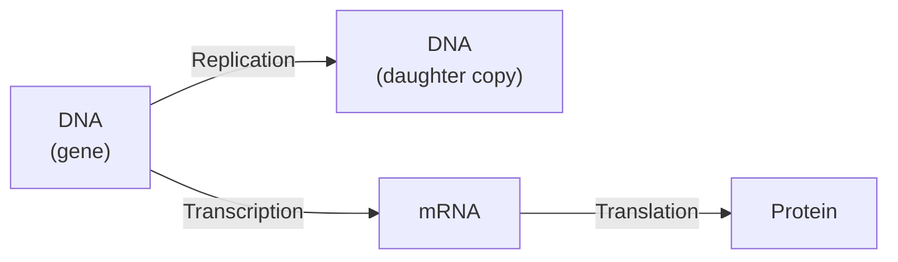

## Bio::DNA_Replication

### LESSON-BIO-DNA-REPLICATION

- **KC:** `Bio::DNA_Replication`
- **Title:** DNA Replication: Copying the Genome
- **Section:** `MCAT::Bio_Biochem`
- **Source:** authored
- **Review Status:** needs_review
- **Overview:** DNA replication copies the entire genome once per cell cycle so each daughter cell inherits a complete set of instructions. It is semiconservative: each new double helix keeps one original ("parent") strand and one newly synthesized strand. Because the two strands are antiparallel, the two new strands are built differently at the replication fork.
- **Key Concepts:**
  - Replication is semiconservative: each product helix has one old and one new strand.
  - DNA polymerase adds nucleotides only in the 5' to 3' direction, reading the template 3' to 5'.
  - The leading strand is made continuously; the lagging strand is made in short Okazaki fragments later joined by ligase.
  - Helicase unwinds the helix, primase lays down RNA primers, and polymerase proofreads to keep the error rate very low.
- **Prerequisite Reminder:** Build on `Bio::DNA` (antiparallel strands and base pairing) and `Biochem::Enzymes`: replication is a coordinated team of enzymes acting on that base-paired template.
- **Worked Example:** A fork moves left to right along the DNA. The strand whose template runs 3' to 5' in the direction of fork movement is synthesized continuously toward the fork (leading). Its partner template runs 5' to 3' toward the fork, so polymerase must work away from the fork in pieces (lagging), each started by a fresh primer. One fork, two synthesis modes - all because polymerase is one-directional.
- **Common Misconception:** "Both new strands are built continuously in the same way." Only the leading strand is continuous; the antiparallel geometry forces the lagging strand into discontinuous Okazaki fragments.
- **First Retrieval Prompt:** From memory, explain why one strand at the replication fork must be made in fragments while the other is made continuously.
- **Related KCs:** `Bio::DNA`, `Biochem::Enzymes`, `Bio::Cell_Cycle_and_Mitosis`
- **Diagram:** Replication fork - one polymerase rule forces two synthesis modes:

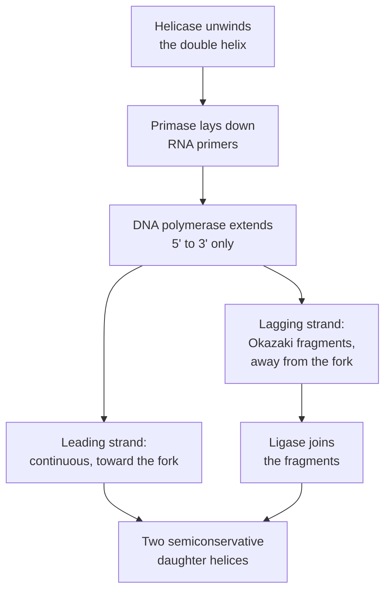

## Bio::Transcription

### LESSON-BIO-TRANSCRIPTION

- **KC:** `Bio::Transcription`
- **Title:** Transcription: Reading DNA into RNA
- **Section:** `MCAT::Bio_Biochem`
- **Source:** authored
- **Review Status:** needs_review
- **Overview:** Transcription copies a gene's DNA sequence into a complementary RNA message. RNA polymerase reads one DNA strand and builds an RNA strand using the same base-pairing logic, except uracil replaces thymine. In eukaryotes the primary transcript is then processed before it can be translated.
- **Key Concepts:**
  - RNA polymerase synthesizes RNA 5' to 3', reading the template strand 3' to 5', and needs no primer.
  - Base pairing follows DNA rules with U in place of T (A pairs with U).
  - Eukaryotic pre-mRNA is processed: a 5' cap, a poly-A tail, and splicing that removes introns and joins exons.
  - Only the template (antisense) strand is read; the coding strand matches the mRNA sequence (with T for U).
- **Prerequisite Reminder:** Recall `Bio::DNA` base pairing and `Biochem::Nucleotides_and_Nucleic_Acids`: RNA uses ribonucleotides and the base uracil, so the same pairing chemistry writes an RNA copy.
- **Worked Example:** A template strand reads 3'-TAC GGA-5'. Transcribing it gives mRNA 5'-AUG CCU-3': each base pairs (A-U, T-A, C-G, G-C) and U stands in for T. Notice the mRNA sequence matches the coding strand except for T being replaced by U.
- **Common Misconception:** "Transcription reads both DNA strands at once." For a given gene only one strand (the template) is transcribed; the other strand's sequence simply matches the RNA.
- **First Retrieval Prompt:** From memory, write the mRNA sequence transcribed from the template 3'-ACG-5' and state which base replaces thymine.
- **Related KCs:** `Bio::DNA`, `Biochem::Nucleotides_and_Nucleic_Acids`, `Bio::Translation`, `Bio::Gene_Expression_Regulation`
- **Diagram:** Transcription stages from DNA template to mature mRNA:

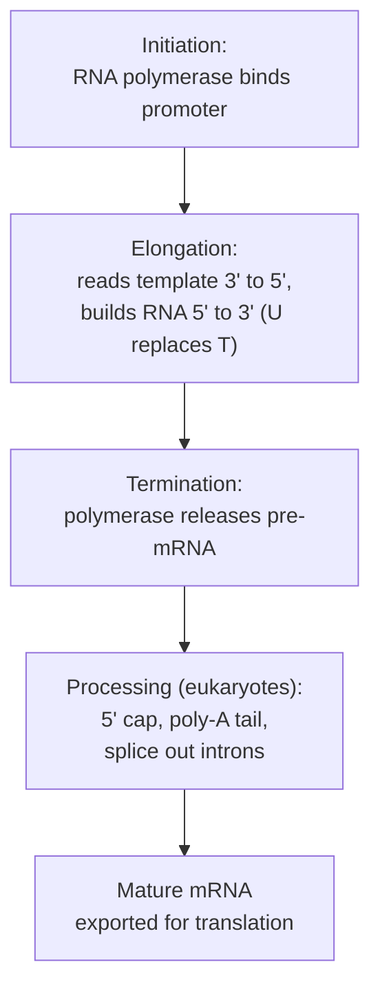

## Bio::Translation

### LESSON-BIO-TRANSLATION

- **KC:** `Bio::Translation`
- **Title:** Translation: Building Proteins from mRNA
- **Section:** `MCAT::Bio_Biochem`
- **Source:** authored
- **Review Status:** needs_review
- **Overview:** Translation decodes an mRNA sequence into a chain of amino acids at the ribosome. The genetic code is read in three-base codons, each specifying one amino acid delivered by a matching tRNA. The product is a polypeptide that later folds into a functional protein.
- **Key Concepts:**
  - The genetic code is read in non-overlapping codons of three nucleotides.
  - Each tRNA carries a specific amino acid and an anticodon that base-pairs with the mRNA codon.
  - Ribosomes have A, P, and E sites that coordinate codon reading, peptide-bond formation, and tRNA release.
  - A start codon (AUG) and stop codons bracket the reading frame; the code is degenerate (several codons per amino acid).
- **Prerequisite Reminder:** Build on `Bio::Transcription` (you now have a processed mRNA) and `Biochem::Peptides_and_Proteins`: translation strings amino acids into the peptide bonds you studied there.
- **Worked Example:** An mRNA reads 5'-AUG GCA UAA-3'. Reading in frame: AUG = start (Met), GCA = Ala, UAA = stop. The ribosome makes a two-residue peptide (Met-Ala) and releases it at the stop codon. Shift the frame by one base and every downstream codon changes - which is why frameshift mutations are so damaging.
- **Common Misconception:** "Each amino acid has exactly one codon." The code is degenerate: most amino acids are specified by several codons, which buffers many point mutations.
- **First Retrieval Prompt:** From memory, translate the in-frame mRNA 5'-AUG-GCA-UAA-3' and explain what the final codon does.
- **Related KCs:** `Bio::Transcription`, `Biochem::Peptides_and_Proteins`, `Bio::Gene_Expression_Regulation`
- **Diagram:** Translation stages - reading codons into a polypeptide:

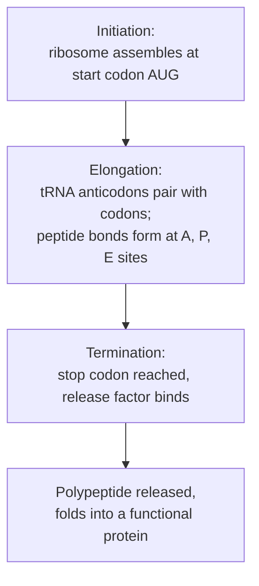

## Bio::Gene_Expression_Regulation

### LESSON-BIO-GENE-EXPRESSION-REGULATION

- **KC:** `Bio::Gene_Expression_Regulation`
- **Title:** Gene Expression Regulation: Turning Genes On and Off
- **Section:** `MCAT::Bio_Biochem`
- **Source:** authored
- **Review Status:** needs_review
- **Overview:** Cells control which genes are expressed, when, and how much, so that identical genomes can produce very different cell types and responses. Regulation occurs at many levels, but transcriptional control - deciding whether a gene is transcribed at all - is the largest lever. Prokaryotes and eukaryotes use overlapping but distinct strategies.
- **Key Concepts:**
  - Prokaryotes cluster related genes into operons (inducible or repressible) controlled by a shared promoter and operator.
  - Eukaryotes tune each gene with transcription factors, enhancers, and chromatin state.
  - Epigenetic marks (DNA methylation, histone modification) change gene accessibility without changing sequence.
  - Post-transcriptional control (alternative splicing, miRNA, mRNA stability) adds further layers.
- **Prerequisite Reminder:** You should already understand `Bio::Transcription` and `Bio::Translation`: regulation works by throttling those very steps, most often at transcription.
- **Worked Example:** In the lac operon, lactose availability flips a switch: when lactose is present it inactivates the repressor, so RNA polymerase can transcribe the enzymes that digest lactose; when lactose is gone, the repressor rebinds and transcription stops. The cell only pays to make the enzymes when the substrate is actually there.
- **Common Misconception:** "Each cell type has a different genome, which is why it expresses different genes." Nearly all somatic cells share the same genome; differences come from differential regulation, not different genes.
- **First Retrieval Prompt:** From memory, explain how a cell with lactose available ends up transcribing lactose-digesting genes, in terms of the repressor.
- **Related KCs:** `Bio::Transcription`, `Bio::Translation`, `Bio::Embryology`
- **Diagram:** lac operon - the switch that senses lactose:

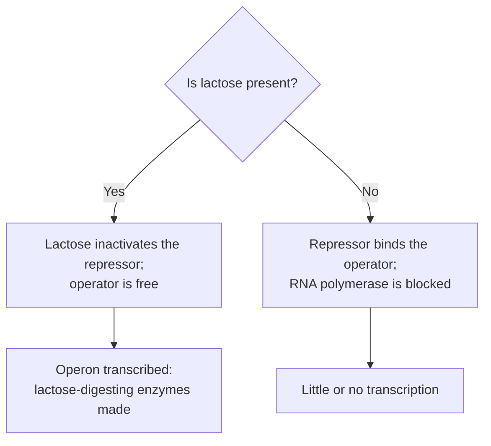

## Bio::Biotechnology

### LESSON-BIO-BIOTECHNOLOGY

- **KC:** `Bio::Biotechnology`
- **Title:** Biotechnology: Tools for Manipulating DNA
- **Section:** `MCAT::Bio_Biochem`
- **Source:** authored
- **Review Status:** needs_review
- **Overview:** Biotechnology applies molecular-biology knowledge to detect, copy, and manipulate DNA and its products. Most core techniques exploit base pairing (for primers and probes) and the predictable behavior of nucleic acids in an electric field. These tools underlie diagnostics, forensics, and research.
- **Key Concepts:**
  - PCR uses primers and repeated heating/cooling cycles to exponentially amplify a target sequence.
  - Gel electrophoresis separates DNA fragments by size because the sugar-phosphate backbone is uniformly negative.
  - Cloning inserts a gene into a vector (e.g., a plasmid) to replicate or express it in host cells.
  - Sequencing reads the base order; blotting (Southern, Northern, Western) detects specific DNA, RNA, or protein.
- **Prerequisite Reminder:** Lean on `Bio::DNA` (the base pairing that primers and probes rely on) and `Bio::Genetics` (alleles and variation are what these tools detect).
- **Worked Example:** To test whether a sample carries a gene, design primers flanking it and run PCR. If the sequence is present, copies roughly double each cycle, so ~30 cycles yield about a billion-fold amplification; run the product on a gel and a band appears at the expected size. No template, no band - the assay's specificity comes from the primers.
- **Common Misconception:** "Larger DNA fragments travel farther through a gel." Charge-per-length is roughly constant, so smaller fragments move faster and travel farther, while larger fragments lag near the wells.
- **First Retrieval Prompt:** From memory, explain why smaller DNA fragments migrate farther on a gel even though every fragment carries negative charge.
- **Related KCs:** `Bio::DNA`, `Bio::Genetics`
- **Diagram:** Gel electrophoresis schematic: a size-ladder lane and three sample lanes of DNA bands; smaller fragments migrate farther down toward the positive electrode

<figure class="lesson-diagram">
<svg xmlns="http://www.w3.org/2000/svg" viewBox="0 0 540 440" role="img" aria-labelledby="t d" font-family="-apple-system, Segoe UI, Roboto, sans-serif">
  <title id="t">Gel electrophoresis</title>
  <desc id="d">A slab gel with wells loaded at the negative cathode end at top. A size-ladder lane and three sample lanes show DNA bands. Smaller fragments migrate farther down toward the positive anode end. Separation is by fragment size because the DNA backbone carries a uniform negative charge.</desc>
  <rect x="6" y="6" width="528" height="428" rx="14" fill="#ffffff" stroke="#cfd8dc" stroke-width="2"/>
  <text x="270" y="34" text-anchor="middle" font-size="18" font-weight="700" fill="#263238">Gel electrophoresis &#8212; separation by size</text>

  <rect x="60" y="66" width="410" height="312" rx="8" fill="#eceff1" stroke="#b0bec5" stroke-width="2"/>

  <g font-size="12" font-weight="700" fill="#37474f" text-anchor="middle">
    <text x="110" y="60">Ladder</text>
    <text x="210" y="60">S1</text>
    <text x="310" y="60">S2</text>
    <text x="400" y="60">S3</text>
  </g>

  <g fill="#37474f">
    <rect x="85" y="72" width="50" height="9" rx="2"/>
    <rect x="185" y="72" width="50" height="9" rx="2"/>
    <rect x="285" y="72" width="50" height="9" rx="2"/>
    <rect x="375" y="72" width="50" height="9" rx="2"/>
  </g>

  <g font-size="10" fill="#607d8b" text-anchor="end">
    <text x="52" y="114">1000 bp</text>
    <text x="52" y="154">750</text>
    <text x="52" y="198">500</text>
    <text x="52" y="248">250</text>
    <text x="52" y="303">100</text>
  </g>

  <g fill="#455a64">
    <rect x="85" y="108" width="50" height="7" rx="2"/>
    <rect x="85" y="150" width="50" height="7" rx="2"/>
    <rect x="85" y="194" width="50" height="7" rx="2"/>
    <rect x="85" y="244" width="50" height="7" rx="2"/>
    <rect x="85" y="299" width="50" height="7" rx="2"/>
  </g>

  <g fill="#1565c0">
    <rect x="185" y="150" width="50" height="7" rx="2"/>
    <rect x="185" y="244" width="50" height="7" rx="2"/>
  </g>
  <rect x="285" y="108" width="50" height="7" rx="2" fill="#2e7d32"/>
  <g fill="#ef6c00">
    <rect x="375" y="194" width="50" height="7" rx="2"/>
    <rect x="375" y="299" width="50" height="7" rx="2"/>
  </g>

  <line x1="500" y1="95" x2="500" y2="350" stroke="#78909c" stroke-width="3"/>
  <polygon points="500,362 493,348 507,348" fill="#78909c"/>
  <text x="500" y="90" text-anchor="middle" font-size="13" font-weight="700" fill="#37474f">&#8722;</text>
  <text x="500" y="380" text-anchor="middle" font-size="15" font-weight="700" fill="#37474f">+</text>

  <text x="265" y="402" text-anchor="middle" font-size="12" font-weight="600" fill="#37474f">Wells loaded at the &#8722; (cathode) end; DNA migrates toward + (anode).</text>
  <text x="265" y="422" text-anchor="middle" font-size="12" fill="#607d8b">Smaller fragments travel farther &#183; separation is by size.</text>
</svg>
</figure>
- **Diagram:** PCR cycle - each round roughly doubles the target:

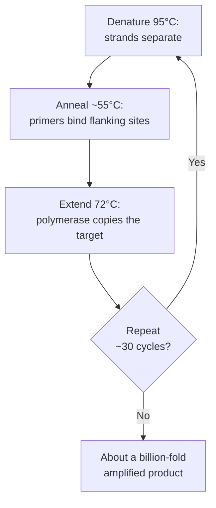

## Bio::Genetics

### LESSON-BIO-GENETICS

- **KC:** `Bio::Genetics`
- **Title:** Classical Genetics: Alleles and Inheritance
- **Section:** `MCAT::Bio_Biochem`
- **Source:** authored
- **Review Status:** approved
- **Overview:** Genetics is how the information stored in DNA is passed from one
  generation to the next. It connects an organism's underlying alleles
  (genotype) to observable traits (phenotype) using simple probability rules.
- **Key Concepts:**
  - A gene can exist as different versions called alleles.
  - Genotype is the allele pair an organism carries; phenotype is the trait you
    observe.
  - A dominant allele masks a recessive allele in a heterozygote.
  - A Punnett square predicts offspring genotype ratios from parent genotypes.
- **Prerequisite Reminder:** You should already be comfortable with `Bio::DNA`:
  genes are stretches of DNA sequence, and alleles are sequence variants of the
  same gene.
- **Worked Example:** Cross two heterozygotes, Aa x Aa. The Punnett square gives
  offspring 1 AA : 2 Aa : 1 aa. Because A is dominant, three of four show the
  dominant phenotype and one of four shows the recessive phenotype (a 3:1 ratio).
- **Common Misconception:** "Dominant means more common in the population."
  Dominance only describes which allele is expressed in a heterozygote; a
  dominant allele can be rare, and a recessive one can be common.
- **First Retrieval Prompt:** From memory, predict the phenotype ratio of an
  Aa x aa cross and explain why it differs from Aa x Aa.
- **Related KCs:** `Bio::DNA`, `Bio::Biotechnology`, `Bio::Mendelian_Genetics`, `Bio::Evolution`, `Bio::Bacteria`, `PsychSoc::Biological_and_Social_Factors`
- **Diagram:** Punnett square for a monohybrid cross Aa by Aa, showing offspring AA, Aa, Aa, aa for a 1:2:1 genotype ratio and a 3:1 phenotype ratio

<figure class="lesson-diagram">
<svg xmlns="http://www.w3.org/2000/svg" viewBox="0 0 540 440" role="img" aria-labelledby="t d" font-family="-apple-system, Segoe UI, Roboto, sans-serif">
  <title id="t">Punnett square for Aa by Aa</title>
  <desc id="d">A two by two Punnett square for a monohybrid cross between two heterozygotes. Parent gametes A and a label the columns and rows. The four offspring cells are AA, Aa, Aa, and aa, giving a genotype ratio of 1 AA to 2 Aa to 1 aa and a phenotype ratio of 3 dominant to 1 recessive.</desc>
  <rect x="6" y="6" width="528" height="428" rx="14" fill="#ffffff" stroke="#cfd8dc" stroke-width="2"/>
  <text x="270" y="34" text-anchor="middle" font-size="18" font-weight="700" fill="#263238">Punnett square &#8212; monohybrid cross Aa &#215; Aa</text>

  <text x="290" y="98" text-anchor="middle" font-size="13" font-weight="700" fill="#37474f">Parent 1 gametes</text>
  <g font-size="20" font-weight="700" fill="#263238" text-anchor="middle">
    <text x="235" y="126">A</text>
    <text x="345" y="126">a</text>
  </g>

  <text x="126" y="252" text-anchor="middle" font-size="13" font-weight="700" fill="#37474f" transform="rotate(-90 126 252)">Parent 2 gametes</text>
  <g font-size="20" font-weight="700" fill="#263238" text-anchor="middle">
    <text x="163" y="199">A</text>
    <text x="163" y="309">a</text>
  </g>

  <g stroke="#90a4ae" stroke-width="2">
    <rect x="180" y="137" width="110" height="110" fill="#e8f5e9"/>
    <rect x="290" y="137" width="110" height="110" fill="#e8f5e9"/>
    <rect x="180" y="247" width="110" height="110" fill="#e8f5e9"/>
    <rect x="290" y="247" width="110" height="110" fill="#fff3e0"/>
  </g>

  <g font-size="26" font-weight="700" text-anchor="middle">
    <text x="235" y="201" fill="#2e7d32">AA</text>
    <text x="345" y="201" fill="#2e7d32">Aa</text>
    <text x="235" y="311" fill="#2e7d32">Aa</text>
    <text x="345" y="311" fill="#ef6c00">aa</text>
  </g>

  <text x="270" y="390" text-anchor="middle" font-size="13" font-weight="600" fill="#37474f">Genotype 1 AA : 2 Aa : 1 aa</text>
  <text x="270" y="414" text-anchor="middle" font-size="12" fill="#607d8b">Phenotype 3 dominant (green) : 1 recessive (orange)</text>
</svg>
</figure>

## Bio::Meiosis

### LESSON-BIO-MEIOSIS

- **KC:** `Bio::Meiosis`
- **Title:** Meiosis: Making Genetically Varied Gametes
- **Section:** `MCAT::Bio_Biochem`
- **Source:** authored
- **Review Status:** needs_review
- **Overview:** Meiosis is the specialized cell division that produces haploid gametes from a diploid cell, halving chromosome number so fertilization can restore it. Two rounds of division follow a single round of DNA replication, and two shuffling steps - crossing over and independent assortment - generate genetic variation. Errors in separation cause aneuploidy.
- **Key Concepts:**
  - One S phase followed by two divisions (meiosis I and II) yields four haploid cells.
  - Meiosis I separates homologous chromosomes (reductional); meiosis II separates sister chromatids (equational).
  - Crossing over in prophase I and independent assortment in metaphase I create new allele combinations.
  - Nondisjunction (failure to separate) produces gametes with extra or missing chromosomes.
- **Prerequisite Reminder:** Build on `Bio::Cell_Cycle_and_Mitosis`: meiosis reuses much of the same machinery but separates homologs first and skips DNA replication between its two divisions.
- **Worked Example:** Start with a diploid cell (2n = 4). After S phase each chromosome has two sister chromatids. Meiosis I sends one homolog of each pair to each pole (now n = 2, chromatids still paired). Meiosis II then splits the chromatids, giving four haploid cells. Mitosis, by contrast, would give two diploid cells - the extra division plus homolog separation is what halves the count.
- **Common Misconception:** "Mitosis and meiosis both separate homologous chromosomes." Mitosis separates sister chromatids only; it is meiosis I that separates homologs, which is what reduces ploidy.
- **First Retrieval Prompt:** From memory, state what separates in meiosis I versus meiosis II and which division reduces the chromosome number.
- **Related KCs:** `Bio::Cell_Cycle_and_Mitosis`, `Bio::Mendelian_Genetics`, `Bio::Reproductive_System`
- **Diagram:** Meiosis I vs II - what separates in each division:

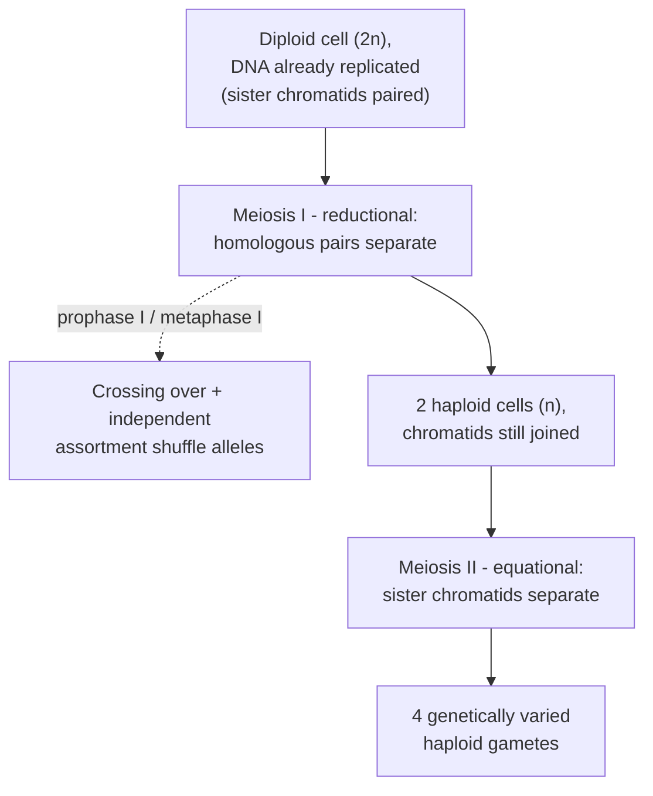

## Bio::Mendelian_Genetics

### LESSON-BIO-MENDELIAN-GENETICS

- **KC:** `Bio::Mendelian_Genetics`
- **Title:** Mendelian Genetics: Predicting Inheritance
- **Section:** `MCAT::Bio_Biochem`
- **Source:** authored
- **Review Status:** needs_review
- **Overview:** Mendelian genetics predicts how alleles are transmitted across generations using probability. It builds on segregation (alleles separate into gametes) and independent assortment to compute offspring ratios, and extends to pedigrees and linked genes. It is the quantitative backbone of classical heredity.
- **Key Concepts:**
  - Law of segregation: the two alleles of a gene separate so each gamete carries one.
  - Law of independent assortment: alleles of different (unlinked) genes assort independently.
  - Punnett squares and the product/sum rules compute genotype and phenotype probabilities.
  - Extensions such as incomplete dominance, codominance, sex linkage, and linkage/recombination distort the simple ratios.
- **Prerequisite Reminder:** Combine `Bio::Genetics` (alleles and dominance) with `Bio::Meiosis` (the physical basis of segregation and assortment) to justify why the ratios work.
- **Worked Example:** For a dihybrid cross AaBb x AaBb with unlinked genes, treat each gene separately: each gives a 3:1 dominant:recessive ratio. Multiply independent probabilities - P(dominant for both) = 3/4 x 3/4 = 9/16 - to rebuild the classic 9:3:3:1 phenotype ratio without drawing a 16-cell square.
- **Common Misconception:** "A 3:1 phenotype ratio proves the alleles show simple dominance." Other mechanisms (a lethal genotype, epistasis) can also skew or mimic ratios, so a ratio is evidence, not proof, of simple dominance.
- **First Retrieval Prompt:** From memory, use the product rule to find the fraction of AaBb x AaBb offspring that are recessive for both traits.
- **Related KCs:** `Bio::Genetics`, `Bio::Meiosis`, `Bio::Population_Genetics`
- **Diagram:** Dihybrid cross by the product rule - rebuilding 9:3:3:1:

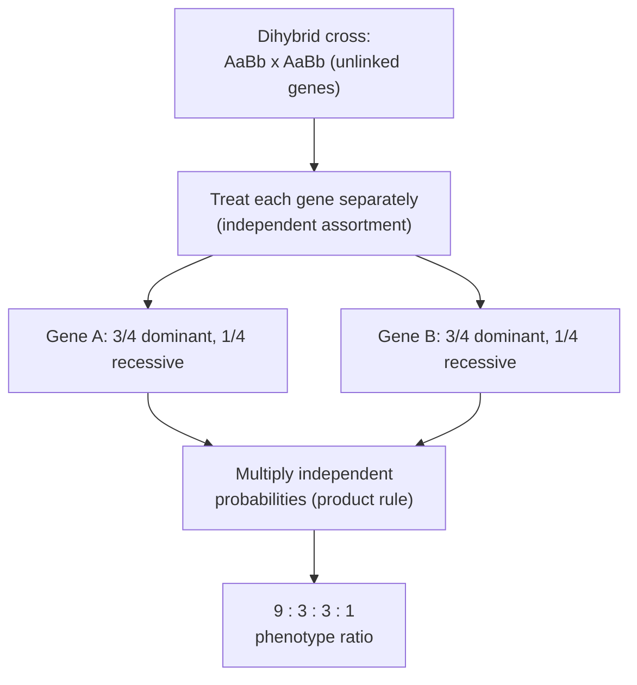

## Bio::Eukaryotic_Cell

### LESSON-BIO-EUKARYOTIC-CELL

- **KC:** `Bio::Eukaryotic_Cell`
- **Title:** The Eukaryotic Cell: Organelles and Compartments
- **Section:** `MCAT::Bio_Biochem`
- **Source:** authored
- **Review Status:** needs_review
- **Overview:** The eukaryotic cell organizes its functions into membrane-bound organelles, so incompatible processes can run at once in separate compartments. Its defining feature is the nucleus, which houses the genome, but the endomembrane system and energy organelles are equally central. Almost every organ-system and cell-biology KC assumes this floor plan.
- **Key Concepts:**
  - The nucleus stores DNA and separates transcription from translation.
  - The endomembrane system (ER, Golgi, vesicles, lysosomes) builds, modifies, and ships proteins and lipids.
  - Mitochondria produce most ATP; they have their own DNA and a double membrane.
  - Compartmentalization lets a cell maintain several different chemical environments at the same time.
- **Prerequisite Reminder:** Foundation KC - no prerequisites assumed beyond basic cell vocabulary.
- **Worked Example:** Trace a secreted protein: it is translated on the rough ER, folded and glycosylated in the ER lumen, shuttled in a vesicle to the Golgi for further modification, then packaged into a vesicle that fuses with the plasma membrane to release the protein. Each step happens in a distinct compartment - that is compartmentalization at work.
- **Common Misconception:** "The nucleus is where the cell's ATP is made." Most ATP is produced in mitochondria; the nucleus stores and manages genetic information.
- **First Retrieval Prompt:** From memory, name the organelle that separates transcription from translation and one organelle in the protein-secretion pathway.
- **Related KCs:** `Bio::Prokaryotes_vs_Eukaryotes`, `Bio::Cell_Membrane_and_Transport`, `Bio::Cytoskeleton`, `Bio::Cell_Cycle_and_Mitosis`, `Bio::Fungi`, `Bio::Muscular_System`, `Bio::Skeletal_System`, `Bio::Circulatory_System`, `Bio::Respiratory_System`, `Bio::Digestive_System`, `Bio::Immune_System`, `Bio::Skin_System`, `Biochem::Bioenergetics`, `Biochem::Oxidative_Phosphorylation`, `Biochem::Membranes_and_Transport`
- **Diagram:** Labeled schematic of an animal eukaryotic cell: the nucleus with nucleolus, rough and smooth ER with ribosomes, Golgi apparatus, vesicles, a lysosome, and a mitochondrion inside the plasma membrane

<figure class="lesson-diagram">
<svg xmlns="http://www.w3.org/2000/svg" viewBox="0 0 540 440" role="img" aria-labelledby="t d" font-family="-apple-system, Segoe UI, Roboto, sans-serif">
  <title id="t">Eukaryotic cell organelles</title>
  <desc id="d">Schematic animal eukaryotic cell bounded by a plasma membrane. Labeled organelles include the nucleus with nucleolus, rough and smooth endoplasmic reticulum with ribosomes, the Golgi apparatus, vesicles, a lysosome, and a mitochondrion, all within the cytoplasm. Membrane-bound compartments let one cell run many processes at once.</desc>
  <rect x="6" y="6" width="528" height="428" rx="14" fill="#ffffff" stroke="#cfd8dc" stroke-width="2"/>
  <text x="270" y="34" text-anchor="middle" font-size="18" font-weight="700" fill="#263238">The eukaryotic cell &#8212; organelles</text>

  <ellipse cx="270" cy="236" rx="250" ry="168" fill="#f3f7f8" stroke="#90a4ae" stroke-width="3"/>
  <text x="270" y="92" text-anchor="middle" font-size="11" fill="#607d8b">Plasma membrane (cell boundary)</text>
  <text x="96" y="126" text-anchor="middle" font-size="11" fill="#90a4ae">Cytoplasm</text>

  <circle cx="180" cy="212" r="66" fill="#c5cae9" stroke="#5c6bc0" stroke-width="2"/>
  <circle cx="180" cy="212" r="22" fill="#7986cb"/>
  <text x="180" y="158" text-anchor="middle" font-size="13" font-weight="700" fill="#283593">Nucleus</text>
  <text x="180" y="216" text-anchor="middle" font-size="9" fill="#ffffff">Nucleolus</text>

  <g stroke="#4db6ac" stroke-width="6" fill="none" stroke-linecap="round">
    <path d="M240 158 Q275 146 316 160"/>
    <path d="M245 176 Q280 165 320 180"/>
    <path d="M250 194 Q285 184 322 198"/>
  </g>
  <text x="300" y="138" text-anchor="middle" font-size="11" font-weight="700" fill="#00695c">Rough ER</text>
  <g fill="#00695c">
    <circle cx="255" cy="152" r="3"/><circle cx="278" cy="148" r="3"/><circle cx="302" cy="157" r="3"/>
    <circle cx="260" cy="170" r="3"/><circle cx="292" cy="172" r="3"/>
    <circle cx="258" cy="189" r="3"/><circle cx="300" cy="193" r="3"/>
    <circle cx="300" cy="330" r="3"/><circle cx="314" cy="336" r="3"/>
  </g>
  <text x="336" y="340" text-anchor="middle" font-size="11" fill="#37474f">Ribosomes</text>

  <path d="M296 250 Q346 250 340 292 Q336 322 300 314" stroke="#26a69a" stroke-width="6" fill="none" stroke-linecap="round"/>
  <text x="330" y="246" text-anchor="middle" font-size="11" fill="#00695c">Smooth ER</text>

  <g stroke="#ba68c8" stroke-width="7" fill="none" stroke-linecap="round">
    <path d="M374 190 Q412 178 450 190"/>
    <path d="M372 207 Q412 195 452 207"/>
    <path d="M374 224 Q412 212 450 224"/>
    <path d="M377 240 Q412 230 447 240"/>
  </g>
  <text x="412" y="168" text-anchor="middle" font-size="11" font-weight="700" fill="#6a1b9a">Golgi apparatus</text>

  <g fill="none" stroke="#ba68c8" stroke-width="2">
    <circle cx="400" cy="266" r="8"/><circle cx="424" cy="274" r="7"/><circle cx="444" cy="262" r="6"/>
  </g>
  <text x="424" y="298" text-anchor="middle" font-size="11" fill="#37474f">Vesicles</text>

  <circle cx="436" cy="330" r="20" fill="#ffcc80" stroke="#ef6c00" stroke-width="2"/>
  <text x="436" y="368" text-anchor="middle" font-size="11" font-weight="700" fill="#e65100">Lysosome</text>

  <ellipse cx="176" cy="330" rx="54" ry="26" fill="#ef9a9a" stroke="#c62828" stroke-width="2"/>
  <path d="M130 330 Q150 314 168 330 Q188 346 216 330" stroke="#c62828" stroke-width="2" fill="none"/>
  <text x="176" y="372" text-anchor="middle" font-size="11" font-weight="700" fill="#b71c1c">Mitochondrion</text>

  <text x="270" y="422" text-anchor="middle" font-size="12" fill="#607d8b">Membrane-bound organelles let one cell run many processes at once.</text>
</svg>
</figure>
- **Diagram:** Secretory pathway - how a protein is made and shipped out:

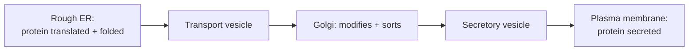

## Bio::Prokaryotes_vs_Eukaryotes

### LESSON-BIO-PROKARYOTES-VS-EUKARYOTES

- **KC:** `Bio::Prokaryotes_vs_Eukaryotes`
- **Title:** Prokaryotes vs Eukaryotes: Two Cell Plans
- **Section:** `MCAT::Bio_Biochem`
- **Source:** authored
- **Review Status:** needs_review
- **Overview:** This KC contrasts the two fundamental cell architectures. Prokaryotes (bacteria and archaea) lack a nucleus and membrane-bound organelles, while eukaryotes compartmentalize their contents. The distinction shapes cell size, gene organization, and how each cell divides and regulates itself.
- **Key Concepts:**
  - Prokaryotes have no nucleus; their circular DNA sits in a nucleoid region.
  - Eukaryotes are generally larger and contain membrane-bound organelles.
  - Prokaryotes often couple transcription and translation; eukaryotes separate them with the nuclear envelope.
  - Both share ribosomes, a plasma membrane, and DNA, reflecting common descent.
- **Prerequisite Reminder:** Use `Bio::Eukaryotic_Cell` as the reference plan; prokaryotes are defined largely by what they lack relative to it.
- **Worked Example:** A bacterium can begin translating an mRNA while it is still being transcribed, because no nuclear membrane separates the two. A human cell cannot: the transcript must be processed and exported from the nucleus first. One structural difference (the nucleus) explains a major functional difference.
- **Common Misconception:** "Prokaryotes have no DNA or ribosomes because they are 'simple'." They have both; they simply lack a nucleus and membrane-bound organelles.
- **First Retrieval Prompt:** From memory, explain why a prokaryote can translate an mRNA before transcription finishes but a eukaryote cannot.
- **Related KCs:** `Bio::Eukaryotic_Cell`, `Bio::Bacteria`
- **Diagram:** Side-by-side comparison: a prokaryotic bacterium with cell wall, nucleoid of circular DNA (no membrane), ribosomes, plasmid, and flagellum, next to a larger eukaryotic cell with a membrane-bound nucleus, mitochondria, and ribosomes

<figure class="lesson-diagram">
<svg xmlns="http://www.w3.org/2000/svg" viewBox="0 0 540 440" role="img" aria-labelledby="t d" font-family="-apple-system, Segoe UI, Roboto, sans-serif">
  <title id="t">Prokaryote versus eukaryote</title>
  <desc id="d">Side by side comparison. Left: a prokaryotic bacterium with a cell wall, a nucleoid of circular DNA with no surrounding membrane, ribosomes, a plasmid, and a flagellum; it is smaller and lacks organelles. Right: a larger eukaryotic animal cell with a membrane-bound nucleus and nucleolus, mitochondria, and ribosomes. Both share DNA, ribosomes, and a plasma membrane.</desc>
  <rect x="6" y="6" width="528" height="428" rx="14" fill="#ffffff" stroke="#cfd8dc" stroke-width="2"/>
  <text x="270" y="34" text-anchor="middle" font-size="18" font-weight="700" fill="#263238">Prokaryote vs eukaryote</text>

  <text x="138" y="62" text-anchor="middle" font-size="13" font-weight="700" fill="#2e7d32">Prokaryote (bacterium)</text>
  <text x="402" y="62" text-anchor="middle" font-size="13" font-weight="700" fill="#1565c0">Eukaryote (animal cell)</text>

  <line x1="270" y1="80" x2="270" y2="312" stroke="#cfd8dc" stroke-width="1" stroke-dasharray="4 4"/>

  <rect x="48" y="96" width="182" height="150" rx="64" fill="#e8f5e9" stroke="#66bb6a" stroke-width="3"/>
  <ellipse cx="112" cy="150" rx="42" ry="26" fill="#fff59d"/>
  <ellipse cx="112" cy="150" rx="30" ry="17" fill="none" stroke="#f9a825" stroke-width="3"/>
  <ellipse cx="182" cy="205" rx="13" ry="8" fill="none" stroke="#f9a825" stroke-width="2"/>
  <g fill="#2e7d32">
    <circle cx="170" cy="128" r="3"/><circle cx="150" cy="205" r="3"/><circle cx="120" cy="210" r="3"/><circle cx="196" cy="160" r="3"/>
  </g>
  <path d="M48 178 Q34 166 26 179 Q18 192 10 181" fill="none" stroke="#66bb6a" stroke-width="3"/>
  <text x="24" y="205" text-anchor="middle" font-size="10" fill="#2e7d32">Flagellum</text>

  <g font-size="10" fill="#37474f" text-anchor="middle">
    <text x="138" y="272">Nucleoid: circular DNA, no membrane</text>
    <text x="138" y="288">Ribosomes, cell wall, sometimes a plasmid</text>
    <text x="138" y="304">Smaller; no membrane-bound organelles</text>
  </g>

  <ellipse cx="405" cy="176" rx="110" ry="80" fill="#e3f2fd" stroke="#42a5f5" stroke-width="3"/>
  <circle cx="378" cy="170" r="40" fill="#c5cae9" stroke="#5c6bc0" stroke-width="2"/>
  <circle cx="378" cy="170" r="13" fill="#7986cb"/>
  <text x="378" y="126" text-anchor="middle" font-size="11" font-weight="700" fill="#283593">Nucleus</text>
  <ellipse cx="452" cy="140" rx="22" ry="11" fill="#ef9a9a" stroke="#c62828" stroke-width="2"/>
  <ellipse cx="446" cy="216" rx="22" ry="11" fill="#ef9a9a" stroke="#c62828" stroke-width="2"/>
  <g fill="#1565c0">
    <circle cx="350" cy="214" r="3"/><circle cx="420" cy="122" r="3"/><circle cx="474" cy="186" r="3"/><circle cx="404" cy="236" r="3"/>
  </g>

  <g font-size="10" fill="#37474f" text-anchor="middle">
    <text x="405" y="272">Nucleus: DNA enclosed by a membrane</text>
    <text x="405" y="288">Membrane-bound organelles (e.g. mitochondria)</text>
    <text x="405" y="304">Larger; compartmentalized</text>
  </g>

  <text x="270" y="360" text-anchor="middle" font-size="12" font-weight="600" fill="#37474f">Shared by both: DNA, ribosomes, and a plasma membrane.</text>
  <text x="270" y="382" text-anchor="middle" font-size="11" fill="#607d8b">These shared features reflect common descent.</text>
  <text x="270" y="414" text-anchor="middle" font-size="10" fill="#90a4ae">Schematic, not to scale (eukaryotes are typically far larger).</text>
</svg>
</figure>

## Bio::Cell_Membrane_and_Transport

### LESSON-BIO-CELL-MEMBRANE-AND-TRANSPORT

- **KC:** `Bio::Cell_Membrane_and_Transport`
- **Title:** Cell Membrane and Transport: Crossing the Barrier
- **Section:** `MCAT::Bio_Biochem`
- **Source:** authored
- **Review Status:** needs_review
- **Overview:** The plasma membrane is a selectively permeable barrier built from a phospholipid bilayer with embedded proteins - the fluid mosaic model. It controls what enters and leaves the cell, using passive routes that follow gradients and active routes that spend energy to move against them. This control underlies signaling, nerve function, and homeostasis.
- **Key Concepts:**
  - The bilayer is amphipathic: hydrophilic heads face water, hydrophobic tails face inward.
  - Passive transport (simple and facilitated diffusion, osmosis) needs no ATP and follows the gradient.
  - Active transport uses energy (e.g., the Na+/K+ pump) to move solutes against their gradient.
  - Osmosis is water movement toward higher solute concentration; tonicity predicts whether a cell swells or shrinks.
- **Prerequisite Reminder:** Build on `Bio::Eukaryotic_Cell` (membranes define every compartment) and `Biochem::Carbohydrates_and_Lipids` (phospholipids are the bilayer's building blocks).
- **Worked Example:** Place a cell in a hypertonic solution (more solute outside). Water leaves the cell by osmosis toward the higher external solute, so the cell shrinks. To move a solute the other way - against its gradient - the cell must spend ATP, as the Na+/K+ pump does, exporting 3 Na+ and importing 2 K+ per ATP.
- **Common Misconception:** "Osmosis moves water toward the lower solute concentration." Water moves toward the compartment with higher solute concentration (lower water potential), diluting it.
- **First Retrieval Prompt:** From memory, predict whether a cell placed in a hypertonic solution swells or shrinks, and explain why.
- **Related KCs:** `Bio::Eukaryotic_Cell`, `Biochem::Carbohydrates_and_Lipids`, `Bio::Cell_Signaling`, `Bio::Nervous_System`
- **Diagram:** Phospholipid bilayer schematic: two rows of phosphate heads with hydrophobic tails facing inward, an ion channel for facilitated diffusion, and a Na/K pump that uses ATP for active transport

<figure class="lesson-diagram">
<svg xmlns="http://www.w3.org/2000/svg" viewBox="0 0 540 440" role="img" aria-labelledby="t d" font-family="-apple-system, Segoe UI, Roboto, sans-serif">
  <title id="t">Cell membrane and transport</title>
  <desc id="d">A phospholipid bilayer drawn as two rows of round phosphate heads with hydrophobic fatty-acid tails facing inward. An ion channel spans the membrane and lets a solute diffuse down its gradient without ATP (passive transport). A sodium-potassium pump spans the membrane and uses ATP to move 3 sodium ions out and 2 potassium ions in, against their gradients (active transport).</desc>
  <rect x="6" y="6" width="528" height="428" rx="14" fill="#ffffff" stroke="#cfd8dc" stroke-width="2"/>
  <text x="270" y="34" text-anchor="middle" font-size="18" font-weight="700" fill="#263238">Cell membrane &#8212; fluid mosaic bilayer</text>

  <text x="270" y="86" text-anchor="middle" font-size="12" font-weight="600" fill="#37474f">Extracellular fluid</text>
  <text x="270" y="320" text-anchor="middle" font-size="12" font-weight="600" fill="#37474f">Cytoplasm</text>
  <text x="36" y="116" font-size="10" fill="#607d8b">High concentration</text>
  <text x="36" y="252" font-size="10" fill="#607d8b">Low concentration</text>

  <g stroke="#ffcc80" stroke-width="2" stroke-linecap="round">
    <line x1="42" y1="145" x2="42" y2="176"/><line x1="48" y1="145" x2="48" y2="176"/><line x1="42" y1="205" x2="42" y2="184"/><line x1="48" y1="205" x2="48" y2="184"/>
    <line x1="77" y1="145" x2="77" y2="176"/><line x1="83" y1="145" x2="83" y2="176"/><line x1="77" y1="205" x2="77" y2="184"/><line x1="83" y1="205" x2="83" y2="184"/>
    <line x1="112" y1="145" x2="112" y2="176"/><line x1="118" y1="145" x2="118" y2="176"/><line x1="112" y1="205" x2="112" y2="184"/><line x1="118" y1="205" x2="118" y2="184"/>
    <line x1="202" y1="145" x2="202" y2="176"/><line x1="208" y1="145" x2="208" y2="176"/><line x1="202" y1="205" x2="202" y2="184"/><line x1="208" y1="205" x2="208" y2="184"/>
    <line x1="237" y1="145" x2="237" y2="176"/><line x1="243" y1="145" x2="243" y2="176"/><line x1="237" y1="205" x2="237" y2="184"/><line x1="243" y1="205" x2="243" y2="184"/>
    <line x1="272" y1="145" x2="272" y2="176"/><line x1="278" y1="145" x2="278" y2="176"/><line x1="272" y1="205" x2="272" y2="184"/><line x1="278" y1="205" x2="278" y2="184"/>
    <line x1="307" y1="145" x2="307" y2="176"/><line x1="313" y1="145" x2="313" y2="176"/><line x1="307" y1="205" x2="307" y2="184"/><line x1="313" y1="205" x2="313" y2="184"/>
    <line x1="417" y1="145" x2="417" y2="176"/><line x1="423" y1="145" x2="423" y2="176"/><line x1="417" y1="205" x2="417" y2="184"/><line x1="423" y1="205" x2="423" y2="184"/>
    <line x1="452" y1="145" x2="452" y2="176"/><line x1="458" y1="145" x2="458" y2="176"/><line x1="452" y1="205" x2="452" y2="184"/><line x1="458" y1="205" x2="458" y2="184"/>
    <line x1="487" y1="145" x2="487" y2="176"/><line x1="493" y1="145" x2="493" y2="176"/><line x1="487" y1="205" x2="487" y2="184"/><line x1="493" y1="205" x2="493" y2="184"/>
  </g>

  <g fill="#ffb74d" stroke="#fb8c00" stroke-width="1">
    <circle cx="45" cy="136" r="9"/><circle cx="80" cy="136" r="9"/><circle cx="115" cy="136" r="9"/><circle cx="205" cy="136" r="9"/><circle cx="240" cy="136" r="9"/><circle cx="275" cy="136" r="9"/><circle cx="310" cy="136" r="9"/><circle cx="420" cy="136" r="9"/><circle cx="455" cy="136" r="9"/><circle cx="490" cy="136" r="9"/>
    <circle cx="45" cy="214" r="9"/><circle cx="80" cy="214" r="9"/><circle cx="115" cy="214" r="9"/><circle cx="205" cy="214" r="9"/><circle cx="240" cy="214" r="9"/><circle cx="275" cy="214" r="9"/><circle cx="310" cy="214" r="9"/><circle cx="420" cy="214" r="9"/><circle cx="455" cy="214" r="9"/><circle cx="490" cy="214" r="9"/>
  </g>

  <rect x="138" y="124" width="48" height="102" rx="8" fill="#90caf9" stroke="#1565c0" stroke-width="2"/>
  <rect x="155" y="140" width="14" height="70" fill="#ffffff"/>
  <rect x="340" y="124" width="52" height="102" rx="8" fill="#a5d6a7" stroke="#2e7d32" stroke-width="2"/>
  <text x="366" y="182" text-anchor="middle" font-size="12" font-weight="700" fill="#1b5e20">ATP</text>

  <line x1="162" y1="108" x2="162" y2="250" stroke="#1565c0" stroke-width="3"/>
  <polygon points="162,258 156,246 168,246" fill="#1565c0"/>
  <g fill="#1565c0"><circle cx="150" cy="98" r="5"/><circle cx="174" cy="98" r="5"/><circle cx="162" cy="270" r="5"/></g>

  <line x1="352" y1="124" x2="352" y2="100" stroke="#2e7d32" stroke-width="3"/>
  <polygon points="352,92 346,104 358,104" fill="#2e7d32"/>
  <text x="352" y="86" text-anchor="middle" font-size="10" font-weight="600" fill="#2e7d32">3 Na+ out</text>
  <line x1="384" y1="226" x2="384" y2="250" stroke="#2e7d32" stroke-width="3"/>
  <polygon points="384,258 378,246 390,246" fill="#2e7d32"/>
  <text x="384" y="270" text-anchor="middle" font-size="10" font-weight="600" fill="#2e7d32">2 K+ in</text>

  <text x="162" y="292" text-anchor="middle" font-size="11" font-weight="700" fill="#1565c0">Ion channel (passive)</text>
  <text x="366" y="292" text-anchor="middle" font-size="11" font-weight="700" fill="#2e7d32">Na/K pump (active)</text>

  <text x="270" y="404" text-anchor="middle" font-size="12" fill="#607d8b">Hydrophilic heads face water; hydrophobic tails face inward.</text>
  <text x="270" y="424" text-anchor="middle" font-size="12" fill="#607d8b">Passive transport follows the gradient; the pump spends ATP to go against it.</text>
</svg>
</figure>
- **Diagram:** Choosing a transport route by the gradient:

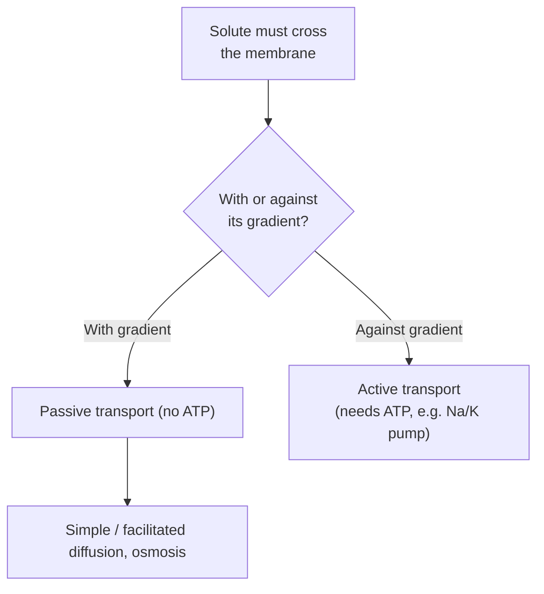

## Bio::Cell_Signaling

### LESSON-BIO-CELL-SIGNALING

- **KC:** `Bio::Cell_Signaling`
- **Title:** Cell Signaling: Receptors and Cascades
- **Section:** `MCAT::Bio_Biochem`
- **Source:** authored
- **Review Status:** needs_review
- **Overview:** Cell signaling lets cells detect and respond to chemical messages from their environment or from other cells. A signal (ligand) binds a receptor, which triggers an intracellular cascade that amplifies the message and changes cell behavior. Feedback keeps responses proportional and temporary.
- **Key Concepts:**
  - Signaling has three phases: reception (ligand binds receptor), transduction (a cascade relays and amplifies), and response.
  - Hydrophilic signals use surface receptors (e.g., GPCRs, receptor tyrosine kinases); hydrophobic signals can cross the membrane to intracellular receptors.
  - Second messengers (cAMP, Ca2+) amplify one signal into many downstream effects.
  - Negative feedback terminates or dampens the response.
- **Prerequisite Reminder:** Combine `Bio::Cell_Membrane_and_Transport` (where surface receptors sit) with `Biochem::Protein_Structure_and_Function` (receptor and kinase shape is what makes signaling specific).
- **Worked Example:** Epinephrine binds a G-protein-coupled receptor, activating adenylyl cyclase to make many cAMP molecules; cAMP activates protein kinase A, which phosphorylates many targets. One hormone molecule thus triggers a large, fast response - that is amplification through a cascade.
- **Common Misconception:** "A hormone must enter the cell to have an effect." Many hydrophilic hormones never enter; they act entirely through surface receptors and second messengers.
- **First Retrieval Prompt:** From memory, explain how a single hormone molecule binding a surface receptor can change many molecules inside the cell.
- **Related KCs:** `Bio::Cell_Membrane_and_Transport`, `Biochem::Protein_Structure_and_Function`, `Bio::Endocrine_System`
- **Diagram:** Signaling cascade - one ligand, an amplified response:

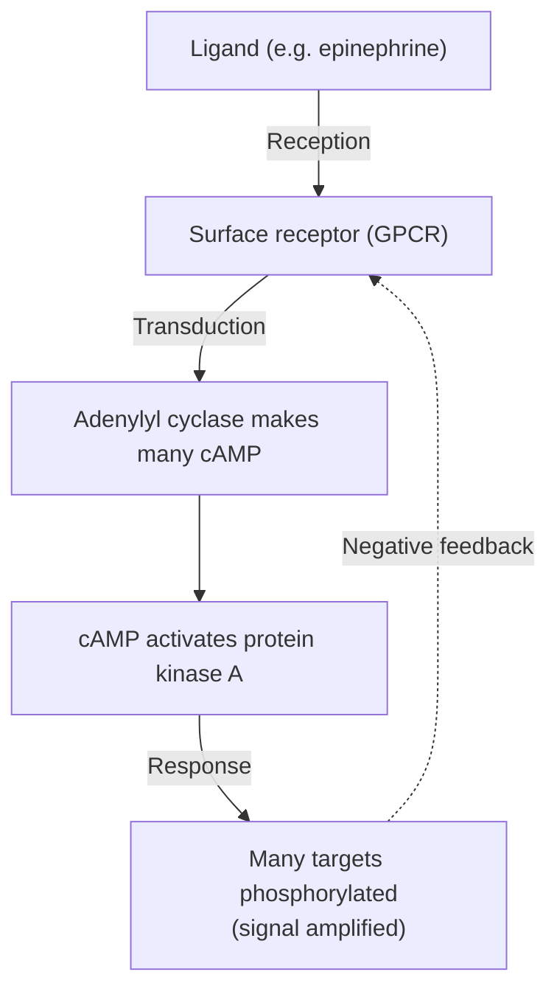

## Bio::Cytoskeleton

### LESSON-BIO-CYTOSKELETON

- **KC:** `Bio::Cytoskeleton`
- **Title:** Cytoskeleton: Structure and Movement
- **Section:** `MCAT::Bio_Biochem`
- **Source:** authored
- **Review Status:** needs_review
- **Overview:** The cytoskeleton is a dynamic protein scaffold that gives cells shape, organizes their interior, and drives movement. Its filament types differ in size and role, and motor proteins walk along them to transport cargo and generate motion.
- **Key Concepts:**
  - Microfilaments (actin) support cell shape and drive crawling and cytokinesis.
  - Microtubules (tubulin) form tracks for transport and the mitotic spindle.
  - Intermediate filaments provide mechanical strength.
  - Motor proteins (kinesin, dynein, myosin) convert ATP into directed movement; cilia and flagella use a microtubule 9+2 array.
- **Prerequisite Reminder:** Build on `Bio::Eukaryotic_Cell`: the cytoskeleton threads through the compartments you already know and positions organelles within them.
- **Worked Example:** During mitosis, microtubules form the spindle that attaches to chromosomes and pulls sister chromatids apart, while in a migrating cell actin polymerizes at the leading edge to push it forward. Different filament, different job.
- **Common Misconception:** "The cytoskeleton is a rigid, fixed framework." It is highly dynamic - filaments constantly assemble and disassemble, which is exactly what enables division and movement.
- **First Retrieval Prompt:** From memory, match microtubules and microfilaments to one cellular job each.
- **Related KCs:** `Bio::Eukaryotic_Cell`
- **Diagram:** Comparison of the three cytoskeletal filaments: actin microfilaments (~7 nm), intermediate filaments (~10 nm), and microtubules (~25 nm), with their sizes and roles

<figure class="lesson-diagram">
<svg xmlns="http://www.w3.org/2000/svg" viewBox="0 0 540 440" role="img" aria-labelledby="t d" font-family="-apple-system, Segoe UI, Roboto, sans-serif">
  <title id="t">Cytoskeleton filament types</title>
  <desc id="d">The three cytoskeletal filaments compared. Microfilaments are thin two-stranded actin helices about 7 nanometers wide that support cell shape, crawling, and cytokinesis. Intermediate filaments are rope-like braided strands about 10 nanometers wide that give mechanical strength. Microtubules are hollow tubes of tubulin about 25 nanometers wide that act as transport tracks and form the mitotic spindle and cilia and flagella.</desc>
  <rect x="6" y="6" width="528" height="428" rx="14" fill="#ffffff" stroke="#cfd8dc" stroke-width="2"/>
  <text x="270" y="34" text-anchor="middle" font-size="18" font-weight="700" fill="#263238">Cytoskeleton &#8212; three filament types</text>

  <text x="40" y="70" font-size="13" font-weight="700" fill="#00695c">1. Microfilaments (actin) &#183; ~7 nm</text>
  <g fill="none" stroke-linecap="round">
    <path d="M60 96 Q90 82 120 96 Q150 110 180 96 Q210 82 240 96 Q270 110 300 96 Q330 82 360 96 Q390 110 420 96 Q450 82 480 96" stroke="#26a69a" stroke-width="5"/>
    <path d="M60 96 Q90 110 120 96 Q150 82 180 96 Q210 110 240 96 Q270 82 300 96 Q330 110 360 96 Q390 82 420 96 Q450 110 480 96" stroke="#4db6ac" stroke-width="5"/>
  </g>
  <text x="40" y="128" font-size="11" fill="#37474f">Thin two-stranded helix; drives cell shape, crawling, and cytokinesis.</text>

  <text x="40" y="168" font-size="13" font-weight="700" fill="#6a1b9a">2. Intermediate filaments &#183; ~10 nm</text>
  <g fill="none" stroke-linecap="round">
    <path d="M60 192 Q95 180 130 192 Q165 204 200 192 Q235 180 270 192 Q305 204 340 192 Q375 180 410 192 Q445 204 480 192" stroke="#ab47bc" stroke-width="3"/>
    <path d="M60 192 Q95 204 130 192 Q165 180 200 192 Q235 204 270 192 Q305 180 340 192 Q375 204 410 192 Q445 180 480 192" stroke="#ce93d8" stroke-width="3"/>
    <path d="M60 190 Q95 182 130 190 Q165 198 200 190 Q235 182 270 190 Q305 198 340 190 Q375 182 410 190 Q445 198 480 190" stroke="#ba68c8" stroke-width="2"/>
  </g>
  <text x="40" y="226" font-size="11" fill="#37474f">Rope-like braided strands; provide mechanical strength.</text>

  <text x="40" y="266" font-size="13" font-weight="700" fill="#1565c0">3. Microtubules (tubulin) &#183; ~25 nm</text>
  <rect x="60" y="282" width="420" height="30" rx="8" fill="#e3f2fd" stroke="#1e88e5" stroke-width="2"/>
  <g stroke="#90caf9" stroke-width="1">
    <line x1="90" y1="282" x2="90" y2="312"/><line x1="120" y1="282" x2="120" y2="312"/><line x1="150" y1="282" x2="150" y2="312"/><line x1="180" y1="282" x2="180" y2="312"/><line x1="210" y1="282" x2="210" y2="312"/><line x1="240" y1="282" x2="240" y2="312"/><line x1="270" y1="282" x2="270" y2="312"/><line x1="300" y1="282" x2="300" y2="312"/><line x1="330" y1="282" x2="330" y2="312"/><line x1="360" y1="282" x2="360" y2="312"/><line x1="390" y1="282" x2="390" y2="312"/><line x1="420" y1="282" x2="420" y2="312"/><line x1="450" y1="282" x2="450" y2="312"/>
  </g>
  <text x="40" y="346" font-size="11" fill="#37474f">Hollow tubes; transport tracks, the mitotic spindle, and cilia/flagella (9+2).</text>

  <text x="270" y="420" text-anchor="middle" font-size="12" font-weight="600" fill="#607d8b">Motor proteins (kinesin, dynein, myosin) walk along filaments using ATP.</text>
</svg>
</figure>

## Bio::Cell_Cycle_and_Mitosis

### LESSON-BIO-CELL-CYCLE-AND-MITOSIS

- **KC:** `Bio::Cell_Cycle_and_Mitosis`
- **Title:** Cell Cycle and Mitosis: Dividing Cells
- **Section:** `MCAT::Bio_Biochem`
- **Source:** authored
- **Review Status:** needs_review
- **Overview:** The cell cycle is the ordered sequence a cell follows to grow, copy its DNA, and divide into two identical daughter cells. Mitosis (the M phase) partitions the duplicated chromosomes, while checkpoints verify readiness before committing to the next stage. Loss of checkpoint control is central to cancer.
- **Key Concepts:**
  - Interphase (G1, S, G2) grows the cell and replicates DNA; M phase divides it.
  - Mitosis stages (prophase, metaphase, anaphase, telophase) segregate sister chromatids equally.
  - Checkpoints (G1/S, G2/M, spindle) halt the cycle until conditions and DNA integrity are verified.
  - Failed checkpoints or broken apoptosis pathways allow uncontrolled division (cancer).
- **Prerequisite Reminder:** Build on `Bio::DNA_Replication` (S phase copies the genome) and `Bio::Eukaryotic_Cell` (the organelles and spindle machinery that physically divide the cell).
- **Worked Example:** If DNA is damaged during G1, the G1/S checkpoint should pause the cycle so repair can happen before replication. If the checkpoint protein is broken, the cell replicates the damaged DNA and passes mutations to both daughters - one reason checkpoint-gene mutations drive cancer.
- **Common Misconception:** "Chromosomes are duplicated during mitosis." DNA is copied earlier, during S phase of interphase; mitosis only separates the already-duplicated chromatids.
- **First Retrieval Prompt:** From memory, state during which phase DNA is replicated and what a checkpoint verifies before division proceeds.
- **Related KCs:** `Bio::DNA_Replication`, `Bio::Eukaryotic_Cell`, `Bio::Meiosis`
- **Diagram:** Cell cycle phases and their checkpoints:

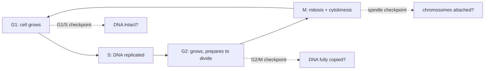

## Bio::Viruses

### LESSON-BIO-VIRUSES

- **KC:** `Bio::Viruses`
- **Title:** Viruses: Non-Living Infectious Agents
- **Section:** `MCAT::Bio_Biochem`
- **Source:** authored
- **Review Status:** needs_review
- **Overview:** Viruses are acellular infectious particles that can replicate only inside a host cell. A virus is essentially a nucleic-acid genome (DNA or RNA) wrapped in a protein coat, so it must hijack host machinery to reproduce. Their strategies range from immediate destruction of the host to long-term dormancy.
- **Key Concepts:**
  - A virion is a genome (DNA or RNA) plus a protein capsid, sometimes with an envelope.
  - The lytic cycle rapidly makes new virions and bursts the host; the lysogenic cycle integrates the genome and stays latent.
  - Retroviruses use reverse transcriptase to copy RNA into DNA that integrates into the host genome.
  - Viruses are not cells and cannot metabolize or reproduce on their own.
- **Prerequisite Reminder:** Use `Bio::DNA` (and the idea of a nucleic-acid genome): a virus is little more than a genome that borrows a cell's machinery to copy itself.
- **Worked Example:** A temperate phage infects a bacterium and integrates as a prophage (lysogenic), replicating passively with the host for generations. Environmental stress (e.g., UV) can trigger a switch to the lytic cycle, producing virions that lyse the cell. Same virus, two programs, selected by conditions.
- **Common Misconception:** "Viruses are living cells, like tiny bacteria." Viruses lack cellular machinery and metabolism; they are inert outside a host and depend entirely on host cells to replicate.
- **First Retrieval Prompt:** From memory, contrast the lytic and lysogenic cycles and state what a retrovirus does with reverse transcriptase.
- **Related KCs:** `Bio::DNA`
- **Diagram:** Schematic of an enveloped virus with glycoprotein spikes, an icosahedral capsid, and a nucleic-acid genome, next to a bacteriophage with a head, tail sheath, base plate, and tail fibers

<figure class="lesson-diagram">
<svg xmlns="http://www.w3.org/2000/svg" viewBox="0 0 540 440" role="img" aria-labelledby="t d" font-family="-apple-system, Segoe UI, Roboto, sans-serif">
  <title id="t">Virus structure</title>
  <desc id="d">Two schematic virions. Left: an enveloped virus with glycoprotein spikes, an icosahedral capsid, and a nucleic-acid genome of DNA or RNA inside. Right: a bacteriophage with a polyhedral head holding DNA, a tail sheath, a base plate, and tail fibers that inject DNA into a host. A virion is a genome plus a protein capsid, sometimes enveloped, and is not a living cell.</desc>
  <rect x="6" y="6" width="528" height="428" rx="14" fill="#ffffff" stroke="#cfd8dc" stroke-width="2"/>
  <text x="270" y="34" text-anchor="middle" font-size="18" font-weight="700" fill="#263238">Virus structure &#8212; genome in a protein coat</text>

  <text x="150" y="60" text-anchor="middle" font-size="13" font-weight="700" fill="#0277bd">Enveloped virus</text>
  <text x="400" y="60" text-anchor="middle" font-size="13" font-weight="700" fill="#0277bd">Bacteriophage</text>
  <line x1="270" y1="74" x2="270" y2="312" stroke="#cfd8dc" stroke-width="1" stroke-dasharray="4 4"/>

  <circle cx="150" cy="182" r="78" fill="#e1f5fe" stroke="#4fc3f7" stroke-width="2"/>
  <g stroke="#0288d1" stroke-width="2">
    <line x1="150" y1="260" x2="150" y2="272"/>
    <line x1="205" y1="237" x2="214" y2="246"/>
    <line x1="95" y1="237" x2="86" y2="246"/>
    <line x1="72" y1="182" x2="60" y2="182"/>
    <line x1="95" y1="127" x2="86" y2="118"/>
    <line x1="150" y1="104" x2="150" y2="92"/>
    <line x1="205" y1="127" x2="214" y2="118"/>
    <line x1="228" y1="182" x2="240" y2="182"/>
  </g>
  <g fill="#0288d1">
    <circle cx="150" cy="272" r="3"/><circle cx="214" cy="246" r="3"/><circle cx="86" cy="246" r="3"/><circle cx="60" cy="182" r="3"/><circle cx="86" cy="118" r="3"/><circle cx="150" cy="92" r="3"/><circle cx="214" cy="118" r="3"/><circle cx="240" cy="182" r="3"/>
  </g>
  <polygon points="150,226 188,204 188,160 150,138 112,160 112,204" fill="#b3e5fc" stroke="#0288d1" stroke-width="2"/>
  <path d="M126 182 Q140 166 152 182 Q164 198 176 182" fill="none" stroke="#01579b" stroke-width="2"/>

  <g font-size="10" fill="#37474f" text-anchor="middle">
    <text x="150" y="290">Envelope with glycoprotein spikes</text>
    <text x="150" y="305">Capsid coat around the genome (DNA or RNA)</text>
  </g>

  <polygon points="400,162 431,144 431,108 400,90 369,108 369,144" fill="#b3e5fc" stroke="#0288d1" stroke-width="2"/>
  <path d="M382 126 Q394 114 406 126 Q418 138 424 126" fill="none" stroke="#01579b" stroke-width="2"/>
  <rect x="392" y="162" width="16" height="52" fill="#81d4fa" stroke="#0288d1" stroke-width="2"/>
  <rect x="376" y="214" width="48" height="8" fill="#4fc3f7" stroke="#0288d1" stroke-width="2"/>
  <g stroke="#0288d1" stroke-width="2" fill="none">
    <path d="M382 222 Q368 244 358 268"/>
    <path d="M400 222 L400 272"/>
    <path d="M418 222 Q432 244 442 268"/>
  </g>

  <g font-size="10" fill="#37474f" text-anchor="middle">
    <text x="400" y="290">Head (capsid) holds the DNA genome</text>
    <text x="400" y="305">Tail + fibers inject DNA into a host cell</text>
  </g>

  <text x="270" y="344" text-anchor="middle" font-size="12" font-weight="600" fill="#37474f">A virion = nucleic-acid genome + a protein capsid (sometimes enveloped).</text>
  <text x="270" y="366" text-anchor="middle" font-size="11" fill="#607d8b">Not a cell: it has no metabolism and must hijack a host to replicate.</text>
  <text x="270" y="416" text-anchor="middle" font-size="10" fill="#90a4ae">Shapes are schematic, not to scale.</text>
</svg>
</figure>
- **Diagram:** Lytic vs lysogenic cycle - two programs after infection:

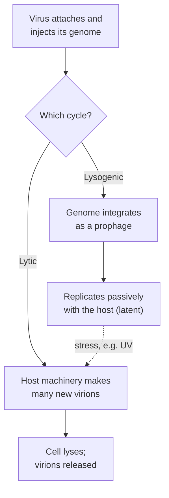

## Bio::Bacteria

### LESSON-BIO-BACTERIA

- **KC:** `Bio::Bacteria`
- **Title:** Bacteria: Prokaryotic Life and Genetics
- **Section:** `MCAT::Bio_Biochem`
- **Source:** authored
- **Review Status:** needs_review
- **Overview:** Bacteria are single-celled prokaryotes that reproduce asexually yet still achieve remarkable genetic variation. They divide by binary fission and exchange genes horizontally, which is how traits such as antibiotic resistance spread quickly. Their population growth follows predictable phases.
- **Key Concepts:**
  - Binary fission is rapid asexual division producing genetically identical cells.
  - Horizontal gene transfer (conjugation, transformation, transduction) moves genes between cells, often via plasmids.
  - Population growth follows lag, exponential (log), stationary, and death phases.
  - Plasmids frequently carry antibiotic-resistance genes, so resistance can spread without reproduction.
- **Prerequisite Reminder:** Combine `Bio::Genetics` (alleles and mutation) with `Bio::Prokaryotes_vs_Eukaryotes` (the prokaryotic cell plan) to see how bacteria vary despite asexual division.
- **Worked Example:** One bacterium acquires a resistance plasmid. Under antibiotic pressure, susceptible cells die but the resistant cell survives and, via conjugation, passes the plasmid to neighbors - so resistance spreads through the population far faster than mutation alone would allow.
- **Common Misconception:** "Because bacteria reproduce asexually, a population is essentially identical clones." Horizontal gene transfer and high mutation rates give bacterial populations substantial genetic diversity.
- **First Retrieval Prompt:** From memory, explain how antibiotic resistance can spread between bacteria without any cell dividing.
- **Related KCs:** `Bio::Genetics`, `Bio::Prokaryotes_vs_Eukaryotes`
- **Diagram:** Bacterial growth curve of log cell number vs time showing four phases: lag, log (exponential), stationary, and death

<figure class="lesson-diagram">
<svg xmlns="http://www.w3.org/2000/svg" viewBox="0 0 540 440" role="img" aria-labelledby="t d" font-family="-apple-system, Segoe UI, Roboto, sans-serif">
  <title id="t">Bacterial growth curve</title>
  <desc id="d">A bacterial growth curve plotting the log of the number of cells against time. It has four phases: a flat lag phase, a steep exponential log phase, a flat stationary phase where limited nutrients halt net growth, and a declining death phase. Dashed lines separate the phases.</desc>
  <rect x="6" y="6" width="528" height="428" rx="14" fill="#ffffff" stroke="#cfd8dc" stroke-width="2"/>
  <text x="270" y="34" text-anchor="middle" font-size="18" font-weight="700" fill="#263238">Bacterial growth curve</text>

  <g stroke="#cfd8dc" stroke-width="1" stroke-dasharray="4 4">
    <line x1="150" y1="70" x2="150" y2="360"/>
    <line x1="300" y1="70" x2="300" y2="360"/>
    <line x1="400" y1="70" x2="400" y2="360"/>
  </g>

  <line x1="70" y1="360" x2="500" y2="360" stroke="#90a4ae" stroke-width="2"/>
  <line x1="70" y1="360" x2="70" y2="66" stroke="#90a4ae" stroke-width="2"/>
  <polygon points="500,360 490,355 490,365" fill="#90a4ae"/>
  <polygon points="70,66 65,76 75,76" fill="#90a4ae"/>
  <text x="30" y="215" transform="rotate(-90 30 215)" text-anchor="middle" font-size="11" fill="#607d8b">log(number of cells)</text>

  <polyline points="70,322 150,322 300,130 400,130 490,210" fill="none" stroke="#2e7d32" stroke-width="3" stroke-linejoin="round"/>

  <g font-size="11" font-weight="600" fill="#37474f" text-anchor="middle">
    <text x="110" y="380">Lag</text>
    <text x="225" y="380">Log</text>
    <text x="350" y="380">Stationary</text>
    <text x="445" y="380">Death</text>
  </g>
  <text x="285" y="400" text-anchor="middle" font-size="12" fill="#607d8b">Time</text>

  <text x="270" y="424" text-anchor="middle" font-size="12" fill="#607d8b">Exponential growth occurs only in the log phase; limited nutrients cause the stationary plateau.</text>
</svg>
</figure>

## Bio::Fungi

### LESSON-BIO-FUNGI

- **KC:** `Bio::Fungi`
- **Title:** Fungi: Eukaryotic Decomposers
- **Section:** `MCAT::Bio_Biochem`
- **Source:** authored
- **Review Status:** needs_review
- **Overview:** Fungi are eukaryotic organisms - including yeasts and molds - that absorb nutrients from their surroundings, often acting as decomposers. They have chitin cell walls and can reproduce both sexually and asexually, which makes them ecologically important and medically relevant.
- **Key Concepts:**
  - Fungi are eukaryotes with chitin cell walls (not cellulose, as in plants).
  - Most are heterotrophs that secrete enzymes and absorb digested nutrients (extracellular digestion).
  - Bodies are often built from thread-like hyphae forming a mycelium; yeasts are unicellular.
  - They reproduce by spores, sexually or asexually.
- **Prerequisite Reminder:** Build on `Bio::Eukaryotic_Cell`: fungi are eukaryotes, so they share the organelle plan; their wall chemistry (chitin) is the notable addition.
- **Worked Example:** Bread mold grows a mycelium of hyphae over its substrate, secretes digestive enzymes onto the food, and absorbs the breakdown products - digestion happens outside the body, then nutrients come in.
- **Common Misconception:** "Fungi are plants that don't photosynthesize." Fungi are a separate kingdom: heterotrophs with chitin walls, in fact more closely related to animals than to plants.
- **First Retrieval Prompt:** From memory, state what fungal cell walls are made of and how fungi obtain their nutrients.
- **Related KCs:** `Bio::Eukaryotic_Cell`
- **Diagram:** Extracellular digestion - fungi digest outside, then absorb:

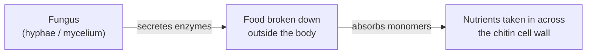

## Bio::Nervous_System

### LESSON-BIO-NERVOUS-SYSTEM

- **KC:** `Bio::Nervous_System`
- **Title:** Nervous System: Neurons and Signaling
- **Section:** `MCAT::Bio_Biochem`
- **Source:** authored
- **Review Status:** needs_review
- **Overview:** The nervous system rapidly senses, processes, and responds to information using electrically excitable cells called neurons. Signals travel as changes in membrane voltage within a neuron and as chemical messages across synapses between neurons. It integrates the whole body's activity in real time.
- **Key Concepts:**
  - The resting potential is set by ion gradients and selective permeability, maintained by the Na+/K+ pump.
  - An action potential is an all-or-none depolarization triggered when voltage crosses threshold.
  - Signals cross synapses via neurotransmitters released from the presynaptic terminal.
  - The CNS (brain, spinal cord) integrates; the PNS (somatic, autonomic) carries information in and out.
- **Prerequisite Reminder:** This integrates `Bio::Cell_Membrane_and_Transport` (channels and pumps), `GenChem::Ions_in_Solutions` (the ion gradients), and `Physics::Electrical_Circuits` (current, resistance, and capacitance across the membrane).
- **Worked Example:** At rest the inside is negative (~-70 mV) because K+ leaks out down its gradient. A stimulus opens voltage-gated Na+ channels; if depolarization reaches threshold, Na+ rushes in (the all-or-none spike), then K+ efflux repolarizes. The same ion gradients that the pump maintains are what make the spike possible.
- **Common Misconception:** "A stronger stimulus produces a larger action potential." Action potentials are all-or-none; a stronger stimulus changes firing frequency, not spike amplitude.
- **First Retrieval Prompt:** From memory, explain what "all-or-none" means for an action potential and how the nervous system instead encodes a stronger stimulus.
- **Related KCs:** `Bio::Cell_Membrane_and_Transport`, `GenChem::Ions_in_Solutions`, `Physics::Electrical_Circuits`, `PsychSoc::Biological_and_Social_Factors`, `PsychSoc::Sensory_Processing`
- **Diagram:** Labeled neuron: dendrites, cell body with nucleus, a myelinated axon with nodes of Ranvier, axon terminals, and a synapse, with the impulse traveling left to right

<figure class="lesson-diagram">
<svg xmlns="http://www.w3.org/2000/svg" viewBox="0 0 540 440" role="img" aria-labelledby="t d" font-family="-apple-system, Segoe UI, Roboto, sans-serif">
  <title id="t">Neuron structure</title>
  <desc id="d">A labeled neuron. Dendrites on the left receive input into the cell body or soma with its nucleus. The axon extends to the right, wrapped in myelin sheath segments separated by nodes of Ranvier, and ends in axon terminals that meet a target cell at a synapse. The impulse travels from the dendrites toward the axon terminals.</desc>
  <rect x="6" y="6" width="528" height="428" rx="14" fill="#ffffff" stroke="#cfd8dc" stroke-width="2"/>
  <text x="270" y="34" text-anchor="middle" font-size="18" font-weight="700" fill="#263238">Neuron &#8212; structure and signal direction</text>

  <text x="270" y="62" text-anchor="middle" font-size="11" fill="#607d8b">Signal direction: dendrites to axon terminals</text>
  <line x1="70" y1="74" x2="474" y2="74" stroke="#90a4ae" stroke-width="2"/>
  <polygon points="482,74 472,69 472,79" fill="#90a4ae"/>

  <g stroke="#fb8c00" stroke-width="2" fill="none">
    <path d="M84 198 L54 176"/><path d="M54 176 L38 168"/><path d="M54 176 L44 156"/>
    <path d="M86 214 L52 214"/><path d="M52 214 L36 206"/><path d="M52 214 L38 224"/>
    <path d="M88 232 L58 250"/><path d="M58 250 L44 262"/><path d="M58 250 L64 268"/>
  </g>
  <text x="52" y="146" text-anchor="middle" font-size="11" font-weight="700" fill="#e65100">Dendrites</text>

  <circle cx="120" cy="220" r="42" fill="#ffe0b2" stroke="#fb8c00" stroke-width="2"/>
  <circle cx="120" cy="220" r="15" fill="#ff8f00"/>
  <text x="120" y="224" text-anchor="middle" font-size="8" fill="#ffffff">Nucleus</text>
  <text x="120" y="296" text-anchor="middle" font-size="11" font-weight="700" fill="#e65100">Cell body</text>
  <text x="120" y="310" text-anchor="middle" font-size="10" fill="#e65100">(soma)</text>

  <line x1="162" y1="220" x2="420" y2="220" stroke="#ffcc80" stroke-width="6" stroke-linecap="round"/>
  <g fill="#b3e5fc" stroke="#4fc3f7" stroke-width="1.5">
    <rect x="178" y="209" width="54" height="22" rx="11"/>
    <rect x="250" y="209" width="54" height="22" rx="11"/>
    <rect x="322" y="209" width="54" height="22" rx="11"/>
  </g>
  <g stroke="#90a4ae" stroke-width="1">
    <line x1="285" y1="200" x2="285" y2="209"/>
    <line x1="313" y1="246" x2="313" y2="231"/>
    <line x1="168" y1="246" x2="168" y2="224"/>
  </g>
  <text x="285" y="196" text-anchor="middle" font-size="10" fill="#0277bd">Myelin sheath</text>
  <text x="313" y="258" text-anchor="middle" font-size="10" fill="#37474f">Node of Ranvier</text>
  <text x="168" y="258" text-anchor="middle" font-size="10" fill="#e65100">Axon</text>

  <g stroke="#ffcc80" stroke-width="3" fill="none">
    <path d="M420 220 L452 200"/><path d="M420 220 L456 220"/><path d="M420 220 L452 240"/>
  </g>
  <g fill="#ffb74d">
    <circle cx="454" cy="199" r="6"/><circle cx="459" cy="220" r="6"/><circle cx="454" cy="241" r="6"/>
  </g>
  <text x="466" y="182" text-anchor="middle" font-size="10" fill="#e65100">Axon terminals</text>

  <rect x="486" y="192" width="10" height="56" rx="4" fill="#c5cae9" stroke="#5c6bc0" stroke-width="1.5"/>
  <g fill="#0288d1"><circle cx="470" cy="208" r="2.5"/><circle cx="476" cy="222" r="2.5"/><circle cx="470" cy="234" r="2.5"/></g>
  <text x="500" y="266" text-anchor="middle" font-size="10" fill="#607d8b">Synapse</text>

  <text x="270" y="366" text-anchor="middle" font-size="12" font-weight="600" fill="#37474f">Resting membrane potential is about &#8722;70 mV.</text>
  <text x="270" y="388" text-anchor="middle" font-size="12" fill="#607d8b">A stimulus past threshold fires an all-or-none action potential.</text>
</svg>
</figure>
- **Diagram:** Action potential - an all-or-none spike past threshold:

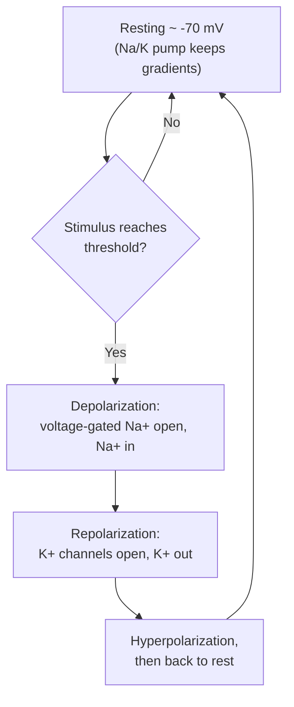

## Bio::Endocrine_System

### LESSON-BIO-ENDOCRINE-SYSTEM

- **KC:** `Bio::Endocrine_System`
- **Title:** Endocrine System: Hormonal Control
- **Section:** `MCAT::Bio_Biochem`
- **Source:** authored
- **Review Status:** needs_review
- **Overview:** The endocrine system uses hormones - chemical messengers carried in the blood - to coordinate slower, longer-lasting, body-wide responses. A hormone's class determines its receptor location and speed, and negative-feedback loops keep levels within range. It works alongside the nervous system to maintain homeostasis.
- **Key Concepts:**
  - Peptide and amine hormones are hydrophilic and act via surface receptors and second messengers (fast, short-lived).
  - Steroid hormones are hydrophobic, cross membranes, and act on intracellular receptors to change transcription (slower, longer-lasting).
  - Negative feedback (e.g., the hypothalamus-pituitary axis) stabilizes hormone levels.
  - Endocrine signaling is slower but more sustained and widespread than neural signaling.
- **Prerequisite Reminder:** Build directly on `Bio::Cell_Signaling`: hormones are ligands, and their hydrophilic vs hydrophobic nature decides surface- vs intracellular-receptor pathways.
- **Worked Example:** Rising thyroid hormone signals the hypothalamus and pituitary to reduce TRH and TSH, which lowers further thyroid output - a negative-feedback loop. Because thyroid hormone is lipophilic, it enters cells and alters gene transcription, so its effects build and fade slowly compared with a nerve impulse.
- **Common Misconception:** "All hormones act quickly, like nerve signals." Endocrine responses are generally slower to start and longer-lasting; steroid hormones acting through transcription are especially delayed.
- **First Retrieval Prompt:** From memory, explain why a steroid hormone acts more slowly and for longer than a peptide hormone.
- **Related KCs:** `Bio::Cell_Signaling`, `Bio::Reproductive_System`, `Biochem::Hormonal_Regulation_of_Metabolism`, `PsychSoc::Biological_and_Social_Factors`, `PsychSoc::Stress`
- **Diagram:** Hypothalamus-pituitary-thyroid axis - negative feedback:

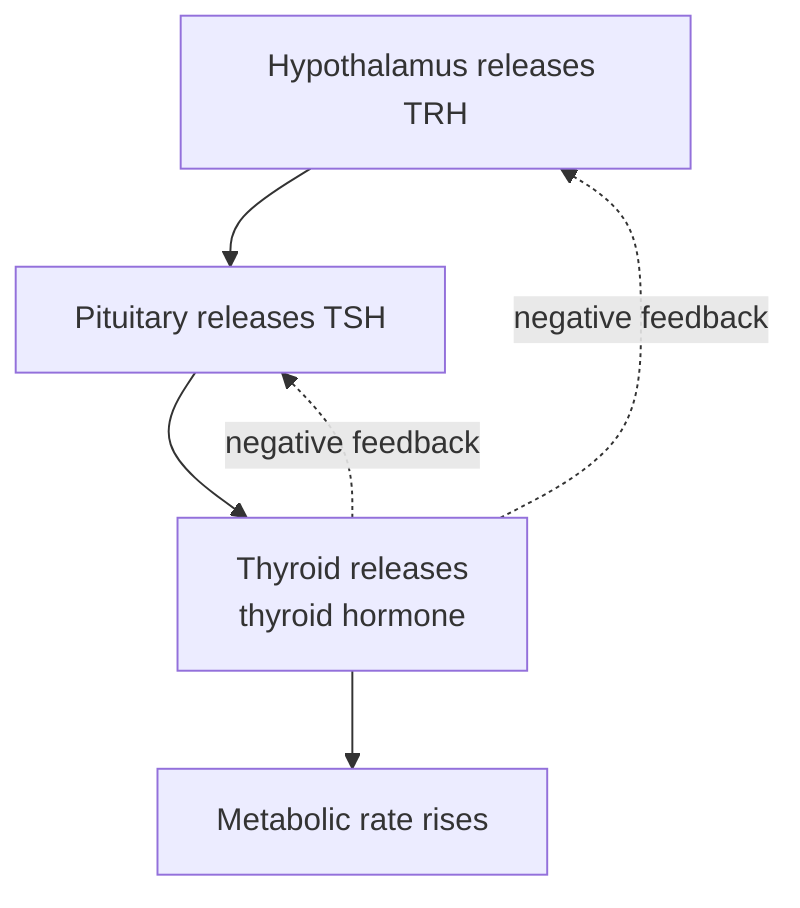

## Bio::Muscular_System

### LESSON-BIO-MUSCULAR-SYSTEM

- **KC:** `Bio::Muscular_System`
- **Title:** Muscular System: Contraction and Movement
- **Section:** `MCAT::Bio_Biochem`
- **Source:** authored
- **Review Status:** needs_review
- **Overview:** The muscular system generates force and movement by shortening muscle fibers. Contraction follows the sliding-filament model, in which actin and myosin filaments slide past one another, powered by ATP and triggered by calcium. Fiber types and energy sources tune muscles for endurance or power.
- **Key Concepts:**
  - The sliding-filament model: myosin heads pull actin, shortening the sarcomere without shortening the filaments themselves.
  - Contraction is triggered when Ca2+ exposes actin binding sites; ATP powers cross-bridge cycling.
  - Slow-twitch fibers favor aerobic endurance; fast-twitch fibers favor rapid, powerful bursts.
  - Muscles draw on stored ATP, creatine phosphate, and glucose/oxygen depending on demand.
- **Prerequisite Reminder:** Combine `Bio::Eukaryotic_Cell` (organized contractile cell structure) with `Biochem::Bioenergetics` (ATP supply and use), since contraction is a direct ATP consumer.
- **Worked Example:** Calcium release exposes actin's binding sites; a myosin head carrying ATP-hydrolysis products attaches, pivots (the power stroke) to pull actin inward, then releases when fresh ATP binds. Repeated cycles shorten the sarcomere. Without ATP the head cannot detach - which is why rigor mortis stiffens muscle after death.
- **Common Misconception:** "The muscle filaments themselves shorten during contraction." The filaments keep their length; they slide past each other, so the sarcomere (and the whole muscle) shortens.
- **First Retrieval Prompt:** From memory, explain what actually shortens during contraction and the two distinct roles ATP plays in the cross-bridge cycle.
- **Related KCs:** `Bio::Eukaryotic_Cell`, `Biochem::Bioenergetics`
- **Diagram:** Sarcomere shown relaxed and contracted: actin thin filaments anchored at Z lines and myosin thick filaments in the center; the Z lines move closer during contraction as filaments slide

<figure class="lesson-diagram">
<svg xmlns="http://www.w3.org/2000/svg" viewBox="0 0 540 440" role="img" aria-labelledby="t d" font-family="-apple-system, Segoe UI, Roboto, sans-serif">
  <title id="t">Sarcomere and the sliding-filament model</title>
  <desc id="d">A sarcomere shown relaxed and contracted. Thin actin filaments (blue) anchor at the Z lines; thick myosin filaments (red) sit in the center A band, with the H zone between the actin tips and the M line at the middle. In the contracted state the Z lines move closer as actin and myosin slide past one another; the filaments themselves do not shorten.</desc>
  <rect x="6" y="6" width="528" height="428" rx="14" fill="#ffffff" stroke="#cfd8dc" stroke-width="2"/>
  <text x="270" y="32" text-anchor="middle" font-size="18" font-weight="700" fill="#263238">Sarcomere &#8212; sliding-filament model</text>

  <text x="271" y="66" text-anchor="middle" font-size="12" font-weight="700" fill="#37474f">Relaxed</text>
  <text x="271" y="86" text-anchor="middle" font-size="10" fill="#6a1b9a">H zone</text>

  <rect x="100" y="92" width="6" height="84" fill="#455a64"/>
  <rect x="436" y="92" width="6" height="84" fill="#455a64"/>
  <line x1="271" y1="98" x2="271" y2="170" stroke="#7e57c2" stroke-width="2" stroke-dasharray="3 3"/>

  <g stroke="#42a5f5" stroke-width="3" stroke-linecap="round">
    <line x1="106" y1="108" x2="258" y2="108"/><line x1="106" y1="134" x2="258" y2="134"/><line x1="106" y1="160" x2="258" y2="160"/>
    <line x1="436" y1="108" x2="284" y2="108"/><line x1="436" y1="134" x2="284" y2="134"/><line x1="436" y1="160" x2="284" y2="160"/>
  </g>
  <g stroke="#ef5350" stroke-width="6" stroke-linecap="round">
    <line x1="214" y1="121" x2="328" y2="121"/><line x1="214" y1="147" x2="328" y2="147"/>
  </g>

  <line x1="214" y1="184" x2="328" y2="184" stroke="#90a4ae" stroke-width="1"/>
  <line x1="106" y1="184" x2="214" y2="184" stroke="#90a4ae" stroke-width="1"/>
  <g text-anchor="middle" font-size="10" fill="#37474f">
    <text x="103" y="190">Z line</text>
    <text x="439" y="190">Z line</text>
    <text x="271" y="198">A band</text>
    <text x="160" y="198">I band</text>
  </g>

  <text x="271" y="242" text-anchor="middle" font-size="12" font-weight="700" fill="#37474f">Contracted</text>
  <rect x="170" y="258" width="6" height="72" fill="#455a64"/>
  <rect x="366" y="258" width="6" height="72" fill="#455a64"/>
  <line x1="271" y1="262" x2="271" y2="326" stroke="#7e57c2" stroke-width="2" stroke-dasharray="3 3"/>
  <g stroke="#42a5f5" stroke-width="3" stroke-linecap="round">
    <line x1="176" y1="276" x2="300" y2="276"/><line x1="176" y1="312" x2="300" y2="312"/>
    <line x1="366" y1="276" x2="242" y2="276"/><line x1="366" y1="312" x2="242" y2="312"/>
  </g>
  <g stroke="#ef5350" stroke-width="6" stroke-linecap="round">
    <line x1="214" y1="288" x2="328" y2="288"/><line x1="214" y1="300" x2="328" y2="300"/>
  </g>

  <text x="270" y="358" text-anchor="middle" font-size="11" fill="#37474f">Filaments keep their length; the sarcomere shortens as they slide.</text>
  <text x="270" y="386" text-anchor="middle" font-size="11" font-weight="600" fill="#607d8b">Blue = actin (thin) &#183; Red = myosin (thick)</text>
  <text x="270" y="408" text-anchor="middle" font-size="11" fill="#607d8b">Ca2+ exposes actin sites; ATP powers the cross-bridge cycle.</text>
</svg>
</figure>
- **Diagram:** Cross-bridge cycle - the two roles ATP plays:

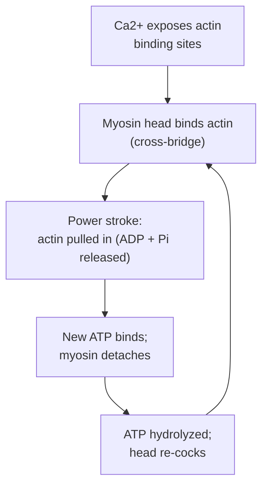

## Bio::Skeletal_System

### LESSON-BIO-SKELETAL-SYSTEM

- **KC:** `Bio::Skeletal_System`
- **Title:** Skeletal System: Support and Mineral Storage
- **Section:** `MCAT::Bio_Biochem`
- **Source:** authored
- **Review Status:** needs_review
- **Overview:** The skeletal system provides structural support, protects organs, enables movement through joints, and serves as the body's main calcium reservoir. Bone is living tissue that continuously remodels, balancing deposition and resorption under hormonal control.
- **Key Concepts:**
  - Osteoblasts build bone matrix; osteoclasts resorb it; the balance between them is remodeling.
  - Bone stores calcium and phosphate; hormones (PTH, calcitonin) adjust blood calcium.
  - Compact bone provides strength; spongy bone houses marrow (site of blood-cell formation).
  - Joints and ligaments determine the type and range of movement.
- **Prerequisite Reminder:** Build on `Bio::Eukaryotic_Cell` (the bone cells) and `GenChem::Ions_in_Solutions` (the calcium/phosphate ion balance the skeleton buffers).
- **Worked Example:** When blood calcium drops, parathyroid hormone stimulates osteoclasts to resorb bone, releasing calcium into the blood; when calcium is high, calcitonin favors deposition. The skeleton thus doubles as a calcium bank.
- **Common Misconception:** "Bone is inert, non-living scaffolding." Bone is dynamic living tissue that constantly remodels and actively regulates blood calcium.
- **First Retrieval Prompt:** From memory, name the cells that build versus break down bone, and explain the skeleton's role in calcium balance.
- **Related KCs:** `Bio::Eukaryotic_Cell`, `GenChem::Ions_in_Solutions`
- **Diagram:** Blood-calcium homeostasis - opposing hormones:

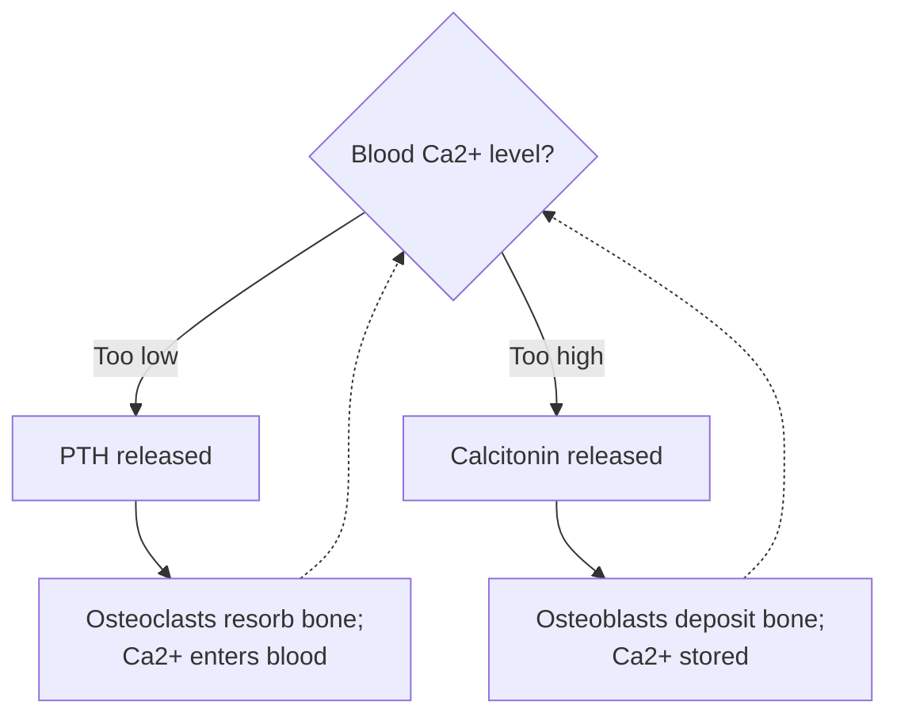

## Bio::Circulatory_System

### LESSON-BIO-CIRCULATORY-SYSTEM

- **KC:** `Bio::Circulatory_System`
- **Title:** Circulatory System: Transport and Hemodynamics
- **Section:** `MCAT::Bio_Biochem`
- **Source:** authored
- **Review Status:** needs_review
- **Overview:** The circulatory system transports gases, nutrients, wastes, hormones, and heat throughout the body in a pressurized fluid loop. The heart pumps blood through arteries, capillaries, and veins, and the physics of pressure and flow governs how it is distributed. It is the delivery network every organ depends on.
- **Key Concepts:**
  - Blood flows heart -> arteries -> capillaries (exchange) -> veins -> heart, in a double loop (pulmonary + systemic).
  - Exchange of gases and nutrients happens across thin-walled capillaries.
  - Flow depends on the pressure gradient and resistance; vessel radius has an outsized effect on resistance.
  - Blood carries O2 (on hemoglobin), CO2, nutrients, hormones, and immune cells.
- **Prerequisite Reminder:** Combine `Bio::Eukaryotic_Cell` (blood and vessel cells) with `Physics::Fluid_Dynamics` (the pressure, flow, and resistance that set how blood distributes).
- **Worked Example:** Narrowing an arteriole sharply raises its resistance (resistance climbs steeply as radius falls), so upstream pressure builds and downstream flow drops. The body uses exactly this - constricting and dilating arterioles - to route more blood to active tissues and less to idle ones.
- **Common Misconception:** "Arteries always carry oxygen-rich blood and veins always carry oxygen-poor blood." The pulmonary artery carries deoxygenated blood and the pulmonary veins carry oxygenated blood; 'artery' means 'away from the heart', not 'oxygen-rich'.
- **First Retrieval Prompt:** From memory, explain why the pulmonary artery is an exception to "arteries carry oxygenated blood."
- **Related KCs:** `Bio::Eukaryotic_Cell`, `Physics::Fluid_Dynamics`, `Bio::Lymphatic_System`, `Bio::Excretory_System`
- **Diagram:** Four-chamber heart schematic: right atrium and ventricle (blue, deoxygenated) and left atrium and ventricle (red, oxygenated), with labeled great vessels and flow direction

<figure class="lesson-diagram">
<svg xmlns="http://www.w3.org/2000/svg" viewBox="0 0 540 440" role="img" aria-labelledby="t d" font-family="-apple-system, Segoe UI, Roboto, sans-serif">
  <title id="t">Heart chambers and blood flow</title>
  <desc id="d">A four-chamber heart. The right atrium and right ventricle in blue carry deoxygenated blood from the body to the lungs. The left atrium and left ventricle in red carry oxygenated blood from the lungs to the body. Blood flows from body to right atrium to right ventricle to lungs to left atrium to left ventricle and back to the body.</desc>
  <rect x="6" y="6" width="528" height="428" rx="14" fill="#ffffff" stroke="#cfd8dc" stroke-width="2"/>
  <text x="270" y="34" text-anchor="middle" font-size="18" font-weight="700" fill="#263238">Heart &#8212; chambers and blood flow</text>

  <line x1="270" y1="104" x2="270" y2="322" stroke="#b0bec5" stroke-width="2"/>

  <rect x="150" y="104" width="112" height="84" rx="10" fill="#bbdefb" stroke="#1e88e5" stroke-width="2"/>
  <rect x="150" y="200" width="112" height="122" rx="10" fill="#90caf9" stroke="#1565c0" stroke-width="2"/>
  <rect x="278" y="104" width="112" height="84" rx="10" fill="#ffcdd2" stroke="#e53935" stroke-width="2"/>
  <rect x="278" y="200" width="112" height="122" rx="10" fill="#ef9a9a" stroke="#c62828" stroke-width="2"/>

  <g text-anchor="middle" font-weight="700" font-size="12">
    <text x="206" y="140" fill="#1565c0">Right</text><text x="206" y="158" fill="#1565c0">atrium</text>
    <text x="206" y="256" fill="#1565c0">Right</text><text x="206" y="274" fill="#1565c0">ventricle</text>
    <text x="334" y="140" fill="#c62828">Left</text><text x="334" y="158" fill="#c62828">atrium</text>
    <text x="334" y="256" fill="#c62828">Left</text><text x="334" y="274" fill="#c62828">ventricle</text>
  </g>

  <g stroke="#455a64" stroke-width="2" fill="#455a64">
    <line x1="206" y1="188" x2="206" y2="202"/><polygon points="206,208 201,197 211,197"/>
    <line x1="334" y1="188" x2="334" y2="202"/><polygon points="334,208 329,197 339,197"/>
  </g>

  <g stroke="#1e88e5" stroke-width="3" fill="#1e88e5">
    <line x1="112" y1="146" x2="150" y2="146"/><polygon points="156,146 145,141 145,151"/>
    <line x1="150" y1="262" x2="112" y2="262"/><polygon points="106,262 117,257 117,267"/>
  </g>
  <g stroke="#e53935" stroke-width="3" fill="#e53935">
    <line x1="430" y1="146" x2="390" y2="146"/><polygon points="384,146 395,141 395,151"/>
    <line x1="390" y1="262" x2="430" y2="262"/><polygon points="436,262 425,257 425,267"/>
  </g>

  <g font-size="10">
    <text x="72" y="124" fill="#1565c0">From body</text><text x="72" y="138" fill="#1565c0">(venae cavae)</text>
    <text x="72" y="234" fill="#1565c0">To lungs</text><text x="72" y="248" fill="#1565c0">(pulm. artery)</text>
    <text x="468" y="124" text-anchor="end" fill="#c62828">From lungs</text><text x="468" y="138" text-anchor="end" fill="#c62828">(pulm. veins)</text>
    <text x="468" y="234" text-anchor="end" fill="#c62828">To body</text><text x="468" y="248" text-anchor="end" fill="#c62828">(aorta)</text>
  </g>

  <text x="270" y="360" text-anchor="middle" font-size="12" font-weight="600" fill="#37474f">Flow: body &#8594; RA &#8594; RV &#8594; lungs &#8594; LA &#8594; LV &#8594; body.</text>
  <text x="270" y="382" text-anchor="middle" font-size="12" fill="#607d8b">Right side = deoxygenated (blue); left side = oxygenated (red).</text>
  <text x="270" y="412" text-anchor="middle" font-size="10" fill="#90a4ae">Pulmonary loop (heart&#8211;lungs) plus systemic loop (heart&#8211;body).</text>
</svg>
</figure>
- **Diagram:** Double circulation - pulmonary and systemic loops:

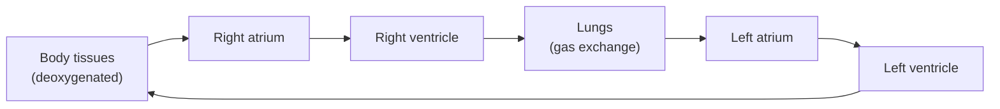

## Bio::Respiratory_System

### LESSON-BIO-RESPIRATORY-SYSTEM

- **KC:** `Bio::Respiratory_System`
- **Title:** Respiratory System: Gas Exchange and Ventilation
- **Section:** `MCAT::Bio_Biochem`
- **Source:** authored
- **Review Status:** needs_review
- **Overview:** The respiratory system brings oxygen into the blood and removes carbon dioxide, exchanging gases across a huge, thin alveolar surface. Ventilation moves air by changing thoracic pressure, and breathing rate is tuned mainly by blood CO2 and pH. It couples tightly to the circulatory system.
- **Key Concepts:**
  - Gas exchange occurs by diffusion across alveolar-capillary membranes, driven by partial-pressure gradients.
  - Inhalation is active: the diaphragm contracts, thoracic volume rises, and pressure drops so air flows in.
  - Breathing is regulated chiefly by CO2/pH sensed by central chemoreceptors, not primarily by O2.
  - Large alveolar surface area and thin walls maximize the diffusion rate.
- **Prerequisite Reminder:** Combine `Bio::Eukaryotic_Cell` (the epithelial structure) with `GenChem::Gas_Phase` (partial pressures and gas behavior that drive diffusion).
- **Worked Example:** O2 diffuses from alveolar air (high partial pressure) into blood (lower), while CO2 diffuses the opposite way down its own gradient. If you hold your breath, CO2 - not falling O2 - builds up first, lowering blood pH and forcing the drive to breathe, which is why CO2 is the main breathing stimulus.
- **Common Misconception:** "The urge to breathe is driven mainly by low oxygen." Under normal conditions the primary stimulus is rising CO2 (and falling pH), detected by central chemoreceptors.
- **First Retrieval Prompt:** From memory, state which blood gas primarily drives breathing rate and explain the partial-pressure logic of alveolar gas exchange.
- **Related KCs:** `Bio::Eukaryotic_Cell`, `GenChem::Gas_Phase`
- **Diagram:** Airway path and gas exchange at the alveoli:

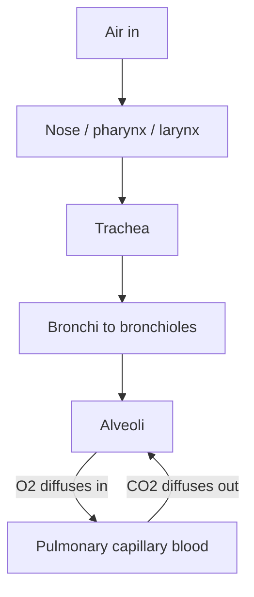

## Bio::Digestive_System

### LESSON-BIO-DIGESTIVE-SYSTEM

- **KC:** `Bio::Digestive_System`
- **Title:** Digestive System: Breakdown and Absorption
- **Section:** `MCAT::Bio_Biochem`
- **Source:** authored
- **Review Status:** needs_review
- **Overview:** The digestive system breaks food into absorbable molecules and takes them into the blood. Mechanical and enzymatic processing occur in sequence along the tract, each region specialized for a step, and accessory organs supply enzymes and emulsifiers. Absorption happens mostly across the vast surface of the small intestine.
- **Key Concepts:**
  - Digestion is both mechanical (chewing, churning) and chemical (enzymes specific to carbohydrates, proteins, and fats).
  - Different regions provide optimal conditions (e.g., the acidic stomach vs the near-neutral small intestine).
  - Accessory organs (pancreas, liver/gallbladder) deliver enzymes and bile for fat emulsification.
  - The small intestine's villi and microvilli maximize absorptive surface area.
- **Prerequisite Reminder:** Combine `Bio::Eukaryotic_Cell` (secretory and absorptive epithelia) with `Biochem::Enzymes`: digestion is enzyme catalysis operating under region-specific optimal conditions.
- **Worked Example:** Protein digestion starts in the acidic stomach where pepsin works best, then continues in the small intestine where pancreatic proteases operate near neutral pH after bicarbonate neutralizes the acid. Each enzyme is matched to the pH of its compartment - move it elsewhere and it works poorly.
- **Common Misconception:** "Most nutrient absorption happens in the stomach." The stomach mainly digests; the great majority of nutrient absorption occurs in the small intestine.
- **First Retrieval Prompt:** From memory, explain why stomach and small-intestine enzymes work best at different pH values, and state where most absorption occurs.
- **Related KCs:** `Bio::Eukaryotic_Cell`, `Biochem::Enzymes`
- **Diagram:** Path through the GI tract - where digestion and absorption happen:

```mermaid
flowchart TD
    MOUTH["Mouth:<br/>chewing + salivary amylase"] --> ESOPH["Esophagus"]
    ESOPH --> STOM["Stomach (acidic):<br/>pepsin digests protein"]
    STOM --> SI["Small intestine (neutral):<br/>most digestion + absorption (villi)"]
    SI --> LI["Large intestine:<br/>water + ion reabsorption"]
    LI --> OUT["Feces eliminated"]
    ACC["Pancreas + liver / gallbladder"] -.->|"enzymes + bile"| SI
```

## Bio::Immune_System

### LESSON-BIO-IMMUNE-SYSTEM

- **KC:** `Bio::Immune_System`
- **Title:** Immune System: Innate and Adaptive Defense
- **Section:** `MCAT::Bio_Biochem`
- **Source:** authored
- **Review Status:** needs_review
- **Overview:** The immune system defends the body against pathogens using layered, increasingly specific responses. Innate immunity acts fast and generically; adaptive immunity is slower but highly specific and remembers past invaders. Together they detect, target, and eliminate threats while sparing self.
- **Key Concepts:**
  - Innate immunity (barriers, phagocytes, inflammation) is rapid and nonspecific.
  - Adaptive immunity is specific and has memory: B cells make antibodies (humoral), T cells kill infected cells or coordinate the response (cell-mediated).
  - Antibodies tag or neutralize specific antigens.
  - Immunological memory enables a faster, stronger secondary response (the basis of vaccination).
- **Prerequisite Reminder:** Combine `Bio::Eukaryotic_Cell` (the immune cell types) with `Biochem::Protein_Structure_and_Function` (antibody and receptor shape is what confers antigen specificity).
- **Worked Example:** A first exposure to a pathogen triggers a slow primary response while specific B and T cells are selected and expanded, and memory cells persist. A second exposure is met by those memory cells, producing a faster, larger antibody response that often clears the pathogen before symptoms appear - the principle vaccines exploit.
- **Common Misconception:** "Antibodies directly kill pathogens." Antibodies mainly bind and tag antigens (neutralizing, opsonizing, activating complement); other cells and systems usually do the killing.
- **First Retrieval Prompt:** From memory, contrast the primary and secondary immune responses and explain why the second is faster.
- **Related KCs:** `Bio::Eukaryotic_Cell`, `Biochem::Protein_Structure_and_Function`, `Bio::Lymphatic_System`
- **Diagram:** Immune response - innate first, then specific adaptive memory:

```mermaid
flowchart TD
    PATH["Pathogen enters"] --> INN["Innate: barriers, phagocytes,<br/>inflammation (fast, nonspecific)"]
    INN --> ADAPT["Adaptive response (specific)"]
    ADAPT --> HUM["Humoral: B cells make antibodies"]
    ADAPT --> CELL["Cell-mediated: T cells kill<br/>infected cells / coordinate"]
    HUM --> MEM["Memory cells persist"]
    CELL --> MEM
    MEM -.->|"faster, stronger on re-exposure"| ADAPT
```

## Bio::Lymphatic_System

### LESSON-BIO-LYMPHATIC-SYSTEM

- **KC:** `Bio::Lymphatic_System`
- **Title:** Lymphatic System: Fluid Balance and Immunity
- **Section:** `MCAT::Bio_Biochem`
- **Source:** authored
- **Review Status:** needs_review
- **Overview:** The lymphatic system returns excess tissue fluid to the bloodstream, absorbs dietary fats, and provides sites where immune cells survey for pathogens. It is a one-way drainage network that complements the circulatory and immune systems.
- **Key Concepts:**
  - Lymphatic vessels collect interstitial fluid (lymph) and return it to the venous blood, maintaining fluid balance.
  - Lymph moves one-way, propelled by skeletal-muscle compression and valves (there is no central pump).
  - Lymph nodes filter lymph and house immune cells that screen for antigens.
  - Lacteals in the intestine absorb dietary fats into lymph.
- **Prerequisite Reminder:** Build on `Bio::Circulatory_System` (capillary fluid that leaves the blood) and `Bio::Immune_System` (nodes are immune-surveillance stations).
- **Worked Example:** Capillaries leak slightly more fluid into tissues than they reabsorb; lymphatics collect this surplus and return it to the veins. If lymph drainage is blocked, fluid accumulates and the tissue swells (edema).
- **Common Misconception:** "The lymphatic system has its own pump, like the heart." It has no central pump; lymph is moved by surrounding muscle contraction and one-way valves.
- **First Retrieval Prompt:** From memory, explain what causes edema when lymphatic drainage is blocked, and how lymph normally moves without a pump.
- **Related KCs:** `Bio::Circulatory_System`, `Bio::Immune_System`
- **Diagram:** Lymphatic fluid balance - a one-way return route:

```mermaid
flowchart LR
    CAP["Blood capillary<br/>leaks fluid"] --> INT["Interstitial fluid<br/>(surplus)"]
    INT --> LYMPH["Lymph capillaries<br/>collect it"]
    LYMPH --> NODE["Lymph nodes<br/>(immune screening)"]
    NODE --> VEIN["Returned to<br/>the veins"]
```

## Bio::Skin_System

### LESSON-BIO-SKIN-SYSTEM

- **KC:** `Bio::Skin_System`
- **Title:** Skin System: Barrier and Thermoregulation
- **Section:** `MCAT::Bio_Biochem`
- **Source:** authored
- **Review Status:** needs_review
- **Overview:** The skin (integumentary system) is the body's outermost barrier, protecting against pathogens, dehydration, and physical damage while helping regulate temperature. Its layered structure supports these roles and hosts sensory and secretory elements.
- **Key Concepts:**
  - The epidermis is the outer protective barrier; the dermis beneath holds vessels, nerves, and glands.
  - Skin defends against pathogen entry and water loss (an innate barrier).
  - Thermoregulation uses sweat (evaporative cooling) and adjustable blood flow (vasodilation/vasoconstriction).
  - Sensory receptors in the skin detect touch, temperature, and pain.
- **Prerequisite Reminder:** Build on `Bio::Eukaryotic_Cell`: skin is layered epithelial and connective tissue built from the cell plan you already know.
- **Worked Example:** When you overheat, dermal blood vessels dilate to shed heat at the surface and sweat glands release fluid that cools you as it evaporates. When you are cold, those vessels constrict to conserve core heat - the same organ tunes temperature in both directions.
- **Common Misconception:** "Skin is just a passive outer covering." Skin is an active organ: an immune barrier, a thermoregulator, and a sensory surface.
- **First Retrieval Prompt:** From memory, describe two ways the skin helps cool the body when you overheat.
- **Related KCs:** `Bio::Eukaryotic_Cell`
- **Diagram:** Cross-section of skin: a thin epidermis over a thicker dermis containing a hair follicle, sweat gland with duct, blood-vessel loop, and nerve ending, above the fatty hypodermis

<figure class="lesson-diagram">
<svg xmlns="http://www.w3.org/2000/svg" viewBox="0 0 540 440" role="img" aria-labelledby="t d" font-family="-apple-system, Segoe UI, Roboto, sans-serif">
  <title id="t">Skin layers</title>
  <desc id="d">Cross-section of skin. The thin epidermis on top is the protective barrier. The thicker dermis below holds a hair follicle, a sweat gland with a duct to the surface, a blood-vessel loop, and a sensory nerve ending. The hypodermis beneath is fatty subcutaneous tissue. Sweating and dermal blood-vessel dilation release heat.</desc>
  <rect x="6" y="6" width="528" height="428" rx="14" fill="#ffffff" stroke="#cfd8dc" stroke-width="2"/>
  <text x="270" y="34" text-anchor="middle" font-size="18" font-weight="700" fill="#263238">Skin &#8212; layers and thermoregulation</text>

  <rect x="40" y="68" width="460" height="54" fill="#ffe0b2" stroke="#fb8c00" stroke-width="2"/>
  <rect x="40" y="122" width="460" height="158" fill="#ffccbc" stroke="#ff7043" stroke-width="2"/>
  <rect x="40" y="280" width="460" height="88" fill="#fff3e0" stroke="#ffb74d" stroke-width="2"/>
  <text x="50" y="100" font-size="12" font-weight="700" fill="#e65100">Epidermis</text>
  <text x="50" y="142" font-size="12" font-weight="700" fill="#d84315">Dermis</text>
  <text x="50" y="326" font-size="12" font-weight="700" fill="#ef6c00">Hypodermis (fat)</text>

  <line x1="150" y1="52" x2="150" y2="68" stroke="#6d4c41" stroke-width="3"/>
  <g stroke="#8d6e63" stroke-width="2" fill="none">
    <path d="M143 68 L158 258"/><path d="M157 68 L172 258"/>
  </g>
  <ellipse cx="165" cy="260" rx="12" ry="9" fill="#ffcc80" stroke="#ff7043" stroke-width="1.5"/>
  <line x1="172" y1="150" x2="196" y2="150" stroke="#90a4ae" stroke-width="1"/>
  <text x="200" y="154" font-size="10" fill="#5d4037">Hair follicle</text>

  <path d="M300 68 Q296 150 306 208" fill="none" stroke="#29b6f6" stroke-width="2"/>
  <circle cx="312" cy="230" r="16" fill="none" stroke="#29b6f6" stroke-width="2"/>
  <path d="M302 230 Q312 220 322 230 Q312 240 302 230" fill="none" stroke="#29b6f6" stroke-width="1.5"/>
  <text x="300" y="62" text-anchor="middle" font-size="8" fill="#0277bd">Sweat pore</text>
  <line x1="328" y1="230" x2="336" y2="230" stroke="#90a4ae" stroke-width="1"/>
  <text x="340" y="234" font-size="10" fill="#0277bd">Sweat gland</text>

  <path d="M406 128 L406 240 Q406 262 420 250 L420 130" fill="none" stroke="#c62828" stroke-width="2"/>
  <line x1="422" y1="196" x2="432" y2="196" stroke="#90a4ae" stroke-width="1"/>
  <text x="436" y="200" font-size="10" fill="#b71c1c">Blood vessel</text>

  <ellipse cx="238" cy="250" rx="11" ry="8" fill="#ab47bc" stroke="#6a1b9a" stroke-width="1.5"/>
  <line x1="248" y1="258" x2="258" y2="266" stroke="#90a4ae" stroke-width="1"/>
  <text x="260" y="270" font-size="10" fill="#6a1b9a">Nerve ending</text>

  <text x="270" y="394" text-anchor="middle" font-size="12" font-weight="600" fill="#37474f">Epidermis = barrier; dermis holds vessels, glands, and nerves.</text>
  <text x="270" y="416" text-anchor="middle" font-size="12" fill="#607d8b">To cool down: sweat evaporates and dermal vessels dilate to shed heat.</text>
</svg>
</figure>
- **Diagram:** Thermoregulation - the skin tunes temperature both ways:

```mermaid
flowchart TD
    TEMP{"Body temperature?"} -->|"Too hot"| HOT["Vessels dilate + sweat;<br/>heat released (evaporative cooling)"]
    TEMP -->|"Too cold"| COLD["Vessels constrict;<br/>heat conserved"]
    HOT -.-> TEMP
    COLD -.-> TEMP
```

## Bio::Excretory_System

### LESSON-BIO-EXCRETORY-SYSTEM

- **KC:** `Bio::Excretory_System`
- **Title:** Excretory System: The Nephron and Homeostasis
- **Section:** `MCAT::Bio_Biochem`
- **Source:** authored
- **Review Status:** needs_review
- **Overview:** The excretory (renal) system filters blood, removes nitrogenous and other wastes, and precisely regulates water, ion, and acid-base balance. The nephron is the functional unit, using filtration followed by selective reabsorption and secretion to fine-tune the final urine. It is central to whole-body homeostasis.
- **Key Concepts:**
  - The nephron works in steps: glomerular filtration, tubular reabsorption, tubular secretion, and excretion.
  - Osmoregulation adjusts water reabsorption (e.g., via ADH) to control blood osmolarity and volume.
  - The kidney helps regulate blood pH by handling H+ and bicarbonate.
  - Countercurrent multiplication in the loop of Henle lets the kidney concentrate urine.
- **Prerequisite Reminder:** Integrate `Bio::Circulatory_System` (blood delivery and pressure for filtration), `GenChem::Acid_Base_Equilibria` (H+/bicarbonate handling), and `GenChem::Ions_in_Solutions` (electrolyte movement).
- **Worked Example:** When you are dehydrated, ADH rises and makes the collecting duct more permeable to water, so more water is reabsorbed and a small volume of concentrated urine is produced. Waste solutes are still excreted, but water is conserved - filtration followed by selective reabsorption is what allows this independent control.
- **Common Misconception:** "Urine is simply the blood filtrate, passed through unchanged." The filtrate is heavily modified by reabsorption and secretion; final urine differs greatly from the initial filtrate.
- **First Retrieval Prompt:** From memory, explain how the kidney can conserve water yet still excrete wastes when you are dehydrated.
- **Related KCs:** `Bio::Circulatory_System`, `GenChem::Acid_Base_Equilibria`, `GenChem::Ions_in_Solutions`
- **Diagram:** Schematic nephron numbered 1-6: glomerulus and Bowman's capsule, proximal tubule, loop of Henle, distal tubule, collecting duct, and urine, with a legend of each step's function

<figure class="lesson-diagram">
<svg xmlns="http://www.w3.org/2000/svg" viewBox="0 0 540 440" role="img" aria-labelledby="t d" font-family="-apple-system, Segoe UI, Roboto, sans-serif">
  <title id="t">Nephron</title>
  <desc id="d">Schematic nephron. Blood is filtered at the glomerulus inside Bowman's capsule (step 1). The proximal tubule reabsorbs most water and solutes (step 2). The loop of Henle concentrates the urine by countercurrent multiplication (step 3). The distal tubule secretes and fine-tunes (step 4). The collecting duct reabsorbs water under ADH control (step 5). The remaining fluid leaves as urine (step 6).</desc>
  <rect x="6" y="6" width="528" height="428" rx="14" fill="#ffffff" stroke="#cfd8dc" stroke-width="2"/>
  <text x="270" y="34" text-anchor="middle" font-size="18" font-weight="700" fill="#263238">Nephron &#8212; filtration to urine</text>

  <path d="M108 112 Q66 110 66 86 Q66 62 94 62 Q120 62 120 84" fill="#eceff1" stroke="#90a4ae" stroke-width="2"/>
  <path d="M78 86 Q90 72 104 84 Q112 92 100 98 Q86 104 80 92" fill="none" stroke="#ef5350" stroke-width="2"/>
  <path d="M84 82 Q94 84 96 92" fill="none" stroke="#ef5350" stroke-width="1.5"/>

  <path d="M108 112 Q130 96 150 114 Q168 130 176 152 L180 286 Q182 309 200 308 Q218 307 216 286 L212 152 Q210 128 230 110 Q250 94 270 114 Q279 123 288 132" fill="none" stroke="#4fc3f7" stroke-width="4"/>
  <path d="M288 132 L300 324" fill="none" stroke="#29b6f6" stroke-width="6"/>
  <line x1="300" y1="324" x2="300" y2="348" stroke="#29b6f6" stroke-width="6"/>
  <polygon points="300,356 293,344 307,344" fill="#29b6f6"/>

  <g font-size="11" font-weight="700" fill="#ffffff" text-anchor="middle">
    <circle cx="92" cy="48" r="10" fill="#455a64"/><text x="92" y="52">1</text>
    <circle cx="150" cy="88" r="10" fill="#455a64"/><text x="150" y="92">2</text>
    <circle cx="198" cy="330" r="10" fill="#455a64"/><text x="198" y="334">3</text>
    <circle cx="270" cy="86" r="10" fill="#455a64"/><text x="270" y="90">4</text>
    <circle cx="318" cy="215" r="10" fill="#455a64"/><text x="318" y="219">5</text>
    <circle cx="300" cy="374" r="10" fill="#455a64"/><text x="300" y="378">6</text>
  </g>

  <text x="344" y="70" font-size="12" font-weight="700" fill="#263238">Steps</text>
  <g font-size="10" fill="#37474f">
    <text x="344" y="96">1  Glomerulus / Bowman: filtration</text>
    <text x="344" y="128">2  Proximal tubule: reabsorption (most)</text>
    <text x="344" y="160">3  Loop of Henle: concentrates urine</text>
    <text x="344" y="192">4  Distal tubule: secretion, fine-tune</text>
    <text x="344" y="224">5  Collecting duct: ADH water control</text>
    <text x="344" y="256">6  Urine: excretion</text>
  </g>

  <text x="270" y="410" text-anchor="middle" font-size="11" fill="#607d8b">Filtration, then selective reabsorption and secretion, shapes the final urine.</text>
</svg>
</figure>
- **Diagram:** Nephron flow - filter, then selectively reabsorb and secrete:

```mermaid
flowchart TD
    GLOM["Glomerulus:<br/>filtration of blood"] --> PCT["Proximal tubule:<br/>reabsorb most water/solutes"]
    PCT --> LOOP["Loop of Henle:<br/>countercurrent concentrates urine"]
    LOOP --> DCT["Distal tubule:<br/>secretion + fine-tuning"]
    DCT --> CD["Collecting duct:<br/>ADH-controlled water reabsorption"]
    CD --> URINE["Urine (excretion)"]
```

## Bio::Reproductive_System

### LESSON-BIO-REPRODUCTIVE-SYSTEM

- **KC:** `Bio::Reproductive_System`
- **Title:** Reproductive System: Gametogenesis and Cycles
- **Section:** `MCAT::Bio_Biochem`
- **Source:** authored
- **Review Status:** needs_review
- **Overview:** The reproductive system produces gametes and supports fertilization and, in females, gestation. Gamete formation relies on meiosis, and reproductive cycles are orchestrated by endocrine feedback. The male and female systems are specialized variations coordinated by hormones.
- **Key Concepts:**
  - Gametogenesis (spermatogenesis, oogenesis) uses meiosis to make haploid gametes.
  - Hormonal feedback (FSH, LH, estrogen, progesterone, testosterone) drives gamete production and cycles.
  - The ovarian/menstrual cycle coordinates follicle maturation, ovulation, and uterine preparation.
  - Fertilization restores diploidy and begins development.
- **Prerequisite Reminder:** Combine `Bio::Endocrine_System` (the hormone feedback loops that run the cycles) with `Bio::Meiosis` (how haploid gametes are actually made).
- **Worked Example:** A mid-cycle surge in LH triggers ovulation. The emptied follicle becomes the corpus luteum, which secretes progesterone that maintains the uterine lining and, by negative feedback, suppresses further FSH/LH. If no pregnancy occurs, the corpus luteum regresses, progesterone falls, and the cycle restarts - a feedback loop timing each event.
- **Common Misconception:** "Oogenesis produces four equal, functional eggs, just as spermatogenesis makes four sperm." Oogenesis yields one functional egg (the others become polar bodies), concentrating resources into a single gamete.
- **First Retrieval Prompt:** From memory, explain how the LH surge and the corpus luteum coordinate ovulation and the uterine lining.
- **Related KCs:** `Bio::Endocrine_System`, `Bio::Meiosis`, `Bio::Embryology`
- **Diagram:** Ovarian / menstrual cycle - a hormonal feedback loop:

```mermaid
flowchart TD
    FSH["FSH: follicle matures"] --> EST["Follicle secretes estrogen"]
    EST --> LH["LH surge"]
    LH --> OV["Ovulation"]
    OV --> CL["Corpus luteum secretes progesterone"]
    CL --> UT["Uterine lining maintained"]
    CL -.->|"no pregnancy: luteum regresses,<br/>negative feedback"| FSH
```

## Bio::Embryology

### LESSON-BIO-EMBRYOLOGY

- **KC:** `Bio::Embryology`
- **Title:** Embryology: From Zygote to Body Plan
- **Section:** `MCAT::Bio_Biochem`
- **Source:** authored
- **Review Status:** needs_review
- **Overview:** Embryology traces how a single fertilized cell becomes a structured, multicellular organism. Early rapid divisions are followed by dramatic cell movements and the switching-on of region-specific genes that create tissues and body axes. Differentiation is driven by regulated gene expression, not by cells losing genes.
- **Key Concepts:**
  - Fertilization is followed by cleavage: rapid divisions with little growth, forming a blastula.
  - Gastrulation reorganizes cells into germ layers (ectoderm, mesoderm, endoderm) that seed all tissues.
  - Differentiation arises from differential gene expression and cell-cell signaling (induction).
  - Morphogen gradients and positional signals establish the body plan.
- **Prerequisite Reminder:** Build on `Bio::Gene_Expression_Regulation` (differentiation is regulated expression) and `Bio::Reproductive_System` (fertilization supplies the starting cell).
- **Worked Example:** Two cells with identical genomes can become a neuron and a skin cell because different signals turn on different gene sets in each. A morphogen present at high concentration on one side of the embryo switches on one program; a lower concentration elsewhere switches on another - position dictates fate through gene regulation.
- **Common Misconception:** "Cells differentiate by discarding the genes they no longer need." Nearly all cells keep the full genome; differentiation reflects which genes are expressed, not which are kept.
- **First Retrieval Prompt:** From memory, explain how two cells with the same DNA can become different cell types.
- **Related KCs:** `Bio::Gene_Expression_Regulation`, `Bio::Reproductive_System`
- **Diagram:** Development sequence - from one cell to a body plan:

```mermaid
flowchart LR
    Z["Zygote"] -->|"cleavage"| BL["Blastula<br/>(hollow ball of cells)"]
    BL -->|"gastrulation"| GL["Three germ layers:<br/>ectoderm, mesoderm, endoderm"]
    GL -->|"differentiation + induction"| T["Tissues and organs;<br/>axes set by morphogen gradients"]
```

## Bio::Evolution

### LESSON-BIO-EVOLUTION

- **KC:** `Bio::Evolution`
- **Title:** Evolution: Natural Selection and Change
- **Section:** `MCAT::Bio_Biochem`
- **Source:** authored
- **Review Status:** needs_review
- **Overview:** Evolution is the change in heritable traits of populations across generations. Natural selection - the differential survival and reproduction of heritable variants - is its central mechanism, but drift, gene flow, and mutation also shape populations. It unifies biology by explaining both diversity and shared features.
- **Key Concepts:**
  - Evolution acts on populations over generations, not on individuals within their lifetime.
  - Natural selection requires heritable variation that affects reproductive success (fitness).
  - Fitness means reproductive success, not strength or size per se.
  - Additional mechanisms include genetic drift, gene flow, mutation, and non-random mating.
- **Prerequisite Reminder:** Build on `Bio::Genetics`: heritable allelic variation is the raw material that selection and drift act on.
- **Worked Example:** In a beetle population with heritable color variation, if predators more easily spot lighter beetles, darker beetles survive and reproduce more, so the dark allele's frequency rises over generations. No individual beetle changes color - the population's composition shifts because of differential reproduction.
- **Common Misconception:** "Individual organisms evolve during their lifetime and pass on traits they acquire." Evolution is a change in a population's allele frequencies over generations; individuals do not evolve, and acquired (non-heritable) traits are not passed on.
- **First Retrieval Prompt:** From memory, explain why evolution is described as a population-level change and what "fitness" actually measures.
- **Related KCs:** `Bio::Genetics`, `Bio::Population_Genetics`, `Bio::Biodiversity_and_Phylogeny`
- **Diagram:** Natural selection - why allele frequencies change:

```mermaid
flowchart TD
    V["Heritable variation<br/>in a population"] --> S["Some variants reproduce<br/>more (higher fitness)"]
    S --> H["Their alleles are passed<br/>on more often"]
    H --> F["Allele frequencies change<br/>over generations = evolution"]
    OTHER["Also shift frequencies:<br/>drift, gene flow, mutation,<br/>non-random mating"] --> F
```

## Bio::Population_Genetics

### LESSON-BIO-POPULATION-GENETICS

- **KC:** `Bio::Population_Genetics`
- **Title:** Population Genetics: Allele Frequencies and Hardy-Weinberg
- **Section:** `MCAT::Bio_Biochem`
- **Source:** authored
- **Review Status:** needs_review
- **Overview:** Population genetics quantifies evolution by tracking allele and genotype frequencies in a population. The Hardy-Weinberg model provides a null expectation - the frequencies expected if no evolution is occurring - so deviations reveal selection, drift, or other forces at work. It turns evolution into something measurable.
- **Key Concepts:**
  - Allele frequencies (p, q) and genotype frequencies (p^2, 2pq, q^2) describe a population's genetic makeup.
  - Hardy-Weinberg equilibrium holds only under specific assumptions: no selection, no drift, no gene flow, no mutation, and random mating.
  - p + q = 1 and p^2 + 2pq + q^2 = 1 let you compute unknown frequencies.
  - Deviations from Hardy-Weinberg expectations are evidence that evolutionary forces are acting.
- **Prerequisite Reminder:** Combine `Bio::Evolution` (the forces that change frequencies) with `Bio::Mendelian_Genetics` (the probability rules the equations generalize).
- **Worked Example:** If a recessive condition affects 1 in 100 people, then q^2 = 0.01, so q = 0.1 and p = 0.9. Carriers are 2pq = 2(0.9)(0.1) = 0.18 - about 18% of the population, far more than the 1% who are affected. Hardy-Weinberg lets you infer hidden carrier frequency from the visible phenotype rate.
- **Common Misconception:** "Dominant alleles automatically become more common over generations." Allele frequencies do not change from dominance alone; without an evolutionary force, Hardy-Weinberg predicts they stay constant.
- **First Retrieval Prompt:** From memory, given that a recessive phenotype appears in 1 of 100 individuals, outline how you would find the carrier frequency.
- **Related KCs:** `Bio::Evolution`, `Bio::Mendelian_Genetics`
- **Diagram:** Hardy-Weinberg - a null model that reveals evolution:

```mermaid
flowchart TD
    ASSUME["Assume no evolution:<br/>no selection, drift, gene flow,<br/>mutation; random mating"] --> EQ["Hardy-Weinberg equilibrium"]
    EQ --> P["p + q = 1"]
    EQ --> G["p^2 + 2pq + q^2 = 1"]
    P --> USE["Compute unknown allele /<br/>genotype frequencies"]
    G --> USE
    USE --> DEV{"Observed = predicted?"}
    DEV -->|"No"| EVOL["Deviation = evidence<br/>evolution is occurring"]
    DEV -->|"Yes"| STAB["Consistent with no<br/>evolutionary change"]
```

## Bio::Biodiversity_and_Phylogeny

### LESSON-BIO-BIODIVERSITY-AND-PHYLOGENY

- **KC:** `Bio::Biodiversity_and_Phylogeny`
- **Title:** Biodiversity and Phylogeny: Classifying Life
- **Section:** `MCAT::Bio_Biochem`
- **Source:** authored
- **Review Status:** needs_review
- **Overview:** This KC covers how life's diversity is organized and how evolutionary relationships are represented. Phylogenetic trees depict shared ancestry inferred from morphological and molecular data, and speciation explains how new lineages arise. It frames the branching pattern that evolution produces.
- **Key Concepts:**
  - Taxonomy classifies organisms in a nested hierarchy (e.g., domain down to species).
  - Phylogenetic trees show inferred common ancestry; branch points represent common ancestors.
  - Shared derived traits (and molecular data) are used to group related lineages.
  - Speciation, often via reproductive isolation, generates new branches.
- **Prerequisite Reminder:** Build on `Bio::Evolution`: descent with modification is what a phylogeny depicts and what speciation extends into new branches.
- **Worked Example:** On a tree, two species sharing a more recent common ancestor (a nearer branch point) are more closely related than either is to a species that branched off earlier - relatedness is read from branch points, not from how physically similar two tips look.
- **Common Misconception:** "Species higher up or further right on a tree are 'more evolved' than the others." All living tips are equally modern; a tree shows relationships and shared ancestry, not a ranking of advancement.
- **First Retrieval Prompt:** From memory, explain how you determine which of two species is more closely related to a third using a phylogenetic tree.
- **Related KCs:** `Bio::Evolution`
- **Diagram:** Rectangular cladogram with root at left branching to five tips A-E; internal branch points mark common ancestors, showing that relatedness is read from the most recent common ancestor, not tip height

<figure class="lesson-diagram">
<svg xmlns="http://www.w3.org/2000/svg" viewBox="0 0 540 440" role="img" aria-labelledby="t d" font-family="-apple-system, Segoe UI, Roboto, sans-serif">
  <title id="t">Phylogenetic tree (cladogram)</title>
  <desc id="d">A rectangular cladogram with a root on the left branching to five tips labeled A through E on the right. Internal branch points mark common ancestors: A and B share the most recent common ancestor, then C joins them, then D, and E branches earliest. Relatedness is read from the branch points, not from how high or low a tip sits, and all living tips are equally modern.</desc>
  <rect x="6" y="6" width="528" height="428" rx="14" fill="#ffffff" stroke="#cfd8dc" stroke-width="2"/>
  <text x="270" y="34" text-anchor="middle" font-size="18" font-weight="700" fill="#263238">Phylogenetic tree (cladogram)</text>

  <g stroke="#37474f" stroke-width="3" fill="none" stroke-linecap="round">
    <line x1="50" y1="288" x2="70" y2="288"/>
    <line x1="70" y1="217" x2="70" y2="360"/>
    <line x1="70" y1="217" x2="150" y2="217"/>
    <line x1="70" y1="360" x2="430" y2="360"/>
    <line x1="150" y1="165" x2="150" y2="270"/>
    <line x1="150" y1="165" x2="230" y2="165"/>
    <line x1="150" y1="270" x2="430" y2="270"/>
    <line x1="230" y1="120" x2="230" y2="210"/>
    <line x1="230" y1="120" x2="320" y2="120"/>
    <line x1="230" y1="210" x2="430" y2="210"/>
    <line x1="320" y1="90" x2="320" y2="150"/>
    <line x1="320" y1="90" x2="430" y2="90"/>
    <line x1="320" y1="150" x2="430" y2="150"/>
  </g>

  <g fill="#0288d1">
    <circle cx="320" cy="120" r="5"/>
    <circle cx="230" cy="165" r="5"/>
    <circle cx="150" cy="217" r="5"/>
    <circle cx="70" cy="288" r="5"/>
  </g>

  <g font-size="15" font-weight="700" fill="#263238">
    <text x="446" y="95">A</text>
    <text x="446" y="155">B</text>
    <text x="446" y="215">C</text>
    <text x="446" y="275">D</text>
    <text x="446" y="365">E</text>
  </g>

  <text x="70" y="306" text-anchor="middle" font-size="10" fill="#90a4ae">root</text>
  <text x="248" y="148" font-size="10" fill="#0277bd">branch point = common ancestor</text>

  <text x="270" y="404" text-anchor="middle" font-size="12" fill="#607d8b">Relatedness is read from branch points (most recent common ancestor).</text>
  <text x="270" y="424" text-anchor="middle" font-size="12" fill="#607d8b">All tips are equally modern; up or down does not mean "more evolved".</text>
</svg>
</figure>
