# General Chemistry Lessons (Track C — scaled draft)

Auto-drafted lesson pages for the 26 `GenChem::` KCs in the frozen unified map
(`added features/kc-map-unified.md` §6/§7). Schema + style follow
`added features/lessons.md`. All content is synthetic and original (not copied
from any copyrighted prep material). New lessons are `Source: authored`,
`Review Status: needs_review` (hidden behind the display gate until a human
approves them, per `lesson-contract.md` §4).

## GenChem::Atomic_Structure

### LESSON-GENCHEM-ATOMIC-STRUCTURE

- **KC:** `GenChem::Atomic_Structure`
- **Title:** Atomic Structure: Protons, Neutrons, and Isotopes
- **Section:** `MCAT::Chem_Phys`
- **Source:** authored
- **Review Status:** needs_review
- **Overview:** An atom is a tiny, dense nucleus of protons and neutrons
  surrounded by electrons. The number of protons (atomic number, Z) fixes the
  element's identity, while protons plus neutrons give the mass number (A).
  Almost every other general-chemistry idea starts from this bookkeeping of
  subatomic particles and charge.
- **Key Concepts:**
  - Protons carry +1 charge and set the element (Z); electrons carry -1 charge;
    neutrons are neutral.
  - Mass number A = protons + neutrons; isotopes are atoms of one element with
    different neutron counts.
  - A neutral atom has equal protons and electrons; losing or gaining electrons
    makes a cation or anion.
  - Average atomic mass is the abundance-weighted mean of an element's isotopes,
    not the mass of any single atom.
- **Prerequisite Reminder:** Foundation KC — no prerequisites assumed beyond
  basic chemistry vocabulary (elements, charge, and the periodic table layout).
- **Worked Example:** Chlorine occurs as about 75% Cl-35 and 25% Cl-37. The
  weighted average is (0.75 x 35) + (0.25 x 37) = 26.25 + 9.25 = 35.5 amu, which
  is why the periodic table lists ~35.5 for chlorine even though no single
  chlorine atom weighs 35.5 amu.
- **Common Misconception:** "Mass number and average atomic mass are the same."
  Mass number is a whole-number count of protons + neutrons in one specific
  isotope; average atomic mass is a decimal, abundance-weighted average across
  isotopes. Chlorine's mass number is 35 or 37 per atom, but its average atomic
  mass is 35.5.
- **First Retrieval Prompt:** Without notes, explain how two isotopes of the same
  element differ and which subatomic particle determines the element's identity.
- **Related KCs:** `GenChem::Electron_Configuration`, `GenChem::Nuclear_Chemistry`
- **Diagram:** Bohr model of carbon-12: a dense nucleus of 6 protons and 6 neutrons ringed by 2 inner-shell and 4 valence electrons; isotopes differ only in neutron count

<figure class="lesson-diagram">
<svg xmlns="http://www.w3.org/2000/svg" viewBox="0 0 540 440" role="img" aria-labelledby="t d" font-family="-apple-system, Segoe UI, Roboto, sans-serif">
  <title id="t">Atomic structure: Bohr model of carbon-12</title>
  <desc id="d">A dense central nucleus of 6 protons and 6 neutrons is surrounded by two electron shells: an inner shell holding 2 electrons and an outer (valence) shell holding 4 electrons. Isotopes of an element share the proton count but differ in neutron count.</desc>
  <rect x="6" y="6" width="528" height="428" rx="14" fill="#ffffff" stroke="#cfd8dc" stroke-width="2"/>
  <text x="270" y="34" text-anchor="middle" font-size="18" font-weight="700" fill="#263238">Atomic structure &#8212; Bohr model of carbon-12</text>

  <circle cx="180" cy="240" r="60" fill="none" stroke="#b0bec5" stroke-width="2"/>
  <circle cx="180" cy="240" r="110" fill="none" stroke="#b0bec5" stroke-width="2"/>

  <circle cx="180" cy="240" r="32" fill="#c62828"/>
  <text x="180" y="237" text-anchor="middle" font-size="13" font-weight="700" fill="#ffffff">6 p+</text>
  <text x="180" y="253" text-anchor="middle" font-size="13" font-weight="700" fill="#ffffff">6 n</text>

  <circle cx="180" cy="180" r="9" fill="#1565c0"/>
  <circle cx="180" cy="300" r="9" fill="#1565c0"/>

  <circle cx="70" cy="240" r="9" fill="#1565c0"/>
  <circle cx="290" cy="240" r="9" fill="#1565c0"/>
  <circle cx="180" cy="130" r="9" fill="#1565c0"/>
  <circle cx="180" cy="350" r="9" fill="#1565c0"/>

  <text x="180" y="118" text-anchor="middle" font-size="10" fill="#607d8b">valence shell (n=2)</text>

  <g font-size="12" fill="#37474f">
    <text x="322" y="150">Nucleus: 6 p+ and 6 n</text>
    <text x="322" y="172" fill="#607d8b">Z = 6 fixes the element (carbon)</text>
    <text x="322" y="206">Mass number A = 6 + 6 = 12</text>
    <text x="322" y="244">Electrons: 6, filling 2 then 4</text>
    <text x="322" y="266" fill="#607d8b">4 valence electrons drive bonding</text>
    <text x="322" y="304">Isotope: carbon-13 has 7 n</text>
    <text x="322" y="326" fill="#607d8b">same Z (6), so it is still carbon</text>
  </g>

  <text x="270" y="402" text-anchor="middle" font-size="12" font-weight="600" fill="#37474f">A neutral atom has equal protons and electrons</text>
  <text x="270" y="422" text-anchor="middle" font-size="12" fill="#607d8b">red = nucleus (p+ and n) &#183; blue = electrons (e&#8722;) &#183; rings = shells</text>
</svg>
</figure>

## GenChem::Electron_Configuration

### LESSON-GENCHEM-ELECTRON-CONFIGURATION

- **KC:** `GenChem::Electron_Configuration`
- **Title:** Electron Configuration: Orbitals and Filling Rules
- **Section:** `MCAT::Chem_Phys`
- **Source:** authored
- **Review Status:** needs_review
- **Overview:** Electron configuration describes how an atom's electrons are
  distributed among orbitals. Three rules — the Aufbau principle, the Pauli
  exclusion principle, and Hund's rule — predict the lowest-energy arrangement.
  Valence configuration is the single best predictor of an element's chemistry,
  so it feeds periodic trends and bonding.
- **Key Concepts:**
  - Orbitals fill from lowest to highest energy (Aufbau); the 4s subshell fills
    before 3d.
  - Each orbital holds at most two electrons with opposite spins (Pauli
    exclusion).
  - Within a subshell, electrons occupy separate orbitals singly before pairing
    (Hund's rule).
  - Valence electrons drive bonding; half-filled and filled subshells add extra
    stability.
- **Prerequisite Reminder:** Build on `GenChem::Atomic_Structure` (and, on the
  physics side, `Physics::Atomic_Structure`): you are now placing the electrons
  that surround the proton/neutron nucleus you already learned to count.
- **Worked Example:** Iron (Z = 26) fills as 1s2 2s2 2p6 3s2 3p6 4s2 3d6, often
  written [Ar] 4s2 3d6. The 4s fills before the 3d, so the noble-gas core is
  argon and six electrons remain in the 3d subshell.
- **Common Misconception:** "Subshells always fill in simple numerical order,
  with no exceptions." Because 4s lies slightly below 3d in energy, 4s fills
  first; and elements like chromium ([Ar] 4s1 3d5) and copper ([Ar] 4s1 3d10)
  borrow an s electron to reach a more stable half-filled or filled d subshell.
- **First Retrieval Prompt:** From memory, write the ground-state configuration of
  a period-4 transition metal and state which subshell (4s or 3d) fills first and
  why.
- **Related KCs:** `GenChem::Atomic_Structure`, `Physics::Atomic_Structure`, `GenChem::Atomic_Spectra_and_Quantum`, `GenChem::Periodic_Trends`
- **Diagram:** Orbital energy ladder: subshells fill lowest-energy first, with 4s lying below and filling before 3d, plus nitrogen orbital boxes showing Pauli pairing and Hund's rule

<figure class="lesson-diagram">
<svg xmlns="http://www.w3.org/2000/svg" viewBox="0 0 540 440" role="img" aria-labelledby="t d" font-family="-apple-system, Segoe UI, Roboto, sans-serif">
  <title id="t">Electron configuration: orbital energy ladder and filling rules</title>
  <desc id="d">Left: subshells drawn by increasing energy, showing that the 4s subshell lies just below and fills before 3d (Aufbau). Right: orbital boxes for nitrogen 2s2 2p3, showing paired opposite spins in 2s (Pauli) and three singly occupied 2p orbitals with parallel spins (Hund).</desc>
  <rect x="6" y="6" width="528" height="428" rx="14" fill="#ffffff" stroke="#cfd8dc" stroke-width="2"/>
  <text x="270" y="32" text-anchor="middle" font-size="17" font-weight="700" fill="#263238">Electron configuration &#8212; filling order and rules</text>

  <line x1="78" y1="392" x2="78" y2="120" stroke="#37474f" stroke-width="2"/>
  <polygon points="73,128 83,128 78,116" fill="#37474f"/>
  <text x="70" y="110" font-size="12" font-weight="600" fill="#37474f">Energy</text>

  <g stroke="#1565c0" stroke-width="4">
    <line x1="95" y1="368" x2="172" y2="368"/>
    <line x1="95" y1="336" x2="172" y2="336"/>
    <line x1="95" y1="312" x2="172" y2="312"/>
    <line x1="95" y1="278" x2="172" y2="278"/>
    <line x1="95" y1="255" x2="172" y2="255"/>
    <line x1="95" y1="222" x2="172" y2="222"/>
    <line x1="95" y1="202" x2="172" y2="202"/>
    <line x1="95" y1="174" x2="172" y2="174"/>
  </g>
  <g font-size="12" fill="#37474f">
    <text x="180" y="372">1s (2)</text>
    <text x="180" y="340">2s (2)</text>
    <text x="180" y="316">2p (6)</text>
    <text x="180" y="282">3s (2)</text>
    <text x="180" y="259">3p (6)</text>
    <text x="180" y="226" font-weight="700" fill="#c62828">4s (2)</text>
    <text x="180" y="206" font-weight="700" fill="#ef6c00">3d (10)</text>
    <text x="180" y="178">4p (6)</text>
  </g>
  <rect x="90" y="194" width="150" height="38" rx="6" fill="none" stroke="#c62828" stroke-width="1.5" stroke-dasharray="4 3"/>
  <text x="250" y="215" font-size="11" fill="#c62828">4s fills before 3d</text>

  <text x="400" y="120" text-anchor="middle" font-size="12" font-weight="700" fill="#263238">Nitrogen: 1s2 2s2 2p3</text>

  <rect x="378" y="150" width="30" height="30" rx="4" fill="#eceff1" stroke="#607d8b"/>
  <text x="393" y="171" text-anchor="middle" font-size="16" fill="#1565c0">&#8593;&#8595;</text>
  <text x="393" y="198" text-anchor="middle" font-size="12" fill="#37474f">2s</text>
  <text x="470" y="171" font-size="11" fill="#607d8b">Pauli: paired,</text>
  <text x="470" y="185" font-size="11" fill="#607d8b">opposite spins</text>

  <g>
    <rect x="352" y="250" width="30" height="30" rx="4" fill="#eceff1" stroke="#607d8b"/>
    <rect x="390" y="250" width="30" height="30" rx="4" fill="#eceff1" stroke="#607d8b"/>
    <rect x="428" y="250" width="30" height="30" rx="4" fill="#eceff1" stroke="#607d8b"/>
    <text x="367" y="271" text-anchor="middle" font-size="16" fill="#1565c0">&#8593;</text>
    <text x="405" y="271" text-anchor="middle" font-size="16" fill="#1565c0">&#8593;</text>
    <text x="443" y="271" text-anchor="middle" font-size="16" fill="#1565c0">&#8593;</text>
  </g>
  <text x="405" y="298" text-anchor="middle" font-size="12" fill="#37474f">2p</text>
  <text x="405" y="322" text-anchor="middle" font-size="11" fill="#607d8b">Hund: fill singly first, spins parallel</text>

  <text x="270" y="418" text-anchor="middle" font-size="11" fill="#607d8b">Aufbau: lowest energy first &#183; ( ) = maximum electrons per subshell</text>
</svg>
</figure>

## GenChem::Atomic_Spectra_and_Quantum

### LESSON-GENCHEM-ATOMIC-SPECTRA-AND-QUANTUM

- **KC:** `GenChem::Atomic_Spectra_and_Quantum`
- **Title:** Atomic Spectra and Quantum: Energy Levels and Photons
- **Section:** `MCAT::Chem_Phys`
- **Source:** authored
- **Review Status:** needs_review
- **Overview:** Electrons occupy quantized energy levels, so an atom only absorbs
  or emits photons whose energy exactly matches a gap between levels. This
  produces sharp, element-specific line spectra rather than a continuous rainbow.
  The relation E = hf links a photon's energy to its frequency and wavelength.
- **Key Concepts:**
  - Energy levels are quantized, so only specific electron transitions are
    allowed.
  - Emission releases a photon when an electron drops to a lower level;
    absorption promotes an electron to a higher level.
  - Photon energy E = hf = hc/lambda, so higher frequency (shorter wavelength)
    means higher energy.
  - Each element's set of discrete lines acts as a fingerprint.
- **Prerequisite Reminder:** Build on `GenChem::Electron_Configuration` and
  `Physics::Electromagnetic_Radiation`: the discrete levels electrons occupy plus
  the photon-energy relation together explain the line pattern.
- **Worked Example:** An electron transition emits a photon of frequency
  5.0 x 10^14 Hz. Its energy is E = hf = (6.63 x 10^-34 J*s)(5.0 x 10^14 Hz)
  ~ 3.3 x 10^-19 J. Because only certain level gaps exist, only certain
  frequencies — and thus certain colors — appear.
- **Common Misconception:** "Atomic emission spectra are continuous like a
  rainbow." Because energy levels are quantized, an isolated atom emits only
  discrete lines at wavelengths matching its allowed transitions; a continuous
  spectrum comes from hot dense sources, not isolated atoms.
- **First Retrieval Prompt:** Without notes, explain why heated hydrogen gas
  produces a few bright lines instead of a smooth band of all colors.
- **Related KCs:** `GenChem::Electron_Configuration`, `Physics::Electromagnetic_Radiation`
- **Diagram:** Quantized energy levels: an electron dropping to a lower level emits a photon whose energy matches the gap, producing discrete emission lines instead of a continuous rainbow

<figure class="lesson-diagram">
<svg xmlns="http://www.w3.org/2000/svg" viewBox="0 0 540 440" role="img" aria-labelledby="t d" font-family="-apple-system, Segoe UI, Roboto, sans-serif">
  <title id="t">Atomic spectra: quantized energy levels and line emission</title>
  <desc id="d">Left: quantized hydrogen energy levels n=1 through n=5 that converge at higher n. Electrons dropping to a lower level emit a photon; drops to n=2 fall in the visible range while a drop to n=1 is ultraviolet. Right: the emitted photons appear as discrete bright lines rather than a continuous rainbow.</desc>
  <rect x="6" y="6" width="528" height="428" rx="14" fill="#ffffff" stroke="#cfd8dc" stroke-width="2"/>
  <text x="270" y="32" text-anchor="middle" font-size="17" font-weight="700" fill="#263238">Atomic spectra &#8212; quantized levels emit discrete lines</text>

  <g stroke="#37474f" stroke-width="2">
    <line x1="60" y1="360" x2="250" y2="360"/>
    <line x1="60" y1="250" x2="250" y2="250"/>
    <line x1="60" y1="190" x2="250" y2="190"/>
    <line x1="60" y1="158" x2="250" y2="158"/>
    <line x1="60" y1="140" x2="250" y2="140"/>
  </g>
  <g font-size="12" fill="#37474f">
    <text x="256" y="364">n=1</text>
    <text x="256" y="254">n=2</text>
    <text x="256" y="194">n=3</text>
    <text x="256" y="162">n=4</text>
    <text x="256" y="144">n=5</text>
  </g>

  <g stroke="#6a1b9a" stroke-width="2.5">
    <line x1="100" y1="253" x2="100" y2="352"/>
  </g>
  <polygon points="95,350 105,350 100,360" fill="#6a1b9a"/>
  <text x="86" y="300" font-size="10" fill="#6a1b9a">UV</text>

  <g stroke="#c62828" stroke-width="2.5">
    <line x1="150" y1="193" x2="150" y2="242"/>
  </g>
  <polygon points="145,240 155,240 150,250" fill="#c62828"/>
  <text x="156" y="222" font-size="10" fill="#c62828">red</text>

  <g stroke="#1565c0" stroke-width="2.5">
    <line x1="200" y1="161" x2="200" y2="242"/>
  </g>
  <polygon points="195,240 205,240 200,250" fill="#1565c0"/>
  <text x="206" y="205" font-size="10" fill="#1565c0">blue</text>

  <text x="150" y="392" text-anchor="middle" font-size="11" fill="#607d8b">drops to n=2 = visible</text>

  <rect x="300" y="150" width="216" height="60" rx="4" fill="#212121"/>
  <line x1="332" y1="150" x2="332" y2="210" stroke="#6a1b9a" stroke-width="3"/>
  <line x1="360" y1="150" x2="360" y2="210" stroke="#1565c0" stroke-width="3"/>
  <line x1="472" y1="150" x2="472" y2="210" stroke="#c62828" stroke-width="3"/>
  <text x="408" y="232" text-anchor="middle" font-size="12" fill="#37474f">discrete emission lines</text>
  <text x="408" y="252" text-anchor="middle" font-size="11" fill="#607d8b">(a fingerprint, not a rainbow)</text>

  <text x="270" y="410" text-anchor="middle" font-size="12" font-weight="600" fill="#37474f">E = hf = hc / &#955;</text>
  <text x="270" y="428" text-anchor="middle" font-size="11" fill="#607d8b">only photons matching a gap between levels are absorbed or emitted</text>
</svg>
</figure>

## GenChem::Periodic_Trends

### LESSON-GENCHEM-PERIODIC-TRENDS

- **KC:** `GenChem::Periodic_Trends`
- **Title:** Periodic Trends: Radius, Ionization, and Electronegativity
- **Section:** `MCAT::Chem_Phys`
- **Source:** authored
- **Review Status:** needs_review
- **Overview:** The periodic table is arranged so properties repeat predictably
  across periods and down groups. Effective nuclear charge and the number of
  occupied shells explain trends in atomic radius, ionization energy, electron
  affinity, and electronegativity. These trends let you compare elements you have
  never memorized individually.
- **Key Concepts:**
  - Atomic radius decreases left-to-right (rising effective nuclear charge) and
    increases top-to-bottom (more shells).
  - Ionization energy and electronegativity increase left-to-right and decrease
    top-to-bottom — opposite to radius.
  - Effective nuclear charge (Zeff) is the net nuclear pull felt by valence
    electrons after inner-electron shielding.
  - Cations are smaller than their parent atoms; anions are larger.
- **Prerequisite Reminder:** Build on `GenChem::Electron_Configuration`: trends
  fall out of how many shells are filled and how strongly the nucleus holds the
  valence electrons.
- **Worked Example:** Rank Na, Mg, and Cl by atomic radius. All are in period 3,
  so radius shrinks as Zeff rises left-to-right: Na > Mg > Cl. Sodium's single 3s
  electron is held loosely, while chlorine's larger nuclear charge pulls its
  valence shell in tightly.
- **Common Misconception:** "A species with more electrons is always larger."
  Size tracks the proton-to-electron pull, not raw electron count. In an
  isoelectronic series (same electron count: O2-, F-, Na+, Mg2+), more protons
  means a smaller radius, so Mg2+ is the smallest despite all four sharing the
  neon electron count.
- **First Retrieval Prompt:** From memory, state how atomic radius and ionization
  energy change across a period and explain why they move in opposite directions.
- **Related KCs:** `GenChem::Electron_Configuration`, `GenChem::Chemical_Bonding`
- **Diagram:** Periodic-table grid with trend arrows: ionization energy and electronegativity increase up and to the right, while atomic radius increases down and to the left

<figure class="lesson-diagram">
<svg xmlns="http://www.w3.org/2000/svg" viewBox="0 0 540 440" role="img" aria-labelledby="t d" font-family="-apple-system, Segoe UI, Roboto, sans-serif">
  <title id="t">Periodic trends: radius, ionization energy, and electronegativity</title>
  <desc id="d">A schematic periodic-table grid. Ionization energy and electronegativity increase left to right and bottom to top, tracking rising effective nuclear charge. Atomic radius increases in the opposite direction: down a group and right to left. Fluorine (top right) is most electronegative; cesium (bottom left) is largest.</desc>
  <rect x="6" y="6" width="528" height="428" rx="14" fill="#ffffff" stroke="#cfd8dc" stroke-width="2"/>
  <text x="270" y="32" text-anchor="middle" font-size="17" font-weight="700" fill="#263238">Periodic trends across the table</text>

  <text x="264" y="86" text-anchor="middle" font-size="12" font-weight="600" fill="#c62828">Zeff, ionization energy, electronegativity increase &#8594;</text>
  <line x1="120" y1="98" x2="404" y2="98" stroke="#c62828" stroke-width="2"/>
  <polygon points="404,93 404,103 414,98" fill="#c62828"/>

  <g stroke="#cfd8dc" stroke-width="1" fill="#f5f7f8">
    <rect x="120" y="120" width="288" height="128"/>
  </g>
  <g stroke="#cfd8dc" stroke-width="1">
    <line x1="152" y1="120" x2="152" y2="248"/>
    <line x1="184" y1="120" x2="184" y2="248"/>
    <line x1="216" y1="120" x2="216" y2="248"/>
    <line x1="248" y1="120" x2="248" y2="248"/>
    <line x1="280" y1="120" x2="280" y2="248"/>
    <line x1="312" y1="120" x2="312" y2="248"/>
    <line x1="344" y1="120" x2="344" y2="248"/>
    <line x1="376" y1="120" x2="376" y2="248"/>
    <line x1="120" y1="152" x2="408" y2="152"/>
    <line x1="120" y1="184" x2="408" y2="184"/>
    <line x1="120" y1="216" x2="408" y2="216"/>
  </g>

  <rect x="376" y="120" width="32" height="32" fill="#ffe0b2" stroke="#ef6c00"/>
  <text x="392" y="141" text-anchor="middle" font-size="13" font-weight="700" fill="#ef6c00">F</text>
  <rect x="120" y="216" width="32" height="32" fill="#bbdefb" stroke="#1565c0"/>
  <text x="136" y="237" text-anchor="middle" font-size="12" font-weight="700" fill="#1565c0">Cs</text>

  <line x1="104" y1="124" x2="104" y2="242" stroke="#1565c0" stroke-width="2"/>
  <polygon points="99,242 109,242 104,252" fill="#1565c0"/>
  <text x="96" y="184" font-size="12" font-weight="600" fill="#1565c0" transform="rotate(-90 96 184)">atomic radius increases</text>

  <text x="270" y="300" text-anchor="middle" font-size="12" fill="#37474f">Atomic radius also increases right &#8594; left (fewer protons pulling the same shell)</text>
  <text x="270" y="326" text-anchor="middle" font-size="12" fill="#37474f">Ionization energy = energy to remove an electron; harder when radius is small</text>

  <rect x="150" y="352" width="16" height="16" fill="#ffe0b2" stroke="#ef6c00"/>
  <text x="174" y="365" font-size="12" fill="#607d8b">most electronegative (F)</text>
  <rect x="330" y="352" width="16" height="16" fill="#bbdefb" stroke="#1565c0"/>
  <text x="354" y="365" font-size="12" fill="#607d8b">largest atom (Cs)</text>

  <text x="270" y="400" text-anchor="middle" font-size="11" fill="#607d8b">cations are smaller than their atoms &#183; anions are larger</text>
</svg>
</figure>

## GenChem::Chemical_Bonding

### LESSON-GENCHEM-CHEMICAL-BONDING

- **KC:** `GenChem::Chemical_Bonding`
- **Title:** Chemical Bonding: Ionic, Covalent, and Polarity
- **Section:** `MCAT::Chem_Phys`
- **Source:** authored
- **Review Status:** needs_review
- **Overview:** Atoms bond to reach lower-energy, more stable electron
  arrangements. The electronegativity difference between two atoms decides whether
  a bond is nonpolar covalent, polar covalent, or ionic. Lewis structures and
  formal charge let you draw and rank the most reasonable arrangement of shared
  and lone electrons.
- **Key Concepts:**
  - Ionic bonds transfer electrons (large electronegativity difference); covalent
    bonds share them; metallic bonds pool them.
  - A larger electronegativity difference makes a bond more polar or fully ionic;
    equal atoms give a nonpolar bond.
  - Lewis structures track valence electrons; formal charge picks the best of
    several candidate structures.
  - Resonance spreads bonding across equivalent structures; some atoms
    legitimately break the octet rule.
- **Prerequisite Reminder:** Build on `GenChem::Periodic_Trends`: electronegativity
  and atomic size — trends you already ranked — decide what kind of bond forms.
- **Worked Example:** Compare CO2 and its bonds. Each C=O bond is polar because
  oxygen is more electronegative than carbon. But CO2 is linear, so the two equal
  bond dipoles point in opposite directions and cancel, making the whole molecule
  nonpolar even though each bond is polar.
- **Common Misconception:** "Any molecule containing polar bonds is a polar
  molecule." Molecular polarity depends on both bond polarity and geometry.
  Symmetric shapes (linear CO2, tetrahedral CCl4) can cancel individual bond
  dipoles, leaving a nonpolar molecule.
- **First Retrieval Prompt:** Without notes, explain how you would decide whether a
  bond between two atoms is ionic, polar covalent, or nonpolar covalent.
- **Related KCs:** `GenChem::Periodic_Trends`, `GenChem::Molecular_Geometry`, `GenChem::Stoichiometry`, `Biochem::Amino_Acids`, `Biochem::Protein_Structure_and_Function`, `Biochem::Nucleotides_and_Nucleic_Acids`, `Orgo::Hybridization`, `Orgo::Functional_Groups`
- **Diagram:** Electronegativity-difference scale mapping bonds from nonpolar covalent to polar covalent to ionic, with Lewis examples H-H, H-Cl (with partial charges), and Na+ Cl-

<figure class="lesson-diagram">
<svg xmlns="http://www.w3.org/2000/svg" viewBox="0 0 540 440" role="img" aria-labelledby="t d" font-family="-apple-system, Segoe UI, Roboto, sans-serif">
  <title id="t">Chemical bonding: electronegativity difference sets bond character</title>
  <desc id="d">A scale of electronegativity difference. A difference near zero gives a nonpolar covalent bond (equal sharing), an intermediate difference gives a polar covalent bond with partial charges, and a large difference gives an ionic bond by electron transfer. Examples: H-H, H-Cl, and Na+ Cl-.</desc>
  <rect x="6" y="6" width="528" height="428" rx="14" fill="#ffffff" stroke="#cfd8dc" stroke-width="2"/>
  <text x="270" y="32" text-anchor="middle" font-size="17" font-weight="700" fill="#263238">Chemical bonding &#8212; a continuum set by &#916;EN</text>

  <rect x="70" y="84" width="48" height="16" fill="#2e7d32"/>
  <rect x="118" y="84" width="158" height="16" fill="#1565c0"/>
  <rect x="276" y="84" width="194" height="16" fill="#c62828"/>
  <g font-size="11" fill="#37474f">
    <text x="70" y="118">0.0</text>
    <text x="110" y="118">0.4</text>
    <text x="268" y="118">1.7</text>
    <text x="462" y="118">3.3</text>
  </g>
  <g font-size="11" fill="#607d8b" text-anchor="middle">
    <text x="94" y="134">nonpolar</text>
    <text x="197" y="134">polar covalent</text>
    <text x="373" y="134">ionic</text>
  </g>

  <g>
    <rect x="70" y="158" width="128" height="196" rx="8" fill="#f5f7f8" stroke="#cfd8dc"/>
    <rect x="206" y="158" width="128" height="196" rx="8" fill="#f5f7f8" stroke="#cfd8dc"/>
    <rect x="342" y="158" width="128" height="196" rx="8" fill="#f5f7f8" stroke="#cfd8dc"/>
  </g>

  <text x="134" y="182" text-anchor="middle" font-size="12" font-weight="700" fill="#2e7d32">Nonpolar covalent</text>
  <text x="134" y="248" text-anchor="middle" font-size="22" font-weight="700" fill="#263238">H &#8212; H</text>
  <text x="134" y="286" text-anchor="middle" font-size="11" fill="#607d8b">equal sharing</text>
  <text x="134" y="336" text-anchor="middle" font-size="12" fill="#37474f">&#916;EN &#8776; 0</text>

  <text x="270" y="182" text-anchor="middle" font-size="12" font-weight="700" fill="#1565c0">Polar covalent</text>
  <text x="238" y="238" text-anchor="middle" font-size="13" fill="#c62828">&#948;+</text>
  <text x="304" y="238" text-anchor="middle" font-size="13" fill="#1565c0">&#948;&#8722;</text>
  <text x="270" y="258" text-anchor="middle" font-size="22" font-weight="700" fill="#263238">H &#8212; Cl</text>
  <line x1="248" y1="276" x2="298" y2="276" stroke="#1565c0" stroke-width="2"/>
  <polygon points="298,271 298,281 308,276" fill="#1565c0"/>
  <text x="270" y="300" text-anchor="middle" font-size="11" fill="#607d8b">unequal sharing, dipole</text>
  <text x="270" y="336" text-anchor="middle" font-size="12" fill="#37474f">&#916;EN &#8776; 0.9</text>

  <text x="406" y="182" text-anchor="middle" font-size="12" font-weight="700" fill="#c62828">Ionic</text>
  <text x="380" y="252" text-anchor="middle" font-size="20" font-weight="700" fill="#263238">Na+</text>
  <text x="432" y="252" text-anchor="middle" font-size="20" font-weight="700" fill="#263238">Cl&#8722;</text>
  <line x1="392" y1="228" x2="424" y2="228" stroke="#c62828" stroke-width="2"/>
  <polygon points="424,223 424,233 434,228" fill="#c62828"/>
  <text x="406" y="220" text-anchor="middle" font-size="10" fill="#c62828">e&#8722; transfer</text>
  <text x="406" y="286" text-anchor="middle" font-size="11" fill="#607d8b">electron transferred</text>
  <text x="406" y="336" text-anchor="middle" font-size="12" fill="#37474f">&#916;EN &#8776; 2.1</text>

  <text x="270" y="386" text-anchor="middle" font-size="12" font-weight="600" fill="#37474f">Bigger &#916;EN &#8594; more polar &#8594; eventually ionic</text>
  <text x="270" y="410" text-anchor="middle" font-size="11" fill="#607d8b">geometry can still cancel bond dipoles (e.g. linear CO2 is nonpolar overall)</text>
</svg>
</figure>
- **Diagram:** Bond-type decision — the electronegativity difference decides ionic vs covalent:

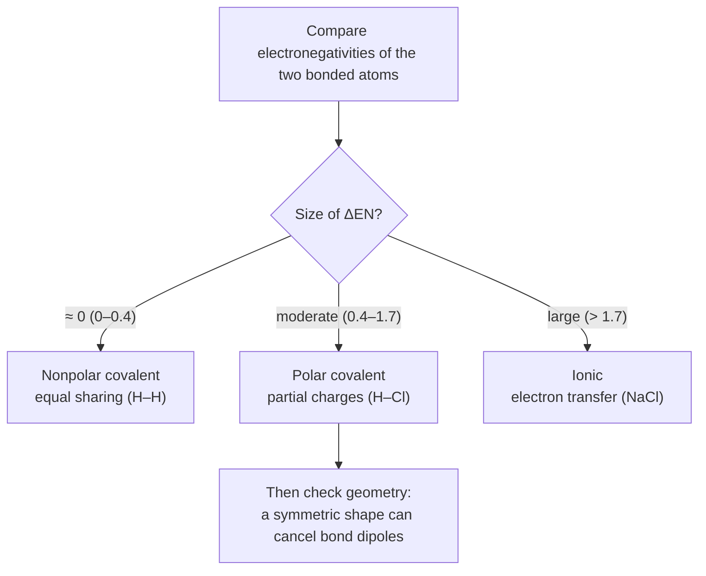

## GenChem::Molecular_Geometry

### LESSON-GENCHEM-MOLECULAR-GEOMETRY

- **KC:** `GenChem::Molecular_Geometry`
- **Title:** Molecular Geometry: VSEPR and Molecular Shape
- **Section:** `MCAT::Chem_Phys`
- **Source:** authored
- **Review Status:** needs_review
- **Overview:** Valence-shell electron-pair repulsion (VSEPR) theory predicts a
  molecule's three-dimensional shape by spreading electron domains as far apart as
  possible. Shape then sets bond angles and whether bond dipoles cancel. Because
  geometry drives polarity and intermolecular behavior, this mechanism bridges
  bonding to the physical properties of matter.
- **Key Concepts:**
  - Electron domains (bonds and lone pairs) arrange to minimize repulsion, setting
    the electron-domain geometry.
  - Lone pairs repel more strongly than bonding pairs, compressing bond angles.
  - Molecular shape names only the atom positions, which can differ from the
    electron-domain geometry when lone pairs are present.
  - Hybridization (sp, sp2, sp3) and sigma/pi bonding accompany the predicted
    geometry.
- **Prerequisite Reminder:** Build on `GenChem::Chemical_Bonding`: once you can
  draw a Lewis structure and count electron domains, VSEPR turns that into a 3-D
  shape.
- **Worked Example:** Water has two bonding pairs and two lone pairs on oxygen, so
  its electron-domain geometry is tetrahedral. The two lone pairs push the O-H
  bonds together, giving a bent molecular shape with an angle (~104.5 degrees)
  smaller than the ideal 109.5 degrees.
- **Common Misconception:** "The molecular shape always equals the electron-domain
  geometry." Lone pairs count when arranging domains but are invisible in the
  named molecular shape. Water is tetrahedral in its electron domains yet bent in
  molecular shape, precisely because the two lone pairs are not "seen" in the
  shape name.
- **First Retrieval Prompt:** From memory, explain why ammonia (three bonds, one
  lone pair) is trigonal pyramidal rather than trigonal planar.
- **Related KCs:** `GenChem::Chemical_Bonding`, `GenChem::Intermolecular_Forces`, `Orgo::Hybridization`
- **Diagram:** VSEPR shapes with bond angles: linear (CO2, 180 degrees), trigonal planar (BF3, 120), tetrahedral (CH4, 109.5), trigonal pyramidal (NH3, 107), and bent (H2O, 104.5), showing how lone pairs shrink angles

<figure class="lesson-diagram">
<svg xmlns="http://www.w3.org/2000/svg" viewBox="0 0 540 440" role="img" aria-labelledby="t d" font-family="-apple-system, Segoe UI, Roboto, sans-serif">
  <title id="t">Molecular geometry: VSEPR shapes and bond angles</title>
  <desc id="d">Five VSEPR shapes with representative bond angles: linear (CO2, 180 degrees), trigonal planar (BF3, 120 degrees), tetrahedral (CH4, 109.5 degrees), trigonal pyramidal (NH3, 107 degrees, one lone pair), and bent (H2O, 104.5 degrees, two lone pairs). Lone pairs push bonding pairs closer, shrinking the angle.</desc>
  <rect x="6" y="6" width="528" height="428" rx="14" fill="#ffffff" stroke="#cfd8dc" stroke-width="2"/>
  <text x="270" y="32" text-anchor="middle" font-size="17" font-weight="700" fill="#263238">Molecular geometry &#8212; VSEPR shapes</text>

  <!-- linear -->
  <g stroke="#607d8b" stroke-width="3">
    <line x1="110" y1="120" x2="190" y2="120"/>
  </g>
  <circle cx="150" cy="120" r="12" fill="#1565c0"/>
  <circle cx="110" cy="120" r="9" fill="#c62828"/>
  <circle cx="190" cy="120" r="9" fill="#c62828"/>
  <text x="150" y="160" text-anchor="middle" font-size="12" font-weight="600" fill="#263238">linear</text>
  <text x="150" y="178" text-anchor="middle" font-size="11" fill="#607d8b">CO2 &#183; 180&#176;</text>

  <!-- trigonal planar -->
  <g stroke="#607d8b" stroke-width="3">
    <line x1="290" y1="118" x2="290" y2="82"/>
    <line x1="290" y1="118" x2="262" y2="140"/>
    <line x1="290" y1="118" x2="318" y2="140"/>
  </g>
  <circle cx="290" cy="118" r="12" fill="#1565c0"/>
  <circle cx="290" cy="82" r="8" fill="#2e7d32"/>
  <circle cx="262" cy="140" r="8" fill="#2e7d32"/>
  <circle cx="318" cy="140" r="8" fill="#2e7d32"/>
  <text x="290" y="160" text-anchor="middle" font-size="12" font-weight="600" fill="#263238">trigonal planar</text>
  <text x="290" y="178" text-anchor="middle" font-size="11" fill="#607d8b">BF3 &#183; 120&#176;</text>

  <!-- tetrahedral -->
  <g stroke="#607d8b" stroke-width="3">
    <line x1="430" y1="118" x2="430" y2="82"/>
    <line x1="430" y1="118" x2="400" y2="140"/>
    <line x1="430" y1="118" x2="460" y2="140"/>
    <line x1="430" y1="118" x2="430" y2="150"/>
  </g>
  <circle cx="430" cy="118" r="12" fill="#1565c0"/>
  <circle cx="430" cy="82" r="8" fill="#90a4ae"/>
  <circle cx="400" cy="140" r="8" fill="#90a4ae"/>
  <circle cx="460" cy="140" r="8" fill="#90a4ae"/>
  <circle cx="430" cy="150" r="8" fill="#90a4ae"/>
  <text x="430" y="176" text-anchor="middle" font-size="12" font-weight="600" fill="#263238">tetrahedral</text>
  <text x="430" y="194" text-anchor="middle" font-size="11" fill="#607d8b">CH4 &#183; 109.5&#176;</text>

  <!-- trigonal pyramidal -->
  <g stroke="#607d8b" stroke-width="3">
    <line x1="180" y1="290" x2="150" y2="312"/>
    <line x1="180" y1="290" x2="210" y2="312"/>
    <line x1="180" y1="290" x2="180" y2="322"/>
  </g>
  <ellipse cx="180" cy="262" rx="16" ry="11" fill="#eceff1" stroke="#ef6c00" stroke-dasharray="3 2"/>
  <text x="180" y="266" text-anchor="middle" font-size="9" fill="#ef6c00">lone</text>
  <circle cx="180" cy="290" r="12" fill="#1565c0"/>
  <circle cx="150" cy="312" r="8" fill="#90a4ae"/>
  <circle cx="210" cy="312" r="8" fill="#90a4ae"/>
  <circle cx="180" cy="322" r="8" fill="#90a4ae"/>
  <text x="180" y="352" text-anchor="middle" font-size="12" font-weight="600" fill="#263238">trigonal pyramidal</text>
  <text x="180" y="370" text-anchor="middle" font-size="11" fill="#607d8b">NH3 &#183; 107&#176;</text>

  <!-- bent -->
  <g stroke="#607d8b" stroke-width="3">
    <line x1="360" y1="300" x2="330" y2="322"/>
    <line x1="360" y1="300" x2="390" y2="322"/>
  </g>
  <ellipse cx="342" cy="278" rx="13" ry="9" fill="#eceff1" stroke="#ef6c00" stroke-dasharray="3 2"/>
  <ellipse cx="378" cy="278" rx="13" ry="9" fill="#eceff1" stroke="#ef6c00" stroke-dasharray="3 2"/>
  <circle cx="360" cy="300" r="12" fill="#c62828"/>
  <circle cx="330" cy="322" r="8" fill="#90a4ae"/>
  <circle cx="390" cy="322" r="8" fill="#90a4ae"/>
  <text x="360" y="352" text-anchor="middle" font-size="12" font-weight="600" fill="#263238">bent</text>
  <text x="360" y="370" text-anchor="middle" font-size="11" fill="#607d8b">H2O &#183; 104.5&#176;</text>

  <text x="270" y="412" text-anchor="middle" font-size="11" fill="#607d8b">lone pairs repel more strongly, so each one squeezes the bond angle smaller</text>
</svg>
</figure>

## GenChem::Stoichiometry

### LESSON-GENCHEM-STOICHIOMETRY

- **KC:** `GenChem::Stoichiometry`
- **Title:** Stoichiometry: Moles, Ratios, and Limiting Reagents
- **Section:** `MCAT::Chem_Phys`
- **Source:** authored
- **Review Status:** needs_review
- **Overview:** Stoichiometry is the quantitative bookkeeping of chemical
  reactions. The mole connects a substance's mass to a count of particles, and a
  balanced equation gives the mole ratios that relate reactants to products.
  Limiting-reagent and percent-yield reasoning then predict how much product a
  real reaction can make.
- **Key Concepts:**
  - The mole links mass and particle count through molar mass (g/mol) and
    Avogadro's number.
  - A balanced equation supplies the mole ratios used to convert between any two
    species.
  - The limiting reagent runs out first and caps the product; the other reactant
    is in excess.
  - Percent yield = (actual / theoretical) x 100 compares real output to the
    stoichiometric maximum.
- **Prerequisite Reminder:** Build on `GenChem::Chemical_Bonding`: chemical
  formulas — which come from how atoms bond — give the molar masses and ratios
  stoichiometry depends on.
- **Worked Example:** For N2 + 3 H2 -> 2 NH3, suppose you have 1 mol N2 and 6 mol
  H2. Nitrogen needs 3 mol H2 per mol N2, so 1 mol N2 consumes only 3 mol H2.
  Hydrogen is in excess and N2 is limiting, giving 2 mol NH3 with 3 mol H2 left
  over.
- **Common Misconception:** "You can use the mass ratio from the equation
  directly." Balanced-equation coefficients are mole ratios, not mass ratios. You
  must convert masses to moles first; using grams directly ignores that different
  substances have different molar masses.
- **First Retrieval Prompt:** Without notes, outline the steps to find the limiting
  reagent when you are given the starting masses of two reactants.
- **Related KCs:** `GenChem::Chemical_Bonding`, `GenChem::Reaction_Types`, `GenChem::Gas_Phase`, `GenChem::Thermochemistry`, `GenChem::Kinetics`
- **Diagram:** Mole map — the balanced equation's mole ratio bridges any two species:

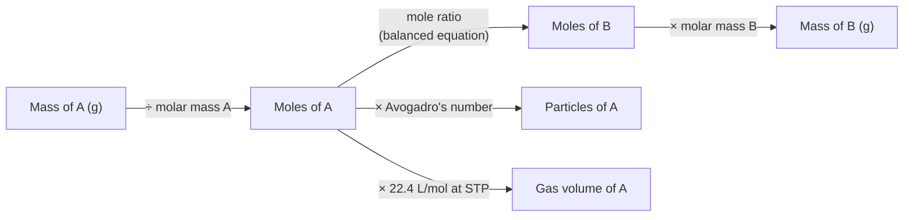

## GenChem::Reaction_Types

### LESSON-GENCHEM-REACTION-TYPES

- **KC:** `GenChem::Reaction_Types`
- **Title:** Reaction Types: Classifying and Net Ionic Equations
- **Section:** `MCAT::Chem_Phys`
- **Source:** authored
- **Review Status:** needs_review
- **Overview:** Recognizing reaction categories lets you predict products without
  memorizing every reaction. Common types include synthesis, decomposition, single
  and double displacement, combustion, neutralization, and precipitation. Net
  ionic equations strip a reaction down to the species that actually change.
- **Key Concepts:**
  - Core categories: synthesis, decomposition, single displacement, double
    displacement, and combustion.
  - Precipitation and neutralization are common double-displacement reactions;
    solubility rules predict precipitates.
  - Spectator ions appear unchanged on both sides and are omitted from the net
    ionic equation.
  - The net ionic equation shows only the ions and molecules that form the new
    product.
- **Prerequisite Reminder:** Build on `GenChem::Stoichiometry`: you still balance
  mass and charge, now while sorting reactions into predictable patterns.
- **Worked Example:** Mixing aqueous AgNO3 and NaCl gives an AgCl precipitate. The
  full ionic equation is Ag+ + NO3- + Na+ + Cl- -> AgCl(s) + Na+ + NO3-. Cancel
  the spectators (Na+, NO3-) to get the net ionic equation Ag+ + Cl- -> AgCl(s).
- **Common Misconception:** "Every ion in the beaker belongs in the net ionic
  equation." Spectator ions do not participate in the actual change and must be
  canceled. Leaving Na+ and NO3- in hides the real reaction, which is just silver
  and chloride ions forming a solid.
- **First Retrieval Prompt:** From memory, define a spectator ion and explain how
  you decide which ions to remove when writing a net ionic equation.
- **Related KCs:** `GenChem::Stoichiometry`, `GenChem::Redox_Reactions`
- **Diagram:** Classifying a reaction by what happens to the reactants and products:

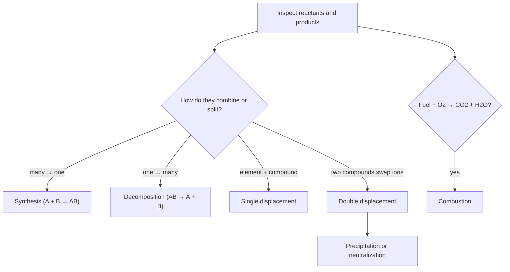

## GenChem::Redox_Reactions

### LESSON-GENCHEM-REDOX-REACTIONS

- **KC:** `GenChem::Redox_Reactions`
- **Title:** Redox Reactions: Oxidation States and Half-Reactions
- **Section:** `MCAT::Chem_Phys`
- **Source:** authored
- **Review Status:** needs_review
- **Overview:** Oxidation-reduction (redox) reactions transfer electrons between
  species. Assigning oxidation states shows which atoms lose electrons (oxidized)
  and which gain them (reduced). Splitting the reaction into balanced
  half-reactions keeps both mass and charge accounted for.
- **Key Concepts:**
  - Oxidation is loss of electrons (oxidation state rises); reduction is gain
    (oxidation state falls) — "OIL RIG".
  - The oxidizing agent is itself reduced; the reducing agent is itself oxidized.
  - Oxidation-state rules (O usually -2, H usually +1) let you track electron
    flow.
  - Half-reactions are balanced separately for atoms and charge, then combined so
    electrons cancel.
- **Prerequisite Reminder:** Build on `GenChem::Reaction_Types`: redox is a
  reaction pattern where the "change" you track is electron transfer rather than
  ion swapping.
- **Worked Example:** In Zn + Cu2+ -> Zn2+ + Cu, zinc goes from 0 to +2 (loses 2
  electrons, oxidized) and copper goes from +2 to 0 (gains 2 electrons, reduced).
  Zinc is the reducing agent; the Cu2+ ion is the oxidizing agent. The two
  electrons lost by Zn are exactly the two gained by Cu2+.
- **Common Misconception:** "The oxidizing agent is the thing that gets oxidized."
  It is the opposite: the oxidizing agent causes oxidation in something else and is
  itself reduced. Sign and role errors like this are the most common redox
  mistakes, so always confirm by tracking the electron count.
- **First Retrieval Prompt:** Without notes, explain how to identify the oxidizing
  agent in a reaction and why it is the species that gets reduced.
- **Related KCs:** `GenChem::Reaction_Types`, `GenChem::Electrochemistry`
- **Diagram:** Tracking electrons — oxidation-state changes identify the agents:

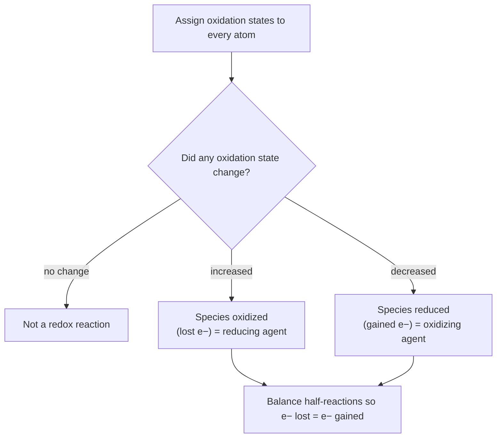

## GenChem::Gas_Phase

### LESSON-GENCHEM-GAS-PHASE

- **KC:** `GenChem::Gas_Phase`
- **Title:** Gas Phase: Ideal Gas Law and Partial Pressures
- **Section:** `MCAT::Chem_Phys`
- **Source:** authored
- **Review Status:** needs_review
- **Overview:** Gases are modeled as many tiny, fast, widely spaced particles whose
  average kinetic energy depends only on temperature. The ideal gas law PV = nRT
  ties pressure, volume, moles, and temperature together, and Dalton's law adds up
  the partial pressures in a mixture. This model underlies both lab gas
  calculations and respiratory physiology.
- **Key Concepts:**
  - PV = nRT relates pressure, volume, moles, and absolute temperature;
    temperature must be in kelvin.
  - Kinetic molecular theory: gas particles are in constant random motion with
    average kinetic energy set by T.
  - Dalton's law: total pressure is the sum of partial pressures; each gas's
    partial pressure is its mole fraction times the total.
  - Real gases deviate from ideal behavior at high pressure and low temperature.
- **Prerequisite Reminder:** Build on `GenChem::Stoichiometry` and
  `Physics::Thermodynamics`: gas calculations still rest on mole reasoning, now
  linked to pressure, volume, and temperature.
- **Worked Example:** A 2.0 L container holds 0.50 mol of gas at 300 K. Using
  PV = nRT with R = 0.0821 L*atm/(mol*K): P = nRT/V =
  (0.50)(0.0821)(300)/2.0 ~ 6.2 atm. Had you used 27 degrees C instead of 300 K,
  the answer would be badly wrong.
- **Common Misconception:** "You can plug Celsius temperatures into the gas laws."
  Gas-law temperature must be absolute (kelvin), because pressure and volume scale
  with kelvin, not Celsius. Using degrees C — or forgetting to convert — is the
  single most common gas-law error.
- **First Retrieval Prompt:** From memory, state the ideal gas law and explain why
  temperature has to be in kelvin before you use it.
- **Related KCs:** `GenChem::Stoichiometry`, `Physics::Thermodynamics`, `GenChem::Phases_and_Phase_Changes`, `Bio::Respiratory_System`, `Physics::Gas_Exchange_And_Respiration_Physics`
- **Diagram:** Two gas-law plots: Boyle's law (pressure vs volume traces a hyperbola at fixed T) and Charles's law (volume vs temperature is a straight line extrapolating to zero at 0 K)

<figure class="lesson-diagram">
<svg xmlns="http://www.w3.org/2000/svg" viewBox="0 0 540 440" role="img" aria-labelledby="t d" font-family="-apple-system, Segoe UI, Roboto, sans-serif">
  <title id="t">Gas phase: pressure-volume and volume-temperature relationships</title>
  <desc id="d">Left: Boyle's law at fixed temperature, pressure versus volume traces a hyperbola because P times V is constant. Right: Charles's law at fixed pressure, volume is directly proportional to absolute temperature, a straight line that extrapolates to zero volume at zero kelvin.</desc>
  <rect x="6" y="6" width="528" height="428" rx="14" fill="#ffffff" stroke="#cfd8dc" stroke-width="2"/>
  <text x="270" y="30" text-anchor="middle" font-size="17" font-weight="700" fill="#263238">Gas phase &#8212; PV = nRT relationships</text>

  <!-- Boyle panel -->
  <line x1="70" y1="90" x2="70" y2="250" stroke="#37474f" stroke-width="2"/>
  <line x1="70" y1="250" x2="250" y2="250" stroke="#37474f" stroke-width="2"/>
  <text x="46" y="170" font-size="12" fill="#37474f" transform="rotate(-90 46 170)">Pressure</text>
  <text x="160" y="272" text-anchor="middle" font-size="12" fill="#37474f">Volume</text>
  <path d="M80,110 C100,150 112,175 122,185 C155,215 190,230 245,238" fill="none" stroke="#1565c0" stroke-width="2.5"/>
  <text x="160" y="106" text-anchor="middle" font-size="12" font-weight="600" fill="#1565c0">Boyle: P &#215; V = constant</text>
  <text x="160" y="300" text-anchor="middle" font-size="11" fill="#607d8b">T fixed &#183; P rises as V falls</text>

  <!-- Charles panel -->
  <line x1="310" y1="90" x2="310" y2="250" stroke="#37474f" stroke-width="2"/>
  <line x1="310" y1="250" x2="500" y2="250" stroke="#37474f" stroke-width="2"/>
  <text x="286" y="170" font-size="12" fill="#37474f" transform="rotate(-90 286 170)">Volume</text>
  <text x="405" y="272" text-anchor="middle" font-size="12" fill="#37474f">Temperature (K)</text>
  <line x1="360" y1="220" x2="495" y2="110" stroke="#2e7d32" stroke-width="2.5"/>
  <line x1="310" y1="250" x2="360" y2="220" stroke="#2e7d32" stroke-width="2" stroke-dasharray="5 4"/>
  <circle cx="310" cy="250" r="3" fill="#c62828"/>
  <text x="316" y="264" font-size="10" fill="#c62828">0 K, V=0</text>
  <text x="405" y="106" text-anchor="middle" font-size="12" font-weight="600" fill="#2e7d32">Charles: V proportional to T</text>
  <text x="405" y="300" text-anchor="middle" font-size="11" fill="#607d8b">P fixed &#183; extrapolates to 0 at 0 K</text>

  <text x="270" y="358" text-anchor="middle" font-size="13" font-weight="600" fill="#263238">PV = nRT</text>
  <text x="270" y="384" text-anchor="middle" font-size="11" fill="#607d8b">temperature must be in kelvin &#183; particles fast, tiny, and far apart</text>
  <text x="270" y="406" text-anchor="middle" font-size="11" fill="#607d8b">real gases deviate at high pressure and low temperature</text>
</svg>
</figure>

## GenChem::Intermolecular_Forces

### LESSON-GENCHEM-INTERMOLECULAR-FORCES

- **KC:** `GenChem::Intermolecular_Forces`
- **Title:** Intermolecular Forces: From Dispersion to Hydrogen Bonding
- **Section:** `MCAT::Chem_Phys`
- **Source:** authored
- **Review Status:** needs_review
- **Overview:** Intermolecular forces (IMFs) are the attractions between molecules,
  distinct from the covalent bonds within them. Their strength — London dispersion
  < dipole-dipole < hydrogen bonding < ion-dipole — sets boiling point, viscosity,
  and solubility. IMFs explain why water behaves so differently from
  similarly sized nonpolar molecules.
- **Key Concepts:**
  - London dispersion forces exist in all molecules and grow with size and
    polarizability.
  - Dipole-dipole forces act between polar molecules; hydrogen bonding is an
    especially strong case with H bonded to N, O, or F.
  - Stronger IMFs raise boiling point, melting point, viscosity, and surface
    tension.
  - "Like dissolves like": similar IMFs between solute and solvent favor
    solubility.
- **Prerequisite Reminder:** Build on `GenChem::Molecular_Geometry`: a molecule's
  shape and dipole, which you predicted with VSEPR, determine which intermolecular
  forces it can have.
- **Worked Example:** Compare water (H2O, ~18 g/mol) and methane (CH4, ~16 g/mol).
  Despite similar masses, water boils at 100 degrees C while methane boils near
  -161 degrees C, because water forms hydrogen bonds (O-H...O) while methane has
  only weak dispersion forces. Stronger IMFs take more energy to overcome.
- **Common Misconception:** "Hydrogen bonds are a type of covalent bond." A
  hydrogen bond is an intermolecular attraction between an H already covalently
  bonded to N/O/F and a lone pair on a nearby electronegative atom — far weaker
  than the covalent bond, and formed between (or within) molecules rather than by
  sharing an electron pair.
- **First Retrieval Prompt:** Without notes, rank London dispersion, dipole-dipole,
  and hydrogen bonding by strength and predict which gives the higher boiling point
  for two similar-mass molecules.
- **Related KCs:** `GenChem::Molecular_Geometry`, `GenChem::Phases_and_Phase_Changes`, `GenChem::Solutions_and_Solubility`, `Biochem::Protein_Structure_and_Function`, `Biochem::Protein_Folding_and_Stability`, `Biochem::Chromatography_and_Separations`, `Orgo::Separations_and_Purifications`
- **Diagram:** Hydrogen-bond schematic between two water molecules (partial charges labeled) beside a strength ladder ranking London dispersion, dipole-dipole, hydrogen bonding, and ion-dipole

<figure class="lesson-diagram">
<svg xmlns="http://www.w3.org/2000/svg" viewBox="0 0 540 440" role="img" aria-labelledby="t d" font-family="-apple-system, Segoe UI, Roboto, sans-serif">
  <title id="t">Intermolecular forces: hydrogen bonding and a strength ladder</title>
  <desc id="d">Left: two water molecules; a hydrogen bond (dashed) links a partially positive hydrogen of one molecule to a lone pair on the partially negative oxygen of the other. Right: relative strengths, from weakest to strongest, London dispersion, dipole-dipole, hydrogen bonding, and ion-dipole. Stronger forces raise boiling point.</desc>
  <rect x="6" y="6" width="528" height="428" rx="14" fill="#ffffff" stroke="#cfd8dc" stroke-width="2"/>
  <text x="270" y="30" text-anchor="middle" font-size="17" font-weight="700" fill="#263238">Intermolecular forces</text>

  <text x="125" y="70" text-anchor="middle" font-size="12" font-weight="600" fill="#263238">Hydrogen bond in water</text>
  <!-- water molecule 1 -->
  <line x1="130" y1="120" x2="104" y2="142" stroke="#607d8b" stroke-width="3"/>
  <line x1="130" y1="120" x2="156" y2="142" stroke="#607d8b" stroke-width="3"/>
  <circle cx="130" cy="120" r="14" fill="#c62828"/>
  <text x="130" y="124" text-anchor="middle" font-size="11" fill="#fff">O</text>
  <circle cx="104" cy="142" r="9" fill="#90a4ae"/>
  <circle cx="156" cy="142" r="9" fill="#90a4ae"/>
  <text x="110" y="110" font-size="10" fill="#1565c0">&#948;&#8722;</text>
  <text x="168" y="150" font-size="10" fill="#c62828">&#948;+</text>

  <!-- water molecule 2 -->
  <line x1="150" y1="235" x2="124" y2="213" stroke="#607d8b" stroke-width="3"/>
  <line x1="150" y1="235" x2="176" y2="257" stroke="#607d8b" stroke-width="3"/>
  <circle cx="150" cy="235" r="14" fill="#c62828"/>
  <text x="150" y="239" text-anchor="middle" font-size="11" fill="#fff">O</text>
  <circle cx="124" cy="213" r="9" fill="#90a4ae"/>
  <circle cx="176" cy="257" r="9" fill="#90a4ae"/>
  <text x="158" y="228" font-size="10" fill="#1565c0">&#948;&#8722;</text>

  <!-- hydrogen bond -->
  <line x1="156" y1="150" x2="150" y2="221" stroke="#1565c0" stroke-width="2.5" stroke-dasharray="5 4"/>
  <text x="196" y="190" font-size="11" fill="#1565c0">hydrogen bond</text>

  <!-- strength ladder -->
  <text x="380" y="70" text-anchor="middle" font-size="12" font-weight="600" fill="#263238">Relative strength</text>
  <text x="250" y="118" font-size="11" fill="#37474f">London dispersion</text>
  <rect x="250" y="122" width="50" height="16" fill="#2e7d32"/>
  <text x="250" y="164" font-size="11" fill="#37474f">dipole-dipole</text>
  <rect x="250" y="168" width="95" height="16" fill="#1565c0"/>
  <text x="250" y="210" font-size="11" fill="#37474f">hydrogen bonding</text>
  <rect x="250" y="214" width="145" height="16" fill="#ef6c00"/>
  <text x="250" y="256" font-size="11" fill="#37474f">ion-dipole</text>
  <rect x="250" y="260" width="190" height="16" fill="#c62828"/>
  <line x1="250" y1="298" x2="450" y2="298" stroke="#37474f" stroke-width="2"/>
  <polygon points="450,293 450,303 460,298" fill="#37474f"/>
  <text x="350" y="316" text-anchor="middle" font-size="11" fill="#607d8b">stronger &#8594;</text>

  <text x="270" y="360" text-anchor="middle" font-size="12" font-weight="600" fill="#37474f">Stronger IMFs &#8594; higher boiling point, viscosity, surface tension</text>
  <text x="270" y="384" text-anchor="middle" font-size="11" fill="#607d8b">H-bonds need H bonded to N, O, or F &#183; they are between molecules, not covalent</text>
  <text x="270" y="406" text-anchor="middle" font-size="11" fill="#607d8b">water (H-bonds) boils far higher than methane (dispersion only) at similar mass</text>
</svg>
</figure>

## GenChem::Phases_and_Phase_Changes

### LESSON-GENCHEM-PHASES-AND-PHASE-CHANGES

- **KC:** `GenChem::Phases_and_Phase_Changes`
- **Title:** Phases and Phase Changes: Diagrams and Heating Curves
- **Section:** `MCAT::Chem_Phys`
- **Source:** authored
- **Review Status:** needs_review
- **Overview:** Matter shifts between solid, liquid, and gas as temperature and
  pressure change. Phase diagrams map which phase is stable under given
  conditions, and heating curves track temperature versus added heat. A key
  feature is that temperature stays constant during a phase change while heat is
  used to rearrange the particles.
- **Key Concepts:**
  - Phase diagrams show solid/liquid/gas regions plus the triple point and
    critical point.
  - Heating curves have sloped segments (temperature rising within a phase) and
    flat plateaus (phase change at constant temperature).
  - Heat of fusion and heat of vaporization are the energy needed for melting and
    boiling.
  - Vapor pressure rises with temperature; boiling occurs when vapor pressure
    equals the external pressure.
- **Prerequisite Reminder:** Build on `GenChem::Gas_Phase` and
  `GenChem::Intermolecular_Forces`: the strength of intermolecular forces sets how
  much energy each phase change costs.
- **Worked Example:** Heat ice at -10 degrees C. First the temperature climbs to 0
  degrees C (sloped). At 0 degrees C it plateaus: added heat melts ice to water
  with no temperature change until all ice is gone. Only then does the liquid warm
  toward 100 degrees C, where a second plateau (boiling) appears.
- **Common Misconception:** "Temperature keeps rising while a substance melts or
  boils." During a phase change the added heat breaks intermolecular attractions
  rather than increasing kinetic energy, so the temperature holds constant on the
  plateau until the transition finishes.
- **First Retrieval Prompt:** From memory, sketch a heating curve for
  ice-to-steam and explain what is happening to the molecules during each flat
  segment.
- **Related KCs:** `GenChem::Gas_Phase`, `GenChem::Intermolecular_Forces`, `GenChem::Colligative_Properties`
- **Diagram:** Pressure-temperature phase diagram with solid, liquid, and gas regions meeting at the triple point, a liquid-gas line ending at the critical point, and a sublimation line

<figure class="lesson-diagram">
<svg xmlns="http://www.w3.org/2000/svg" viewBox="0 0 540 440" role="img" aria-labelledby="t d" font-family="-apple-system, Segoe UI, Roboto, sans-serif">
  <title id="t">Phase diagram: pressure versus temperature</title>
  <desc id="d">A pressure-versus-temperature phase diagram for a typical substance. Boundary lines meet at the triple point, where solid, liquid, and gas coexist. The solid-liquid line rises steeply, the liquid-gas line ends at the critical point, and the solid-gas sublimation line runs below the triple point. Regions are labeled solid, liquid, and gas.</desc>
  <rect x="6" y="6" width="528" height="428" rx="14" fill="#ffffff" stroke="#cfd8dc" stroke-width="2"/>
  <text x="270" y="32" text-anchor="middle" font-size="17" font-weight="700" fill="#263238">Phase diagram (P vs T)</text>

  <line x1="80" y1="70" x2="80" y2="360" stroke="#37474f" stroke-width="2"/>
  <line x1="80" y1="360" x2="500" y2="360" stroke="#37474f" stroke-width="2"/>
  <text x="46" y="220" font-size="12" fill="#37474f" transform="rotate(-90 46 220)">Pressure</text>
  <text x="290" y="392" text-anchor="middle" font-size="12" fill="#37474f">Temperature</text>

  <!-- boundaries from triple point -->
  <line x1="185" y1="255" x2="225" y2="95" stroke="#455a64" stroke-width="2.5"/>
  <path d="M185,255 Q305,190 405,150" fill="none" stroke="#455a64" stroke-width="2.5"/>
  <line x1="185" y1="255" x2="92" y2="330" stroke="#455a64" stroke-width="2.5"/>

  <!-- points -->
  <circle cx="185" cy="255" r="4" fill="#c62828"/>
  <text x="150" y="278" font-size="11" fill="#c62828">triple point</text>
  <circle cx="405" cy="150" r="4" fill="#1565c0"/>
  <text x="405" y="140" text-anchor="middle" font-size="11" fill="#1565c0">critical point</text>

  <!-- region labels -->
  <text x="122" y="150" text-anchor="middle" font-size="13" font-weight="700" fill="#37474f">SOLID</text>
  <text x="290" y="120" text-anchor="middle" font-size="13" font-weight="700" fill="#37474f">LIQUID</text>
  <text x="400" y="320" text-anchor="middle" font-size="13" font-weight="700" fill="#37474f">GAS</text>

  <text x="270" y="416" text-anchor="middle" font-size="11" fill="#607d8b">heating at constant pressure = a horizontal path crossing the boundary lines</text>
</svg>
</figure>
- **Diagram:** Heating curve of temperature vs heat added: sloped segments warm a single phase while flat plateaus at melting and boiling hold temperature constant as intermolecular forces break

<figure class="lesson-diagram">
<svg xmlns="http://www.w3.org/2000/svg" viewBox="0 0 540 440" role="img" aria-labelledby="t d" font-family="-apple-system, Segoe UI, Roboto, sans-serif">
  <title id="t">Heating curve: temperature versus heat added</title>
  <desc id="d">Temperature versus heat added for a substance going from solid to gas. Sloped segments show a single phase warming; flat plateaus mark phase changes (melting and boiling) where added heat breaks intermolecular attractions at constant temperature. The vaporization plateau is longer than the fusion plateau.</desc>
  <rect x="6" y="6" width="528" height="428" rx="14" fill="#ffffff" stroke="#cfd8dc" stroke-width="2"/>
  <text x="270" y="32" text-anchor="middle" font-size="17" font-weight="700" fill="#263238">Heating curve &#8212; solid to gas</text>

  <line x1="70" y1="70" x2="70" y2="350" stroke="#37474f" stroke-width="2"/>
  <line x1="70" y1="350" x2="500" y2="350" stroke="#37474f" stroke-width="2"/>
  <text x="44" y="210" font-size="12" fill="#37474f" transform="rotate(-90 44 210)">Temperature</text>
  <text x="285" y="384" text-anchor="middle" font-size="12" fill="#37474f">Heat added &#8594;</text>

  <line x1="70" y1="250" x2="500" y2="250" stroke="#cfd8dc" stroke-width="1" stroke-dasharray="4 4"/>
  <line x1="70" y1="150" x2="500" y2="150" stroke="#cfd8dc" stroke-width="1" stroke-dasharray="4 4"/>
  <text x="60" y="254" text-anchor="end" font-size="10" fill="#607d8b">mp</text>
  <text x="60" y="154" text-anchor="end" font-size="10" fill="#607d8b">bp</text>

  <polyline points="80,320 150,250 230,250 300,150 430,150 490,110" fill="none" stroke="#1565c0" stroke-width="2.5"/>
  <!-- plateaus highlighted -->
  <line x1="150" y1="250" x2="230" y2="250" stroke="#c62828" stroke-width="4"/>
  <line x1="300" y1="150" x2="430" y2="150" stroke="#c62828" stroke-width="4"/>

  <text x="112" y="300" font-size="10" fill="#607d8b">solid</text>
  <text x="190" y="242" text-anchor="middle" font-size="10" fill="#c62828">melting</text>
  <text x="262" y="205" font-size="10" fill="#607d8b">liquid</text>
  <text x="365" y="142" text-anchor="middle" font-size="10" fill="#c62828">boiling</text>
  <text x="470" y="130" font-size="10" fill="#607d8b">gas</text>

  <text x="270" y="410" text-anchor="middle" font-size="11" fill="#607d8b">on a plateau, heat breaks intermolecular forces and temperature stays constant</text>
</svg>
</figure>

## GenChem::Solutions_and_Solubility

### LESSON-GENCHEM-SOLUTIONS-AND-SOLUBILITY

- **KC:** `GenChem::Solutions_and_Solubility`
- **Title:** Solutions and Solubility: Concentration and "Like Dissolves Like"
- **Section:** `MCAT::Chem_Phys`
- **Source:** authored
- **Review Status:** needs_review
- **Overview:** A solution is a homogeneous mixture of a solute dissolved in a
  solvent. Whether something dissolves depends on matching intermolecular forces —
  polar dissolves polar, nonpolar dissolves nonpolar. Concentration units
  (especially molarity and molality) quantify how much solute is present and are
  the basis for dilution and later equilibrium work.
- **Key Concepts:**
  - "Like dissolves like": polar and ionic solutes dissolve in polar solvents;
    nonpolar in nonpolar.
  - Molarity (mol solute / L solution) is temperature-dependent; molality (mol
    solute / kg solvent) is not.
  - Dilution follows M1V1 = M2V2.
  - Gas solubility decreases with temperature and increases with partial pressure
    (Henry's law, qualitatively).
- **Prerequisite Reminder:** Build on `GenChem::Intermolecular_Forces`: the same
  forces that set boiling points decide whether a solute and solvent mix.
- **Worked Example:** To dilute 50.0 mL of 2.0 M NaCl to 0.50 M, use
  M1V1 = M2V2: V2 = (2.0)(50.0)/0.50 = 200 mL. So you add water until the total
  volume is 200 mL — that is 150 mL of water added to the original 50 mL.
- **Common Misconception:** "Molarity and molality are interchangeable." They use
  different denominators — liters of solution versus kilograms of solvent — and
  match only in dilute aqueous solutions near room temperature. Molarity changes
  with temperature (volume expands); molality does not, which is why
  colligative-property formulas use molality.
- **First Retrieval Prompt:** Without notes, explain the difference between molarity
  and molality and why one changes with temperature while the other does not.
- **Related KCs:** `GenChem::Intermolecular_Forces`, `GenChem::Ions_in_Solutions`, `GenChem::Spectrophotometry`, `GenChem::Colligative_Properties`, `Orgo::Separations_and_Purifications`
- **Diagram:** Solubility-versus-temperature curves: most solids like KNO3 rise steeply, NaCl stays nearly flat, and gases such as CO2 become less soluble as temperature increases

<figure class="lesson-diagram">
<svg xmlns="http://www.w3.org/2000/svg" viewBox="0 0 540 440" role="img" aria-labelledby="t d" font-family="-apple-system, Segoe UI, Roboto, sans-serif">
  <title id="t">Solubility curves: solubility versus temperature</title>
  <desc id="d">Solubility in grams per 100 grams of water versus temperature. Most solids such as potassium nitrate become much more soluble as temperature rises, sodium chloride is nearly flat, and gases become less soluble as temperature rises.</desc>
  <rect x="6" y="6" width="528" height="428" rx="14" fill="#ffffff" stroke="#cfd8dc" stroke-width="2"/>
  <text x="270" y="32" text-anchor="middle" font-size="17" font-weight="700" fill="#263238">Solubility curves</text>

  <line x1="80" y1="70" x2="80" y2="350" stroke="#37474f" stroke-width="2"/>
  <line x1="80" y1="350" x2="500" y2="350" stroke="#37474f" stroke-width="2"/>
  <text x="46" y="230" font-size="12" fill="#37474f" transform="rotate(-90 46 230)">Solubility (g / 100 g water)</text>
  <text x="290" y="384" text-anchor="middle" font-size="12" fill="#37474f">Temperature (&#176;C)</text>
  <g font-size="10" fill="#607d8b">
    <text x="80" y="366" text-anchor="middle">0</text>
    <text x="290" y="366" text-anchor="middle">50</text>
    <text x="480" y="366" text-anchor="middle">100</text>
  </g>

  <polyline points="80,317 160,283 240,226 320,151 400,100" fill="none" stroke="#c62828" stroke-width="2.5"/>
  <text x="404" y="98" font-size="11" fill="#c62828">KNO3 (solid)</text>

  <polyline points="80,278 160,277 240,275 320,273 400,271" fill="none" stroke="#1565c0" stroke-width="2.5"/>
  <text x="404" y="272" font-size="11" fill="#1565c0">NaCl (solid)</text>

  <polyline points="80,180 160,215 240,250 320,285 400,315" fill="none" stroke="#2e7d32" stroke-width="2.5"/>
  <text x="404" y="320" font-size="11" fill="#2e7d32">gas (e.g. CO2)</text>

  <text x="270" y="410" text-anchor="middle" font-size="11" fill="#607d8b">most solids: solubility rises with T &#183; gases: solubility falls with T (Henry's law)</text>
</svg>
</figure>

## GenChem::Ions_in_Solutions

### LESSON-GENCHEM-IONS-IN-SOLUTIONS

- **KC:** `GenChem::Ions_in_Solutions`
- **Title:** Ions in Solutions: Electrolytes and Dissociation
- **Section:** `MCAT::Chem_Phys`
- **Source:** authored
- **Review Status:** needs_review
- **Overview:** When ionic compounds and some polar molecules dissolve, they
  dissociate into mobile ions that carry charge. Strong electrolytes dissociate
  completely, weak electrolytes only partially, and nonelectrolytes not at all.
  The resulting ions conduct electricity and drive processes from nerve signaling
  to precipitation.
- **Key Concepts:**
  - Strong electrolytes (NaCl, strong acids/bases) fully dissociate; weak
    electrolytes partially; nonelectrolytes (glucose) stay intact.
  - Dissolved ions are surrounded by solvent (hydration) and make the solution
    conductive.
  - Solution conductivity scales with the concentration of free ions.
  - Not every ionic compound dissolves well; solubility rules flag the insoluble
    ones.
- **Prerequisite Reminder:** Build on `GenChem::Solutions_and_Solubility`:
  dissolving is the first step; here you track what the dissolved ionic solute
  actually becomes in water.
- **Worked Example:** Dissolving 1 mol of NaCl gives 1 mol Na+ and 1 mol Cl-, so
  it conducts strongly. Dissolving 1 mol of glucose gives intact glucose molecules
  and no ions, so that solution barely conducts at the same concentration — the
  difference is dissociation, not amount dissolved.
- **Common Misconception:** "All ionic compounds dissolve readily in water." Many
  ionic solids (AgCl, CaCO3) are only slightly soluble; being ionic guarantees
  dissociation of the part that dissolves, not that much of it dissolves.
  Solubility rules, not the ionic label, tell you how much goes into solution.
- **First Retrieval Prompt:** From memory, contrast a strong electrolyte, a weak
  electrolyte, and a nonelectrolyte in terms of dissociation and conductivity.
- **Related KCs:** `GenChem::Solutions_and_Solubility`, `GenChem::Solubility_Equilibria`, `Bio::Nervous_System`, `Bio::Skeletal_System`, `Bio::Excretory_System`, `Physics::Bioelectricity`
- **Diagram:** Dissociation of NaCl into hydrated sodium and chloride ions beside a conductivity comparison: strong electrolyte lights the bulb brightly, weak dimly, and a nonelectrolyte not at all

<figure class="lesson-diagram">
<svg xmlns="http://www.w3.org/2000/svg" viewBox="0 0 540 440" role="img" aria-labelledby="t d" font-family="-apple-system, Segoe UI, Roboto, sans-serif">
  <title id="t">Ions in solution: dissociation and conductivity</title>
  <desc id="d">Left: sodium chloride dissolves and dissociates into free sodium and chloride ions surrounded by water. Right: conductivity comparison. A strong electrolyte fully dissociates and lights the bulb brightly, a weak electrolyte only partially dissociates and lights it dimly, and a nonelectrolyte stays intact and does not conduct.</desc>
  <rect x="6" y="6" width="528" height="428" rx="14" fill="#ffffff" stroke="#cfd8dc" stroke-width="2"/>
  <text x="270" y="30" text-anchor="middle" font-size="17" font-weight="700" fill="#263238">Ions in solution</text>

  <text x="140" y="66" text-anchor="middle" font-size="12" font-weight="600" fill="#263238">NaCl(s) &#8594; Na+(aq) + Cl&#8722;(aq)</text>
  <path d="M60,90 L60,300 Q60,320 80,320 L200,320 Q220,320 220,300 L220,90" fill="#e3f2fd" stroke="#90a4ae" stroke-width="2"/>
  <circle cx="100" cy="150" r="13" fill="#1565c0"/><text x="100" y="154" text-anchor="middle" font-size="10" fill="#fff">Na+</text>
  <circle cx="165" cy="180" r="13" fill="#2e7d32"/><text x="165" y="184" text-anchor="middle" font-size="10" fill="#fff">Cl&#8722;</text>
  <circle cx="110" cy="240" r="13" fill="#2e7d32"/><text x="110" y="244" text-anchor="middle" font-size="10" fill="#fff">Cl&#8722;</text>
  <circle cx="170" cy="255" r="13" fill="#1565c0"/><text x="170" y="259" text-anchor="middle" font-size="10" fill="#fff">Na+</text>
  <circle cx="90" cy="290" r="13" fill="#1565c0"/><text x="90" y="294" text-anchor="middle" font-size="10" fill="#fff">Na+</text>
  <circle cx="150" cy="115" r="13" fill="#2e7d32"/><text x="150" y="119" text-anchor="middle" font-size="10" fill="#fff">Cl&#8722;</text>
  <text x="140" y="342" text-anchor="middle" font-size="10" fill="#607d8b">free ions, each hydrated by water</text>

  <text x="380" y="66" text-anchor="middle" font-size="12" font-weight="600" fill="#263238">Conductivity</text>
  <!-- strong -->
  <circle cx="300" cy="110" r="14" fill="#ffee58" stroke="#f9a825"/>
  <rect x="278" y="150" width="44" height="60" rx="4" fill="#e3f2fd" stroke="#90a4ae"/>
  <circle cx="290" cy="180" r="4" fill="#1565c0"/><circle cx="302" cy="192" r="4" fill="#2e7d32"/><circle cx="312" cy="170" r="4" fill="#1565c0"/><circle cx="296" cy="200" r="4" fill="#2e7d32"/>
  <text x="300" y="228" text-anchor="middle" font-size="11" font-weight="600" fill="#37474f">strong</text>
  <text x="300" y="244" text-anchor="middle" font-size="9" fill="#607d8b">full, bright</text>

  <!-- weak -->
  <circle cx="380" cy="110" r="14" fill="#fff9c4" stroke="#c0ca33"/>
  <rect x="358" y="150" width="44" height="60" rx="4" fill="#e3f2fd" stroke="#90a4ae"/>
  <circle cx="372" cy="188" r="4" fill="#1565c0"/><circle cx="386" cy="196" r="4" fill="#2e7d32"/>
  <text x="380" y="228" text-anchor="middle" font-size="11" font-weight="600" fill="#37474f">weak</text>
  <text x="380" y="244" text-anchor="middle" font-size="9" fill="#607d8b">partial, dim</text>

  <!-- none -->
  <circle cx="460" cy="110" r="14" fill="#eceff1" stroke="#b0bec5"/>
  <rect x="438" y="150" width="44" height="60" rx="4" fill="#e3f2fd" stroke="#90a4ae"/>
  <circle cx="452" cy="185" r="5" fill="#b0bec5"/><circle cx="468" cy="196" r="5" fill="#b0bec5"/>
  <text x="460" y="228" text-anchor="middle" font-size="11" font-weight="600" fill="#37474f">none</text>
  <text x="460" y="244" text-anchor="middle" font-size="9" fill="#607d8b">glucose, off</text>

  <text x="270" y="300" text-anchor="middle" font-size="12" font-weight="600" fill="#37474f">conductivity scales with the concentration of free ions</text>
  <text x="270" y="326" text-anchor="middle" font-size="11" fill="#607d8b">being ionic guarantees dissociation of the part that dissolves, not high solubility</text>
  <text x="270" y="352" text-anchor="middle" font-size="11" fill="#607d8b">AgCl and CaCO3 are ionic yet only slightly soluble</text>
</svg>
</figure>

## GenChem::Spectrophotometry

### LESSON-GENCHEM-SPECTROPHOTOMETRY

- **KC:** `GenChem::Spectrophotometry`
- **Title:** Spectrophotometry: The Beer-Lambert Law
- **Section:** `MCAT::Chem_Phys`
- **Source:** authored
- **Review Status:** needs_review
- **Overview:** Spectrophotometry measures how much light a solution absorbs to
  find the concentration of a colored species. The Beer-Lambert law, A = e*b*c,
  says absorbance is proportional to molar absorptivity, path length, and
  concentration. A calibration curve of known standards then converts a measured
  absorbance into an unknown concentration.
- **Key Concepts:**
  - A = e*b*c: absorbance is proportional to concentration at fixed path length
    and wavelength.
  - Absorbance and transmittance are inversely related (A = -log T).
  - A calibration curve (absorbance vs. known concentration) determines unknowns
    by interpolation.
  - The linear relationship holds only over a limited, dilute concentration range.
- **Prerequisite Reminder:** Build on `GenChem::Solutions_and_Solubility` and
  `Physics::Electromagnetic_Radiation`: you are relating solution concentration to
  how the sample interacts with light.
- **Worked Example:** A 0.10 M standard gives absorbance 0.40 in a 1 cm cell. Since
  A = e*b*c is linear, an unknown reading 0.20 under the same conditions
  corresponds to 0.05 M — half the absorbance means half the concentration, as
  long as you stay in the linear range.
- **Common Misconception:** "Absorbance stays proportional to concentration no
  matter how concentrated the solution." Beer-Lambert linearity breaks down at
  high concentration (molecular interactions, stray light, detector limits), so
  the calibration curve bends. Readings must fall within the validated linear
  range to be trusted.
- **First Retrieval Prompt:** Without notes, state the Beer-Lambert law and explain
  how a calibration curve is used to find an unknown concentration.
- **Related KCs:** `GenChem::Solutions_and_Solubility`, `Physics::Electromagnetic_Radiation`
- **Diagram:** Beer-Lambert calibration curve: absorbance is linear with concentration through the origin in the dilute range, then bends and flattens at high concentration; dashed guides read an unknown

<figure class="lesson-diagram">
<svg xmlns="http://www.w3.org/2000/svg" viewBox="0 0 540 440" role="img" aria-labelledby="t d" font-family="-apple-system, Segoe UI, Roboto, sans-serif">
  <title id="t">Spectrophotometry: the Beer-Lambert calibration curve</title>
  <desc id="d">Absorbance versus concentration. In the dilute range the plot is a straight line through the origin, following A equals molar absorptivity times path length times concentration. At high concentration the line bends and flattens, so readings must stay in the linear range. Dashed guides read an unknown concentration from its measured absorbance.</desc>
  <rect x="6" y="6" width="528" height="428" rx="14" fill="#ffffff" stroke="#cfd8dc" stroke-width="2"/>
  <text x="270" y="32" text-anchor="middle" font-size="17" font-weight="700" fill="#263238">Spectrophotometry &#8212; Beer-Lambert law</text>

  <line x1="80" y1="70" x2="80" y2="350" stroke="#37474f" stroke-width="2"/>
  <line x1="80" y1="350" x2="500" y2="350" stroke="#37474f" stroke-width="2"/>
  <text x="46" y="220" font-size="12" fill="#37474f" transform="rotate(-90 46 220)">Absorbance (A)</text>
  <text x="290" y="384" text-anchor="middle" font-size="12" fill="#37474f">Concentration (c)</text>

  <line x1="80" y1="350" x2="300" y2="150" stroke="#1565c0" stroke-width="2.5"/>
  <path d="M300,150 Q380,110 470,102" fill="none" stroke="#1565c0" stroke-width="2.5" stroke-dasharray="6 4"/>

  <line x1="80" y1="255" x2="184" y2="255" stroke="#c62828" stroke-width="1.5" stroke-dasharray="4 3"/>
  <line x1="184" y1="255" x2="184" y2="350" stroke="#c62828" stroke-width="1.5" stroke-dasharray="4 3"/>
  <circle cx="184" cy="255" r="4" fill="#c62828"/>
  <text x="92" y="248" font-size="10" fill="#c62828">measured A</text>
  <text x="188" y="368" font-size="10" fill="#c62828">unknown c</text>

  <text x="200" y="230" font-size="11" fill="#1565c0">linear range</text>
  <text x="360" y="140" font-size="11" fill="#607d8b">deviation at high c</text>

  <text x="270" y="406" text-anchor="middle" font-size="12" font-weight="600" fill="#37474f">A = &#949; &#183; b &#183; c   (A = &#8722;log T)</text>
</svg>
</figure>

## GenChem::Colligative_Properties

### LESSON-GENCHEM-COLLIGATIVE-PROPERTIES

- **KC:** `GenChem::Colligative_Properties`
- **Title:** Colligative Properties: Counting Particles in Solution
- **Section:** `MCAT::Chem_Phys`
- **Source:** authored
- **Review Status:** needs_review
- **Overview:** Colligative properties depend on the number of dissolved solute
  particles, not their identity. Adding solute raises boiling point, lowers
  freezing point, lowers vapor pressure, and creates osmotic pressure. For ionic
  solutes you must scale by the van't Hoff factor, because each formula unit
  releases several particles.
- **Key Concepts:**
  - Boiling-point elevation and freezing-point depression follow
    delta-T = i*K*m (molality based).
  - Vapor-pressure lowering follows Raoult's law; osmotic pressure is
    Pi = i*M*R*T.
  - The van't Hoff factor i is the number of particles per formula unit (~1 for
    glucose, ~2 for NaCl, ~3 for CaCl2).
  - Only particle count matters, so equal molalities of different nonelectrolytes
    give equal effects.
- **Prerequisite Reminder:** Build on `GenChem::Solutions_and_Solubility` and
  `GenChem::Phases_and_Phase_Changes`: concentration (as molality) and
  phase-transition behavior combine to shift boiling and freezing points.
- **Worked Example:** Compare 1 m glucose with 1 m NaCl for freezing-point
  depression. Glucose has i ~ 1, but NaCl dissociates into Na+ and Cl-, so i ~ 2.
  NaCl therefore lowers the freezing point about twice as much as glucose at the
  same molality.
- **Common Misconception:** "Equal molalities always give equal freezing-point
  changes." That ignores the van't Hoff factor: an electrolyte splits into
  multiple particles, so 1 m NaCl behaves roughly like 2 m of a nonelectrolyte.
  Forgetting i under-predicts the effect for salts.
- **First Retrieval Prompt:** From memory, explain why a mole of NaCl depresses
  freezing point more than a mole of glucose dissolved in the same amount of water.
- **Related KCs:** `GenChem::Phases_and_Phase_Changes`, `GenChem::Solutions_and_Solubility`
- **Diagram:** Temperature axis showing a solute widening the liquid range: freezing point drops and boiling point rises relative to the pure solvent, scaled by the van't Hoff factor i

<figure class="lesson-diagram">
<svg xmlns="http://www.w3.org/2000/svg" viewBox="0 0 540 440" role="img" aria-labelledby="t d" font-family="-apple-system, Segoe UI, Roboto, sans-serif">
  <title id="t">Colligative properties: freezing-point depression and boiling-point elevation</title>
  <desc id="d">A temperature axis. Adding solute widens the liquid range: the freezing point drops below the pure solvent's and the boiling point rises above it. The shifts scale with the number of dissolved particles through the van't Hoff factor i.</desc>
  <rect x="6" y="6" width="528" height="428" rx="14" fill="#ffffff" stroke="#cfd8dc" stroke-width="2"/>
  <text x="270" y="32" text-anchor="middle" font-size="17" font-weight="700" fill="#263238">Colligative properties &#8212; particle counting</text>

  <rect x="140" y="150" width="300" height="24" fill="#e3f2fd"/>
  <line x1="70" y1="162" x2="500" y2="162" stroke="#37474f" stroke-width="2"/>
  <polygon points="500,157 500,167 510,162" fill="#37474f"/>
  <text x="470" y="150" font-size="11" fill="#37474f">Temperature &#8594;</text>

  <line x1="180" y1="140" x2="180" y2="184" stroke="#1565c0" stroke-width="2.5"/>
  <line x1="400" y1="140" x2="400" y2="184" stroke="#1565c0" stroke-width="2.5"/>
  <text x="180" y="132" text-anchor="middle" font-size="10" fill="#1565c0">solvent Tf</text>
  <text x="400" y="132" text-anchor="middle" font-size="10" fill="#1565c0">solvent Tb</text>

  <line x1="140" y1="140" x2="140" y2="184" stroke="#ef6c00" stroke-width="2.5" stroke-dasharray="5 3"/>
  <line x1="440" y1="140" x2="440" y2="184" stroke="#ef6c00" stroke-width="2.5" stroke-dasharray="5 3"/>
  <text x="140" y="204" text-anchor="middle" font-size="10" fill="#ef6c00">solution Tf</text>
  <text x="440" y="204" text-anchor="middle" font-size="10" fill="#ef6c00">solution Tb</text>

  <line x1="180" y1="230" x2="140" y2="230" stroke="#c62828" stroke-width="2"/>
  <polygon points="140,225 140,235 130,230" fill="#c62828"/>
  <text x="120" y="250" font-size="10" fill="#c62828">&#916;Tf depression</text>

  <line x1="400" y1="230" x2="440" y2="230" stroke="#2e7d32" stroke-width="2"/>
  <polygon points="440,225 440,235 450,230" fill="#2e7d32"/>
  <text x="420" y="250" font-size="10" fill="#2e7d32">&#916;Tb elevation</text>

  <text x="290" y="196" text-anchor="middle" font-size="10" fill="#607d8b">solution stays liquid over a wider range</text>

  <text x="270" y="300" text-anchor="middle" font-size="13" font-weight="700" fill="#263238">&#916;T = i &#183; K &#183; m      &#928; = i M R T</text>
  <text x="270" y="336" text-anchor="middle" font-size="12" fill="#37474f">van't Hoff factor i = particles per formula unit</text>
  <text x="270" y="360" text-anchor="middle" font-size="12" fill="#607d8b">glucose i &#8776; 1 &#183; NaCl i &#8776; 2 &#183; CaCl2 i &#8776; 3</text>
  <text x="270" y="392" text-anchor="middle" font-size="11" fill="#607d8b">only particle count matters, not the identity of the solute</text>
  <text x="270" y="414" text-anchor="middle" font-size="11" fill="#607d8b">so 1 m NaCl depresses freezing about twice as much as 1 m glucose</text>
</svg>
</figure>

## GenChem::Solubility_Equilibria

### LESSON-GENCHEM-SOLUBILITY-EQUILIBRIA

- **KC:** `GenChem::Solubility_Equilibria`
- **Title:** Solubility Equilibria: Ksp and the Common-Ion Effect
- **Section:** `MCAT::Chem_Phys`
- **Source:** authored
- **Review Status:** needs_review
- **Overview:** Sparingly soluble salts reach a dynamic equilibrium between the
  solid and its dissolved ions, described by the solubility product Ksp. Comparing
  the reaction quotient Q to Ksp predicts whether a precipitate forms. Adding a
  shared ion shifts the equilibrium and lowers solubility (the common-ion effect).
- **Key Concepts:**
  - Ksp is the equilibrium constant for a solid dissolving into its ions.
  - Molar solubility is derived from Ksp using the salt's dissolution
    stoichiometry.
  - If Q > Ksp a precipitate forms; if Q < Ksp more solid can dissolve; Q = Ksp is
    saturated.
  - The common-ion effect: adding an ion already in the equilibrium decreases
    solubility.
- **Prerequisite Reminder:** Build on `GenChem::Equilibrium` and
  `GenChem::Ions_in_Solutions`: Ksp is just an equilibrium constant applied to the
  dissociation of a slightly soluble ionic solid.
- **Worked Example:** For AgCl, Ksp = [Ag+][Cl-]. In pure water, if solubility is
  s then [Ag+] = [Cl-] = s and Ksp = s^2. Adding NaCl raises [Cl-], so to keep the
  product equal to Ksp the [Ag+] must fall — less AgCl dissolves, illustrating the
  common-ion effect.
- **Common Misconception:** "A larger Ksp always means a more soluble salt." Ksp
  values are directly comparable only for salts with the same ion stoichiometry. A
  1:1 salt and a 1:2 salt relate Ksp to molar solubility through different
  exponents, so you must convert to molar solubility before ranking.
- **First Retrieval Prompt:** Without notes, explain how comparing Q to Ksp tells
  you whether a precipitate will form.
- **Related KCs:** `GenChem::Equilibrium`, `GenChem::Ions_in_Solutions`
- **Diagram:** Will it precipitate? Compare the reaction quotient Q to Ksp:

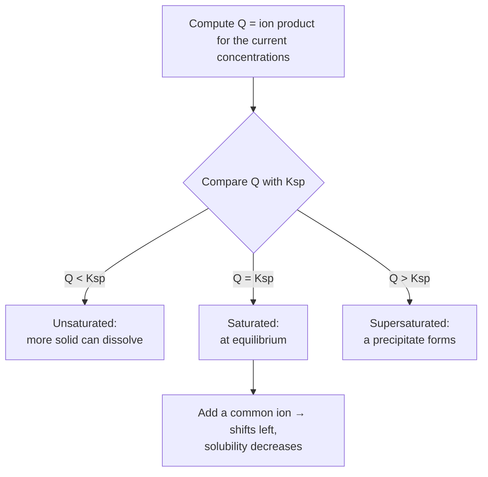

## GenChem::Thermochemistry

### LESSON-GENCHEM-THERMOCHEMISTRY

- **KC:** `GenChem::Thermochemistry`
- **Title:** Thermochemistry: Enthalpy, Calorimetry, and Hess's Law
- **Section:** `MCAT::Chem_Phys`
- **Source:** authored
- **Review Status:** needs_review
- **Overview:** Thermochemistry tracks heat flow during chemical and physical
  changes. Enthalpy (H) is a state function, so the heat of a reaction at constant
  pressure (delta-H) depends only on the initial and final states. Calorimetry
  measures heat experimentally, and Hess's law lets you add known reactions to
  find an unknown delta-H.
- **Key Concepts:**
  - System vs. surroundings; exothermic (delta-H < 0) releases heat, endothermic
    (delta-H > 0) absorbs it.
  - Calorimetry: q = m*c*delta-T relates heat to mass, specific heat, and
    temperature change.
  - Enthalpy is a state function, so Hess's law allows adding reaction steps to
    reach a target delta-H.
  - Standard heats of formation and bond enthalpies give alternative routes to
    delta-H.
- **Prerequisite Reminder:** Build on `GenChem::Stoichiometry` and
  `Physics::Work_And_Energy`: reaction heats scale with moles, and energy
  accounting rests on conservation of energy.
- **Worked Example:** Heating 100 g of water by 20 degrees C requires
  q = m*c*delta-T = (100 g)(4.18 J/g-degreeC)(20 degrees C) = 8360 J ~ 8.4 kJ
  absorbed. Because this q is positive, the water gains heat from its surroundings
  — an endothermic change for the water.
- **Common Misconception:** "The signs of q and delta-H don't really matter." Sign
  conventions are the whole point: a negative delta-H means heat leaves the system
  (exothermic) and a positive value means heat enters (endothermic). Dropping or
  flipping the sign inverts the physical meaning and is the most common calorimetry
  error.
- **First Retrieval Prompt:** From memory, state what a negative delta-H means and
  describe how Hess's law lets you find a delta-H you cannot measure directly.
- **Related KCs:** `GenChem::Stoichiometry`, `Physics::Work_And_Energy`, `GenChem::Thermodynamics`, `GenChem::Kinetics`, `Biochem::Protein_Folding_and_Stability`, `Biochem::Bioenergetics`, `Orgo::Reaction_Mechanisms_Overview`, `Physics::Thermodynamics`
- **Diagram:** Exothermic and endothermic enthalpy diagrams: exothermic products sit lower than reactants (delta H negative), endothermic products sit higher (delta H positive)

<figure class="lesson-diagram">
<svg xmlns="http://www.w3.org/2000/svg" viewBox="0 0 540 440" role="img" aria-labelledby="t d" font-family="-apple-system, Segoe UI, Roboto, sans-serif">
  <title id="t">Thermochemistry: exothermic and endothermic enthalpy diagrams</title>
  <desc id="d">Two reaction-coordinate diagrams. Exothermic: products sit lower in enthalpy than reactants, so delta H is negative and heat is released. Endothermic: products sit higher than reactants, so delta H is positive and heat is absorbed. Enthalpy is a state function.</desc>
  <rect x="6" y="6" width="528" height="428" rx="14" fill="#ffffff" stroke="#cfd8dc" stroke-width="2"/>
  <text x="270" y="30" text-anchor="middle" font-size="17" font-weight="700" fill="#263238">Thermochemistry &#8212; enthalpy diagrams</text>

  <!-- exothermic -->
  <line x1="70" y1="80" x2="70" y2="330" stroke="#37474f" stroke-width="2"/>
  <line x1="70" y1="330" x2="250" y2="330" stroke="#37474f" stroke-width="2"/>
  <text x="46" y="210" font-size="11" fill="#37474f" transform="rotate(-90 46 210)">Enthalpy (H)</text>
  <path d="M80,170 L112,170 C140,170 150,110 165,110 C182,110 195,260 220,260 L245,260" fill="none" stroke="#c62828" stroke-width="2.5"/>
  <line x1="112" y1="170" x2="235" y2="170" stroke="#c62828" stroke-width="1" stroke-dasharray="4 3"/>
  <line x1="228" y1="170" x2="228" y2="260" stroke="#37474f" stroke-width="1.5"/>
  <polygon points="223,255 233,255 228,262" fill="#37474f"/>
  <text x="234" y="220" font-size="11" fill="#37474f">&#916;H &lt; 0</text>
  <text x="95" y="162" font-size="10" fill="#607d8b">reactants</text>
  <text x="215" y="278" font-size="10" fill="#607d8b">products</text>
  <text x="160" y="352" text-anchor="middle" font-size="12" font-weight="600" fill="#c62828">exothermic (heat released)</text>

  <!-- endothermic -->
  <line x1="300" y1="80" x2="300" y2="330" stroke="#37474f" stroke-width="2"/>
  <line x1="300" y1="330" x2="500" y2="330" stroke="#37474f" stroke-width="2"/>
  <path d="M310,260 L342,260 C372,260 382,110 398,110 C415,110 430,180 458,180 L488,180" fill="none" stroke="#2e7d32" stroke-width="2.5"/>
  <line x1="342" y1="260" x2="470" y2="260" stroke="#2e7d32" stroke-width="1" stroke-dasharray="4 3"/>
  <line x1="462" y1="180" x2="462" y2="260" stroke="#37474f" stroke-width="1.5"/>
  <polygon points="457,187 467,187 462,180" fill="#37474f"/>
  <text x="468" y="230" font-size="11" fill="#37474f">&#916;H &gt; 0</text>
  <text x="326" y="278" font-size="10" fill="#607d8b">reactants</text>
  <text x="452" y="172" font-size="10" fill="#607d8b">products</text>
  <text x="400" y="352" text-anchor="middle" font-size="12" font-weight="600" fill="#2e7d32">endothermic (heat absorbed)</text>

  <text x="270" y="392" text-anchor="middle" font-size="11" fill="#607d8b">&#916;H depends only on initial and final states (state function)</text>
  <text x="270" y="414" text-anchor="middle" font-size="11" fill="#607d8b">Hess's law: add known reaction steps to reach an unknown &#916;H</text>
</svg>
</figure>

## GenChem::Thermodynamics

### LESSON-GENCHEM-THERMODYNAMICS

- **KC:** `GenChem::Thermodynamics`
- **Title:** Thermodynamics: Entropy and Gibbs Free Energy
- **Section:** `MCAT::Chem_Phys`
- **Source:** authored
- **Review Status:** needs_review
- **Overview:** Chemical thermodynamics predicts whether a process happens on its
  own. Entropy (S) measures the dispersal of energy and matter, and the second law
  says the total entropy of the universe increases for spontaneous change. Gibbs
  free energy, delta-G = delta-H - T*delta-S, combines enthalpy and entropy into a
  single spontaneity criterion at constant temperature and pressure.
- **Key Concepts:**
  - Entropy increases with disorder/dispersal; the second law requires total
    entropy to rise for spontaneity.
  - delta-G = delta-H - T*delta-S; delta-G < 0 is spontaneous, > 0 is
    nonspontaneous, = 0 is equilibrium.
  - Temperature can flip spontaneity when delta-H and delta-S share the same sign.
  - delta-G-standard relates to the equilibrium constant by
    delta-G-standard = -R*T*ln K.
- **Prerequisite Reminder:** Build on `GenChem::Thermochemistry` and
  `Physics::Thermodynamics`: the delta-H you learned to compute is only half of the
  free-energy story; entropy supplies the other half.
- **Worked Example:** For a reaction with delta-H = +50 kJ and delta-S = +0.20
  kJ/K, at 300 K delta-G = 50 - (300)(0.20) = 50 - 60 = -10 kJ, so it is
  spontaneous. At 200 K, delta-G = 50 - (200)(0.20) = +10 kJ, nonspontaneous —
  temperature decides the outcome.
- **Common Misconception:** "Exothermic reactions are always spontaneous."
  Spontaneity is set by delta-G, not delta-H alone. An exothermic reaction with a
  large negative delta-S can be nonspontaneous at high temperature, and an
  endothermic reaction with positive delta-S can be spontaneous when T*delta-S
  outweighs delta-H.
- **First Retrieval Prompt:** Without notes, explain how an endothermic reaction can
  still be spontaneous, using the delta-G = delta-H - T*delta-S relationship.
- **Related KCs:** `GenChem::Thermochemistry`, `Physics::Thermodynamics`, `GenChem::Electrochemistry`
- **Diagram:** Spontaneity from the signs of delta-H and delta-S:

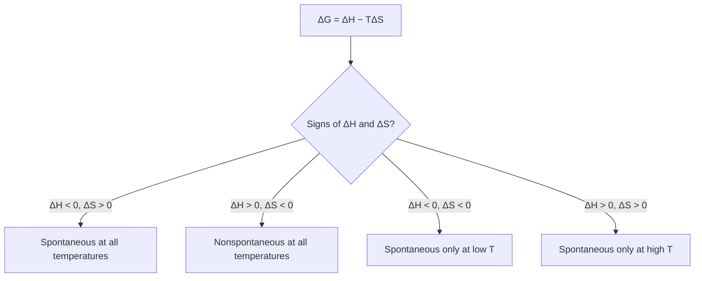

## GenChem::Kinetics

### LESSON-GENCHEM-KINETICS

- **KC:** `GenChem::Kinetics`
- **Title:** Kinetics: Rate Laws and Activation Energy
- **Section:** `MCAT::Chem_Phys`
- **Source:** authored
- **Review Status:** needs_review
- **Overview:** Kinetics is the study of how fast reactions go and what controls
  their speed. A rate law relates reaction rate to reactant concentrations through
  experimentally determined orders. Activation energy and the reaction mechanism —
  especially the slow, rate-determining step — explain why some thermodynamically
  favorable reactions are still slow.
- **Key Concepts:**
  - The rate law, rate = k[A]^m[B]^n, has orders (m, n) found by experiment, not
    from coefficients.
  - The rate constant k rises with temperature (Arrhenius) and with lower
    activation energy.
  - Catalysts speed reactions by lowering activation energy without being
    consumed.
  - The rate-determining (slowest) step governs the overall rate.
- **Prerequisite Reminder:** Build on `GenChem::Stoichiometry` and
  `GenChem::Thermochemistry`: you track amounts over time and connect the energy
  barrier to how readily a reaction proceeds.
- **Worked Example:** If doubling [A] doubles the rate, the reaction is first order
  in A. If doubling [A] quadruples the rate, it is second order. These orders come
  only from experiment: the balanced equation's coefficient for A does not tell you
  the order.
- **Common Misconception:** "Reaction order equals the stoichiometric
  coefficient." Orders must be determined experimentally, because the rate depends
  on the mechanism, not the overall balanced equation. A reactant with coefficient
  2 can be first order (or even zero order) in practice.
- **First Retrieval Prompt:** From memory, explain how you would use experimental
  data (varying a concentration and watching the rate) to determine the order of a
  reactant.
- **Related KCs:** `GenChem::Stoichiometry`, `GenChem::Thermochemistry`, `GenChem::Equilibrium`, `Biochem::Enzyme_Kinetics`, `Orgo::Reaction_Mechanisms_Overview`, `Orgo::Nucleophilic_Substitution`
- **Diagram:** Reaction-coordinate energy profile with and without a catalyst: the catalyzed path has a lower activation-energy barrier but the same reactant and product energies, so delta H is unchanged

<figure class="lesson-diagram">
<svg xmlns="http://www.w3.org/2000/svg" viewBox="0 0 540 440" role="img" aria-labelledby="t d" font-family="-apple-system, Segoe UI, Roboto, sans-serif">
  <title id="t">Kinetics: energy profile with and without a catalyst</title>
  <desc id="d">A reaction-coordinate energy profile. The uncatalyzed path (solid) has a tall activation-energy barrier; the catalyzed path (dashed) has a lower barrier. Both share the same reactant and product energies, so the catalyst lowers activation energy without changing delta H.</desc>
  <rect x="6" y="6" width="528" height="428" rx="14" fill="#ffffff" stroke="#cfd8dc" stroke-width="2"/>
  <text x="270" y="32" text-anchor="middle" font-size="17" font-weight="700" fill="#263238">Kinetics &#8212; a catalyst lowers Ea, not &#916;H</text>

  <line x1="70" y1="70" x2="70" y2="330" stroke="#37474f" stroke-width="2"/>
  <line x1="70" y1="330" x2="500" y2="330" stroke="#37474f" stroke-width="2"/>
  <text x="46" y="210" font-size="12" fill="#37474f" transform="rotate(-90 46 210)">Energy</text>
  <text x="285" y="360" text-anchor="middle" font-size="12" fill="#37474f">Reaction progress &#8594;</text>

  <path d="M90,190 L150,190 C200,190 220,90 250,90 C280,90 300,260 380,260 L440,260" fill="none" stroke="#c62828" stroke-width="2.5"/>
  <path d="M90,190 L160,190 C205,190 225,150 250,150 C275,150 300,260 380,260 L440,260" fill="none" stroke="#2e7d32" stroke-width="2.5" stroke-dasharray="6 4"/>

  <line x1="90" y1="190" x2="440" y2="190" stroke="#cfd8dc" stroke-width="1" stroke-dasharray="3 3"/>
  <line x1="90" y1="260" x2="440" y2="260" stroke="#cfd8dc" stroke-width="1" stroke-dasharray="3 3"/>

  <line x1="212" y1="188" x2="212" y2="92" stroke="#c62828" stroke-width="1.5"/>
  <polygon points="207,98 217,98 212,90" fill="#c62828"/>
  <text x="120" y="130" font-size="10" fill="#c62828">Ea (no catalyst)</text>

  <line x1="292" y1="188" x2="292" y2="152" stroke="#2e7d32" stroke-width="1.5"/>
  <polygon points="287,158 297,158 292,150" fill="#2e7d32"/>
  <text x="300" y="150" font-size="10" fill="#2e7d32">Ea (catalyst)</text>

  <line x1="410" y1="192" x2="410" y2="258" stroke="#37474f" stroke-width="1.5"/>
  <polygon points="405,252 415,252 410,260" fill="#37474f"/>
  <polygon points="405,198 415,198 410,190" fill="#37474f"/>
  <text x="416" y="228" font-size="10" fill="#37474f">&#916;H (same)</text>

  <text x="100" y="182" font-size="10" fill="#607d8b">reactants</text>
  <text x="395" y="278" font-size="10" fill="#607d8b">products</text>

  <text x="270" y="392" text-anchor="middle" font-size="11" fill="#607d8b">lower Ea &#8594; larger rate constant k (Arrhenius); the slow step sets the overall rate</text>
  <text x="270" y="414" text-anchor="middle" font-size="11" fill="#607d8b">the catalyst is not consumed and does not shift the equilibrium position</text>
</svg>
</figure>
- **Diagram:** Mechanism and the rate-determining step — the slowest step sets the pace:

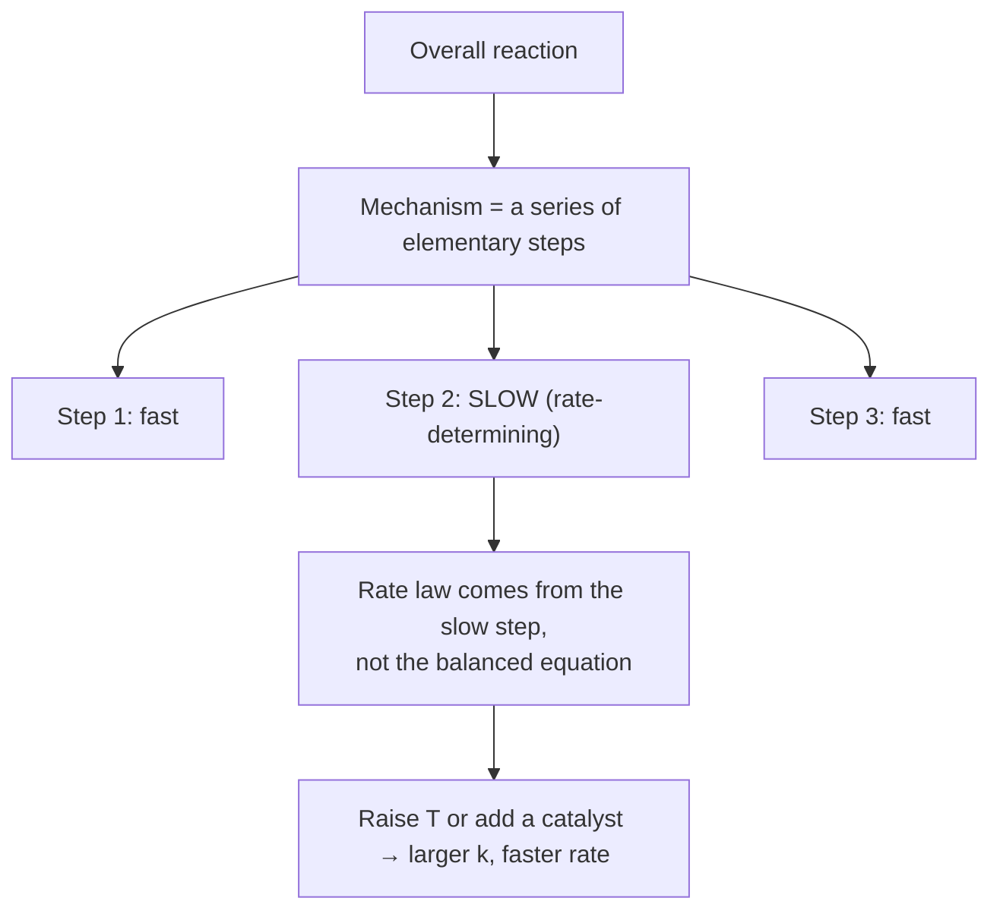

## GenChem::Equilibrium

### LESSON-GENCHEM-EQUILIBRIUM

- **KC:** `GenChem::Equilibrium`
- **Title:** Equilibrium: Keq, Q, and Le Chatelier's Principle
- **Section:** `MCAT::Chem_Phys`
- **Source:** authored
- **Review Status:** needs_review
- **Overview:** Many reactions reach a dynamic equilibrium where the forward and
  reverse rates are equal and concentrations stop changing. The equilibrium
  constant K compares products to reactants at that point, and the reaction
  quotient Q tells you which way an unbalanced system will shift. Le Chatelier's
  principle predicts how a disturbance moves the equilibrium.
- **Key Concepts:**
  - At equilibrium the forward and reverse rates are equal; concentrations are
    constant, though molecules keep reacting both ways.
  - K (Kc or Kp) is the ratio of products to reactants, each raised to its
    coefficient.
  - Comparing Q to K predicts the direction of shift (Q < K shifts forward; Q > K
    shifts reverse).
  - Le Chatelier: changing concentration, pressure, or temperature shifts the
    position to partly counteract the change.
- **Prerequisite Reminder:** Build on `GenChem::Kinetics`: equilibrium is the point
  where the forward and reverse rates you studied become equal.
- **Worked Example:** For N2 + 3 H2 (reversible) 2 NH3 (exothermic), adding more N2
  raises Q's denominator, so Q < K and the system shifts right to make more NH3.
  Raising temperature, however, favors the endothermic reverse direction and lowers
  the ammonia yield.
- **Common Misconception:** "A catalyst shifts the equilibrium toward more
  product." A catalyst speeds the forward and reverse reactions equally, so it only
  helps equilibrium arrive faster — it does not change K or the equilibrium
  position. Only concentration, pressure, or temperature changes shift the
  position.
- **First Retrieval Prompt:** Without notes, predict how increasing the pressure on
  a gas-phase equilibrium with more moles of gas on the reactant side affects the
  position, and explain why.
- **Related KCs:** `GenChem::Kinetics`, `GenChem::Solubility_Equilibria`, `GenChem::Acid_Base_Equilibria`
- **Diagram:** Le Chatelier — a stress shifts the position to partly counteract it:

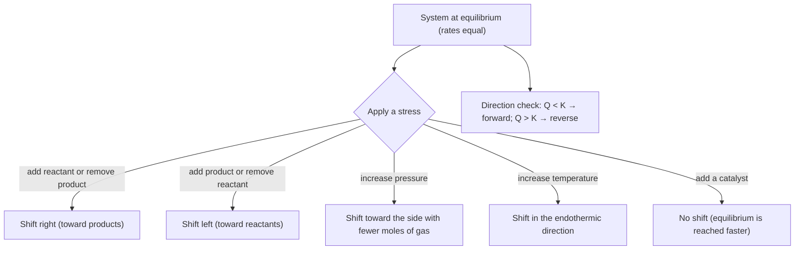

## GenChem::Acid_Base_Equilibria

### LESSON-GENCHEM-ACID-BASE-EQUILIBRIA

- **KC:** `GenChem::Acid_Base_Equilibria`
- **Title:** Acid-Base Equilibria: pH, Ka, and Conjugate Pairs
- **Section:** `MCAT::Chem_Phys`
- **Source:** authored
- **Review Status:** needs_review
- **Overview:** Acid-base chemistry is equilibrium chemistry applied to proton
  transfer. The Bronsted-Lowry model defines acids as proton donors and bases as
  acceptors, linked in conjugate pairs. pH, Kw, and Ka/Kb quantify how far an acid
  or base ionizes, distinguishing strong from weak.
- **Key Concepts:**
  - Bronsted-Lowry: acids donate H+, bases accept it; each acid has a conjugate
    base.
  - pH = -log[H+], pOH = -log[OH-], and pH + pOH = 14 at 25 degrees C (from
    Kw = 1.0 x 10^-14).
  - Strong acids/bases ionize completely; weak ones reach an equilibrium described
    by Ka or Kb.
  - A smaller pKa means a stronger acid; conjugate pairs have inverse strengths.
- **Prerequisite Reminder:** Build on `GenChem::Equilibrium`: weak-acid and
  weak-base behavior is just an equilibrium with K written as Ka or Kb.
- **Worked Example:** A 0.010 M solution of a strong acid like HCl ionizes
  completely, so [H+] = 0.010 M and pH = -log(0.010) = 2.0. A weak acid at the
  same concentration would ionize only partially, giving a higher pH because [H+]
  is smaller.
- **Common Misconception:** "For very dilute strong acids you can ignore water's
  own ions." At extremely low acid concentrations (near 10^-7 M), the H+ from
  water's autoionization becomes significant, so a naive pH from the acid alone can
  wrongly predict a basic pH. Near neutrality you must account for water.
- **First Retrieval Prompt:** From memory, explain the difference between a strong
  and a weak acid at the same concentration and how that affects the resulting pH.
- **Related KCs:** `GenChem::Equilibrium`, `GenChem::Buffers`, `GenChem::Titration`, `Bio::Excretory_System`, `Biochem::Amino_Acids`, `Biochem::Electrophoresis_and_Immunoassays`, `Orgo::Acid_Base_Reactions`
- **Diagram:** The pH scale from 0 to 14 with acidic, neutral, and basic regions and example substances (HCl, vinegar, blood, ammonia, lye), plus pH = -log[H+] and pH + pOH = 14

<figure class="lesson-diagram">
<svg xmlns="http://www.w3.org/2000/svg" viewBox="0 0 540 440" role="img" aria-labelledby="t d" font-family="-apple-system, Segoe UI, Roboto, sans-serif">
  <title id="t">Acid-base equilibria: the pH scale</title>
  <desc id="d">The pH scale from 0 to 14. Values below 7 are acidic, 7 is neutral, and above 7 is basic. Example substances are placed along the scale: hydrochloric acid near 1, vinegar near 3, blood near 7.4, ammonia near 11, and lye near 14. pH equals negative log of hydrogen-ion concentration, and pH plus pOH equals 14 at 25 degrees C.</desc>
  <rect x="6" y="6" width="528" height="428" rx="14" fill="#ffffff" stroke="#cfd8dc" stroke-width="2"/>
  <text x="270" y="32" text-anchor="middle" font-size="17" font-weight="700" fill="#263238">Acid-base equilibria &#8212; the pH scale</text>

  <text x="150" y="72" text-anchor="middle" font-size="12" font-weight="700" fill="#c62828">acidic (pH &lt; 7)</text>
  <text x="270" y="72" text-anchor="middle" font-size="12" font-weight="700" fill="#2e7d32">neutral (7)</text>
  <text x="400" y="72" text-anchor="middle" font-size="12" font-weight="700" fill="#1565c0">basic (pH &gt; 7)</text>

  <g>
    <rect x="60" y="180" width="60" height="40" fill="#c62828"/>
    <rect x="120" y="180" width="60" height="40" fill="#ef6c00"/>
    <rect x="180" y="180" width="60" height="40" fill="#f9a825"/>
    <rect x="240" y="180" width="30" height="40" fill="#9ccc65"/>
    <rect x="270" y="180" width="30" height="40" fill="#2e7d32"/>
    <rect x="300" y="180" width="60" height="40" fill="#00838f"/>
    <rect x="360" y="180" width="60" height="40" fill="#1565c0"/>
    <rect x="420" y="180" width="60" height="40" fill="#6a1b9a"/>
  </g>
  <g font-size="11" fill="#37474f" text-anchor="middle">
    <text x="60" y="238">0</text>
    <text x="120" y="238">2</text>
    <text x="180" y="238">4</text>
    <text x="270" y="238">7</text>
    <text x="360" y="238">10</text>
    <text x="420" y="238">12</text>
    <text x="480" y="238">14</text>
  </g>

  <g font-size="10" fill="#37474f" text-anchor="middle">
    <line x1="90" y1="180" x2="90" y2="160" stroke="#37474f"/><text x="90" y="152">HCl ~1</text>
    <line x1="150" y1="180" x2="150" y2="140" stroke="#37474f"/><text x="150" y="132">vinegar ~3</text>
    <line x1="282" y1="180" x2="282" y2="160" stroke="#37474f"/><text x="292" y="152">blood 7.4</text>
    <line x1="390" y1="180" x2="390" y2="140" stroke="#37474f"/><text x="390" y="132">ammonia ~11</text>
    <line x1="480" y1="180" x2="480" y2="160" stroke="#37474f"/><text x="472" y="152">lye ~14</text>
  </g>

  <text x="270" y="300" text-anchor="middle" font-size="13" font-weight="600" fill="#263238">pH = &#8722;log[H+]   &#183;   pH + pOH = 14</text>
  <text x="270" y="330" text-anchor="middle" font-size="12" fill="#37474f">Kw = [H+][OH&#8722;] = 1.0 &#215; 10^&#8722;14 at 25 &#176;C</text>
  <text x="270" y="362" text-anchor="middle" font-size="12" fill="#607d8b">strong acids/bases ionize fully; weak ones reach a Ka or Kb equilibrium</text>
  <text x="270" y="392" text-anchor="middle" font-size="12" fill="#607d8b">smaller pKa = stronger acid; each pH unit is a 10&#215; change in [H+]</text>
</svg>
</figure>

## GenChem::Buffers

### LESSON-GENCHEM-BUFFERS

- **KC:** `GenChem::Buffers`
- **Title:** Buffers: Resisting pH Change with Henderson-Hasselbalch
- **Section:** `MCAT::Chem_Phys`
- **Source:** authored
- **Review Status:** needs_review
- **Overview:** A buffer is a solution of a weak acid and its conjugate base (or a
  weak base and its conjugate acid) that resists pH change when small amounts of
  acid or base are added. The Henderson-Hasselbalch equation relates pH to pKa and
  the ratio of base to acid. Buffers are central to physiology, such as blood
  bicarbonate control.
- **Key Concepts:**
  - A buffer contains comparable amounts of a conjugate acid-base pair.
  - Henderson-Hasselbalch: pH = pKa + log([A-]/[HA]).
  - Buffering is strongest near pH = pKa, where [A-] ~ [HA].
  - Buffer capacity is finite; enough added acid or base overwhelms it.
- **Prerequisite Reminder:** Build on `GenChem::Acid_Base_Equilibria`: a buffer is
  a weak conjugate pair held near equilibrium, so Ka/pKa reasoning carries straight
  over.
- **Worked Example:** A buffer with equal concentrations of acetic acid and acetate
  ([A-]/[HA] = 1) has pH = pKa + log(1) = pKa ~ 4.74. Doubling the acetate so
  [A-]/[HA] = 2 gives pH = 4.74 + log(2) ~ 5.04 — a modest, predictable shift.
- **Common Misconception:** "A buffer prevents any change in pH." A buffer only
  resists and minimizes pH change; it does not freeze pH. Adding acid or base still
  moves the pH slightly, and once the buffer's capacity is exceeded the pH changes
  sharply.
- **First Retrieval Prompt:** Without notes, explain why a buffer works best when
  the pH is close to the weak acid's pKa.
- **Related KCs:** `GenChem::Acid_Base_Equilibria`, `GenChem::Titration`
- **Diagram:** Buffer logic — the conjugate pair absorbs added acid or base:

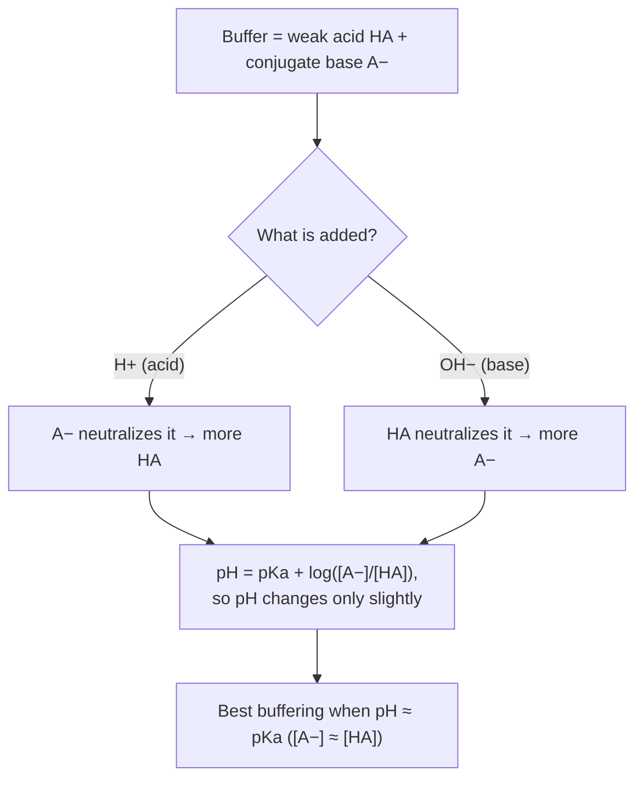

## GenChem::Titration

### LESSON-GENCHEM-TITRATION

- **KC:** `GenChem::Titration`
- **Title:** Titration: Curves and Equivalence Points
- **Section:** `MCAT::Chem_Phys`
- **Source:** authored
- **Review Status:** needs_review
- **Overview:** A titration adds a known titrant to a sample to determine an
  unknown concentration. Plotting pH versus volume gives a titration curve whose
  equivalence point marks complete neutralization. The shape of the curve — and
  where the equivalence point falls — reveals whether the analyte is a strong or
  weak acid or base.
- **Key Concepts:**
  - At the equivalence point, moles of added titrant equal moles of analyte.
  - The half-equivalence point of a weak acid gives pH = pKa.
  - Strong-strong titrations reach equivalence at pH 7; weak-acid/strong-base
    equivalence is basic (>7); weak-base/strong-acid equivalence is acidic (<7).
  - Indicators are chosen so their color change brackets the equivalence-point pH.
- **Prerequisite Reminder:** Build on `GenChem::Acid_Base_Equilibria` and
  `GenChem::Buffers`: the buffering region of a weak-acid curve is exactly
  Henderson-Hasselbalch in action, and the endpoint is acid-base equilibrium
  completed.
- **Worked Example:** Titrating a weak acid with NaOH, at the half-equivalence
  point exactly half the acid is converted to its conjugate base, so [A-] = [HA]
  and pH = pKa. Reading the pH there off the curve is a quick way to estimate the
  acid's pKa.
- **Common Misconception:** "The equivalence point is always at pH 7." Only
  strong-acid/strong-base titrations reach equivalence at pH 7. A weak acid
  titrated with strong base leaves a conjugate base at equivalence, so the pH is
  above 7; a weak base with strong acid gives an equivalence pH below 7.
- **First Retrieval Prompt:** From memory, explain why titrating a weak acid with a
  strong base gives an equivalence point above pH 7.
- **Related KCs:** `GenChem::Acid_Base_Equilibria`, `GenChem::Buffers`
- **Diagram:** Titration curve of pH vs added strong base for a weak acid: a gentle buffer region through the half-equivalence point (pH = pKa), then a sharp rise to an equivalence point above pH 7

<figure class="lesson-diagram">
<svg xmlns="http://www.w3.org/2000/svg" viewBox="0 0 540 440" role="img" aria-labelledby="t d" font-family="-apple-system, Segoe UI, Roboto, sans-serif">
  <title id="t">Titration curve: weak acid with a strong base</title>
  <desc id="d">pH versus volume of strong base added to a weak acid. The curve starts low, rises gently through a buffer region, passes through the half-equivalence point where pH equals pKa, then rises sharply at the equivalence point, which lies above pH 7 because the conjugate base remains. Finally it levels off at high pH.</desc>
  <rect x="6" y="6" width="528" height="428" rx="14" fill="#ffffff" stroke="#cfd8dc" stroke-width="2"/>
  <text x="270" y="30" text-anchor="middle" font-size="17" font-weight="700" fill="#263238">Titration curve &#8212; weak acid + strong base</text>

  <line x1="80" y1="70" x2="80" y2="350" stroke="#37474f" stroke-width="2"/>
  <line x1="80" y1="350" x2="500" y2="350" stroke="#37474f" stroke-width="2"/>
  <text x="46" y="210" font-size="12" fill="#37474f" transform="rotate(-90 46 210)">pH</text>
  <text x="290" y="384" text-anchor="middle" font-size="12" fill="#37474f">Volume of strong base added &#8594;</text>

  <line x1="80" y1="215" x2="500" y2="215" stroke="#cfd8dc" stroke-width="1" stroke-dasharray="4 4"/>
  <text x="66" y="219" text-anchor="end" font-size="10" fill="#607d8b">7</text>

  <polyline points="80,292 130,278 180,259 230,246 265,232 276,206 280,182 286,150 300,132 360,116 440,108 490,104" fill="none" stroke="#1565c0" stroke-width="2.5"/>

  <line x1="80" y1="259" x2="180" y2="259" stroke="#2e7d32" stroke-width="1.3" stroke-dasharray="4 3"/>
  <line x1="180" y1="259" x2="180" y2="350" stroke="#2e7d32" stroke-width="1.3" stroke-dasharray="4 3"/>
  <circle cx="180" cy="259" r="4" fill="#2e7d32"/>
  <text x="188" y="252" font-size="10" fill="#2e7d32">half-equiv: pH = pKa</text>

  <line x1="280" y1="182" x2="280" y2="350" stroke="#c62828" stroke-width="1.3" stroke-dasharray="4 3"/>
  <circle cx="280" cy="182" r="4" fill="#c62828"/>
  <text x="288" y="176" font-size="10" fill="#c62828">equivalence point (pH &gt; 7)</text>
  <text x="284" y="366" text-anchor="middle" font-size="10" fill="#c62828">Veq</text>

  <text x="150" y="300" text-anchor="middle" font-size="10" fill="#607d8b">buffer region</text>

  <text x="270" y="410" text-anchor="middle" font-size="11" fill="#607d8b">conjugate base left at equivalence makes the endpoint basic (above pH 7)</text>
</svg>
</figure>

## GenChem::Electrochemistry

### LESSON-GENCHEM-ELECTROCHEMISTRY

- **KC:** `GenChem::Electrochemistry`
- **Title:** Electrochemistry: Galvanic Cells and Cell Potential
- **Section:** `MCAT::Chem_Phys`
- **Source:** authored
- **Review Status:** needs_review
- **Overview:** Electrochemistry connects redox reactions to electrical energy. In
  a galvanic (voltaic) cell a spontaneous redox reaction drives electrons through
  an external circuit, while an electrolytic cell uses electricity to force a
  nonspontaneous reaction. Standard reduction potentials predict cell voltage and
  its link to free energy.
- **Key Concepts:**
  - Oxidation always occurs at the anode; reduction always at the cathode ("An Ox,
    Red Cat").
  - Cell potential E-cell = E-cathode - E-anode; a positive value means a
    spontaneous galvanic cell.
  - delta-G = -n*F*E ties cell potential to free energy; the Nernst equation
    adjusts for nonstandard concentrations.
  - Galvanic cells release energy (spontaneous); electrolytic cells consume it
    (nonspontaneous).
- **Prerequisite Reminder:** Build on `GenChem::Redox_Reactions`,
  `GenChem::Thermodynamics`, `Physics::Electrical_Circuits`, and
  `Physics::Electrostatics`: cell potential is redox electron transfer expressed as
  voltage and tied to delta-G.
- **Worked Example:** For a Zn/Cu cell, E-cell = E(Cu2+/Cu) - E(Zn2+/Zn) =
  (+0.34) - (-0.76) = +1.10 V. The positive value confirms the reaction is
  spontaneous as a galvanic cell, with zinc oxidized at the anode and copper ion
  reduced at the cathode.
- **Common Misconception:** "The anode is always the negative terminal." The anode
  is defined by oxidation, not by sign. In a galvanic cell the anode is negative,
  but in an electrolytic cell the anode is positive — so identify electrodes by
  oxidation/reduction, not by charge label.
- **First Retrieval Prompt:** Without notes, state which electrode is the site of
  oxidation and explain how the sign of E-cell tells you whether a cell is galvanic
  or electrolytic.
- **Related KCs:** `GenChem::Redox_Reactions`, `GenChem::Thermodynamics`, `Physics::Electrical_Circuits`, `Physics::Electrostatics`, `Biochem::Oxidative_Phosphorylation`, `Orgo::Oxidation_Reduction_Reactions`
- **Diagram:** Zinc-copper galvanic cell: zinc oxidized at the anode sends electrons through the wire and voltmeter to the copper cathode, with a salt bridge and a cell potential of +1.10 V

<figure class="lesson-diagram">
<svg xmlns="http://www.w3.org/2000/svg" viewBox="0 0 540 440" role="img" aria-labelledby="t d" font-family="-apple-system, Segoe UI, Roboto, sans-serif">
  <title id="t">Electrochemistry: a galvanic (voltaic) cell</title>
  <desc id="d">A zinc-copper galvanic cell. Zinc is oxidized at the anode (negative) and releases electrons that flow through the external wire and voltmeter to the copper cathode (positive), where copper ions are reduced. A salt bridge connects the two half-cells. The standard cell potential is plus 1.10 volts.</desc>
  <rect x="6" y="6" width="528" height="428" rx="14" fill="#ffffff" stroke="#cfd8dc" stroke-width="2"/>
  <text x="270" y="30" text-anchor="middle" font-size="17" font-weight="700" fill="#263238">Electrochemistry &#8212; galvanic (voltaic) cell</text>

  <!-- external circuit -->
  <polyline points="130,150 130,100 410,100 410,150" fill="none" stroke="#37474f" stroke-width="2"/>
  <circle cx="270" cy="100" r="16" fill="#ffffff" stroke="#37474f" stroke-width="2"/>
  <text x="270" y="105" text-anchor="middle" font-size="13" font-weight="700" fill="#37474f">V</text>
  <line x1="170" y1="84" x2="240" y2="84" stroke="#1565c0" stroke-width="2"/>
  <polygon points="240,79 240,89 250,84" fill="#1565c0"/>
  <line x1="300" y1="84" x2="370" y2="84" stroke="#1565c0" stroke-width="2"/>
  <polygon points="370,79 370,89 380,84" fill="#1565c0"/>
  <text x="205" y="76" text-anchor="middle" font-size="11" fill="#1565c0">e&#8722;</text>
  <text x="335" y="76" text-anchor="middle" font-size="11" fill="#1565c0">e&#8722;</text>

  <!-- salt bridge -->
  <path d="M175,210 C175,158 365,158 365,210" fill="none" stroke="#b0bec5" stroke-width="10"/>
  <text x="270" y="150" text-anchor="middle" font-size="10" fill="#607d8b">salt bridge</text>

  <!-- beakers -->
  <path d="M70,200 L70,320 Q70,340 90,340 L170,340 Q190,340 190,320 L190,200" fill="#e3f2fd" stroke="#90a4ae" stroke-width="2"/>
  <path d="M350,200 L350,320 Q350,340 370,340 L450,340 Q470,340 470,320 L470,200" fill="#e3f2fd" stroke="#90a4ae" stroke-width="2"/>

  <!-- electrodes -->
  <rect x="124" y="150" width="12" height="150" fill="#90a4ae"/>
  <rect x="404" y="150" width="12" height="150" fill="#ef6c00"/>

  <text x="130" y="360" text-anchor="middle" font-size="12" font-weight="700" fill="#37474f">Zn anode (&#8722;)</text>
  <text x="410" y="360" text-anchor="middle" font-size="12" font-weight="700" fill="#37474f">Cu cathode (+)</text>
  <text x="130" y="230" text-anchor="middle" font-size="10" fill="#607d8b">Zn2+</text>
  <text x="410" y="230" text-anchor="middle" font-size="10" fill="#607d8b">Cu2+</text>

  <text x="130" y="392" text-anchor="middle" font-size="10" fill="#c62828">oxidation: Zn &#8594; Zn2+ + 2e&#8722;</text>
  <text x="410" y="392" text-anchor="middle" font-size="10" fill="#2e7d32">reduction: Cu2+ + 2e&#8722; &#8594; Cu</text>

  <text x="270" y="414" text-anchor="middle" font-size="12" font-weight="700" fill="#263238">E&#176;cell = E&#176;cathode &#8722; E&#176;anode = +0.34 &#8722; (&#8722;0.76) = +1.10 V</text>
</svg>
</figure>
- **Diagram:** Galvanic vs electrolytic — the sign of the cell potential decides:

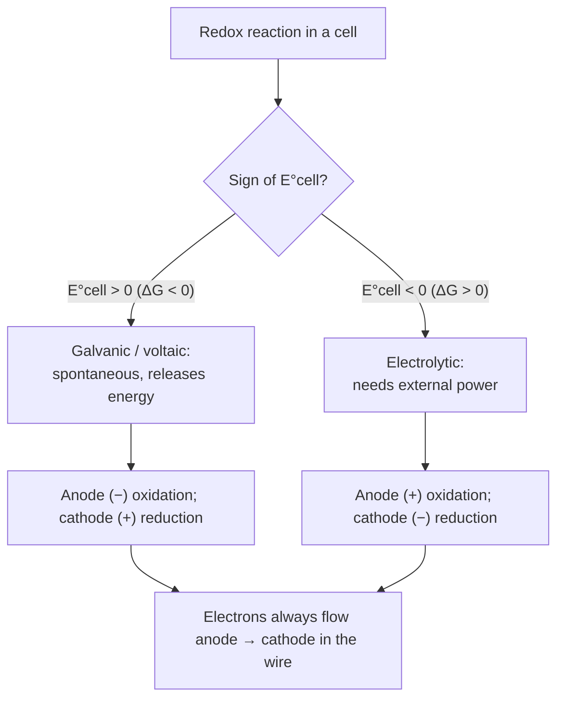

## GenChem::Nuclear_Chemistry

### LESSON-GENCHEM-NUCLEAR-CHEMISTRY

- **KC:** `GenChem::Nuclear_Chemistry`
- **Title:** Nuclear Chemistry: Radioactive Decay and Binding Energy
- **Section:** `MCAT::Chem_Phys`
- **Source:** authored
- **Review Status:** needs_review
- **Overview:** Nuclear chemistry deals with changes in the atomic nucleus rather
  than the electrons. Unstable nuclei decay by emitting alpha, beta, or gamma
  radiation, each changing the atomic number and/or mass number in a specific way.
  Mass defect and binding energy explain why fusion and fission release enormous
  energy.
- **Key Concepts:**
  - Alpha decay emits a He-4 nucleus (Z down 2, A down 4); beta-minus converts a
    neutron to a proton (Z up 1, A unchanged); gamma is high-energy photon
    emission (no Z/A change).
  - Nuclear equations balance mass number and atomic number on both sides.
  - Half-life is the time for half of a radioactive sample to decay.
  - Mass defect converts to binding energy via E = m*c^2; fusion and fission both
    release energy by raising binding energy per nucleon.
- **Prerequisite Reminder:** Build on `GenChem::Atomic_Structure`,
  `Physics::Atomic_Structure`, and `Physics::Nuclear_Physics`: nuclear change is
  bookkeeping on the protons and neutrons you first counted, now with energy from
  mass defect.
- **Worked Example:** Uranium-238 undergoes alpha decay. The alpha particle removes
  2 protons and 2 neutrons, so Z goes 92 -> 90 and A goes 238 -> 234, producing
  thorium-234. Balancing checks out: 238 = 234 + 4 and 92 = 90 + 2.
- **Common Misconception:** "All types of radioactive decay change the element the
  same way." Each mode differs: alpha lowers Z by 2, beta-minus raises Z by 1, and
  gamma leaves Z and A unchanged. Mixing these up — especially the effect on Z and
  A — is the most common nuclear-equation error.
- **First Retrieval Prompt:** From memory, state how alpha and beta-minus decay each
  change an atom's atomic number and mass number.
- **Related KCs:** `GenChem::Atomic_Structure`, `Physics::Atomic_Structure`, `Physics::Nuclear_Physics`
- **Diagram:** Decay chain — each step changes Z and A in a fixed way:

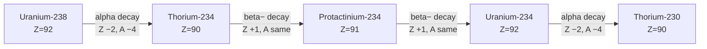
