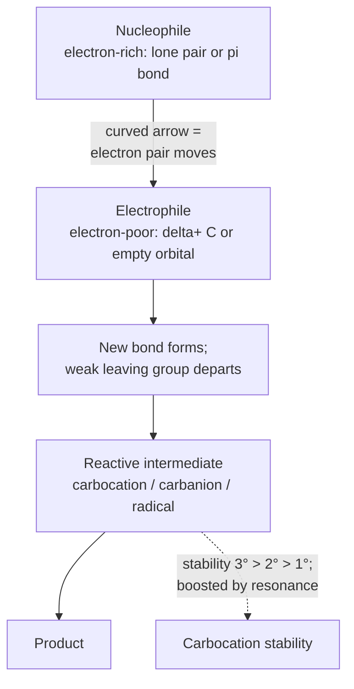
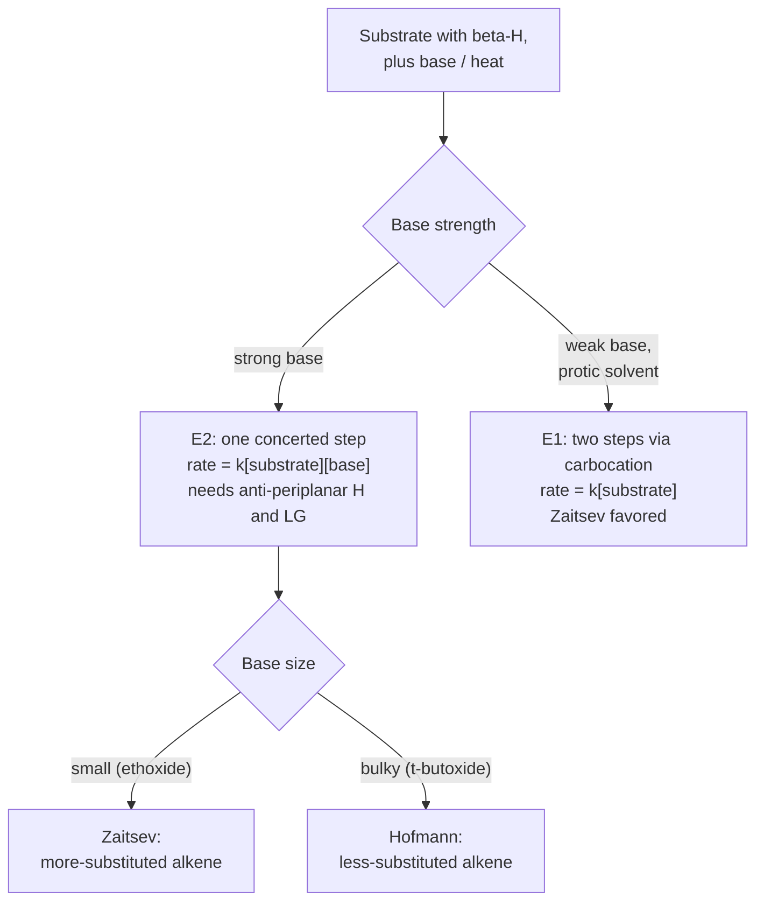
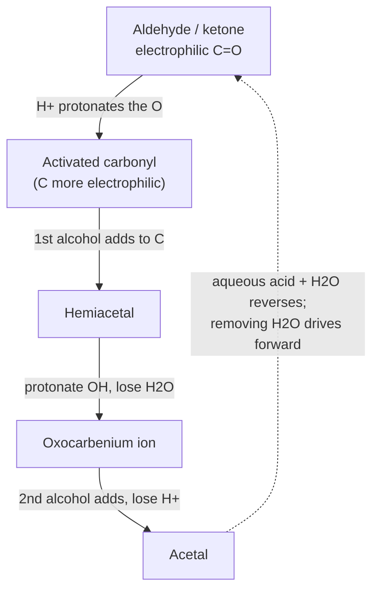
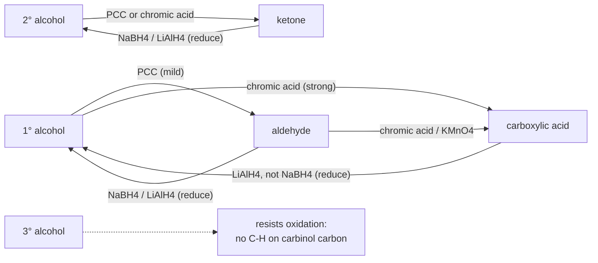
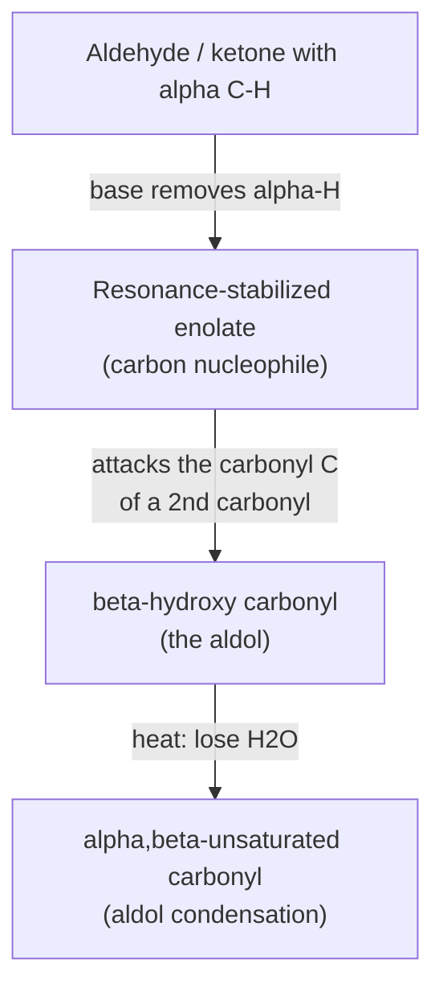
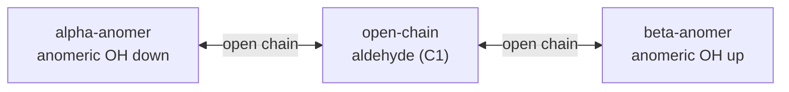
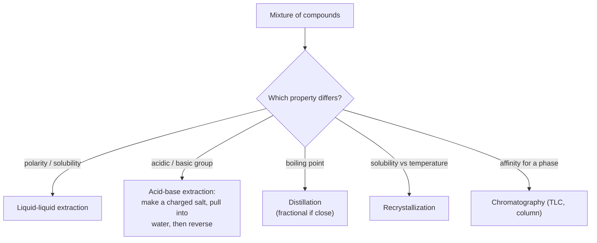
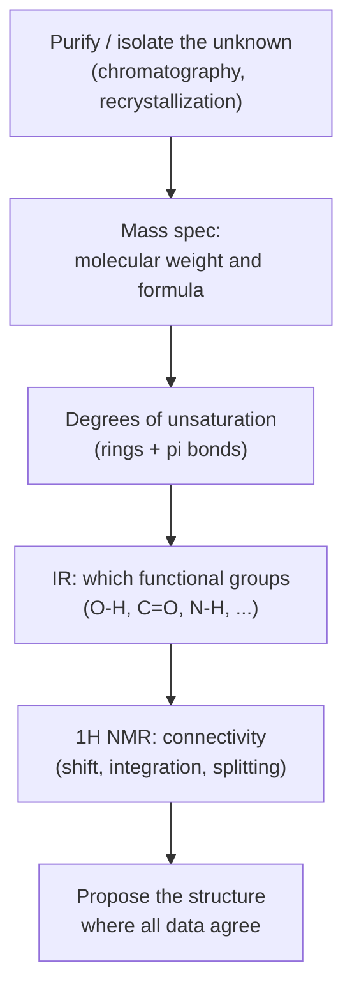

# Organic Chemistry Lessons (Track C — scaled draft)

Auto-drafted lesson pages for the 27 `Orgo::` KCs in the frozen unified map (`added features/kc-map-unified.md` §6/§7). Schema + style follow `added features/lessons.md`. All content is synthetic and original (not copied from any copyrighted prep material). New lessons are `Source: authored`, `Review Status: needs_review` (hidden behind the display gate until a human approves them, per `lesson-contract.md` §4).

## Orgo::Hybridization

### LESSON-ORGO-HYBRIDIZATION

- **KC:** `Orgo::Hybridization`
- **Title:** Hybridization: Orbitals, Sigma/Pi Bonds, and Geometry
- **Section:** `MCAT::Chem_Phys`
- **Source:** authored
- **Review Status:** needs_review
- **Overview:** Hybridization describes how an atom's atomic orbitals mix to form
  the equivalent orbitals that hold its bonds. The label (sp, sp2, sp3) tells you
  the number of sigma bonds plus lone pairs on the atom, which in turn fixes its
  geometry and bond angles. Fluency here is the base for reading every organic
  structure, because both shape and reactivity start from the bonding picture.
- **Key Concepts:**
  - sp3 (4 regions, tetrahedral, ~109.5°), sp2 (3 regions, trigonal planar,
    ~120°, one pi bond), sp (2 regions, linear, ~180°, two pi bonds).
  - A sigma bond forms by head-on overlap; a pi bond forms by side-on overlap of
    unhybridized p orbitals and is part of every double/triple bond.
  - Assign hybridization by counting regions of electron density (sigma bonds +
    lone pairs) on the atom.
  - Conjugation/resonance needs adjacent parallel p orbitals (a run of sp2/sp
    centers).
  - More s-character (sp > sp2 > sp3) gives shorter, stronger bonds and a more
    electronegative, less basic atom.
- **Prerequisite Reminder:** Build on `GenChem::Chemical_Bonding` and
  `GenChem::Molecular_Geometry`: hybridization is the organic restatement of
  VSEPR — the same electron-region count that set molecular shape now names the
  orbitals.
- **Worked Example:** Assign hybridization in acetonitrile, CH3-C≡N. The CH3
  carbon has four sigma bonds (three C–H, one C–C), so 4 regions → sp3,
  tetrahedral. The middle carbon has two sigma bonds (to CH3 and N) plus the
  triple bond, so 2 regions → sp, linear, carrying two pi bonds. The nitrogen has
  one sigma bond plus one lone pair = 2 regions → sp. Notice the triple bond adds
  only one sigma to the region count; its two pi bonds don't change hybridization.
- **Common Misconception:** "Hybridization is the same thing as molecular
  geometry." Geometry describes where the atoms sit; hybridization names the
  orbitals. They track together, but you assign hybridization by counting
  electron regions (sigma bonds + lone pairs), so a lone pair counts even though
  it is not an atom you "see" in the shape.
- **First Retrieval Prompt:** Without looking back, give the hybridization,
  geometry, and approximate bond angle at a carbon that has one double bond and
  two single bonds.
- **Related KCs:** `GenChem::Chemical_Bonding`, `GenChem::Molecular_Geometry`, `Orgo::Functional_Groups`, `Orgo::Nomenclature`, `Orgo::Stereochemistry`, `Orgo::Polycyclic_and_Heterocyclic_Aromatic_Compounds`, `Orgo::NMR_Spectroscopy`, `Orgo::Molecular_Structure_and_Absorption_Spectra`
- **Diagram:** sp3 tetrahedral (109.5 degrees), sp2 trigonal planar (120 degrees), and sp linear (180 degrees) carbons with sigma and pi bond counts

<figure class="lesson-diagram">
<svg xmlns="http://www.w3.org/2000/svg" viewBox="0 0 540 440" role="img" aria-labelledby="t d" font-family="-apple-system, Segoe UI, Roboto, sans-serif">
  <title id="t">Hybridization: sp3, sp2, and sp</title>
  <desc id="d">Three carbon hybridizations. sp3 is tetrahedral (about 109.5 degrees, methane, four sigma bonds). sp2 is trigonal planar (about 120 degrees, ethene, three sigma plus one pi). sp is linear (180 degrees, ethyne, two sigma plus two pi). More s-character gives shorter, stronger bonds.</desc>
  <rect x="6" y="6" width="528" height="428" rx="14" fill="#ffffff" stroke="#cfd8dc" stroke-width="2"/>
  <text x="270" y="34" text-anchor="middle" font-size="18" font-weight="700" fill="#263238">Hybridization: orbitals, geometry, and bond angle</text>

  <rect x="22" y="58" width="156" height="300" rx="10" fill="#f7f9fa" stroke="#cfd8dc" stroke-width="1.5"/>
  <rect x="192" y="58" width="156" height="300" rx="10" fill="#f7f9fa" stroke="#cfd8dc" stroke-width="1.5"/>
  <rect x="362" y="58" width="156" height="300" rx="10" fill="#f7f9fa" stroke="#cfd8dc" stroke-width="1.5"/>

  <g stroke="#78909c" stroke-width="2.5">
    <line x1="100" y1="150" x2="68" y2="120"/>
    <line x1="100" y1="150" x2="132" y2="120"/>
    <line x1="100" y1="150" x2="72" y2="192" stroke-dasharray="3 3"/>
  </g>
  <polygon points="100,150 124.2,194.5 131.8,189.5" fill="#37474f"/>
  <circle cx="100" cy="150" r="14" fill="#37474f"/><text x="100" y="155" text-anchor="middle" font-size="14" font-weight="700" fill="#fff">C</text>
  <text x="60" y="116" text-anchor="middle" font-size="12" fill="#546e7a">H</text>
  <text x="140" y="116" text-anchor="middle" font-size="12" fill="#546e7a">H</text>
  <text x="64" y="204" text-anchor="middle" font-size="12" fill="#546e7a">H</text>
  <text x="136" y="204" text-anchor="middle" font-size="12" fill="#546e7a">H</text>
  <text x="100" y="248" text-anchor="middle" font-size="22" font-weight="700" fill="#1565c0">sp3</text>
  <text x="100" y="270" text-anchor="middle" font-size="13" fill="#37474f">tetrahedral</text>
  <text x="100" y="289" text-anchor="middle" font-size="13" fill="#546e7a">~109.5&#176;</text>
  <text x="100" y="308" text-anchor="middle" font-size="12.5" fill="#546e7a">4 &#963; + 0 &#960;</text>
  <text x="100" y="327" text-anchor="middle" font-size="11.5" fill="#78909c">e.g. CH4, ethane</text>

  <g stroke="#78909c" stroke-width="2.5">
    <line x1="262" y1="146" x2="278" y2="146"/>
    <line x1="262" y1="154" x2="278" y2="154"/>
    <line x1="248" y1="150" x2="224" y2="126"/>
    <line x1="248" y1="150" x2="224" y2="174"/>
    <line x1="292" y1="150" x2="316" y2="126"/>
    <line x1="292" y1="150" x2="316" y2="174"/>
  </g>
  <circle cx="248" cy="150" r="14" fill="#37474f"/><text x="248" y="155" text-anchor="middle" font-size="14" font-weight="700" fill="#fff">C</text>
  <circle cx="292" cy="150" r="14" fill="#37474f"/><text x="292" y="155" text-anchor="middle" font-size="14" font-weight="700" fill="#fff">C</text>
  <text x="216" y="122" text-anchor="middle" font-size="12" fill="#546e7a">H</text>
  <text x="216" y="184" text-anchor="middle" font-size="12" fill="#546e7a">H</text>
  <text x="324" y="122" text-anchor="middle" font-size="12" fill="#546e7a">H</text>
  <text x="324" y="184" text-anchor="middle" font-size="12" fill="#546e7a">H</text>
  <text x="270" y="248" text-anchor="middle" font-size="22" font-weight="700" fill="#2e7d32">sp2</text>
  <text x="270" y="270" text-anchor="middle" font-size="13" fill="#37474f">trigonal planar</text>
  <text x="270" y="289" text-anchor="middle" font-size="13" fill="#546e7a">~120&#176;</text>
  <text x="270" y="308" text-anchor="middle" font-size="12.5" fill="#546e7a">3 &#963; + 1 &#960;</text>
  <text x="270" y="327" text-anchor="middle" font-size="11.5" fill="#78909c">e.g. ethene, C=O</text>

  <g stroke="#78909c" stroke-width="2.5">
    <line x1="434" y1="144" x2="446" y2="144"/>
    <line x1="434" y1="150" x2="446" y2="150"/>
    <line x1="434" y1="156" x2="446" y2="156"/>
    <line x1="406" y1="150" x2="390" y2="150"/>
    <line x1="474" y1="150" x2="490" y2="150"/>
  </g>
  <circle cx="420" cy="150" r="14" fill="#37474f"/><text x="420" y="155" text-anchor="middle" font-size="14" font-weight="700" fill="#fff">C</text>
  <circle cx="460" cy="150" r="14" fill="#37474f"/><text x="460" y="155" text-anchor="middle" font-size="14" font-weight="700" fill="#fff">C</text>
  <text x="382" y="155" text-anchor="middle" font-size="12" fill="#546e7a">H</text>
  <text x="498" y="155" text-anchor="middle" font-size="12" fill="#546e7a">H</text>
  <text x="440" y="248" text-anchor="middle" font-size="22" font-weight="700" fill="#6a1b9a">sp</text>
  <text x="440" y="270" text-anchor="middle" font-size="13" fill="#37474f">linear</text>
  <text x="440" y="289" text-anchor="middle" font-size="13" fill="#546e7a">180&#176;</text>
  <text x="440" y="308" text-anchor="middle" font-size="12.5" fill="#546e7a">2 &#963; + 2 &#960;</text>
  <text x="440" y="327" text-anchor="middle" font-size="11.5" fill="#78909c">e.g. ethyne, C&#8801;N</text>

  <text x="270" y="386" text-anchor="middle" font-size="13" font-weight="700" fill="#37474f">More s-character: sp &gt; sp2 &gt; sp3</text>
  <text x="270" y="408" text-anchor="middle" font-size="12" fill="#607d8b">&#8594; shorter, stronger bonds; atom more electronegative and less basic</text>
</svg>
</figure>

## Orgo::Functional_Groups

### LESSON-ORGO-FUNCTIONAL-GROUPS

- **KC:** `Orgo::Functional_Groups`
- **Title:** Functional Groups: Recognition and Reactivity
- **Section:** `MCAT::Chem_Phys`
- **Source:** authored
- **Review Status:** needs_review
- **Overview:** Functional groups are the specific atom arrangements that give a
  molecule its characteristic chemistry. Almost all organic reactivity is
  organized by functional group, so recognizing them on sight — and ranking their
  polarity and reactivity — is the highest-leverage skill in organic chemistry.
  Everything downstream (naming, mechanisms, spectroscopy) keys off this
  recognition.
- **Key Concepts:**
  - Core groups: alkyl, alkene/alkyne, alcohol (–OH), ether (C–O–C), amine (C–N),
    and the carbonyl family.
  - The carbonyl (C=O) family is not one group: aldehyde, ketone, carboxylic
    acid, ester, amide, anhydride, and acyl halide behave very differently.
  - Heteroatoms (O, N, halogen) create polarity and are the sites where reactions
    happen.
  - Reactivity roughly tracks how electrophilic the key carbon is and how good any
    attached leaving group is.
- **Prerequisite Reminder:** Build on `Orgo::Hybridization` and
  `GenChem::Chemical_Bonding`: a functional group is a recurring bonding pattern,
  so knowing which atoms are sp2/sp3 and how electronegativity polarizes bonds
  tells you where a group reacts.
- **Worked Example:** Compare an aldehyde (R–CHO) with an ester (R–CO–OR'). Both
  contain a C=O, so a novice might treat them alike. But the aldehyde carbonyl
  carbon bears only H and R — a strong electrophile with no leaving group — so it
  undergoes addition. The ester carbonyl carbon bears an –OR' that can leave, so
  it undergoes addition–elimination (acyl substitution). Same C=O, different
  neighbors, different reaction class.
- **Common Misconception:** "All C=O groups are basically equivalent." The
  carbon's neighbors decide everything: an aldehyde adds nucleophiles, a
  carboxylic acid donates a proton, and an amide is sluggish because nitrogen's
  lone pair feeds the carbonyl. Reading "C=O" without reading its substituents
  predicts the wrong chemistry.
- **First Retrieval Prompt:** From memory, list four different carbonyl-containing
  functional groups and, for each, name the atom(s) attached to the carbonyl
  carbon that make it distinct.
- **Related KCs:** `GenChem::Chemical_Bonding`, `Orgo::Hybridization`, `Orgo::Nomenclature`, `Orgo::Isomerism`, `Orgo::Acid_Base_Reactions`, `Orgo::Reaction_Mechanisms_Overview`, `Orgo::Oxidation_Reduction_Reactions`, `Orgo::Alcohols`, `Orgo::Polycyclic_and_Heterocyclic_Aromatic_Compounds`, `Orgo::Aldehydes_and_Ketones`, `Orgo::Carboxylic_Acids`, `Orgo::Amines`, `Orgo::IR_Spectroscopy`, `Orgo::NMR_Spectroscopy`, `Orgo::Mass_Spectrometry`, `Orgo::Separations_and_Purifications`, `Biochem::Amino_Acids`, `Biochem::Carbohydrates_and_Lipids`
- **Diagram:** Recognition chart of common functional groups: alkane, alkene, alkyne, aromatic, alcohol, ether, amine, haloalkane, and the carbonyl family plus nitrile

<figure class="lesson-diagram">
<svg xmlns="http://www.w3.org/2000/svg" viewBox="0 0 560 588" role="img" aria-labelledby="t d" font-family="-apple-system, Segoe UI, Roboto, sans-serif">
  <title id="t">Functional-group recognition chart</title>
  <desc id="d">Sixteen common organic functional groups grouped by type: hydrocarbons (alkane, alkene, alkyne, aromatic), oxygen and nitrogen singles (alcohol, ether, amine, haloalkane), and the carbonyl family (aldehyde, ketone, carboxylic acid, ester, amide, acyl halide, anhydride) plus nitrile. Each carbonyl shares a C double bond O; the neighboring atoms set its chemistry.</desc>
  <rect x="6" y="6" width="548" height="576" rx="14" fill="#ffffff" stroke="#cfd8dc" stroke-width="2"/>
  <text x="280" y="34" text-anchor="middle" font-size="18" font-weight="700" fill="#263238">Functional groups: recognition chart</text>

  <g fill="#f7f9fa" stroke="#cfd8dc" stroke-width="1.5">
    <rect x="16" y="56" width="123" height="118" rx="9"/><rect x="151" y="56" width="123" height="118" rx="9"/><rect x="286" y="56" width="123" height="118" rx="9"/><rect x="421" y="56" width="123" height="118" rx="9"/>
    <rect x="16" y="182" width="123" height="118" rx="9"/><rect x="151" y="182" width="123" height="118" rx="9"/><rect x="286" y="182" width="123" height="118" rx="9"/><rect x="421" y="182" width="123" height="118" rx="9"/>
    <rect x="16" y="308" width="123" height="118" rx="9"/><rect x="151" y="308" width="123" height="118" rx="9"/><rect x="286" y="308" width="123" height="118" rx="9"/><rect x="421" y="308" width="123" height="118" rx="9"/>
    <rect x="16" y="434" width="123" height="118" rx="9"/><rect x="151" y="434" width="123" height="118" rx="9"/><rect x="286" y="434" width="123" height="118" rx="9"/><rect x="421" y="434" width="123" height="118" rx="9"/>
  </g>

  <g stroke="#455a64" stroke-width="2.5">
    <line x1="58" y1="98" x2="98" y2="98"/>
    <line x1="193" y1="95" x2="233" y2="95"/><line x1="193" y1="101" x2="233" y2="101"/>
    <line x1="328" y1="92" x2="368" y2="92"/><line x1="328" y1="98" x2="368" y2="98"/><line x1="328" y1="104" x2="368" y2="104"/>
  </g>
  <g fill="#455a64"><circle cx="58" cy="98" r="2.5"/><circle cx="98" cy="98" r="2.5"/></g>
  <polygon points="483,80 467.4,89 467.4,107 483,116 498.6,107 498.6,89" fill="none" stroke="#455a64" stroke-width="2.5"/>
  <circle cx="483" cy="98" r="8.5" fill="none" stroke="#455a64" stroke-width="1.8"/>
  <text x="78" y="142" text-anchor="middle" font-size="12.5" font-weight="700" fill="#455a64">Alkane</text><text x="78" y="160" text-anchor="middle" font-size="11" fill="#78909c">single C&#8722;C</text>
  <text x="213" y="142" text-anchor="middle" font-size="12.5" font-weight="700" fill="#455a64">Alkene</text><text x="213" y="160" text-anchor="middle" font-size="11" fill="#78909c">C=C</text>
  <text x="348" y="142" text-anchor="middle" font-size="12.5" font-weight="700" fill="#455a64">Alkyne</text><text x="348" y="160" text-anchor="middle" font-size="11" fill="#78909c">C&#8801;C</text>
  <text x="483" y="142" text-anchor="middle" font-size="12.5" font-weight="700" fill="#455a64">Aromatic</text><text x="483" y="160" text-anchor="middle" font-size="11" fill="#78909c">benzene ring</text>

  <text x="78" y="229" text-anchor="middle" font-size="16" fill="#37474f">R&#8722;OH</text>
  <text x="213" y="229" text-anchor="middle" font-size="16" fill="#37474f">R&#8722;O&#8722;R'</text>
  <text x="348" y="229" text-anchor="middle" font-size="16" fill="#37474f">R&#8722;NH2</text>
  <text x="483" y="229" text-anchor="middle" font-size="16" fill="#37474f">R&#8722;X</text>
  <text x="78" y="268" text-anchor="middle" font-size="12.5" font-weight="700" fill="#1565c0">Alcohol</text><text x="78" y="286" text-anchor="middle" font-size="11" fill="#78909c">hydroxyl &#8722;OH</text>
  <text x="213" y="268" text-anchor="middle" font-size="12.5" font-weight="700" fill="#1565c0">Ether</text><text x="213" y="286" text-anchor="middle" font-size="11" fill="#78909c">C&#8722;O&#8722;C</text>
  <text x="348" y="268" text-anchor="middle" font-size="12.5" font-weight="700" fill="#6a1b9a">Amine</text><text x="348" y="286" text-anchor="middle" font-size="11" fill="#78909c">amino &#8722;NH2</text>
  <text x="483" y="268" text-anchor="middle" font-size="12.5" font-weight="700" fill="#00838f">Haloalkane</text><text x="483" y="286" text-anchor="middle" font-size="11" fill="#78909c">X = F,Cl,Br,I</text>

  <g stroke="#c62828" stroke-width="2.5">
    <line x1="75.5" y1="342" x2="75.5" y2="326"/><line x1="80.5" y1="342" x2="80.5" y2="326"/><line x1="76" y1="350" x2="52" y2="350"/><line x1="80" y1="350" x2="104" y2="350"/>
    <line x1="210.5" y1="342" x2="210.5" y2="326"/><line x1="215.5" y1="342" x2="215.5" y2="326"/><line x1="211" y1="350" x2="187" y2="350"/><line x1="215" y1="350" x2="239" y2="350"/>
    <line x1="345.5" y1="342" x2="345.5" y2="326"/><line x1="350.5" y1="342" x2="350.5" y2="326"/><line x1="346" y1="350" x2="322" y2="350"/><line x1="350" y1="350" x2="374" y2="350"/>
    <line x1="480.5" y1="342" x2="480.5" y2="326"/><line x1="485.5" y1="342" x2="485.5" y2="326"/><line x1="481" y1="350" x2="457" y2="350"/><line x1="485" y1="350" x2="509" y2="350"/>
  </g>
  <g fill="#c62828"><circle cx="78" cy="350" r="2.5"/><circle cx="213" cy="350" r="2.5"/><circle cx="348" cy="350" r="2.5"/><circle cx="483" cy="350" r="2.5"/></g>
  <g font-size="12" fill="#c62828" text-anchor="middle"><text x="78" y="320">O</text><text x="213" y="320">O</text><text x="348" y="320">O</text><text x="483" y="320">O</text></g>
  <g font-size="12" fill="#455a64" text-anchor="middle">
    <text x="44" y="354">R</text><text x="114" y="354">H</text>
    <text x="179" y="354">R</text><text x="249" y="354">R'</text>
    <text x="314" y="354">R</text><text x="386" y="354">OH</text>
    <text x="449" y="354">R</text><text x="521" y="354">OR'</text>
  </g>
  <text x="78" y="394" text-anchor="middle" font-size="12.5" font-weight="700" fill="#c62828">Aldehyde</text><text x="78" y="412" text-anchor="middle" font-size="11" fill="#78909c">carbonyl (end)</text>
  <text x="213" y="394" text-anchor="middle" font-size="12.5" font-weight="700" fill="#c62828">Ketone</text><text x="213" y="412" text-anchor="middle" font-size="11" fill="#78909c">carbonyl (mid)</text>
  <text x="348" y="394" text-anchor="middle" font-size="11.5" font-weight="700" fill="#c62828">Carboxylic acid</text><text x="348" y="412" text-anchor="middle" font-size="11" fill="#78909c">&#8722;COOH</text>
  <text x="483" y="394" text-anchor="middle" font-size="12.5" font-weight="700" fill="#c62828">Ester</text><text x="483" y="412" text-anchor="middle" font-size="11" fill="#78909c">&#8722;COOR</text>

  <g stroke="#c62828" stroke-width="2.5">
    <line x1="75.5" y1="468" x2="75.5" y2="452"/><line x1="80.5" y1="468" x2="80.5" y2="452"/><line x1="76" y1="476" x2="52" y2="476"/><line x1="80" y1="476" x2="104" y2="476"/>
    <line x1="210.5" y1="468" x2="210.5" y2="452"/><line x1="215.5" y1="468" x2="215.5" y2="452"/><line x1="211" y1="476" x2="187" y2="476"/><line x1="215" y1="476" x2="239" y2="476"/>
  </g>
  <g fill="#c62828"><circle cx="78" cy="476" r="2.5"/><circle cx="213" cy="476" r="2.5"/></g>
  <g font-size="12" fill="#c62828" text-anchor="middle"><text x="78" y="446">O</text><text x="213" y="446">O</text></g>
  <g font-size="12" fill="#455a64" text-anchor="middle"><text x="44" y="480">R</text><text x="114" y="480">NH2</text><text x="179" y="480">R</text><text x="249" y="480">Cl</text></g>
  <text x="348" y="480" text-anchor="middle" font-size="12" fill="#37474f">R&#8722;CO&#8722;O&#8722;CO&#8722;R'</text>
  <text x="483" y="480" text-anchor="middle" font-size="16" fill="#37474f">R&#8722;C&#8801;N</text>
  <text x="78" y="520" text-anchor="middle" font-size="12.5" font-weight="700" fill="#c62828">Amide</text><text x="78" y="538" text-anchor="middle" font-size="11" fill="#78909c">&#8722;CONH2</text>
  <text x="213" y="520" text-anchor="middle" font-size="12.5" font-weight="700" fill="#c62828">Acyl halide</text><text x="213" y="538" text-anchor="middle" font-size="11" fill="#78909c">&#8722;COCl</text>
  <text x="348" y="520" text-anchor="middle" font-size="12.5" font-weight="700" fill="#c62828">Anhydride</text><text x="348" y="538" text-anchor="middle" font-size="11" fill="#78909c">two acyls, one O</text>
  <text x="483" y="520" text-anchor="middle" font-size="12.5" font-weight="700" fill="#ef6c00">Nitrile</text><text x="483" y="538" text-anchor="middle" font-size="11" fill="#78909c">&#8722;C&#8801;N</text>

  <text x="280" y="570" text-anchor="middle" font-size="11.5" fill="#607d8b">Carbonyl (C=O) family shares the red C=O; the atoms attached to that carbon set the chemistry.</text>
</svg>
</figure>

## Orgo::Nomenclature

### LESSON-ORGO-NOMENCLATURE

- **KC:** `Orgo::Nomenclature`
- **Title:** Nomenclature: Naming Organic Structures
- **Section:** `MCAT::Chem_Phys`
- **Source:** authored
- **Review Status:** needs_review
- **Overview:** IUPAC nomenclature is the rule set for turning a structure into a
  unique name and back again. On the MCAT you rarely name exotic molecules, but
  you must decode a name into a structure quickly and spot the parent chain,
  substituents, and stereodescriptors. Naming also forces you to identify the
  longest chain and the principal functional group.
- **Key Concepts:**
  - Find the longest continuous chain that contains the principal characteristic
    group; that sets the parent name and suffix.
  - Number to give the principal group (then substituents) the lowest set of
    locants.
  - List substituents alphabetically in the written name, regardless of their
    numbers.
  - Stereodescriptors (E/Z, R/S) and locants are embedded in the full name.
- **Prerequisite Reminder:** Build on `Orgo::Functional_Groups` and
  `Orgo::Hybridization`: you can only name a molecule after you can spot its
  principal group and know which carbons are sp/sp2/sp3 to place double and triple
  bonds.
- **Worked Example:** Name 3-methylpentan-2-ol and check the numbering. The parent
  is pentane (a 5-carbon chain) bearing an –OH (suffix -ol, the principal group).
  Number from the end that gives –OH the lower locant: the OH lands on C2 and the
  methyl on C3, giving "pentan-2-ol" with "3-methyl." Numbering from the other end
  would put OH on C4 — higher, so it is wrong. The principal group, not the
  substituent, drives the numbering.
- **Common Misconception:** "Number the chain so substituents come out lowest,
  then alphabetize by locant." Two separate rules get conflated. Lowest locants go
  to the principal characteristic group first (then to substituents as a set);
  alphabetical order only decides the order substituents are written, never the
  numbering.
- **First Retrieval Prompt:** Without looking back, state which gets priority for
  the lowest locant — the principal functional group or an alkyl substituent — and
  separately, what alphabetical order actually controls in the name.
- **Related KCs:** `Orgo::Functional_Groups`, `Orgo::Hybridization`, `Orgo::Isomerism`
- **Diagram:** Skeletal 3-methylpentan-2-ol with the pentane chain numbered 1 to 5 so the hydroxyl takes the lowest locant on C2

<figure class="lesson-diagram">
<svg xmlns="http://www.w3.org/2000/svg" viewBox="0 0 540 440" role="img" aria-labelledby="t d" font-family="-apple-system, Segoe UI, Roboto, sans-serif">
  <title id="t">IUPAC nomenclature: numbering the parent chain</title>
  <desc id="d">Skeletal structure of 3-methylpentan-2-ol. A five-carbon pentane chain is numbered 1 to 5 so the hydroxyl on carbon 2 gets the lowest locant; a methyl branch sits on carbon 3. The principal group decides numbering; substituents are alphabetized in the written name.</desc>
  <rect x="6" y="6" width="528" height="428" rx="14" fill="#ffffff" stroke="#cfd8dc" stroke-width="2"/>
  <text x="270" y="34" text-anchor="middle" font-size="18" font-weight="700" fill="#263238">Nomenclature: numbering the parent chain</text>

  <g stroke="#607d8b" stroke-width="2.5" fill="none">
    <line x1="170" y1="210" x2="220" y2="175"/>
    <line x1="220" y1="175" x2="270" y2="210"/>
    <line x1="270" y1="210" x2="320" y2="175"/>
    <line x1="320" y1="175" x2="370" y2="210"/>
    <line x1="220" y1="175" x2="220" y2="140"/>
    <line x1="270" y1="210" x2="270" y2="248"/>
  </g>
  <g fill="#37474f"><circle cx="170" cy="210" r="3"/><circle cx="220" cy="175" r="3"/><circle cx="270" cy="210" r="3"/><circle cx="320" cy="175" r="3"/><circle cx="370" cy="210" r="3"/></g>

  <text x="220" y="130" text-anchor="middle" font-size="14" font-weight="700" fill="#c62828">OH</text>
  <text x="270" y="264" text-anchor="middle" font-size="13" font-weight="600" fill="#455a64">CH3</text>

  <g font-size="12" font-weight="700" fill="#fff">
    <circle cx="170" cy="234" r="10" fill="#1565c0"/><text x="170" y="238" text-anchor="middle">1</text>
    <circle cx="196" cy="164" r="10" fill="#1565c0"/><text x="196" y="168" text-anchor="middle">2</text>
    <circle cx="294" cy="232" r="10" fill="#1565c0"/><text x="294" y="236" text-anchor="middle">3</text>
    <circle cx="320" cy="152" r="10" fill="#1565c0"/><text x="320" y="156" text-anchor="middle">4</text>
    <circle cx="370" cy="234" r="10" fill="#1565c0"/><text x="370" y="238" text-anchor="middle">5</text>
  </g>

  <text x="270" y="304" text-anchor="middle" font-size="13" fill="#37474f">Parent chain: pentane (5 carbons)</text>
  <text x="270" y="326" text-anchor="middle" font-size="13" fill="#37474f">Principal group &#8722;OH &#8594; suffix -ol, takes the lowest locant</text>
  <text x="270" y="348" text-anchor="middle" font-size="13" fill="#546e7a">Number so &#8722;OH lands on C2, not C4 (lower locant wins)</text>
  <text x="270" y="380" text-anchor="middle" font-size="17" font-weight="700" fill="#1565c0">Name: 3-methylpentan-2-ol</text>
  <text x="270" y="406" text-anchor="middle" font-size="11.5" fill="#607d8b">Substituents are alphabetized in the name; the principal group decides numbering.</text>
</svg>
</figure>

## Orgo::Isomerism

### LESSON-ORGO-ISOMERISM

- **KC:** `Orgo::Isomerism`
- **Title:** Isomerism: Constitutional Isomers vs Stereoisomers
- **Section:** `MCAT::Chem_Phys`
- **Source:** authored
- **Review Status:** needs_review
- **Overview:** Isomers are different compounds that share a molecular formula. The
  first big split is constitutional isomers (different connectivity) versus
  stereoisomers (same connectivity, different 3-D arrangement). Sorting molecules
  into these buckets is the vocabulary you need before stereochemistry, and
  degrees of unsaturation let you predict how many rings/pi bonds a formula
  allows.
- **Key Concepts:**
  - Constitutional (structural) isomers differ in connectivity: chain,
    positional, and functional-group isomers.
  - Stereoisomers share connectivity but differ in spatial arrangement
    (enantiomers, diastereomers, cis/trans).
  - Degrees of unsaturation = (2C + 2 + N − H − X)/2 counts rings plus pi bonds.
  - Conformers (rotations about single bonds) are NOT separate isomers — they
    interconvert freely.
- **Prerequisite Reminder:** Build on `Orgo::Functional_Groups` and
  `Orgo::Nomenclature`: telling functional isomers apart and reading connectivity
  from a name are what let you decide whether two formulas are the same molecule,
  constitutional isomers, or stereoisomers.
- **Worked Example:** Take C4H10. Degrees of unsaturation = (2×4 + 2 − 10)/2 = 0,
  so no rings or pi bonds — only saturated, acyclic isomers exist. Two
  connectivities are possible: butane (straight chain) and 2-methylpropane
  (branched); these are constitutional isomers. Rotating butane about its central
  C–C bond gives anti and gauche shapes, but those are conformers of the same
  molecule, not new isomers.
- **Common Misconception:** "Different conformations (like gauche vs anti, or chair
  flips) are different isomers." Conformers interconvert by rotation about single
  bonds with no bond breaking, so they are the same compound. Isomers require
  either different connectivity or a spatial difference that cannot be undone
  without breaking bonds.
- **First Retrieval Prompt:** From memory, explain the difference between a
  constitutional isomer and a conformer, and compute the degrees of unsaturation
  for C5H8.
- **Related KCs:** `Orgo::Functional_Groups`, `Orgo::Nomenclature`, `Orgo::Stereochemistry`, `Orgo::Polycyclic_and_Heterocyclic_Aromatic_Compounds`
- **Diagram:** Isomer classification tree splitting into constitutional and stereoisomers, with C4H10 shown as butane vs 2-methylpropane

<figure class="lesson-diagram">
<svg xmlns="http://www.w3.org/2000/svg" viewBox="0 0 560 432" role="img" aria-labelledby="t d" font-family="-apple-system, Segoe UI, Roboto, sans-serif">
  <title id="t">Isomer classification</title>
  <desc id="d">Isomers share a molecular formula and split into constitutional isomers (different connectivity: chain, positional, functional) and stereoisomers (same connectivity, different 3-D: enantiomers, diastereomers, cis-trans). Example C4H10 has zero degrees of unsaturation and two constitutional isomers: butane and 2-methylpropane. Conformers are not isomers.</desc>
  <rect x="6" y="6" width="548" height="420" rx="14" fill="#ffffff" stroke="#cfd8dc" stroke-width="2"/>
  <text x="280" y="34" text-anchor="middle" font-size="18" font-weight="700" fill="#263238">Isomerism: how to classify isomers</text>

  <g stroke="#90a4ae" stroke-width="1.8"><line x1="280" y1="84" x2="150" y2="122"/><line x1="280" y1="84" x2="410" y2="122"/></g>
  <rect x="190" y="50" width="180" height="34" rx="8" fill="#eef4f8" stroke="#90a4ae" stroke-width="1.5"/>
  <text x="280" y="72" text-anchor="middle" font-size="13" font-weight="700" fill="#263238">Isomers &#183; same formula</text>

  <rect x="46" y="122" width="208" height="46" rx="8" fill="#e8f0fe" stroke="#90a4ae" stroke-width="1.5"/>
  <text x="150" y="143" text-anchor="middle" font-size="12.5" font-weight="700" fill="#1565c0">Constitutional (structural)</text>
  <text x="150" y="159" text-anchor="middle" font-size="11" fill="#607d8b">different connectivity</text>
  <rect x="306" y="122" width="208" height="46" rx="8" fill="#f3e9fb" stroke="#90a4ae" stroke-width="1.5"/>
  <text x="410" y="143" text-anchor="middle" font-size="12.5" font-weight="700" fill="#6a1b9a">Stereoisomers</text>
  <text x="410" y="159" text-anchor="middle" font-size="10.5" fill="#607d8b">same connectivity, different 3-D</text>

  <g stroke="#90a4ae" stroke-width="1.5"><line x1="150" y1="168" x2="150" y2="180"/><line x1="410" y1="168" x2="410" y2="180"/></g>
  <g fill="#f7f9fa" stroke="#cfd8dc" stroke-width="1.2">
    <rect x="48" y="180" width="58" height="22" rx="11"/><rect x="112" y="180" width="76" height="22" rx="11"/><rect x="194" y="180" width="76" height="22" rx="11"/>
    <rect x="312" y="180" width="94" height="22" rx="11"/><rect x="412" y="180" width="104" height="22" rx="11"/>
  </g>
  <g font-size="11" fill="#455a64" text-anchor="middle">
    <text x="77" y="195">chain</text><text x="150" y="195">positional</text><text x="232" y="195">functional</text>
    <text x="359" y="195">enantiomers</text><text x="464" y="195" font-size="9.5">diastereomers / cis-trans</text>
  </g>

  <line x1="30" y1="222" x2="530" y2="222" stroke="#e0e0e0" stroke-width="1.5"/>
  <text x="280" y="244" text-anchor="middle" font-size="13" font-weight="600" fill="#37474f">Example: C4H10 &#183; degrees of unsaturation = 0</text>
  <text x="280" y="262" text-anchor="middle" font-size="11" fill="#607d8b">&#8594; only saturated, acyclic isomers exist</text>

  <g stroke="#607d8b" stroke-width="2.5"><line x1="112" y1="320" x2="142" y2="300"/><line x1="142" y1="300" x2="172" y2="320"/><line x1="172" y1="320" x2="202" y2="300"/></g>
  <g fill="#37474f"><circle cx="112" cy="320" r="3"/><circle cx="142" cy="300" r="3"/><circle cx="172" cy="320" r="3"/><circle cx="202" cy="300" r="3"/></g>
  <text x="157" y="346" text-anchor="middle" font-size="12" font-weight="600" fill="#455a64">butane</text>

  <g stroke="#607d8b" stroke-width="2.5"><line x1="400" y1="308" x2="400" y2="280"/><line x1="400" y1="308" x2="374" y2="330"/><line x1="400" y1="308" x2="426" y2="330"/></g>
  <g fill="#37474f"><circle cx="400" cy="308" r="3"/><circle cx="400" cy="280" r="3"/><circle cx="374" cy="330" r="3"/><circle cx="426" cy="330" r="3"/></g>
  <text x="400" y="346" text-anchor="middle" font-size="12" font-weight="600" fill="#455a64">2-methylpropane</text>

  <text x="288" y="306" text-anchor="middle" font-size="10.5" fill="#607d8b">constitutional</text>
  <text x="288" y="320" text-anchor="middle" font-size="10.5" fill="#607d8b">isomers</text>

  <text x="280" y="392" text-anchor="middle" font-size="11.5" fill="#607d8b">Conformers (rotation about single bonds) interconvert freely &#8594; NOT separate isomers.</text>
</svg>
</figure>

## Orgo::Stereochemistry

### LESSON-ORGO-STEREOCHEMISTRY

- **KC:** `Orgo::Stereochemistry`
- **Title:** Stereochemistry: Chirality and Configuration
- **Section:** `MCAT::Chem_Phys`
- **Source:** authored
- **Review Status:** needs_review
- **Overview:** Stereochemistry studies how atoms are arranged in space when
  connectivity is fixed. It governs chirality, R/S and E/Z labels, and the
  difference between enantiomers and diastereomers — distinctions that matter
  enormously in biology, where receptors are themselves chiral. It climbs to high
  difficulty because counting stereocenters and predicting optical activity is
  reasoning-heavy.
- **Key Concepts:**
  - A chiral center (often a carbon with four different groups) gives
    non-superimposable mirror images (enantiomers).
  - Assign R/S by CIP priority: rank the four groups, point the lowest away, read
    1→2→3 (clockwise = R).
  - Enantiomers share physical properties except direction of optical rotation and
    behavior in chiral environments; diastereomers differ in ordinary physical
    properties.
  - A meso compound has stereocenters but an internal mirror plane, so it is
    achiral overall.
  - A 50:50 racemic mixture is optically inactive because equal, opposite
    rotations cancel.
- **Prerequisite Reminder:** Build on `Orgo::Hybridization` and `Orgo::Isomerism`:
  chirality lives on sp3 centers, and you must already classify molecules as
  stereoisomers before you can label them R/S or as enantiomers/diastereomers.
- **Worked Example:** Consider 2,3-dibromobutane. Two stereocenters suggest 2² = 4
  stereoisomers, but one pair is identical: the (2R,3S) form has an internal
  mirror plane, making it a single achiral meso compound. The remaining (2R,3R)
  and (2S,3S) are a pair of enantiomers. So there are three distinct stereoisomers,
  and only the (R,R)/(S,S) pair is optically active as single enantiomers.
- **Common Misconception:** "Any chiral molecule is optically active, so a flask of
  it rotates plane-polarized light." A single enantiomer is optically active, but
  an equimolar racemic mixture is not — the equal and opposite rotations cancel to
  net zero. Chirality is a molecular property; observed optical activity depends on
  the composition of the sample.
- **First Retrieval Prompt:** From memory, explain why a racemic mixture shows no
  net optical rotation even though every molecule in it is chiral.
- **Related KCs:** `Orgo::Hybridization`, `Orgo::Isomerism`, `Orgo::Nucleophilic_Substitution`, `Orgo::Carbohydrate_Chemistry`, `Orgo::Amino_Acid_and_Peptide_Chemistry`, `Biochem::Carbohydrates_and_Lipids`
- **Diagram:** Two enantiomers as non-superimposable mirror images with CIP steps for assigning R and S

<figure class="lesson-diagram">
<svg xmlns="http://www.w3.org/2000/svg" viewBox="0 0 560 440" role="img" aria-labelledby="t d" font-family="-apple-system, Segoe UI, Roboto, sans-serif">
  <title id="t">Chirality and R/S configuration</title>
  <desc id="d">Two enantiomers of a chiral carbon bearing bromine, chlorine, fluorine, and hydrogen, drawn as non-superimposable mirror images across a mirror plane. R/S is assigned by CIP rules: rank the four groups by atomic number, point the lowest away, and trace one to two to three; clockwise is R and counterclockwise is S. A racemic mixture shows no net optical rotation.</desc>
  <rect x="6" y="6" width="548" height="428" rx="14" fill="#ffffff" stroke="#cfd8dc" stroke-width="2"/>
  <text x="280" y="34" text-anchor="middle" font-size="18" font-weight="700" fill="#263238">Stereochemistry: chirality and R/S</text>

  <line x1="280" y1="118" x2="280" y2="236" stroke="#b0bec5" stroke-width="1.6" stroke-dasharray="5 4"/>
  <text x="280" y="112" text-anchor="middle" font-size="11" fill="#90a4ae">mirror</text>

  <g stroke="#78909c" stroke-width="2.5">
    <line x1="150" y1="175" x2="150" y2="142"/>
    <line x1="150" y1="175" x2="188" y2="200"/>
    <line x1="150" y1="175" x2="112" y2="200"/>
    <line x1="150" y1="175" x2="150" y2="212" stroke-dasharray="3 3"/>
  </g>
  <circle cx="150" cy="175" r="4" fill="#37474f"/>
  <text x="150" y="134" text-anchor="middle" font-size="12.5" font-weight="700" fill="#6a1b9a">Br (1)</text>
  <text x="202" y="206" text-anchor="middle" font-size="12.5" font-weight="700" fill="#2e7d32">Cl (2)</text>
  <text x="98" y="206" text-anchor="middle" font-size="12.5" font-weight="700" fill="#00838f">F (3)</text>
  <text x="150" y="228" text-anchor="middle" font-size="12" fill="#90a4ae">H (4)</text>
  <text x="150" y="256" text-anchor="middle" font-size="16" font-weight="700" fill="#263238">(R)</text>

  <g stroke="#78909c" stroke-width="2.5">
    <line x1="410" y1="175" x2="410" y2="142"/>
    <line x1="410" y1="175" x2="372" y2="200"/>
    <line x1="410" y1="175" x2="448" y2="200"/>
    <line x1="410" y1="175" x2="410" y2="212" stroke-dasharray="3 3"/>
  </g>
  <circle cx="410" cy="175" r="4" fill="#37474f"/>
  <text x="410" y="134" text-anchor="middle" font-size="12.5" font-weight="700" fill="#6a1b9a">Br (1)</text>
  <text x="358" y="206" text-anchor="middle" font-size="12.5" font-weight="700" fill="#2e7d32">Cl (2)</text>
  <text x="462" y="206" text-anchor="middle" font-size="12.5" font-weight="700" fill="#00838f">F (3)</text>
  <text x="410" y="228" text-anchor="middle" font-size="12" fill="#90a4ae">H (4)</text>
  <text x="410" y="256" text-anchor="middle" font-size="16" font-weight="700" fill="#263238">(S)</text>

  <text x="280" y="284" text-anchor="middle" font-size="12.5" font-weight="600" fill="#37474f">Non-superimposable mirror images = enantiomers</text>

  <text x="280" y="312" text-anchor="middle" font-size="12.5" font-weight="700" fill="#455a64">Assign R/S (CIP rules)</text>
  <text x="280" y="332" text-anchor="middle" font-size="12" fill="#546e7a">1. Rank the four groups by atomic number: Br &gt; Cl &gt; F &gt; H</text>
  <text x="280" y="351" text-anchor="middle" font-size="12" fill="#546e7a">2. Point the lowest priority (H) away from you (dashed)</text>
  <text x="280" y="370" text-anchor="middle" font-size="12" fill="#546e7a">3. Trace 1 &#8594; 2 &#8594; 3: clockwise = R, counterclockwise = S</text>
  <text x="280" y="404" text-anchor="middle" font-size="11.5" fill="#607d8b">A 50:50 racemic mixture (R + S) shows no net optical rotation.</text>
</svg>
</figure>

## Orgo::Acid_Base_Reactions

### LESSON-ORGO-ACID-BASE-REACTIONS

- **KC:** `Orgo::Acid_Base_Reactions`
- **Title:** Acid-Base Reactions: Organic pKa and Conjugate-Base Stability
- **Section:** `MCAT::Chem_Phys`
- **Source:** authored
- **Review Status:** needs_review
- **Overview:** Organic acid-base reasoning is the engine behind most mechanisms:
  nearly every step is a proton or electron pair moving toward stability. The
  central skill is ranking acidity (and basicity) by the stability of the
  conjugate base, not the acid itself. This KC is a hub that feeds carbonyl
  chemistry, carboxylic acids, phenols, and amines.
- **Key Concepts:**
  - Acidity is judged by conjugate-base stability: the more stable the anion left
    behind, the stronger the acid (lower pKa).
  - Stabilizing factors: resonance delocalization, induction from electronegative
    atoms, the atom's size/electronegativity, and hybridization (more s-character
    stabilizes negative charge).
  - Brønsted (proton transfer) vs Lewis (electron-pair) framing; every base is a
    potential nucleophile.
  - Equilibrium favors forming the weaker acid and weaker base (the proton ends up
    on the more stable conjugate base).
- **Prerequisite Reminder:** Build on `Orgo::Functional_Groups` and
  `GenChem::Acid_Base_Equilibria`: the pKa/Ka framework and conjugate pairs come
  from general chemistry; here you apply them to organic groups.
- **Worked Example:** Why is a carboxylic acid (pKa ≈ 4–5) far more acidic than an
  alcohol (pKa ≈ 16)? Compare the conjugate bases. Deprotonating an alcohol gives
  an alkoxide with negative charge stuck on one oxygen. Deprotonating a carboxylic
  acid gives a carboxylate whose negative charge is delocalized by resonance over
  two equivalent oxygens. The carboxylate is far more stable, so the carboxylic
  acid gives up its proton much more readily — note we compared the anions, not the
  O–H bonds directly.
- **Common Misconception:** "Rank acidity by how the acidic proton looks in the
  starting molecule." Acidity is set by what remains after the proton leaves.
  Always draw and compare the conjugate bases; the most stabilized negative charge
  (usually by resonance) marks the strongest acid, even if the two O–H bonds looked
  similar.
- **First Retrieval Prompt:** From memory, state the single most important thing to
  compare when ranking two organic acids, and name two factors that stabilize a
  conjugate base.
- **Related KCs:** `GenChem::Acid_Base_Equilibria`, `Orgo::Functional_Groups`, `Orgo::Reaction_Mechanisms_Overview`, `Orgo::Nucleophilic_Addition`, `Orgo::Nucleophilic_Acyl_Substitution`, `Orgo::Alcohols`, `Orgo::Phenols`, `Orgo::Carboxylic_Acids`, `Orgo::Amines`, `Orgo::Amino_Acid_and_Peptide_Chemistry`, `Orgo::Separations_and_Purifications`
- **Diagram:** Acetic acid losing a proton to a resonance-stabilized acetate ion, showing why conjugate-base stability sets acidity

<figure class="lesson-diagram">
<svg xmlns="http://www.w3.org/2000/svg" viewBox="0 0 560 440" role="img" aria-labelledby="t d" font-family="-apple-system, Segoe UI, Roboto, sans-serif">
  <title id="t">Conjugate-base stability sets acidity</title>
  <desc id="d">Acetic acid loses a proton to give acetate. The acetate anion is drawn as two equivalent resonance structures joined by a double-headed arrow, then as a resonance hybrid with the negative charge shared equally over both oxygens as partial delta-minus charges. Resonance stabilization of the conjugate base is why a carboxylic acid (pKa about 4.8) is far more acidic than an alcohol (pKa about 16).</desc>
  <rect x="6" y="6" width="548" height="428" rx="14" fill="#ffffff" stroke="#cfd8dc" stroke-width="2"/>
  <text x="280" y="34" text-anchor="middle" font-size="18" font-weight="700" fill="#263238">Acid-base: stability of the conjugate base</text>

  <text x="100" y="94" text-anchor="middle" font-size="11.5" font-weight="600" fill="#455a64">acetic acid</text>
  <text x="58" y="154" text-anchor="middle" font-size="12" fill="#455a64">CH3</text>
  <line x1="72" y1="150" x2="90" y2="150" stroke="#607d8b" stroke-width="2.5"/>
  <circle cx="95" cy="150" r="3.5" fill="#37474f"/>
  <line x1="92" y1="146" x2="92" y2="124" stroke="#607d8b" stroke-width="2.5"/><line x1="98" y1="146" x2="98" y2="124" stroke="#607d8b" stroke-width="2.5"/>
  <text x="95" y="118" text-anchor="middle" font-size="12" fill="#c62828">O</text>
  <line x1="100" y1="150" x2="122" y2="150" stroke="#607d8b" stroke-width="2.5"/>
  <text x="128" y="154" text-anchor="middle" font-size="12" fill="#c62828">O</text>
  <line x1="134" y1="150" x2="148" y2="150" stroke="#607d8b" stroke-width="2.5"/>
  <text x="154" y="154" text-anchor="middle" font-size="12" fill="#546e7a">H</text>

  <line x1="164" y1="150" x2="198" y2="150" stroke="#37474f" stroke-width="1.8"/>
  <polygon points="198,150 190,146 190,154" fill="#37474f"/>
  <text x="181" y="140" text-anchor="middle" font-size="11" fill="#c62828">&#8722; H+</text>

  <text x="212" y="128" font-size="30" fill="#455a64">[</text>
  <text x="448" y="128" font-size="30" fill="#455a64">]</text>
  <text x="460" y="118" font-size="14" font-weight="700" fill="#1565c0">&#8722;</text>

  <text x="233" y="154" text-anchor="middle" font-size="12" fill="#455a64">CH3</text>
  <line x1="247" y1="150" x2="262" y2="150" stroke="#607d8b" stroke-width="2.5"/>
  <circle cx="270" cy="150" r="3.5" fill="#37474f"/>
  <line x1="267" y1="146" x2="267" y2="124" stroke="#607d8b" stroke-width="2.5"/><line x1="273" y1="146" x2="273" y2="124" stroke="#607d8b" stroke-width="2.5"/>
  <text x="270" y="118" text-anchor="middle" font-size="12" fill="#c62828">O</text>
  <line x1="275" y1="150" x2="298" y2="150" stroke="#607d8b" stroke-width="2.5"/>
  <text x="305" y="154" text-anchor="middle" font-size="12" fill="#c62828">O</text><text x="316" y="147" font-size="11" font-weight="700" fill="#1565c0">&#8722;</text>

  <text x="332" y="156" text-anchor="middle" font-size="18" fill="#455a64">&#8596;</text>

  <text x="363" y="154" text-anchor="middle" font-size="12" fill="#455a64">CH3</text>
  <line x1="377" y1="150" x2="392" y2="150" stroke="#607d8b" stroke-width="2.5"/>
  <circle cx="400" cy="150" r="3.5" fill="#37474f"/>
  <line x1="400" y1="146" x2="400" y2="124" stroke="#607d8b" stroke-width="2.5"/>
  <text x="400" y="118" text-anchor="middle" font-size="12" fill="#c62828">O</text><text x="411" y="116" font-size="11" font-weight="700" fill="#1565c0">&#8722;</text>
  <line x1="405" y1="147" x2="428" y2="147" stroke="#607d8b" stroke-width="2.5"/><line x1="405" y1="153" x2="428" y2="153" stroke="#607d8b" stroke-width="2.5"/>
  <text x="434" y="154" text-anchor="middle" font-size="12" fill="#c62828">O</text>

  <text x="280" y="206" text-anchor="middle" font-size="11.5" fill="#607d8b">which is one delocalized carboxylate ion:</text>

  <text x="233" y="254" text-anchor="middle" font-size="12" fill="#455a64">CH3</text>
  <line x1="247" y1="250" x2="262" y2="250" stroke="#607d8b" stroke-width="2.5"/>
  <circle cx="270" cy="250" r="3.5" fill="#37474f"/>
  <line x1="267" y1="246" x2="267" y2="226" stroke="#607d8b" stroke-width="2.5"/><line x1="273" y1="246" x2="273" y2="226" stroke="#78909c" stroke-width="2" stroke-dasharray="3 3"/>
  <text x="270" y="220" text-anchor="middle" font-size="12" fill="#c62828">O</text><text x="284" y="220" font-size="11" font-weight="700" fill="#1565c0">&#948;&#8722;</text>
  <line x1="275" y1="248" x2="298" y2="248" stroke="#607d8b" stroke-width="2.5"/><line x1="275" y1="254" x2="298" y2="254" stroke="#78909c" stroke-width="2" stroke-dasharray="3 3"/>
  <text x="305" y="254" text-anchor="middle" font-size="12" fill="#c62828">O</text><text x="318" y="254" font-size="11" font-weight="700" fill="#1565c0">&#948;&#8722;</text>

  <line x1="30" y1="294" x2="530" y2="294" stroke="#e0e0e0" stroke-width="1.5"/>
  <text x="280" y="320" text-anchor="middle" font-size="13" font-weight="700" fill="#37474f">Stronger acid = more stable conjugate base</text>
  <text x="280" y="344" text-anchor="middle" font-size="12" fill="#546e7a">Resonance delocalizes acetate's charge &#8594; acetic acid pKa &#8776; 4.8</text>
  <text x="280" y="364" text-anchor="middle" font-size="12" fill="#546e7a">An alkoxide has no such resonance &#8594; alcohol pKa &#8776; 16</text>
  <text x="280" y="398" text-anchor="middle" font-size="11.5" fill="#607d8b">Rank acidity by comparing the conjugate bases, not the acids themselves.</text>
</svg>
</figure>

## Orgo::Reaction_Mechanisms_Overview

### LESSON-ORGO-REACTION-MECHANISMS-OVERVIEW

- **KC:** `Orgo::Reaction_Mechanisms_Overview`
- **Title:** Reaction Mechanisms Overview: Arrows, Intermediates, and Energy
- **Section:** `MCAT::Chem_Phys`
- **Source:** authored
- **Review Status:** needs_review
- **Overview:** A mechanism is the step-by-step account of which bonds break and
  form, drawn with curved arrows that track electron pairs. This overview builds
  the shared toolkit — nucleophiles and electrophiles, reactive intermediates,
  carbocation stability, leaving groups, and energy diagrams — that every named
  reaction reuses. Master the arrow conventions here and specific mechanisms
  become variations on a theme.
- **Key Concepts:**
  - Curved arrows show electron movement from a source (a lone pair or bond, the
    nucleophile) to a sink (the electrophile).
  - Reactive intermediates: carbocations, carbanions, radicals; carbocation
    stability is 3° > 2° > 1° (hyperconjugation/induction) and is boosted by
    resonance.
  - Good leaving groups are weak bases (stable once they leave), e.g. halides,
    tosylate, water.
  - Energy diagrams show transition states (peaks) and intermediates (valleys);
    the rate-determining step is the highest barrier; thermodynamic vs kinetic
    control decides the product.
- **Prerequisite Reminder:** Build on `Orgo::Functional_Groups`,
  `Orgo::Acid_Base_Reactions`, `GenChem::Kinetics`, and `GenChem::Thermochemistry`:
  nucleophile/electrophile behavior is acid-base logic, and rate/energy language
  comes straight from kinetics and thermochemistry.
- **Worked Example:** Predict where a carbocation rearranges. A secondary
  carbocation next to a carbon bearing more alkyl groups can undergo a 1,2-hydride
  or 1,2-methyl shift to become tertiary. Draw the arrow from the migrating C–H
  bond to the empty p orbital on the cationic carbon; the positive charge moves to
  the now-more-substituted carbon. Because 3° cations are more stable than 2°, the
  shift is downhill and fast — which is why some products come from a carbon
  skeleton you didn't start with.
- **Common Misconception:** "Curved arrows point from the positive center to the
  negative center." Arrows track electrons, so they always start at an electron
  source (a lone pair or bond) and point to an electron-poor sink. Drawing an
  arrow that starts at a positive charge reverses the physics and produces
  nonsense structures.
- **First Retrieval Prompt:** From memory, state what a curved arrow represents and
  rank 1°, 2°, and 3° carbocations by stability with a one-line reason.
- **Related KCs:** `GenChem::Kinetics`, `GenChem::Thermochemistry`, `Orgo::Acid_Base_Reactions`, `Orgo::Functional_Groups`, `Orgo::Nucleophilic_Substitution`, `Orgo::Elimination_Reactions`, `Orgo::Nucleophilic_Addition`, `Orgo::Oxidation_Reduction_Reactions`, `Orgo::Mass_Spectrometry`
- **Diagram:** Curved-arrow logic - electrons flow from the nucleophile (source) to the electrophile (sink):

- **Diagram:** Two-step reaction energy diagram with two transition states, a carbocation intermediate, and an exergonic product below the reactants

<figure class="lesson-diagram">
<svg xmlns="http://www.w3.org/2000/svg" viewBox="0 0 560 420" role="img" aria-labelledby="t d" font-family="-apple-system, Segoe UI, Roboto, sans-serif">
  <title id="t">Reaction energy diagram (two-step mechanism)</title>
  <desc id="d">A free-energy versus reaction-coordinate plot for a two-step reaction. Reactants rise over the first transition state (the highest peak, rate-determining) down to a reactive intermediate such as a carbocation, then over a lower second transition state to products that lie below the reactants (exergonic). Peaks are transition states; valleys are intermediates; the tallest barrier sets the rate.</desc>
  <rect x="6" y="6" width="548" height="408" rx="14" fill="#ffffff" stroke="#cfd8dc" stroke-width="2"/>
  <text x="280" y="34" text-anchor="middle" font-size="18" font-weight="700" fill="#263238">Reaction energy diagram (two-step)</text>

  <g stroke="#455a64" stroke-width="2">
    <line x1="64" y1="66" x2="64" y2="350"/>
    <line x1="64" y1="350" x2="522" y2="350"/>
  </g>
  <polygon points="64,60 60,70 68,70" fill="#455a64"/>
  <polygon points="528,350 518,346 518,354" fill="#455a64"/>

  <g stroke="#cfd8dc" stroke-width="1.2" stroke-dasharray="4 4">
    <line x1="64" y1="268" x2="490" y2="268"/>
    <line x1="64" y1="104" x2="188" y2="104"/>
    <line x1="64" y1="206" x2="276" y2="206"/>
    <line x1="64" y1="300" x2="500" y2="300"/>
  </g>

  <path d="M 92,268 C 130,268 150,104 188,104 C 226,104 236,206 276,206 C 312,206 322,150 360,150 C 404,150 462,300 500,300" fill="none" stroke="#1565c0" stroke-width="3"/>

  <g stroke="#c62828" stroke-width="1.6"><line x1="112" y1="266" x2="112" y2="106"/></g>
  <polygon points="112,104 108,114 116,114" fill="#c62828"/>
  <polygon points="112,268 108,258 116,258" fill="#c62828"/>
  <text x="120" y="180" font-size="12" font-weight="700" fill="#c62828">Ea</text>
  <text x="120" y="196" font-size="10" fill="#c62828">(rate-limiting)</text>

  <g stroke="#2e7d32" stroke-width="1.6"><line x1="478" y1="270" x2="478" y2="298"/></g>
  <polygon points="478,300 474,290 482,290" fill="#2e7d32"/>
  <text x="486" y="288" font-size="12" font-weight="700" fill="#2e7d32">&#8710;G</text>
  <text x="486" y="303" font-size="10" fill="#2e7d32">&lt; 0</text>

  <text x="96" y="286" font-size="11" fill="#37474f">reactants</text>
  <text x="188" y="96" text-anchor="middle" font-size="11" font-weight="700" fill="#37474f">TS1</text>
  <text x="276" y="226" text-anchor="middle" font-size="11" fill="#37474f">intermediate</text>
  <text x="276" y="240" text-anchor="middle" font-size="10" fill="#607d8b">(carbocation)</text>
  <text x="360" y="140" text-anchor="middle" font-size="11" font-weight="700" fill="#37474f">TS2</text>
  <text x="500" y="318" text-anchor="middle" font-size="11" fill="#37474f">products</text>

  <text x="300" y="378" text-anchor="middle" font-size="12" fill="#546e7a">reaction coordinate &#8594;</text>
  <text x="34" y="210" text-anchor="middle" font-size="12" fill="#546e7a" transform="rotate(-90 34 210)">free energy, G</text>

  <text x="360" y="398" text-anchor="middle" font-size="10.5" fill="#607d8b">Peaks = transition states &#183; valleys = intermediates &#183; tallest barrier = rate-determining</text>
</svg>
</figure>

## Orgo::Nucleophilic_Substitution

### LESSON-ORGO-NUCLEOPHILIC-SUBSTITUTION

- **KC:** `Orgo::Nucleophilic_Substitution`
- **Title:** Nucleophilic Substitution: SN1 vs SN2
- **Section:** `MCAT::Chem_Phys`
- **Source:** authored
- **Review Status:** needs_review
- **Overview:** In nucleophilic substitution a nucleophile replaces a leaving group
  on an sp3 carbon. The two limiting pathways, SN1 and SN2, differ in rate law,
  stereochemistry, and the conditions that favor them — the classic "predict the
  mechanism" question. Reasoning jointly across substrate, nucleophile, leaving
  group, and solvent is exactly the multi-factor thinking the MCAT rewards.
- **Key Concepts:**
  - SN2: one concerted step, rate = k[substrate][nucleophile], backside attack
    gives inversion; favored by methyl/1° substrates, strong nucleophiles, aprotic
    solvents.
  - SN1: two steps via a carbocation, rate = k[substrate], gives racemization;
    favored by 3° substrates, weak nucleophiles, protic solvents that stabilize
    the cation.
  - A good leaving group (weak base) speeds both pathways.
  - Steric bulk blocks SN2; carbocation stability enables SN1.
- **Prerequisite Reminder:** Build on `Orgo::Reaction_Mechanisms_Overview`,
  `Orgo::Stereochemistry`, and `GenChem::Kinetics`: SN1/SN2 are read through curved
  arrows, their outcomes are stereochemical (inversion vs racemization), and their
  rate laws are kinetics.
- **Worked Example:** A 2° alkyl bromide reacts with a strong, unhindered
  nucleophile (e.g. CN⁻) in acetone (aprotic). Which mechanism? The strong
  nucleophile and aprotic solvent both push toward SN2, so despite the borderline
  2° substrate, SN2 wins: the rate depends on both reactants and the product shows
  inverted configuration. Switch to a weak nucleophile in a protic solvent and the
  same substrate drifts toward SN1 with racemization.
- **Common Misconception:** "SN2 is the fast/default mechanism, and bulky tertiary
  substrates just react faster by SN2." Tertiary substrates are too hindered for
  backside attack, so they essentially don't do SN2 — they go SN1 (or eliminate).
  "Faster" depends on conditions; there is no universally faster pathway, only the
  one favored by the specific substrate, nucleophile, leaving group, and solvent.
- **First Retrieval Prompt:** From memory, predict the mechanism and stereochemical
  outcome for a tertiary substrate with a weak nucleophile in a protic solvent, and
  justify each factor.
- **Related KCs:** `GenChem::Kinetics`, `Orgo::Reaction_Mechanisms_Overview`, `Orgo::Stereochemistry`, `Orgo::Elimination_Reactions`, `Orgo::Alcohols`, `Orgo::Amines`
- **Diagram:** SN1 vs SN2 decision - substrate, nucleophile, and solvent choose the path:

```mermaid
flowchart TD
    S["Alkyl substrate:<br/>sp3 C with a leaving group"] --> Q1{"Substrate class"}
    Q1 -->|"methyl or 1&deg;"| SN2
    Q1 -->|"3&deg;"| SN1
    Q1 -->|"2&deg;"| Q2{"Nucleophile and solvent"}
    Q2 -->|"strong Nu,<br/>polar aprotic"| SN2
    Q2 -->|"weak Nu,<br/>polar protic"| SN1
    SN2["SN2: one concerted step<br/>rate = k[substrate][Nu]<br/>backside attack &#8594; inversion"]
    SN1["SN1: two steps via carbocation<br/>rate = k[substrate]<br/>racemization"]
```

- **Diagram:** SN2 backside attack through a planar transition state giving an inverted product (Walden inversion)

<figure class="lesson-diagram">
<svg xmlns="http://www.w3.org/2000/svg" viewBox="0 0 560 330" role="img" aria-labelledby="t d" font-family="-apple-system, Segoe UI, Roboto, sans-serif">
  <title id="t">SN2 backside attack and inversion</title>
  <desc id="d">An SN2 reaction in three snapshots. The nucleophile attacks the carbon from the side opposite the leaving group; the three other groups pass through a planar transition state with partial bonds to nucleophile and leaving group; the product has an inverted configuration as the leaving group departs. One concerted step, rate depends on substrate and nucleophile, and configuration inverts (Walden inversion).</desc>
  <rect x="6" y="6" width="548" height="318" rx="14" fill="#ffffff" stroke="#cfd8dc" stroke-width="2"/>
  <text x="280" y="30" text-anchor="middle" font-size="17" font-weight="700" fill="#263238">SN2: backside attack and inversion</text>

  <g stroke="#78909c" stroke-width="2.5">
    <line x1="105" y1="170" x2="105" y2="142"/>
    <line x1="105" y1="170" x2="83" y2="153"/>
    <line x1="105" y1="170" x2="127" y2="153"/>
    <line x1="119" y1="170" x2="150" y2="170"/>
  </g>
  <line x1="58" y1="170" x2="88" y2="170" stroke="#1565c0" stroke-width="2"/>
  <polygon points="90,170 82,166 82,174" fill="#1565c0"/>
  <text x="48" y="174" text-anchor="end" font-size="12" font-weight="700" fill="#1565c0">Nu:&#8722;</text>
  <circle cx="105" cy="170" r="14" fill="#37474f"/><text x="105" y="175" text-anchor="middle" font-size="13" font-weight="700" fill="#fff">C</text>
  <g font-size="11" fill="#455a64" text-anchor="middle"><text x="105" y="134">R</text><text x="75" y="149">R</text><text x="135" y="149">R</text></g>
  <text x="162" y="174" font-size="12" font-weight="700" fill="#c62828">LG</text>
  <text x="105" y="250" text-anchor="middle" font-size="11" fill="#546e7a">Nu attacks anti to LG</text>

  <line x1="178" y1="170" x2="208" y2="170" stroke="#37474f" stroke-width="1.8"/>
  <polygon points="210,170 202,166 202,174" fill="#37474f"/>

  <text x="230" y="184" font-size="40" fill="#455a64">[</text>
  <text x="350" y="184" font-size="40" fill="#455a64">]</text>
  <text x="360" y="150" font-size="14" font-weight="700" fill="#455a64">&#8225;</text>
  <g stroke="#78909c" stroke-width="2.5">
    <line x1="290" y1="156" x2="290" y2="140"/>
    <line x1="290" y1="184" x2="290" y2="200"/>
  </g>
  <line x1="276" y1="170" x2="250" y2="170" stroke="#1565c0" stroke-width="2" stroke-dasharray="4 3"/>
  <line x1="304" y1="170" x2="330" y2="170" stroke="#c62828" stroke-width="2" stroke-dasharray="4 3"/>
  <circle cx="290" cy="170" r="14" fill="#37474f"/><text x="290" y="175" text-anchor="middle" font-size="13" font-weight="700" fill="#fff">C</text>
  <g font-size="11" fill="#455a64" text-anchor="middle"><text x="290" y="134">R</text><text x="290" y="212">R</text></g>
  <text x="242" y="174" text-anchor="end" font-size="11" font-weight="700" fill="#1565c0">Nu</text><text x="242" y="160" text-anchor="end" font-size="10" fill="#1565c0">&#948;&#8722;</text>
  <text x="338" y="174" font-size="11" font-weight="700" fill="#c62828">LG</text><text x="338" y="160" font-size="10" fill="#c62828">&#948;&#8722;</text>
  <text x="290" y="250" text-anchor="middle" font-size="11" fill="#546e7a">planar transition state</text>

  <line x1="378" y1="170" x2="408" y2="170" stroke="#37474f" stroke-width="1.8"/>
  <polygon points="410,170 402,166 402,174" fill="#37474f"/>

  <g stroke="#78909c" stroke-width="2.5">
    <line x1="470" y1="170" x2="470" y2="198"/>
    <line x1="470" y1="170" x2="448" y2="187"/>
    <line x1="470" y1="170" x2="492" y2="187"/>
    <line x1="456" y1="170" x2="430" y2="170"/>
  </g>
  <circle cx="470" cy="170" r="14" fill="#37474f"/><text x="470" y="175" text-anchor="middle" font-size="13" font-weight="700" fill="#fff">C</text>
  <text x="420" y="174" text-anchor="end" font-size="12" font-weight="700" fill="#1565c0">Nu</text>
  <g font-size="11" fill="#455a64" text-anchor="middle"><text x="470" y="210">R</text><text x="440" y="193">R</text><text x="500" y="193">R</text></g>
  <text x="504" y="162" font-size="12" font-weight="700" fill="#c62828">LG:&#8722;</text>
  <text x="470" y="250" text-anchor="middle" font-size="11" fill="#546e7a">inverted configuration</text>

  <text x="280" y="300" text-anchor="middle" font-size="11.5" fill="#607d8b">One concerted step &#183; rate = k[substrate][Nu] &#183; configuration inverts (Walden inversion)</text>
</svg>
</figure>

## Orgo::Elimination_Reactions

### LESSON-ORGO-ELIMINATION-REACTIONS

- **KC:** `Orgo::Elimination_Reactions`
- **Title:** Elimination Reactions: E1 vs E2 and Zaitsev
- **Section:** `MCAT::Chem_Phys`
- **Source:** authored
- **Review Status:** needs_review
- **Overview:** Elimination reactions remove two groups from adjacent carbons to
  form a pi bond, competing directly with substitution for the same substrates. E1
  and E2 mirror SN1 and SN2 in their kinetics and conditions, and Zaitsev vs
  Hofmann selectivity depends on the base. Reasoning about the
  substitution-versus-elimination competition is a hallmark higher-difficulty task.
- **Key Concepts:**
  - E2: one concerted step, rate = k[substrate][base], requires an anti-periplanar
    H and leaving group; a strong base drives it.
  - E1: two steps via a carbocation, rate = k[substrate]; favored by weak base and
    ionizing (protic) solvent.
  - Zaitsev (more-substituted, more-stable alkene) is the default; a bulky base
    (e.g. tert-butoxide) gives the Hofmann (less-substituted) product.
  - Heat and strong/bulky bases tip the substitution/elimination competition
    toward elimination.
- **Prerequisite Reminder:** Build on `Orgo::Nucleophilic_Substitution` and
  `Orgo::Reaction_Mechanisms_Overview`: elimination is the twin of substitution,
  sharing carbocation intermediates (E1) and concerted, kinetics-driven steps (E2).
- **Worked Example:** React 2-bromo-2-methylbutane with a small strong base
  (ethoxide) vs a bulky base (tert-butoxide). Both do E2 (strong base, tertiary
  substrate). Ethoxide removes the more accessible β-H that gives the more
  substituted alkene → Zaitsev product (2-methyl-2-butene). Tert-butoxide is too
  bulky to reach that internal β-H easily, so it takes a terminal β-H → Hofmann
  product (2-methyl-1-butene). Same substrate; base sterics flip the regiochemistry.
- **Common Misconception:** "Elimination always gives the Zaitsev (most
  substituted) alkene." Base identity matters: a bulky base favors the less
  hindered, less substituted Hofmann alkene, and weak vs strong base plus solvent
  decides E1 vs E2. Ignoring base strength and sterics gives the wrong mechanism
  and the wrong major product.
- **First Retrieval Prompt:** From memory, explain how switching from a small base
  to a bulky base changes the major elimination product, and name the geometric
  requirement E2 places on the H and the leaving group.
- **Related KCs:** `Orgo::Nucleophilic_Substitution`, `Orgo::Reaction_Mechanisms_Overview`
- **Diagram:** E1 vs E2 decision, then Zaitsev vs Hofmann regiochemistry:

- **Diagram:** E2 Newman projection with the beta-H and leaving group anti-periplanar (180 degrees) forming a new C=C

<figure class="lesson-diagram">
<svg xmlns="http://www.w3.org/2000/svg" viewBox="0 0 560 360" role="img" aria-labelledby="t d" font-family="-apple-system, Segoe UI, Roboto, sans-serif">
  <title id="t">E2 anti-periplanar geometry</title>
  <desc id="d">A Newman projection showing the E2 requirement: the beta hydrogen on the front carbon and the leaving group on the back carbon are anti-periplanar, at a 180 degree dihedral. A base removes the hydrogen while the leaving group departs in one concerted step, forming a new carbon-carbon double bond.</desc>
  <rect x="6" y="6" width="548" height="348" rx="14" fill="#ffffff" stroke="#cfd8dc" stroke-width="2"/>
  <text x="280" y="30" text-anchor="middle" font-size="17" font-weight="700" fill="#263238">E2: anti-periplanar H and leaving group</text>

  <line x1="150" y1="128" x2="150" y2="242" stroke="#b0bec5" stroke-width="1.4" stroke-dasharray="5 4"/>

  <g stroke="#78909c" stroke-width="2.5">
    <line x1="122" y1="152" x2="108" y2="140"/>
    <line x1="178" y1="152" x2="192" y2="140"/>
    <line x1="150" y1="215" x2="150" y2="240"/>
  </g>
  <circle cx="150" cy="175" r="40" fill="none" stroke="#607d8b" stroke-width="2.5"/>

  <g stroke="#455a64" stroke-width="2.5">
    <line x1="150" y1="175" x2="150" y2="138"/>
    <line x1="150" y1="175" x2="120" y2="200"/>
    <line x1="150" y1="175" x2="180" y2="200"/>
  </g>
  <circle cx="150" cy="175" r="3.5" fill="#37474f"/>

  <text x="150" y="132" text-anchor="middle" font-size="12" font-weight="700" fill="#2e7d32">H</text>
  <text x="150" y="255" text-anchor="middle" font-size="12" font-weight="700" fill="#c62828">LG</text>
  <g font-size="11" fill="#455a64" text-anchor="middle"><text x="110" y="208">R</text><text x="190" y="208">R</text><text x="100" y="136">R</text><text x="200" y="136">R</text></g>

  <text x="150" y="100" text-anchor="middle" font-size="12" font-weight="700" fill="#1565c0">B:&#8722;</text>
  <line x1="150" y1="108" x2="150" y2="124" stroke="#1565c0" stroke-width="1.8"/>
  <polygon points="150,126 146,118 154,118" fill="#1565c0"/>

  <text x="150" y="300" text-anchor="middle" font-size="11" font-weight="600" fill="#37474f">H and LG anti (180&#176;)</text>

  <line x1="250" y1="175" x2="300" y2="175" stroke="#37474f" stroke-width="1.8"/>
  <polygon points="302,175 294,171 294,179" fill="#37474f"/>
  <text x="276" y="165" text-anchor="middle" font-size="10.5" fill="#c62828">&#8722; H, &#8722; LG</text>

  <g stroke="#607d8b" stroke-width="2.5">
    <line x1="372" y1="171" x2="410" y2="171"/><line x1="372" y1="179" x2="410" y2="179"/>
    <line x1="372" y1="175" x2="348" y2="158"/>
    <line x1="372" y1="175" x2="348" y2="192"/>
    <line x1="410" y1="175" x2="434" y2="158"/>
    <line x1="410" y1="175" x2="434" y2="192"/>
  </g>
  <g font-size="11" fill="#455a64" text-anchor="middle"><text x="340" y="154">R</text><text x="340" y="204">R</text><text x="442" y="154">R</text><text x="442" y="204">R</text></g>
  <text x="391" y="230" text-anchor="middle" font-size="11" fill="#546e7a">alkene (new C=C)</text>

  <text x="280" y="316" text-anchor="middle" font-size="11.5" fill="#546e7a">E2: one concerted step &#183; rate = k[substrate][base]</text>
  <text x="280" y="338" text-anchor="middle" font-size="11.5" fill="#607d8b">Needs the beta-H and leaving group anti-periplanar (dihedral 180&#176;).</text>
</svg>
</figure>

## Orgo::Nucleophilic_Addition

### LESSON-ORGO-NUCLEOPHILIC-ADDITION

- **KC:** `Orgo::Nucleophilic_Addition`
- **Title:** Nucleophilic Addition: Reactions at the Carbonyl
- **Section:** `MCAT::Chem_Phys`
- **Source:** authored
- **Review Status:** needs_review
- **Overview:** Nucleophilic addition is the defining reaction of aldehydes and
  ketones: a nucleophile attacks the electrophilic carbonyl carbon and the pi
  electrons collapse onto oxygen. It produces alcohols, hemiacetals/acetals,
  imines/enamines, and cyanohydrins, and it is the mechanistic root of carbohydrate
  ring formation. Acid or base catalysis tunes how the carbonyl is activated.
- **Key Concepts:**
  - The carbonyl carbon is electrophilic (δ+); nucleophiles add there, pushing
    electrons onto oxygen to give an alkoxide/alcohol.
  - Acid catalysis protonates the carbonyl oxygen to make the carbon more
    electrophilic; base catalysis provides a stronger nucleophile.
  - With alcohols: one equivalent gives a hemiacetal; a second (acid-catalyzed,
    water removed) gives an acetal.
  - With amines: 1° amines give imines, 2° amines give enamines; HCN gives
    cyanohydrins.
- **Prerequisite Reminder:** Build on `Orgo::Acid_Base_Reactions` and
  `Orgo::Reaction_Mechanisms_Overview`: addition is curved-arrow chemistry driven
  by the electrophilic carbonyl, and acid/base catalysis is the acid-base logic you
  already have.
- **Worked Example:** Form an acetal from an aldehyde + excess ethanol with a trace
  of acid. Acid protonates the carbonyl O; ethanol adds to the carbonyl carbon to
  give a hemiacetal; protonating its OH and losing water gives an oxocarbenium ion;
  a second ethanol adds and loses a proton to give the acetal. Each step is an
  equilibrium — using excess alcohol and removing water (Le Châtelier) drives it
  forward; later adding aqueous acid reverses the whole thing back to the aldehyde.
- **Common Misconception:** "Once you make an acetal, it's locked in
  (irreversible)." Every step of acetal formation is a reversible equilibrium.
  Acetals are stable to base and are useful protecting groups precisely because
  aqueous acid hydrolyzes them right back to the carbonyl — the reaction is
  controlled by conditions, not by irreversibility.
- **First Retrieval Prompt:** From memory, outline how an aldehyde becomes an
  acetal and explain why removing water pushes the equilibrium toward product.
- **Related KCs:** `Orgo::Acid_Base_Reactions`, `Orgo::Reaction_Mechanisms_Overview`, `Orgo::Nucleophilic_Acyl_Substitution`, `Orgo::Aldehydes_and_Ketones`, `Orgo::Carbohydrate_Chemistry`
- **Diagram:** Nucleophilic addition at a carbonyl - acetal formation, where each arrow is an equilibrium:

## Orgo::Nucleophilic_Acyl_Substitution

### LESSON-ORGO-NUCLEOPHILIC-ACYL-SUBSTITUTION

- **KC:** `Orgo::Nucleophilic_Acyl_Substitution`
- **Title:** Nucleophilic Acyl Substitution: The Reactivity Ladder
- **Section:** `MCAT::Chem_Phys`
- **Source:** authored
- **Review Status:** needs_review
- **Overview:** Carboxylic acid derivatives react by addition–elimination: a
  nucleophile adds to the carbonyl to form a tetrahedral intermediate, then a
  leaving group is expelled to regenerate the C=O. The reactivity ladder (acyl
  halide > anhydride > ester > amide) explains which derivatives convert into which,
  and this mechanism is exactly how peptide and ester bonds form and hydrolyze.
- **Key Concepts:**
  - Two-stage mechanism: nucleophilic addition to the carbonyl → tetrahedral
    intermediate → elimination of the leaving group.
  - Reactivity order: acyl halide > anhydride > ester ≈ carboxylic acid > amide,
    set by leaving-group ability and how much the substituent donates into the
    carbonyl.
  - You generally go "downhill" (more reactive → less reactive) but not uphill
    without activation.
  - Amides are least reactive because nitrogen's lone pair delocalizes into the
    carbonyl (resonance) and –NR2 is a poor leaving group.
- **Prerequisite Reminder:** Build on `Orgo::Nucleophilic_Addition` and
  `Orgo::Acid_Base_Reactions`: acyl substitution is addition followed by loss of a
  leaving group, and leaving-group ability is conjugate-base stability from
  acid-base reasoning.
- **Worked Example:** Why can an acyl chloride make an ester, but an ester can't
  easily make an acyl chloride? An acyl chloride + alcohol adds the alcohol to the
  carbonyl, then expels chloride (a great leaving group / weak base) to give the
  ester — downhill on the ladder. Going the other way would need chloride to
  displace an alkoxide, but chloride is a far weaker, more stable nucleophile than
  alkoxide, so the step is uphill. Reactions run from more reactive derivatives to
  less reactive ones.
- **Common Misconception:** "Amides are reactive acylating agents like esters or
  acid chlorides." Amides are the least reactive derivative: nitrogen donates its
  lone pair into the carbonyl, lowering electrophilicity, and –NR2 is a poor
  leaving group. That stability is exactly why peptide bonds in proteins are
  kinetically robust under physiological conditions.
- **First Retrieval Prompt:** From memory, rank an acyl halide, an ester, and an
  amide by reactivity toward nucleophiles and give the structural reason the least
  reactive one sits at the bottom.
- **Related KCs:** `Orgo::Acid_Base_Reactions`, `Orgo::Nucleophilic_Addition`, `Orgo::Acid_Derivatives`, `Orgo::Amino_Acid_and_Peptide_Chemistry`
- **Diagram:** Addition-elimination mechanism, and the reactivity ladder reactions run down:

```mermaid
flowchart TD
    A["Acyl compound:<br/>C=O bearing a leaving group"] -->|"Nu adds to carbonyl C"| B["Tetrahedral intermediate"]
    B -->|"leaving group expelled,<br/>C=O reforms"| C["Acyl substitution product"]
    L1["acyl halide"] -->|"most reactive"| L2["anhydride"]
    L2 --> L3["ester &#8776; carboxylic acid"]
    L3 -->|"least reactive"| L4["amide"]
```

## Orgo::Oxidation_Reduction_Reactions

### LESSON-ORGO-OXIDATION-REDUCTION-REACTIONS

- **KC:** `Orgo::Oxidation_Reduction_Reactions`
- **Title:** Oxidation-Reduction Reactions: Organic Oxidation States
- **Section:** `MCAT::Chem_Phys`
- **Source:** authored
- **Review Status:** needs_review
- **Overview:** Organic redox tracks changes in a carbon's oxidation state, which
  usually means gaining or losing bonds to oxygen or hydrogen. The alcohol ↔
  aldehyde/ketone ↔ carboxylic acid ladder, plus the standard reagents that move
  you along it, is the practical core. Recognizing oxidation state lets you plan
  interconversions and spot biological redox.
- **Key Concepts:**
  - Oxidation = more bonds to O (or fewer to H); reduction = more bonds to H (or
    fewer to O).
  - The ladder: 1° alcohol ⇌ aldehyde ⇌ carboxylic acid; 2° alcohol ⇌ ketone
    (stops there).
  - Oxidants: PCC (stops at the aldehyde), chromic acid/KMnO4 (to the carboxylic
    acid); reductants: NaBH4 (mild), LiAlH4 (strong).
  - Tertiary alcohols resist oxidation (no C–H on the carbinol carbon).
- **Prerequisite Reminder:** Build on `Orgo::Functional_Groups`,
  `Orgo::Reaction_Mechanisms_Overview`, and `GenChem::Electrochemistry`: redox
  bookkeeping and half-reaction logic come from general chemistry; here it is
  applied to functional-group interconversions.
- **Worked Example:** Oxidize 1-propanol two ways. With PCC (mild, anhydrous) you
  stop at propanal (the aldehyde). With chromic acid (aqueous, strong) the aldehyde
  is carried further, through its hydrate, to propanoic acid (the carboxylic acid).
  Choosing the reagent controls where on the ladder you land — same substrate,
  different oxidation state of product.
- **Common Misconception:** "Judge organic oxidation the way you count electron
  transfer for metal ions." For carbon it is easier and more reliable to count
  bonds: gaining bonds to oxygen (or losing bonds to hydrogen) is oxidation. Trying
  to assign literal electrons transferred to a covalent carbon often misleads —
  track the C–O and C–H bond changes instead.
- **First Retrieval Prompt:** From memory, identify 2-propanol and acetone as an
  oxidized/reduced pair, and name a reagent that converts a primary alcohol only as
  far as the aldehyde.
- **Related KCs:** `GenChem::Electrochemistry`, `Orgo::Functional_Groups`, `Orgo::Reaction_Mechanisms_Overview`, `Orgo::Alcohols`, `Orgo::Aldehydes_and_Ketones`, `Orgo::Carboxylic_Acids`
- **Diagram:** Organic oxidation ladder - reagents move you up (oxidize) or down (reduce):

## Orgo::Alcohols

### LESSON-ORGO-ALCOHOLS

- **KC:** `Orgo::Alcohols`
- **Title:** Alcohols: Acidity, Oxidation, and Dehydration
- **Section:** `MCAT::Chem_Phys`
- **Source:** authored
- **Review Status:** needs_review
- **Overview:** Alcohols are the versatile –OH group and a hub of functional-group
  chemistry: they hydrogen bond (raising boiling points and water solubility), are
  weakly acidic, can be oxidized, and their –OH can be turned into a leaving group
  for substitution or acid-catalyzed dehydration. They connect directly to
  elimination, oxidation, carbonyl, and carbohydrate chemistry.
- **Key Concepts:**
  - Hydrogen bonding raises boiling points and water solubility versus comparable
    hydrocarbons or ethers.
  - Weakly acidic (pKa ≈ 16–18); deprotonated to alkoxides by strong bases (e.g.
    NaH).
  - –OH is a poor leaving group; it must be protonated or converted (to a tosylate,
    or via SOCl2/PBr3) before substitution.
  - Acid-catalyzed dehydration gives alkenes (an elimination); oxidation follows
    the redox ladder.
- **Prerequisite Reminder:** Build on `Orgo::Functional_Groups`,
  `Orgo::Acid_Base_Reactions`, `Orgo::Nucleophilic_Substitution`, and
  `Orgo::Oxidation_Reduction_Reactions`: alcohol chemistry is those skills applied
  to one group — acidity, substitution of the C–OH, and oxidation.
- **Worked Example:** Turn an alcohol into an alkyl bromide. Mixing ROH with NaBr
  fails because –OH is a poor leaving group. Two fixes: (1) run it under acidic HBr
  so the leaving group becomes neutral water, or (2) use PBr3, which converts –OH
  into a good leaving group in situ. Either way the trick is activating the terrible
  –OH leaving group before substitution can occur — a recurring theme in alcohol
  chemistry.
- **Common Misconception:** "Alcohols are strong acids because they have an O–H."
  Alcohols are only weakly acidic (pKa ≈ 16), close to water and far weaker than
  carboxylic acids (pKa ≈ 4–5). They need a strong base to deprotonate, and their
  alkoxide conjugate bases are themselves strong bases — the opposite of what
  "strong acid" implies.
- **First Retrieval Prompt:** From memory, explain why an alcohol won't undergo
  substitution with a halide salt directly, and give one way to make its –OH a
  better leaving group.
- **Related KCs:** `Orgo::Acid_Base_Reactions`, `Orgo::Functional_Groups`, `Orgo::Nucleophilic_Substitution`, `Orgo::Oxidation_Reduction_Reactions`, `Orgo::Phenols`, `Orgo::Carbohydrate_Chemistry`
- **Diagram:** Primary, secondary, and tertiary alcohols by the number of carbons on the carbinol carbon, with their oxidation outcomes

<figure class="lesson-diagram">
<svg xmlns="http://www.w3.org/2000/svg" viewBox="0 0 540 440" role="img" aria-labelledby="t d" font-family="-apple-system, Segoe UI, Roboto, sans-serif">
  <title id="t">Alcohol classes and oxidation</title>
  <desc id="d">Primary, secondary, and tertiary alcohols classified by the number of carbons on the carbinol carbon, which equals the number of alpha C-H bonds. Primary (2 alpha H) oxidizes to an aldehyde then carboxylic acid; secondary (1 alpha H) oxidizes to a ketone and stops; tertiary (0 alpha H) resists oxidation. The hydroxyl group hydrogen bonds, is weakly acidic, and is a poor leaving group that must be activated.</desc>
  <rect x="6" y="6" width="528" height="428" rx="14" fill="#ffffff" stroke="#cfd8dc" stroke-width="2"/>
  <text x="270" y="34" text-anchor="middle" font-size="18" font-weight="700" fill="#263238">Alcohols: classes and oxidation</text>

  <rect x="22" y="58" width="156" height="252" rx="10" fill="#f7f9fa" stroke="#cfd8dc" stroke-width="1.5"/>
  <rect x="192" y="58" width="156" height="252" rx="10" fill="#f7f9fa" stroke="#cfd8dc" stroke-width="1.5"/>
  <rect x="362" y="58" width="156" height="252" rx="10" fill="#f7f9fa" stroke="#cfd8dc" stroke-width="1.5"/>

  <g stroke="#78909c" stroke-width="2.5">
    <line x1="100" y1="129" x2="100" y2="114"/>
    <line x1="89" y1="150" x2="70" y2="166"/>
  </g>
  <circle cx="100" cy="142" r="13" fill="#37474f"/><text x="100" y="147" text-anchor="middle" font-size="13" font-weight="700" fill="#fff">C</text>
  <text x="100" y="106" text-anchor="middle" font-size="12" font-weight="700" fill="#c62828">OH</text>
  <text x="62" y="170" text-anchor="middle" font-size="12" fill="#455a64">R</text>

  <g stroke="#78909c" stroke-width="2.5">
    <line x1="270" y1="129" x2="270" y2="114"/>
    <line x1="259" y1="150" x2="240" y2="166"/>
    <line x1="281" y1="150" x2="300" y2="166"/>
  </g>
  <circle cx="270" cy="142" r="13" fill="#37474f"/><text x="270" y="147" text-anchor="middle" font-size="13" font-weight="700" fill="#fff">C</text>
  <text x="270" y="106" text-anchor="middle" font-size="12" font-weight="700" fill="#c62828">OH</text>
  <text x="232" y="170" text-anchor="middle" font-size="12" fill="#455a64">R</text>
  <text x="308" y="170" text-anchor="middle" font-size="12" fill="#455a64">R</text>

  <g stroke="#78909c" stroke-width="2.5">
    <line x1="430" y1="129" x2="430" y2="114"/>
    <line x1="419" y1="150" x2="400" y2="166"/>
    <line x1="441" y1="150" x2="460" y2="166"/>
    <line x1="430" y1="155" x2="430" y2="178"/>
  </g>
  <circle cx="430" cy="142" r="13" fill="#37474f"/><text x="430" y="147" text-anchor="middle" font-size="13" font-weight="700" fill="#fff">C</text>
  <text x="430" y="106" text-anchor="middle" font-size="12" font-weight="700" fill="#c62828">OH</text>
  <text x="392" y="170" text-anchor="middle" font-size="12" fill="#455a64">R</text>
  <text x="468" y="170" text-anchor="middle" font-size="12" fill="#455a64">R</text>
  <text x="430" y="192" text-anchor="middle" font-size="12" fill="#455a64">R</text>

  <text x="100" y="220" text-anchor="middle" font-size="22" font-weight="700" fill="#1565c0">1&#176;</text>
  <text x="270" y="220" text-anchor="middle" font-size="22" font-weight="700" fill="#2e7d32">2&#176;</text>
  <text x="430" y="220" text-anchor="middle" font-size="22" font-weight="700" fill="#6a1b9a">3&#176;</text>
  <text x="100" y="240" text-anchor="middle" font-size="12" fill="#37474f">primary</text>
  <text x="270" y="240" text-anchor="middle" font-size="12" fill="#37474f">secondary</text>
  <text x="430" y="240" text-anchor="middle" font-size="12" fill="#37474f">tertiary</text>
  <text x="100" y="258" text-anchor="middle" font-size="11" fill="#607d8b">2 alpha C&#8722;H</text>
  <text x="270" y="258" text-anchor="middle" font-size="11" fill="#607d8b">1 alpha C&#8722;H</text>
  <text x="430" y="258" text-anchor="middle" font-size="11" fill="#607d8b">0 alpha C&#8722;H</text>
  <text x="100" y="282" text-anchor="middle" font-size="10.5" fill="#546e7a">oxidize to aldehyde</text>
  <text x="100" y="296" text-anchor="middle" font-size="10.5" fill="#546e7a">then carboxylic acid</text>
  <text x="270" y="282" text-anchor="middle" font-size="10.5" fill="#546e7a">oxidize to ketone</text>
  <text x="270" y="296" text-anchor="middle" font-size="10.5" fill="#546e7a">(stops there)</text>
  <text x="430" y="282" text-anchor="middle" font-size="10.5" fill="#546e7a">not oxidized</text>
  <text x="430" y="296" text-anchor="middle" font-size="10.5" fill="#546e7a">(no alpha C&#8722;H)</text>

  <text x="270" y="342" text-anchor="middle" font-size="13" font-weight="700" fill="#37474f">The hydroxyl (&#8722;OH) group</text>
  <text x="270" y="364" text-anchor="middle" font-size="11.5" fill="#546e7a">hydrogen bonds &#8594; higher bp and water solubility; weakly acidic (pKa &#8776; 16)</text>
  <text x="270" y="386" text-anchor="middle" font-size="11.5" fill="#546e7a">poor leaving group &#8594; activate it: protonate, form a tosylate, or use PBr3 / SOCl2</text>
</svg>
</figure>

## Orgo::Aldehydes_and_Ketones

### LESSON-ORGO-ALDEHYDES-AND-KETONES

- **KC:** `Orgo::Aldehydes_and_Ketones`
- **Title:** Aldehydes and Ketones: Carbonyl Chemistry and Enols
- **Section:** `MCAT::Chem_Phys`
- **Source:** authored
- **Review Status:** needs_review
- **Overview:** Aldehydes and ketones are the simple carbonyls, and their chemistry
  splits into two arenas: nucleophilic addition at the carbonyl carbon and
  alpha-carbon chemistry (enols/enolates, aldol). The acidic alpha-hydrogen and
  enolate reactivity push this topic to high difficulty, and the aldehyde-vs-ketone
  oxidation difference is a favorite discriminator.
- **Key Concepts:**
  - The carbonyl carbon is electrophilic → nucleophilic addition (hydrates,
    hemiacetals/acetals, imines, cyanohydrins).
  - Alpha-hydrogens are weakly acidic (pKa ≈ 20) because the enolate is
    resonance-stabilized; base gives enolates, acid gives enols (keto-enol
    tautomerism).
  - Enolates/enols are carbon nucleophiles → aldol addition/condensation.
  - Aldehydes are readily oxidized to carboxylic acids; ketones are not (no H on
    the carbonyl carbon).
- **Prerequisite Reminder:** Build on `Orgo::Nucleophilic_Addition`,
  `Orgo::Oxidation_Reduction_Reactions`, and `Orgo::Functional_Groups`: carbonyl
  addition and the redox ladder are the two engines of aldehyde/ketone chemistry.
- **Worked Example:** Predict aldol reactivity. Under base, acetaldehyde loses an
  alpha-H to give a resonance-stabilized enolate (a carbon nucleophile). That
  enolate attacks the electrophilic carbonyl carbon of a second acetaldehyde,
  giving a beta-hydroxy aldehyde (the aldol). Heating dehydrates it to an
  alpha,beta-unsaturated aldehyde (aldol condensation). The whole sequence hinges
  on alpha-H acidity and the electrophilic carbonyl — the two defining features of
  this group.
- **Common Misconception:** "Aldehydes and ketones oxidize about the same."
  Aldehydes have an H on the carbonyl carbon, so they are easily oxidized to
  carboxylic acids (even by mild agents or air). Ketones lack that H and strongly
  resist oxidation. This difference underlies tests like Tollens' and the fact that
  simple ketone oxidation is a dead end.
- **First Retrieval Prompt:** From memory, explain why an aldehyde is oxidized to a
  carboxylic acid but a ketone is not, and say what makes an alpha-hydrogen acidic.
- **Related KCs:** `Orgo::Functional_Groups`, `Orgo::Nucleophilic_Addition`, `Orgo::Oxidation_Reduction_Reactions`, `Biochem::Carbohydrates_and_Lipids`
- **Diagram:** Aldehyde (H on carbonyl C, easily oxidized) vs ketone (no H, resists oxidation), plus keto-enol tautomerism

<figure class="lesson-diagram">
<svg xmlns="http://www.w3.org/2000/svg" viewBox="0 0 560 420" role="img" aria-labelledby="t d" font-family="-apple-system, Segoe UI, Roboto, sans-serif">
  <title id="t">Aldehydes vs ketones and keto-enol tautomerism</title>
  <desc id="d">An aldehyde has an H on the carbonyl carbon so it is easily oxidized to a carboxylic acid; a ketone has two carbons on the carbonyl carbon and resists oxidation. Below, keto-enol tautomerism shows the keto form (C double bond O with an alpha C-H) in equilibrium with the enol form (C double bond C with an OH). The alpha C-H is weakly acidic and gives a resonance-stabilized enolate.</desc>
  <rect x="6" y="6" width="548" height="408" rx="14" fill="#ffffff" stroke="#cfd8dc" stroke-width="2"/>
  <text x="280" y="34" text-anchor="middle" font-size="18" font-weight="700" fill="#263238">Aldehydes and ketones</text>

  <text x="100" y="66" text-anchor="middle" font-size="12.5" font-weight="700" fill="#c62828">Aldehyde</text>
  <text x="98" y="118" text-anchor="middle" font-size="12" fill="#455a64">CH3</text>
  <line x1="112" y1="114" x2="126" y2="114" stroke="#607d8b" stroke-width="2.5"/>
  <circle cx="130" cy="114" r="3.5" fill="#37474f"/>
  <line x1="127" y1="108" x2="127" y2="88" stroke="#607d8b" stroke-width="2.5"/><line x1="133" y1="108" x2="133" y2="88" stroke="#607d8b" stroke-width="2.5"/>
  <text x="130" y="82" text-anchor="middle" font-size="12" fill="#c62828">O</text>
  <line x1="134" y1="114" x2="152" y2="114" stroke="#607d8b" stroke-width="2.5"/>
  <rect x="158" y="104" width="18" height="18" rx="4" fill="#fde8e8"/><text x="167" y="118" text-anchor="middle" font-size="12" font-weight="700" fill="#c62828">H</text>
  <text x="120" y="150" text-anchor="middle" font-size="11" fill="#546e7a">H on carbonyl C</text>
  <text x="120" y="165" text-anchor="middle" font-size="11" fill="#2e7d32">&#8594; easily oxidized to acid</text>

  <text x="410" y="66" text-anchor="middle" font-size="12.5" font-weight="700" fill="#c62828">Ketone</text>
  <text x="366" y="118" text-anchor="middle" font-size="12" fill="#455a64">CH3</text>
  <line x1="382" y1="114" x2="396" y2="114" stroke="#607d8b" stroke-width="2.5"/>
  <circle cx="400" cy="114" r="3.5" fill="#37474f"/>
  <line x1="397" y1="108" x2="397" y2="88" stroke="#607d8b" stroke-width="2.5"/><line x1="403" y1="108" x2="403" y2="88" stroke="#607d8b" stroke-width="2.5"/>
  <text x="400" y="82" text-anchor="middle" font-size="12" fill="#c62828">O</text>
  <line x1="404" y1="114" x2="420" y2="114" stroke="#607d8b" stroke-width="2.5"/>
  <text x="436" y="118" text-anchor="middle" font-size="12" fill="#455a64">CH3</text>
  <text x="410" y="150" text-anchor="middle" font-size="11" fill="#546e7a">no H on carbonyl C</text>
  <text x="410" y="165" text-anchor="middle" font-size="11" fill="#c62828">&#8594; resists oxidation</text>

  <line x1="30" y1="188" x2="530" y2="188" stroke="#e0e0e0" stroke-width="1.5"/>
  <text x="280" y="212" text-anchor="middle" font-size="14" font-weight="700" fill="#263238">Keto-enol tautomerism</text>

  <text x="138" y="278" text-anchor="middle" font-size="12" fill="#455a64">CH3</text>
  <line x1="152" y1="274" x2="166" y2="274" stroke="#607d8b" stroke-width="2.5"/>
  <circle cx="170" cy="274" r="3.5" fill="#37474f"/>
  <line x1="167" y1="268" x2="167" y2="248" stroke="#607d8b" stroke-width="2.5"/><line x1="173" y1="268" x2="173" y2="248" stroke="#607d8b" stroke-width="2.5"/>
  <text x="170" y="242" text-anchor="middle" font-size="12" fill="#c62828">O</text>
  <line x1="174" y1="274" x2="190" y2="274" stroke="#607d8b" stroke-width="2.5"/>
  <text x="206" y="278" text-anchor="middle" font-size="12" fill="#455a64">CH3</text>
  <text x="172" y="304" text-anchor="middle" font-size="11" fill="#546e7a">keto (C=O + alpha C&#8722;H)</text>

  <text x="280" y="279" text-anchor="middle" font-size="18" fill="#455a64">&#8596;</text>

  <text x="338" y="278" text-anchor="middle" font-size="12" fill="#455a64">CH2</text>
  <line x1="354" y1="271" x2="374" y2="271" stroke="#607d8b" stroke-width="2.5"/><line x1="354" y1="277" x2="374" y2="277" stroke="#607d8b" stroke-width="2.5"/>
  <circle cx="380" cy="274" r="3.5" fill="#37474f"/>
  <line x1="380" y1="268" x2="380" y2="248" stroke="#607d8b" stroke-width="2.5"/>
  <text x="380" y="242" text-anchor="middle" font-size="12" fill="#c62828">OH</text>
  <line x1="384" y1="274" x2="400" y2="274" stroke="#607d8b" stroke-width="2.5"/>
  <text x="416" y="278" text-anchor="middle" font-size="12" fill="#455a64">CH3</text>
  <text x="380" y="304" text-anchor="middle" font-size="11" fill="#546e7a">enol (C=C&#8722;OH)</text>

  <text x="280" y="344" text-anchor="middle" font-size="11.5" fill="#607d8b">Alpha C&#8722;H is weakly acidic (pKa &#8776; 20): base gives a resonance-stabilized enolate,</text>
  <text x="280" y="364" text-anchor="middle" font-size="11.5" fill="#607d8b">a carbon nucleophile that drives aldol addition and condensation.</text>
</svg>
</figure>
- **Diagram:** Aldol addition and condensation via a base-made enolate:

## Orgo::Carboxylic_Acids

### LESSON-ORGO-CARBOXYLIC-ACIDS

- **KC:** `Orgo::Carboxylic_Acids`
- **Title:** Carboxylic Acids: Acidity and Substituent Effects
- **Section:** `MCAT::Chem_Phys`
- **Source:** authored
- **Review Status:** needs_review
- **Overview:** Carboxylic acids are the most acidic common organic functional
  group because their carboxylate conjugate base is resonance-stabilized.
  Substituents on R tune that acidity through induction, and the group's chemistry
  (salt formation, reduction, decarboxylation, conversion to derivatives) sits at
  the center of biomolecule chemistry.
- **Key Concepts:**
  - Acidic (pKa ≈ 4–5) due to a resonance-delocalized carboxylate conjugate base.
  - Electron-withdrawing substituents stabilize the carboxylate by induction and
    lower the pKa (stronger acid); the effect falls off with distance.
  - They form water-soluble salts with base (the basis of acid-base extraction).
  - Made by oxidation of 1° alcohols/aldehydes; can be reduced (LiAlH4) or
    decarboxylated (especially beta-keto acids).
- **Prerequisite Reminder:** Build on `Orgo::Acid_Base_Reactions`,
  `Orgo::Functional_Groups`, and `Orgo::Oxidation_Reduction_Reactions`: acidity via
  conjugate-base stability and the oxidation route into the group are the
  load-bearing prerequisites.
- **Worked Example:** Rank acetic acid vs chloroacetic acid vs dichloroacetic acid.
  Each added electronegative chlorine pulls electron density away from the
  carboxylate, stabilizing the negative charge by induction. So acidity increases:
  acetic (pKa ≈ 4.8) < chloroacetic (≈ 2.9) < dichloroacetic (≈ 1.3). The R group
  is not a spectator — inductive effects near the carboxyl shift pKa by orders of
  magnitude.
- **Common Misconception:** "All carboxylic acids have basically the same acidity
  because they all have –COOH." The R group tunes acidity substantially through
  induction and resonance: electron-withdrawing groups strengthen the acid,
  electron-donating groups weaken it, and the closer the withdrawing group, the
  larger the effect.
- **First Retrieval Prompt:** From memory, predict which is more acidic,
  fluoroacetic acid or acetic acid, and explain the inductive reasoning.
- **Related KCs:** `Orgo::Acid_Base_Reactions`, `Orgo::Functional_Groups`, `Orgo::Oxidation_Reduction_Reactions`, `Orgo::Acid_Derivatives`
- **Diagram:** Acetic, chloroacetic, and dichloroacetic acid showing how electron-withdrawing chlorines lower pKa by induction

<figure class="lesson-diagram">
<svg xmlns="http://www.w3.org/2000/svg" viewBox="0 0 560 420" role="img" aria-labelledby="t d" font-family="-apple-system, Segoe UI, Roboto, sans-serif">
  <title id="t">Carboxylic acid acidity and inductive effects</title>
  <desc id="d">Comparing acetic acid (pKa about 4.8), chloroacetic acid (pKa about 2.9), and dichloroacetic acid (pKa about 1.3). Electron-withdrawing chlorine atoms pull electron density away from the carboxylate by induction, stabilizing the conjugate base and lowering pKa. More and closer electron-withdrawing groups make a stronger acid.</desc>
  <rect x="6" y="6" width="548" height="408" rx="14" fill="#ffffff" stroke="#cfd8dc" stroke-width="2"/>
  <text x="280" y="34" text-anchor="middle" font-size="17" font-weight="700" fill="#263238">Carboxylic acids: acidity and substituent effects</text>

  <rect x="30" y="58" width="150" height="252" rx="10" fill="#f7f9fa" stroke="#cfd8dc" stroke-width="1.5"/>
  <rect x="205" y="58" width="150" height="252" rx="10" fill="#f7f9fa" stroke="#cfd8dc" stroke-width="1.5"/>
  <rect x="380" y="58" width="150" height="252" rx="10" fill="#f7f9fa" stroke="#cfd8dc" stroke-width="1.5"/>

  <text x="105" y="88" text-anchor="middle" font-size="12.5" font-weight="700" fill="#37474f">acetic acid</text>
  <text x="280" y="88" text-anchor="middle" font-size="12.5" font-weight="700" fill="#37474f">chloroacetic</text>
  <text x="455" y="88" text-anchor="middle" font-size="12.5" font-weight="700" fill="#37474f">dichloroacetic</text>

  <text x="105" y="140" text-anchor="middle" font-size="15" fill="#263238">CH3&#8722;COOH</text>
  <text x="280" y="140" text-anchor="middle" font-size="15" fill="#263238">ClCH2&#8722;COOH</text>
  <text x="455" y="140" text-anchor="middle" font-size="15" fill="#263238">Cl2CH&#8722;COOH</text>

  <text x="105" y="172" text-anchor="middle" font-size="11" fill="#90a4ae">no electron-withdrawing group</text>

  <line x1="248" y1="166" x2="304" y2="166" stroke="#c62828" stroke-width="1.8"/>
  <polygon points="308,166 300,162 300,170" fill="#c62828"/>
  <text x="276" y="186" text-anchor="middle" font-size="10.5" fill="#c62828">&#8722;I: Cl pulls electron density</text>

  <line x1="420" y1="166" x2="476" y2="166" stroke="#c62828" stroke-width="1.8"/>
  <polygon points="480,166 472,162 472,170" fill="#c62828"/>
  <text x="452" y="186" text-anchor="middle" font-size="10.5" fill="#c62828">2 &#215; &#8722;I (stronger pull)</text>

  <text x="105" y="238" text-anchor="middle" font-size="18" font-weight="700" fill="#90a4ae">pKa &#8776; 4.8</text>
  <text x="280" y="238" text-anchor="middle" font-size="18" font-weight="700" fill="#ef6c00">pKa &#8776; 2.9</text>
  <text x="455" y="238" text-anchor="middle" font-size="18" font-weight="700" fill="#c62828">pKa &#8776; 1.3</text>

  <text x="105" y="268" text-anchor="middle" font-size="11" fill="#607d8b">weakest acid</text>
  <text x="455" y="268" text-anchor="middle" font-size="11" fill="#607d8b">strongest acid</text>

  <line x1="70" y1="332" x2="486" y2="332" stroke="#37474f" stroke-width="2"/>
  <polygon points="492,332 482,328 482,336" fill="#37474f"/>
  <text x="278" y="326" text-anchor="middle" font-size="11" font-weight="600" fill="#37474f">increasing acidity (lower pKa)</text>

  <text x="280" y="364" text-anchor="middle" font-size="11.5" fill="#546e7a">Electron-withdrawing groups stabilize the carboxylate by induction (effect fades with distance).</text>
  <text x="280" y="388" text-anchor="middle" font-size="11.5" fill="#607d8b">The R group is not a spectator - it can shift pKa by orders of magnitude.</text>
</svg>
</figure>

## Orgo::Acid_Derivatives

### LESSON-ORGO-ACID-DERIVATIVES

- **KC:** `Orgo::Acid_Derivatives`
- **Title:** Acid Derivatives: Esters, Amides, Anhydrides, and Acyl Halides
- **Section:** `MCAT::Chem_Phys`
- **Source:** authored
- **Review Status:** needs_review
- **Overview:** The carboxylic acid derivatives — acyl halides, anhydrides, esters,
  and amides — interconvert by nucleophilic acyl substitution, and their reactivity
  spans many orders of magnitude. Knowing the ladder predicts which hydrolyze fast,
  which need forcing conditions, and how to move between them, which underlies ester
  and peptide chemistry.
- **Key Concepts:**
  - Reactivity ladder: acyl halide > anhydride > ester > amide (leaving-group
    ability + resonance donation).
  - All react by addition–elimination through a tetrahedral intermediate.
  - Ester hydrolysis: acid-catalyzed (reversible) or base-promoted saponification
    (irreversible, giving carboxylate + alcohol).
  - You interconvert downhill readily; going uphill needs activation.
- **Prerequisite Reminder:** Build on `Orgo::Carboxylic_Acids` and
  `Orgo::Nucleophilic_Acyl_Substitution`: derivatives are the carboxylic acid's
  relatives, all reacting by the acyl-substitution mechanism you already know.
- **Worked Example:** Compare hydrolysis of acetyl chloride vs acetamide. Acetyl
  chloride reacts violently with water at room temperature — chloride is an
  excellent leaving group and there is no resonance donation to calm the carbonyl.
  Acetamide barely reacts with water without strong acid/base and heat, because
  nitrogen donates into the carbonyl (less electrophilic) and –NH2 is a poor
  leaving group. Same acyl group, hydrolysis rates differing by many orders of
  magnitude — exactly what the ladder predicts.
- **Common Misconception:** "All acid derivatives hydrolyze at roughly comparable
  rates." Rates differ enormously: acyl halides and anhydrides hydrolyze readily,
  esters need catalysis, and amides are famously sluggish (which is why proteins
  don't fall apart in water). Reactivity is set by leaving-group ability and
  resonance donation into the carbonyl.
- **First Retrieval Prompt:** From memory, order an ester, an amide, and an
  anhydride by ease of hydrolysis and explain what makes the least reactive one so
  stable.
- **Related KCs:** `Orgo::Carboxylic_Acids`, `Orgo::Nucleophilic_Acyl_Substitution`, `Biochem::Peptides_and_Proteins`
- **Diagram:** Reactivity ladder of acyl halide, anhydride, ester, and amide, ranked by leaving-group ability and resonance donation

<figure class="lesson-diagram">
<svg xmlns="http://www.w3.org/2000/svg" viewBox="0 0 560 420" role="img" aria-labelledby="t d" font-family="-apple-system, Segoe UI, Roboto, sans-serif">
  <title id="t">Carboxylic acid derivative reactivity ladder</title>
  <desc id="d">Four carboxylic acid derivatives ranked by reactivity: acyl halide (R-CO-Cl) is most reactive, then anhydride, then ester, and amide (R-CO-NH2) is least reactive. All react by addition-elimination through a tetrahedral intermediate. Reactivity is set by leaving-group ability and by resonance donation into the carbonyl; reactions run downhill from more reactive to less reactive.</desc>
  <rect x="6" y="6" width="548" height="408" rx="14" fill="#ffffff" stroke="#cfd8dc" stroke-width="2"/>
  <text x="280" y="34" text-anchor="middle" font-size="18" font-weight="700" fill="#263238">Acid derivatives: the reactivity ladder</text>

  <g fill="#f7f9fa" stroke="#cfd8dc" stroke-width="1.5">
    <rect x="16" y="60" width="123" height="200" rx="9"/><rect x="151" y="60" width="123" height="200" rx="9"/><rect x="286" y="60" width="123" height="200" rx="9"/><rect x="421" y="60" width="123" height="200" rx="9"/>
  </g>

  <g font-size="12.5" font-weight="700" fill="#c62828" text-anchor="middle">
    <text x="77.5" y="88">acyl halide</text><text x="212.5" y="88">anhydride</text><text x="347.5" y="88">ester</text><text x="482.5" y="88">amide</text>
  </g>

  <g stroke="#c62828" stroke-width="2.5">
    <line x1="75" y1="152" x2="75" y2="132"/><line x1="80" y1="152" x2="80" y2="132"/><line x1="75.5" y1="160" x2="51.5" y2="160"/><line x1="80" y1="160" x2="104" y2="160"/>
    <line x1="210" y1="152" x2="210" y2="132"/><line x1="215" y1="152" x2="215" y2="132"/><line x1="210.5" y1="160" x2="186.5" y2="160"/><line x1="215" y1="160" x2="239" y2="160"/>
    <line x1="345" y1="152" x2="345" y2="132"/><line x1="350" y1="152" x2="350" y2="132"/><line x1="345.5" y1="160" x2="321.5" y2="160"/><line x1="350" y1="160" x2="374" y2="160"/>
    <line x1="480" y1="152" x2="480" y2="132"/><line x1="485" y1="152" x2="485" y2="132"/><line x1="480.5" y1="160" x2="456.5" y2="160"/><line x1="485" y1="160" x2="509" y2="160"/>
  </g>
  <g fill="#c62828"><circle cx="77.5" cy="160" r="3"/><circle cx="212.5" cy="160" r="3"/><circle cx="347.5" cy="160" r="3"/><circle cx="482.5" cy="160" r="3"/></g>
  <g font-size="12" fill="#c62828" text-anchor="middle"><text x="77.5" y="126">O</text><text x="212.5" y="126">O</text><text x="347.5" y="126">O</text><text x="482.5" y="126">O</text></g>
  <g font-size="12" fill="#455a64" text-anchor="middle">
    <text x="43" y="164">R</text><text x="114" y="164">Cl</text>
    <text x="178" y="164">R</text><text x="252" y="164" font-size="10.5">OCOR</text>
    <text x="313" y="164">R</text><text x="386" y="164">OR'</text>
    <text x="448" y="164">R</text><text x="519" y="164">NH2</text>
  </g>

  <g font-size="11" text-anchor="middle">
    <text x="77.5" y="206" fill="#c62828" font-weight="700">most reactive</text>
    <text x="212.5" y="206" fill="#ef6c00">high</text>
    <text x="347.5" y="206" fill="#607d8b">lower</text>
    <text x="482.5" y="206" fill="#455a64" font-weight="700">least reactive</text>
  </g>
  <g font-size="10" fill="#78909c" text-anchor="middle">
    <text x="77.5" y="228">great LG (Cl&#8722;)</text>
    <text x="212.5" y="228">good LG</text>
    <text x="347.5" y="228">weak LG</text>
    <text x="482.5" y="228">poor LG,</text><text x="482.5" y="240">N donates in</text>
  </g>

  <line x1="60" y1="290" x2="486" y2="290" stroke="#37474f" stroke-width="2"/>
  <polygon points="492,290 482,286 482,294" fill="#37474f"/>
  <text x="276" y="284" text-anchor="middle" font-size="11" font-weight="600" fill="#37474f">decreasing reactivity (reactions run this way)</text>

  <text x="280" y="322" text-anchor="middle" font-size="11.5" fill="#546e7a">All react by addition-elimination through a tetrahedral intermediate.</text>
  <text x="280" y="346" text-anchor="middle" font-size="11.5" fill="#546e7a">Rank set by leaving-group ability + resonance donation into the C=O.</text>
  <text x="280" y="372" text-anchor="middle" font-size="11.5" fill="#607d8b">Amides are the most stable - why peptide bonds resist hydrolysis in water.</text>
</svg>
</figure>

## Orgo::Phenols

### LESSON-ORGO-PHENOLS

- **KC:** `Orgo::Phenols`
- **Title:** Phenols: Ring-Enhanced Acidity
- **Section:** `MCAT::Chem_Phys`
- **Source:** authored
- **Review Status:** needs_review
- **Overview:** Phenols are hydroxyl groups bonded directly to an aromatic ring, and
  that connection makes them far more acidic than ordinary alcohols because the
  phenoxide conjugate base is resonance-stabilized into the ring. Phenols also
  oxidize to quinones and act as antioxidants, and ring substituents finely tune
  their acidity.
- **Key Concepts:**
  - Phenol pKa ≈ 10, roughly a million times more acidic than cyclohexanol
    (pKa ≈ 17), because the negative charge delocalizes into the ring.
  - Electron-withdrawing ring substituents (e.g. –NO2, especially ortho/para)
    further stabilize phenoxide and increase acidity.
  - Phenols oxidize to quinones; phenolic –OH groups underlie many biological
    antioxidants.
  - They are still much less acidic than carboxylic acids (pKa ≈ 4–5).
- **Prerequisite Reminder:** Build on `Orgo::Alcohols`,
  `Orgo::Polycyclic_and_Heterocyclic_Aromatic_Compounds`, and
  `Orgo::Acid_Base_Reactions`: phenol acidity is alcohol acidity supercharged by
  aromatic resonance, judged by conjugate-base stability.
- **Worked Example:** Why is p-nitrophenol more acidic than phenol? Removing the
  O–H gives phenoxide, whose charge delocalizes into the ring. A para nitro group
  is strongly electron-withdrawing and, by resonance, can place negative charge on
  the nitro group's oxygens — an extra, powerful stabilization of the conjugate
  base. So p-nitrophenol (pKa ≈ 7) is markedly more acidic than phenol (pKa ≈ 10).
  Placement matters: ortho/para withdrawers help most.
- **Common Misconception:** "Phenol and cyclohexanol are both alcohols, so they're
  about equally acidic." Phenol is about a million times more acidic because the
  aromatic ring delocalizes the phenoxide's negative charge, whereas cyclohexanol's
  alkoxide has no such resonance. Direct attachment to the ring, not just having an
  –OH, is what boosts the acidity.
- **First Retrieval Prompt:** From memory, explain in terms of the conjugate base
  why phenol is far more acidic than a comparable non-aromatic alcohol.
- **Related KCs:** `Orgo::Acid_Base_Reactions`, `Orgo::Alcohols`, `Orgo::Polycyclic_and_Heterocyclic_Aromatic_Compounds`
- **Diagram:** Phenol deprotonating to phenoxide with the negative charge delocalized into the ring at ortho and para positions

<figure class="lesson-diagram">
<svg xmlns="http://www.w3.org/2000/svg" viewBox="0 0 560 420" role="img" aria-labelledby="t d" font-family="-apple-system, Segoe UI, Roboto, sans-serif">
  <title id="t">Phenol acidity via phenoxide resonance</title>
  <desc id="d">Phenol loses a proton to give phenoxide, whose negative charge delocalizes from oxygen into the aromatic ring at the ortho and para carbons. This resonance stabilization makes phenol (pKa about 10) far more acidic than cyclohexanol (pKa about 17), whose alkoxide charge is stuck on one oxygen. Electron-withdrawing groups at ortho or para lower pKa further.</desc>
  <rect x="6" y="6" width="548" height="408" rx="14" fill="#ffffff" stroke="#cfd8dc" stroke-width="2"/>
  <text x="280" y="34" text-anchor="middle" font-size="18" font-weight="700" fill="#263238">Phenols: ring-enhanced acidity</text>

  <polygon points="130,128 158,144 158,176 130,192 102,176 102,144" fill="none" stroke="#455a64" stroke-width="2.5"/>
  <circle cx="130" cy="160" r="18" fill="none" stroke="#455a64" stroke-width="1.8"/>
  <line x1="130" y1="128" x2="130" y2="104" stroke="#607d8b" stroke-width="2.5"/>
  <text x="130" y="98" text-anchor="middle" font-size="13" font-weight="700" fill="#c62828">OH</text>
  <text x="130" y="216" text-anchor="middle" font-size="11" fill="#546e7a">phenol</text>

  <line x1="182" y1="160" x2="222" y2="160" stroke="#37474f" stroke-width="1.8"/>
  <polygon points="222,160 214,156 214,164" fill="#37474f"/>
  <text x="202" y="150" text-anchor="middle" font-size="11" fill="#c62828">&#8722; H+</text>

  <polygon points="330,128 358,144 358,176 330,192 302,176 302,144" fill="none" stroke="#455a64" stroke-width="2.5"/>
  <circle cx="330" cy="160" r="18" fill="none" stroke="#455a64" stroke-width="1.8"/>
  <line x1="330" y1="128" x2="330" y2="104" stroke="#607d8b" stroke-width="2.5"/>
  <text x="330" y="98" text-anchor="middle" font-size="13" font-weight="700" fill="#c62828">O</text>
  <text x="345" y="94" font-size="12" font-weight="700" fill="#1565c0">&#8722;</text>
  <g fill="#c62828"><circle cx="358" cy="144" r="2.6"/><circle cx="302" cy="144" r="2.6"/><circle cx="330" cy="192" r="2.6"/></g>
  <g font-size="10.5" font-weight="700" fill="#1565c0"><text x="376" y="142" text-anchor="middle">&#948;&#8722;</text><text x="284" y="142" text-anchor="middle">&#948;&#8722;</text><text x="330" y="210" text-anchor="middle">&#948;&#8722;</text></g>
  <text x="330" y="234" text-anchor="middle" font-size="11" fill="#546e7a">phenoxide: charge spreads to ortho and para</text>

  <line x1="30" y1="264" x2="530" y2="264" stroke="#e0e0e0" stroke-width="1.5"/>
  <text x="280" y="290" text-anchor="middle" font-size="13" font-weight="700" fill="#37474f">Why is phenol so acidic?</text>
  <text x="280" y="313" text-anchor="middle" font-size="11.5" fill="#546e7a">Phenol pKa &#8776; 10: phenoxide charge is delocalized into the ring (resonance)</text>
  <text x="280" y="335" text-anchor="middle" font-size="11.5" fill="#546e7a">Cyclohexanol pKa &#8776; 17: alkoxide charge is stuck on one O (no resonance)</text>
  <text x="280" y="357" text-anchor="middle" font-size="11.5" fill="#546e7a">Electron-withdrawing groups at ortho/para (e.g. &#8722;NO2) lower pKa further</text>
  <text x="280" y="383" text-anchor="middle" font-size="11.5" fill="#607d8b">Still weaker acids than carboxylic acids (pKa &#8776; 4-5).</text>
</svg>
</figure>

## Orgo::Polycyclic_and_Heterocyclic_Aromatic_Compounds

### LESSON-ORGO-POLYCYCLIC-AND-HETEROCYCLIC-AROMATIC-COMPOUNDS

- **KC:** `Orgo::Polycyclic_and_Heterocyclic_Aromatic_Compounds`
- **Title:** Polycyclic and Heterocyclic Aromatic Compounds: Aromaticity
- **Section:** `MCAT::Chem_Phys`
- **Source:** authored
- **Review Status:** needs_review
- **Overview:** Aromatic compounds are unusually stable ring systems that meet
  strict criteria, and many biological molecules (nucleobases, heme, tryptophan)
  are aromatic heterocycles. This KC covers the aromaticity rules, resonance
  stabilization, fused polycyclic systems, and rings containing N/O/S, so you can
  spot aromaticity and predict the stability it confers.
- **Key Concepts:**
  - Aromaticity requires: cyclic, planar, fully conjugated (a p orbital on every
    ring atom), and 4n+2 pi electrons (Hückel's rule).
  - Aromatic stabilization is large and changes acidity, basicity, and reactivity.
  - Fused polycyclics (naphthalene) and heterocycles (pyridine, pyrrole,
    imidazole) are common; lone-pair placement decides whether it joins the
    aromatic sextet.
  - Antiaromatic systems (4n pi, cyclic, planar, conjugated) are destabilized; many
    pucker to avoid it.
- **Prerequisite Reminder:** Build on `Orgo::Hybridization`,
  `Orgo::Functional_Groups`, and `Orgo::Isomerism`: aromaticity is a conjugated
  (sp2), planar ring phenomenon, and you must recognize the ring/functional pattern
  first.
- **Worked Example:** Is pyridine aromatic, and is its nitrogen basic? Pyridine is a
  six-membered ring, planar, fully conjugated, with 6 pi electrons (4n+2, n = 1) →
  aromatic. Its nitrogen lone pair sits in an sp2 orbital in the ring plane,
  perpendicular to the pi system, so it is NOT part of the aromatic sextet — it is
  free to accept a proton, making pyridine a base. Contrast pyrrole, whose N lone
  pair IS in the pi system (needed for aromaticity), so pyrrole's nitrogen is not
  basic. Where the lone pair lives decides the chemistry.
- **Common Misconception:** "Any ring with alternating double bonds is aromatic."
  Aromaticity needs all four conditions — cyclic, planar, fully conjugated, and
  4n+2 pi electrons. Cyclooctatetraene has alternating double bonds but is
  non-planar with 8 pi electrons, so it is not aromatic. Count the pi electrons and
  check planarity/conjugation before calling a ring aromatic.
- **First Retrieval Prompt:** From memory, list the four requirements for
  aromaticity and state Hückel's electron count.
- **Related KCs:** `Orgo::Functional_Groups`, `Orgo::Hybridization`, `Orgo::Isomerism`, `Orgo::Phenols`, `Orgo::Molecular_Structure_and_Absorption_Spectra`
- **Diagram:** Benzene, naphthalene, pyridine, and pyrrole with pi-electron counts and how the nitrogen lone-pair location sets basicity

<figure class="lesson-diagram">
<svg xmlns="http://www.w3.org/2000/svg" viewBox="0 0 560 440" role="img" aria-labelledby="t d" font-family="-apple-system, Segoe UI, Roboto, sans-serif">
  <title id="t">Aromatic and heterocyclic ring systems</title>
  <desc id="d">Benzene (6 pi electrons) and fused naphthalene (10 pi electrons) are aromatic carbocycles. Pyridine is an aromatic 6-membered ring whose nitrogen lone pair sits in the ring plane, so it is basic. Pyrrole is an aromatic 5-membered ring whose nitrogen lone pair is part of the pi system, so it is not basic. Aromaticity needs a cyclic, planar, fully conjugated ring with 4n+2 pi electrons.</desc>
  <rect x="6" y="6" width="548" height="428" rx="14" fill="#ffffff" stroke="#cfd8dc" stroke-width="2"/>
  <text x="280" y="34" text-anchor="middle" font-size="18" font-weight="700" fill="#263238">Aromatic and heterocyclic compounds</text>

  <polygon points="150,80 176,95 176,125 150,140 124,125 124,95" fill="none" stroke="#455a64" stroke-width="2.5"/>
  <circle cx="150" cy="110" r="16" fill="none" stroke="#455a64" stroke-width="1.8"/>
  <text x="150" y="164" text-anchor="middle" font-size="12.5" font-weight="700" fill="#37474f">benzene</text>
  <text x="150" y="182" text-anchor="middle" font-size="11" fill="#607d8b">6 pi e&#8722; &#183; aromatic</text>

  <polygon points="378,84 400,97 400,123 378,136 356,123 356,97" fill="none" stroke="#455a64" stroke-width="2.5"/>
  <polygon points="422,84 444,97 444,123 422,136 400,123 400,97" fill="none" stroke="#455a64" stroke-width="2.5"/>
  <circle cx="378" cy="110" r="13" fill="none" stroke="#455a64" stroke-width="1.8"/>
  <circle cx="422" cy="110" r="13" fill="none" stroke="#455a64" stroke-width="1.8"/>
  <text x="400" y="164" text-anchor="middle" font-size="12.5" font-weight="700" fill="#37474f">naphthalene</text>
  <text x="400" y="182" text-anchor="middle" font-size="11" fill="#607d8b">10 pi e&#8722; &#183; fused, aromatic</text>

  <line x1="30" y1="204" x2="530" y2="204" stroke="#e0e0e0" stroke-width="1.5"/>

  <polygon points="150,238 176,253 176,283 150,298 124,283 124,253" fill="none" stroke="#455a64" stroke-width="2.5"/>
  <circle cx="150" cy="268" r="16" fill="none" stroke="#455a64" stroke-width="1.8"/>
  <text x="150" y="303" text-anchor="middle" font-size="13" font-weight="700" fill="#1565c0">N</text>
  <g fill="#1565c0"><circle cx="144" cy="314" r="2"/><circle cx="156" cy="314" r="2"/></g>
  <text x="150" y="340" text-anchor="middle" font-size="12.5" font-weight="700" fill="#37474f">pyridine</text>
  <text x="150" y="358" text-anchor="middle" font-size="10.5" fill="#607d8b">lone pair in ring plane</text>
  <text x="150" y="374" text-anchor="middle" font-size="11" font-weight="700" fill="#2e7d32">&#8594; basic</text>

  <polygon points="400,240 427,260 417,292 383,292 373,260" fill="none" stroke="#455a64" stroke-width="2.5"/>
  <circle cx="400" cy="268" r="13" fill="none" stroke="#455a64" stroke-width="1.8"/>
  <text x="400" y="308" text-anchor="middle" font-size="13" font-weight="700" fill="#1565c0">N&#8722;H</text>
  <text x="400" y="340" text-anchor="middle" font-size="12.5" font-weight="700" fill="#37474f">pyrrole</text>
  <text x="400" y="358" text-anchor="middle" font-size="10.5" fill="#607d8b">lone pair in the pi system</text>
  <text x="400" y="374" text-anchor="middle" font-size="11" font-weight="700" fill="#c62828">&#8594; not basic</text>

  <text x="280" y="410" text-anchor="middle" font-size="11.5" fill="#607d8b">Aromatic = cyclic, planar, fully conjugated, 4n+2 pi electrons (Huckel). Lone-pair location decides basicity.</text>
</svg>
</figure>

## Orgo::Amines

### LESSON-ORGO-AMINES

- **KC:** `Orgo::Amines`
- **Title:** Amines: Basicity and Nucleophilicity
- **Section:** `MCAT::Chem_Phys`
- **Source:** authored
- **Review Status:** needs_review
- **Overview:** Amines are the main organic bases and nucleophiles, built on
  nitrogen's lone pair. Their basicity depends on how available that lone pair is,
  which is why aliphatic and aromatic amines differ so much, and their protonation
  state versus pH governs solubility and biological behavior (many drugs are
  amines).
- **Key Concepts:**
  - Basicity and nucleophilicity come from the N lone pair; anything that
    delocalizes or withdraws it lowers basicity.
  - Aliphatic amines (conjugate-acid pKa ≈ 10–11) are more basic than ammonia;
    aromatic amines like aniline are much weaker bases (lone pair delocalized into
    the ring).
  - Protonation state depends on pH: below the conjugate-acid pKa the amine is
    protonated (charged, water-soluble salt); above it, neutral.
  - Amines form water-soluble ammonium salts with acid — used in extraction and
    drug formulation.
- **Prerequisite Reminder:** Build on `Orgo::Acid_Base_Reactions`,
  `Orgo::Functional_Groups`, and `Orgo::Nucleophilic_Substitution`: amine basicity
  is conjugate-acid stability (acid-base reasoning), and amines act as nucleophiles
  in substitution.
- **Worked Example:** Rank basicity: ammonia, methylamine, aniline. Methylamine's
  alkyl group donates electron density, making the lone pair more available → most
  basic. Ammonia is intermediate. In aniline the nitrogen lone pair is delocalized
  into the benzene ring, so it is much less available → least basic (by roughly a
  millionfold vs aliphatic amines). Availability of the lone pair, not just "has
  nitrogen," sets the order.
- **Common Misconception:** "Aromatic amines like aniline are more basic because
  the ring adds electron density." The opposite is true: conjugation pulls the
  nitrogen lone pair into the ring, making it far less available to grab a proton,
  so aromatic amines are much weaker bases than aliphatic amines.
- **First Retrieval Prompt:** From memory, explain why aniline is a much weaker base
  than methylamine, and predict whether an amine is charged at a pH below its
  conjugate acid's pKa.
- **Related KCs:** `Orgo::Acid_Base_Reactions`, `Orgo::Functional_Groups`, `Orgo::Nucleophilic_Substitution`, `Orgo::Amino_Acid_and_Peptide_Chemistry`
- **Diagram:** Amine classes 1/2/3 and a basicity ranking of methylamine, ammonia, and aniline with conjugate-acid pKa values

<figure class="lesson-diagram">
<svg xmlns="http://www.w3.org/2000/svg" viewBox="0 0 560 420" role="img" aria-labelledby="t d" font-family="-apple-system, Segoe UI, Roboto, sans-serif">
  <title id="t">Amine classes and basicity</title>
  <desc id="d">Amines are classified by the number of carbons on nitrogen: primary R-NH2, secondary R2NH, tertiary R3N. Basicity depends on how available the nitrogen lone pair is: methylamine (conjugate-acid pKa about 10.6) is more basic than ammonia (about 9.2), and aniline (about 4.6) is much less basic because its lone pair delocalizes into the ring.</desc>
  <rect x="6" y="6" width="548" height="408" rx="14" fill="#ffffff" stroke="#cfd8dc" stroke-width="2"/>
  <text x="280" y="34" text-anchor="middle" font-size="18" font-weight="700" fill="#263238">Amines: classes and basicity</text>

  <text x="105" y="84" text-anchor="middle" font-size="13" font-weight="700" fill="#6a1b9a">1&#176; primary</text>
  <text x="280" y="84" text-anchor="middle" font-size="13" font-weight="700" fill="#6a1b9a">2&#176; secondary</text>
  <text x="435" y="84" text-anchor="middle" font-size="13" font-weight="700" fill="#6a1b9a">3&#176; tertiary</text>
  <text x="105" y="116" text-anchor="middle" font-size="16" fill="#263238">R&#8722;NH2</text>
  <text x="280" y="116" text-anchor="middle" font-size="16" fill="#263238">R2NH</text>
  <text x="435" y="116" text-anchor="middle" font-size="16" fill="#263238">R3N</text>
  <text x="280" y="148" text-anchor="middle" font-size="11.5" fill="#607d8b">Basicity and nucleophilicity come from the N lone pair (1, 2, or 3 carbons on N).</text>

  <line x1="30" y1="170" x2="530" y2="170" stroke="#e0e0e0" stroke-width="1.5"/>
  <text x="280" y="194" text-anchor="middle" font-size="14" font-weight="700" fill="#263238">Basicity: is the N lone pair available?</text>

  <text x="110" y="222" text-anchor="middle" font-size="12" font-weight="700" fill="#37474f">methylamine</text>
  <text x="280" y="222" text-anchor="middle" font-size="12" font-weight="700" fill="#37474f">ammonia</text>
  <text x="450" y="222" text-anchor="middle" font-size="12" font-weight="700" fill="#37474f">aniline</text>
  <text x="110" y="250" text-anchor="middle" font-size="14" fill="#263238">CH3&#8722;NH2</text>
  <text x="280" y="250" text-anchor="middle" font-size="14" fill="#263238">NH3</text>
  <text x="450" y="250" text-anchor="middle" font-size="14" fill="#263238">C6H5&#8722;NH2</text>
  <text x="110" y="274" text-anchor="middle" font-size="10.5" fill="#607d8b">alkyl donates e&#8722;</text>
  <text x="280" y="274" text-anchor="middle" font-size="10.5" fill="#607d8b">reference</text>
  <text x="450" y="274" text-anchor="middle" font-size="10.5" fill="#607d8b">lone pair &#8594; ring</text>
  <text x="110" y="300" text-anchor="middle" font-size="15" font-weight="700" fill="#2e7d32">pKaH &#8776; 10.6</text>
  <text x="280" y="300" text-anchor="middle" font-size="15" font-weight="700" fill="#ef6c00">pKaH &#8776; 9.2</text>
  <text x="450" y="300" text-anchor="middle" font-size="15" font-weight="700" fill="#c62828">pKaH &#8776; 4.6</text>
  <text x="110" y="320" text-anchor="middle" font-size="11" fill="#607d8b">most basic</text>
  <text x="450" y="320" text-anchor="middle" font-size="11" fill="#607d8b">least basic</text>

  <line x1="70" y1="342" x2="486" y2="342" stroke="#37474f" stroke-width="2"/>
  <polygon points="492,342 482,338 482,346" fill="#37474f"/>
  <text x="278" y="336" text-anchor="middle" font-size="11" font-weight="600" fill="#37474f">decreasing basicity</text>

  <text x="280" y="368" text-anchor="middle" font-size="11.5" fill="#546e7a">Aliphatic amines &gt; ammonia &gt; aromatic amines (aniline).</text>
  <text x="280" y="390" text-anchor="middle" font-size="11.5" fill="#607d8b">Below the conjugate-acid pKa the amine is protonated (charged, water-soluble salt).</text>
</svg>
</figure>

## Orgo::Carbohydrate_Chemistry

### LESSON-ORGO-CARBOHYDRATE-CHEMISTRY

- **KC:** `Orgo::Carbohydrate_Chemistry`
- **Title:** Carbohydrate Chemistry: Sugars, Anomers, and Glycosides
- **Section:** `MCAT::Chem_Phys`
- **Source:** authored
- **Review Status:** needs_review
- **Overview:** Carbohydrate chemistry is the organic-reaction view of sugars: their
  stereochemistry (D/L, epimers, anomers), the ring-closing intramolecular
  hemiacetal that creates the anomeric center, mutarotation, and glycosidic
  (acetal) bonds. It ties stereochemistry and carbonyl addition together on
  biologically central molecules.
- **Key Concepts:**
  - Monosaccharides are polyhydroxy aldehydes/ketones; D/L is set by the
    highest-numbered stereocenter (Fischer).
  - Cyclization: an –OH attacks the carbonyl intramolecularly to form a cyclic
    hemiacetal, creating a new stereocenter (the anomeric carbon) → alpha and beta
    anomers.
  - Mutarotation: alpha and beta anomers interconvert in solution through the
    open-chain form.
  - Glycosidic bonds are acetals between the anomeric carbon and another alcohol;
    reducing sugars have a free anomeric (hemiacetal) carbon.
- **Prerequisite Reminder:** Build on `Orgo::Stereochemistry`,
  `Orgo::Nucleophilic_Addition`, and `Orgo::Alcohols`: sugar ring formation is
  intramolecular nucleophilic addition of an alcohol to a carbonyl, and
  D/L/epimer/anomer language is stereochemistry.
- **Worked Example:** Explain mutarotation of glucose. Crystalline
  alpha-D-glucopyranose dissolved in water slowly changes its optical rotation
  until it reaches an equilibrium value. Mechanistically the cyclic hemiacetal
  opens to the open-chain aldehyde and recloses; each reclosure can put the new
  anomeric –OH down (alpha) or up (beta). Over time you reach an equilibrium mixture
  (mostly beta for glucose), which is exactly why the rotation drifts to a single
  value.
- **Common Misconception:** "Alpha and beta anomers are distinct, non-interconverting
  molecules." They are stereoisomers at the anomeric carbon that interconvert in
  solution via the open-chain form (mutarotation). They are different configurations
  of the same sugar, not permanently separate compounds — unless the anomeric center
  is locked as a glycoside (acetal).
- **First Retrieval Prompt:** From memory, describe what the anomeric carbon is and
  why a fresh solution of one pure anomer changes its optical rotation over time.
- **Related KCs:** `Orgo::Alcohols`, `Orgo::Nucleophilic_Addition`, `Orgo::Stereochemistry`
- **Diagram:** Open-chain aldose in equilibrium with alpha and beta cyclic hemiacetal anomers, highlighting the anomeric carbon

<figure class="lesson-diagram">
<svg xmlns="http://www.w3.org/2000/svg" viewBox="0 0 560 366" role="img" aria-labelledby="t d" font-family="-apple-system, Segoe UI, Roboto, sans-serif">
  <title id="t">Sugar cyclization and anomers</title>
  <desc id="d">An open-chain aldose (free C1 aldehyde) cyclizes when the C5 hydroxyl adds intramolecularly to the C1 carbonyl, forming a cyclic hemiacetal and a new stereocenter at the anomeric carbon. The alpha-anomer has the anomeric OH pointing down and the beta-anomer has it up. Alpha and beta interconvert through the open chain (mutarotation).</desc>
  <rect x="6" y="6" width="548" height="354" rx="14" fill="#ffffff" stroke="#cfd8dc" stroke-width="2"/>
  <text x="280" y="34" text-anchor="middle" font-size="18" font-weight="700" fill="#263238">Carbohydrates: cyclization and anomers</text>

  <polygon points="63,190 84,168 126,168 147,190 126,212 84,212" fill="none" stroke="#455a64" stroke-width="2.5"/>
  <text x="120" y="164" text-anchor="middle" font-size="12" font-weight="700" fill="#c62828">O</text>
  <line x1="84" y1="168" x2="84" y2="148" stroke="#607d8b" stroke-width="2.5"/><text x="84" y="142" text-anchor="middle" font-size="10.5" fill="#455a64">CH2OH</text>
  <line x1="147" y1="190" x2="147" y2="212" stroke="#607d8b" stroke-width="2.5"/><text x="147" y="226" text-anchor="middle" font-size="11" font-weight="700" fill="#1565c0">OH</text>
  <circle cx="147" cy="190" r="5" fill="none" stroke="#1565c0" stroke-width="2"/>
  <text x="105" y="256" text-anchor="middle" font-size="11" font-weight="700" fill="#37474f">alpha-anomer</text>
  <text x="105" y="271" text-anchor="middle" font-size="10" fill="#607d8b">anomeric OH down</text>

  <text x="200" y="196" text-anchor="middle" font-size="20" fill="#455a64">&#8652;</text>

  <line x1="280" y1="116" x2="280" y2="216" stroke="#607d8b" stroke-width="2.5"/>
  <rect x="262" y="102" width="36" height="18" rx="4" fill="#fde8e8"/><text x="280" y="115" text-anchor="middle" font-size="11" font-weight="700" fill="#c62828">CHO</text>
  <text x="280" y="139" text-anchor="middle" font-size="10.5" fill="#455a64">H&#8722;C&#8722;OH</text>
  <text x="280" y="160" text-anchor="middle" font-size="10.5" fill="#455a64">HO&#8722;C&#8722;H</text>
  <text x="280" y="181" text-anchor="middle" font-size="10.5" fill="#455a64">H&#8722;C&#8722;OH</text>
  <text x="280" y="202" text-anchor="middle" font-size="10.5" fill="#455a64">H&#8722;C&#8722;OH</text>
  <text x="280" y="223" text-anchor="middle" font-size="10.5" fill="#455a64">CH2OH</text>
  <text x="280" y="256" text-anchor="middle" font-size="11" font-weight="700" fill="#37474f">open chain</text>
  <text x="280" y="271" text-anchor="middle" font-size="10" fill="#607d8b">free C1 aldehyde</text>

  <text x="362" y="196" text-anchor="middle" font-size="20" fill="#455a64">&#8652;</text>

  <polygon points="413,190 434,168 476,168 497,190 476,212 434,212" fill="none" stroke="#455a64" stroke-width="2.5"/>
  <text x="470" y="164" text-anchor="middle" font-size="12" font-weight="700" fill="#c62828">O</text>
  <line x1="434" y1="168" x2="434" y2="148" stroke="#607d8b" stroke-width="2.5"/><text x="434" y="142" text-anchor="middle" font-size="10.5" fill="#455a64">CH2OH</text>
  <line x1="497" y1="190" x2="497" y2="168" stroke="#607d8b" stroke-width="2.5"/><text x="497" y="162" text-anchor="middle" font-size="11" font-weight="700" fill="#1565c0">OH</text>
  <circle cx="497" cy="190" r="5" fill="none" stroke="#1565c0" stroke-width="2"/>
  <text x="455" y="256" text-anchor="middle" font-size="11" font-weight="700" fill="#37474f">beta-anomer</text>
  <text x="455" y="271" text-anchor="middle" font-size="10" fill="#607d8b">anomeric OH up</text>

  <text x="280" y="302" text-anchor="middle" font-size="11" fill="#546e7a">Anomeric C1 = new stereocenter from the C5 &#8722;OH adding to the C1 aldehyde (hemiacetal).</text>
  <text x="280" y="322" text-anchor="middle" font-size="11" fill="#546e7a">Mutarotation: alpha and beta interconvert via the open chain until equilibrium.</text>
  <text x="280" y="342" text-anchor="middle" font-size="11" fill="#607d8b">A glycosidic bond locks C1 as an acetal (non-reducing sugar).</text>
</svg>
</figure>
- **Diagram:** Mutarotation - anomers interconvert through the open-chain form:

## Orgo::Amino_Acid_and_Peptide_Chemistry

### LESSON-ORGO-AMINO-ACID-AND-PEPTIDE-CHEMISTRY

- **KC:** `Orgo::Amino_Acid_and_Peptide_Chemistry`
- **Title:** Amino Acid and Peptide Chemistry: Zwitterions and Peptide Bonds
- **Section:** `MCAT::Chem_Phys`
- **Source:** authored
- **Review Status:** needs_review
- **Overview:** This KC is the organic view of amino acids and peptides: L-chirality,
  side-chain classes, the zwitterion and isoelectric point, titration behavior, and
  peptide-bond formation as a nucleophilic acyl substitution. It bridges organic
  mechanisms to biochemistry's protein world.
- **Key Concepts:**
  - Standard amino acids are L (S at the alpha carbon, cysteine excepted by CIP
    priority); the alpha carbon is a stereocenter (glycine excepted).
  - At physiological pH they exist as zwitterions: –NH3+ and –COO−.
  - The isoelectric point (pI) is the pH of zero net charge — the average of the two
    pKa values flanking the neutral species.
  - Peptide bonds form by nucleophilic acyl substitution (amide formation); they
    are planar and relatively unreactive.
- **Prerequisite Reminder:** Build on `Orgo::Stereochemistry`,
  `Orgo::Acid_Base_Reactions`, `Orgo::Nucleophilic_Acyl_Substitution`, and
  `Orgo::Amines`: chirality, pKa/charge reasoning, amide-bond formation, and amine
  basicity all converge here.
- **Worked Example:** Sketch the charge of glycine across pH. At very low pH both
  groups are protonated (–COOH and –NH3+), net +1. Raise pH past the carboxyl pKa
  (~2.3): –COO− forms, giving the neutral zwitterion (net 0). Raise past the amino
  pKa (~9.6): –NH2 forms, net −1. The pI is the average of the two pKa's
  ≈ (2.3 + 9.6)/2 ≈ 6.0 — the pH where the zwitterion dominates and net charge is
  zero.
- **Common Misconception:** "Net charge is zero at all pH except exactly at the pI."
  Net charge is a continuous function of pH: it is +1 in strong acid, −1 in strong
  base, and near zero only around the pI. The molecule is a zwitterion (locally
  charged + and −) across a broad neutral range, but its net charge equals zero only
  at the single pI.
- **First Retrieval Prompt:** From memory, define the isoelectric point and predict
  the sign of a simple amino acid's net charge at a pH well below its pI.
- **Related KCs:** `Orgo::Acid_Base_Reactions`, `Orgo::Amines`, `Orgo::Nucleophilic_Acyl_Substitution`, `Orgo::Stereochemistry`
- **Diagram:** Glycine as cation, zwitterion, and anion with a net-charge vs pH curve marking pKa1, pI, and pKa2

<figure class="lesson-diagram">
<svg xmlns="http://www.w3.org/2000/svg" viewBox="0 0 560 430" role="img" aria-labelledby="t d" font-family="-apple-system, Segoe UI, Roboto, sans-serif">
  <title id="t">Amino acid zwitterion and isoelectric point</title>
  <desc id="d">Glycine changes charge with pH: at low pH it is a cation (+1) with protonated COOH and NH3+, near neutral it is the zwitterion (net 0) with COO minus and NH3+, and at high pH it is an anion (minus 1). A net-charge versus pH curve steps from +1 down to minus 1, crossing pKa1 near 2.3, the isoelectric point near 6.0, and pKa2 near 9.6. The pI is the average of the two flanking pKa values.</desc>
  <rect x="6" y="6" width="548" height="418" rx="14" fill="#ffffff" stroke="#cfd8dc" stroke-width="2"/>
  <text x="280" y="34" text-anchor="middle" font-size="17" font-weight="700" fill="#263238">Amino acids: zwitterion and isoelectric point</text>

  <rect x="200" y="78" width="160" height="24" rx="6" fill="#eaf5ec" stroke="#c8e6c9" stroke-width="1.2"/>
  <text x="110" y="96" text-anchor="middle" font-size="12.5" fill="#263238">H3N+&#8722;CH2&#8722;COOH</text>
  <text x="280" y="96" text-anchor="middle" font-size="12.5" fill="#263238">H3N+&#8722;CH2&#8722;COO&#8722;</text>
  <text x="460" y="96" text-anchor="middle" font-size="12.5" fill="#263238">H2N&#8722;CH2&#8722;COO&#8722;</text>
  <text x="110" y="124" text-anchor="middle" font-size="16" font-weight="700" fill="#c62828">+1</text>
  <text x="280" y="124" text-anchor="middle" font-size="16" font-weight="700" fill="#2e7d32">0</text>
  <text x="460" y="124" text-anchor="middle" font-size="16" font-weight="700" fill="#1565c0">&#8722;1</text>
  <text x="110" y="146" text-anchor="middle" font-size="10" fill="#607d8b">cation (low pH)</text>
  <text x="280" y="146" text-anchor="middle" font-size="10" fill="#607d8b">zwitterion (near pI)</text>
  <text x="460" y="146" text-anchor="middle" font-size="10" fill="#607d8b">anion (high pH)</text>

  <line x1="30" y1="166" x2="530" y2="166" stroke="#e0e0e0" stroke-width="1.5"/>
  <text x="280" y="188" text-anchor="middle" font-size="13" font-weight="700" fill="#263238">Net charge vs pH</text>

  <path d="M 72,224 L 140,224 L 185,258 L 385,258 L 430,292 L 498,292" fill="none" stroke="#1565c0" stroke-width="3"/>
  <g font-size="12" font-weight="700" fill="#546e7a"><text x="56" y="228" text-anchor="middle">+1</text><text x="60" y="262" text-anchor="middle">0</text><text x="54" y="296" text-anchor="middle">&#8722;1</text></g>

  <g stroke="#b0bec5" stroke-width="1.2" stroke-dasharray="4 4">
    <line x1="162" y1="241" x2="162" y2="320"/>
    <line x1="285" y1="258" x2="285" y2="320"/>
    <line x1="408" y1="275" x2="408" y2="320"/>
  </g>
  <g fill="#00838f"><circle cx="285" cy="258" r="3.5"/></g>
  <text x="162" y="334" text-anchor="middle" font-size="11" fill="#546e7a">pKa1 &#8776; 2.3</text>
  <text x="285" y="334" text-anchor="middle" font-size="11" font-weight="700" fill="#00838f">pI &#8776; 6.0</text>
  <text x="408" y="334" text-anchor="middle" font-size="11" fill="#546e7a">pKa2 &#8776; 9.6</text>
  <text x="512" y="308" text-anchor="middle" font-size="11" fill="#607d8b">pH &#8594;</text>

  <text x="280" y="362" text-anchor="middle" font-size="11.5" fill="#546e7a">pI = average of the two flanking pKa: (2.3 + 9.6) / 2 &#8776; 6.0</text>
  <text x="280" y="384" text-anchor="middle" font-size="11.5" fill="#546e7a">Net charge is +1 in acid, &#8722;1 in base, and zero only near the pI.</text>
  <text x="280" y="406" text-anchor="middle" font-size="11.5" fill="#607d8b">Peptide bonds form by nucleophilic acyl substitution (planar, unreactive amide).</text>
</svg>
</figure>

## Orgo::IR_Spectroscopy

### LESSON-ORGO-IR-SPECTROSCOPY

- **KC:** `Orgo::IR_Spectroscopy`
- **Title:** IR Spectroscopy: Functional-Group Fingerprinting
- **Section:** `MCAT::Chem_Phys`
- **Source:** authored
- **Review Status:** needs_review
- **Overview:** Infrared spectroscopy identifies functional groups by the
  frequencies at which their bonds absorb and vibrate. On the MCAT it is mostly
  recognition: match a strong absorption to a group (a broad O–H, a sharp C=O). It
  is a fast first pass at "what groups are present" before deeper structure work.
- **Key Concepts:**
  - Absorption frequency depends on bond strength and atom masses (stronger/lighter
    → higher wavenumber).
  - Diagnostic stretches: broad O–H (~3200–3550), N–H (~3300–3500), strong sharp
    C=O (~1700), C≡N (~2200), C=C (~1650) cm⁻¹.
  - The region above ~1500 cm⁻¹ holds most diagnostic group peaks; the fingerprint
    region below is complex and molecule-specific.
  - IR tells you which groups are present, not full connectivity.
- **Prerequisite Reminder:** Build on `Orgo::Functional_Groups` and
  `Physics::Electromagnetic_Radiation`: IR reads functional groups you already
  recognize, using the physics of how IR light drives bond vibrations.
- **Worked Example:** An unknown shows a broad absorption around 3300 cm⁻¹ and a
  strong sharp band near 1710 cm⁻¹. The broad ~3300 band signals O–H (its breadth
  suggests hydrogen bonding), while the strong ~1710 band signals a C=O. Together
  they point to a carboxylic acid (which has both –OH and C=O). You reached a
  functional-group conclusion from two diagnostic peaks without decoding the whole
  spectrum.
- **Common Misconception:** "Interpret the fingerprint region peak-by-peak to
  identify the molecule." The fingerprint region (below ~1500 cm⁻¹) is too complex
  to assign band-by-band; it is best used for whole-spectrum matching to a known
  compound. Read the diagnostic group region (O–H, N–H, C=O, etc.) and don't try to
  explain every fingerprint wiggle.
- **First Retrieval Prompt:** From memory, name the approximate wavenumber and
  appearance of the C=O and O–H stretches, and the functional group that shows both.
- **Related KCs:** `Orgo::Functional_Groups`, `Physics::Electromagnetic_Radiation`, `Orgo::Laboratory_Techniques`
- **Diagram:** Schematic IR transmittance spectrum with diagnostic O-H, C-H, C-triple-bond-N, and strong C=O dips and the fingerprint region

<figure class="lesson-diagram">
<svg xmlns="http://www.w3.org/2000/svg" viewBox="0 0 560 360" role="img" aria-labelledby="t d" font-family="-apple-system, Segoe UI, Roboto, sans-serif">
  <title id="t">IR spectrum with diagnostic peaks</title>
  <desc id="d">A schematic infrared transmittance spectrum with the wavenumber axis running from 4000 on the left to 500 on the right. Diagnostic absorptions dip downward: a broad O-H near 3400, C-H near 2900, C triple bond N near 2200, and a strong sharp C double bond O near 1700. Below about 1500 is the complex fingerprint region. IR shows which functional groups are present.</desc>
  <rect x="6" y="6" width="548" height="348" rx="14" fill="#ffffff" stroke="#cfd8dc" stroke-width="2"/>
  <text x="280" y="32" text-anchor="middle" font-size="18" font-weight="700" fill="#263238">IR spectrum: diagnostic peaks</text>

  <g stroke="#455a64" stroke-width="1.6"><line x1="60" y1="58" x2="60" y2="292"/><line x1="60" y1="292" x2="520" y2="292"/></g>

  <line x1="384" y1="100" x2="384" y2="292" stroke="#cfd8dc" stroke-width="1.2" stroke-dasharray="4 4"/>
  <text x="452" y="284" text-anchor="middle" font-size="10.5" fill="#90a4ae">fingerprint region</text>

  <path d="M70,100 L125,100 Q145,205 165,100 L200,100 Q208,165 216,100 L288,100 Q296,178 304,100 L350,100 Q359,248 368,100 L384,100 L396,130 L406,108 L416,165 L428,112 L440,150 L452,116 L466,168 L478,114 L492,145 L510,108" fill="none" stroke="#1565c0" stroke-width="2.5"/>

  <g stroke="#90a4ae" stroke-width="1"><line x1="150" y1="82" x2="150" y2="150"/><line x1="208" y1="82" x2="208" y2="120"/><line x1="296" y1="82" x2="296" y2="130"/><line x1="359" y1="82" x2="359" y2="150"/></g>
  <g font-size="11" text-anchor="middle">
    <text x="150" y="76" fill="#37474f">O&#8722;H (broad)</text>
    <text x="208" y="76" fill="#37474f">C&#8722;H</text>
    <text x="296" y="76" fill="#37474f">C&#8801;N</text>
    <text x="359" y="76" font-weight="700" fill="#c62828">C=O (strong)</text>
  </g>

  <g font-size="10" fill="#607d8b" text-anchor="middle"><text x="70" y="308">4000</text><text x="196" y="308">3000</text><text x="320" y="308">2000</text><text x="445" y="308">1000</text><text x="510" y="308">500</text></g>
  <text x="290" y="326" text-anchor="middle" font-size="11.5" fill="#546e7a">wavenumber (cm&#8722;1) - axis reversed, high to low</text>
  <text x="30" y="175" text-anchor="middle" font-size="11" fill="#546e7a" transform="rotate(-90 30 175)">% transmittance</text>

  <text x="280" y="346" text-anchor="middle" font-size="10.5" fill="#607d8b">IR shows which functional groups are present; peaks above ~1500 cm&#8722;1 are the diagnostic ones.</text>
</svg>
</figure>

## Orgo::NMR_Spectroscopy

### LESSON-ORGO-NMR-SPECTROSCOPY

- **KC:** `Orgo::NMR_Spectroscopy`
- **Title:** NMR Spectroscopy: Shift, Integration, and Splitting
- **Section:** `MCAT::Chem_Phys`
- **Source:** authored
- **Review Status:** needs_review
- **Overview:** Nuclear magnetic resonance is the most information-rich structural
  tool: 1H NMR reports how many chemically distinct hydrogens there are, their
  electronic environment (chemical shift), their relative counts (integration), and
  their neighbors (spin-spin splitting). Full structure deduction from NMR is a
  high-ceiling reasoning task.
- **Key Concepts:**
  - Number of signals = number of chemically nonequivalent H environments.
  - Chemical shift (ppm) reflects electron shielding; deshielding by
    electronegative or anisotropic groups shifts peaks downfield.
  - Integration gives the relative number of H's per signal (a ratio, not an
    absolute count).
  - Splitting: n neighboring equivalent H's split a signal into n+1 peaks (the
    "n+1 rule").
- **Prerequisite Reminder:** Build on `Orgo::Functional_Groups`,
  `Orgo::Hybridization`, and `Physics::Electromagnetic_Radiation`: chemical shift
  tracks the electronic environment set by groups/hybridization, and NMR is a
  radio-frequency EM technique.
- **Worked Example:** Interpret ethanol's 1H NMR. There are three environments: CH3
  (3H), CH2 (2H), and OH (1H), giving integration 3:2:1. The CH3 is split by the two
  CH2 neighbors into a triplet (2+1); the CH2 is split by the three CH3 neighbors
  into a quartet (3+1). The CH2 also sits next to electron-withdrawing oxygen, so it
  appears further downfield than the CH3. Shift, integration, and splitting together
  pin the structure.
- **Common Misconception:** "Integration gives the absolute number of protons for
  each peak." Integration is only a ratio of protons across signals. A 3:2
  integration could be 3H:2H or 6H:4H — you calibrate it against the known molecular
  formula. Treating the raw integral as an absolute count leads to wrong proton
  assignments.
- **First Retrieval Prompt:** From memory, apply the n+1 rule to predict the
  splitting of the CH3 in an ethyl group, and state what integration actually
  measures.
- **Related KCs:** `Orgo::Functional_Groups`, `Orgo::Hybridization`, `Physics::Electromagnetic_Radiation`, `Orgo::Laboratory_Techniques`
- **Diagram:** Ethanol 1H NMR schematic: CH3 triplet, CH2 quartet, and OH singlet with 3:2:1 integration and chemical shifts

<figure class="lesson-diagram">
<svg xmlns="http://www.w3.org/2000/svg" viewBox="0 0 560 376" role="img" aria-labelledby="t d" font-family="-apple-system, Segoe UI, Roboto, sans-serif">
  <title id="t">1H NMR of ethanol</title>
  <desc id="d">A schematic proton NMR of ethanol with three signals. The CH3 (3H) is a triplet near 1.2 ppm, the CH2 (2H) is a quartet near 3.7 ppm and shifted downfield because it is next to oxygen, and the OH (1H) is a singlet near 2.6 ppm. Integration gives the ratio 3 to 2 to 1, and the n+1 rule sets the splitting.</desc>
  <rect x="6" y="6" width="548" height="364" rx="14" fill="#ffffff" stroke="#cfd8dc" stroke-width="2"/>
  <text x="280" y="32" text-anchor="middle" font-size="18" font-weight="700" fill="#263238">1H NMR of ethanol (CH3CH2OH)</text>

  <g stroke="#455a64" stroke-width="1.6"><line x1="60" y1="60" x2="60" y2="270"/><line x1="60" y1="270" x2="510" y2="270"/></g>

  <g stroke="#6a1b9a" stroke-width="2.5">
    <line x1="137" y1="270" x2="137" y2="252"/><line x1="143" y1="270" x2="143" y2="230"/><line x1="149" y1="270" x2="149" y2="230"/><line x1="155" y1="270" x2="155" y2="252"/>
    <line x1="251" y1="270" x2="251" y2="240"/>
    <line x1="378" y1="270" x2="378" y2="246"/><line x1="385" y1="270" x2="385" y2="228"/><line x1="392" y1="270" x2="392" y2="246"/>
  </g>

  <g stroke="#cfd8dc" stroke-width="1"><line x1="146" y1="172" x2="146" y2="228"/><line x1="251" y1="172" x2="251" y2="238"/><line x1="385" y1="172" x2="385" y2="226"/></g>
  <g text-anchor="middle">
    <text x="146" y="150" font-size="12" font-weight="700" fill="#37474f">CH2 &#183; 2H</text><text x="146" y="166" font-size="10.5" fill="#607d8b">quartet, ~3.7 ppm</text>
    <text x="251" y="150" font-size="12" font-weight="700" fill="#37474f">OH &#183; 1H</text><text x="251" y="166" font-size="10.5" fill="#607d8b">singlet, ~2.6 ppm</text>
    <text x="385" y="150" font-size="12" font-weight="700" fill="#37474f">CH3 &#183; 3H</text><text x="385" y="166" font-size="10.5" fill="#607d8b">triplet, ~1.2 ppm</text>
  </g>

  <g font-size="10" fill="#607d8b" text-anchor="middle"><text x="118" y="286">4</text><text x="213" y="286">3</text><text x="309" y="286">2</text><text x="404" y="286">1</text><text x="500" y="286">0 (TMS)</text></g>
  <text x="285" y="308" text-anchor="middle" font-size="11.5" fill="#546e7a">chemical shift (ppm) - downfield / deshielded at left</text>

  <text x="280" y="334" text-anchor="middle" font-size="11" fill="#546e7a">3 signals = 3 distinct H environments; n neighbors &#8594; n+1 peaks (splitting).</text>
  <text x="280" y="356" text-anchor="middle" font-size="11" fill="#607d8b">Integration 3 : 2 : 1 gives the ratio of H's; CH2 is downfield (next to O).</text>
</svg>
</figure>

## Orgo::Mass_Spectrometry

### LESSON-ORGO-MASS-SPECTROMETRY

- **KC:** `Orgo::Mass_Spectrometry`
- **Title:** Mass Spectrometry: Molecular Ion and Fragmentation
- **Section:** `MCAT::Chem_Phys`
- **Source:** authored
- **Review Status:** needs_review
- **Overview:** Mass spectrometry measures the mass-to-charge ratio of a molecule
  and its fragments. The molecular ion gives molecular weight, isotope patterns flag
  certain elements, and the fragmentation pattern — governed by which cations are
  most stable — helps reconstruct structure. Reading fragmentation uses the same
  carbocation-stability logic as mechanisms.
- **Key Concepts:**
  - The molecular ion (M+) equals the molecular mass; it is often at the high-mass
    end but can be weak or absent.
  - The base peak is the tallest (most abundant) ion, set to 100% — it is not
    necessarily the molecular ion.
  - Fragmentation favors forming stable cations (tertiary, allylic, acylium), so
    common losses are diagnostic.
  - Isotope patterns (e.g. an M+2 peak for Cl or Br) reveal certain elements.
- **Prerequisite Reminder:** Build on `Orgo::Functional_Groups` and
  `Orgo::Reaction_Mechanisms_Overview`: fragmentation is rationalized by
  carbocation stability from the mechanisms toolkit, applied to groups you
  recognize.
- **Worked Example:** A spectrum has a small peak at m/z 78 and a base peak at m/z
  43. The high-mass small peak (78) is likely the molecular ion (the molecular
  weight); the base peak at 43 is a stable fragment cation (e.g. an acylium
  CH3C≡O+ or a C3H7+). The tallest peak reflects an especially stable fragment, not
  the whole molecule — so read molecular weight from M+ at the high end, not from
  the base peak.
- **Common Misconception:** "The tallest (base) peak is the molecular ion." The base
  peak is just the most abundant ion — usually a stable fragment. The molecular ion
  sits at the mass of the intact molecule (the high-mass end) and may be small or
  even missing. Confusing the two gives the wrong molecular weight.
- **First Retrieval Prompt:** From memory, distinguish the molecular ion from the
  base peak and explain what makes a particular fragment abundant.
- **Related KCs:** `Orgo::Functional_Groups`, `Orgo::Reaction_Mechanisms_Overview`, `Orgo::Laboratory_Techniques`
- **Diagram:** Schematic mass spectrum contrasting the small high-mass molecular ion M+ with the tall base peak fragment

<figure class="lesson-diagram">
<svg xmlns="http://www.w3.org/2000/svg" viewBox="0 0 560 374" role="img" aria-labelledby="t d" font-family="-apple-system, Segoe UI, Roboto, sans-serif">
  <title id="t">Mass spectrum: molecular ion and base peak</title>
  <desc id="d">A schematic mass spectrum plotting relative abundance against mass-to-charge. The molecular ion M+ sits at the high-mass end (here m/z 78) and equals the molecular weight, but is small. The base peak (here m/z 43) is the tallest, most abundant ion, set to 100 percent, and is usually a stable fragment. Fragmentation favors stable cations, and an M+2 peak flags chlorine or bromine.</desc>
  <rect x="6" y="6" width="548" height="362" rx="14" fill="#ffffff" stroke="#cfd8dc" stroke-width="2"/>
  <text x="280" y="32" text-anchor="middle" font-size="18" font-weight="700" fill="#263238">Mass spectrum: molecular ion and fragments</text>

  <g stroke="#455a64" stroke-width="1.6"><line x1="60" y1="60" x2="60" y2="270"/><line x1="60" y1="270" x2="520" y2="270"/></g>

  <line x1="126" y1="270" x2="126" y2="240" stroke="#1565c0" stroke-width="5"/>
  <line x1="249" y1="270" x2="249" y2="70" stroke="#c62828" stroke-width="5"/>
  <line x1="337" y1="270" x2="337" y2="210" stroke="#1565c0" stroke-width="5"/>
  <line x1="403" y1="270" x2="403" y2="230" stroke="#1565c0" stroke-width="5"/>

  <text x="249" y="62" text-anchor="middle" font-size="11.5" font-weight="700" fill="#c62828">base peak (100%)</text>
  <text x="249" y="86" text-anchor="middle" font-size="10.5" fill="#c62828">m/z 43</text>
  <text x="403" y="222" text-anchor="middle" font-size="11" font-weight="700" fill="#1565c0">M+</text>
  <text x="425" y="238" text-anchor="middle" font-size="10" fill="#546e7a">m/z 78 = MW</text>
  <text x="126" y="232" text-anchor="middle" font-size="10" fill="#607d8b">m/z 15</text>
  <text x="337" y="202" text-anchor="middle" font-size="10" fill="#607d8b">m/z 63</text>

  <g font-size="10" fill="#607d8b" text-anchor="middle"><text x="148" y="286">20</text><text x="236" y="286">40</text><text x="324" y="286">60</text><text x="412" y="286">80</text><text x="500" y="286">100</text></g>
  <text x="290" y="308" text-anchor="middle" font-size="11.5" fill="#546e7a">m/z (mass-to-charge)</text>
  <text x="30" y="168" text-anchor="middle" font-size="11" fill="#546e7a" transform="rotate(-90 30 168)">relative abundance (%)</text>

  <text x="280" y="334" text-anchor="middle" font-size="11" fill="#546e7a">Molecular ion M+ = molecular weight (high-mass end; often weak or absent).</text>
  <text x="280" y="356" text-anchor="middle" font-size="11" fill="#607d8b">Base peak = most abundant ion (usually a stable fragment); an M+2 peak flags Cl or Br.</text>
</svg>
</figure>

## Orgo::Molecular_Structure_and_Absorption_Spectra

### LESSON-ORGO-MOLECULAR-STRUCTURE-AND-ABSORPTION-SPECTRA

- **KC:** `Orgo::Molecular_Structure_and_Absorption_Spectra`
- **Title:** Molecular Structure and Absorption Spectra: UV-Vis and Conjugation
- **Section:** `MCAT::Chem_Phys`
- **Source:** authored
- **Review Status:** needs_review
- **Overview:** UV-Vis absorption spectroscopy probes electronic transitions,
  especially promoting a pi electron across the HOMO-LUMO gap. Conjugation shrinks
  that gap, so extended conjugated systems (chromophores) absorb at longer,
  accessible wavelengths — the basis of color and of Beer-Lambert quantitation.
- **Key Concepts:**
  - Absorption promotes an electron from HOMO to LUMO; more conjugation means a
    smaller gap and a longer wavelength absorbed.
  - Chromophores are the conjugated units responsible for absorption; extended
    conjugation shifts absorption toward the visible (color).
  - Beer-Lambert law: A = εbc links absorbance to concentration (quantitation).
  - Isolated (non-conjugated) double bonds absorb in the far UV, outside the usual
    accessible window.
- **Prerequisite Reminder:** Build on `Orgo::Hybridization`,
  `Orgo::Polycyclic_and_Heterocyclic_Aromatic_Compounds`, and
  `Physics::Electromagnetic_Radiation`: conjugation is a pi-system (sp2)
  phenomenon, aromatic systems are classic chromophores, and the technique is EM
  absorption.
- **Worked Example:** Why is beta-carotene orange while ethylene is colorless?
  Ethylene has one isolated pi bond with a large HOMO-LUMO gap, absorbing in the far
  UV (invisible). Beta-carotene has an extended chain of conjugated double bonds; the
  many overlapping p orbitals shrink the HOMO-LUMO gap so much that it absorbs in the
  visible (blue-green), and we see the transmitted complementary color (orange). More
  conjugation → smaller gap → longer wavelength absorbed.
- **Common Misconception:** "Any C=C double bond absorbs in the normal UV-Vis
  range." An isolated double bond has a large energy gap and absorbs only in the far
  UV, outside the typical accessible window. You need conjugation (multiple
  alternating pi bonds) to lower the gap into the accessible UV-Vis range — that is
  why conjugation, not just having a pi bond, produces color.
- **First Retrieval Prompt:** From memory, explain how increasing conjugation
  changes the wavelength of maximum absorption, and why.
- **Related KCs:** `Orgo::Hybridization`, `Orgo::Polycyclic_and_Heterocyclic_Aromatic_Compounds`, `Physics::Electromagnetic_Radiation`
- **Diagram:** Two MO diagrams showing a large HOMO-LUMO gap (isolated C=C, far UV, colorless) vs a small gap (conjugated, visible, colored)

<figure class="lesson-diagram">
<svg xmlns="http://www.w3.org/2000/svg" viewBox="0 0 560 400" role="img" aria-labelledby="t d" font-family="-apple-system, Segoe UI, Roboto, sans-serif">
  <title id="t">UV-Vis absorption and the HOMO-LUMO gap</title>
  <desc id="d">Two molecular-orbital energy diagrams. An isolated C double bond C (ethene) has a large HOMO-LUMO gap and absorbs in the far UV, so it is colorless. Extended conjugation shrinks the gap, so the molecule absorbs visible light and appears colored. More conjugation means a smaller gap and a longer wavelength absorbed. Beer-Lambert law relates absorbance to concentration.</desc>
  <rect x="6" y="6" width="548" height="388" rx="14" fill="#ffffff" stroke="#cfd8dc" stroke-width="2"/>
  <text x="280" y="32" text-anchor="middle" font-size="18" font-weight="700" fill="#263238">UV-Vis: conjugation and the HOMO-LUMO gap</text>

  <rect x="40" y="56" width="200" height="232" rx="10" fill="#f7f9fa" stroke="#cfd8dc" stroke-width="1.5"/>
  <rect x="320" y="56" width="200" height="232" rx="10" fill="#f7f9fa" stroke="#cfd8dc" stroke-width="1.5"/>

  <text x="140" y="82" text-anchor="middle" font-size="12.5" font-weight="700" fill="#37474f">isolated C=C (ethene)</text>
  <line x1="95" y1="130" x2="185" y2="130" stroke="#455a64" stroke-width="2.5"/>
  <line x1="95" y1="240" x2="185" y2="240" stroke="#455a64" stroke-width="2.5"/>
  <text x="90" y="126" text-anchor="end" font-size="10.5" fill="#607d8b">LUMO</text>
  <text x="90" y="252" text-anchor="end" font-size="10.5" fill="#607d8b">HOMO</text>
  <line x1="140" y1="238" x2="140" y2="134" stroke="#6a1b9a" stroke-width="2"/>
  <polygon points="140,130 136,140 144,140" fill="#6a1b9a"/>
  <text x="152" y="190" font-size="11" font-weight="700" fill="#6a1b9a">large gap</text>
  <text x="140" y="266" text-anchor="middle" font-size="10.5" fill="#546e7a">absorbs far UV (~170 nm)</text>
  <text x="140" y="281" text-anchor="middle" font-size="10.5" fill="#607d8b">colorless</text>

  <text x="420" y="82" text-anchor="middle" font-size="12.5" font-weight="700" fill="#37474f">extended conjugation</text>
  <line x1="375" y1="165" x2="465" y2="165" stroke="#455a64" stroke-width="2.5"/>
  <line x1="375" y1="210" x2="465" y2="210" stroke="#455a64" stroke-width="2.5"/>
  <text x="370" y="161" text-anchor="end" font-size="10.5" fill="#607d8b">LUMO</text>
  <text x="370" y="222" text-anchor="end" font-size="10.5" fill="#607d8b">HOMO</text>
  <line x1="420" y1="208" x2="420" y2="169" stroke="#2e7d32" stroke-width="2"/>
  <polygon points="420,165 416,175 424,175" fill="#2e7d32"/>
  <text x="432" y="192" font-size="11" font-weight="700" fill="#2e7d32">small gap</text>
  <text x="420" y="266" text-anchor="middle" font-size="10.5" fill="#546e7a">absorbs visible light</text>
  <rect x="392" y="274" width="12" height="12" rx="2" fill="#ef6c00"/><text x="430" y="284" text-anchor="middle" font-size="10.5" fill="#607d8b">colored</text>

  <line x1="252" y1="176" x2="306" y2="176" stroke="#37474f" stroke-width="1.8"/>
  <polygon points="310,176 302,172 302,180" fill="#37474f"/>
  <text x="280" y="158" text-anchor="middle" font-size="10.5" fill="#37474f">more</text>
  <text x="280" y="170" text-anchor="middle" font-size="10.5" fill="#37474f">conjugation</text>

  <text x="280" y="316" text-anchor="middle" font-size="11.5" fill="#546e7a">More conjugation &#8594; smaller HOMO-LUMO gap &#8594; longer wavelength absorbed.</text>
  <text x="280" y="340" text-anchor="middle" font-size="11.5" fill="#546e7a">Extended chromophores absorb visible light, so we see color (e.g. beta-carotene).</text>
  <text x="280" y="366" text-anchor="middle" font-size="11.5" fill="#607d8b">Beer-Lambert law: A = &#949; b c (absorbance is proportional to concentration).</text>
</svg>
</figure>

## Orgo::Separations_and_Purifications

### LESSON-ORGO-SEPARATIONS-AND-PURIFICATIONS

- **KC:** `Orgo::Separations_and_Purifications`
- **Title:** Separations and Purifications: Extraction, Distillation, and Chromatography
- **Section:** `MCAT::Chem_Phys`
- **Source:** authored
- **Review Status:** needs_review
- **Overview:** Separation and purification techniques isolate a target compound from
  a mixture using differences in physical and chemical properties. Liquid-liquid
  extraction (including acid-base extraction), distillation, recrystallization,
  filtration, and chromatography each exploit a specific property (polarity, boiling
  point, solubility, acid-base behavior). Choosing the right technique for a given
  difference is the key skill.
- **Key Concepts:**
  - Liquid-liquid extraction separates by relative solubility (polarity) between two
    immiscible solvents ("like dissolves like").
  - Acid-base extraction converts a compound to its charged, water-soluble form to
    pull it into the aqueous layer, then reverses it.
  - Distillation separates by boiling point (fractional for close boiling points);
    recrystallization by temperature-dependent solubility.
  - Chromatography separates by differential affinity for a stationary vs mobile
    phase (TLC, column).
- **Prerequisite Reminder:** Build on `Orgo::Functional_Groups`,
  `Orgo::Acid_Base_Reactions`, `GenChem::Solutions_and_Solubility`, and
  `GenChem::Intermolecular_Forces`: separations exploit polarity, solubility, and
  acid-base behavior — properties set by functional groups and intermolecular forces.
- **Worked Example:** Separate benzoic acid from naphthalene by acid-base
  extraction. Dissolve both in an organic solvent, then shake with aqueous NaOH. The
  base deprotonates benzoic acid to benzoate, which is charged and moves into the
  aqueous layer, while neutral naphthalene stays in the organic layer. Separate the
  layers, then acidify the aqueous layer to reprotonate benzoic acid, which returns.
  The separation used acid-base chemistry to change solubility — not size.
- **Common Misconception:** "Extraction separates molecules by their size."
  Extraction separates by solubility/polarity (and, in acid-base extraction, by
  charge state), not size. You move a compound between layers by matching or changing
  its polarity, e.g. converting an acid to a water-soluble salt — size is essentially
  irrelevant.
- **First Retrieval Prompt:** From memory, explain how you would use aqueous base to
  pull a carboxylic acid out of an organic solution, and state the property
  extraction actually exploits.
- **Related KCs:** `GenChem::Intermolecular_Forces`, `GenChem::Solutions_and_Solubility`, `Orgo::Acid_Base_Reactions`, `Orgo::Functional_Groups`, `Orgo::Laboratory_Techniques`, `Biochem::Chromatography_and_Separations`
- **Diagram:** Choosing a separation - match the technique to the property that differs:

## Orgo::Laboratory_Techniques

### LESSON-ORGO-LABORATORY-TECHNIQUES

- **KC:** `Orgo::Laboratory_Techniques`
- **Title:** Laboratory Techniques: Integrated Structure Elucidation
- **Section:** `MCAT::Chem_Phys`
- **Source:** authored
- **Review Status:** needs_review
- **Overview:** This capstone KC integrates the separate analytical tools into a
  single structure-elucidation workflow: purify an unknown, then combine IR, NMR, and
  mass spectrometry (plus degrees-of-unsaturation reasoning) to identify it. The
  skill is cross-referencing complementary data rather than relying on any one
  technique.
- **Key Concepts:**
  - A typical workflow: purify/isolate (chromatography, recrystallization) → get
    molecular formula/weight (MS) → find functional groups (IR) → build connectivity
    (NMR).
  - Degrees of unsaturation from the molecular formula predict rings + pi bonds and
    constrain candidate structures.
  - Each method answers a different question; conclusions get stronger where
    independent methods agree.
  - Chromatographic parameters (Rf in TLC, retention time) support both purity checks
    and identification.
- **Prerequisite Reminder:** Build on `Orgo::IR_Spectroscopy`,
  `Orgo::NMR_Spectroscopy`, `Orgo::Mass_Spectrometry`, and
  `Orgo::Separations_and_Purifications`: this KC is the integration of those four —
  purify first, then triangulate structure from complementary spectra.
- **Worked Example:** Identify an unknown with M+ = 60 (MS), a broad IR O–H plus a
  C=O, and a 1H NMR showing a large downfield (~11 ppm) singlet. Mass 60 with one
  degree of unsaturation suggests a single C=O; IR confirms both O–H and C=O (a
  carboxylic acid signature); the very downfield NMR singlet is the acidic –COOH
  proton. Putting it together gives acetic acid (CH3COOH, MW 60). No single technique
  nailed it — the answer came from cross-referencing MS, IR, and NMR.
- **Common Misconception:** "Each spectroscopic method can identify the structure on
  its own, so you can stop after one." Structure elucidation is a triangulation: MS
  gives mass/formula, IR gives functional groups, and NMR gives connectivity, and
  each is ambiguous alone. Relying on a single technique (or reading them in
  isolation) misses the cross-checks that actually pin down the structure.
- **First Retrieval Prompt:** From memory, state which structural question each of
  MS, IR, and NMR primarily answers, and why combining them beats using any one
  alone.
- **Related KCs:** `Orgo::IR_Spectroscopy`, `Orgo::Mass_Spectrometry`, `Orgo::NMR_Spectroscopy`, `Orgo::Separations_and_Purifications`
- **Diagram:** Labeled simple-distillation apparatus: heated boiling flask, thermometer, water-cooled condenser, and receiving flask

<figure class="lesson-diagram">
<svg xmlns="http://www.w3.org/2000/svg" viewBox="0 0 560 430" role="img" aria-labelledby="t d" font-family="-apple-system, Segoe UI, Roboto, sans-serif">
  <title id="t">Simple distillation apparatus</title>
  <desc id="d">A labeled simple-distillation setup used to purify a liquid by boiling point. A heated boiling flask holds the mixture; a thermometer reads the vapor temperature at the still head; vapor passes into a water-cooled condenser (cooling water enters at the bottom and exits at the top) and the condensed distillate drips into a receiving flask. The lowest-boiling component distills first.</desc>
  <rect x="6" y="6" width="548" height="418" rx="14" fill="#ffffff" stroke="#cfd8dc" stroke-width="2"/>
  <text x="280" y="30" text-anchor="middle" font-size="17" font-weight="700" fill="#263238">Simple distillation: separate by boiling point</text>

  <circle cx="130" cy="300" r="42" fill="#ffffff" stroke="#607d8b" stroke-width="2.5"/>
  <path d="M 90,300 A 42 42 0 0 0 170,300 Z" fill="#cfe8f5"/>
  <line x1="118" y1="262" x2="118" y2="176" stroke="#607d8b" stroke-width="2.5"/>
  <line x1="142" y1="262" x2="142" y2="176" stroke="#607d8b" stroke-width="2.5"/>

  <line x1="130" y1="176" x2="130" y2="108" stroke="#455a64" stroke-width="2"/>
  <circle cx="130" cy="180" r="4" fill="#c62828"/>
  <text x="130" y="100" text-anchor="middle" font-size="11" fill="#546e7a">thermometer</text>

  <line x1="142" y1="192" x2="188" y2="210" stroke="#607d8b" stroke-width="2.5"/>

  <polygon points="183.4,217.7 343.4,312.7 352.6,297.3 192.6,202.3" fill="#eef4f8" stroke="#607d8b" stroke-width="2"/>
  <line x1="188" y1="210" x2="348" y2="305" stroke="#b0bec5" stroke-width="1.5"/>
  <text x="300" y="238" text-anchor="middle" font-size="11" fill="#546e7a">condenser (water-cooled)</text>

  <line x1="196" y1="205" x2="214" y2="194" stroke="#1565c0" stroke-width="1.8"/>
  <polygon points="214,194 205,194 210,201" fill="#1565c0"/>
  <text x="250" y="192" text-anchor="middle" font-size="10.5" fill="#1565c0">water out</text>
  <line x1="344" y1="313" x2="362" y2="323" stroke="#1565c0" stroke-width="1.8"/>
  <polygon points="344,313 353,314 348,320" fill="#1565c0"/>
  <text x="398" y="326" text-anchor="middle" font-size="10.5" fill="#1565c0">water in</text>

  <line x1="348" y1="305" x2="360" y2="322" stroke="#607d8b" stroke-width="2.5"/>
  <circle cx="392" cy="356" r="24" fill="#ffffff" stroke="#607d8b" stroke-width="2.5"/>
  <path d="M 369,356 A 24 24 0 0 0 415,356 Z" fill="#cfe8f5"/>
  <line x1="384" y1="333" x2="384" y2="322" stroke="#607d8b" stroke-width="2.5"/>
  <line x1="400" y1="333" x2="400" y2="322" stroke="#607d8b" stroke-width="2.5"/>
  <g fill="#1565c0"><circle cx="368" cy="326" r="2.2"/><circle cx="374" cy="336" r="2.2"/></g>
  <text x="392" y="398" text-anchor="middle" font-size="11" fill="#546e7a">distillate</text>

  <polygon points="122,366 130,348 138,366" fill="#ef6c00"/>
  <polygon points="126,366 130,356 134,366" fill="#ffd54f"/>
  <text x="130" y="384" text-anchor="middle" font-size="11" fill="#ef6c00">heat</text>
  <text x="66" y="330" text-anchor="middle" font-size="11" fill="#546e7a">boiling</text>
  <text x="66" y="344" text-anchor="middle" font-size="11" fill="#546e7a">flask</text>

  <text x="280" y="416" text-anchor="middle" font-size="11" fill="#607d8b">Vapor rises, condenses in the cooled jacket, and drips into the receiver; lowest-boiling component distills first.</text>
</svg>
</figure>
- **Diagram:** Structure-elucidation workflow - triangulate with complementary data:

