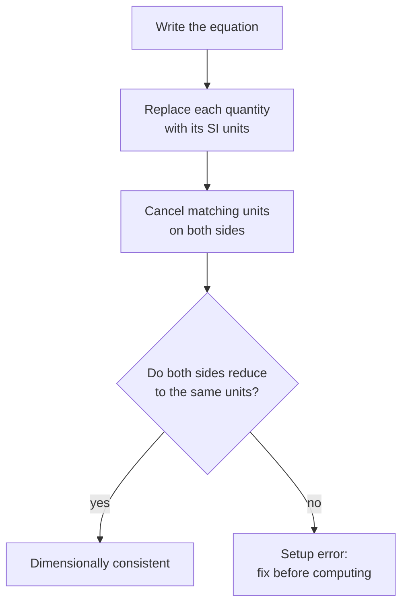

# Physics Lessons (Track C — scaled draft)

Auto-drafted lesson pages for the 26 `Physics::` KCs in the frozen unified map (`added features/kc-map-unified.md` §6/§7). Schema + style follow `added features/lessons.md`. All content is synthetic and original (not copied from any copyrighted prep material). New lessons are `Source: authored`, `Review Status: needs_review` (hidden behind the display gate until a human approves them, per `lesson-contract.md` §4).

## Physics::Units_And_Measurement

### LESSON-PHYSICS-UNITS-AND-MEASUREMENT

- **KC:** `Physics::Units_And_Measurement`
- **Title:** Units and Measurement: SI, Dimensions, and Vectors
- **Section:** `MCAT::Chem_Phys`
- **Source:** authored
- **Review Status:** needs_review
- **Overview:** Physics begins with measuring quantities and tracking their units. Every valid equation must be dimensionally consistent, and every quantity is either a scalar (magnitude only) or a vector (magnitude and direction). Fluency with unit conversion, significant figures, and vector components makes every later topic faster and less error-prone.
- **Key Concepts:**
  - SI base units to know: meter (length), kilogram (mass), second (time), ampere (current), kelvin (temperature), mole (amount).
  - Dimensional analysis: both sides of any valid equation must carry the same units, so a unit check catches setup errors early.
  - Scalars have magnitude only (mass, speed, energy); vectors have magnitude and direction (displacement, velocity, force).
  - A vector resolves into components: Vx = V*cos(theta) and Vy = V*sin(theta); perpendicular components add independently.
  - Significant figures and scientific notation track how precise a measured or computed value really is.
- **Prerequisite Reminder:** Foundation KC - no prerequisites assumed beyond basic algebra, arithmetic, and trigonometry.
- **Worked Example:** Convert 72 km/h to m/s. Multiply by 1000 m per km and divide by 3600 s per h: 72 * 1000 / 3600 = 20 m/s. Watching the units cancel (km cancels km, h cancels h) confirms the setup before you trust the number.
- **Common Misconception:** "Any two numbers of similar size can be added." Named: unit-blind arithmetic. You can only add quantities with identical dimensions - you cannot add a speed in m/s to a speed in km/h without converting first, and you can never add a force to an energy.
- **First Retrieval Prompt:** Without looking back, state whether velocity, temperature, mass, and displacement are scalars or vectors, and give the SI base unit for each.
- **Related KCs:** `Physics::Kinematics`
- **Diagram:** Vector V resolved into perpendicular components Vx = V cos theta and Vy = V sin theta, meeting at a right angle

<figure class="lesson-diagram">
<svg xmlns="http://www.w3.org/2000/svg" viewBox="0 0 540 440" role="img" aria-labelledby="t d" font-family="-apple-system, Segoe UI, Roboto, sans-serif">
  <title id="t">Resolving a vector into perpendicular components</title>
  <desc id="d">A vector V is drawn from the origin at angle theta above the horizontal axis. Its horizontal component Vx equals V times cosine theta and its vertical component Vy equals V times sine theta. The two components meet at a right angle and add back to V.</desc>
  <defs>
    <marker id="ah" viewBox="0 0 10 10" refX="8" refY="5" markerWidth="7" markerHeight="7" orient="auto"><path d="M0,0 L10,5 L0,10 z" fill="#1565c0"/></marker>
    <marker id="ag" viewBox="0 0 10 10" refX="8" refY="5" markerWidth="7" markerHeight="7" orient="auto"><path d="M0,0 L10,5 L0,10 z" fill="#2e7d32"/></marker>
    <marker id="ao" viewBox="0 0 10 10" refX="8" refY="5" markerWidth="7" markerHeight="7" orient="auto"><path d="M0,0 L10,5 L0,10 z" fill="#ef6c00"/></marker>
    <marker id="ak" viewBox="0 0 10 10" refX="8" refY="5" markerWidth="7" markerHeight="7" orient="auto"><path d="M0,0 L10,5 L0,10 z" fill="#546e7a"/></marker>
  </defs>
  <rect x="6" y="6" width="528" height="428" rx="14" fill="#ffffff" stroke="#cfd8dc" stroke-width="2"/>
  <text x="270" y="34" text-anchor="middle" font-size="18" font-weight="700" fill="#263238">Resolving a vector into components</text>

  <line x1="110" y1="330" x2="470" y2="330" stroke="#546e7a" stroke-width="2" marker-end="url(#ak)"/>
  <line x1="110" y1="330" x2="110" y2="86" stroke="#546e7a" stroke-width="2" marker-end="url(#ak)"/>
  <text x="476" y="335" font-size="13" fill="#37474f">x</text>
  <text x="102" y="82" font-size="13" fill="#37474f">y</text>

  <line x1="110" y1="150" x2="350" y2="150" stroke="#b0bec5" stroke-width="1.5" stroke-dasharray="4 4"/>

  <line x1="110" y1="330" x2="344" y2="330" stroke="#2e7d32" stroke-width="4" marker-end="url(#ag)"/>
  <line x1="350" y1="330" x2="350" y2="156" stroke="#ef6c00" stroke-width="4" marker-end="url(#ao)"/>
  <path d="M336,330 L336,316 L350,316" fill="none" stroke="#90a4ae" stroke-width="1.5"/>

  <line x1="110" y1="330" x2="347" y2="152" stroke="#1565c0" stroke-width="5" marker-end="url(#ah)"/>

  <path d="M170,330 A60,60 0 0,0 158,294" fill="none" stroke="#37474f" stroke-width="2"/>
  <text x="158" y="320" font-size="15" fill="#37474f">&#952;</text>

  <text x="216" y="228" font-size="17" font-weight="700" fill="#1565c0">V</text>
  <text x="222" y="352" font-size="14" font-weight="700" fill="#2e7d32">Vx = V cos&#952;</text>
  <text x="360" y="248" font-size="14" font-weight="700" fill="#ef6c00">Vy = V sin&#952;</text>

  <text x="270" y="402" text-anchor="middle" font-size="12" font-weight="600" fill="#37474f">A vector splits into perpendicular components that add independently</text>
  <text x="270" y="422" text-anchor="middle" font-size="12" fill="#607d8b">magnitude V = sqrt(Vx&#178; + Vy&#178;) &#183; direction &#952; = arctan(Vy / Vx)</text>
</svg>
</figure>
- **Diagram:** Dimensional-analysis check for any physics equation:

## Physics::Kinematics

### LESSON-PHYSICS-KINEMATICS

- **KC:** `Physics::Kinematics`
- **Title:** Kinematics: Describing Motion
- **Section:** `MCAT::Chem_Phys`
- **Source:** authored
- **Review Status:** needs_review
- **Overview:** Kinematics describes how objects move - position, velocity, and acceleration - without yet asking what causes the motion. For constant acceleration, a small set of equations links these quantities over time. It is the vocabulary every later mechanics topic reuses.
- **Key Concepts:**
  - Displacement is a vector (change in position); distance is the scalar path length actually traveled.
  - Velocity is the rate of change of displacement; acceleration is the rate of change of velocity.
  - Constant-acceleration equations, e.g. v = v0 + a*t and x = x0 + v0*t + (1/2)*a*t^2.
  - Free fall is constant-acceleration motion with a = g, about 9.8 m/s^2 directed downward.
  - Projectile motion splits into independent horizontal (constant velocity) and vertical (constant acceleration) parts.
- **Prerequisite Reminder:** Build on `Physics::Units_And_Measurement`: keep quantities as vectors with consistent units, and resolve two-dimensional motion into x and y components.
- **Worked Example:** A ball is dropped from rest and falls for 2.0 s. Using v = v0 + a*t with v0 = 0 and a = 9.8 m/s^2, v = 0 + (9.8)(2.0) = 19.6 m/s downward. Its drop distance is x = (1/2)(9.8)(2.0)^2 = 19.6 m.
- **Common Misconception:** "Heavier objects fall faster." Named: mass-dependent free fall. Ignoring air resistance, all objects near Earth's surface accelerate at the same g regardless of mass, so a feather and a hammer dropped in a vacuum land together.
- **First Retrieval Prompt:** From memory, explain why the horizontal and vertical motions of a projectile can be analyzed separately, and state what stays constant in each direction.
- **Related KCs:** `Physics::Units_And_Measurement`, `Physics::Newtons_Laws`
- **Diagram:** Constant-acceleration graphs: a straight-line velocity-time graph and an upward-curving position-time parabola

<figure class="lesson-diagram">
<svg xmlns="http://www.w3.org/2000/svg" viewBox="0 0 540 440" role="img" aria-labelledby="t d" font-family="-apple-system, Segoe UI, Roboto, sans-serif">
  <title id="t">Constant-acceleration motion graphs</title>
  <desc id="d">Two graphs for motion at constant acceleration. The velocity versus time graph is a straight line with positive slope because equal velocity is added each second. The position versus time graph is an upward-curving parabola because distance grows with the square of time.</desc>
  <defs>
    <marker id="ak" viewBox="0 0 10 10" refX="8" refY="5" markerWidth="7" markerHeight="7" orient="auto"><path d="M0,0 L10,5 L0,10 z" fill="#546e7a"/></marker>
  </defs>
  <rect x="6" y="6" width="528" height="428" rx="14" fill="#ffffff" stroke="#cfd8dc" stroke-width="2"/>
  <text x="270" y="34" text-anchor="middle" font-size="18" font-weight="700" fill="#263238">Constant acceleration: v-t is linear, x-t is a parabola</text>

  <text x="160" y="78" text-anchor="middle" font-size="14" font-weight="700" fill="#37474f">velocity vs time</text>
  <line x1="70" y1="250" x2="258" y2="250" stroke="#546e7a" stroke-width="2" marker-end="url(#ak)"/>
  <line x1="70" y1="250" x2="70" y2="92" stroke="#546e7a" stroke-width="2" marker-end="url(#ak)"/>
  <text x="262" y="255" font-size="12" fill="#37474f">t</text>
  <text x="60" y="90" font-size="12" fill="#37474f">v</text>
  <line x1="70" y1="212" x2="246" y2="104" stroke="#1565c0" stroke-width="4"/>
  <circle cx="70" cy="212" r="3.5" fill="#1565c0"/>
  <line x1="70" y1="212" x2="70" y2="250" stroke="#b0bec5" stroke-width="1.5" stroke-dasharray="4 4"/>
  <text x="46" y="216" font-size="11" fill="#607d8b">v0</text>
  <text x="150" y="150" font-size="11" fill="#1565c0">slope = a</text>
  <text x="160" y="284" text-anchor="middle" font-size="12" fill="#37474f">v = v0 + a t</text>

  <text x="400" y="78" text-anchor="middle" font-size="14" font-weight="700" fill="#37474f">position vs time</text>
  <line x1="310" y1="250" x2="498" y2="250" stroke="#546e7a" stroke-width="2" marker-end="url(#ak)"/>
  <line x1="310" y1="250" x2="310" y2="92" stroke="#546e7a" stroke-width="2" marker-end="url(#ak)"/>
  <text x="502" y="255" font-size="12" fill="#37474f">t</text>
  <text x="300" y="90" font-size="12" fill="#37474f">x</text>
  <path d="M310,240 Q412,240 490,104" fill="none" stroke="#c62828" stroke-width="4"/>
  <text x="400" y="284" text-anchor="middle" font-size="12" fill="#37474f">x = x0 + v0 t + &#189; a t&#178;</text>

  <text x="270" y="402" text-anchor="middle" font-size="12" font-weight="600" fill="#37474f">Slope of v-t is acceleration; area under v-t is displacement</text>
  <text x="270" y="422" text-anchor="middle" font-size="12" fill="#607d8b">constant a &#8594; velocity rises linearly, position rises with t&#178;</text>
</svg>
</figure>
- **Diagram:** Choosing a constant-acceleration equation by what is unknown:

```mermaid
flowchart TD
    A{"Which variable is<br/>NOT in the problem?"} -->|"no displacement x"| B["v = v0 + a t"]
    A -->|"no final velocity v"| C["x = x0 + v0 t + &#189; a t&#178;"]
    A -->|"no time t"| D["v&#178; = v0&#178; + 2 a &#916;x"]
    A -->|"acceleration a = 0"| E["x = x0 + v t"]
```

## Physics::Newtons_Laws

### LESSON-PHYSICS-NEWTONS-LAWS

- **KC:** `Physics::Newtons_Laws`
- **Title:** Newton's Laws: Forces and Motion
- **Section:** `MCAT::Chem_Phys`
- **Source:** authored
- **Review Status:** needs_review
- **Overview:** Newton's three laws connect the forces on an object to how its motion changes. They turn a free-body diagram - a picture of every force acting on an object - into a prediction of its acceleration. This is the causal core of classical mechanics.
- **Key Concepts:**
  - 1st law (inertia): with zero net force, an object keeps constant velocity, including staying at rest.
  - 2nd law: net force equals mass times acceleration (F_net = m*a); acceleration points along the net force.
  - 3rd law: forces occur in equal-and-opposite pairs that act on two different objects.
  - Weight is a force (W = m*g); mass is the amount of matter and does not change with location.
  - Common forces: normal, tension, friction (kinetic f = mu*N; static up to mu*N); centripetal force is the net inward force in circular motion.
- **Prerequisite Reminder:** Build on `Physics::Kinematics`: Newton's laws supply the acceleration that the kinematics equations then turn into velocity and position.
- **Worked Example:** A 2.0 kg block is pushed by a net horizontal force of 6.0 N on a frictionless floor. By F_net = m*a, a = 6.0 / 2.0 = 3.0 m/s^2. If a 4.0 N friction force now opposes the 6.0 N push, the net force is 2.0 N and a = 1.0 m/s^2 - same mass, smaller net force, smaller acceleration.
- **Common Misconception:** "Motion requires a continuous net force." Named: the coasting fallacy. A net force changes velocity; constant velocity needs zero net force, so an object gliding at steady speed has balanced forces, not a leftover forward push.
- **First Retrieval Prompt:** From memory, explain why the action-reaction pair in Newton's third law does not cancel to produce zero motion, even though the two forces are equal and opposite.
- **Related KCs:** `Physics::Kinematics`, `Physics::Force_Equilibrium`, `Physics::Work_And_Energy`, `Physics::Momentum_And_Impulse`
- **Diagram:** Free-body diagram of a block on a surface with weight down, normal force up, applied force right, and friction left

<figure class="lesson-diagram">
<svg xmlns="http://www.w3.org/2000/svg" viewBox="0 0 540 440" role="img" aria-labelledby="t d" font-family="-apple-system, Segoe UI, Roboto, sans-serif">
  <title id="t">Free-body diagram of a block on a surface</title>
  <desc id="d">A block rests on a horizontal surface. Four forces act at its center: weight m g points straight down, the normal force N points straight up, an applied force F points right, and friction f points left opposing motion. The net force determines the acceleration.</desc>
  <defs>
    <marker id="ar" viewBox="0 0 10 10" refX="8" refY="5" markerWidth="7" markerHeight="7" orient="auto"><path d="M0,0 L10,5 L0,10 z" fill="#c62828"/></marker>
    <marker id="ab" viewBox="0 0 10 10" refX="8" refY="5" markerWidth="7" markerHeight="7" orient="auto"><path d="M0,0 L10,5 L0,10 z" fill="#1565c0"/></marker>
    <marker id="ag" viewBox="0 0 10 10" refX="8" refY="5" markerWidth="7" markerHeight="7" orient="auto"><path d="M0,0 L10,5 L0,10 z" fill="#2e7d32"/></marker>
    <marker id="ao" viewBox="0 0 10 10" refX="8" refY="5" markerWidth="7" markerHeight="7" orient="auto"><path d="M0,0 L10,5 L0,10 z" fill="#ef6c00"/></marker>
  </defs>
  <rect x="6" y="6" width="528" height="428" rx="14" fill="#ffffff" stroke="#cfd8dc" stroke-width="2"/>
  <text x="270" y="34" text-anchor="middle" font-size="18" font-weight="700" fill="#263238">Free-body diagram of a block</text>

  <line x1="120" y1="300" x2="420" y2="300" stroke="#546e7a" stroke-width="3"/>
  <g stroke="#b0bec5" stroke-width="2">
    <line x1="130" y1="300" x2="118" y2="314"/><line x1="160" y1="300" x2="148" y2="314"/>
    <line x1="190" y1="300" x2="178" y2="314"/><line x1="220" y1="300" x2="208" y2="314"/>
    <line x1="250" y1="300" x2="238" y2="314"/><line x1="280" y1="300" x2="268" y2="314"/>
    <line x1="310" y1="300" x2="298" y2="314"/><line x1="340" y1="300" x2="328" y2="314"/>
    <line x1="370" y1="300" x2="358" y2="314"/><line x1="400" y1="300" x2="388" y2="314"/>
  </g>
  <rect x="228" y="252" width="84" height="48" rx="4" fill="#bbdefb" stroke="#1565c0" stroke-width="2"/>
  <circle cx="270" cy="276" r="4" fill="#263238"/>

  <line x1="270" y1="276" x2="270" y2="366" stroke="#c62828" stroke-width="4" marker-end="url(#ar)"/>
  <text x="280" y="356" font-size="14" font-weight="700" fill="#c62828">W = m g</text>

  <line x1="270" y1="276" x2="270" y2="150" stroke="#1565c0" stroke-width="4" marker-end="url(#ab)"/>
  <text x="280" y="168" font-size="14" font-weight="700" fill="#1565c0">N (normal)</text>

  <line x1="270" y1="276" x2="404" y2="276" stroke="#2e7d32" stroke-width="4" marker-end="url(#ag)"/>
  <text x="322" y="266" font-size="14" font-weight="700" fill="#2e7d32">F (applied)</text>

  <line x1="270" y1="276" x2="136" y2="276" stroke="#ef6c00" stroke-width="4" marker-end="url(#ao)"/>
  <text x="132" y="266" text-anchor="end" font-size="14" font-weight="700" fill="#ef6c00">f (friction)</text>

  <text x="270" y="402" text-anchor="middle" font-size="12" font-weight="600" fill="#37474f">Newton's 2nd law: net force sets acceleration, F_net = m a</text>
  <text x="270" y="422" text-anchor="middle" font-size="12" fill="#607d8b">vertical balance N = W &#183; horizontal net = F &#8722; f</text>
</svg>
</figure>

## Physics::Force_Equilibrium

### LESSON-PHYSICS-FORCE-EQUILIBRIUM

- **KC:** `Physics::Force_Equilibrium`
- **Title:** Force Equilibrium: Torque and Balance
- **Section:** `MCAT::Chem_Phys`
- **Source:** authored
- **Review Status:** needs_review
- **Overview:** An object is in equilibrium when it has no linear acceleration and no angular acceleration. That requires both the net force and the net torque to be zero. This is the physics behind static structures and behind bones and joints acting as levers.
- **Key Concepts:**
  - Translational equilibrium: the vector sum of forces is zero (sum of Fx = 0 and sum of Fy = 0).
  - Rotational equilibrium: the sum of torques about any chosen axis is zero.
  - Torque = r*F*sin(theta): force times lever arm; only the component perpendicular to the lever arm rotates.
  - The center of gravity is the point where weight effectively acts when you compute torque.
  - Levers trade force for distance; mechanical advantage = output force / input force.
- **Prerequisite Reminder:** Build on `Physics::Newtons_Laws`: equilibrium is the special case F_net = 0 (plus the rotational condition), so the same free-body diagram still drives the setup.
- **Worked Example:** A uniform beam pivots at its center; a 4 N weight sits 0.5 m left of the pivot. To balance it, place a weight W at distance d on the right so torques cancel: (4)(0.5) = W*d. If d = 1.0 m, then W = 2.0 / 1.0 = 2.0 N. A smaller weight balances a larger one by sitting farther from the pivot.
- **Common Misconception:** "Equilibrium means the object is at rest." Named: static-only equilibrium. Zero net force means zero acceleration, so an object moving at constant velocity is also in (dynamic) equilibrium - equilibrium is about balanced forces, not zero speed.
- **First Retrieval Prompt:** From memory, state the two independent conditions that must both hold for a rigid body to be in complete equilibrium, and explain why choosing a smart pivot point simplifies a torque problem.
- **Related KCs:** `Physics::Newtons_Laws`, `Physics::Rotational_Motion`, `Physics::Periodic_Motion`, `Physics::Fluid_Statics`
- **Diagram:** Lever balanced on a central pivot where a 4 N weight at 0.5 m balances a 2 N weight at 1.0 m

<figure class="lesson-diagram">
<svg xmlns="http://www.w3.org/2000/svg" viewBox="0 0 540 440" role="img" aria-labelledby="t d" font-family="-apple-system, Segoe UI, Roboto, sans-serif">
  <title id="t">Torque balance on a lever</title>
  <desc id="d">A uniform beam rests on a central pivot. A 4 newton weight hangs 0.5 meters left of the pivot and a 2 newton weight hangs 1.0 meter right. The counterclockwise torque from the left weight equals the clockwise torque from the right weight, so the beam is in rotational equilibrium.</desc>
  <defs>
    <marker id="ar" viewBox="0 0 10 10" refX="8" refY="5" markerWidth="7" markerHeight="7" orient="auto"><path d="M0,0 L10,5 L0,10 z" fill="#c62828"/></marker>
    <marker id="ad" viewBox="0 0 10 10" refX="8" refY="5" markerWidth="8" markerHeight="8" orient="auto"><path d="M0,0 L10,5 L0,10 z" fill="#546e7a"/></marker>
  </defs>
  <rect x="6" y="6" width="528" height="428" rx="14" fill="#ffffff" stroke="#cfd8dc" stroke-width="2"/>
  <text x="270" y="34" text-anchor="middle" font-size="18" font-weight="700" fill="#263238">Torque balance on a lever</text>

  <rect x="100" y="196" width="340" height="12" rx="3" fill="#90a4ae"/>
  <polygon points="270,208 250,250 290,250" fill="#607d8b"/>
  <text x="270" y="268" text-anchor="middle" font-size="12" fill="#607d8b">pivot</text>

  <line x1="190" y1="208" x2="190" y2="248" stroke="#37474f" stroke-width="2"/>
  <rect x="166" y="248" width="48" height="38" rx="4" fill="#1565c0"/>
  <text x="190" y="272" text-anchor="middle" font-size="14" font-weight="700" fill="#ffffff">4 N</text>
  <line x1="190" y1="290" x2="190" y2="316" stroke="#c62828" stroke-width="3" marker-end="url(#ar)"/>

  <line x1="430" y1="208" x2="430" y2="248" stroke="#37474f" stroke-width="2"/>
  <rect x="412" y="248" width="36" height="30" rx="4" fill="#1565c0"/>
  <text x="430" y="268" text-anchor="middle" font-size="12" font-weight="700" fill="#ffffff">2 N</text>
  <line x1="430" y1="282" x2="430" y2="316" stroke="#c62828" stroke-width="3" marker-end="url(#ar)"/>

  <line x1="190" y1="340" x2="270" y2="340" stroke="#546e7a" stroke-width="1.5" marker-start="url(#ad)" marker-end="url(#ad)"/>
  <line x1="270" y1="340" x2="430" y2="340" stroke="#546e7a" stroke-width="1.5" marker-start="url(#ad)" marker-end="url(#ad)"/>
  <line x1="190" y1="316" x2="190" y2="346" stroke="#b0bec5" stroke-width="1" stroke-dasharray="3 3"/>
  <line x1="270" y1="250" x2="270" y2="346" stroke="#b0bec5" stroke-width="1" stroke-dasharray="3 3"/>
  <line x1="430" y1="316" x2="430" y2="346" stroke="#b0bec5" stroke-width="1" stroke-dasharray="3 3"/>
  <text x="230" y="334" text-anchor="middle" font-size="12" fill="#37474f">0.5 m</text>
  <text x="350" y="334" text-anchor="middle" font-size="12" fill="#37474f">1.0 m</text>

  <text x="270" y="402" text-anchor="middle" font-size="12" font-weight="600" fill="#37474f">Rotational equilibrium: counterclockwise torque = clockwise torque</text>
  <text x="270" y="422" text-anchor="middle" font-size="12" fill="#607d8b">(4 N)(0.5 m) = (2 N)(1.0 m) = 2 N&#183;m &#183; torque = force &#215; lever arm</text>
</svg>
</figure>

## Physics::Work_And_Energy

### LESSON-PHYSICS-WORK-AND-ENERGY

- **KC:** `Physics::Work_And_Energy`
- **Title:** Work and Energy: Conservation and Power
- **Section:** `MCAT::Chem_Phys`
- **Source:** authored
- **Review Status:** needs_review
- **Overview:** Work is how a force transfers energy, and energy conservation lets you solve motion problems without tracking every force through time. Following kinetic and potential energy - and the power at which energy is transferred - is one of the most reliable MCAT problem-solving tools.
- **Key Concepts:**
  - Work W = F*d*cos(theta): only the force component along the displacement does work.
  - Work-energy theorem: net work equals the change in kinetic energy.
  - Kinetic energy = (1/2)*m*v^2; gravitational PE = m*g*h; elastic (spring) PE = (1/2)*k*x^2.
  - Mechanical energy is conserved when only conservative forces act; friction converts mechanical energy into heat.
  - Power = energy transferred per second (watts); P = F*v.
- **Prerequisite Reminder:** Build on `Physics::Newtons_Laws`: work is done by the same forces you drew in the free-body diagram, and the work-energy theorem is F = m*a applied over a distance.
- **Worked Example:** A 1.0 kg ball is released from rest at height 5.0 m. Ignoring air resistance, energy conservation gives m*g*h = (1/2)*m*v^2, so v = sqrt(2*g*h) = sqrt(2 * 9.8 * 5.0), about 9.9 m/s at the bottom. Notice mass cancels - drop height alone sets the impact speed.
- **Common Misconception:** "Holding a heavy object still does physical work." Named: effort-equals-work. In physics, work requires displacement along the force; holding an object at constant height does zero mechanical work no matter how tiring it feels.
- **First Retrieval Prompt:** From memory, explain why carrying a box horizontally at constant speed does no work against gravity, and where the walker's energy actually goes.
- **Related KCs:** `Physics::Newtons_Laws`, `Physics::Rotational_Motion`, `Physics::Periodic_Motion`, `Physics::Fluid_Dynamics`, `Physics::Thermodynamics`, `Physics::Electrostatics`, `GenChem::Thermochemistry`
- **Diagram:** Frictionless incline with energy bar charts showing potential energy at the top converting to kinetic energy at the bottom

<figure class="lesson-diagram">
<svg xmlns="http://www.w3.org/2000/svg" viewBox="0 0 540 440" role="img" aria-labelledby="t d" font-family="-apple-system, Segoe UI, Roboto, sans-serif">
  <title id="t">Energy conservation on a frictionless incline</title>
  <desc id="d">A block starts at rest at the top of a frictionless incline holding gravitational potential energy m g h. As it slides down, potential energy converts into kinetic energy. The bar charts show that potential plus kinetic energy stays constant: all potential at the top, half and half partway down, and all kinetic at the bottom.</desc>
  <defs>
    <marker id="ag" viewBox="0 0 10 10" refX="8" refY="5" markerWidth="7" markerHeight="7" orient="auto"><path d="M0,0 L10,5 L0,10 z" fill="#2e7d32"/></marker>
    <marker id="ad" viewBox="0 0 10 10" refX="8" refY="5" markerWidth="8" markerHeight="8" orient="auto"><path d="M0,0 L10,5 L0,10 z" fill="#546e7a"/></marker>
  </defs>
  <rect x="6" y="6" width="528" height="428" rx="14" fill="#ffffff" stroke="#cfd8dc" stroke-width="2"/>
  <text x="270" y="34" text-anchor="middle" font-size="18" font-weight="700" fill="#263238">Energy conservation on a frictionless incline</text>

  <polygon points="90,320 90,168 300,320" fill="#eceff1" stroke="#90a4ae" stroke-width="2"/>
  <rect x="108" y="176" width="24" height="18" rx="3" fill="#64b5f6" stroke="#1565c0" stroke-width="1.5"/>
  <rect x="256" y="300" width="24" height="18" rx="3" fill="#cfd8dc" stroke="#90a4ae" stroke-width="1.5"/>
  <line x1="140" y1="204" x2="240" y2="284" stroke="#2e7d32" stroke-width="3" marker-end="url(#ag)"/>
  <line x1="72" y1="176" x2="72" y2="320" stroke="#546e7a" stroke-width="1.5" marker-start="url(#ad)" marker-end="url(#ad)"/>
  <text x="60" y="252" text-anchor="middle" font-size="13" fill="#37474f">h</text>
  <text x="120" y="212" font-size="11" fill="#607d8b">v = 0</text>
  <text x="250" y="296" font-size="11" fill="#607d8b">v (fast)</text>

  <line x1="338" y1="150" x2="506" y2="150" stroke="#90a4ae" stroke-width="1.5" stroke-dasharray="5 4"/>
  <text x="422" y="144" text-anchor="middle" font-size="11" fill="#607d8b">E total (constant)</text>
  <line x1="345" y1="150" x2="345" y2="320" stroke="#546e7a" stroke-width="1.5"/>
  <line x1="345" y1="320" x2="505" y2="320" stroke="#546e7a" stroke-width="1.5"/>

  <rect x="352" y="150" width="38" height="170" fill="#1565c0"/>
  <rect x="408" y="235" width="38" height="85" fill="#1565c0"/>
  <rect x="408" y="150" width="38" height="85" fill="#ef6c00"/>
  <rect x="464" y="150" width="38" height="170" fill="#ef6c00"/>

  <text x="371" y="336" text-anchor="middle" font-size="11" fill="#37474f">top</text>
  <text x="427" y="336" text-anchor="middle" font-size="11" fill="#37474f">midway</text>
  <text x="483" y="336" text-anchor="middle" font-size="11" fill="#37474f">bottom</text>

  <text x="270" y="402" text-anchor="middle" font-size="12" font-weight="600" fill="#37474f">Frictionless: potential energy at top becomes kinetic energy at bottom</text>
  <text x="270" y="422" text-anchor="middle" font-size="12" fill="#607d8b">m g h = &#189; m v&#178; &#183; blue = PE, orange = KE, total height constant</text>
</svg>
</figure>

## Physics::Momentum_And_Impulse

### LESSON-PHYSICS-MOMENTUM-AND-IMPULSE

- **KC:** `Physics::Momentum_And_Impulse`
- **Title:** Momentum and Impulse: Collisions
- **Section:** `MCAT::Chem_Phys`
- **Source:** authored
- **Review Status:** needs_review
- **Overview:** Momentum measures how hard it is to stop a moving object, and impulse is how a force applied over time changes it. In any collision with no external net force, total momentum is conserved, which is what makes collision problems solvable. Recognizing whether a collision is elastic or inelastic tells you which quantities to conserve.
- **Key Concepts:**
  - Momentum p = m*v is a vector; the total momentum of an isolated system is conserved.
  - Impulse = force times time interval = change in momentum.
  - Elastic collisions conserve both momentum and kinetic energy; inelastic collisions conserve only momentum.
  - In a perfectly inelastic collision the objects stick together and move as one.
  - Spreading a collision over more time (crumple zones, airbags) lowers the peak force for the same change in momentum.
- **Prerequisite Reminder:** Build on `Physics::Newtons_Laws`: impulse-momentum is Newton's second law rewritten as force = change in momentum / time, and the third law is why colliding bodies conserve momentum.
- **Worked Example:** A 2.0 kg cart at 3.0 m/s strikes and sticks to a 1.0 kg cart at rest. Conserving momentum: (2.0)(3.0) + 0 = (2.0 + 1.0)*v, so v = 6.0 / 3.0 = 2.0 m/s. The combined cart moves slower because the same momentum is now shared by more mass.
- **Common Misconception:** "Momentum and kinetic energy are both always conserved in a collision." Named: conflating the two conservation laws. Momentum is conserved in every collision with no external force, but kinetic energy is conserved only in elastic collisions; inelastic collisions convert some KE into heat and deformation.
- **First Retrieval Prompt:** From memory, explain how an airbag reduces injury in terms of impulse, force, and collision time, even though the change in momentum is the same.
- **Related KCs:** `Physics::Newtons_Laws`
- **Diagram:** Perfectly inelastic collision before and after: a 2 kg cart at 3 m/s hits a 1 kg cart at rest, and they stick and move at 2 m/s

<figure class="lesson-diagram">
<svg xmlns="http://www.w3.org/2000/svg" viewBox="0 0 540 440" role="img" aria-labelledby="t d" font-family="-apple-system, Segoe UI, Roboto, sans-serif">
  <title id="t">Momentum conservation in a perfectly inelastic collision</title>
  <desc id="d">Before the collision a 2 kilogram cart moves right at 3 meters per second toward a 1 kilogram cart at rest. After the collision the carts stick together and the combined 3 kilogram mass moves right at 2 meters per second, so total momentum before equals total momentum after.</desc>
  <defs>
    <marker id="ag" viewBox="0 0 10 10" refX="8" refY="5" markerWidth="7" markerHeight="7" orient="auto"><path d="M0,0 L10,5 L0,10 z" fill="#2e7d32"/></marker>
  </defs>
  <rect x="6" y="6" width="528" height="428" rx="14" fill="#ffffff" stroke="#cfd8dc" stroke-width="2"/>
  <text x="270" y="34" text-anchor="middle" font-size="18" font-weight="700" fill="#263238">Perfectly inelastic collision</text>

  <text x="70" y="120" font-size="14" font-weight="700" fill="#37474f">Before</text>
  <line x1="120" y1="170" x2="430" y2="170" stroke="#cfd8dc" stroke-width="2"/>
  <rect x="150" y="128" width="74" height="42" rx="4" fill="#64b5f6" stroke="#1565c0" stroke-width="2"/>
  <text x="187" y="154" text-anchor="middle" font-size="14" font-weight="700" fill="#ffffff">2 kg</text>
  <line x1="228" y1="149" x2="302" y2="149" stroke="#2e7d32" stroke-width="4" marker-end="url(#ag)"/>
  <text x="264" y="141" text-anchor="middle" font-size="12" font-weight="700" fill="#2e7d32">3 m/s</text>
  <rect x="352" y="128" width="60" height="42" rx="4" fill="#b0bec5" stroke="#607d8b" stroke-width="2"/>
  <text x="382" y="154" text-anchor="middle" font-size="13" font-weight="700" fill="#37474f">1 kg</text>
  <text x="382" y="190" text-anchor="middle" font-size="11" fill="#607d8b">v = 0 (at rest)</text>

  <line x1="60" y1="224" x2="480" y2="224" stroke="#e0e0e0" stroke-width="1.5" stroke-dasharray="5 4"/>

  <text x="70" y="266" font-size="14" font-weight="700" fill="#37474f">After</text>
  <line x1="120" y1="316" x2="470" y2="316" stroke="#cfd8dc" stroke-width="2"/>
  <rect x="250" y="274" width="72" height="42" rx="4" fill="#64b5f6" stroke="#1565c0" stroke-width="2"/>
  <text x="286" y="300" text-anchor="middle" font-size="13" font-weight="700" fill="#ffffff">2 kg</text>
  <rect x="322" y="274" width="52" height="42" rx="4" fill="#b0bec5" stroke="#607d8b" stroke-width="2"/>
  <text x="348" y="300" text-anchor="middle" font-size="12" font-weight="700" fill="#37474f">1 kg</text>
  <line x1="378" y1="295" x2="446" y2="295" stroke="#2e7d32" stroke-width="4" marker-end="url(#ag)"/>
  <text x="412" y="287" text-anchor="middle" font-size="12" font-weight="700" fill="#2e7d32">2 m/s</text>
  <text x="311" y="336" text-anchor="middle" font-size="11" fill="#607d8b">stuck together (3 kg)</text>

  <text x="270" y="402" text-anchor="middle" font-size="12" font-weight="600" fill="#37474f">No external force: total momentum before = total momentum after</text>
  <text x="270" y="422" text-anchor="middle" font-size="12" fill="#607d8b">(2)(3) + (1)(0) = 6 kg&#183;m/s = (2 + 1)(2) &#183; KE not conserved</text>
</svg>
</figure>

## Physics::Rotational_Motion

### LESSON-PHYSICS-ROTATIONAL-MOTION

- **KC:** `Physics::Rotational_Motion`
- **Title:** Rotational Motion: Angular Dynamics
- **Section:** `MCAT::Chem_Phys`
- **Source:** authored
- **Review Status:** needs_review
- **Overview:** Rotational motion mirrors linear motion with angular versions of position, velocity, and acceleration, plus moment of inertia in place of mass. Angular momentum is conserved when no net external torque acts. This is a narrower, higher-difficulty topic on the MCAT.
- **Key Concepts:**
  - Angular quantities: angular displacement (theta), angular velocity (omega), angular acceleration (alpha), with v = r*omega.
  - Moment of inertia I is rotational inertia; it grows with mass and with how far that mass sits from the axis.
  - Torque = I*alpha is the rotational analog of F = m*a.
  - Angular momentum L = I*omega is conserved when the net external torque is zero.
  - Rotational kinetic energy = (1/2)*I*omega^2 adds to translational KE for rolling objects.
- **Prerequisite Reminder:** Build on `Physics::Force_Equilibrium` (torque and lever arms) and `Physics::Work_And_Energy` (energy bookkeeping), now extended to spinning bodies.
- **Worked Example:** A spinning skater pulls her arms in, cutting her moment of inertia I in half. With no external torque, L = I*omega is conserved, so halving I doubles omega - she spins twice as fast. Her rotational KE = (1/2)*I*omega^2 actually rises, supplied by the muscular work of pulling her arms inward.
- **Common Misconception:** "Conserving angular momentum keeps rotational kinetic energy constant too." Named: L-implies-KE. Angular momentum and rotational KE are different quantities; when the skater pulls in, L stays fixed but KE increases because she does work against the inward pull.
- **First Retrieval Prompt:** From memory, explain why moving closer to the axis of a spinning platform changes your moment of inertia, and how that affects the torque needed to spin you up.
- **Related KCs:** `Physics::Force_Equilibrium`, `Physics::Work_And_Energy`
- **Diagram:** Force applied to a rotating disk, with only the perpendicular component F sin theta producing torque equal to r F sin theta

<figure class="lesson-diagram">
<svg xmlns="http://www.w3.org/2000/svg" viewBox="0 0 540 440" role="img" aria-labelledby="t d" font-family="-apple-system, Segoe UI, Roboto, sans-serif">
  <title id="t">Torque from a force applied to a rotating disk</title>
  <desc id="d">A disk turns about a central axle. A force F is applied at the end of a radius r, making angle theta with the radius. Only the component of F perpendicular to the radius, F sine theta, produces torque. Torque equals r times F sine theta, which equals the moment of inertia times angular acceleration.</desc>
  <defs>
    <marker id="ab" viewBox="0 0 10 10" refX="8" refY="5" markerWidth="7" markerHeight="7" orient="auto"><path d="M0,0 L10,5 L0,10 z" fill="#1565c0"/></marker>
    <marker id="ar" viewBox="0 0 10 10" refX="8" refY="5" markerWidth="7" markerHeight="7" orient="auto"><path d="M0,0 L10,5 L0,10 z" fill="#c62828"/></marker>
    <marker id="ao" viewBox="0 0 10 10" refX="8" refY="5" markerWidth="7" markerHeight="7" orient="auto"><path d="M0,0 L10,5 L0,10 z" fill="#ef6c00"/></marker>
    <marker id="ap" viewBox="0 0 10 10" refX="8" refY="5" markerWidth="8" markerHeight="8" orient="auto"><path d="M0,0 L10,5 L0,10 z" fill="#6a1b9a"/></marker>
  </defs>
  <rect x="6" y="6" width="528" height="428" rx="14" fill="#ffffff" stroke="#cfd8dc" stroke-width="2"/>
  <text x="270" y="34" text-anchor="middle" font-size="18" font-weight="700" fill="#263238">Torque = r &#215; F on a rotating disk</text>

  <circle cx="190" cy="248" r="128" fill="#eceff1" stroke="#b0bec5" stroke-width="2"/>
  <path d="M258,168 A105,105 0 0,0 122,168" fill="none" stroke="#6a1b9a" stroke-width="2.5" marker-end="url(#ap)"/>
  <text x="190" y="136" text-anchor="middle" font-size="15" fill="#6a1b9a">&#969;</text>

  <circle cx="190" cy="248" r="5" fill="#37474f"/>
  <line x1="190" y1="248" x2="312" y2="248" stroke="#1565c0" stroke-width="4" marker-end="url(#ab)"/>
  <text x="250" y="242" text-anchor="middle" font-size="14" font-weight="700" fill="#1565c0">r</text>

  <line x1="318" y1="248" x2="390" y2="248" stroke="#90a4ae" stroke-width="2" stroke-dasharray="5 4" marker-end="url(#ab)"/>
  <line x1="395" y1="248" x2="395" y2="160" stroke="#ef6c00" stroke-width="4" marker-end="url(#ao)"/>
  <line x1="318" y1="248" x2="393" y2="158" stroke="#c62828" stroke-width="4" marker-end="url(#ar)"/>
  <path d="M383,248 L383,236 L395,236" fill="none" stroke="#90a4ae" stroke-width="1.5"/>

  <path d="M358,248 A40,40 0 0,0 344,217" fill="none" stroke="#37474f" stroke-width="2"/>
  <text x="360" y="232" font-size="14" fill="#37474f">&#952;</text>

  <text x="398" y="152" font-size="14" font-weight="700" fill="#c62828">F</text>
  <text x="352" y="266" font-size="12" fill="#607d8b">F cos&#952;</text>
  <text x="402" y="206" font-size="13" font-weight="700" fill="#ef6c00">F sin&#952;</text>

  <text x="270" y="402" text-anchor="middle" font-size="12" font-weight="600" fill="#37474f">Only the perpendicular part F sin&#952; produces torque</text>
  <text x="270" y="422" text-anchor="middle" font-size="12" fill="#607d8b">torque = r F sin&#952; = I &#945; &#183; I is rotational inertia, &#945; is angular acceleration</text>
</svg>
</figure>

## Physics::Periodic_Motion

### LESSON-PHYSICS-PERIODIC-MOTION

- **KC:** `Physics::Periodic_Motion`
- **Title:** Periodic Motion: Simple Harmonic Oscillation
- **Section:** `MCAT::Chem_Phys`
- **Source:** authored
- **Review Status:** needs_review
- **Overview:** Periodic motion repeats in equal time intervals, and simple harmonic motion (SHM) is the special case where the restoring force is proportional to displacement. SHM describes springs and small-angle pendulums and is the bridge from mechanics into waves.
- **Key Concepts:**
  - A restoring force always points back toward equilibrium; for SHM it is proportional to displacement (Hooke's law, F = -k*x).
  - Period T is the time for one full cycle; frequency f = 1/T (hertz).
  - Mass on a spring: T = 2*pi*sqrt(m/k); simple pendulum: T = 2*pi*sqrt(L/g).
  - Energy in SHM trades between kinetic and potential, with total mechanical energy constant if damping is ignored.
  - Amplitude sets the energy but, for ideal SHM, not the period.
- **Prerequisite Reminder:** Build on `Physics::Force_Equilibrium` (a restoring force toward equilibrium) and `Physics::Work_And_Energy` (energy sloshing between kinetic and potential forms).
- **Worked Example:** A mass on a spring has period T = 2*pi*sqrt(m/k). Quadruple the mass and T scales with sqrt(4) = 2, so the period doubles. A pendulum behaves the same way with length: to double its period you must quadruple its length, since T is proportional to sqrt(L).
- **Common Misconception:** "Larger amplitude makes an ideal oscillator take longer per cycle." Named: amplitude-dependent period. For ideal SHM the period depends on mass and stiffness (or length and g), not amplitude; a wider swing simply moves faster and covers more distance in the same time.
- **First Retrieval Prompt:** From memory, explain why a pendulum clock would run at a different rate on the Moon, referring to how T depends on g.
- **Related KCs:** `Physics::Force_Equilibrium`, `Physics::Work_And_Energy`, `Physics::Waves`
- **Diagram:** Mass on a spring with a restoring force and a sine displacement-time curve labeled with amplitude A and period T

<figure class="lesson-diagram">
<svg xmlns="http://www.w3.org/2000/svg" viewBox="0 0 540 440" role="img" aria-labelledby="t d" font-family="-apple-system, Segoe UI, Roboto, sans-serif">
  <title id="t">Simple harmonic motion of a mass on a spring</title>
  <desc id="d">A mass on a spring is displaced from equilibrium, so a restoring force proportional to displacement pulls it back. Its displacement traces a sine curve in time. The amplitude A is the maximum displacement and the period T is the time for one full cycle; for ideal motion the period does not depend on amplitude.</desc>
  <defs>
    <marker id="ar" viewBox="0 0 10 10" refX="8" refY="5" markerWidth="7" markerHeight="7" orient="auto"><path d="M0,0 L10,5 L0,10 z" fill="#c62828"/></marker>
    <marker id="ak" viewBox="0 0 10 10" refX="8" refY="5" markerWidth="8" markerHeight="8" orient="auto"><path d="M0,0 L10,5 L0,10 z" fill="#546e7a"/></marker>
  </defs>
  <rect x="6" y="6" width="528" height="428" rx="14" fill="#ffffff" stroke="#cfd8dc" stroke-width="2"/>
  <text x="270" y="34" text-anchor="middle" font-size="18" font-weight="700" fill="#263238">Simple harmonic motion: restoring force and sine trace</text>

  <rect x="56" y="70" width="8" height="54" fill="#607d8b"/>
  <polyline points="64,97 78,84 92,110 106,84 120,110 134,84 148,110 162,97 182,97" fill="none" stroke="#90a4ae" stroke-width="2.5"/>
  <line x1="164" y1="66" x2="164" y2="150" stroke="#b0bec5" stroke-width="1.5" stroke-dasharray="4 4"/>
  <text x="164" y="164" text-anchor="middle" font-size="10" fill="#607d8b">equilibrium (x = 0)</text>
  <rect x="182" y="78" width="38" height="38" rx="4" fill="#64b5f6" stroke="#1565c0" stroke-width="2"/>
  <text x="201" y="102" text-anchor="middle" font-size="14" font-weight="700" fill="#ffffff">m</text>
  <line x1="201" y1="130" x2="167" y2="130" stroke="#c62828" stroke-width="3" marker-end="url(#ar)"/>
  <text x="235" y="102" font-size="12" fill="#c62828">F = &#8722;k x</text>
  <line x1="164" y1="130" x2="201" y2="130" stroke="#546e7a" stroke-width="1" marker-start="url(#ak)" marker-end="url(#ak)"/>

  <line x1="80" y1="270" x2="470" y2="270" stroke="#b0bec5" stroke-width="1.5" stroke-dasharray="4 4"/>
  <text x="474" y="274" font-size="11" fill="#607d8b">t</text>
  <line x1="90" y1="340" x2="90" y2="196" stroke="#546e7a" stroke-width="2" marker-end="url(#ak)"/>
  <text x="80" y="196" font-size="11" fill="#37474f">x</text>

  <path d="M100,270 C127,197 153,197 180,270 C207,343 233,343 260,270 C287,197 313,197 340,270 C367,343 393,343 420,270" fill="none" stroke="#1565c0" stroke-width="4"/>

  <line x1="140" y1="215" x2="300" y2="215" stroke="#546e7a" stroke-width="1.5" marker-start="url(#ak)" marker-end="url(#ak)"/>
  <text x="220" y="209" text-anchor="middle" font-size="12" font-weight="700" fill="#37474f">T (period)</text>
  <line x1="140" y1="270" x2="140" y2="217" stroke="#2e7d32" stroke-width="1.5" marker-start="url(#ak)" marker-end="url(#ak)"/>
  <text x="150" y="248" font-size="12" font-weight="700" fill="#2e7d32">A</text>

  <text x="270" y="402" text-anchor="middle" font-size="12" font-weight="600" fill="#37474f">Restoring force F = &#8722;k x drives a sinusoidal displacement in time</text>
  <text x="270" y="422" text-anchor="middle" font-size="12" fill="#607d8b">spring: T = 2&#960; sqrt(m/k) &#183; period is independent of amplitude A</text>
</svg>
</figure>

## Physics::Waves

### LESSON-PHYSICS-WAVES

- **KC:** `Physics::Waves`
- **Title:** Waves: Propagation and Superposition
- **Section:** `MCAT::Chem_Phys`
- **Source:** authored
- **Review Status:** needs_review
- **Overview:** A wave carries energy through a medium (or through space) without carrying matter along with it. Understanding wavelength, frequency, and speed - and how waves add by superposition - underlies sound, light, and standing-wave resonance.
- **Key Concepts:**
  - Transverse waves oscillate perpendicular to the direction of travel; longitudinal waves oscillate along it.
  - Wave speed v = f*lambda; speed is set by the medium, so if frequency rises, wavelength falls.
  - Superposition: overlapping waves add, producing constructive and destructive interference.
  - Standing waves form from reflections, with fixed nodes (no motion) and antinodes (maximum motion).
  - Resonance occurs when a driving frequency matches a natural frequency, building large amplitude.
- **Prerequisite Reminder:** Build on `Physics::Periodic_Motion`: a wave is SHM spread across space and time, so period, frequency, and amplitude carry over from a single oscillator to the whole medium.
- **Worked Example:** A wave travels at v = 340 m/s with frequency f = 170 Hz, so lambda = v/f = 340 / 170 = 2.0 m. If it passes into a medium where its speed rises to 680 m/s while the source frequency stays 170 Hz, the wavelength stretches to 4.0 m - frequency is set by the source, and wavelength adjusts to the medium.
- **Common Misconception:** "A wave carries the medium's material along with it." Named: matter-transport view. Waves transport energy and momentum, but each particle of the medium just oscillates about its rest position; a floating cork bobs up and down as a water wave passes rather than traveling with it.
- **First Retrieval Prompt:** From memory, explain what stays the same and what changes when a wave crosses from one medium into another, and why.
- **Related KCs:** `Physics::Periodic_Motion`, `Physics::Sound`, `Physics::Electromagnetic_Radiation`, `Physics::Physical_Optics`
- **Diagram:** Transverse wave drawn about a rest line, labeled with wavelength lambda between crests and amplitude A

<figure class="lesson-diagram">
<svg xmlns="http://www.w3.org/2000/svg" viewBox="0 0 540 440" role="img" aria-labelledby="t d" font-family="-apple-system, Segoe UI, Roboto, sans-serif">
  <title id="t">Transverse wave: wavelength and amplitude</title>
  <desc id="d">A transverse wave drawn as a sine curve about a rest line. The wavelength lambda is the distance between successive crests. The amplitude A is the maximum displacement from the rest position. Particles of the medium move up and down, perpendicular to the direction the wave travels.</desc>
  <defs>
    <marker id="ak" viewBox="0 0 10 10" refX="8" refY="5" markerWidth="8" markerHeight="8" orient="auto"><path d="M0,0 L10,5 L0,10 z" fill="#546e7a"/></marker>
    <marker id="ao" viewBox="0 0 10 10" refX="8" refY="5" markerWidth="7" markerHeight="7" orient="auto"><path d="M0,0 L10,5 L0,10 z" fill="#ef6c00"/></marker>
    <marker id="ag" viewBox="0 0 10 10" refX="8" refY="5" markerWidth="7" markerHeight="7" orient="auto"><path d="M0,0 L10,5 L0,10 z" fill="#2e7d32"/></marker>
  </defs>
  <rect x="6" y="6" width="528" height="428" rx="14" fill="#ffffff" stroke="#cfd8dc" stroke-width="2"/>
  <text x="270" y="34" text-anchor="middle" font-size="18" font-weight="700" fill="#263238">Transverse wave: wavelength and amplitude</text>

  <line x1="70" y1="230" x2="470" y2="230" stroke="#b0bec5" stroke-width="1.5" stroke-dasharray="5 4"/>
  <text x="474" y="234" font-size="11" fill="#607d8b">rest</text>

  <path d="M90,230 C117,150 143,150 170,230 C197,310 223,310 250,230 C277,150 303,150 330,230 C357,310 383,310 410,230" fill="none" stroke="#1565c0" stroke-width="4"/>

  <line x1="150" y1="86" x2="250" y2="86" stroke="#2e7d32" stroke-width="2" marker-end="url(#ag)"/>
  <text x="200" y="80" text-anchor="middle" font-size="11" fill="#2e7d32">direction of travel</text>

  <line x1="130" y1="150" x2="290" y2="150" stroke="#546e7a" stroke-width="1.5" marker-start="url(#ak)" marker-end="url(#ak)"/>
  <text x="210" y="144" text-anchor="middle" font-size="13" font-weight="700" fill="#37474f">&#955; (wavelength)</text>

  <line x1="130" y1="230" x2="130" y2="172" stroke="#c62828" stroke-width="1.5" marker-start="url(#ak)" marker-end="url(#ak)"/>
  <text x="98" y="204" font-size="13" font-weight="700" fill="#c62828">A</text>

  <line x1="410" y1="205" x2="410" y2="255" stroke="#ef6c00" stroke-width="3" marker-start="url(#ao)" marker-end="url(#ao)"/>
  <text x="418" y="234" font-size="11" fill="#ef6c00">particle</text>

  <text x="130" y="140" text-anchor="middle" font-size="11" fill="#607d8b">crest</text>
  <text x="210" y="326" text-anchor="middle" font-size="11" fill="#607d8b">trough</text>

  <text x="270" y="402" text-anchor="middle" font-size="12" font-weight="600" fill="#37474f">Wave speed v = f &#955; &#183; frequency is set by the source</text>
  <text x="270" y="422" text-anchor="middle" font-size="12" fill="#607d8b">transverse: particles oscillate perpendicular to the travel direction</text>
</svg>
</figure>

## Physics::Sound

### LESSON-PHYSICS-SOUND

- **KC:** `Physics::Sound`
- **Title:** Sound: Longitudinal Waves and the Doppler Effect
- **Section:** `MCAT::Chem_Phys`
- **Source:** authored
- **Review Status:** needs_review
- **Overview:** Sound is a longitudinal pressure wave that needs a medium to travel. Its loudness follows a logarithmic decibel scale, and relative motion between source and listener shifts the perceived frequency (the Doppler effect). Sound shows up in biology and psychology passages about hearing.
- **Key Concepts:**
  - Sound is longitudinal: compressions and rarefactions travel through a medium, so it cannot travel through a vacuum.
  - The speed of sound is fastest in solids, slower in liquids, and slowest in gases.
  - Sound intensity level in decibels is logarithmic: every 10 dB is a 10x change in intensity.
  - Doppler effect: approaching motion raises the perceived frequency; receding motion lowers it.
  - Standing waves in pipes and strings set the harmonics that determine pitch.
- **Prerequisite Reminder:** Build on `Physics::Waves`: sound applies wave speed, frequency, wavelength, and standing-wave resonance to a longitudinal pressure wave in a medium.
- **Worked Example:** An ambulance siren emits a fixed 1000 Hz. As it drives toward you, each successive compression is released a bit closer, so the wavelength ahead is compressed and you hear a higher frequency; after it passes, the wavelength stretches and the pitch drops. The siren's actual frequency never changed - only the relative motion did.
- **Common Misconception:** "The Doppler effect changes the frequency the source produces." Named: source-frequency confusion. The source emits a fixed frequency; the Doppler shift is a change in the frequency received, because relative motion compresses or stretches the wavelengths reaching the listener.
- **First Retrieval Prompt:** From memory, explain why a 60 dB sound is far more than twice as intense as a 30 dB sound, using the logarithmic nature of the decibel scale.
- **Related KCs:** `Physics::Waves`
- **Diagram:** Doppler effect: circular wavefronts bunch ahead of a moving source, giving higher pitch, and stretch behind, giving lower pitch

<figure class="lesson-diagram">
<svg xmlns="http://www.w3.org/2000/svg" viewBox="0 0 540 440" role="img" aria-labelledby="t d" font-family="-apple-system, Segoe UI, Roboto, sans-serif">
  <title id="t">Doppler effect from a moving sound source</title>
  <desc id="d">A sound source moves to the right while emitting a steady frequency. The circular wavefronts bunch together ahead of the source, giving a shorter wavelength and higher perceived pitch, and spread apart behind it, giving a longer wavelength and lower pitch. The source frequency itself never changes.</desc>
  <defs>
    <marker id="ag" viewBox="0 0 10 10" refX="8" refY="5" markerWidth="7" markerHeight="7" orient="auto"><path d="M0,0 L10,5 L0,10 z" fill="#2e7d32"/></marker>
  </defs>
  <rect x="6" y="6" width="528" height="428" rx="14" fill="#ffffff" stroke="#cfd8dc" stroke-width="2"/>
  <text x="270" y="34" text-anchor="middle" font-size="18" font-weight="700" fill="#263238">Doppler effect: a moving sound source</text>

  <circle cx="170" cy="238" r="100" fill="none" stroke="#90a4ae" stroke-width="2"/>
  <circle cx="190" cy="238" r="74" fill="none" stroke="#90a4ae" stroke-width="2"/>
  <circle cx="210" cy="238" r="48" fill="none" stroke="#90a4ae" stroke-width="2"/>
  <circle cx="230" cy="238" r="22" fill="none" stroke="#90a4ae" stroke-width="2"/>

  <circle cx="230" cy="238" r="7" fill="#c62828"/>
  <line x1="240" y1="210" x2="288" y2="210" stroke="#2e7d32" stroke-width="3" marker-end="url(#ag)"/>
  <text x="264" y="203" text-anchor="middle" font-size="11" font-weight="700" fill="#2e7d32">source moves</text>

  <circle cx="352" cy="238" r="10" fill="#1565c0"/>
  <text x="352" y="180" text-anchor="middle" font-size="12" font-weight="700" fill="#1565c0">ahead</text>
  <text x="352" y="196" text-anchor="middle" font-size="10" fill="#607d8b">shorter &#955;</text>
  <text x="352" y="300" text-anchor="middle" font-size="11" fill="#1565c0">higher pitch</text>

  <circle cx="58" cy="238" r="10" fill="#37474f"/>
  <text x="66" y="180" text-anchor="middle" font-size="12" font-weight="700" fill="#37474f">behind</text>
  <text x="66" y="196" text-anchor="middle" font-size="10" fill="#607d8b">longer &#955;</text>
  <text x="66" y="300" text-anchor="middle" font-size="11" fill="#37474f">lower pitch</text>

  <text x="270" y="402" text-anchor="middle" font-size="12" font-weight="600" fill="#37474f">Motion compresses wavefronts ahead and stretches them behind</text>
  <text x="270" y="422" text-anchor="middle" font-size="12" fill="#607d8b">the emitted frequency is constant; only the received frequency shifts</text>
</svg>
</figure>

## Physics::Fluid_Statics

### LESSON-PHYSICS-FLUID-STATICS

- **KC:** `Physics::Fluid_Statics`
- **Title:** Fluid Statics: Pressure and Buoyancy
- **Section:** `MCAT::Chem_Phys`
- **Source:** authored
- **Review Status:** needs_review
- **Overview:** Fluid statics studies fluids at rest - how pressure varies with depth and how buoyant forces arise. Pascal's principle and Archimedes' principle explain hydraulics and floating. It is the foundation for fluid flow and for physiological pressure problems.
- **Key Concepts:**
  - Pressure P = F/A (pascals); at a point in a static fluid, pressure acts equally in all directions.
  - Hydrostatic pressure increases with depth: P = P0 + rho*g*h.
  - Pascal's principle: pressure applied to a confined fluid transmits undiminished (the basis of hydraulic lifts).
  - Archimedes' principle: the buoyant force equals the weight of the displaced fluid.
  - An object floats when its average density is less than the fluid's density.
- **Prerequisite Reminder:** Build on `Physics::Force_Equilibrium`: a static fluid and a floating object are force-balanced, so buoyant force, weight, and pressure forces sum to zero.
- **Worked Example:** A block floats with 90% of its volume submerged in water. At equilibrium the buoyant force equals the weight, so rho_object * V = rho_water * V_submerged. Since V_submerged / V = 0.90 and rho_water = 1000 kg/m^3, rho_object = 0.90 * 1000 = 900 kg/m^3. The submerged fraction directly gives the density ratio.
- **Common Misconception:** "Heavier objects always sink." Named: weight-not-density. Floating depends on density, not weight: a massive steel ship floats because its average density (hull plus enclosed air) is less than water, while a small dense pebble sinks.
- **First Retrieval Prompt:** From memory, explain why blood pressure measured at the ankle is higher than at the heart in a standing person, using hydrostatic pressure.
- **Related KCs:** `Physics::Force_Equilibrium`, `Physics::Fluid_Dynamics`, `Physics::Gas_Exchange_And_Respiration_Physics`
- **Diagram:** Floating object with balanced buoyant force and weight, plus arrows showing hydrostatic pressure increasing with depth

<figure class="lesson-diagram">
<svg xmlns="http://www.w3.org/2000/svg" viewBox="0 0 540 440" role="img" aria-labelledby="t d" font-family="-apple-system, Segoe UI, Roboto, sans-serif">
  <title id="t">Buoyancy and hydrostatic pressure</title>
  <desc id="d">An object floats in a fluid. The upward buoyant force equals the weight of the fluid it displaces, and at equilibrium it balances the object's downward weight. Horizontal arrows on the right show that pressure in a static fluid increases with depth.</desc>
  <defs>
    <marker id="ar" viewBox="0 0 10 10" refX="8" refY="5" markerWidth="7" markerHeight="7" orient="auto"><path d="M0,0 L10,5 L0,10 z" fill="#c62828"/></marker>
    <marker id="ab" viewBox="0 0 10 10" refX="8" refY="5" markerWidth="7" markerHeight="7" orient="auto"><path d="M0,0 L10,5 L0,10 z" fill="#1565c0"/></marker>
    <marker id="ap" viewBox="0 0 10 10" refX="8" refY="5" markerWidth="7" markerHeight="7" orient="auto"><path d="M0,0 L10,5 L0,10 z" fill="#6a1b9a"/></marker>
  </defs>
  <rect x="6" y="6" width="528" height="428" rx="14" fill="#ffffff" stroke="#cfd8dc" stroke-width="2"/>
  <text x="270" y="34" text-anchor="middle" font-size="18" font-weight="700" fill="#263238">Buoyancy and hydrostatic pressure</text>

  <rect x="92" y="156" width="356" height="230" fill="#bbdefb"/>
  <path d="M90,116 L90,388 L450,388 L450,116" fill="none" stroke="#90a4ae" stroke-width="3"/>
  <line x1="92" y1="156" x2="205" y2="156" stroke="#42a5f5" stroke-width="2"/>
  <line x1="320" y1="156" x2="448" y2="156" stroke="#42a5f5" stroke-width="2"/>
  <text x="140" y="150" text-anchor="middle" font-size="10" fill="#607d8b">fluid surface</text>

  <rect x="205" y="126" width="115" height="100" rx="3" fill="#ffcc80" stroke="#ef6c00" stroke-width="2"/>
  <text x="262" y="120" text-anchor="middle" font-size="11" fill="#607d8b">object</text>

  <line x1="250" y1="178" x2="250" y2="288" stroke="#c62828" stroke-width="4" marker-end="url(#ar)"/>
  <text x="250" y="306" text-anchor="middle" font-size="13" font-weight="700" fill="#c62828">W = m g</text>
  <line x1="292" y1="178" x2="292" y2="90" stroke="#1565c0" stroke-width="4" marker-end="url(#ab)"/>
  <text x="292" y="84" text-anchor="middle" font-size="13" font-weight="700" fill="#1565c0">F buoyant</text>

  <g stroke="#6a1b9a" stroke-width="3">
    <line x1="440" y1="210" x2="418" y2="210" marker-end="url(#ap)"/>
    <line x1="440" y1="260" x2="400" y2="260" marker-end="url(#ap)"/>
    <line x1="440" y1="310" x2="378" y2="310" marker-end="url(#ap)"/>
    <line x1="440" y1="360" x2="356" y2="360" marker-end="url(#ap)"/>
  </g>
  <text x="446" y="384" text-anchor="end" font-size="10" fill="#6a1b9a">deeper: higher P</text>

  <text x="270" y="402" text-anchor="middle" font-size="12" font-weight="600" fill="#37474f">Floats when the buoyant force balances the weight (Archimedes)</text>
  <text x="270" y="422" text-anchor="middle" font-size="12" fill="#607d8b">F buoyant = weight of displaced fluid &#183; hydrostatic P = P0 + &#961; g h</text>
</svg>
</figure>

## Physics::Fluid_Dynamics

### LESSON-PHYSICS-FLUID-DYNAMICS

- **KC:** `Physics::Fluid_Dynamics`
- **Title:** Fluid Dynamics: Continuity and Bernoulli
- **Section:** `MCAT::Chem_Phys`
- **Source:** authored
- **Review Status:** needs_review
- **Overview:** Fluid dynamics describes fluids in motion. The continuity equation enforces conservation of mass, and Bernoulli's equation enforces conservation of energy along a streamline. Together they explain why a fluid speeds up in a narrow tube and why its pressure drops where its speed rises.
- **Key Concepts:**
  - Continuity: A1*v1 = A2*v2, so a fluid speeds up where the pipe narrows.
  - Bernoulli: P + (1/2)*rho*v^2 + rho*g*h is constant along a streamline (energy conservation per unit volume).
  - Where a fluid moves faster, its pressure is lower (all else equal).
  - Real fluids have viscosity; flow can be laminar (smooth layers) or turbulent (chaotic).
  - Poiseuille's law: flow resistance rises steeply as radius shrinks, scaling with 1/radius^4.
- **Prerequisite Reminder:** Build on `Physics::Fluid_Statics` (pressure and density) and `Physics::Work_And_Energy` (Bernoulli's equation is energy conservation applied to a flowing fluid).
- **Worked Example:** Water flows through a pipe that narrows from area 4 cm^2 to 1 cm^2. By continuity A1*v1 = A2*v2, the speed rises by the area ratio 4/1, so v2 = 4*v1. Bernoulli then predicts the pressure is lower in the fast, narrow section - the same reasoning behind lift and behind a narrowed (stenosed) vessel.
- **Common Misconception:** "A narrower pipe always means higher pressure because the fluid is squeezed." Named: squeeze-raises-pressure. By continuity the fluid speeds up in a constriction, and by Bernoulli faster flow means lower pressure, so the pressure typically drops in the narrow section rather than rising.
- **First Retrieval Prompt:** From memory, explain why halving the radius of a blood vessel dramatically increases its resistance to flow, referring to how resistance scales with radius.
- **Related KCs:** `Physics::Fluid_Statics`, `Physics::Work_And_Energy`, `Physics::Circulatory_Hemodynamics`, `Bio::Circulatory_System`
- **Diagram:** Narrowing pipe where fluid speeds up in the constriction (continuity A1 v1 = A2 v2) and pressure drops there (Bernoulli)

<figure class="lesson-diagram">
<svg xmlns="http://www.w3.org/2000/svg" viewBox="0 0 540 440" role="img" aria-labelledby="t d" font-family="-apple-system, Segoe UI, Roboto, sans-serif">
  <title id="t">Continuity and Bernoulli in a narrowing pipe</title>
  <desc id="d">A pipe narrows from a wide cross-section to a smaller one. By continuity the fluid must speed up in the narrow section, so the velocity arrow is longer there. By Bernoulli the faster flow has lower pressure, so pressure is higher in the wide section and lower in the narrow section.</desc>
  <defs>
    <marker id="ag" viewBox="0 0 10 10" refX="8" refY="5" markerWidth="7" markerHeight="7" orient="auto"><path d="M0,0 L10,5 L0,10 z" fill="#2e7d32"/></marker>
    <marker id="ak" viewBox="0 0 10 10" refX="8" refY="5" markerWidth="8" markerHeight="8" orient="auto"><path d="M0,0 L10,5 L0,10 z" fill="#546e7a"/></marker>
  </defs>
  <rect x="6" y="6" width="528" height="428" rx="14" fill="#ffffff" stroke="#cfd8dc" stroke-width="2"/>
  <text x="270" y="34" text-anchor="middle" font-size="18" font-weight="700" fill="#263238">Continuity and Bernoulli in a narrowing pipe</text>

  <polygon points="80,150 250,150 330,195 470,195 470,245 330,245 250,290 80,290" fill="#bbdefb"/>
  <path d="M80,150 L250,150 L330,195 L470,195" fill="none" stroke="#607d8b" stroke-width="3"/>
  <path d="M80,290 L250,290 L330,245 L470,245" fill="none" stroke="#607d8b" stroke-width="3"/>
  <g stroke="#90a4ae" stroke-width="1.4" stroke-dasharray="5 4" fill="none">
    <path d="M85,185 L250,185 L330,208 L468,208"/>
    <path d="M85,255 L250,255 L330,232 L468,232"/>
  </g>

  <line x1="115" y1="220" x2="162" y2="220" stroke="#2e7d32" stroke-width="4" marker-end="url(#ag)"/>
  <text x="138" y="278" text-anchor="middle" font-size="12" font-weight="700" fill="#2e7d32">v1 (slow)</text>
  <line x1="358" y1="220" x2="452" y2="220" stroke="#2e7d32" stroke-width="4" marker-end="url(#ag)"/>
  <text x="405" y="182" text-anchor="middle" font-size="12" font-weight="700" fill="#2e7d32">v2 (fast)</text>

  <line x1="68" y1="150" x2="68" y2="290" stroke="#546e7a" stroke-width="1.5" marker-start="url(#ak)" marker-end="url(#ak)"/>
  <text x="56" y="224" text-anchor="middle" font-size="12" font-weight="700" fill="#37474f">A1</text>
  <line x1="484" y1="195" x2="484" y2="245" stroke="#546e7a" stroke-width="1.5" marker-start="url(#ak)" marker-end="url(#ak)"/>
  <text x="496" y="224" text-anchor="middle" font-size="12" font-weight="700" fill="#37474f">A2</text>

  <text x="150" y="138" text-anchor="middle" font-size="12" font-weight="700" fill="#6a1b9a">P1 higher</text>
  <text x="405" y="176" text-anchor="middle" font-size="12" font-weight="700" fill="#6a1b9a">P2 lower</text>

  <text x="270" y="402" text-anchor="middle" font-size="12" font-weight="600" fill="#37474f">Continuity: A1 v1 = A2 v2, so fluid speeds up where the pipe narrows</text>
  <text x="270" y="422" text-anchor="middle" font-size="12" fill="#607d8b">Bernoulli: faster flow has lower pressure, so P2 &lt; P1</text>
</svg>
</figure>

## Physics::Thermodynamics

### LESSON-PHYSICS-THERMODYNAMICS

- **KC:** `Physics::Thermodynamics`
- **Title:** Thermodynamics: Heat, Work, and Entropy
- **Section:** `MCAT::Chem_Phys`
- **Source:** authored
- **Review Status:** needs_review
- **Overview:** Thermodynamics tracks how heat and work move energy in and out of systems. Specific heat, latent heat, and the first and second laws let you follow energy through temperature changes, phase changes, and gas processes. It overlaps heavily with general-chemistry thermochemistry.
- **Key Concepts:**
  - Temperature measures average molecular kinetic energy; heat is energy transferred because of a temperature difference.
  - First law: change in internal energy = heat added minus work done by the system (delta_U = Q - W).
  - Specific heat: Q = m*c*delta_T for a temperature change; latent heat: Q = m*L for a phase change.
  - During a phase change, added heat breaks intermolecular attractions and the temperature stays constant.
  - Second law: the entropy (disorder) of an isolated system tends to increase, and heat flows spontaneously from hot to cold.
- **Prerequisite Reminder:** Build on `Physics::Work_And_Energy` (work and energy transfer) and `GenChem::Thermochemistry` (heat, enthalpy, and calorimetry), which supply the energy-accounting framework.
- **Worked Example:** How much heat raises 0.50 kg of water (c = 4186 J/(kg K)) by 20 K? Q = m*c*delta_T = 0.50 * 4186 * 20 = 41,860 J. If you kept adding heat at 100 degrees C, the temperature would stall while the water boils - that heat goes into the latent heat of vaporization instead of raising temperature.
- **Common Misconception:** "Adding heat always raises temperature." Named: heat-equals-temperature. During a phase change the added heat breaks intermolecular attractions rather than speeding molecules up, so temperature holds constant while ice melts or water boils.
- **First Retrieval Prompt:** From memory, explain why sweating cools the body, connecting it to the latent heat of vaporization.
- **Related KCs:** `GenChem::Thermochemistry`, `Physics::Work_And_Energy`, `Physics::Gas_Exchange_And_Respiration_Physics`, `GenChem::Gas_Phase`, `GenChem::Thermodynamics`
- **Diagram:** Pressure-volume diagram of a clockwise cycle whose enclosed area equals the net work done by the gas

<figure class="lesson-diagram">
<svg xmlns="http://www.w3.org/2000/svg" viewBox="0 0 540 440" role="img" aria-labelledby="t d" font-family="-apple-system, Segoe UI, Roboto, sans-serif">
  <title id="t">Pressure-volume diagram of a thermodynamic cycle</title>
  <desc id="d">A pressure versus volume diagram shows a four-step cycle: two constant-pressure steps (horizontal) and two constant-volume steps (vertical). The gas is taken clockwise around the loop, so it does net work on the surroundings equal to the area enclosed by the cycle.</desc>
  <defs>
    <marker id="ak" viewBox="0 0 10 10" refX="8" refY="5" markerWidth="7" markerHeight="7" orient="auto"><path d="M0,0 L10,5 L0,10 z" fill="#546e7a"/></marker>
    <marker id="ap" viewBox="0 0 10 10" refX="8" refY="5" markerWidth="8" markerHeight="8" orient="auto"><path d="M0,0 L10,5 L0,10 z" fill="#6a1b9a"/></marker>
  </defs>
  <rect x="6" y="6" width="528" height="428" rx="14" fill="#ffffff" stroke="#cfd8dc" stroke-width="2"/>
  <text x="270" y="34" text-anchor="middle" font-size="18" font-weight="700" fill="#263238">PV diagram: a thermodynamic cycle</text>

  <line x1="90" y1="322" x2="90" y2="78" stroke="#546e7a" stroke-width="2" marker-end="url(#ak)"/>
  <line x1="90" y1="322" x2="500" y2="322" stroke="#546e7a" stroke-width="2" marker-end="url(#ak)"/>
  <text x="66" y="200" font-size="13" fill="#37474f" transform="rotate(-90 66 200)">P (pressure)</text>
  <text x="300" y="344" text-anchor="middle" font-size="13" fill="#37474f">V (volume)</text>

  <polygon points="160,120 390,120 390,270 160,270" fill="#e3f2fd"/>
  <line x1="160" y1="120" x2="390" y2="120" stroke="#6a1b9a" stroke-width="3" marker-end="url(#ap)"/>
  <line x1="390" y1="120" x2="390" y2="270" stroke="#6a1b9a" stroke-width="3" marker-end="url(#ap)"/>
  <line x1="390" y1="270" x2="160" y2="270" stroke="#6a1b9a" stroke-width="3" marker-end="url(#ap)"/>
  <line x1="160" y1="270" x2="160" y2="120" stroke="#6a1b9a" stroke-width="3" marker-end="url(#ap)"/>

  <circle cx="160" cy="120" r="4" fill="#263238"/><text x="150" y="114" text-anchor="end" font-size="12" font-weight="700" fill="#263238">A</text>
  <circle cx="390" cy="120" r="4" fill="#263238"/><text x="400" y="114" font-size="12" font-weight="700" fill="#263238">B</text>
  <circle cx="390" cy="270" r="4" fill="#263238"/><text x="400" y="284" font-size="12" font-weight="700" fill="#263238">C</text>
  <circle cx="160" cy="270" r="4" fill="#263238"/><text x="150" y="284" text-anchor="end" font-size="12" font-weight="700" fill="#263238">D</text>

  <text x="275" y="112" text-anchor="middle" font-size="10" fill="#607d8b">constant P</text>
  <text x="275" y="286" text-anchor="middle" font-size="10" fill="#607d8b">constant P</text>
  <text x="275" y="200" text-anchor="middle" font-size="12" font-weight="700" fill="#1565c0">W net = enclosed area</text>

  <text x="270" y="402" text-anchor="middle" font-size="12" font-weight="600" fill="#37474f">A clockwise PV loop does net work equal to the area it encloses</text>
  <text x="270" y="422" text-anchor="middle" font-size="12" fill="#607d8b">first law: &#916;U = Q &#8722; W &#183; heat in becomes internal energy plus work</text>
</svg>
</figure>
- **Diagram:** Classifying an ideal-gas process by what is held constant:

```mermaid
flowchart TD
    A{"What is held constant?"} -->|"temperature"| B["Isothermal: &#916;U = 0, so Q = W"]
    A -->|"pressure"| C["Isobaric: W = P &#916;V"]
    A -->|"volume"| D["Isochoric: W = 0, so Q = &#916;U"]
    A -->|"no heat exchanged"| E["Adiabatic: Q = 0, so &#916;U = &#8722;W"]
```

## Physics::Electrostatics

### LESSON-PHYSICS-ELECTROSTATICS

- **KC:** `Physics::Electrostatics`
- **Title:** Electrostatics: Charges, Fields, and Potential
- **Section:** `MCAT::Chem_Phys`
- **Source:** authored
- **Review Status:** needs_review
- **Overview:** Electrostatics studies stationary charges and the forces and fields they create. Coulomb's law, the electric field, and electric potential build the toolkit you reuse for circuits, atomic structure, and bioelectricity.
- **Key Concepts:**
  - Like charges repel and opposites attract; Coulomb's law: F = k*q1*q2 / r^2.
  - The electric field E = F/q points away from positive charge and toward negative; field lines never cross.
  - Electric potential (voltage) is potential energy per unit charge; V = k*q / r for a point charge.
  - Work is required to move a charge against the field; along an equipotential line no work is done.
  - Conductors let charge move freely; insulators hold charge in place.
- **Prerequisite Reminder:** Build on `Physics::Work_And_Energy`: electric potential energy and voltage are energy concepts, so moving charges through fields is a work-energy problem with an electric force.
- **Worked Example:** Two point charges separated by distance r feel a force F. Move them to 2r apart. Because F = k*q1*q2 / r^2 depends on 1/r^2, doubling r cuts the force to (1/2)^2 = 1/4 of F. The inverse-square dependence means small distance changes have large force effects.
- **Common Misconception:** "Electric field and electric potential are the same thing." Named: field-potential conflation. Field is a vector (force per charge) and can be large where potential is zero; potential is a scalar (energy per charge). The point midway between equal and opposite charges has zero potential but a nonzero field.
- **First Retrieval Prompt:** From memory, explain why no work is done moving a charge along an equipotential surface, and what that implies about the field's direction relative to that surface.
- **Related KCs:** `Physics::Work_And_Energy`, `Physics::Electrical_Circuits`, `Physics::Magnetism`, `Physics::Atomic_Structure`, `GenChem::Electrochemistry`
- **Diagram:** Electric field lines of a dipole running from the positive charge to the negative charge without crossing

<figure class="lesson-diagram">
<svg xmlns="http://www.w3.org/2000/svg" viewBox="0 0 540 440" role="img" aria-labelledby="t d" font-family="-apple-system, Segoe UI, Roboto, sans-serif">
  <title id="t">Electric field lines of a dipole</title>
  <desc id="d">A positive charge and a negative charge form a dipole. Electric field lines start on the positive charge and end on the negative charge, curving symmetrically above and below the axis. The lines never cross, and the arrows show the field points from positive toward negative.</desc>
  <defs>
    <marker id="af" viewBox="0 0 10 10" refX="8" refY="5" markerWidth="7" markerHeight="7" orient="auto"><path d="M0,0 L10,5 L0,10 z" fill="#455a64"/></marker>
  </defs>
  <rect x="6" y="6" width="528" height="428" rx="14" fill="#ffffff" stroke="#cfd8dc" stroke-width="2"/>
  <text x="270" y="34" text-anchor="middle" font-size="18" font-weight="700" fill="#263238">Electric field lines of a dipole</text>

  <g fill="none" stroke="#78909c" stroke-width="2">
    <line x1="191" y1="235" x2="345" y2="235" marker-end="url(#af)"/>
    <path d="M186,222 C230,175 310,175 352,222" marker-end="url(#af)"/>
    <path d="M182,210 C220,132 320,132 356,210" marker-end="url(#af)"/>
    <path d="M186,248 C230,295 310,295 352,248" marker-end="url(#af)"/>
    <path d="M182,260 C220,338 320,338 356,260" marker-end="url(#af)"/>
  </g>

  <circle cx="175" cy="235" r="17" fill="#c62828"/>
  <text x="175" y="241" text-anchor="middle" font-size="20" font-weight="700" fill="#ffffff">+</text>
  <circle cx="365" cy="235" r="17" fill="#1565c0"/>
  <text x="365" y="242" text-anchor="middle" font-size="22" font-weight="700" fill="#ffffff">&#8722;</text>
  <text x="150" y="212" text-anchor="middle" font-size="13" font-weight="700" fill="#c62828">+q</text>
  <text x="392" y="212" text-anchor="middle" font-size="13" font-weight="700" fill="#1565c0">&#8722;q</text>

  <text x="270" y="402" text-anchor="middle" font-size="12" font-weight="600" fill="#37474f">Field lines run from + to &#8722; and never cross</text>
  <text x="270" y="422" text-anchor="middle" font-size="12" fill="#607d8b">E is a vector, away from + and toward &#8722; &#183; Coulomb F = k q1 q2 / r&#178;</text>
</svg>
</figure>

## Physics::Electrical_Circuits

### LESSON-PHYSICS-ELECTRICAL-CIRCUITS

- **KC:** `Physics::Electrical_Circuits`
- **Title:** Electrical Circuits: Ohm's Law and Kirchhoff's Rules
- **Section:** `MCAT::Chem_Phys`
- **Source:** authored
- **Review Status:** needs_review
- **Overview:** Circuits move charge around loops driven by a voltage source. Ohm's law relates voltage, current, and resistance, and Kirchhoff's rules enforce conservation of charge at junctions and of energy around loops. This underlies both electronics and the physics view of nerves.
- **Key Concepts:**
  - Current I is charge flow per second (amperes); conventional current flows from + to -.
  - Ohm's law: V = I*R.
  - Series resistors add (R_total = R1 + R2 + ...); parallel resistors combine to give less total resistance.
  - Kirchhoff's junction rule (charge conservation) and loop rule (energy conservation).
  - Electrical power P = I*V = I^2*R = V^2/R.
- **Prerequisite Reminder:** Build on `Physics::Electrostatics`: voltage is the potential difference that drives current, and the electric field inside the wire is what pushes the charges along.
- **Worked Example:** A 12 V battery drives two 3 ohm resistors in series. Total resistance is 3 + 3 = 6 ohm, so current I = V/R = 12/6 = 2 A everywhere in the series loop. Each resistor drops I*R = 2 * 3 = 6 V, and the two drops add back to the 12 V source, satisfying the loop rule.
- **Common Misconception:** "Current is used up as it flows through resistors." Named: current-consumption. Charge is conserved, so the same current that enters a series resistor leaves it; what a resistor consumes is energy (a voltage drop), not current.
- **First Retrieval Prompt:** From memory, explain why adding a second identical resistor in parallel lowers the circuit's total resistance and raises the current the battery must supply.
- **Related KCs:** `Physics::Electrostatics`, `Physics::Circuit_Elements`, `Bio::Nervous_System`, `GenChem::Electrochemistry`
- **Diagram:** Series circuit with a 12 V battery and two 3-ohm resistors carrying a 2 A current, each dropping 6 V

<figure class="lesson-diagram">
<svg xmlns="http://www.w3.org/2000/svg" viewBox="0 0 540 440" role="img" aria-labelledby="t d" font-family="-apple-system, Segoe UI, Roboto, sans-serif">
  <title id="t">Series circuit with a battery and two resistors</title>
  <desc id="d">A 12 volt battery drives current around a single loop through two 3 ohm resistors in series. The total resistance is 6 ohms, so the current is 2 amperes everywhere in the loop. Each resistor drops 6 volts, and the two drops add back to the 12 volt source.</desc>
  <defs>
    <marker id="ag" viewBox="0 0 10 10" refX="8" refY="5" markerWidth="7" markerHeight="7" orient="auto"><path d="M0,0 L10,5 L0,10 z" fill="#2e7d32"/></marker>
  </defs>
  <rect x="6" y="6" width="528" height="428" rx="14" fill="#ffffff" stroke="#cfd8dc" stroke-width="2"/>
  <text x="270" y="34" text-anchor="middle" font-size="18" font-weight="700" fill="#263238">Series circuit: Ohm's law and the loop rule</text>

  <g stroke="#37474f" stroke-width="3" fill="none">
    <polyline points="110,130 140,130"/>
    <polyline points="258,130 300,130"/>
    <polyline points="390,130 430,130"/>
    <polyline points="430,130 430,320"/>
    <polyline points="430,320 110,320"/>
    <polyline points="110,320 110,245"/>
    <polyline points="110,205 110,130"/>
    <polyline points="140,130 168,130"/>
  </g>

  <polyline points="168,130 176,130 182,118 194,142 206,118 218,142 230,118 242,142 250,118 256,130 258,130" fill="none" stroke="#37474f" stroke-width="3"/>
  <polyline points="300,130 308,130 314,118 326,142 338,118 350,142 362,118 374,142 382,118 388,130 390,130" fill="none" stroke="#37474f" stroke-width="3"/>
  <text x="213" y="104" text-anchor="middle" font-size="13" font-weight="700" fill="#37474f">R1 = 3 &#937;</text>
  <text x="345" y="104" text-anchor="middle" font-size="13" font-weight="700" fill="#37474f">R2 = 3 &#937;</text>
  <text x="213" y="160" text-anchor="middle" font-size="11" fill="#607d8b">6 V drop</text>
  <text x="345" y="160" text-anchor="middle" font-size="11" fill="#607d8b">6 V drop</text>

  <line x1="88" y1="210" x2="132" y2="210" stroke="#37474f" stroke-width="4"/>
  <line x1="100" y1="240" x2="120" y2="240" stroke="#37474f" stroke-width="6"/>
  <text x="138" y="208" font-size="13" font-weight="700" fill="#c62828">+</text>
  <text x="138" y="248" font-size="13" font-weight="700" fill="#1565c0">&#8722;</text>
  <text x="70" y="228" text-anchor="middle" font-size="13" font-weight="700" fill="#37474f">12 V</text>

  <line x1="270" y1="130" x2="298" y2="130" stroke="#2e7d32" stroke-width="3" marker-end="url(#ag)"/>
  <line x1="330" y1="320" x2="300" y2="320" stroke="#2e7d32" stroke-width="3" marker-end="url(#ag)"/>
  <line x1="430" y1="250" x2="430" y2="280" stroke="#2e7d32" stroke-width="3" marker-end="url(#ag)"/>
  <text x="360" y="340" text-anchor="middle" font-size="12" font-weight="700" fill="#2e7d32">I = 2 A</text>

  <text x="270" y="402" text-anchor="middle" font-size="12" font-weight="600" fill="#37474f">Ohm's law V = I R &#183; series resistors add: R total = R1 + R2 = 6 &#937;</text>
  <text x="270" y="422" text-anchor="middle" font-size="12" fill="#607d8b">same current in the loop; drops sum to the source (6 V + 6 V = 12 V)</text>
</svg>
</figure>

## Physics::Circuit_Elements

### LESSON-PHYSICS-CIRCUIT-ELEMENTS

- **KC:** `Physics::Circuit_Elements`
- **Title:** Circuit Elements: Capacitors and RC Behavior
- **Section:** `MCAT::Chem_Phys`
- **Source:** authored
- **Review Status:** needs_review
- **Overview:** Beyond resistors, circuits use capacitors that store charge and energy in an electric field. Capacitance, dielectrics, and the RC time constant describe how quickly a circuit charges and discharges - and they let you model the cell membrane as a capacitor.
- **Key Concepts:**
  - Capacitance C = Q/V (farads); a capacitor stores charge on two separated plates.
  - For a parallel-plate capacitor, C rises with plate area and falls with plate separation.
  - A dielectric between the plates increases capacitance and the energy stored at a given voltage.
  - Energy stored: U = (1/2)*C*V^2.
  - The RC time constant tau = R*C sets how fast a capacitor charges or discharges (about 63% of the way per tau).
- **Prerequisite Reminder:** Build on `Physics::Electrical_Circuits`: capacitors sit in the same loops as resistors, and charging currents still obey Kirchhoff's rules while the voltage builds.
- **Worked Example:** A 2 microfarad capacitor charges through a 1 megaohm resistor. The time constant is tau = R*C = (1 x 10^6 ohm)(2 x 10^-6 F) = 2 s, so after about 2 s the capacitor reaches roughly 63% of the supply voltage and is essentially full after about 5*tau = 10 s. Larger R or C means slower charging.
- **Common Misconception:** "A capacitor passes steady current like a resistor." Named: capacitor-as-conductor. Once charged, an ideal capacitor blocks steady (DC) current; current flows only while the capacitor is charging or discharging, as charge builds up on its plates.
- **First Retrieval Prompt:** From memory, explain why a neuron's membrane, acting as a capacitor, does not change its voltage instantaneously when ion channels open.
- **Related KCs:** `Physics::Electrical_Circuits`, `Physics::Bioelectricity`
- **Diagram:** RC charging curve reaching about 63 percent of the supply voltage after one time constant tau = R C

<figure class="lesson-diagram">
<svg xmlns="http://www.w3.org/2000/svg" viewBox="0 0 540 440" role="img" aria-labelledby="t d" font-family="-apple-system, Segoe UI, Roboto, sans-serif">
  <title id="t">RC charging curve of a capacitor</title>
  <desc id="d">A capacitor charging through a resistor. Its voltage rises quickly at first and then levels off toward the supply voltage, following an exponential curve. After one time constant tau, equal to R times C, the capacitor reaches about 63 percent of the supply voltage, and after about five time constants it is essentially full.</desc>
  <defs>
    <marker id="ak" viewBox="0 0 10 10" refX="8" refY="5" markerWidth="7" markerHeight="7" orient="auto"><path d="M0,0 L10,5 L0,10 z" fill="#546e7a"/></marker>
  </defs>
  <rect x="6" y="6" width="528" height="428" rx="14" fill="#ffffff" stroke="#cfd8dc" stroke-width="2"/>
  <text x="270" y="34" text-anchor="middle" font-size="18" font-weight="700" fill="#263238">RC charging: capacitor voltage over time</text>

  <line x1="100" y1="322" x2="510" y2="322" stroke="#546e7a" stroke-width="2" marker-end="url(#ak)"/>
  <line x1="100" y1="322" x2="100" y2="80" stroke="#546e7a" stroke-width="2" marker-end="url(#ak)"/>
  <text x="514" y="326" font-size="12" fill="#37474f">t</text>
  <text x="88" y="92" font-size="12" fill="#37474f">V</text>

  <line x1="100" y1="110" x2="500" y2="110" stroke="#90a4ae" stroke-width="1.5" stroke-dasharray="6 4"/>
  <text x="500" y="104" text-anchor="end" font-size="11" fill="#607d8b">V supply (maximum)</text>

  <path d="M100,322 C130,250 152,205 180,188 C232,158 284,131 340,121 C400,113 460,111 500,110" fill="none" stroke="#1565c0" stroke-width="4"/>

  <line x1="180" y1="322" x2="180" y2="188" stroke="#b0bec5" stroke-width="1.5" stroke-dasharray="4 4"/>
  <line x1="100" y1="188" x2="180" y2="188" stroke="#b0bec5" stroke-width="1.5" stroke-dasharray="4 4"/>
  <circle cx="180" cy="188" r="4" fill="#c62828"/>
  <text x="196" y="184" font-size="12" font-weight="700" fill="#c62828">63% at t = &#964;</text>
  <text x="180" y="340" text-anchor="middle" font-size="12" font-weight="700" fill="#37474f">&#964; = R C</text>
  <text x="340" y="340" text-anchor="middle" font-size="11" fill="#607d8b">~5&#964;: nearly full</text>

  <text x="270" y="402" text-anchor="middle" font-size="12" font-weight="600" fill="#37474f">The time constant &#964; = R C sets how fast the capacitor charges</text>
  <text x="270" y="422" text-anchor="middle" font-size="12" fill="#607d8b">~63% charged after one &#964; &#183; energy stored U = &#189; C V&#178;</text>
</svg>
</figure>

## Physics::Magnetism

### LESSON-PHYSICS-MAGNETISM

- **KC:** `Physics::Magnetism`
- **Title:** Magnetism: Fields, Forces, and Induction
- **Section:** `MCAT::Chem_Phys`
- **Source:** authored
- **Review Status:** needs_review
- **Overview:** Moving charges create magnetic fields and feel forces within them. Right-hand rules give the directions, and a changing magnetic flux induces a voltage (electromagnetic induction). MCAT depth here centers on force directions and qualitative induction.
- **Key Concepts:**
  - A moving charge feels a magnetic force F = q*v*B*sin(theta), perpendicular to both velocity and field.
  - No force acts on a charge moving parallel to the field; the force is maximal when motion is perpendicular.
  - Right-hand rules give the direction of the field and of the force.
  - Current-carrying wires create magnetic fields and exert forces on one another.
  - Faraday's and Lenz's laws: a changing magnetic flux induces an EMF that opposes the change.
- **Prerequisite Reminder:** Build on `Physics::Electrostatics`: magnetism arises from charges in motion, so the charge and field ideas from electrostatics extend to moving charges here.
- **Worked Example:** A charge moves straight along a magnetic field line. Since the angle between v and B is 0, F = q*v*B*sin(0) = 0, so it feels no magnetic force and continues straight. Turn its velocity perpendicular to B and the force q*v*B is maximal and perpendicular, curving it into a circle.
- **Common Misconception:** "A magnetic field does work on a moving charge and speeds it up." Named: magnetic-work fallacy. The magnetic force is always perpendicular to the velocity, so it does zero work and changes only direction, not speed; a charge in a uniform field circles at constant speed.
- **First Retrieval Prompt:** From memory, explain why a stationary charge sitting in a magnetic field feels no magnetic force, but the same charge moving across the field does.
- **Related KCs:** `Physics::Electrostatics`, `Physics::Electromagnetic_Radiation`
- **Diagram:** Right-hand rule: a positive charge moving right through a field into the page feels an upward force perpendicular to both

<figure class="lesson-diagram">
<svg xmlns="http://www.w3.org/2000/svg" viewBox="0 0 540 440" role="img" aria-labelledby="t d" font-family="-apple-system, Segoe UI, Roboto, sans-serif">
  <title id="t">Magnetic force on a moving charge</title>
  <desc id="d">A positive charge moves to the right through a magnetic field that points into the page, shown by a grid of crosses. The magnetic force on the charge is perpendicular to both the velocity and the field, pointing upward. The force is given by q times v times B times the sine of the angle between v and B.</desc>
  <defs>
    <marker id="ag" viewBox="0 0 10 10" refX="8" refY="5" markerWidth="7" markerHeight="7" orient="auto"><path d="M0,0 L10,5 L0,10 z" fill="#2e7d32"/></marker>
    <marker id="ab" viewBox="0 0 10 10" refX="8" refY="5" markerWidth="7" markerHeight="7" orient="auto"><path d="M0,0 L10,5 L0,10 z" fill="#1565c0"/></marker>
  </defs>
  <rect x="6" y="6" width="528" height="428" rx="14" fill="#ffffff" stroke="#cfd8dc" stroke-width="2"/>
  <text x="270" y="34" text-anchor="middle" font-size="18" font-weight="700" fill="#263238">Magnetic force on a moving charge</text>

  <g stroke="#b0bec5" stroke-width="1.6">
    <path d="M138,116 l10,10 M148,116 l-10,10"/>
    <path d="M208,116 l10,10 M218,116 l-10,10"/>
    <path d="M278,116 l10,10 M288,116 l-10,10"/>
    <path d="M348,116 l10,10 M358,116 l-10,10"/>
    <path d="M418,116 l10,10 M428,116 l-10,10"/>
    <path d="M138,186 l10,10 M148,186 l-10,10"/>
    <path d="M208,186 l10,10 M218,186 l-10,10"/>
    <path d="M348,186 l10,10 M358,186 l-10,10"/>
    <path d="M418,186 l10,10 M428,186 l-10,10"/>
    <path d="M138,300 l10,10 M148,300 l-10,10"/>
    <path d="M208,300 l10,10 M218,300 l-10,10"/>
    <path d="M278,300 l10,10 M288,300 l-10,10"/>
    <path d="M348,300 l10,10 M358,300 l-10,10"/>
    <path d="M418,300 l10,10 M428,300 l-10,10"/>
    <path d="M138,350 l10,10 M148,350 l-10,10"/>
    <path d="M208,350 l10,10 M218,350 l-10,10"/>
    <path d="M278,350 l10,10 M288,350 l-10,10"/>
    <path d="M348,350 l10,10 M358,350 l-10,10"/>
    <path d="M418,350 l10,10 M428,350 l-10,10"/>
  </g>
  <text x="452" y="126" font-size="12" fill="#607d8b">B into page</text>

  <circle cx="250" cy="250" r="9" fill="#c62828"/>
  <text x="250" y="255" text-anchor="middle" font-size="12" font-weight="700" fill="#ffffff">+</text>
  <line x1="262" y1="250" x2="360" y2="250" stroke="#2e7d32" stroke-width="4" marker-end="url(#ag)"/>
  <text x="330" y="270" text-anchor="middle" font-size="14" font-weight="700" fill="#2e7d32">v</text>
  <line x1="250" y1="238" x2="250" y2="150" stroke="#1565c0" stroke-width="4" marker-end="url(#ab)"/>
  <text x="270" y="166" text-anchor="middle" font-size="14" font-weight="700" fill="#1565c0">F = q v B</text>

  <text x="270" y="402" text-anchor="middle" font-size="12" font-weight="600" fill="#37474f">Force is perpendicular to both v and B: F = q v B sin&#952;</text>
  <text x="270" y="422" text-anchor="middle" font-size="12" fill="#607d8b">no force if v is parallel to B &#183; a magnetic force does no work</text>
</svg>
</figure>

## Physics::Electromagnetic_Radiation

### LESSON-PHYSICS-ELECTROMAGNETIC-RADIATION

- **KC:** `Physics::Electromagnetic_Radiation`
- **Title:** Electromagnetic Radiation: Photons and the Spectrum
- **Section:** `MCAT::Chem_Phys`
- **Source:** authored
- **Review Status:** needs_review
- **Overview:** Electromagnetic radiation is a self-propagating wave of oscillating electric and magnetic fields that also behaves as particles called photons. The EM spectrum spans radio to gamma, all traveling at the speed of light in a vacuum. It is the physics behind spectroscopy.
- **Key Concepts:**
  - EM waves are transverse oscillations of electric and magnetic fields and need no medium.
  - All EM waves travel at c, about 3 x 10^8 m/s in a vacuum, with c = f*lambda.
  - The spectrum, from low to high frequency: radio, microwave, infrared, visible, ultraviolet, X-ray, gamma.
  - Photon energy E = h*f = h*c/lambda: higher frequency (shorter wavelength) means higher energy.
  - Wave-particle duality: light shows interference (wave) and the photoelectric effect (particle).
- **Prerequisite Reminder:** Build on `Physics::Waves` (frequency, wavelength, speed) and `Physics::Magnetism` (a changing magnetic field paired with a changing electric field is what propagates).
- **Worked Example:** Compare a photon of red light (lower frequency) with one of blue light (higher frequency). Since E = h*f, the blue photon carries more energy; if blue light has roughly twice the frequency of some infrared light, each blue photon carries about twice the energy. This is why ultraviolet light, not radio, can damage DNA.
- **Common Misconception:** "Brighter light always means higher-energy photons." Named: intensity-versus-energy. Brightness is the number of photons per second, while the energy per photon is set by frequency; a dim ultraviolet source delivers higher-energy photons than an intensely bright red lamp.
- **First Retrieval Prompt:** From memory, rank infrared, visible, and ultraviolet light by photon energy and explain your ordering using E = h*f.
- **Related KCs:** `Physics::Magnetism`, `Physics::Waves`, `Physics::Geometric_Optics`, `Physics::Atomic_Structure`, `Orgo::IR_Spectroscopy`, `Orgo::NMR_Spectroscopy`, `Orgo::Molecular_Structure_and_Absorption_Spectra`, `GenChem::Atomic_Spectra_and_Quantum`, `GenChem::Spectrophotometry`
- **Diagram:** The electromagnetic spectrum from radio to gamma, with frequency and photon energy rising to the right as wavelength falls

<figure class="lesson-diagram">
<svg xmlns="http://www.w3.org/2000/svg" viewBox="0 0 540 440" role="img" aria-labelledby="t d" font-family="-apple-system, Segoe UI, Roboto, sans-serif">
  <title id="t">The electromagnetic spectrum</title>
  <desc id="d">The electromagnetic spectrum from radio waves on the left to gamma rays on the right. Moving right, frequency and photon energy increase while wavelength decreases. The narrow visible band in the middle is shown as a rainbow from red at lower frequency to violet at higher frequency. All electromagnetic waves travel at the speed of light.</desc>
  <defs>
    <marker id="ak" viewBox="0 0 10 10" refX="8" refY="5" markerWidth="7" markerHeight="7" orient="auto"><path d="M0,0 L10,5 L0,10 z" fill="#455a64"/></marker>
  </defs>
  <rect x="6" y="6" width="528" height="428" rx="14" fill="#ffffff" stroke="#cfd8dc" stroke-width="2"/>
  <text x="270" y="34" text-anchor="middle" font-size="18" font-weight="700" fill="#263238">The electromagnetic spectrum</text>

  <line x1="95" y1="118" x2="448" y2="118" stroke="#455a64" stroke-width="2" marker-end="url(#ak)"/>
  <text x="272" y="110" text-anchor="middle" font-size="12" font-weight="700" fill="#455a64">frequency f and photon energy E increase &#8594;</text>

  <rect x="70" y="150" width="57" height="42" fill="#cfd8dc"/>
  <rect x="127" y="150" width="57" height="42" fill="#b0bec5"/>
  <rect x="184" y="150" width="57" height="42" fill="#e57373"/>
  <rect x="241" y="150" width="9.5" height="42" fill="#e53935"/>
  <rect x="250.5" y="150" width="9.5" height="42" fill="#fb8c00"/>
  <rect x="260" y="150" width="9.5" height="42" fill="#fdd835"/>
  <rect x="269.5" y="150" width="9.5" height="42" fill="#43a047"/>
  <rect x="279" y="150" width="9.5" height="42" fill="#1e88e5"/>
  <rect x="288.5" y="150" width="9.5" height="42" fill="#8e24aa"/>
  <rect x="298" y="150" width="58" height="42" fill="#9575cd"/>
  <rect x="356" y="150" width="57" height="42" fill="#7986cb"/>
  <rect x="413" y="150" width="57" height="42" fill="#5c6bc0"/>
  <rect x="70" y="150" width="400" height="42" fill="none" stroke="#607d8b" stroke-width="2"/>

  <g font-size="10" fill="#37474f" text-anchor="middle">
    <text x="98" y="208">Radio</text>
    <text x="155" y="224">Microwave</text>
    <text x="212" y="208">Infrared</text>
    <text x="269" y="224">Visible</text>
    <text x="327" y="208">Ultraviolet</text>
    <text x="384" y="224">X-ray</text>
    <text x="441" y="208">Gamma</text>
  </g>

  <line x1="448" y1="262" x2="95" y2="262" stroke="#455a64" stroke-width="2" marker-end="url(#ak)"/>
  <text x="272" y="280" text-anchor="middle" font-size="12" font-weight="700" fill="#455a64">wavelength &#955; increases &#8592;</text>

  <text x="98" y="304" text-anchor="middle" font-size="11" fill="#607d8b">long &#955;, low E</text>
  <text x="441" y="304" text-anchor="middle" font-size="11" fill="#607d8b">short &#955;, high E</text>

  <text x="270" y="402" text-anchor="middle" font-size="12" font-weight="600" fill="#37474f">All EM waves travel at c in vacuum, with c = f &#955;</text>
  <text x="270" y="422" text-anchor="middle" font-size="12" fill="#607d8b">photon energy E = h f, so shorter wavelength means higher energy</text>
</svg>
</figure>

## Physics::Geometric_Optics

### LESSON-PHYSICS-GEOMETRIC-OPTICS

- **KC:** `Physics::Geometric_Optics`
- **Title:** Geometric Optics: Reflection, Refraction, and Lenses
- **Section:** `MCAT::Chem_Phys`
- **Source:** authored
- **Review Status:** needs_review
- **Overview:** Geometric optics treats light as rays to predict how mirrors and lenses form images. Reflection, refraction via Snell's law, and the thin-lens equation let you locate and size an image. It is the basis for understanding the eye and corrective lenses.
- **Key Concepts:**
  - Law of reflection: the angle of incidence equals the angle of reflection.
  - Refraction: light bends when its speed changes between media; Snell's law n1*sin(theta1) = n2*sin(theta2).
  - Total internal reflection occurs beyond a critical angle when light moves toward a less dense medium.
  - Thin-lens / mirror equation: 1/f = 1/do + 1/di; magnification m = -di/do.
  - Sign conventions distinguish real images (inverted, projectable) from virtual images (upright, not projectable).
- **Prerequisite Reminder:** Build on `Physics::Electromagnetic_Radiation`: light is an EM wave, and its change of speed between media is exactly what produces refraction and bending at surfaces.
- **Worked Example:** An object sits 30 cm from a converging lens of focal length 10 cm. Using 1/f = 1/do + 1/di: 1/10 = 1/30 + 1/di, so 1/di = 1/10 - 1/30 = 2/30, giving di = 15 cm. The positive image distance means a real, inverted image; magnification m = -di/do = -15/30 = -0.5, so the image is half-size and inverted.
- **Common Misconception:** "A converging lens always makes a magnified image." Named: lens-always-magnifies. Whether the image is enlarged, reduced, real, or virtual depends on where the object sits relative to the focal length; an object well beyond the focal point makes a reduced, real image.
- **First Retrieval Prompt:** From memory, explain how you can tell from a lens calculation whether the image is real or virtual, and which sign of image distance corresponds to each.
- **Related KCs:** `Physics::Electromagnetic_Radiation`, `Physics::Physical_Optics`, `Physics::Optics_Of_The_Eye`
- **Diagram:** Converging-lens ray diagram where an object beyond 2F forms a real, inverted, reduced image between F and 2F

<figure class="lesson-diagram">
<svg xmlns="http://www.w3.org/2000/svg" viewBox="0 0 540 440" role="img" aria-labelledby="t d" font-family="-apple-system, Segoe UI, Roboto, sans-serif">
  <title id="t">Converging lens ray diagram, object beyond 2F</title>
  <desc id="d">An object stands beyond twice the focal length of a converging lens. Three principal rays (one parallel then through the far focal point, one straight through the lens center, and one through the near focal point then parallel) meet on the far side between F and 2F. They form a real, inverted, reduced image, with magnification equal to minus the image distance over the object distance.</desc>
  <defs>
    <marker id="ag" viewBox="0 0 10 10" refX="8" refY="5" markerWidth="7" markerHeight="7" orient="auto"><path d="M0,0 L10,5 L0,10 z" fill="#2e7d32"/></marker>
    <marker id="ar" viewBox="0 0 10 10" refX="8" refY="5" markerWidth="7" markerHeight="7" orient="auto"><path d="M0,0 L10,5 L0,10 z" fill="#c62828"/></marker>
    <marker id="ak" viewBox="0 0 10 10" refX="8" refY="5" markerWidth="7" markerHeight="7" orient="auto"><path d="M0,0 L10,5 L0,10 z" fill="#546e7a"/></marker>
  </defs>
  <rect x="6" y="6" width="528" height="428" rx="14" fill="#ffffff" stroke="#cfd8dc" stroke-width="2"/>
  <text x="270" y="34" text-anchor="middle" font-size="18" font-weight="700" fill="#263238">Converging lens: object beyond 2F</text>

  <line x1="60" y1="250" x2="500" y2="250" stroke="#546e7a" stroke-width="1.5" marker-end="url(#ak)"/>
  <text x="500" y="244" text-anchor="end" font-size="10" fill="#607d8b">principal axis</text>
  <ellipse cx="270" cy="250" rx="14" ry="100" fill="#bbdefb" stroke="#1565c0" stroke-width="2"/>
  <text x="270" y="368" text-anchor="middle" font-size="10" fill="#1565c0">converging lens</text>

  <circle cx="210" cy="250" r="3" fill="#37474f"/><text x="210" y="266" text-anchor="middle" font-size="10" fill="#607d8b">F</text>
  <circle cx="150" cy="250" r="3" fill="#37474f"/><text x="150" y="266" text-anchor="middle" font-size="10" fill="#607d8b">2F</text>
  <circle cx="330" cy="250" r="3" fill="#37474f"/><text x="330" y="242" text-anchor="middle" font-size="10" fill="#607d8b">F</text>
  <circle cx="390" cy="250" r="3" fill="#37474f"/><text x="390" y="242" text-anchor="middle" font-size="10" fill="#607d8b">2F</text>

  <line x1="90" y1="250" x2="90" y2="190" stroke="#2e7d32" stroke-width="4" marker-end="url(#ag)"/>
  <text x="90" y="270" text-anchor="middle" font-size="11" font-weight="700" fill="#2e7d32">object</text>

  <polyline points="90,190 270,190 420,340" fill="none" stroke="#ef6c00" stroke-width="1.8"/>
  <line x1="90" y1="190" x2="440" y2="306" stroke="#6a1b9a" stroke-width="1.8"/>
  <polyline points="90,190 270,280 440,280" fill="none" stroke="#0097a7" stroke-width="1.8"/>

  <line x1="360" y1="250" x2="360" y2="280" stroke="#c62828" stroke-width="4" marker-end="url(#ar)"/>
  <text x="360" y="298" text-anchor="middle" font-size="11" font-weight="700" fill="#c62828">image</text>

  <text x="270" y="402" text-anchor="middle" font-size="12" font-weight="600" fill="#37474f">Object beyond 2F gives a real, inverted, reduced image</text>
  <text x="270" y="422" text-anchor="middle" font-size="12" fill="#607d8b">1/f = 1/do + 1/di &#183; magnification m = &#8722;di/do</text>
</svg>
</figure>

## Physics::Physical_Optics

### LESSON-PHYSICS-PHYSICAL-OPTICS

- **KC:** `Physics::Physical_Optics`
- **Title:** Physical Optics: Interference and Diffraction
- **Section:** `MCAT::Chem_Phys`
- **Source:** authored
- **Review Status:** needs_review
- **Overview:** Physical optics handles the phenomena that only the wave nature of light explains: interference, diffraction, and polarization. These appear when light passes through slits or thin films, where the ray picture of geometric optics falls short. It is a higher-difficulty, moderate-yield topic.
- **Key Concepts:**
  - Interference: overlapping light waves add; in phase gives bright fringes, out of phase gives dark fringes.
  - Double-slit and thin-film patterns arise from path-length differences of whole versus half wavelengths.
  - Diffraction is the bending and spreading of light around edges or through narrow openings.
  - Polarization selects one oscillation direction of the transverse light wave.
  - These effects are strongest when the aperture or film thickness is comparable to the wavelength.
- **Prerequisite Reminder:** Build on `Physics::Geometric_Optics` (how light behaves at surfaces) and `Physics::Waves` (superposition and interference), now applied to the wave nature of light.
- **Worked Example:** In a double-slit experiment, bright fringes occur where the path difference between the two slits equals a whole number of wavelengths (d*sin(theta) = m*lambda). Using longer-wavelength red light widens the fringe spacing, while shorter-wavelength blue light packs the fringes closer together - directly showing the pattern depends on wavelength.
- **Common Misconception:** "Diffraction and interference need special laboratory equipment to occur." Named: lab-only wave effects. These are intrinsic to waves; you see thin-film interference in a soap bubble or an oil slick, and diffraction whenever light passes a fine enough edge.
- **First Retrieval Prompt:** From memory, explain why a thin soap film shows shifting colors, connecting it to interference and path-length differences within the film.
- **Related KCs:** `Physics::Geometric_Optics`, `Physics::Waves`
- **Diagram:** Double-slit interference: waves from two slits overlap to make alternating bright and dark fringes on a screen

<figure class="lesson-diagram">
<svg xmlns="http://www.w3.org/2000/svg" viewBox="0 0 540 440" role="img" aria-labelledby="t d" font-family="-apple-system, Segoe UI, Roboto, sans-serif">
  <title id="t">Double-slit interference of light</title>
  <desc id="d">Plane light waves reach a barrier with two narrow slits. Each slit acts as a source of spreading circular waves. Where the waves arrive in phase they add to make bright fringes, and where they arrive out of phase they cancel to make dark fringes, producing an alternating pattern on the screen.</desc>
  <defs>
    <marker id="ak" viewBox="0 0 10 10" refX="8" refY="5" markerWidth="7" markerHeight="7" orient="auto"><path d="M0,0 L10,5 L0,10 z" fill="#455a64"/></marker>
  </defs>
  <rect x="6" y="6" width="528" height="428" rx="14" fill="#ffffff" stroke="#cfd8dc" stroke-width="2"/>
  <text x="270" y="34" text-anchor="middle" font-size="18" font-weight="700" fill="#263238">Double-slit interference</text>

  <g stroke="#90a4ae" stroke-width="2" fill="none">
    <line x1="70" y1="110" x2="70" y2="360"/>
    <line x1="90" y1="110" x2="90" y2="360"/>
    <line x1="110" y1="110" x2="110" y2="360"/>
    <line x1="130" y1="110" x2="130" y2="360"/>
  </g>
  <text x="100" y="378" text-anchor="middle" font-size="10" fill="#607d8b">incoming light</text>

  <rect x="150" y="90" width="8" height="118" fill="#455a64"/>
  <rect x="150" y="222" width="8" height="26" fill="#455a64"/>
  <rect x="150" y="262" width="8" height="118" fill="#455a64"/>
  <text x="176" y="216" font-size="10" fill="#607d8b">slit 1</text>
  <text x="176" y="272" font-size="10" fill="#607d8b">slit 2</text>

  <g stroke="#b0bec5" stroke-width="1.4" fill="none">
    <path d="M158,160 A55,55 0 0,1 158,270"/>
    <path d="M158,110 A105,105 0 0,1 158,320"/>
    <path d="M158,200 A55,55 0 0,1 158,310"/>
    <path d="M158,155 A100,100 0 0,1 158,355"/>
  </g>

  <rect x="452" y="90" width="8" height="290" fill="#546e7a"/>
  <text x="456" y="398" text-anchor="middle" font-size="10" fill="#607d8b">screen</text>

  <g fill="#1565c0">
    <ellipse cx="448" cy="235" rx="6" ry="12"/>
    <ellipse cx="448" cy="188" rx="5" ry="10"/>
    <ellipse cx="448" cy="282" rx="5" ry="10"/>
    <ellipse cx="448" cy="146" rx="4" ry="8"/>
    <ellipse cx="448" cy="324" rx="4" ry="8"/>
  </g>
  <text x="486" y="238" text-anchor="middle" font-size="10" fill="#1565c0">bright</text>
  <text x="486" y="212" text-anchor="middle" font-size="10" fill="#607d8b">dark</text>

  <text x="270" y="402" text-anchor="middle" font-size="12" font-weight="600" fill="#37474f">Overlapping waves interfere: in phase = bright, out of phase = dark</text>
  <text x="270" y="422" text-anchor="middle" font-size="12" fill="#607d8b">bright fringes where path difference d sin&#952; = m&#955;</text>
</svg>
</figure>

## Physics::Atomic_Structure

### LESSON-PHYSICS-ATOMIC-STRUCTURE

- **KC:** `Physics::Atomic_Structure`
- **Title:** Atomic Structure: Energy Levels and Spectra
- **Section:** `MCAT::Chem_Phys`
- **Source:** authored
- **Review Status:** needs_review
- **Overview:** The physics view of the atom explains why electrons occupy discrete energy levels and why atoms absorb and emit light at specific wavelengths. The Bohr model, quantized energy, and the photoelectric effect connect radiation to matter. This content overlaps with general-chemistry electronic structure.
- **Key Concepts:**
  - Electrons occupy quantized energy levels and cannot take arbitrary energies.
  - An electron absorbs a photon to jump up a level and emits a photon to fall down; the photon energy equals the gap (E = h*f).
  - Emission and absorption spectra are element-specific fingerprints.
  - Photoelectric effect: light above a threshold frequency ejects electrons, which is evidence for photons.
  - The ground state is the lowest-energy arrangement; excited states are higher and unstable.
- **Prerequisite Reminder:** Build on `Physics::Electromagnetic_Radiation` (photon energy E = h*f) and `Physics::Electrostatics` (the attraction that binds electrons to the nucleus and sets the energy levels).
- **Worked Example:** An electron drops from a higher level to a lower one and releases a photon. If the energy gap is larger, then E = h*f means the emitted photon has a higher frequency and shorter wavelength. Because each element's level gaps are fixed, its emission lines land at fixed wavelengths.
- **Common Misconception:** "Electrons can absorb any amount of energy and sit anywhere around the nucleus." Named: continuous-energy atom. Energy levels are quantized, so an electron only absorbs a photon whose energy exactly matches a level gap; photons that do not fit a gap pass by unabsorbed.
- **First Retrieval Prompt:** From memory, explain why each element produces a unique line spectrum rather than a continuous rainbow.
- **Related KCs:** `Physics::Electromagnetic_Radiation`, `Physics::Electrostatics`, `Physics::Nuclear_Physics`, `GenChem::Electron_Configuration`, `GenChem::Nuclear_Chemistry`
- **Diagram:** Quantized atomic energy levels with a photon absorbed on an upward jump and emitted on a downward jump, energy equal to the gap

<figure class="lesson-diagram">
<svg xmlns="http://www.w3.org/2000/svg" viewBox="0 0 540 440" role="img" aria-labelledby="t d" font-family="-apple-system, Segoe UI, Roboto, sans-serif">
  <title id="t">Atomic energy levels: absorption and emission</title>
  <desc id="d">Quantized energy levels of an atom, drawn as horizontal lines that crowd together as energy rises. An electron absorbs a photon to jump up to a higher level and emits a photon to fall to a lower level. The photon energy equals the gap between the levels, given by Planck constant times frequency.</desc>
  <defs>
    <marker id="ab" viewBox="0 0 10 10" refX="8" refY="5" markerWidth="7" markerHeight="7" orient="auto"><path d="M0,0 L10,5 L0,10 z" fill="#1565c0"/></marker>
    <marker id="ao" viewBox="0 0 10 10" refX="8" refY="5" markerWidth="7" markerHeight="7" orient="auto"><path d="M0,0 L10,5 L0,10 z" fill="#ef6c00"/></marker>
    <marker id="ak" viewBox="0 0 10 10" refX="8" refY="5" markerWidth="7" markerHeight="7" orient="auto"><path d="M0,0 L10,5 L0,10 z" fill="#546e7a"/></marker>
  </defs>
  <rect x="6" y="6" width="528" height="428" rx="14" fill="#ffffff" stroke="#cfd8dc" stroke-width="2"/>
  <text x="270" y="34" text-anchor="middle" font-size="18" font-weight="700" fill="#263238">Atomic energy levels: absorption and emission</text>

  <line x1="90" y1="342" x2="90" y2="140" stroke="#546e7a" stroke-width="2" marker-end="url(#ak)"/>
  <text x="72" y="250" font-size="13" fill="#37474f" transform="rotate(-90 72 250)">Energy</text>

  <g stroke="#37474f" stroke-width="2.5">
    <line x1="120" y1="330" x2="360" y2="330"/>
    <line x1="120" y1="240" x2="360" y2="240"/>
    <line x1="120" y1="190" x2="360" y2="190"/>
    <line x1="120" y1="162" x2="360" y2="162"/>
  </g>
  <g font-size="11" fill="#37474f">
    <text x="368" y="334">n = 1 (ground state)</text>
    <text x="368" y="244">n = 2</text>
    <text x="368" y="194">n = 3</text>
    <text x="368" y="166">n = 4</text>
  </g>

  <line x1="175" y1="330" x2="175" y2="196" stroke="#1565c0" stroke-width="3" marker-end="url(#ab)"/>
  <text x="150" y="280" text-anchor="end" font-size="11" font-weight="700" fill="#1565c0">absorbs</text>
  <text x="150" y="294" text-anchor="end" font-size="11" font-weight="700" fill="#1565c0">photon</text>

  <line x1="300" y1="162" x2="300" y2="234" stroke="#ef6c00" stroke-width="3" marker-end="url(#ao)"/>
  <text x="312" y="196" font-size="11" font-weight="700" fill="#ef6c00">emits</text>
  <text x="312" y="210" font-size="11" font-weight="700" fill="#ef6c00">photon</text>

  <text x="270" y="402" text-anchor="middle" font-size="12" font-weight="600" fill="#37474f">Energy levels are quantized: electrons jump only between allowed levels</text>
  <text x="270" y="422" text-anchor="middle" font-size="12" fill="#607d8b">photon energy equals the level gap: E = h f</text>
</svg>
</figure>

## Physics::Nuclear_Physics

### LESSON-PHYSICS-NUCLEAR-PHYSICS

- **KC:** `Physics::Nuclear_Physics`
- **Title:** Nuclear Physics: Decay, Half-Life, and Binding Energy
- **Section:** `MCAT::Chem_Phys`
- **Source:** authored
- **Review Status:** needs_review
- **Overview:** Nuclear physics deals with the nucleus - how it decays, how long that takes, and where nuclear energy comes from. Decay types, half-life, and mass-energy equivalence support medical imaging and radiometric dating. It is a higher-difficulty, focused topic.
- **Key Concepts:**
  - Decay types: alpha (a heavy helium nucleus), beta (an electron or positron), and gamma (a high-energy photon).
  - Nuclear notation tracks mass number A and atomic number Z; both are conserved across a decay equation.
  - Half-life is the time for half of a sample to decay and is constant for a given isotope.
  - Mass-energy equivalence: E = m*c^2; a small mass defect releases a large binding energy.
  - Fission splits heavy nuclei and fusion joins light nuclei; both can release energy.
- **Prerequisite Reminder:** Build on `Physics::Atomic_Structure`: nuclear decay and energy release extend the quantized, discrete picture of the atom from the electron cloud to the nucleus itself.
- **Worked Example:** An isotope has a half-life of 8 days. Starting with 40 mg, after one half-life (8 days) 20 mg remains; after two (16 days) 10 mg; after three (24 days) 5 mg. Each half-life multiplies the remaining amount by 1/2, so decay is exponential, not linear.
- **Common Misconception:** "A shorter half-life means the substance lasts longer." Named: half-life direction error. A shorter half-life means faster decay, so the sample disappears sooner; a longer half-life means the isotope persists longer.
- **First Retrieval Prompt:** From memory, explain why a radioactive tracer with a very long half-life may be a poor choice for a quick diagnostic scan.
- **Related KCs:** `Physics::Atomic_Structure`, `GenChem::Nuclear_Chemistry`
- **Diagram:** Radioactive decay curve halving each half-life from 40 to 20 to 10 to 5 milligrams, showing exponential decay

<figure class="lesson-diagram">
<svg xmlns="http://www.w3.org/2000/svg" viewBox="0 0 540 440" role="img" aria-labelledby="t d" font-family="-apple-system, Segoe UI, Roboto, sans-serif">
  <title id="t">Radioactive decay and half-life</title>
  <desc id="d">A graph of the amount of a radioactive sample remaining versus time measured in half-lives. Starting at 40 milligrams, each half-life halves the amount to 20, then 10, then 5 milligrams. The curve falls quickly at first and levels off, showing that decay is exponential rather than linear.</desc>
  <defs>
    <marker id="ak" viewBox="0 0 10 10" refX="8" refY="5" markerWidth="7" markerHeight="7" orient="auto"><path d="M0,0 L10,5 L0,10 z" fill="#546e7a"/></marker>
  </defs>
  <rect x="6" y="6" width="528" height="428" rx="14" fill="#ffffff" stroke="#cfd8dc" stroke-width="2"/>
  <text x="270" y="34" text-anchor="middle" font-size="18" font-weight="700" fill="#263238">Radioactive decay: constant half-life</text>

  <line x1="90" y1="322" x2="510" y2="322" stroke="#546e7a" stroke-width="2" marker-end="url(#ak)"/>
  <line x1="90" y1="322" x2="90" y2="80" stroke="#546e7a" stroke-width="2" marker-end="url(#ak)"/>
  <text x="300" y="356" text-anchor="middle" font-size="12" fill="#37474f">time (half-lives)</text>
  <text x="60" y="200" font-size="12" fill="#37474f" transform="rotate(-90 60 200)">amount remaining</text>

  <g stroke="#b0bec5" stroke-width="1.2" stroke-dasharray="4 4">
    <line x1="190" y1="322" x2="190" y2="215"/><line x1="90" y1="215" x2="190" y2="215"/>
    <line x1="290" y1="322" x2="290" y2="268"/><line x1="90" y1="268" x2="290" y2="268"/>
    <line x1="390" y1="322" x2="390" y2="294"/><line x1="90" y1="294" x2="390" y2="294"/>
  </g>

  <path d="M90,110 C130,175 160,200 190,215 C230,235 260,258 290,268 C330,279 360,289 390,294 C430,301 460,305 490,307" fill="none" stroke="#c62828" stroke-width="4"/>

  <g fill="#c62828">
    <circle cx="90" cy="110" r="4"/><circle cx="190" cy="215" r="4"/><circle cx="290" cy="268" r="4"/><circle cx="390" cy="294" r="4"/>
  </g>
  <g font-size="11" fill="#37474f" text-anchor="end">
    <text x="84" y="114">40</text><text x="84" y="219">20</text><text x="84" y="272">10</text><text x="86" y="298">5</text>
  </g>
  <g font-size="11" fill="#37474f" text-anchor="middle">
    <text x="190" y="340">1</text><text x="290" y="340">2</text><text x="390" y="340">3</text><text x="490" y="340">4</text>
  </g>
  <g font-size="12" fill="#607d8b" text-anchor="middle">
    <text x="140" y="150">&#215; &#189;</text><text x="240" y="232">&#215; &#189;</text><text x="340" y="278">&#215; &#189;</text>
  </g>

  <text x="270" y="402" text-anchor="middle" font-size="12" font-weight="600" fill="#37474f">Each half-life halves the amount: 40 &#8594; 20 &#8594; 10 &#8594; 5 mg</text>
  <text x="270" y="422" text-anchor="middle" font-size="12" fill="#607d8b">decay is exponential, not linear &#183; half-life is fixed for an isotope</text>
</svg>
</figure>

## Physics::Circulatory_Hemodynamics

### LESSON-PHYSICS-CIRCULATORY-HEMODYNAMICS

- **KC:** `Physics::Circulatory_Hemodynamics`
- **Title:** Circulatory Hemodynamics: Blood Flow and Resistance
- **Section:** `MCAT::Chem_Phys`
- **Source:** authored
- **Review Status:** needs_review
- **Overview:** Hemodynamics applies fluid dynamics to blood circulation. Continuity, pressure drops, and Poiseuille resistance explain flow velocity in vessels of different sizes and why vessel radius dominates resistance. It is the applied bridge from physics to the circulatory system.
- **Key Concepts:**
  - Flow rate Q = A*v is conserved (continuity), so total cross-sectional area sets the velocity.
  - Blood moves slowest in the capillaries because their combined cross-sectional area is largest.
  - Poiseuille's law: resistance scales with 1/radius^4, so small radius changes hugely alter flow.
  - Pressure drops along the circuit as blood does work against resistance.
  - Vessel compliance (stretchiness) buffers the pulsatile pressure from the heartbeat.
- **Prerequisite Reminder:** Build on `Physics::Fluid_Dynamics`: continuity, Bernoulli, and Poiseuille resistance are applied directly to blood as a viscous fluid flowing through vessels.
- **Worked Example:** Total blood flow is constant, yet blood crawls through the capillaries. By continuity Q = A*v, the huge combined cross-sectional area of billions of capillaries makes A enormous, so v must be tiny - exactly the slow flow that gas exchange needs. Meanwhile, a small narrowing of one artery sharply raises its resistance by the 1/radius^4 rule.
- **Common Misconception:** "Blood flows fastest in the tiny capillaries because they are narrow." Named: narrow-means-fast in circulation. A single capillary is narrow, but the combined cross-sectional area of all capillaries is the largest in the system, so by continuity blood is slowest there, which maximizes exchange time.
- **First Retrieval Prompt:** From memory, explain why a small amount of arterial narrowing from plaque can cause a large increase in resistance and a big pressure drop.
- **Related KCs:** `Physics::Fluid_Dynamics`
- **Diagram:** Graph where blood flow velocity is lowest exactly where total cross-sectional area peaks, at the capillaries

<figure class="lesson-diagram">
<svg xmlns="http://www.w3.org/2000/svg" viewBox="0 0 540 440" role="img" aria-labelledby="t d" font-family="-apple-system, Segoe UI, Roboto, sans-serif">
  <title id="t">Blood velocity versus total cross-sectional area</title>
  <desc id="d">Across the vessel types from aorta to venae cavae, the total cross-sectional area rises to a large peak at the capillaries and then falls. Flow velocity does the opposite: it is high in the aorta, drops to its lowest value in the capillaries where area is greatest, and rises again toward the veins. This inverse relationship follows from continuity, flow equals area times velocity.</desc>
  <defs>
    <marker id="ak" viewBox="0 0 10 10" refX="8" refY="5" markerWidth="7" markerHeight="7" orient="auto"><path d="M0,0 L10,5 L0,10 z" fill="#546e7a"/></marker>
  </defs>
  <rect x="6" y="6" width="528" height="428" rx="14" fill="#ffffff" stroke="#cfd8dc" stroke-width="2"/>
  <text x="270" y="34" text-anchor="middle" font-size="18" font-weight="700" fill="#263238">Blood velocity vs total cross-sectional area</text>

  <line x1="90" y1="320" x2="512" y2="320" stroke="#546e7a" stroke-width="2" marker-end="url(#ak)"/>
  <line x1="90" y1="320" x2="90" y2="86" stroke="#546e7a" stroke-width="2" marker-end="url(#ak)"/>

  <line x1="299" y1="100" x2="299" y2="320" stroke="#b0bec5" stroke-width="1.2" stroke-dasharray="4 4"/>

  <polyline points="110,300 173,285 236,235 299,110 362,240 425,288 488,300" fill="none" stroke="#ef6c00" stroke-width="3.5"/>
  <polyline points="110,120 173,150 236,235 299,300 362,250 425,205 488,175" fill="none" stroke="#1565c0" stroke-width="3.5"/>

  <line x1="312" y1="92" x2="334" y2="92" stroke="#ef6c00" stroke-width="3.5"/>
  <text x="340" y="96" font-size="11" fill="#37474f">total cross-sectional area</text>
  <line x1="312" y1="110" x2="334" y2="110" stroke="#1565c0" stroke-width="3.5"/>
  <text x="340" y="114" font-size="11" fill="#37474f">flow velocity</text>

  <g font-size="9" fill="#37474f" text-anchor="end">
    <text x="110" y="336" transform="rotate(-30 110 336)">aorta</text>
    <text x="173" y="336" transform="rotate(-30 173 336)">arteries</text>
    <text x="236" y="336" transform="rotate(-30 236 336)">arterioles</text>
    <text x="299" y="336" transform="rotate(-30 299 336)">capillaries</text>
    <text x="362" y="336" transform="rotate(-30 362 336)">venules</text>
    <text x="425" y="336" transform="rotate(-30 425 336)">veins</text>
    <text x="488" y="336" transform="rotate(-30 488 336)">venae cavae</text>
  </g>

  <text x="270" y="402" text-anchor="middle" font-size="12" font-weight="600" fill="#37474f">Continuity Q = A v: velocity is lowest where total area is largest</text>
  <text x="270" y="422" text-anchor="middle" font-size="12" fill="#607d8b">slow capillary flow maximizes exchange time &#183; resistance &#8733; 1/r&#8308;</text>
</svg>
</figure>

## Physics::Gas_Exchange_And_Respiration_Physics

### LESSON-PHYSICS-GAS-EXCHANGE-AND-RESPIRATION-PHYSICS

- **KC:** `Physics::Gas_Exchange_And_Respiration_Physics`
- **Title:** Gas Exchange and Respiration Physics: Partial Pressures and Alveoli
- **Section:** `MCAT::Chem_Phys`
- **Source:** authored
- **Review Status:** needs_review
- **Overview:** This KC applies gas laws and fluid concepts to breathing. Partial pressures drive gas diffusion, while surface tension and Laplace's law govern the stability of alveoli. It is the applied bridge from physics to the respiratory system.
- **Key Concepts:**
  - Dalton's law: total pressure is the sum of partial pressures, and each gas diffuses down its own partial-pressure gradient.
  - Gases diffuse from high to low partial pressure (O2 into blood, CO2 out) across the alveolar membrane.
  - Surface tension in the thin fluid layer lining an alveolus tends to collapse it.
  - Laplace's law: a smaller radius means a higher collapse pressure; surfactant lowers surface tension to stabilize small alveoli.
  - Breathing does pressure-volume work to move air in and out of the lungs.
- **Prerequisite Reminder:** Build on `Physics::Fluid_Statics` (pressure), `Physics::Thermodynamics` (pressure-volume work and energy), and `GenChem::Gas_Phase` (ideal gas and partial pressures) applied to the lungs.
- **Worked Example:** Dry air is about 21% oxygen at 760 mmHg total, so the partial pressure of O2 is 0.21 * 760, about 160 mmHg. Alveolar O2 is lower (around 100 mmHg) and venous blood lower still (around 40 mmHg), so oxygen diffuses down that partial-pressure gradient into the blood. With no gradient there is no net diffusion.
- **Common Misconception:** "Gases diffuse based on total pressure, not each gas separately." Named: total-pressure diffusion. Each gas diffuses according to its own partial-pressure gradient, so oxygen can move into blood even when total pressures are similar, because it is the O2 partial-pressure difference that matters.
- **First Retrieval Prompt:** From memory, explain why premature infants who lack surfactant struggle to keep their alveoli open, using surface tension and Laplace's law.
- **Related KCs:** `GenChem::Gas_Phase`, `Physics::Fluid_Statics`, `Physics::Thermodynamics`
- **Diagram:** Alveolus next to a capillary with oxygen diffusing into blood and carbon dioxide out, each along its partial-pressure gradient

<figure class="lesson-diagram">
<svg xmlns="http://www.w3.org/2000/svg" viewBox="0 0 540 440" role="img" aria-labelledby="t d" font-family="-apple-system, Segoe UI, Roboto, sans-serif">
  <title id="t">Gas exchange at the alveolus</title>
  <desc id="d">An air-filled alveolus sits next to a blood capillary. Oxygen diffuses from the alveolus, where its partial pressure is about 100 millimeters of mercury, into venous blood where it is about 40. Carbon dioxide diffuses the other way, from blood at about 46 down to the alveolus at about 40. Each gas moves down its own partial-pressure gradient.</desc>
  <defs>
    <marker id="ab" viewBox="0 0 10 10" refX="8" refY="5" markerWidth="7" markerHeight="7" orient="auto"><path d="M0,0 L10,5 L0,10 z" fill="#1565c0"/></marker>
    <marker id="ao" viewBox="0 0 10 10" refX="8" refY="5" markerWidth="7" markerHeight="7" orient="auto"><path d="M0,0 L10,5 L0,10 z" fill="#ef6c00"/></marker>
  </defs>
  <rect x="6" y="6" width="528" height="428" rx="14" fill="#ffffff" stroke="#cfd8dc" stroke-width="2"/>
  <text x="270" y="34" text-anchor="middle" font-size="18" font-weight="700" fill="#263238">Gas exchange at the alveolus</text>

  <circle cx="170" cy="210" r="98" fill="#eceff1" stroke="#90a4ae" stroke-width="2"/>
  <text x="150" y="120" text-anchor="middle" font-size="12" font-weight="700" fill="#607d8b">alveolus (air)</text>
  <text x="150" y="205" text-anchor="middle" font-size="12" fill="#37474f">pO2 = 100 mmHg</text>
  <text x="150" y="228" text-anchor="middle" font-size="12" fill="#37474f">pCO2 = 40 mmHg</text>

  <rect x="300" y="130" width="158" height="160" rx="22" fill="#ffcdd2" stroke="#c62828" stroke-width="2"/>
  <text x="379" y="120" text-anchor="middle" font-size="12" font-weight="700" fill="#c62828">capillary (blood)</text>
  <ellipse cx="345" cy="170" rx="16" ry="10" fill="#e53935"/>
  <ellipse cx="405" cy="215" rx="16" ry="10" fill="#e53935"/>
  <ellipse cx="350" cy="258" rx="16" ry="10" fill="#e53935"/>

  <line x1="276" y1="180" x2="322" y2="180" stroke="#1565c0" stroke-width="4" marker-end="url(#ab)"/>
  <text x="299" y="168" text-anchor="middle" font-size="11" font-weight="700" fill="#1565c0">O2 in</text>
  <line x1="322" y1="242" x2="276" y2="242" stroke="#ef6c00" stroke-width="4" marker-end="url(#ao)"/>
  <text x="299" y="258" text-anchor="middle" font-size="11" font-weight="700" fill="#ef6c00">CO2 out</text>

  <text x="379" y="312" text-anchor="middle" font-size="11" fill="#607d8b">blood in: pO2 40, pCO2 46</text>
  <text x="379" y="328" text-anchor="middle" font-size="11" fill="#607d8b">blood out: pO2 100, pCO2 40</text>

  <text x="270" y="402" text-anchor="middle" font-size="12" font-weight="600" fill="#37474f">Each gas diffuses down its own partial-pressure gradient (Dalton)</text>
  <text x="270" y="422" text-anchor="middle" font-size="12" fill="#607d8b">O2 into blood, CO2 out &#183; surfactant lowers surface tension to keep alveoli open</text>
</svg>
</figure>

## Physics::Optics_Of_The_Eye

### LESSON-PHYSICS-OPTICS-OF-THE-EYE

- **KC:** `Physics::Optics_Of_The_Eye`
- **Title:** Optics of the Eye: Accommodation and Corrective Lenses
- **Section:** `MCAT::Chem_Phys`
- **Source:** authored
- **Review Status:** needs_review
- **Overview:** The eye is a biological lens system that focuses light onto the retina. Accommodation changes the lens's power to focus near and far, and refractive errors are corrected with lenses rated in diopters. It is the applied bridge from optics to vision and sensation.
- **Key Concepts:**
  - The cornea and lens converge incoming light to form a real, inverted image on the retina.
  - Accommodation: the lens thickens to add converging power and focus on near objects.
  - Lens power in diopters D = 1/f (with f in meters); more converging power means a shorter focal length.
  - Myopia (nearsighted) focuses light in front of the retina and is corrected with a diverging (negative) lens.
  - Hyperopia (farsighted) focuses light behind the retina and is corrected with a converging (positive) lens.
- **Prerequisite Reminder:** Build on `Physics::Geometric_Optics`: the thin-lens equation, focal length, and real-image formation are applied to the cornea-lens-retina system of the eye.
- **Worked Example:** A corrective lens has focal length f = -0.50 m, so its power is D = 1/f = 1/(-0.50) = -2.0 diopters. The negative power means a diverging lens, the standard correction for myopia, because it spreads incoming rays so the eye's over-converging system lands the focus back on the retina.
- **Common Misconception:** "Nearsighted people need magnifying (converging) glasses." Named: wrong-lens-for-myopia. Myopia is over-convergence, so it is corrected with a diverging (negative-diopter) lens; converging lenses correct farsightedness instead.
- **First Retrieval Prompt:** From memory, explain how the eye changes its focusing power to see a near object, and which way the lens curvature changes.
- **Related KCs:** `Physics::Geometric_Optics`
- **Diagram:** Myopic eye focusing light in front of the retina, corrected by a diverging concave lens so the focus lands on the retina

<figure class="lesson-diagram">
<svg xmlns="http://www.w3.org/2000/svg" viewBox="0 0 540 440" role="img" aria-labelledby="t d" font-family="-apple-system, Segoe UI, Roboto, sans-serif">
  <title id="t">Myopia and its correction with a diverging lens</title>
  <desc id="d">Top: in a nearsighted (myopic) eye, parallel light rays are focused to a point in front of the retina, so the image on the retina is blurred. Bottom: a diverging lens placed in front of the eye spreads the rays first, moving the focus back so it lands exactly on the retina and the image is sharp.</desc>
  <defs>
    <marker id="ao" viewBox="0 0 10 10" refX="8" refY="5" markerWidth="6" markerHeight="6" orient="auto"><path d="M0,0 L10,5 L0,10 z" fill="#ef6c00"/></marker>
  </defs>
  <rect x="6" y="6" width="528" height="428" rx="14" fill="#ffffff" stroke="#cfd8dc" stroke-width="2"/>
  <text x="270" y="34" text-anchor="middle" font-size="18" font-weight="700" fill="#263238">Myopia and its correction</text>

  <text x="150" y="86" text-anchor="middle" font-size="12" font-weight="700" fill="#37474f">Uncorrected (myopic)</text>
  <circle cx="308" cy="150" r="66" fill="#eceff1" stroke="#90a4ae" stroke-width="2"/>
  <line x1="150" y1="150" x2="378" y2="150" stroke="#b0bec5" stroke-width="1" stroke-dasharray="4 4"/>
  <ellipse cx="250" cy="150" rx="10" ry="38" fill="#bbdefb" stroke="#1565c0" stroke-width="2"/>
  <line x1="373" y1="126" x2="373" y2="174" stroke="#546e7a" stroke-width="3"/>
  <text x="384" y="154" font-size="10" fill="#607d8b">retina</text>
  <polyline points="150,126 250,126 374,163" fill="none" stroke="#ef6c00" stroke-width="1.8" marker-end="url(#ao)"/>
  <polyline points="150,174 250,174 374,137" fill="none" stroke="#ef6c00" stroke-width="1.8" marker-end="url(#ao)"/>
  <circle cx="330" cy="150" r="4" fill="#c62828"/>
  <text x="330" y="200" text-anchor="middle" font-size="10" fill="#c62828">focus in front of retina</text>

  <text x="150" y="256" text-anchor="middle" font-size="12" font-weight="700" fill="#37474f">Corrected (diverging lens)</text>
  <circle cx="308" cy="325" r="60" fill="#eceff1" stroke="#90a4ae" stroke-width="2"/>
  <line x1="110" y1="325" x2="378" y2="325" stroke="#b0bec5" stroke-width="1" stroke-dasharray="4 4"/>
  <line x1="180" y1="295" x2="180" y2="355" stroke="#6a1b9a" stroke-width="2"/>
  <polygon points="174,299 186,299 180,309" fill="#6a1b9a"/>
  <polygon points="174,351 186,351 180,341" fill="#6a1b9a"/>
  <text x="180" y="376" text-anchor="middle" font-size="10" fill="#6a1b9a">diverging lens</text>
  <ellipse cx="250" cy="325" rx="10" ry="34" fill="#bbdefb" stroke="#1565c0" stroke-width="2"/>
  <line x1="370" y1="299" x2="370" y2="351" stroke="#546e7a" stroke-width="3"/>
  <text x="382" y="329" font-size="10" fill="#607d8b">retina</text>
  <polyline points="110,303 180,303 250,298 370,325" fill="none" stroke="#ef6c00" stroke-width="1.8" marker-end="url(#ao)"/>
  <polyline points="110,347 180,347 250,352 370,325" fill="none" stroke="#ef6c00" stroke-width="1.8" marker-end="url(#ao)"/>
  <circle cx="370" cy="325" r="4" fill="#2e7d32"/>
  <text x="300" y="368" text-anchor="middle" font-size="10" fill="#2e7d32">focus on retina (clear)</text>

  <text x="270" y="402" text-anchor="middle" font-size="12" font-weight="600" fill="#37474f">Myopia: the eye over-converges, focusing in front of the retina</text>
  <text x="270" y="422" text-anchor="middle" font-size="12" fill="#607d8b">a diverging (minus-diopter) lens moves the focus onto the retina &#183; D = 1/f</text>
</svg>
</figure>

## Physics::Bioelectricity

### LESSON-PHYSICS-BIOELECTRICITY

- **KC:** `Physics::Bioelectricity`
- **Title:** Bioelectricity: Membranes as RC Circuits
- **Section:** `MCAT::Chem_Phys`
- **Source:** authored
- **Review Status:** needs_review
- **Overview:** Bioelectricity models the cell membrane as an electrical circuit - a capacitor (the lipid bilayer) in parallel with resistors (ion channels) - driven by ionic gradients. It explains resting and action potentials in physical terms and bridges circuit physics to the nervous system.
- **Key Concepts:**
  - The lipid bilayer separates charge like a capacitor, while ion channels act like resistors.
  - Ionic concentration gradients set up a membrane potential (the Nernst / electrochemical view).
  - The resting potential is maintained by selective permeability and active ion pumping.
  - Charging the membrane capacitance takes time (RC behavior), so voltage cannot change instantly.
  - Cable properties determine how a signal spreads and decays along an axon.
- **Prerequisite Reminder:** Build on `Physics::Circuit_Elements` (capacitance and RC behavior) and `GenChem::Ions_in_Solutions` (ionic gradients and the Nernst potential) to model the membrane.
- **Worked Example:** Treat a patch of membrane as a capacitor C in parallel with a channel resistance R. When channels open, the membrane voltage relaxes toward a new value over a time constant tau = R*C, not instantly. If opening more channels lowers R, then tau shrinks and the membrane responds faster - the same RC logic as an electronic circuit, now built from lipids and ions.
- **Common Misconception:** "The membrane voltage jumps instantly when ion channels open." Named: instantaneous-membrane. Because the membrane has capacitance, its voltage changes over a finite RC time; the capacitor must charge or discharge through the channel resistance before the new potential is reached.
- **First Retrieval Prompt:** From memory, explain which membrane component behaves like a capacitor and which behaves like a resistor, and why that makes voltage changes take time.
- **Related KCs:** `GenChem::Ions_in_Solutions`, `Physics::Circuit_Elements`
- **Diagram:** Action potential trace over time: resting near minus 70 mV, threshold, rapid depolarization to plus 30, repolarization, and hyperpolarization

<figure class="lesson-diagram">
<svg xmlns="http://www.w3.org/2000/svg" viewBox="0 0 540 440" role="img" aria-labelledby="t d" font-family="-apple-system, Segoe UI, Roboto, sans-serif">
  <title id="t">Action potential: membrane voltage over time</title>
  <desc id="d">A neuron membrane potential trace. It rests near minus 70 millivolts, and once a stimulus reaches the threshold near minus 55, sodium influx drives a rapid depolarization to about plus 30. Potassium efflux then repolarizes the membrane, overshooting into a brief hyperpolarization below rest before returning to the resting potential.</desc>
  <defs>
    <marker id="ak" viewBox="0 0 10 10" refX="8" refY="5" markerWidth="7" markerHeight="7" orient="auto"><path d="M0,0 L10,5 L0,10 z" fill="#546e7a"/></marker>
  </defs>
  <rect x="6" y="6" width="528" height="428" rx="14" fill="#ffffff" stroke="#cfd8dc" stroke-width="2"/>
  <text x="270" y="34" text-anchor="middle" font-size="18" font-weight="700" fill="#263238">Action potential: membrane voltage over time</text>

  <line x1="90" y1="340" x2="510" y2="340" stroke="#546e7a" stroke-width="2" marker-end="url(#ak)"/>
  <line x1="90" y1="340" x2="90" y2="100" stroke="#546e7a" stroke-width="2" marker-end="url(#ak)"/>
  <text x="300" y="360" text-anchor="middle" font-size="12" fill="#37474f">time</text>
  <text x="66" y="230" font-size="12" fill="#37474f" transform="rotate(-90 66 230)">membrane potential (mV)</text>

  <line x1="90" y1="302" x2="500" y2="302" stroke="#b0bec5" stroke-width="1.2" stroke-dasharray="5 4"/>
  <line x1="90" y1="276" x2="360" y2="276" stroke="#cfd8dc" stroke-width="1.2" stroke-dasharray="5 4"/>
  <g font-size="11" fill="#37474f" text-anchor="end">
    <text x="84" y="131">+30</text><text x="84" y="184">0</text><text x="84" y="280">&#8722;55</text><text x="84" y="306">&#8722;70</text>
  </g>
  <text x="300" y="272" text-anchor="middle" font-size="10" fill="#607d8b">threshold</text>
  <text x="130" y="316" font-size="10" fill="#607d8b">resting</text>

  <path d="M100,302 L172,302 L186,276 C200,150 224,130 236,127 C250,150 272,270 300,302 C316,320 336,322 352,312 C384,304 420,302 500,302" fill="none" stroke="#1565c0" stroke-width="4"/>

  <text x="236" y="118" text-anchor="middle" font-size="11" font-weight="700" fill="#1565c0">peak +30 mV</text>
  <text x="126" y="152" font-size="11" font-weight="700" fill="#c62828">depolarization</text>
  <text x="126" y="166" font-size="10" fill="#607d8b">(Na+ influx)</text>
  <text x="322" y="158" font-size="11" font-weight="700" fill="#ef6c00">repolarization</text>
  <text x="322" y="172" font-size="10" fill="#607d8b">(K+ efflux)</text>
  <text x="408" y="322" text-anchor="middle" font-size="10" fill="#607d8b">hyperpolarization</text>

  <text x="270" y="402" text-anchor="middle" font-size="12" font-weight="600" fill="#37474f">The membrane acts like an RC circuit, so voltage cannot change instantly</text>
  <text x="270" y="422" text-anchor="middle" font-size="12" fill="#607d8b">Na+ influx depolarizes; K+ efflux repolarizes; a threshold triggers the spike</text>
</svg>
</figure>
