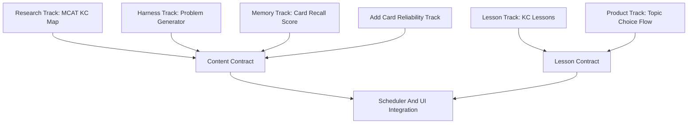

# MCAT Feature Expansion Plan

## Scope

Implement the next feature wave in six parallel tracks, starting with research and contracts before adding UI or scheduler behavior. The work builds on the current Concept Scheduler engine in `rslib/src/scheduler/concept.rs`, the demo content in `added features/mcat.md`, and the current product notes in `README.md`.

## Immediate Priorities (2026-07-02)

Do these two before resuming the tracks below. They are prerequisites for shipping the app to other people: a downloaded app must be able to sync a user's data, and AI features must run on the user's own key rather than a shared one.

**Recently shipped (graph-based topic picker):** the reviewer concept map is now a layered "linear paths" graph (scroll + zoom) whose outer-fringe frontier is clickable — clicking a "ready to start" node selects it via the new `SetConceptSelectedTopic` write path (durable `selected_topic`, seeded into the live session on build). This delivers "start anything you satisfy the prereqs for, by looking around the map" and a baseline across all sections at the start (every section's root KCs are startable from day one). See `progress.md` and `topic-picker-design.md`.

**Next feature — cross-section "choose what to learn next":** after mastering, recommend **2 topics in the current section + 1 in each of the other two** super-sections (Bio/Biochem, Chem/Phys, Psych/Soc). Implementation: derive "current section" from the active/selected topic, then rework `recommended_topics()` (`concept_demo.rs`) to fill 2 from the current section + 1 per other section (falling back to readiness order); surface as highlighted picks in the graph + the explainable picker card. The write path this depends on already ships.

### Priority 1 - Own Syncing (Track G)

Goal: sync collections and media through our own sync server instead of depending on AnkiWeb, so people who download the app can back up and study across devices on infrastructure we control.

Notes:

- Anki already ships a self-hostable sync server in `rslib/sync` (the `anki-sync-server` binary). Reuse it; do not reinvent the sync protocol.
- The desktop client points at a custom endpoint via the **Preferences → Syncing → "Self-hosted sync server"** URL (stored per profile as `customSyncUrl`; `Collection.sync_endpoint()` in `qt/aqt/profiles.py`). The `SYNC_ENDPOINT` / `SYNC_ENDPOINT_MEDIA` env vars are **legacy and not read by the current client** — do not rely on them. So most of the remaining work is deployment, accounts, and defaults.

Tasks:

- Deploy the built-in Anki sync server (`rslib/sync`) as our own service with TLS and persistent storage.
- Add user accounts/credentials for our server and a login flow from the app.
- Default the desktop app's sync endpoint to our server while still allowing an override.
- Confirm media sync works and that Concept Scheduler per-deck state (stored in deck config) syncs intact.
- Document local dev: run the sync server locally and point `just run` at it.

Acceptance:

- A downloaded app logs into our server and syncs collection + media across two devices.
- The default endpoint is our server; a manual override still works.
- Concept Scheduler state round-trips through sync without loss.

#### Server facts (verified in this checkout)

The server is the `anki-sync-server` crate (`rslib/sync/main.rs` → `anki::sync::http_server::SimpleServer`). It is configured entirely via env vars (`envy::prefixed("SYNC_")`):

- `SYNC_HOST` — bind address (default `0.0.0.0`).
- `SYNC_PORT` — bind port (default `8080`).
- `SYNC_BASE` — data dir where per-user `collection.anki2` + media are stored (default `~/.syncserver`). Must NOT be your normal Anki data folder.
- `SYNC_USER1`, `SYNC_USER2`, … — accounts in `username:password` format. `SYNC_USER1` is required or the server exits with "No users defined". Plain-text passwords are hashed with a fixed salt at startup; set `PASSWORDS_HASHED=1` to supply PHC-format hashes instead.
- `RUST_LOG` — log filter (binary defaults it to `anki=info`).

Routes: collection sync is `POST /sync/<method>`, media sync is `POST /msync/<method>` (+ `GET /msync/begin`), plus `GET /health`. The client is given a **base URL** and appends `sync/` and `msync/` itself (`SyncMethod::as_sync_endpoint`), so the URL you configure must be the base with a trailing slash, e.g. `http://127.0.0.1:8080/`. The binary also supports `anki-sync-server --healthcheck` (exit 0 if the configured host/port is listening).

#### Local dev loop (done locally, verified)

Build path (sanctioned): `cargo build -p anki-sync-server` with `CARGO_TARGET_DIR=out/rust` reuses the ninja target dir and the `.cargo/config.toml` env (`PROTOC`, `DESCRIPTORS_BIN`); building this crate turns on the correct TLS feature (`rustls`) on the `anki` crate, avoiding the default-feature build errors of a bare `cargo check -p anki`. Requires a prior `just build` once (to provision `out/extracted/protoc` + ftl).

Note: a `scripts/run-local-sync-server.sh` helper was used during Track G and then **removed** (AnkiWeb is the interim sync). To run the local server manually:

```bash
# terminal 1 — build + run the local server (Ctrl-C to stop)
CARGO_TARGET_DIR=out/rust cargo build -p anki-sync-server
SYNC_HOST=127.0.0.1 SYNC_PORT=8090 SYNC_BASE=out/syncserver SYNC_USER1=dev:dev \
  out/rust/debug/anki-sync-server
# base URL to configure: http://127.0.0.1:8090/
# (8080 collides with the running app's Qt remote-debug port)

# terminal 2 — run the desktop app
just run
```

Then in the app: Tools → Preferences → Syncing → "Self-hosted sync server" → paste the base URL, close, press `Y` to sync, and log in with the `SYNC_USER1` values (`dev` / `dev`). To exercise two devices locally, do the same in a second profile (File → Switch Profile → Add) and sync it down.

Accounts: there is no signup/CLI subcommand — an account exists iff it is listed in a `SYNC_USERn` env var when the server starts. The user's folder under `SYNC_BASE` is created automatically on startup. Add users by adding `SYNC_USER2=...`, etc., and restarting the server.

#### Concept Scheduler data survives sync (verified)

Our per-deck Concept Scheduler state does not touch the collection schema: it is stored in the collection **config** store via `set_config_json("_deck_<deckId>_conceptSchedulerState", …)` (`rslib/src/scheduler/concept.rs` + `rslib/src/config/deck.rs`), and the per-deck `concept_scheduler_enabled` flag is proto field 11 on the normal deck. The sync protocol sends the **entire config table** (`changed_config`/`set_all_config` in `rslib/src/sync/collection/changes.rs`) and all decks, so this data round-trips for free. Automated proof (both pass in this checkout):

- `cargo test -p anki --features rustls -- sync_roundtrip` — two collections sync through a real `SimpleServer`; asserts `get_all_config()` and deck equality match after sync.
- `cargo test -p anki --features rustls -- concept_scheduler_state_round_trips_via_deck_config` — the Concept Scheduler state persists via the deck config key.

Full end-to-end app check (manual, not yet run): enable Concept Scheduler on a deck + answer a few cards in profile A, sync up; sync a fresh profile B down; confirm the deck's `concept_scheduler_enabled` and its live status/counters are present. The Memory metric is computed at read time, so it needs no sync.

#### AnkiDroid (our fork — read-only finding)

`../Anki-Android/` already supports a custom sync server, no changes needed: Settings → Sync → **Custom sync server** (`CustomSyncServerSettingsFragment`, `preferences_custom_sync_server.xml`). It stores a single base URL under SharedPreference key `syncBaseUrl` (`SyncPreferences.CUSTOM_SYNC_URI`, with an enable switch) plus an optional custom TLS certificate, and passes the base URL to the same rsdroid/rslib backend as desktop (`Sync.kt: getEndpoint()` → `SyncAuth.endpoint`). Same URL shape as desktop. From a device/emulator use the host's LAN IP (`http://<lan-ip>:8080/`) or `http://10.0.2.2:8080/` on the Android emulator — `127.0.0.1` points at the device itself.

#### Deployment sketch (ops TODO — not done)

None of this is deployed (no infra credentials in-repo). To host for real:

1. **Containerize**: build `anki-sync-server` (`cargo install --path rslib/sync` after `./ninja extract:protoc ftl_repo`, or a multi-stage Dockerfile). Run it as a small always-on service.
2. **Persistent volume**: mount durable storage at `SYNC_BASE` (the collections + media live here). Back it up.
3. **TLS via reverse proxy**: the server speaks plain HTTP; terminate HTTPS at nginx/Caddy in front of it, proxying to `127.0.0.1:8080`. Configure Anki with the public base URL **with a trailing slash** (e.g. `https://sync.example.com/`). For Caddy, raise the reverse-proxy `read_buffer` (e.g. 512k) to avoid media-download stalls. iOS needs TLS 1.2.
4. **Accounts**: provision `SYNC_USERn` (prefer `PASSWORDS_HASHED=1` + PHC hashes so plaintext isn't in the environment/secret store). There is no self-service signup; account creation = redeploy with new env. If we want signup later, that's a separate service in front of the server.
5. **Limits**: set `MAX_SYNC_PAYLOAD_MEGS` (and matching proxy body-size limits) if collections exceed the 100 MB default.
6. **Defaults (later)**: only after a server is live and stable, consider defaulting the desktop app's sync URL to ours (while keeping the manual override). Not done here — there is no deployed server yet, so the default endpoint is intentionally unchanged.

### Priority 2 - Bring-Your-Own OpenAI API Key (Track H)

Goal: when others download the app, let them paste their own OpenAI API key so AI features (card/problem generation, lessons, explanations) call OpenAI with the user's key. No embedded/shared key, and no per-call cost or liability to us.

Tasks:

- Add a settings UI to enter, test, and clear an OpenAI API key plus a model choice.
- Store the key locally per profile as a secret: never sync it, log it, or commit it.
- Add a small OpenAI client wrapper (endpoint, model, request/response, timeouts, error and rate-limit handling).
- Gate all AI features behind "key present"; show setup instructions and a "test connection" button; degrade gracefully when the key is absent.
- Keep network calls opt-in and the app fully usable offline without a key.
- First consumers: Track B problem generation and Track C lessons.

Acceptance:

- A user pastes a key in settings; the app validates it with a test call and persists it per profile.
- With a valid key, at least one AI feature works end-to-end using the user's key.
- The key never appears in synced data, logs, or the repo; clearing it disables AI features cleanly.

Caveat: this is user-supplied key usage, not embedding our own key in the app.

## Parallelization Strategy

Run six workstreams in parallel with explicit contracts between them:




## Track A: MCAT Knowledge Research

Goal: expand from the 10-KC demo graph toward a 200-500 card-ready MCAT map.

Tasks:

- Research comprehensive MCAT content components from AAMC-style sections and reputable open sources.
- Add findings to `added features/brainlift.md`, under a new heading like `DOK 1: MCAT Material 7/1 Research`.
- Produce a machine-usable KC map draft with:
  - KC ID
  - parent area
  - prerequisites
  - overlapping sections
  - suggested difficulty ladder
  - whether it is foundation, mechanism, application, or detail
- Make overlap explicit, e.g. Biochem KCs can support both Bio/Biochem and Chem/Phys; Bio KCs can contribute small slices to Chem/Phys and Psych/Soc.

Acceptance:

- At least 100-150 KCs researched before card generation scales.
- Each KC has prerequisite notes and section overlap.
- Research is documented before generation starts.

## Track B: Replayable Card/Problem Generation Harness

Goal: generate many synthetic cards/problems in a repeatable structure instead of one-off agent outputs.

Tasks:

- Define a generation schema for each item:
  - `id`
  - `KC::...`
  - `Prereq::...`
  - `MCAT::...`
  - `Difficulty::1-5`
  - `IRT::Discrimination::...`
  - `IRT::Guessing::...`
  - `Reasoning::Conceptual/Application/Data/ResearchDesign`
  - question, choices, answer, explanation, misconception note
- Create a replayable prompt template and output format for agent-generated cards.
- Generate in batches by KC area, not random whole-deck generation.
- Add a validation pass that checks tag validity, duplicate IDs, answer format, difficulty distribution, and prerequisite consistency.

Acceptance:

- A generation harness can be rerun for a selected KC batch.
- Initial target: 200 cards.
- Stretch target: 500 cards after validation quality improves.
- Generated cards are synthetic and not copied from copyrighted prep material.

## Track C: Manual Lesson Pages

Goal: prevent retrieval before initial encoding for brand-new KCs.

Tasks:

- Define lesson page schema per KC:
  - overview
  - key concepts
  - prerequisite reminder
  - worked example
  - common misconception
  - first retrieval prompt
  - related KCs
- Add a lesson page entry point at the start of a new KC topic.
- Add a `Lesson` button after checking an answer that opens the lesson tied to the current card's KC.
- Keep lessons lightweight and local first. Do not introduce AI-generated lesson text into the live app until source/evaluation rules exist.

Acceptance:

- Every demo KC has a lesson stub.
- New outer-fringe topic selection can open the lesson before quizzing.
- Current flashcard can open its related lesson after answer reveal.

## Track D: Human-Guided Outer-Fringe Topic Choice

Goal: make the scheduler feel guided and explainable, not like a black box.

Tasks:

- Extend the current internal topic selection into a user-facing picker.
- Show 3-5 outer-fringe topics sorted by readiness.
- For each topic, show why it is recommended:
  - prerequisites ready
  - target not yet mastered
  - available new-topic budget
  - next action
- After a topic is selected, open the lesson page first, then introduce cards from that topic.
- Show specific next actions after answers:
  - retrieval
  - feedback review
  - error diagnosis
  - spacing
  - reattempt

Acceptance:

- User can choose one of 3-5 outer-fringe topics.
- Selection affects the current queue topic block.
- UI explains why the topic is useful.
- If no topic is ready, fallback remains review/calibration.

## Track E: Memory Score

Goal: add the missing memory score as a retention/recall measure for fixed cards, separate from KC mastery, IRT performance, and readiness.

Key distinction:

- `CardMemory`: how likely the learner is to recall this specific card today.
- `KCMastery`: how likely the learner understands the underlying concept.
- `Performance`: IRT ability from answered test-like items.
- `Readiness`: performance adjusted by coverage, mastery, and uncertainty.

Preferred formula:

```text
CardMemory(card) = FSRS_Retrievability(card, today)
```

Fallback if FSRS retrievability is unavailable:

```text
base_from_last_rating:
  Again = 0.20
  Hard  = 0.55
  Good  = 0.80
  Easy  = 0.90

DecayFactor = exp(-elapsed_days / max(interval_days, 1))

CardMemory = base_from_last_rating * DecayFactor
```

Aggregate to KCs:

```text
KCMemory =
  average(CardMemory for cards tagged with the KC)
```

Weighted version:

```text
KCMemory =
  sum(CardImportance_i * CardMemory_i) / sum(CardImportance_i)
```

Aggregate to sections using the same MCAT blueprint discipline weights:

```text
SectionMemory =
  sum(TopicWeight_i * KCMemory_i) / sum(TopicWeight_i)
```

UI output:

```text
Memory: 78%
```

It should be a percentage, not an MCAT scaled score. It answers: "Can the learner recall already-studied material?"

Acceptance:

- Memory score is computed from fixed-card recall probability, not just `P(mastery)`.
- KC memory aggregates cards tagged to the KC.
- Section memory aggregates KC memory by MCAT blueprint weights.
- UI clearly separates Memory, Performance, and Readiness.

## Track F: Add Cards Reliability

Goal: make the custom Add Cards metadata flow actually work end-to-end before generating hundreds of new cards.

Problem to solve:

```text
User can click Add successfully, but cannot find the card afterward.
```

This must be treated as a blocker for scaling content.

Tasks:

- Verify the selected target deck is the actual destination deck.
- After Add succeeds, show a clear confirmation with:
  - note ID
  - card ID(s)
  - deck name
  - KC tag
  - a direct "Browse added card" action or equivalent search
- Ensure the metadata panel writes tags before add:
  - `KC::...`
  - `Prereq::...`
  - `MCAT::...`
  - `Difficulty::...`
  - `IRT::Discrimination::...`
  - `IRT::Guessing::...`
  - `Reasoning::Conceptual`
- Ensure Add is disabled until a KC topic is selected.
- Ensure the new card appears in browser search by:

```text
tag:KC::SelectedTopic
```

or by note/card ID.

- Add a test or manual verification script for:
  - add note
  - confirm tags
  - confirm target deck
  - confirm card count increases
  - confirm browser/search can find the note

Acceptance:

- After clicking Add, user can immediately locate the new card.
- Added card has the selected KC, section, difficulty, IRT, and reasoning tags.
- The new card is in the selected deck.
- No Add Cards crash when tag widget has not initialized.
- This is verified before 200-500 generated-card expansion.

## Other Feature Commentary

The unsolidified ideas should be prioritized like this:

1. Foundation-before-detail sequencing: high value, already aligned with current graph/fringe model. Add as a difficulty/depth rule in Track A and Track B.
2. Daily green state: valuable, but defer until the review/topic flow is stable. MVP version can be a simple daily finish line: reviews completed plus budgeted new-topic cards done.
3. Skills graph: important for MCAT reasoning, but should come after content KC expansion. MVP-friendly version is `Reasoning::...` tags on items before building a separate graph.
4. Retrieval-based concept mapping: valuable but post-MVP. First version could be a lesson activity asking the user to reconstruct prerequisites from memory.
5. Accessibility/autonomy: should influence design now, but not become a large feature. Keep offline/local-first assumptions, small next steps, transparent plans, and adjustable intensity in mind.

## Suggested Implementation Order

1. Stand up our own sync server and point the app at it (Priority 1 / Track G).
2. Add bring-your-own OpenAI API key settings + client wrapper (Priority 2 / Track H).
3. Fix Add Cards reliability so manually added cards are findable and correctly tagged. (done)
4. Research and freeze expanded KC schema.
5. Build replayable generation harness and validation checks.
6. Generate 200 synthetic cards.
7. Define and implement card-level memory score aggregation. (done)
8. Add lesson page schema and demo lesson pages.
9. Add reviewer/deck-options topic picker and lesson entry points.
10. Add small daily green-state readout after the topic picker works.
11. Add reasoning-skill tags; defer full skills graph.

## Verification

- `just test-rust` for scheduler changes.
- `just test-ts` for UI/harness changes.
- Manual demo with MCAT Demo plus expanded generated deck.
- Validate generated cards for tags, IDs, difficulty, answer keys, and prereq consistency.
- Track prerequisite violations and mastery gain before/after topic-choice changes.
- Verify Memory, Performance, and Readiness are shown as separate metrics and use different formulas.
- Verify manual Add Cards flow creates a searchable card in the selected deck before scaling content generation.

