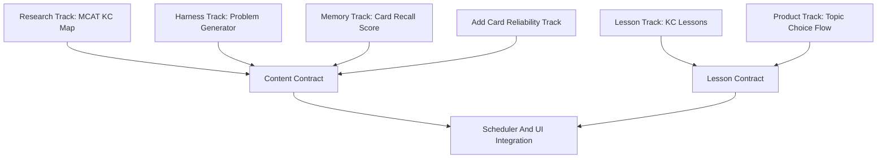

# MCAT Feature Expansion Plan

## Scope

Implement the next feature wave in six parallel tracks, starting with research and contracts before adding UI or scheduler behavior. The work builds on the current Concept Scheduler engine in `rslib/src/scheduler/concept.rs`, the demo content in `added features/mcat.md`, and the current product notes in `README.md`.

## Parallelization Strategy

Run six workstreams in parallel with explicit contracts between them:



## Track A: MCAT Knowledge Research

Goal: expand from the 10-KC demo graph toward a 200-500 card-ready MCAT map.

Tasks:

- Research comprehensive MCAT content components from AAMC-style sections and reputable open sources.
- Add findings to `added features/brainlift.md`, under a new heading like `DOK 1: MCAT Material 7/1 Research`.
- Produce a machine-usable KC map draft with:
  - KC ID
  - parent area
  - prerequisites
  - overlapping sections
  - suggested difficulty ladder
  - whether it is foundation, mechanism, application, or detail
- Make overlap explicit, e.g. Biochem KCs can support both Bio/Biochem and Chem/Phys; Bio KCs can contribute small slices to Chem/Phys and Psych/Soc.

Acceptance:

- At least 100-150 KCs researched before card generation scales.
- Each KC has prerequisite notes and section overlap.
- Research is documented before generation starts.

## Track B: Replayable Card/Problem Generation Harness

Goal: generate many synthetic cards/problems in a repeatable structure instead of one-off agent outputs.

Tasks:

- Define a generation schema for each item:
  - `id`
  - `KC::...`
  - `Prereq::...`
  - `MCAT::...`
  - `Difficulty::1-5`
  - `IRT::Discrimination::...`
  - `IRT::Guessing::...`
  - `Reasoning::Conceptual/Application/Data/ResearchDesign`
  - question, choices, answer, explanation, misconception note
- Create a replayable prompt template and output format for agent-generated cards.
- Generate in batches by KC area, not random whole-deck generation.
- Add a validation pass that checks tag validity, duplicate IDs, answer format, difficulty distribution, and prerequisite consistency.

Acceptance:

- A generation harness can be rerun for a selected KC batch.
- Initial target: 200 cards.
- Stretch target: 500 cards after validation quality improves.
- Generated cards are synthetic and not copied from copyrighted prep material.

## Track C: Manual Lesson Pages

Goal: prevent retrieval before initial encoding for brand-new KCs.

Tasks:

- Define lesson page schema per KC:
  - overview
  - key concepts
  - prerequisite reminder
  - worked example
  - common misconception
  - first retrieval prompt
  - related KCs
- Add a lesson page entry point at the start of a new KC topic.
- Add a `Lesson` button after checking an answer that opens the lesson tied to the current card's KC.
- Keep lessons lightweight and local first. Do not introduce AI-generated lesson text into the live app until source/evaluation rules exist.

Acceptance:

- Every demo KC has a lesson stub.
- New outer-fringe topic selection can open the lesson before quizzing.
- Current flashcard can open its related lesson after answer reveal.

## Track D: Human-Guided Outer-Fringe Topic Choice

Goal: make the scheduler feel guided and explainable, not like a black box.

Tasks:

- Extend the current internal topic selection into a user-facing picker.
- Show 3-5 outer-fringe topics sorted by readiness.
- For each topic, show why it is recommended:
  - prerequisites ready
  - target not yet mastered
  - available new-topic budget
  - next action
- After a topic is selected, open the lesson page first, then introduce cards from that topic.
- Show specific next actions after answers:
  - retrieval
  - feedback review
  - error diagnosis
  - spacing
  - reattempt

Acceptance:

- User can choose one of 3-5 outer-fringe topics.
- Selection affects the current queue topic block.
- UI explains why the topic is useful.
- If no topic is ready, fallback remains review/calibration.

## Track E: Memory Score

Goal: add the missing memory score as a retention/recall measure for fixed cards, separate from KC mastery, IRT performance, and readiness.

Key distinction:

- `CardMemory`: how likely the learner is to recall this specific card today.
- `KCMastery`: how likely the learner understands the underlying concept.
- `Performance`: IRT ability from answered test-like items.
- `Readiness`: performance adjusted by coverage, mastery, and uncertainty.

Preferred formula:

```text
CardMemory(card) = FSRS_Retrievability(card, today)
```

Fallback if FSRS retrievability is unavailable:

```text
base_from_last_rating:
  Again = 0.20
  Hard  = 0.55
  Good  = 0.80
  Easy  = 0.90

DecayFactor = exp(-elapsed_days / max(interval_days, 1))

CardMemory = base_from_last_rating * DecayFactor
```

Aggregate to KCs:

```text
KCMemory =
  average(CardMemory for cards tagged with the KC)
```

Weighted version:

```text
KCMemory =
  sum(CardImportance_i * CardMemory_i) / sum(CardImportance_i)
```

Aggregate to sections using the same MCAT blueprint discipline weights:

```text
SectionMemory =
  sum(TopicWeight_i * KCMemory_i) / sum(TopicWeight_i)
```

UI output:

```text
Memory: 78%
```

It should be a percentage, not an MCAT scaled score. It answers: "Can the learner recall already-studied material?"

Acceptance:

- Memory score is computed from fixed-card recall probability, not just `P(mastery)`.
- KC memory aggregates cards tagged to the KC.
- Section memory aggregates KC memory by MCAT blueprint weights.
- UI clearly separates Memory, Performance, and Readiness.

## Track F: Add Cards Reliability

Goal: make the custom Add Cards metadata flow actually work end-to-end before generating hundreds of new cards.

Problem to solve:

```text
User can click Add successfully, but cannot find the card afterward.
```

This must be treated as a blocker for scaling content.

Tasks:

- Verify the selected target deck is the actual destination deck.
- After Add succeeds, show a clear confirmation with:
  - note ID
  - card ID(s)
  - deck name
  - KC tag
  - a direct "Browse added card" action or equivalent search
- Ensure the metadata panel writes tags before add:
  - `KC::...`
  - `Prereq::...`
  - `MCAT::...`
  - `Difficulty::...`
  - `IRT::Discrimination::...`
  - `IRT::Guessing::...`
  - `Reasoning::Conceptual`
- Ensure Add is disabled until a KC topic is selected.
- Ensure the new card appears in browser search by:

```text
tag:KC::SelectedTopic
```

or by note/card ID.

- Add a test or manual verification script for:
  - add note
  - confirm tags
  - confirm target deck
  - confirm card count increases
  - confirm browser/search can find the note

Acceptance:

- After clicking Add, user can immediately locate the new card.
- Added card has the selected KC, section, difficulty, IRT, and reasoning tags.
- The new card is in the selected deck.
- No Add Cards crash when tag widget has not initialized.
- This is verified before 200-500 generated-card expansion.

## Other Feature Commentary

The unsolidified ideas should be prioritized like this:

1. Foundation-before-detail sequencing: high value, already aligned with current graph/fringe model. Add as a difficulty/depth rule in Track A and Track B.
2. Daily green state: valuable, but defer until the review/topic flow is stable. MVP version can be a simple daily finish line: reviews completed plus budgeted new-topic cards done.
3. Skills graph: important for MCAT reasoning, but should come after content KC expansion. MVP-friendly version is `Reasoning::...` tags on items before building a separate graph.
4. Retrieval-based concept mapping: valuable but post-MVP. First version could be a lesson activity asking the user to reconstruct prerequisites from memory.
5. Accessibility/autonomy: should influence design now, but not become a large feature. Keep offline/local-first assumptions, small next steps, transparent plans, and adjustable intensity in mind.

## Suggested Implementation Order

1. Fix Add Cards reliability so manually added cards are findable and correctly tagged.
2. Research and freeze expanded KC schema.
3. Build replayable generation harness and validation checks.
4. Generate 200 synthetic cards.
5. Define and implement card-level memory score aggregation.
6. Add lesson page schema and demo lesson pages.
7. Add reviewer/deck-options topic picker and lesson entry points.
8. Add small daily green-state readout after the topic picker works.
9. Add reasoning-skill tags; defer full skills graph.

## Verification

- `just test-rust` for scheduler changes.
- `just test-ts` for UI/harness changes.
- Manual demo with MCAT Demo plus expanded generated deck.
- Validate generated cards for tags, IDs, difficulty, answer keys, and prereq consistency.
- Track prerequisite violations and mastery gain before/after topic-choice changes.
- Verify Memory, Performance, and Readiness are shown as separate metrics and use different formulas.
- Verify manual Add Cards flow creates a searchable card in the selected deck before scaling content generation.
