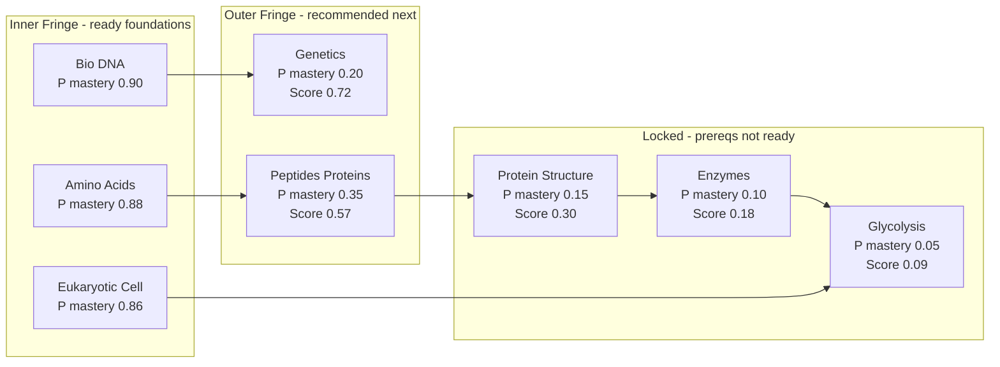

# Concept Scheduler Progress

## Current Status

Phase 13 is now completed through the MCAT demo import helper, live status RPC, and deck-options graph. The core concept model lives in `rslib/src/scheduler/concept.rs`, and the demo card source of truth is `added features/mcat_demo_cards.md`.

Done:

- Parses `KC::`, `Prereq::`, `MCAT::`, and `Difficulty::` tags.
- Builds a Knowledge Component graph and detects prerequisite cycles.
- Updates mastery probabilities with Bayes-style positive/negative evidence.
- Classifies KCs as inner fringe or outer fringe.
- Computes readiness score: `P(prereqs mastered) * (1 - P(target mastered))`.
- Refuses readiness estimates when evidence is too thin.
- Has targeted Rust tests: `cargo test -p anki scheduler::concept`.
- Stores versioned per-deck concept scheduler state under an isolated deck config key.
- Adds a deck-specific `concept_scheduler_enabled` flag on normal decks.
- Exposes Concept Scheduler Mode in deck options.
- Updates KC mastery when enabled tagged cards are answered.
- Maps Again/Hard to negative evidence and Good/Easy to positive evidence.
- Tracks daily concept evidence and prerequisite-violation counters in the persisted state.
- Writes answer-time concept updates in the answer operation so undo restores concept state.
- Sorts gathered new cards by readiness score when Concept Scheduler Mode is enabled and enough evidence exists.
- Preserves baseline queue behavior when the mode is disabled, cards are untagged, evidence is too thin, or the graph is cyclic.
- Adds live concept session state to the study queue.
- Earns 1 new-topic slot per 4 completed review/interday-learning cards.
- Avoids constant context switching by waiting for a 3-card focused block when reviews remain.
- Allows a smaller partial block when reviews are exhausted.
- Supports a selected topic internally, and otherwise auto-focuses the first readiness-sorted topic.
- Snapshots concept queue state for answer undo/redo.
- Shows a visible deck-options status panel when Concept Scheduler Mode is enabled.
- Replaces the static deck-options preview with live status data from Rust.
- Renders the canonical 10-node MCAT graph grouped into inner fringe, outer fringe, and locked/unknown topics.
- Shows live counters for evidence progress, daily positives, and prerequisite violations.
- Adds a Rust demo helper that imports the 50-card `MCAT Demo` deck with tags preserved.
- Automatically imports the idempotent `MCAT Demo` deck when the deck browser is first shown.
- Freezes the canonical 10-node graph and expected edges, including `Bio::Eukaryotic_Cell -> Biochem::Bioenergetics`.
- Exposes `getConceptSchedulerStatus` and `importMcatDemoDeck` backend RPCs.
- Adds demo tests for fixture parsing, deck import, Bayes mastery movement, status counters, and graph/fringe state.
- Adds deck-options tests for saving the toggle as both enabled and disabled.
- Adds a deck-options test for the target deck ID used by the live status RPC.
- Adds MVP IRT section scoring state with AAMC-style section weights, seeded difficulty/discrimination/guessing metadata, score-range refusal thresholds, and section score debug output.
- Computes section blueprint coverage from KC evidence by discipline, capped by each MCAT section's discipline weight.
- Allows overlapping content to contribute to coverage across sections, e.g. Bio evidence can fill the Bio slice of Bio/Biochem, Chem/Phys, and Psych/Soc, but cannot exceed that slice.
- Shows IRT performance/readiness ranges only in the reviewer Progress sidebar and deck-options status panel, not as an always-visible flashcard overlay.
- Adds a home-screen Light/Dark mode toggle backed by Anki's existing profile theme setting.
- Uses soft-white surfaces with muted blue/green concept accents and minimal warm accent markers for locked/attention states.
- Adds an Add Cards Concept Scheduler metadata panel for selecting KC topic, prerequisite, MCAT section, difficulty, discrimination, and guessing.
- Disables the Add button until a KC topic is selected, so new cards cannot be added without scheduler metadata in the demo workflow.
- Expands the add-card KC dropdown to include the current MCAT topic map from `added features/mcat.md`.
- Updates the project `README.md` into a full Concept Scheduler writeup with architecture, Bayes math, IRT math, coverage/readiness formulas, validation plan, commands, and Anki attribution.
- Adds a project skill at `.cursor/skills/progress-readme-mistakes/SKILL.md` for keeping `progress.md`, `README.md`, and `.cursor/mistakes.md` current.
- Adds `.cursor/mistakes.md` and records known mistakes around coverage calculation, persisted-state backfill, and add-card editor lifecycle assumptions.
- Improves light/dark mode contrast in Concept Scheduler deck-options panels and reviewer Progress sidebar, avoiding grey text on grey and white text on soft-white panels.
- Keeps IRT scores inside deck options and the reviewer Progress sidebar only; the flashcard face itself only shows the current card's KC badge.
- Matches the reviewer sidebar locked-topic row accent to its graph dot color (neutral, and white in dark mode) instead of a separate orange accent, so each description lines up with its dot.
- (Track F) Adds an Add Cards `Browse Added` button that opens the Browser filtered to the most recently added note (`nid:<id>`), so demo cards can be located immediately.
- (Track F) Replaces the generic "cards added" tooltip with a confirmation that shows the destination deck name, new note id, and KC tag(s).
- (Track F) Confirms adds route to the deck chooser's selected deck.
- (Track F) Extracts the pure concept-tag helpers (`normalize_concept_tag`, `concept_tags_meet_add_requirements`, `derived_mcat_sections_for_topics`, `CONCEPT_METADATA_TAG_PREFIXES`) into `qt/aqt/concept_tags.py` so tag rules are unit-testable without Qt; `editor.py` re-imports them.
- (Track F) Adds `qt/tests/test_concept_tags.py` (pure tag rules) and `pylib/tests/test_concept_add_cards.py` (findability contract: a tagged note lands in the selected deck and is findable by `tag:KC::...` and by note id).

## Current Algorithm Behavior

- Ratings are converted to evidence in `rslib/src/scheduler/concept.rs`: Again/Hard are negative evidence, and Good/Easy are positive evidence.
- Mastery starts at `0.25` for unseen KCs and is updated with Bayes:
  `P(mastered | evidence) = P(evidence | mastered) * P(mastered) / (P(evidence | mastered) * P(mastered) + P(evidence | unmastered) * P(unmastered))`.
- Default positive evidence likelihoods are `0.90` if mastered and `0.20` if unmastered.
- Default negative evidence likelihoods are `0.10` if mastered and `0.80` if unmastered.
- A KC becomes a ready foundation when mastery is at least `0.85` and it has at least `3` answers.
- A KC becomes recommended next when all prerequisites have mastery at least `0.70`.
- Readiness score is `prerequisite_mastery * (1 - target_mastery)`, so strong prerequisites plus low target mastery means a useful next topic.
- The reviewer sidebar and deck-options UI show KC mastery probability alongside answered/correct/incorrect evidence counts.

## AnkiAndroid Backend Contract

AnkiAndroid should consume the backend through protobuf/RPC instead of recomputing scheduler state in the UI. The current desktop prototype exposes the read model through `SchedulerService.GetConceptSchedulerStatus`, backed by `Collection::concept_scheduler_status()` in `rslib/src/scheduler/concept_demo.rs`.

Request:

- `GetConceptSchedulerStatusRequest.deck_id: int64` - target deck ID.

Top-level response fields:

- `ConceptSchedulerStatusResponse.enabled: bool` - deck config toggle; true when Concept Scheduler Mode is enabled for the deck.
- `ConceptSchedulerStatusResponse.active: bool` - current backend active flag; currently mirrors `enabled` in the prototype.
- `ConceptSchedulerStatusResponse.evidence: ConceptEvidenceStatus` - evidence sufficiency state.
- `ConceptSchedulerStatusResponse.counters: ConceptCounters` - accumulated and daily evidence counters.
- `ConceptSchedulerStatusResponse.session: ConceptSessionStatus | null` - live queue/session budget state when queues have been built.
- `ConceptSchedulerStatusResponse.graph: ConceptGraph` - current KC graph read model.
- `ConceptSchedulerStatusResponse.recommendations: ConceptTopicRecommendation[]` - readiness-sorted outer-fringe topics.

Evidence variables:

- `ConceptEvidenceStatus.kind` - `INSUFFICIENT` or `ENOUGH`.
- `ConceptEvidenceStatus.seen_cards` - backend evidence count used for readiness reliability.
- `ConceptEvidenceStatus.required_seen_cards` - threshold before readiness is considered reliable; currently `500`.

Counter variables:

- `ConceptCounters.prerequisite_violations_total` - all-time count of advanced cards answered before prerequisites were ready.
- `ConceptCounters.prerequisite_violations_today` - today's prerequisite violations.
- `ConceptCounters.daily_positive` - today's positive concept evidence count.
- `ConceptCounters.daily_negative` - today's negative concept evidence count.
- `ConceptCounters.total_seen_cards` - total concept evidence count persisted in the scheduler state.

Session variables:

- `ConceptSessionStatus.reviews_toward_next_slot` - completed review/interday-learning cards counted toward earning the next new-topic slot.
- `ConceptSessionStatus.reviews_per_slot` - reviews needed to earn one slot; currently `4`.
- `ConceptSessionStatus.slots_available` - new-topic slots currently available.
- `ConceptSessionStatus.block_remaining` - cards remaining in the current focused topic block.
- `ConceptSessionStatus.block_size` - target focused block size; currently `3`.
- `ConceptSessionStatus.active_topic` - topic currently being served by the focused block, if any.
- `ConceptSessionStatus.selected_topic` - manually selected topic, if a future UI sets one.
- `ConceptSessionStatus.budget_progress` - normalized slot progress for UI progress bars.

Graph node variables:

- `ConceptGraph.nodes[].id` - KC ID, such as `Bio::DNA`.
- `ConceptGraph.nodes[].mastery` - current backend probability of mastery from `0.0` to `1.0`.
- `ConceptGraph.nodes[].fringe` - `CONCEPT_FRINGE_INNER`, `CONCEPT_FRINGE_OUTER`, or `CONCEPT_FRINGE_LOCKED`.
- `ConceptGraph.nodes[].readiness_score` - `prerequisite_mastery * (1 - target_mastery)`.
- `ConceptGraph.nodes[].prerequisite_mastery` - minimum prerequisite mastery for that node.
- `ConceptGraph.nodes[].answered` - answer count that contributed evidence to this KC.
- `ConceptGraph.nodes[].positive` - positive evidence count.
- `ConceptGraph.nodes[].negative` - negative evidence count.

Graph edge variables:

- `ConceptGraph.edges[].prerequisite_id` - source prerequisite KC ID.
- `ConceptGraph.edges[].target_id` - dependent target KC ID.
- `ConceptGraph.has_cycle` - true if the graph has an invalid prerequisite cycle.

Recommendation variables:

- `ConceptTopicRecommendation.id` - recommended KC ID.
- `ConceptTopicRecommendation.readiness_score` - ordering score for the next topic.
- `ConceptTopicRecommendation.mastery` - target KC mastery.
- `ConceptTopicRecommendation.prerequisite_mastery` - prerequisite readiness for the target.
- `ConceptTopicRecommendation.selectable` - whether a future topic picker should allow choosing it.

Mutation/update path:

- AnkiAndroid should keep using the normal answer operation. Backend answer handling maps Again/Hard to negative evidence and Good/Easy to positive evidence, updates the persisted deck-specific concept scheduler state, and keeps undo/redo snapshots with the queue state.
- The frontend should not write `mastery`, counters, or graph state directly. It should refresh `GetConceptSchedulerStatus` after answers or when opening deck options/reviewer monitoring.
- UIs may show backend `mastery`, `answered`, `positive`, and `negative` for debugging and demo visibility.

## IRT Scoring Model

- IRT performance is tracked separately from concept mastery and readiness.
- The backend stores per-section IRT state in the existing deck-specific concept scheduler JSON payload.
- Each answered tagged card can update one or more MCAT section estimates using seeded item metadata:
  - `Difficulty::1` through `Difficulty::5` maps to IRT difficulty from `-2.0` to `2.0`.
  - `IRT::Discrimination::x` is optional and defaults to `1.0`.
  - `IRT::Guessing::x` is optional and defaults to `0.25` for four-choice cards.
- Section performance is reported as an MCAT scaled-score range from the estimated theta and standard error. Performance is conditional on the material actually practiced, so it can reach 132 on tested content regardless of coverage.
- Readiness projects a whole-section score and is gated by coverage as a hard ceiling: `readiness_center = clamp(guess_floor + coverage * (performance_center - guess_floor), 118, 132)`, with `guess_floor = 120` (four-choice guessing baseline). The covered fraction scores at performance; the untested fraction is assumed to score at the guessing baseline. Max readiness at coverage `c` is `120 + c * 12`, so 90% coverage caps readiness at 130.8 and 50% caps it at 126 — you cannot show 132 without full coverage.
- Coverage previously only subtracted a small additive penalty (max 4 points), which let ~90% coverage still show ~131.6; it is now a multiplicative ceiling.
- Section mastery no longer shifts the readiness center. It stays a displayed diagnostic and only widens the uncertainty band (`mastery_se = (1 - section_mastery) * max_mastery_standard_error`).
- Readiness uncertainty sums variances: the performance term is scaled by coverage (`coverage * performance_se`), plus coverage and mastery terms, before taking the square root.
- Section score outputs refuse strong claims when answered item counts or section blueprint coverage are too low.
- The deck-options UI hides performance/readiness score ranges until the section has at least `60%` coverage.
- The UI does not show raw "insufficient evidence" item counts; it shows a short coverage/evidence gate message instead.
- The reviewer Progress sidebar shows section coverage and score ranges; the flashcard face itself only shows the current card's KC badge.
- Concept Scheduler UI uses theme-aware blue/green text and explicit night-mode panel backgrounds so labels remain readable in light and dark mode.
- The validation baseline is still Concept Scheduler Mode off / normal Anki ordering, with prerequisite-violation counts and held-back prediction checks used before making strong claims.

Not wired yet:

- No reviewer topic picker UI yet.
- No full `just check` yet; `just lint`, `just test-ts`, and targeted Rust tests pass.
- `just test-py` still fails only on the known unrelated Qt installer template issue in `qt/tests/test_installer.py`.
- No Android companion or mobile sync yet.

Track F verification (2026-07-01):

- `pylib/tests/test_concept_add_cards.py`: 1 passed.
- `qt/tests/test_concept_tags.py`: 5 passed.
- Python/Qt changes are lint-clean via the editor language servers.

The build env had to be repaired first: this checkout was moved from `/Users/sophiaz/alphaai/anki`, which left `out/pylib/anki/_rsbridge.so` as a dangling symlink, stale `out/pyenv` editable `.pth` files, and an old `builddir` in `out/build.ninja`. Those were repointed to the current path so `anki` imports and the tests run. See `.cursor/mistakes.md` for the moved-checkout gotcha.

## Manual Demo Workflow

1. Start Anki locally; the deck browser automatically creates or reuses the `MCAT Demo` deck.
2. Open the deck options for `MCAT Demo` and confirm Concept Scheduler Mode is enabled.
3. Answer foundation cards such as `Bio::DNA` or `Biochem::Amino_Acids` with Good/Easy.
4. Reopen deck options and watch the live graph percentages and evidence counters update.
5. Continue answering foundation cards until dependent topics enter the outer fringe.
6. Watch prerequisite-violation counters when advanced tagged cards are answered before their prerequisites are strong.
7. Confirm all 10 canonical MCAT nodes remain visible in the graph.

## First 2D Visual Model

The first visualization should be a 2D concept lattice. It should show the learner's current boundary:

- **Inner fringe:** concepts strong enough to build from.
- **Outer fringe:** next concepts that are eligible because prerequisites are ready.
- **Locked topics:** concepts whose prerequisites are still weak.
- **Mastery probability:** the current `P mastery` for each KC.
- **Readiness score:** the new-topic priority score for outer-fringe candidates.



## How The Score Should Read Visually

For new-topic selection, high priority means:

```text
strong prerequisites + weak target mastery = good next topic
```

Example:

```text
P prereqs mastered = 0.90
P target mastered = 0.20
Score = 0.90 * (1 - 0.20) = 0.72
```

That topic is useful because the student is ready for it but probably has not mastered it yet.

## Later 3D / Interactive Idea

After the 2D graph works, a 3D or interactive view could use:

- X axis: prerequisite depth from foundations to advanced topics.
- Y axis: mastery probability.
- Z axis: learning value or readiness score.

The MVP should not start with 3D. First prove the 2D graph is understandable and matches scheduler decisions.
