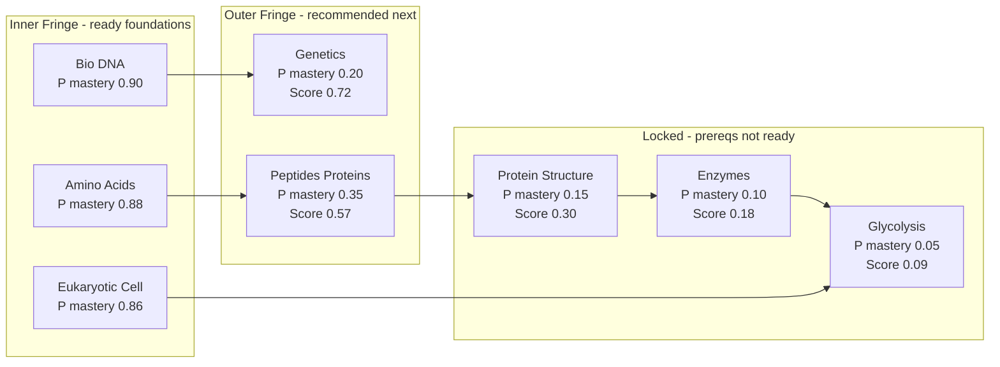

# Concept Scheduler Progress

## Current Status

Phase 13 is now completed through the MCAT demo import helper, live status RPC, and deck-options graph. The core concept model lives in `rslib/src/scheduler/concept.rs`, and the demo card source of truth is `added features/mcat_demo_cards.md`.

## Reviewer polish, graph declutter, Android handoff (2026-07-03, evening)

Desktop reviewer (`qt/aqt/reviewer.py`; Python + injected JS, no web rebuild):

- Fixed post-answer dead buttons: the MC choice handler no longer runs the full `_showAnswer()` (which re-ran `_updateQA`/`scrollToAnswer`/repaint on the hidden card and could wedge the in-card buttons) — it just flips to the answer state and reveals the lesson. All feedback buttons also `preventDefault`+`stopPropagation` so a click can't turn into a navigation.
- Ask AI chat: scoped to the question (system prompt with question/choices/correct/selected/explanation/KC), multi-turn off the UI thread, **always gives concrete examples**, and **rejects off-topic** queries; panel anchored bottom-left; resets per card.
- Removed the lesson panel's "Start retrieval" button (lesson is read-only). FSRS enabled by default once on MCAT import (guarded by `mcatFsrsDefaulted`).
- Progress-sidebar concept graph decluttered per `.cursor/skills/concept-graph`: the default focused view is now **1 hop** (current KC + direct prerequisites + dependents — the clean "builds on → this → unlocks"), more node spacing (ROWH 40, COLW 150), and **fit-to-view on open**; the full map stays an opt-in toggle.

Android (AnkiDroid) — applied, then the app was handed to a separate agent:

- Fixed the "no app installed that can perform this action" error: the Android WebView **lowercases URL schemes**, so the camelCase JS→Kotlin bridge schemes never matched `filterUrl` and fell through to an external Intent. Now lowercase on both sides (`mcatchoice:` / `mcatgrade:` / `mcatchatopen:` / `mcatchatsend:`). An earlier colon-only fix was insufficient (see `.cursor/mistakes.md`).
- "Ask AI" is gated behind a key: no key ⇒ plain interactive flashcard (no AI button, no reword).
- Concept lattice graph decluttered (scroll + zoom, focused-by-default, fit-on-open); `:AnkiDroid:compilePlayDebugKotlin` BUILD SUCCESSFUL and reinstalled on the emulator.
- NOT done (left to the other agent): moving the MCAT section-scores card **above** the graph in `ConceptSchedulerStatusScreen`, and all further Android work. As of 2026-07-03 evening the AnkiDroid app is owned by a separate agent.

Docs: `README.md` gained a **"Bayesian Network Model"** section (prior 0.20, the partial-mastery lift `P(+|¬M) = 0.25 + 0.5·P(mastery)`, Laplace-smoothed data-driven likelihoods after 20 observations, and the network gating thresholds).

## Interactive Quiz + AI + Android Parity (2026-07-03)

Desktop reviewer (`qt/aqt/reviewer.py`, `qt/aqt/mcat_ai.py`, `qt/aqt/profiles.py`, `qt/aqt/main.py`, `qt/aqt/deckbrowser.py` — Python only, no web rebuild; injected `<style>`/JS + `pycmd`):

- **Clickable multiple-choice.** KC-tagged Basic MC cards (`front = Q<br><br>A. …B. …`, `back = <b>Correct:</b> X<br><br>expl`) render as tappable choices instead of "Show Answer" (`_mcat_mc_payload` parser gated on a `KC::` tag + parse success; normal decks untouched). Grading routes through the real answer op (undo/scheduling intact). Both correct and wrong reveal the explanation and ask for an **honest self-rating** — correct shows Guessed/Shaky/Knew it/Easy, wrong shows Again/Hard/Good/Easy (maps to ease 1–4).
- **Bring-your-own OpenAI key (Track H).** `Tools → MCAT AI (OpenAI key)…` dialog (masked field + Show, model, reword/shuffle toggles, Test connection). Key stored per profile only (`profiles.py`, never synced/logged/committed). Resolution order: profile setting → `OPENAI_API_KEY` env var → repo-root `.env` (gitignored; read directly since `just` doesn't load it). `OpenAIClient` uses stdlib `urllib`.
- **Reword + shuffle.** Answer choices shuffle client-side. When a key is present and rewording is on (default on), the stem is reworded via OpenAI with a **second equivalence-check call** (falls back to the original on mismatch/error). Efficiency: reworded once per card per session (cached by card id incl. fallback, plus an in-flight guard), a **loading spinner** shows while the call runs (always resolves), timeout capped ~20s.
- **On/off + obvious controls.** `Tools → "Reword cards with AI"` checkable toggle; prominent **✨ AI** and **🎯 Next topic** buttons in the reviewer bottom bar. "Next topic" always opens the concept sidebar, which now leads with a **"Pick your next topic"** block (recommended/outer-fringe KCs as big buttons → `set_concept_selected_topic`).
- **Ask AI chat.** After answering, an "💬 Ask AI about this" button opens a chat panel (bottom-left) scoped to the question via a system prompt (KC, question, choices, correct, student's selection + verdict, explanation). Multi-turn, off the UI thread, capped history; the tutor **always gives concrete examples** and **rejects off-topic queries**. Resets on the next card.
- Removed the lesson panel's "Start retrieval" button (lesson is read-only). **FSRS enabled by default** once on MCAT import (`col.set_config("fsrs", True)`, guarded by `mcatFsrsDefaulted`).

Android (AnkiDroid, `local_backend=true`):

- **Backend rebuilt** (`Anki-Android-Backend/build.sh` with JDK 21) so the new protos ship in the AAR: `SetConceptSelectedTopic`, `GetConceptLesson`, `ConceptGraphNode.recommended`.
- **Concept parity** (Compose): recommended ★ badge + tap-to-select topic (`setConceptSelectedTopic`), a lesson screen/bottom sheet (`getConceptLesson`, read-only), a prominent "Pick your next topic" card, and FSRS-default on MCAT import (`config.set("fsrs", true)` guarded by `mcatFsrsDefaulted`).
- **Reviewer parity**: clickable MC (WebView JS + `signal:`/URL-scheme bridge), reword with once-per-card cache + spinner + ~20s timeout (default on), the **Ask AI chat** (verbatim scoped system prompt), honest-rating labels, a per-install MCAT AI settings screen + a reviewer overflow "MCAT AI" entry.
- Known Android deviations: no next-card reword *prefetch* (spinner shows per new card until cached); chat is a full-width bottom panel; the separate post-answer "Lesson" button was left out.
- `just android-check`/compile: **`:AnkiDroid:compilePlayDebugKotlin` BUILD SUCCESSFUL** against the rebuilt backend.

Not yet: full end-to-end run on a device/emulator; porting `.env` key resolution to Android (it uses on-device settings); a stricter off-topic pre-filter for the chat.

Done:

- Parses `KC::`, `Prereq::`, `MCAT::`, and `Difficulty::` tags.
- Builds a Knowledge Component graph and detects prerequisite cycles.
- Updates mastery probabilities with Bayes-style positive/negative evidence.
- Classifies KCs as inner fringe or outer fringe.
- Computes readiness score: `P(prereqs mastered) * (1 - P(target mastered))`.
- Refuses readiness estimates when evidence is too thin.
- Has targeted Rust tests: `cargo test -p anki scheduler::concept`.
- Stores versioned per-deck concept scheduler state under an isolated deck config key.
- Adds a deck-specific `concept_scheduler_enabled` flag on normal decks.
- Exposes Concept Scheduler Mode in deck options.
- Updates KC mastery when enabled tagged cards are answered.
- Maps Again/Hard to negative evidence and Good/Easy to positive evidence.
- Tracks daily concept evidence and prerequisite-violation counters in the persisted state.
- Writes answer-time concept updates in the answer operation so undo restores concept state.
- Sorts gathered new cards by readiness score when Concept Scheduler Mode is enabled and enough evidence exists.
- Preserves baseline queue behavior when the mode is disabled, cards are untagged, evidence is too thin, or the graph is cyclic.
- Adds live concept session state to the study queue.
- Earns 1 new-topic slot per 4 completed review/interday-learning cards.
- Avoids constant context switching by waiting for a 3-card focused block when reviews remain.
- Allows a smaller partial block when reviews are exhausted.
- Supports a selected topic internally, and otherwise auto-focuses the first readiness-sorted topic.
- Snapshots concept queue state for answer undo/redo.
- Shows a visible deck-options status panel when Concept Scheduler Mode is enabled.
- Replaces the static deck-options preview with live status data from Rust.
- Renders the canonical 10-node MCAT graph grouped into inner fringe, outer fringe, and locked/unknown topics.
- Shows live counters for evidence progress, daily positives, and prerequisite violations.
- Adds a Rust demo helper that imports the 50-card `MCAT Demo` deck with tags preserved.
- Automatically imports the idempotent `MCAT Demo` deck when the deck browser is first shown.
- Freezes the canonical 10-node graph and expected edges, including `Bio::Eukaryotic_Cell -> Biochem::Bioenergetics`.
- Exposes `getConceptSchedulerStatus` and `importMcatDemoDeck` backend RPCs.
- Adds demo tests for fixture parsing, deck import, Bayes mastery movement, status counters, and graph/fringe state.
- Adds deck-options tests for saving the toggle as both enabled and disabled.
- Adds a deck-options test for the target deck ID used by the live status RPC.
- Adds MVP IRT section scoring state with AAMC-style section weights, seeded difficulty/discrimination/guessing metadata, score-range refusal thresholds, and section score debug output.
- Computes section blueprint coverage from KC evidence by discipline, capped by each MCAT section's discipline weight.
- Allows overlapping content to contribute to coverage across sections, e.g. Bio evidence can fill the Bio slice of Bio/Biochem, Chem/Phys, and Psych/Soc, but cannot exceed that slice.
- Shows IRT performance/readiness ranges only in the reviewer Progress sidebar and deck-options status panel, not as an always-visible flashcard overlay.
- Adds a home-screen Light/Dark mode toggle backed by Anki's existing profile theme setting.
- Uses soft-white surfaces with muted blue/green concept accents and minimal warm accent markers for locked/attention states.
- Adds an Add Cards Concept Scheduler metadata panel for selecting KC topic, prerequisite, MCAT section, difficulty, discrimination, and guessing.
- Disables the Add button until a KC topic is selected, so new cards cannot be added without scheduler metadata in the demo workflow.
- Expands the add-card KC dropdown to include the current MCAT topic map from `added features/mcat.md`.
- Updates the project `README.md` into a full Concept Scheduler writeup with architecture, Bayes math, IRT math, coverage/readiness formulas, validation plan, commands, and Anki attribution.
- Adds a project skill at `.cursor/skills/progress-readme-mistakes/SKILL.md` for keeping `progress.md`, `README.md`, and `.cursor/mistakes.md` current.
- Adds `.cursor/mistakes.md` and records known mistakes around coverage calculation, persisted-state backfill, and add-card editor lifecycle assumptions.
- Improves light/dark mode contrast in Concept Scheduler deck-options panels and reviewer Progress sidebar, avoiding grey text on grey and white text on soft-white panels.
- Keeps IRT scores inside deck options and the reviewer Progress sidebar only; the flashcard face itself only shows the current card's KC badge.
- Matches the reviewer sidebar locked-topic row accent to its graph dot color (neutral, and white in dark mode) instead of a separate orange accent, so each description lines up with its dot.
- Generates and imports a full MCAT card library. Six per-discipline agents authored ~206 synthetic multiple-choice cards (Bio 68, Biochem 25, GenChem 26, Orgo 27, Physics 26, PsychSoc 34) — at least one per KC across all 172 KCs — in the `mcat_demo_cards.md` block format, in `added features/generated-cards-<discipline>.md`. A new `Collection::import_mcat_full_deck` parses them (`parse_generated_mcat_cards` via a shared `parse_cards_md`) and imports into a separate concept-scheduler-enabled **"MCAT"** deck, idempotently (dedup by the question field), leaving the "MCAT Demo" deck and its tests untouched. Wired onto the `import_mcat_demo_deck` RPC (production/deck-browser path) so the demo Collection-method tests stay small/fast. `just test-rust`: 577 passed (incl. `import_mcat_full_deck_covers_all_disciplines_and_is_idempotent`).
- Makes the reviewer concept map interactive: **drag to pan, scroll to zoom** (pointer-capture drag + wheel-zoom-around-cursor, applied as a transform on an inner layer), and opening **Progress auto-focuses the current card's KC** — centering and zooming on it and highlighting its immediate prerequisite neighbourhood while dimming the rest.
- Renders the reviewer concept graph as a deterministic **force-directed map** (self-contained Fruchterman-Reingold in the sidebar JS, cached per node/edge set so it doesn't re-simulate or jump between cards). Nodes are **colored by MCAT section** (Bio/Biochem blue, Chem/Phys red, Psych/Soc green) and **sized by how many concepts list them as a prerequisite**, so lynchpins (e.g. Amino Acids, Thermodynamics) render largest; includes a small legend. The hand-tuned layout is still used for the small demo graph.
- Defaults the reviewer sidebar to a **focused neighbourhood** instead of the full ~172-node map, since a full hairball every card is cognitive overload for a student. During review it shows only the current card's KC (centered, ringed) with its **direct prerequisites in a left column and what it unlocks in a right column** (`neighbourhoodLayout`), a clean handful of labeled circles that reads as "builds on -> THIS -> unlocks". A **"Show full map" / "Focus current" toggle** in the graph header (`concept-sidebar-graph-head`) flips to the full force-directed map (which still dims non-neighbours and auto-zooms to the current KC); the toggle re-renders from the cached last payload. Cards with no KC just show the full map.
- Replaces the force-directed reviewer graph with a **layered "linear paths" layout** (`layeredUnits` in `reviewer.py`): column = topological longest-path depth, MCAT discipline = horizontal lane, so prerequisite chains read left -> right instead of as a physics hairball. Rendered into a **scrollable (both axes) + zoomable** canvas (`.concept-sidebar-graph.scroll` + `.concept-graph-canvas`): nodes positioned in px = `units * step * zoom`, real scrollbars via `overflow:auto`, `-`/`Fit`/`+` buttons plus ctrl/cmd+wheel zoom anchored at the cursor, dot-anchored labels that hide when zoomed out, and auto-scroll to center the current KC. `neighbourhoodUnits` reuses the same renderer for the default "Nearby" view.
- Turns the graph into the **frontier topic picker**: outer-fringe KCs (prereqs met, not yet mastered) render with a green "ready to start" ring and are **clickable** — clicking calls `pycmd("conceptStart:<KC>")`. Locked nodes are faded; the current KC is ringed. This replaces a long dropdown of choices with "look around the map and click what you want next".
- Adds the backend write path the picker needs (Track D's one missing capability): durable `ConceptSchedulerState.selected_topic`, `Collection::set_concept_selected_topic` (validates the KC is currently outer-fringe, persists, then `clear_study_queues()` so the choice applies on the next build), the `SetConceptSelectedTopic` RPC + service handler, and seeding the live `ConceptSessionState.selected_topic` from persisted state in `QueueBuilder::build()` so the choice survives frequent queue rebuilds. `reviewer.py` `_start_concept_topic` calls it and re-renders the sidebar.
- Baseline across all sections at the start: because a root KC (no prerequisites) is vacuously outer-fringe, every discipline's foundational KCs show up as green/startable from day one in the full **"MCAT"** deck (which spans Bio/Biochem, Chem/Phys, Psych/Soc). The student can begin anywhere across sections rather than being funneled into biology.
- Adds a reusable project skill `.cursor/skills/concept-graph/SKILL.md` capturing the layered-DAG layout approach (longest-path columns, discipline lanes, scroll+zoom canvas, frontier styling) so future graph work in this repo doesn't drift back to force-directed hairballs.
- (Choose-next-topic, M1) Reworks `recommended_topics()` into a **2 + 1 + 1** policy: 2 suggested topics from the learner's current super-section + 1 from each of the other two (Bio/Biochem, Chem/Phys, Psych/Soc), readiness-sorted, with unmet slots backfilled by readiness. "Current section" = the selected topic's section, else the most-answered section, else (cold start) one-per-section breadth. New `ConceptGraphNode.recommended` proto flag is set for those ids; the reviewer graph badges them with a gold **★ ring** on top of the green frontier so the suggested picks stand out (legend updated). `recommendation_section`/`current_recommendation_section` helpers. Tests: `recommends_across_sections_from_outer_fringe`, `recommends_two_in_current_section`.
- (Lesson-first, M2) Adds a Rust **lesson resolver**: `parse_lessons_md` (handles the multi-line/`Key Concepts` list/`Diagram` format), `include_str!` of the six `lessons-<discipline>.md` files + the demo `lessons.md` (demo stubs loaded last so approved prose wins), a `OnceLock` `lessons_by_kc()` map, and `concept_lesson_for(kc)` behind a **display gate of `source == authored`** (per the decision to show all 169 authored lessons now; AI-generated stays gated for Track H). New `ConceptLesson` proto message (7 sections + `diagram` + `exists`) and `GetConceptLesson` RPC + handler. Tests: `resolves_authored_lessons_including_needs_review`, `lesson_library_covers_all_disciplines`. `just test-rust`: 581 passed.
- (Lesson-first, M3) Shows the lesson **before** a topic's cards: clicking a frontier node (`conceptStart:`) now selects the topic and, if it has a lesson, opens a centered **lesson panel** (`#_concept_lesson_panel`, `_renderLessonPanel`) with the 7 sections + diagram caption and a **"Start retrieval ▶"** button; "Start retrieval" (`lessonStart:`) dismisses it and `mw.reset()` rebuilds the queue so the topic's block leads. Adds a post-answer **"Lesson"** button in the bottom bar (`pycmd('lesson')` → `_open_lesson_for_current_card`, empty-state tooltip when none). Deferred (M4): the once-per-KC first-encounter auto-open + encoded flag.
- Makes lessons reachable per card: the **KC badge** on every card is now clickable (→ its lesson), alongside the bottom-bar `Lesson` button — so from any question/answer you can open that concept's lesson.
- Renders lesson **diagrams inline**: `_load_lesson_diagram` resolves the `` path against the repo `added features/` folder, strips any XML prolog, and inlines the SVG (`.concept-lesson-figure`) with the alt text as a caption; falls back to the caption when the file isn't present (installed builds that don't ship the folder). ~98 diagrams across the six disciplines.
- Scales the concept-graph UI beyond the 10 demo nodes. Reviewer sidebar: auto-lays out nodes into discipline columns (Bio/Biochem/GenChem/Orgo/Physics/PsychSoc/CARS, even vertical spread that always fits the box), keeps the hand-tuned demo layout when the graph is exactly the demo set, enters a "dense" mode (>16 nodes) that drops labels + shrinks dots + grows column height, and groups the node list by discipline in a scrollable panel. Deck options: hides the per-area node-link graph when an area has >12 KCs (relying on the always-scalable lattice) and makes the lattice columns scrollable. Built clean (reviewer.scss + forced sveltekit rebuild).
- Builds the reviewer/deck-options concept graph from the deck's card `KC::`/`Prereq::` tags (`Collection::concept_graph_for_deck` in `concept_demo.rs`, via `KnowledgeGraph::from_card_metadata`) instead of the hardcoded 10-node `canonical_mcat_demo_graph()`. Any tagged deck now surfaces its own KCs and prerequisite edges (and the researched ~172-KC map once those cards exist), while the demo deck still reproduces the canonical 10 nodes / 9 edges from its card tags. Graph edges in the status read model are derived from the graph rather than a fixed edge list; `canonical_mcat_demo_graph`/`canonical_mcat_demo_edges`/`DEMO_KCS`/`DEMO_EDGES`/`kc_id` are now `#[cfg(test)]` fixtures. `just test-rust`: 576 passed (incl. `deck_concept_graph_is_built_from_card_metadata`).
- (Track E) Adds a Memory metric distinct from mastery/performance/readiness: per-card recall probability (FSRS retrievability when available, else a last-rating decay fallback `base * exp(-elapsed_days / max(interval,1))`), aggregated to per-KC memory (average over that KC's studied cards) and blueprint-weighted per-section memory, plus an overall memory. New proto fields `ConceptGraphNode.memory`, `ConceptSectionScore.section_memory`/`section_has_memory`, and `ConceptSchedulerStatusResponse.overall_memory`/`has_memory`. Shown as `Memory: NN%` in deck options and the reviewer sidebar. `just test-rust`: 575 passed (incl. `demo_status_reports_memory_after_reviews`).
- (Track F) Adds an Add Cards `Browse Added` button that opens the Browser filtered to the most recently added note (`nid:<id>`), so demo cards can be located immediately.
- (Track F) Replaces the generic "cards added" tooltip with a confirmation that shows the destination deck name, new note id, and KC tag(s).
- (Track F) Confirms adds route to the deck chooser's selected deck.
- (Track F) Extracts the pure concept-tag helpers (`normalize_concept_tag`, `concept_tags_meet_add_requirements`, `derived_mcat_sections_for_topics`, `CONCEPT_METADATA_TAG_PREFIXES`) into `qt/aqt/concept_tags.py` so tag rules are unit-testable without Qt; `editor.py` re-imports them.
- (Track F) Adds `qt/tests/test_concept_tags.py` (pure tag rules) and `pylib/tests/test_concept_add_cards.py` (findability contract: a tagged note lands in the selected deck and is findable by `tag:KC::...` and by note id).
- (Track G) Own syncing works locally against Anki's built-in `anki-sync-server` (`rslib/sync`) instead of AnkiWeb. Built via `CARGO_TARGET_DIR=out/rust cargo build -p anki-sync-server` (reuses the ninja target + `.cargo/config.toml` env; enables the `rustls` feature on `anki`, avoiding the default-feature build errors of a bare `cargo check -p anki`). Ran it on `127.0.0.1:27701` with a temp `SYNC_BASE` and `SYNC_USER1=dev:devpass`: `/health` → HTTP 200, `--healthcheck` → exit 0, per-user folder auto-created, stopped cleanly. Config is via `SYNC_HOST`/`SYNC_PORT`/`SYNC_BASE`/`SYNC_USERn` env vars only; accounts exist iff listed in `SYNC_USERn` at startup (no signup). Client points at the **base URL** `http://host:port/` (trailing slash) — set in desktop Preferences → Syncing → Self-hosted sync server (`customSyncUrl`); `SYNC_ENDPOINT` is legacy and ignored by the current client.
- (Track G) A `scripts/run-local-sync-server.sh` helper was added and smoke-tested during Track G, then **removed** after switching to AnkiWeb as the interim sync. The built-in `anki-sync-server` can still be run manually if needed (`CARGO_TARGET_DIR=out/rust cargo build -p anki-sync-server`, then run with `SYNC_HOST`/`SYNC_PORT`/`SYNC_BASE`/`SYNC_USERn`). Real self-hosted deployment remains the ops TODO.
- (Track G) Verified Concept Scheduler custom data survives sync without a schema change: state lives in the collection config store (`set_config_json("_deck_<id>_conceptSchedulerState", …)`) and the deck's `concept_scheduler_enabled` proto field; sync sends the whole config table + decks. Automated proof (both pass): `cargo test -p anki --features rustls -- sync_roundtrip` (two collections round-trip `get_all_config()` + decks through a real `SimpleServer`) and `... concept_scheduler_state_round_trips_via_deck_config`. Full two-profile app round trip is documented as manual steps (not yet run).
- (Track G) AnkiDroid fork (`../Anki-Android/`, read-only) already supports a custom sync server (Settings → Sync → Custom sync server; SharedPreference `syncBaseUrl` + optional TLS cert; same rslib backend and base-URL shape as desktop). No AnkiDroid changes made. Deployment (container + TLS reverse proxy + persistent volume + accounts) remains an ops TODO; the app's default endpoint is intentionally unchanged since no server is deployed yet.
- Makes the deck-options Concept Scheduler **per-section cards uniform** across all MCAT super-sections (Bio/Biochem, Chem/Phys, Psych/Soc, CARS). Every section now renders the **same** labeled rows — Performance range, Readiness range, Section mastery, Blueprint coverage, Items answered, and Memory — all driven from `status.sectionScores` (single source of truth) in `ConceptSchedulerOptions.svelte`. Previously the cards drifted to different field sets: Performance/Readiness ranges were dropped (replaced by a lone status message) when evidence/coverage was thin, Memory was omitted entirely for sections with no studied cards, and the read model's `sectionMastery`/`answeredItems`/`requiredItems` were never surfaced at all. Unavailable values now degrade to a graceful `—` (the two IRT ranges append the reason inline, e.g. `— (needs 60% coverage)` / `— (more evidence needed)`) instead of removing the row, so no section can silently show fewer metrics than another. `just build` green (only pre-existing bootstrap Sass deprecation warnings).
- **Fixes readiness being stuck at 0 and reframes it as a score estimate.** The sidebar previously computed readiness client-side as `mean over ALL section KCs of accuracy × coverage × memory` — near-zero by construction (it divided by every KC, most untouched, and multiplied by a memory that is 0 for unstudied cards). Backend readiness is now the single source of truth and a **projected MCAT scaled score (118–132 per section)**: `readiness_center = clamp(125_prior + coverage × (demonstrated − 125_prior), 118, 132)` where `demonstrated = 118 + section_accuracy × 14` (pooled correct/answered over the section's studied KCs, via new `ConceptSchedulerState::section_accuracy`). It starts at the ~125 population median with no evidence (never 0), moves toward demonstrated accuracy as coverage grows, and uses raw accuracy so it responds from the first answered card (not just the IRT theta). Adds a **projected total** (`ConceptSchedulerStatusResponse.projected_total`/`_lower`/`_upper`/`has_projection`) = sum of the four section readiness estimates (~472–528), surfaced as the sidebar headline "score estimate" (`.concept-sidebar-projection`) and a deck-options row. Sidebar per-section rows now show `NN% correct · readiness ~127`. Rust tests updated (`readiness_is_capped_by_partial_coverage`, `full_coverage_lets_readiness_reach_performance`) + new `readiness_defaults_to_the_prior_without_evidence`; `cargo test -p anki --lib scheduler::concept`: 34 passed. `just build` green.
- **Lowers the Bayesian mastery prior `initial_mastery` 0.25 -> 0.20** (`concept.rs`). A low base rate ("assume an unseen KC isn't mastered yet"), kept well below the `0.70` unlock gate (so a fresh learner's prerequisite DAG doesn't collapse to "everything unlocked") and the `0.85` mastered bar, and matching `positive_likelihood_if_unmastered = 0.20` so an unseen KC behaves like an unmastered one. Added a schema migration (v1 -> v2, `PersistedConceptSchedulerState::migrate_to_current_schema`) that refreshes persisted tuning constants to current defaults while preserving learner `state`, so decks that already saved the old prior actually pick up the new one. Tests: `old_persisted_config_migrates_to_current_defaults` + recomputed posteriors.
- **Scoring-correctness pack** (five fixes to make the metrics trustworthy):
  - **Memory no longer measured at elapsed~=0.** `card_memory` (`concept_demo.rs`) evaluates FSRS retrievability at a forward `MEMORY_HORIZON_SECS` (>= 1 day) instead of the post-review instant, where retrievability is ~1.0 for *any* rating — the reason repeated "Again" appeared to raise memory. The non-FSRS fallback keeps using the real elapsed time (its base is already rating-dependent: Again 0.20 vs Good 0.80).
  - **Section coverage rewards breadth, not volume.** `answered_for_discipline` now counts *distinct* KCs with evidence (not summed answer volume), and `section_coverage` caps the required breadth at how many KCs actually exist in the discipline (`kc_count_for_discipline`). Grinding 13 "Again"s on one Bio KC no longer maxes the 65% biology slice. Test: `coverage_rewards_breadth_not_grinding_one_kc`.
  - **Sociology is reachable.** `McatDiscipline::for_component` splits `PsychSoc::` KCs into Psychology vs Sociology via `SOCIOLOGY_PSYCHSOC_KCS` (the 12 `Soc` sub-domain KCs from `kc-map-unified.md` §6). Previously all mapped to Psychology, so the 30% sociology slice of Psych/Soc could never fill and the section was capped ~70%. Test: `psychsoc_kcs_split_into_psychology_and_sociology`.
  - **`total_seen_cards` counts cards, not KCs.** Split the card-level counter out of `record_evidence` into `note_card_answered()`, called once per card answer (answer path + revlog reconstruction) so multi-KC cards don't over-count and unlock readiness sorting early. Test: `total_seen_counts_cards_not_kcs`.
  - **Sidebar per-section memory is live.** The reviewer node payload now includes `memory=node.memory` (it was summing a field that was never sent, so the `memory NN%` row never showed).
  - `cargo test -p anki --lib scheduler`: 178 passed. `just build` green.
- **Data-driven Bayesian likelihoods (static default, empirical after 20 obs).** Keeps the fixed `0.90 / 0.20 / 0.10 / 0.80` conditional likelihoods as defaults, but now *collects* per-outcome tallies split by whether the model believed the KC was mastered at answer time (`LikelihoodObservations` on `ConceptSchedulerState`: `mastered_positive/negative`, `unmastered_positive/negative`; classification uses the `inner_fringe_mastery` bar, recorded *before* the update). Once a group exceeds `LIKELIHOOD_MIN_OBSERVATIONS = 20`, that group's `P(evidence | group)` switches to the Laplace-smoothed empirical rate `(count+1)/(total+2)` (stays strictly in (0,1)); the other group crosses over independently. Refactored the KC update into `ConceptMasteryState::apply_evidence(evidence, l_mastered, l_unmastered)` so the state can supply static-or-empirical likelihoods, with `ConceptSchedulerState::effective_likelihoods` choosing them. Persisted via `#[serde(default)]`. Tests: `conditional_likelihood_goes_empirical_after_enough_observations`, `record_evidence_collects_conditional_observations`. `cargo test -p anki --lib scheduler`: 183 passed.
- **Mastery-scaled `P(correct | unmastered)`.** The unmastered "correct" likelihood default is no longer flat: it is `GUESS_FLOOR + PARTIAL_MASTERY_LIFT * mastery` = `0.25 + 0.5 * mastery` (clamped below the mastered rate), so a partly-learned KC is expected to score above pure 4-choice guessing and the two states blur as mastery climbs. `effective_likelihoods` now takes the KC's current mastery; the empirical-after-20 override still applies on top. Net effect: correct answers are weaker evidence at higher mastery, so mastery grows more slowly / requires more evidence (tunable via `PARTIAL_MASTERY_LIFT`). Test: `unmastered_correct_likelihood_rises_with_mastery`. `cargo test -p anki --lib scheduler`: 184 passed.
- **Restored the scrollable node-description list in the reviewer sidebar.** After removing the per-KC list earlier (to let the graph extend down), the graph became `flex: 1 1 auto` and there was nothing to scroll to. The graph is now a bounded panel (`flex: 0 0 auto; height: 40vh`) and a scrollable **Concepts** list (`.concept-sidebar-list`) is rendered below it — each row shows the KC, answered count, accuracy, and memory, colored by fringe — so you can scroll down and read every node's stats again.
- **CARS is now a scored section, plus the orphaned science passages are wired in (90 new cards, 5 parallel agents).** CARS previously had no cards, so it sat at the ~125 prior in the projected total. Added, in the standard `generated-cards-*.md` block format (parsed by the existing importer, no new parser): **`generated-cards-cars.md`** (21 humanities CARS cards) and **`generated-cards-cars-social.md`** (21 social-science CARS cards) using three prerequisite-chained CARS skill KCs — `CARS::Foundations_of_Comprehension` → `Reasoning_Within_the_Text` → `Reasoning_Beyond_the_Text`; and **`generated-cards-passages-{bio-biochem,chem-phys,psych-soc}.md`** (16 each) that convert the previously orphaned `passages-*.md` reading passages into scored cards tagged with real KC ids from `kc-map-unified.md`. All passages are public-domain / CC BY and cited inline. `GENERATED_CARD_MD` now lists 11 files. Because `CARS::` already maps to `McatDiscipline::Cars`, CARS flows through the whole scheduler (section accuracy, coverage, readiness, projected total) with zero new plumbing. Surfaced CARS in the reviewer sidebar (added to `SECTION_LABELS` and the graph color legend). The import test now also asserts the **CARS** discipline is present. `cargo test -p anki --lib scheduler`: 184 passed; `just build` green.

## Current Algorithm Behavior

- Ratings are converted to evidence in `rslib/src/scheduler/concept.rs`: Again/Hard are negative evidence, and Good/Easy are positive evidence.
- Mastery starts at `0.20` (`initial_mastery`) for unseen KCs — a low base rate ("assume not yet mastered"), kept well below the `0.70` unlock gate (so a fresh learner's prerequisite DAG doesn't collapse to "everything unlocked") and the `0.85` mastered bar, and matching `positive_likelihood_if_unmastered = 0.20` so an unseen KC behaves like an unmastered one. Updated with Bayes:
  `P(mastered | evidence) = P(evidence | mastered) * P(mastered) / (P(evidence | mastered) * P(mastered) + P(evidence | unmastered) * P(unmastered))`.
- Default positive evidence likelihood if mastered is `0.90`. If unmastered it is **mastery-scaled**, `0.25 + 0.5 * mastery` (a guessing floor plus a partial-mastery lift), rather than a flat constant.
- Default negative evidence likelihoods are `0.10` if mastered and `0.80` if unmastered.
- These likelihoods are **static/heuristic defaults, then adaptive**: the scheduler tallies correct/wrong outcomes split by the KC's mastered/unmastered state at answer time, and once a group has more than `20` observations that group's conditional probability becomes the learner's own Laplace-smoothed empirical rate instead of the default. The mastered and unmastered groups switch over independently.
- A KC becomes a ready foundation when mastery is at least `0.85` and it has at least `3` answers.
- A KC becomes recommended next when all prerequisites have mastery at least `0.70`.
- Readiness score is `prerequisite_mastery * (1 - target_mastery)`, so strong prerequisites plus low target mastery means a useful next topic.
- The reviewer sidebar and deck-options UI show KC mastery probability alongside answered/correct/incorrect evidence counts.

## AnkiAndroid Backend Contract

AnkiAndroid should consume the backend through protobuf/RPC instead of recomputing scheduler state in the UI. The current desktop prototype exposes the read model through `SchedulerService.GetConceptSchedulerStatus`, backed by `Collection::concept_scheduler_status()` in `rslib/src/scheduler/concept_demo.rs`.

Request:

- `GetConceptSchedulerStatusRequest.deck_id: int64` - target deck ID.

Top-level response fields:

- `ConceptSchedulerStatusResponse.enabled: bool` - deck config toggle; true when Concept Scheduler Mode is enabled for the deck.
- `ConceptSchedulerStatusResponse.active: bool` - current backend active flag; currently mirrors `enabled` in the prototype.
- `ConceptSchedulerStatusResponse.evidence: ConceptEvidenceStatus` - evidence sufficiency state.
- `ConceptSchedulerStatusResponse.counters: ConceptCounters` - accumulated and daily evidence counters.
- `ConceptSchedulerStatusResponse.session: ConceptSessionStatus | null` - live queue/session budget state when queues have been built.
- `ConceptSchedulerStatusResponse.graph: ConceptGraph` - current KC graph read model.
- `ConceptSchedulerStatusResponse.recommendations: ConceptTopicRecommendation[]` - readiness-sorted outer-fringe topics.

Evidence variables:

- `ConceptEvidenceStatus.kind` - `INSUFFICIENT` or `ENOUGH`.
- `ConceptEvidenceStatus.seen_cards` - backend evidence count used for readiness reliability.
- `ConceptEvidenceStatus.required_seen_cards` - threshold before readiness is considered reliable; currently `500`.

Counter variables:

- `ConceptCounters.prerequisite_violations_total` - all-time count of advanced cards answered before prerequisites were ready.
- `ConceptCounters.prerequisite_violations_today` - today's prerequisite violations.
- `ConceptCounters.daily_positive` - today's positive concept evidence count.
- `ConceptCounters.daily_negative` - today's negative concept evidence count.
- `ConceptCounters.total_seen_cards` - total concept evidence count persisted in the scheduler state.

Session variables:

- `ConceptSessionStatus.reviews_toward_next_slot` - completed review/interday-learning cards counted toward earning the next new-topic slot.
- `ConceptSessionStatus.reviews_per_slot` - reviews needed to earn one slot; currently `4`.
- `ConceptSessionStatus.slots_available` - new-topic slots currently available.
- `ConceptSessionStatus.block_remaining` - cards remaining in the current focused topic block.
- `ConceptSessionStatus.block_size` - target focused block size; currently `3`.
- `ConceptSessionStatus.active_topic` - topic currently being served by the focused block, if any.
- `ConceptSessionStatus.selected_topic` - manually selected topic, if a future UI sets one.
- `ConceptSessionStatus.budget_progress` - normalized slot progress for UI progress bars.

Graph node variables:

- `ConceptGraph.nodes[].id` - KC ID, such as `Bio::DNA`.
- `ConceptGraph.nodes[].mastery` - current backend probability of mastery from `0.0` to `1.0`.
- `ConceptGraph.nodes[].fringe` - `CONCEPT_FRINGE_INNER`, `CONCEPT_FRINGE_OUTER`, or `CONCEPT_FRINGE_LOCKED`.
- `ConceptGraph.nodes[].readiness_score` - `prerequisite_mastery * (1 - target_mastery)`.
- `ConceptGraph.nodes[].prerequisite_mastery` - minimum prerequisite mastery for that node.
- `ConceptGraph.nodes[].answered` - answer count that contributed evidence to this KC.
- `ConceptGraph.nodes[].positive` - positive evidence count.
- `ConceptGraph.nodes[].negative` - negative evidence count.

Graph edge variables:

- `ConceptGraph.edges[].prerequisite_id` - source prerequisite KC ID.
- `ConceptGraph.edges[].target_id` - dependent target KC ID.
- `ConceptGraph.has_cycle` - true if the graph has an invalid prerequisite cycle.

Recommendation variables:

- `ConceptTopicRecommendation.id` - recommended KC ID.
- `ConceptTopicRecommendation.readiness_score` - ordering score for the next topic.
- `ConceptTopicRecommendation.mastery` - target KC mastery.
- `ConceptTopicRecommendation.prerequisite_mastery` - prerequisite readiness for the target.
- `ConceptTopicRecommendation.selectable` - whether a future topic picker should allow choosing it.

Mutation/update path:

- AnkiAndroid should keep using the normal answer operation. Backend answer handling maps Again/Hard to negative evidence and Good/Easy to positive evidence, updates the persisted deck-specific concept scheduler state, and keeps undo/redo snapshots with the queue state.
- The frontend should not write `mastery`, counters, or graph state directly. It should refresh `GetConceptSchedulerStatus` after answers or when opening deck options/reviewer monitoring.
- UIs may show backend `mastery`, `answered`, `positive`, and `negative` for debugging and demo visibility.

## IRT Scoring Model

- IRT performance is tracked separately from concept mastery and readiness.
- The backend stores per-section IRT state in the existing deck-specific concept scheduler JSON payload.
- Each answered tagged card can update one or more MCAT section estimates using seeded item metadata:
  - `Difficulty::1` through `Difficulty::5` maps to IRT difficulty from `-2.0` to `2.0`.
  - `IRT::Discrimination::x` is optional and defaults to `1.0`.
  - `IRT::Guessing::x` is optional and defaults to `0.25` for four-choice cards.
- Section performance is reported as an MCAT scaled-score range from the estimated theta and standard error. Performance is conditional on the material actually practiced, so it can reach 132 on tested content regardless of coverage.
- Readiness projects a whole-section MCAT scaled score (118–132) as a **score estimate that never reads 0**: `readiness_center = clamp(125_prior + coverage * (demonstrated - 125_prior), 118, 132)`, where `demonstrated = 118 + section_accuracy * 14` and `section_accuracy` is pooled `correct / answered` over the section's studied KCs. With no evidence it sits at the ~125 population median; coverage acts as a hard ceiling that pulls it back toward the median (max readiness at coverage `c` is `125 + c * 7` when accuracy is perfect). Accuracy (not just the IRT theta) drives it, so it responds from the first answered card. The projected MCAT total is the sum of the four section readiness centers (~472–528). (Earlier design blended toward a `guess_floor = 120` at `performance_center`; combined with sparse coverage that read as ~0 in the sidebar, which is why it was changed.)
- Coverage previously only subtracted a small additive penalty (max 4 points), which let ~90% coverage still show ~131.6; it is now a multiplicative ceiling.
- Coverage measures **breadth**: a discipline's slice fills as you touch *distinct* KCs (each counts once, regardless of how many times answered), with the target capped at how many KCs of that discipline exist in the deck. Grinding a single KC can't fill a slice.
- Psych/Soc splits into Psychology (65%) and Sociology (30%) sub-domains (plus 5% biology). The 12 sociology KCs are enumerated in `SOCIOLOGY_PSYCHSOC_KCS` (from `kc-map-unified.md` §6); everything else under `PsychSoc::` is psychology.
- "Memory" (recall probability) is evaluated at a forward horizon (≥ 1 day past the last review), not at the post-review instant, so it reflects durable retention rather than the trivial ~1.0 immediately after any rating.
- Section mastery no longer shifts the readiness center. It stays a displayed diagnostic and only widens the uncertainty band (`mastery_se = (1 - section_mastery) * max_mastery_standard_error`).
- Readiness uncertainty sums variances: the performance term is scaled by coverage (`coverage * performance_se`), plus coverage and mastery terms, before taking the square root.
- Section score outputs refuse strong claims when answered item counts or section blueprint coverage are too low.
- The deck-options UI hides performance/readiness score ranges until the section has at least `60%` coverage.
- The UI does not show raw "insufficient evidence" item counts; it shows a short coverage/evidence gate message instead.
- The reviewer Progress sidebar shows section coverage and score ranges; the flashcard face itself only shows the current card's KC badge.
- Concept Scheduler UI uses theme-aware blue/green text and explicit night-mode panel backgrounds so labels remain readable in light and dark mode.
- The validation baseline is still Concept Scheduler Mode off / normal Anki ordering, with prerequisite-violation counts and held-back prediction checks used before making strong claims.

Not wired yet:

- No reviewer topic picker UI yet.
- No full `just check` yet; `just lint`, `just test-ts`, and targeted Rust tests pass.
- `just test-py` still fails only on the known unrelated Qt installer template issue in `qt/tests/test_installer.py`.
- Self-hosted sync works locally (desktop client + `anki-sync-server`), and the AnkiDroid fork already supports a custom sync endpoint, but the server is not deployed anywhere yet (container/TLS/volume/accounts are an ops TODO) and the app's default sync endpoint is unchanged.
- Full two-profile end-to-end sync of Concept Scheduler data through the app is documented as manual steps but not yet executed here (the config/deck round-trip is covered by automated Rust tests).

Track F verification (2026-07-01):

- `pylib/tests/test_concept_add_cards.py`: 1 passed.
- `qt/tests/test_concept_tags.py`: 5 passed.
- Python/Qt changes are lint-clean via the editor language servers.

The build env had to be repaired first: this checkout was moved from `/Users/sophiaz/alphaai/anki`, which left `out/pylib/anki/_rsbridge.so` as a dangling symlink, stale `out/pyenv` editable `.pth` files, and an old `builddir` in `out/build.ninja`. Those were repointed to the current path so `anki` imports and the tests run. See `.cursor/mistakes.md` for the moved-checkout gotcha.

## Manual Demo Workflow

1. Start Anki locally; the deck browser automatically creates or reuses the `MCAT Demo` deck.
2. Open the deck options for `MCAT Demo` and confirm Concept Scheduler Mode is enabled.
3. Answer foundation cards such as `Bio::DNA` or `Biochem::Amino_Acids` with Good/Easy.
4. Reopen deck options and watch the live graph percentages and evidence counters update.
5. Continue answering foundation cards until dependent topics enter the outer fringe.
6. Watch prerequisite-violation counters when advanced tagged cards are answered before their prerequisites are strong.
7. Confirm all 10 canonical MCAT nodes remain visible in the graph.

## First 2D Visual Model

The first visualization should be a 2D concept lattice. It should show the learner's current boundary:

- **Inner fringe:** concepts strong enough to build from.
- **Outer fringe:** next concepts that are eligible because prerequisites are ready.
- **Locked topics:** concepts whose prerequisites are still weak.
- **Mastery probability:** the current `P mastery` for each KC.
- **Readiness score:** the new-topic priority score for outer-fringe candidates.



## How The Score Should Read Visually

For new-topic selection, high priority means:

```text
strong prerequisites + weak target mastery = good next topic
```

Example:

```text
P prereqs mastered = 0.90
P target mastered = 0.20
Score = 0.90 * (1 - 0.20) = 0.72
```

That topic is useful because the student is ready for it but probably has not mastered it yet.

## Later 3D / Interactive Idea

After the 2D graph works, a 3D or interactive view could use:

- X axis: prerequisite depth from foundations to advanced topics.
- Y axis: mastery probability.
- Z axis: learning value or readiness score.

The MVP should not start with 3D. First prove the 2D graph is understandable and matches scheduler decisions.
