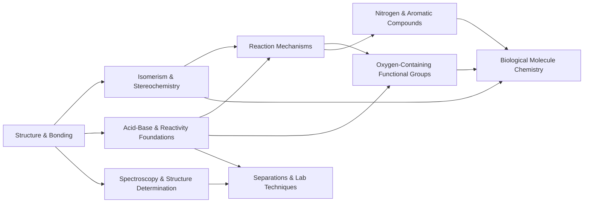

# Research KC Map: MCAT Organic Chemistry (Track A)

Machine-usable Knowledge Component (KC) map for MCAT **Organic Chemistry**. This
is a docs-only research artifact for Track A of the feature expansion plan
(`next-feature-expansion-plan.md`). It does not modify code or the canonical
graph. Downstream tracks (Track B card generation, Track C lessons) can parse
the tables and the prerequisite edge list directly.

Content is synthetic/original and written to align with the AAMC-style
Chemical & Physical Foundations blueprint. Items that are judgment calls or that
need a subject-matter review are marked `(verify)`.

## How to read this file

- Each KC is **one row** in a cluster table below. Columns are exactly the Track A
  fields: KC id, parent cluster, prerequisites, overlapping MCAT sections,
  suggested difficulty ladder, and type.
- KC ids use the `Orgo::<Topic_in_snake_case>` form from `mcat.md`. Every id that
  already exists in `mcat.md` is reused verbatim (marked **[reused]**); genuinely
  new ids are marked **[new]**.
- Prerequisites list KC ids. Cross-discipline prerequisites reference existing
  `GenChem::` and `Physics::` ids from `mcat.md`.
- Overlapping sections use the `MCAT::` section tag values: `Chem_Phys` (always
  primary for Orgo) and `Bio_Biochem` (secondary where biomolecule chemistry or
  wet-lab/spectroscopy passages appear).
- The difficulty ladder is written as `D<min>→D<max>` and maps to the
  `Difficulty::1..5` sampling range for cards in that KC (start low for
  calibration, climb toward the max for application/reasoning items).
- `type` is one of `foundation | mechanism | application | detail`.

### Tag encoding reminder

The KC id column shows the bare id. In Anki tags these are encoded as:

```text
KC::Orgo::Nucleophilic_Substitution
Prereq::Orgo::Reaction_Mechanisms_Overview
Prereq::GenChem::Kinetics
MCAT::Chem_Phys
Difficulty::3
```

## Summary

- **Total KCs: 27** (14 reused from `mcat.md` + 13 new).
- **Clusters: 9.**
- **Prerequisite edges: 74** (61 intra-Orgo + 13 cross-discipline). The graph is
  a DAG (acyclic) — see "Acyclicity" below.
- **Cross-discipline prerequisites referenced:** `GenChem::Covalent_Bond`,
  `GenChem::Molecular_Structure`, `GenChem::Acid_Base_Equilibria`,
  `GenChem::Kinetics`, `GenChem::Thermochemistry`, `GenChem::Electrochemistry`,
  `GenChem::Solubility`, `GenChem::Intermolecular_Forces`,
  `Physics::Electromagnetic_Radiation`.
- **Cross-discipline overlap (section-level, not prereqs):** biomolecule and
  wet-lab KCs contribute to `Bio_Biochem` in addition to `Chem_Phys`, mirroring
  the small Orgo slice (5%) in the Bio/Biochem blueprint.

## Parent clusters

High-level dependency flow between clusters (each cluster only depends on
clusters to its left; no back-edges):



| Cluster | Focus | KCs |
| --- | --- | --- |
| Structure & Bonding | Bonding model, group recognition, naming | 3 |
| Isomerism & Stereochemistry | Constitutional vs stereoisomers, chirality | 2 |
| Acid-Base & Reactivity Foundations | Organic pKa/basicity, mechanism scaffolding | 2 |
| Reaction Mechanisms | Substitution, elimination, addition, acyl sub, redox | 5 |
| Oxygen-Containing Functional Groups | Alcohols/phenols/carbonyls/acids/derivatives | 5 |
| Nitrogen & Aromatic Compounds | Amines, aromatic/heterocyclic systems | 2 |
| Biological Molecule Chemistry | Organic view of carbohydrates & amino acids | 2 |
| Spectroscopy & Structure Determination | IR, NMR, MS, UV-Vis | 4 |
| Separations & Lab Techniques | Purification + integrated structure elucidation | 2 |

## KC tables

### Cluster 1 — Structure & Bonding

| KC id | Parent cluster | Prerequisites | Overlapping sections | Difficulty ladder | Type |
| --- | --- | --- | --- | --- | --- |
| `Orgo::Hybridization` **[reused]** | Structure & Bonding | `GenChem::Covalent_Bond`, `GenChem::Molecular_Structure` | Chem_Phys | D1→D3 | foundation |
| `Orgo::Functional_Groups` **[reused]** | Structure & Bonding | `Orgo::Hybridization`, `GenChem::Covalent_Bond` | Chem_Phys; Bio_Biochem (minor) | D1→D3 | foundation |
| `Orgo::Nomenclature` **[reused]** | Structure & Bonding | `Orgo::Functional_Groups`, `Orgo::Hybridization` | Chem_Phys | D1→D3 | foundation |

### Cluster 2 — Isomerism & Stereochemistry

| KC id | Parent cluster | Prerequisites | Overlapping sections | Difficulty ladder | Type |
| --- | --- | --- | --- | --- | --- |
| `Orgo::Isomerism` **[new]** | Isomerism & Stereochemistry | `Orgo::Functional_Groups`, `Orgo::Nomenclature` | Chem_Phys | D2→D4 | foundation |
| `Orgo::Stereochemistry` **[reused]** | Isomerism & Stereochemistry | `Orgo::Isomerism`, `Orgo::Hybridization` | Chem_Phys; Bio_Biochem (minor) | D2→D5 | foundation |

### Cluster 3 — Acid-Base & Reactivity Foundations

| KC id | Parent cluster | Prerequisites | Overlapping sections | Difficulty ladder | Type |
| --- | --- | --- | --- | --- | --- |
| `Orgo::Acid_Base_Reactions` **[new]** | Acid-Base & Reactivity Foundations | `Orgo::Functional_Groups`, `GenChem::Acid_Base_Equilibria` | Chem_Phys; Bio_Biochem (minor) | D2→D4 | foundation |
| `Orgo::Reaction_Mechanisms_Overview` **[new]** | Acid-Base & Reactivity Foundations | `Orgo::Functional_Groups`, `Orgo::Acid_Base_Reactions`, `GenChem::Kinetics`, `GenChem::Thermochemistry` | Chem_Phys | D2→D4 | foundation |

### Cluster 4 — Reaction Mechanisms

| KC id | Parent cluster | Prerequisites | Overlapping sections | Difficulty ladder | Type |
| --- | --- | --- | --- | --- | --- |
| `Orgo::Nucleophilic_Substitution` **[reused]** | Reaction Mechanisms | `Orgo::Reaction_Mechanisms_Overview`, `Orgo::Stereochemistry`, `GenChem::Kinetics` | Chem_Phys | D2→D5 | mechanism |
| `Orgo::Elimination_Reactions` **[new]** | Reaction Mechanisms | `Orgo::Reaction_Mechanisms_Overview`, `Orgo::Nucleophilic_Substitution` | Chem_Phys | D3→D5 | mechanism |
| `Orgo::Nucleophilic_Addition` **[new]** | Reaction Mechanisms | `Orgo::Reaction_Mechanisms_Overview`, `Orgo::Acid_Base_Reactions` | Chem_Phys | D2→D4 | mechanism |
| `Orgo::Nucleophilic_Acyl_Substitution` **[new]** | Reaction Mechanisms | `Orgo::Nucleophilic_Addition`, `Orgo::Acid_Base_Reactions` | Chem_Phys; Bio_Biochem (minor) | D3→D5 | mechanism |
| `Orgo::Oxidation_Reduction_Reactions` **[new]** | Reaction Mechanisms | `Orgo::Functional_Groups`, `Orgo::Reaction_Mechanisms_Overview`, `GenChem::Electrochemistry` | Chem_Phys; Bio_Biochem (minor) | D2→D4 | mechanism |

### Cluster 5 — Oxygen-Containing Functional Groups

| KC id | Parent cluster | Prerequisites | Overlapping sections | Difficulty ladder | Type |
| --- | --- | --- | --- | --- | --- |
| `Orgo::Alcohols` **[reused]** | Oxygen-Containing Functional Groups | `Orgo::Functional_Groups`, `Orgo::Acid_Base_Reactions`, `Orgo::Nucleophilic_Substitution`, `Orgo::Oxidation_Reduction_Reactions` | Chem_Phys; Bio_Biochem (minor) | D2→D4 | application |
| `Orgo::Aldehydes_and_Ketones` **[reused]** | Oxygen-Containing Functional Groups | `Orgo::Nucleophilic_Addition`, `Orgo::Oxidation_Reduction_Reactions`, `Orgo::Functional_Groups` | Chem_Phys; Bio_Biochem (minor) | D2→D5 | application |
| `Orgo::Carboxylic_Acids` **[reused]** | Oxygen-Containing Functional Groups | `Orgo::Acid_Base_Reactions`, `Orgo::Oxidation_Reduction_Reactions`, `Orgo::Functional_Groups` | Chem_Phys; Bio_Biochem (minor) | D2→D4 | application |
| `Orgo::Acid_Derivatives` **[reused]** | Oxygen-Containing Functional Groups | `Orgo::Nucleophilic_Acyl_Substitution`, `Orgo::Carboxylic_Acids` | Chem_Phys; Bio_Biochem (minor) | D3→D5 | application |
| `Orgo::Phenols` **[reused]** | Oxygen-Containing Functional Groups | `Orgo::Alcohols`, `Orgo::Polycyclic_and_Heterocyclic_Aromatic_Compounds`, `Orgo::Acid_Base_Reactions` | Chem_Phys; Bio_Biochem (minor) | D2→D4 | application |

### Cluster 6 — Nitrogen & Aromatic Compounds

| KC id | Parent cluster | Prerequisites | Overlapping sections | Difficulty ladder | Type |
| --- | --- | --- | --- | --- | --- |
| `Orgo::Polycyclic_and_Heterocyclic_Aromatic_Compounds` **[reused]** | Nitrogen & Aromatic Compounds | `Orgo::Hybridization`, `Orgo::Functional_Groups`, `Orgo::Isomerism` | Chem_Phys; Bio_Biochem (minor) | D2→D4 | application |
| `Orgo::Amines` **[new]** | Nitrogen & Aromatic Compounds | `Orgo::Acid_Base_Reactions`, `Orgo::Functional_Groups`, `Orgo::Nucleophilic_Substitution` | Chem_Phys; Bio_Biochem (minor) | D2→D4 | application |

### Cluster 7 — Biological Molecule Chemistry

| KC id | Parent cluster | Prerequisites | Overlapping sections | Difficulty ladder | Type |
| --- | --- | --- | --- | --- | --- |
| `Orgo::Carbohydrate_Chemistry` **[new]** | Biological Molecule Chemistry | `Orgo::Stereochemistry`, `Orgo::Nucleophilic_Addition`, `Orgo::Alcohols` | Chem_Phys; Bio_Biochem | D2→D4 | application |
| `Orgo::Amino_Acid_and_Peptide_Chemistry` **[new]** | Biological Molecule Chemistry | `Orgo::Stereochemistry`, `Orgo::Acid_Base_Reactions`, `Orgo::Nucleophilic_Acyl_Substitution`, `Orgo::Amines` | Chem_Phys; Bio_Biochem | D2→D4 | application |

### Cluster 8 — Spectroscopy & Structure Determination

| KC id | Parent cluster | Prerequisites | Overlapping sections | Difficulty ladder | Type |
| --- | --- | --- | --- | --- | --- |
| `Orgo::IR_Spectroscopy` **[new]** | Spectroscopy & Structure Determination | `Orgo::Functional_Groups`, `Physics::Electromagnetic_Radiation` | Chem_Phys; Bio_Biochem (minor) | D1→D3 | detail |
| `Orgo::NMR_Spectroscopy` **[new]** | Spectroscopy & Structure Determination | `Orgo::Functional_Groups`, `Orgo::Hybridization`, `Physics::Electromagnetic_Radiation` | Chem_Phys; Bio_Biochem (minor) | D2→D5 | detail |
| `Orgo::Mass_Spectrometry` **[reused]** | Spectroscopy & Structure Determination | `Orgo::Functional_Groups`, `Orgo::Reaction_Mechanisms_Overview` | Chem_Phys | D2→D4 | detail |
| `Orgo::Molecular_Structure_and_Absorption_Spectra` **[reused]** | Spectroscopy & Structure Determination | `Orgo::Hybridization`, `Orgo::Polycyclic_and_Heterocyclic_Aromatic_Compounds`, `Physics::Electromagnetic_Radiation` | Chem_Phys | D2→D4 | detail |

### Cluster 9 — Separations & Lab Techniques

| KC id | Parent cluster | Prerequisites | Overlapping sections | Difficulty ladder | Type |
| --- | --- | --- | --- | --- | --- |
| `Orgo::Separations_and_Purifications` **[reused]** | Separations & Lab Techniques | `Orgo::Functional_Groups`, `Orgo::Acid_Base_Reactions`, `GenChem::Solubility`, `GenChem::Intermolecular_Forces` | Chem_Phys; Bio_Biochem (minor) | D1→D4 | application |
| `Orgo::Laboratory_Techniques` **[new]** | Separations & Lab Techniques | `Orgo::Separations_and_Purifications`, `Orgo::IR_Spectroscopy`, `Orgo::NMR_Spectroscopy`, `Orgo::Mass_Spectrometry` | Chem_Phys; Bio_Biochem (minor) | D3→D5 | application |

## Prerequisite edge list

Authored in the canonical `prerequisite -> target` direction (matches
`mcat-graph-audit.md`). Stored internally via
`add_prerequisite(target, prerequisite)`.

### Cross-discipline edges (GenChem / Physics -> Orgo)

```text
GenChem::Covalent_Bond -> Orgo::Hybridization
GenChem::Molecular_Structure -> Orgo::Hybridization
GenChem::Covalent_Bond -> Orgo::Functional_Groups
GenChem::Acid_Base_Equilibria -> Orgo::Acid_Base_Reactions
GenChem::Kinetics -> Orgo::Reaction_Mechanisms_Overview
GenChem::Thermochemistry -> Orgo::Reaction_Mechanisms_Overview
GenChem::Kinetics -> Orgo::Nucleophilic_Substitution
GenChem::Electrochemistry -> Orgo::Oxidation_Reduction_Reactions
GenChem::Solubility -> Orgo::Separations_and_Purifications
GenChem::Intermolecular_Forces -> Orgo::Separations_and_Purifications
Physics::Electromagnetic_Radiation -> Orgo::IR_Spectroscopy
Physics::Electromagnetic_Radiation -> Orgo::NMR_Spectroscopy
Physics::Electromagnetic_Radiation -> Orgo::Molecular_Structure_and_Absorption_Spectra
```

### Intra-Orgo edges

```text
Orgo::Hybridization -> Orgo::Functional_Groups
Orgo::Functional_Groups -> Orgo::Nomenclature
Orgo::Hybridization -> Orgo::Nomenclature
Orgo::Functional_Groups -> Orgo::Isomerism
Orgo::Nomenclature -> Orgo::Isomerism
Orgo::Isomerism -> Orgo::Stereochemistry
Orgo::Hybridization -> Orgo::Stereochemistry
Orgo::Functional_Groups -> Orgo::Acid_Base_Reactions
Orgo::Functional_Groups -> Orgo::Reaction_Mechanisms_Overview
Orgo::Acid_Base_Reactions -> Orgo::Reaction_Mechanisms_Overview
Orgo::Reaction_Mechanisms_Overview -> Orgo::Nucleophilic_Substitution
Orgo::Stereochemistry -> Orgo::Nucleophilic_Substitution
Orgo::Reaction_Mechanisms_Overview -> Orgo::Elimination_Reactions
Orgo::Nucleophilic_Substitution -> Orgo::Elimination_Reactions
Orgo::Reaction_Mechanisms_Overview -> Orgo::Nucleophilic_Addition
Orgo::Acid_Base_Reactions -> Orgo::Nucleophilic_Addition
Orgo::Nucleophilic_Addition -> Orgo::Nucleophilic_Acyl_Substitution
Orgo::Acid_Base_Reactions -> Orgo::Nucleophilic_Acyl_Substitution
Orgo::Functional_Groups -> Orgo::Oxidation_Reduction_Reactions
Orgo::Reaction_Mechanisms_Overview -> Orgo::Oxidation_Reduction_Reactions
Orgo::Functional_Groups -> Orgo::Alcohols
Orgo::Acid_Base_Reactions -> Orgo::Alcohols
Orgo::Nucleophilic_Substitution -> Orgo::Alcohols
Orgo::Oxidation_Reduction_Reactions -> Orgo::Alcohols
Orgo::Hybridization -> Orgo::Polycyclic_and_Heterocyclic_Aromatic_Compounds
Orgo::Functional_Groups -> Orgo::Polycyclic_and_Heterocyclic_Aromatic_Compounds
Orgo::Isomerism -> Orgo::Polycyclic_and_Heterocyclic_Aromatic_Compounds
Orgo::Alcohols -> Orgo::Phenols
Orgo::Polycyclic_and_Heterocyclic_Aromatic_Compounds -> Orgo::Phenols
Orgo::Acid_Base_Reactions -> Orgo::Phenols
Orgo::Nucleophilic_Addition -> Orgo::Aldehydes_and_Ketones
Orgo::Oxidation_Reduction_Reactions -> Orgo::Aldehydes_and_Ketones
Orgo::Functional_Groups -> Orgo::Aldehydes_and_Ketones
Orgo::Acid_Base_Reactions -> Orgo::Carboxylic_Acids
Orgo::Oxidation_Reduction_Reactions -> Orgo::Carboxylic_Acids
Orgo::Functional_Groups -> Orgo::Carboxylic_Acids
Orgo::Nucleophilic_Acyl_Substitution -> Orgo::Acid_Derivatives
Orgo::Carboxylic_Acids -> Orgo::Acid_Derivatives
Orgo::Acid_Base_Reactions -> Orgo::Amines
Orgo::Functional_Groups -> Orgo::Amines
Orgo::Nucleophilic_Substitution -> Orgo::Amines
Orgo::Stereochemistry -> Orgo::Carbohydrate_Chemistry
Orgo::Nucleophilic_Addition -> Orgo::Carbohydrate_Chemistry
Orgo::Alcohols -> Orgo::Carbohydrate_Chemistry
Orgo::Stereochemistry -> Orgo::Amino_Acid_and_Peptide_Chemistry
Orgo::Acid_Base_Reactions -> Orgo::Amino_Acid_and_Peptide_Chemistry
Orgo::Nucleophilic_Acyl_Substitution -> Orgo::Amino_Acid_and_Peptide_Chemistry
Orgo::Amines -> Orgo::Amino_Acid_and_Peptide_Chemistry
Orgo::Functional_Groups -> Orgo::IR_Spectroscopy
Orgo::Functional_Groups -> Orgo::NMR_Spectroscopy
Orgo::Hybridization -> Orgo::NMR_Spectroscopy
Orgo::Functional_Groups -> Orgo::Mass_Spectrometry
Orgo::Reaction_Mechanisms_Overview -> Orgo::Mass_Spectrometry
Orgo::Hybridization -> Orgo::Molecular_Structure_and_Absorption_Spectra
Orgo::Polycyclic_and_Heterocyclic_Aromatic_Compounds -> Orgo::Molecular_Structure_and_Absorption_Spectra
Orgo::Functional_Groups -> Orgo::Separations_and_Purifications
Orgo::Acid_Base_Reactions -> Orgo::Separations_and_Purifications
Orgo::Separations_and_Purifications -> Orgo::Laboratory_Techniques
Orgo::IR_Spectroscopy -> Orgo::Laboratory_Techniques
Orgo::NMR_Spectroscopy -> Orgo::Laboratory_Techniques
Orgo::Mass_Spectrometry -> Orgo::Laboratory_Techniques
```

### Acyclicity

The map is a DAG. A valid topological ordering (every prerequisite precedes its
targets) is:

```text
1.  Orgo::Hybridization
2.  Orgo::Functional_Groups
3.  Orgo::Nomenclature
4.  Orgo::Isomerism
5.  Orgo::Acid_Base_Reactions
6.  Orgo::Stereochemistry
7.  Orgo::Reaction_Mechanisms_Overview
8.  Orgo::Polycyclic_and_Heterocyclic_Aromatic_Compounds
9.  Orgo::Nucleophilic_Substitution
10. Orgo::Nucleophilic_Addition
11. Orgo::Oxidation_Reduction_Reactions
12. Orgo::Elimination_Reactions
13. Orgo::Nucleophilic_Acyl_Substitution
14. Orgo::Alcohols
15. Orgo::Aldehydes_and_Ketones
16. Orgo::Carboxylic_Acids
17. Orgo::Amines
18. Orgo::Phenols
19. Orgo::Acid_Derivatives
20. Orgo::Carbohydrate_Chemistry
21. Orgo::Amino_Acid_and_Peptide_Chemistry
22. Orgo::IR_Spectroscopy
23. Orgo::NMR_Spectroscopy
24. Orgo::Mass_Spectrometry
25. Orgo::Molecular_Structure_and_Absorption_Spectra
26. Orgo::Separations_and_Purifications
27. Orgo::Laboratory_Techniques
```

Because a topological ordering exists, there are no prerequisite cycles. Only
`Orgo::Hybridization` has purely cross-discipline (non-Orgo) prerequisites, so it
is the single intra-Orgo root.

## Per-KC scope notes

Concise scope, key sub-concepts, and a common misconception for each KC, to seed
Track B item generation and Track C lessons. Difficulty rationale explains the
ladder in the tables.

### Structure & Bonding

- **`Orgo::Hybridization`** — sp/sp2/sp3 orbitals, sigma vs pi bonds, geometry,
  bond angles, conjugation/resonance basics. Misconception: confusing molecular
  geometry with hybridization label. Ladder low: recognition-heavy.
- **`Orgo::Functional_Groups`** — identify and rank polarity/reactivity of
  alkyl, alkene/alkyne, alcohol, ether, amine, carbonyl, carboxyl, and derivative
  groups. Misconception: treating all C=O groups as equivalent. Foundational
  recognition, so ladder starts at D1.
- **`Orgo::Nomenclature`** — IUPAC parent chain, locants, substituent priority,
  E/Z and R/S labels within names. Misconception: mis-ranking substituent
  alphabetization vs lowest-locant rule.

### Isomerism & Stereochemistry

- **`Orgo::Isomerism`** — constitutional (chain, positional, functional) vs
  stereoisomers; degrees of unsaturation. Sets vocabulary for stereochemistry.
  Misconception: calling conformers distinct isomers.
- **`Orgo::Stereochemistry`** — chirality, R/S (CIP), E/Z, enantiomers vs
  diastereomers, meso, optical activity, specific rotation, Fischer projections,
  relative vs absolute configuration. High ceiling (D5): counting stereocenters
  and relating configuration to physical/biological properties is application-
  heavy. Misconception: assuming all chiral molecules are optically active in a
  racemic mixture.

### Acid-Base & Reactivity Foundations

- **`Orgo::Acid_Base_Reactions`** — organic pKa trends; conjugate-base stability
  via resonance, induction, hybridization, and atom size; Lewis vs Bronsted;
  predicting equilibrium direction; nucleophile/base relationship. Central hub
  feeding carbonyls, acids, phenols, and amines. Misconception: ranking acidity
  by the acidic proton's environment instead of conjugate-base stability.
- **`Orgo::Reaction_Mechanisms_Overview`** — nucleophiles/electrophiles,
  curved-arrow formalism, reactive intermediates (carbocations, carbanions,
  radicals), carbocation stability/rearrangement, leaving-group ability,
  thermodynamic vs kinetic control, energy diagrams. Scaffolding for all
  specific mechanisms. Misconception: drawing arrows from positive to negative
  centers (should flow from electron source to sink).

### Reaction Mechanisms

- **`Orgo::Nucleophilic_Substitution`** — SN1 vs SN2: rate laws, stereochemistry
  (inversion vs racemization), substrate/nucleophile/leaving-group/solvent
  effects. High ceiling for competition/prediction items. Misconception: SN2 is
  always faster, or tertiary substrates favor SN2.
- **`Orgo::Elimination_Reactions`** — E1 vs E2, Zaitsev vs Hofmann, anti-
  periplanar requirement, substitution vs elimination competition. Taught right
  after substitution. Misconception: ignoring base strength/sterics when picking
  E1 vs E2.
- **`Orgo::Nucleophilic_Addition`** — addition to C=O: hydration, hemiacetal/
  acetal, imine/enamine, cyanohydrin; acid vs base catalysis. Mechanistic basis
  for aldehyde/ketone and carbohydrate chemistry. Misconception: acetal
  formation is irreversible.
- **`Orgo::Nucleophilic_Acyl_Substitution`** — addition-elimination at carboxylic
  acid derivatives; reactivity ladder (acyl halide > anhydride > ester > amide);
  tetrahedral intermediate. Underlies peptide-bond and ester chemistry.
  Misconception: amides are highly reactive toward nucleophiles.
- **`Orgo::Oxidation_Reduction_Reactions`** — organic oxidation states;
  alcohol ↔ aldehyde/ketone ↔ carboxylic acid interconversions; common reagents
  (PCC, chromic acid, NaBH4, LiAlH4, catalytic H2). Misconception: reading redox
  by electron transfer alone rather than C–H/C–O bond changes. `(verify)` whether
  to keep this as its own KC or fold oxidation/reduction into each functional-
  group KC.

### Oxygen-Containing Functional Groups

- **`Orgo::Alcohols`** — acidity, H-bonding/boiling points, oxidation, SN
  reactions of the C–OH, acid-catalyzed dehydration (links to elimination),
  protection. Misconception: alcohols are strong acids.
- **`Orgo::Aldehydes_and_Ketones`** — nucleophilic addition products, keto-enol
  tautomerism, enols/enolates, aldol, alpha-carbon acidity, oxidation of
  aldehydes. High ceiling (aldol/enolate reasoning). Misconception: ketones
  oxidize as readily as aldehydes.
- **`Orgo::Carboxylic_Acids`** — acidity and substituent effects, salt formation,
  decarboxylation, reduction, formation by oxidation. Misconception: treating
  carboxylic acid acidity as independent of the R group.
- **`Orgo::Acid_Derivatives`** — esters, amides, anhydrides, acyl halides:
  interconversion, hydrolysis (saponification), relative reactivity. High
  ceiling. Misconception: all derivatives hydrolyze at similar rates.
- **`Orgo::Phenols`** — enhanced acidity via ring resonance, oxidation to
  quinones, antioxidant behavior, substituent effects on acidity. Misconception:
  phenol and cyclohexanol have comparable acidity.

### Nitrogen & Aromatic Compounds

- **`Orgo::Polycyclic_and_Heterocyclic_Aromatic_Compounds`** — aromaticity
  criteria (planar, cyclic, conjugated, Hückel 4n+2), resonance stabilization,
  fused rings, N/O/S heterocycles (biological ring systems). Misconception:
  every ring with double bonds is aromatic.
- **`Orgo::Amines`** — basicity and nucleophilicity trends, aliphatic vs
  aromatic amines, protonation state vs pH, salt solubility, formation routes.
  Misconception: aromatic amines are more basic than aliphatic amines.

### Biological Molecule Chemistry

- **`Orgo::Carbohydrate_Chemistry`** — monosaccharide stereochemistry (D/L,
  epimers, anomers), Fischer/Haworth, cyclization via intramolecular
  hemiacetal, mutarotation, glycosidic (acetal) bonds, reducing sugars. Pairs
  with `Biochem::Carbohydrates_and_Lipids` (overlap, not a hard prereq).
  Misconception: alpha/beta anomers are different molecules rather than
  interconverting forms.
- **`Orgo::Amino_Acid_and_Peptide_Chemistry`** — L-amino acid chirality, side-
  chain classification, zwitterion/isoelectric point, titration curves, peptide
  (amide) bond formation as nucleophilic acyl substitution. Pairs with
  `Biochem::Amino_Acids` and `Biochem::Peptides_and_Proteins` (overlap).
  Misconception: net charge equals zero everywhere except exactly at pI.

### Spectroscopy & Structure Determination

- **`Orgo::IR_Spectroscopy`** — diagnostic stretches (O–H, N–H, C=O, C≡N, C=C),
  functional-group fingerprinting. Recognition-oriented, low ladder.
  Misconception: reading the fingerprint region peak-by-peak.
- **`Orgo::NMR_Spectroscopy`** — 1H NMR chemical shift, integration, spin-spin
  splitting (n+1), equivalence; intro 13C. High ceiling for full structure
  deduction. Misconception: equating integration ratio with absolute proton
  count rather than relative.
- **`Orgo::Mass_Spectrometry`** — molecular ion, isotope patterns, fragmentation
  driven by cation stability, base peak. Prereq on mechanisms overview for
  fragmentation reasoning. Misconception: the tallest peak is always the
  molecular ion.
- **`Orgo::Molecular_Structure_and_Absorption_Spectra`** — UV-Vis absorption,
  conjugation/chromophores, HOMO-LUMO gap, Beer-Lambert. Misconception:
  isolated double bonds absorb in the accessible UV-Vis range.

### Separations & Lab Techniques

- **`Orgo::Separations_and_Purifications`** — liquid-liquid extraction (including
  acid-base extraction), distillation (simple/fractional), recrystallization,
  filtration, chromatography as a separation (TLC, column). Misconception:
  extraction separates by molecular size.
- **`Orgo::Laboratory_Techniques`** — integrative structure elucidation:
  combining IR + NMR + MS with purification/chromatography (Rf, retention) to
  identify an unknown; degrees-of-unsaturation reasoning. Capstone application
  at the top of the lattice. `(verify)` scope overlap with
  `Orgo::Separations_and_Purifications` — this KC is intentionally the
  "analyze/identify" bucket while separations is the "isolate/purify" bucket.

## Cross-discipline overlap summary

- **Hard prerequisites into Orgo (edges above):** all from `GenChem::` and
  `Physics::`. Orgo reactivity is grounded in general-chemistry bonding,
  acid-base equilibria, kinetics/thermodynamics, electrochemistry (redox),
  solubility, and intermolecular forces; spectroscopy is grounded in the physics
  of electromagnetic radiation.
- **Section overlap (evidence contribution, not prereqs):** every Orgo KC is
  primarily `Chem_Phys`. Biomolecule KCs (`Orgo::Carbohydrate_Chemistry`,
  `Orgo::Amino_Acid_and_Peptide_Chemistry`) and functional-group/wet-lab KCs
  also contribute to `Bio_Biochem`, matching the 5% Orgo slice of the Bio/Biochem
  blueprint and the way biochemistry passages assume organic functional-group
  fluency. This is consistent with `derived_mcat_sections_for_topics` mapping
  `Orgo::` to `Chem_Phys`; the `Bio_Biochem` tags below are an authoring
  recommendation for biomolecule/lab cards, applied per-card via `MCAT::` tags.
- **Reverse overlap (Orgo supporting Biochem):** `Biochem::Amino_Acids`,
  `Biochem::Carbohydrates_and_Lipids`, `Biochem::Peptides_and_Proteins`, and
  `Biochem::Nucleotides_and_Nucleic_Acids` depend conceptually on the organic
  functional-group, stereochemistry, and acyl-substitution KCs here. Those edges
  belong to the Biochem research map, not this one, to keep each discipline map
  acyclic and independently authored `(verify)` with the Biochem subagent.

## Research notes

- **Scope alignment.** The map follows the AAMC Chemical & Physical Foundations
  emphasis: reactions of biologically relevant functional groups (alcohols,
  aldehydes/ketones, carboxylic acids and derivatives, amines), substitution/
  elimination, stereochemistry, acid-base reasoning, spectroscopy, and
  separations. Alkene/alkyne electrophilic addition, free-radical halogenation,
  and multi-step total-synthesis are intentionally **de-emphasized/omitted**
  because AAMC does not stress them; `(verify)` if the deck later needs a light
  `Orgo::Alkene_and_Alkyne_Reactions` KC.
- **New vs reused ids.** All 14 existing `Orgo::` ids from `mcat.md` are reused
  verbatim. 13 new ids were added: `Isomerism`, `Acid_Base_Reactions`,
  `Reaction_Mechanisms_Overview`, `Elimination_Reactions`, `Nucleophilic_Addition`,
  `Nucleophilic_Acyl_Substitution`, `Oxidation_Reduction_Reactions`, `Amines`,
  `Carbohydrate_Chemistry`, `Amino_Acid_and_Peptide_Chemistry`, `IR_Spectroscopy`,
  `NMR_Spectroscopy`, `Laboratory_Techniques`.
- **Judgment calls marked `(verify)`:**
  - Splitting mechanism KCs (`Nucleophilic_Addition`,
    `Nucleophilic_Acyl_Substitution`) from the functional-group families
    (`Aldehydes_and_Ketones`, `Acid_Derivatives`). Chosen for clean prereq
    layering; could be merged if the deck prefers fewer nodes.
  - Keeping `Oxidation_Reduction_Reactions` as a standalone mechanism KC.
  - `Laboratory_Techniques` vs `Separations_and_Purifications` scope boundary.
  - Biomolecule KC overlap/dedup with the `Biochem::` map.
  - `Physics::Electromagnetic_Radiation` as the spectroscopy prerequisite (vs
    `Physics::Light` / `Physics::Atoms`); chose EM radiation as the closest fit.
- **Difficulty ladders** are authoring suggestions for the per-card
  `Difficulty::1..5` sampling range, not fixed values. Foundations/recognition
  KCs start at D1; mechanism/application KCs with heavy prediction or multi-step
  reasoning (`Stereochemistry`, `Nucleophilic_Substitution`, `Aldehydes_and_Ketones`,
  `Acid_Derivatives`, `NMR_Spectroscopy`, `Laboratory_Techniques`) reach D5.
- **Reasoning tags (for Track B).** Suggested emphasis by cluster: foundations →
  `Reasoning::Conceptual`; mechanisms & functional groups → `Reasoning::Application`;
  spectroscopy & lab → `Reasoning::Data` and `Reasoning::ResearchDesign`. Applied
  per-card, not stored on KCs.
- **Content is synthetic/original** and not copied from copyrighted prep
  material.
