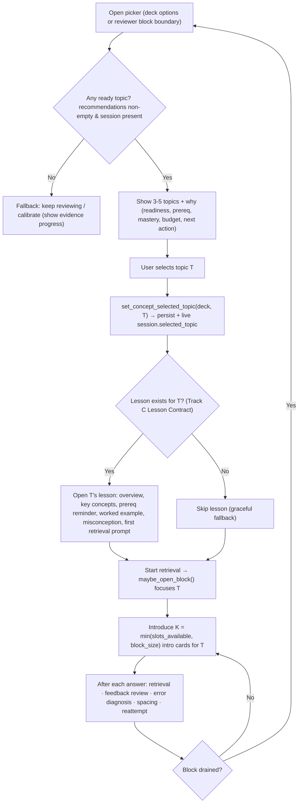

# Topic Picker Design (Track D: Human-Guided Outer-Fringe Topic Choice)

Status: **partially implemented.** This spec turns the
existing *auto* outer-fringe topic selection into a *user-facing, explainable*
picker: "you pick one of 3-5 ready-to-learn topics, we tell you why, then we open
its lesson and introduce its cards."

Implemented so far (see `progress.md`): the §7 backend write path
(`ConceptSchedulerState.selected_topic`, `Collection::set_concept_selected_topic`,
the `SetConceptSelectedTopic` RPC, and build-time seeding of the live session),
plus a **graph-based** picker in the reviewer — the layered concept map highlights
the outer-fringe frontier as "ready to start" and clicking a node selects it
(`pycmd("conceptStart:<KC>")`). Still to do: the explainable 3-5-row picker card
with "why" chips (§1) and the cross-section recommendation policy (see below).

Next feature (per user): shape recommendations as **2 topics in the current
section + 1 in each of the other two** super-sections, surfaced after mastering,
so "what to learn next" always spans Bio/Biochem, Chem/Phys, Psych/Soc. This is a
change to `recommended_topics()` (`concept_demo.rs`) once "current section" is
derived from the active/selected topic; the write path it depends on already ships.

Scope owner: Track D. Hard dependency on Track C (Lesson Contract) only for the
"open the lesson first" step; the picker itself ships without it (graceful
fallback described in [The Flow](#5-the-flow-pick--lesson--cards)).

---

## 0. What already exists (grounding)

The backend already computes and exposes everything the picker needs to *read*.
Selection is currently automatic: the queue focuses the first readiness-sorted
topic. Concretely:

- **Recommendations (read model).** `Collection::concept_scheduler_status()` in
  `rslib/src/scheduler/concept_demo.rs` builds
  `ConceptSchedulerStatusResponse.recommendations`, a list of
  `ConceptTopicRecommendation`. They are produced by `recommended_topics()`
  (same file, ~L519-550): filtered to outer-fringe KCs
  (`ConceptSchedulerState::is_outer_fringe`), scored by
  `readiness_score = prerequisite_mastery * (1 - target_mastery)`, sorted
  descending, and **truncated to 5**. Each row already carries
  `id`, `readiness_score`, `mastery`, `prerequisite_mastery`, `selectable`.
- **Session budget (read model).** `ConceptSessionStatus` (proto) is produced by
  `ConceptSessionState::status()` in `rslib/src/scheduler/queue/mod.rs`
  (~L201-219). It exposes `reviews_toward_next_slot`, `reviews_per_slot` (=4),
  `slots_available`, `block_remaining`, `block_size` (=3), `active_topic`,
  `selected_topic`, `budget_progress`.
- **Selection field already wired into the queue, but never written.**
  `ConceptSessionState.selected_topic: Option<KnowledgeComponentId>` exists in
  `rslib/src/scheduler/queue/mod.rs` (~L97). `maybe_open_block()` (~L144-171)
  already prefers it over the auto pick:
  `self.selected_topic.clone().or_else(|| self.first_topic_in(main))`. The only
  place it is ever set today is a Rust unit test
  (`concept_budget_respects_selected_topic`, ~L743-782). At runtime it is
  initialized to `None` in `ConceptSessionState::new()` and never mutated, so in
  practice selection is auto.
- **RPC surface.** `SchedulerService.GetConceptSchedulerStatus`
  (`rslib/src/scheduler/service/mod.rs`, `get_concept_scheduler_status`, ~L386)
  returns the whole read model. There is **no** RPC to *write* a selected topic.
- **Current UI is a debug dump, not a picker.** In
  `ts/routes/deck-options/ConceptSchedulerOptions.svelte` the `.recommendation-list`
  block (~L534-548) only prints `id` + `selectable`. The reviewer sidebar
  (`qt/aqt/reviewer.py`, `_renderConceptGraphSidebar`, ~L389-488) renders the
  graph and section scores but has no picker and no selection affordance.

**Conclusion:** the picker is ~90% a read-model + UI feature. The single missing
backend capability is a way to *persist and apply* a user-chosen topic. See
[Integration Notes](#4-integration-notes).

---

## 1. UX Spec

### 1.1 Goals

1. Show **3-5 outer-fringe topics**, readiness-sorted (highest first).
2. For each topic, explain **why it is recommended** using four signals:
   - **Prerequisites ready** — from `prerequisite_mastery`.
   - **Target not yet mastered** — from `mastery`.
   - **Available new-topic budget** — from `session.slots_available` /
     `reviews_toward_next_slot` / `reviews_per_slot`.
   - **Next action** — a single concrete instruction derived from the above.
3. Let the user **pick one**, which sets the session's `selected_topic`.
4. Make readiness legible, not a black box: show the formula in plain words.

### 1.2 Copy / humanization rules

- KC ids look like `Biochem::Citric_Acid_Cycle`. Display = last `::` segment with
  `_`→space ("Citric Acid Cycle"), with a small section badge derived from the
  prefix (`Bio`/`Biochem`→Bio/Biochem, `GenChem`/`Physics`/`Orgo`→Chem/Phys,
  `PsychSoc`→Psych/Soc, else CARS). This mirrors `majorAreaFor()` already in
  `ConceptSchedulerOptions.svelte` (~L201-219) and `graphLabels` in
  `reviewer.py` (~L355-366).
- Percentages via the existing `percent()` helper (`Math.round(value*100)%`).
- Readiness bar width = `readiness_score` (0..1). Tooltip:
  `readiness = prereq_ready × (1 − mastered) = NN% × (1 − MM%) = RR%`.

### 1.3 "Why" chip logic (per topic)

| Chip | Field | Ready/soft threshold | Example text |
|---|---|---|---|
| Prereqs ready | `prerequisite_mastery` | ≥ `outer_fringe_prereq_mastery` (0.70) | "Prereqs ready · 88%" |
| Room to grow | `mastery` | low is better for a *next* topic | "Not yet mastered · 18%" |
| Budget | `session.slots_available`, `budget_progress` | `slots_available > 0` | "3 new-topic slots ready" / "1 more review to unlock a slot" |
| Next action | derived | — | "Open lesson, then 3 intro cards" |

Next-action derivation (priority order):
1. If no `session` (queue not built / evidence insufficient): **"Keep reviewing to
   calibrate (NN/RR cards)."** (uses `evidence.seen_cards/required_seen_cards`).
2. Else if `slots_available == 0`: **"Answer N more reviews to open a block"** where
   `N = reviews_per_slot − reviews_toward_next_slot`.
3. Else if a lesson exists for the KC (Track C): **"Open lesson, then K intro cards"**
   where `K = min(slots_available, block_size)`.
4. Else: **"Start K intro cards"** (lesson step skipped; see fallback).

### 1.4 Selectable / disabled states

- `recommendation.selectable == false` → row shown but not clickable (greyed),
  reason chip explains why (e.g. locked prereqs). *Note:* backend currently always
  sets `selectable = true`; §4 proposes tightening it, but the UI should already
  honor the flag.
- `slots_available == 0` → the row is selectable as a **queued choice** ("Select for
  next block") but the block won't open until a slot is earned. This lets a user
  pre-commit a topic while finishing reviews.
- Currently selected topic (`session.selected_topic == id`) → shown pinned at top
  with a "Selected" badge and a "Change" affordance.

### 1.5 Deck-options placement (wireframe)

Replaces the debug `.recommendation-list` in `ConceptSchedulerOptions.svelte`.
Lives inside the existing `Concept Scheduler` `TitledContainer`, under the counters
and above the graph sections.

```text
┌─ Concept Scheduler ─────────────────────────────────────────────┐
│ Concept Scheduler Mode                                    [ ON ] │
│ Status: on for "MCAT Demo"                                       │
│ [ 42% seen ] [ 5 positive today ] [ 0 prereq violations ]       │
│                                                                 │
│ ── Choose your next topic ──────────────────────────────────── │
│ Budget: 3 slots ready · 2/4 reviews toward next slot  ▓▓▓░ 50% │
│                                                                 │
│ ●  Genetics                        [Bio/Biochem]   Readiness 72%│
│    ▓▓▓▓▓▓▓░░░                                                    │
│    ✓ Prereqs ready 90%   ○ Not yet mastered 20%   ⧗ 3 slots     │
│    → Open lesson, then 3 intro cards            [ Select ▶ ]     │
│                                                                 │
│ ●  Peptides & Proteins             [Bio/Biochem]   Readiness 57%│
│    ▓▓▓▓▓▓░░░░                                                    │
│    ✓ Prereqs ready 88%   ○ Not yet mastered 35%   ⧗ 3 slots     │
│    → Open lesson, then 3 intro cards            [ Select ▶ ]     │
│                                                                 │
│ ●  Bioenergetics                   [Bio/Biochem]   Readiness 41%│
│    ▓▓▓▓░░░░░░                                                    │
│    ✓ Prereqs ready 76%   ○ Not yet mastered 46%   ⧗ 3 slots     │
│    → Open lesson, then 3 intro cards            [ Select ▶ ]     │
│                                                                 │
│ (up to 5 rows; readiness-sorted)                                │
│                                                                 │
│ ▸ Bio   ▸ Biochem   ▸ Chem/Phys   ▸ Psych/Soc   ▸ CARS  (graph) │
└─────────────────────────────────────────────────────────────────┘
```

Empty / fallback state (no outer-fringe topics OR evidence insufficient):

```text
│ ── Choose your next topic ──────────────────────────────────── │
│ No new topic is ready yet.                                      │
│ Keep reviewing to calibrate — 42/500 cards seen.  ▓▓░░░░ 42%   │
│ We'll surface 3-5 ready topics once your foundations are solid. │
```

### 1.6 Reviewer placement (wireframe)

The reviewer already has a bottom-bar `Progress` button that toggles the concept
sidebar (`pycmd('conceptGraph')`, `reviewer.py` ~L1082, handled at ~L943). Add a
sibling **`Next topic`** button (`pycmd('conceptPicker')`) that opens a picker
panel. The picker should also **auto-open at a block boundary** — i.e. when
`session.block_remaining == 0` and `slots_available > 0` and no `selected_topic`
— so choice happens exactly when the scheduler is about to introduce new cards.

Reviewer picker panel (right-side overlay, same surface style as the graph
sidebar):

```text
                                        ┌─ Choose your next topic ──────┐
                                        │ Budget 3 slots · block 3      │
                                        │                               │
   [ question / answer area ]           │ ● Genetics        R 72%       │
                                        │   ✓ prereq 90% ○ mastery 20%  │
                                        │   → Lesson, then 3 cards      │
                                        │                    [ Start ▶ ]│
                                        │                               │
                                        │ ● Peptides        R 57%       │
                                        │   ✓ prereq 88% ○ mastery 35%  │
                                        │                    [ Start ▶ ]│
                                        │                               │
                                        │ ● Bioenergetics   R 41%       │
                                        │                    [ Start ▶ ]│
                                        │                               │
                                        │ Not now → keep reviewing      │
                                        └───────────────────────────────┘
   [ Edit ]              [ Next topic ] [ Progress ] [ More ⌄ ]
```

Rationale for two placements:
- **Deck-options** = calm, pre-study planning + explanation surface (already the
  home of the live status panel).
- **Reviewer** = in-flow, just-in-time choice at the moment new cards would appear;
  this is where "human-guided" matters most.

---

## 2. Behavior Spec

### 2.1 Selecting a topic

On **Select/Start** for topic `T` (a KC id string):

1. UI calls the new write path (see §4) with `(deck_id, topic=T)`.
2. Backend records `T` as the session's selected topic:
   - Sets the **live** `ConceptSessionState.selected_topic = Some(T)` on the
     current `self.state.card_queues` (if a queue is built), and
   - **Persists** `T` in the deck's concept scheduler state so it survives the
     frequent queue rebuilds (queues rebuild resets `ConceptSessionState` to
     `selected_topic = None` today).
3. Backend re-runs the presentation pass (`prepare_concept_presentation()` in
   `queue/mod.rs`), which calls `maybe_open_block()`. Because `selected_topic` now
   takes priority over `first_topic_in()`, the focused block opens on `T`.
4. UI refreshes via `GetConceptSchedulerStatus`; `session.selected_topic` and
   `session.active_topic` now reflect `T`.

### 2.2 Effect on the current focused block / queue

`prepare_concept_presentation()` + `maybe_open_block()` already implement the
mechanics; selection just feeds them a topic. The concrete effect:

- **Block opens on `T`.** `active_topic = T`,
  `block_remaining = min(slots_available, block_size)` (≤ 3).
- **Only `T`'s new cards are promoted** to the front and made visible. The promotion
  loop (`queue/mod.rs` ~L375-399) keeps new cards where
  `matches_active_topic(card)` and defers the rest; `entry_is_visible()` hides
  non-block new cards. So the learner sees `T`'s intro cards next, interleaved per
  the deck's new/review mix.
- **Budget still gates quantity.** With reviews still pending, a block only opens
  once `slots_available >= block_size` (the anti-context-switch rule). If reviews
  are exhausted, a smaller partial block is allowed. Selection does **not** bypass
  budget — it only decides *which* topic the earned slots go to.

**Switch semantics when a block is already open on another topic.** Two options;
recommend **(A)** as default, expose **(B)** as an explicit action:

- (A) *Apply at next boundary (default).* Persist `selected_topic = T` now; it takes
  effect when the current block drains (`block_remaining` hits 0 → `active_topic`
  cleared → next `maybe_open_block()` picks `T`). Least disruptive; no partial
  block is wasted.
- (B) *Switch now.* Reset `active_topic = None`, `block_remaining = 0`,
  `visible_new_cards.clear()`, then `prepare_concept_presentation()`. Immediately
  reorders to `T`. Use for an explicit "switch now" button; note it abandons the
  in-progress block's remaining slots.

### 2.3 When no topic is ready (fallback)

Fallback triggers, in order of precedence:

1. **Evidence insufficient** — `evidence.kind == INSUFFICIENT`
   (`readiness_evidence_status`, `concept.rs`). The queue's new-card sort is skipped
   (`prepare_concept_new_card_sort` returns early in
   `queue/builder/sorting.rs` ~L34-39), so **`concept_session` is `None`** and
   there is no block to steer. Picker shows the **calibration** state (§1.5 empty
   state) and study proceeds as normal Anki ordering (review/learn/new).
   *Selection is disabled or "pre-committed for later" — it cannot change the queue
   until the evidence gate passes.* (This subtlety is important; see §4.6.)
2. **No outer-fringe topics** — `recommendations` is empty (all remaining KCs still
   have weak prereqs, or everything reachable is already inner-fringe). Picker shows
   "No new topic is ready yet — keep reviewing/mastering foundations." Study
   continues on reviews + any auto new cards.
3. **No budget** — `slots_available == 0`. Topics are shown with the budget chip
   "Answer N more reviews to open a block"; user may pre-select, but the block waits.

In all fallbacks, the primary call to action is **review/calibration**, matching the
Track D acceptance criterion "If no topic is ready, fallback remains
review/calibration."

### 2.4 Post-answer "next actions"

After the answer is revealed (reviewer answer state), surface up to a few concrete
next actions. These are **contextual** on the rating and the card's KC (the KC is
already known via the `KC::` tag / `_concept_labels()` in `reviewer.py`).

| Action | When surfaced | Source signal | UI |
|---|---|---|---|
| **Retrieval** | always, after reveal | next queued card / lesson `first retrieval prompt` (Track C) | primary "Continue" advances to next intro/review card |
| **Feedback review** | always | card back explanation (already rendered) + lesson section | "Review explanation" / "Open lesson" (Track C) |
| **Error diagnosis** | rating ∈ {Again, Hard} | weakest prereq via `graph.nodes[].prerequisite_mastery` + edges; `prerequisite_violations` counter | "This leans on <Prereq> (mastery 42%). Review it?" → jump to prereq |
| **Spacing** | always | FSRS next interval (existing scheduling states) | "Next due in Xd" chip; no action needed |
| **Reattempt** | rating == Again | scheduler re-queues the card | "Try again now" re-shows the card in-session |

Notes:
- **Error diagnosis** should reuse the existing prerequisite-violation logic:
  `maybe_update_concept_mastery_from_answer()` (`concept.rs` ~L477-528) already
  records a violation when a card's prereqs are below
  `outer_fringe_prereq_mastery`. The UI can read `counters.prerequisite_violations_*`
  and the per-node `prerequisite_mastery` to name the weak prereq.
- These are **presentational** on top of existing scheduling; no scheduler change is
  required for the post-answer actions themselves. They belong in the reviewer answer
  view (`reviewer.py`), gated on Concept Scheduler Mode being enabled.

---

## 3. Data the picker consumes (field map)

All from `GetConceptSchedulerStatus` (`ConceptSchedulerStatusResponse`), defined in
`proto/anki/scheduler.proto`:

- Topic rows: `recommendations[]: ConceptTopicRecommendation`
  - `id` → display name + section badge
  - `readiness_score` → sort + readiness bar
  - `mastery` → "not yet mastered" chip
  - `prerequisite_mastery` → "prereqs ready" chip
  - `selectable` → enable/disable the Select button
- Budget line: `session: ConceptSessionStatus`
  - `slots_available`, `reviews_toward_next_slot`, `reviews_per_slot`,
    `budget_progress`, `block_size`, `block_remaining`
  - `selected_topic` → pin/highlight current choice
  - `active_topic` → "now studying" indicator
- Fallback/calibration: `evidence: ConceptEvidenceStatus`
  (`kind`, `seen_cards`, `required_seen_cards`)
- Optional context in the row/explainer: `graph.nodes[]: ConceptGraphNode`
  (`fringe`, `mastery`, `readiness_score`, `prerequisite_mastery`, `answered`,
  `memory`) and `graph.edges[]` to name specific prerequisites for error diagnosis.

No new *read* fields are required. Everything above already exists.

---

## 4. Integration Notes

### 4.1 What already supports the picker (no change)

- Read model: `ConceptSchedulerStatusResponse.recommendations`,
  `.session` (`ConceptSessionStatus`), `.evidence`, `.graph`.
- Queue honoring of a chosen topic: `ConceptSessionState.selected_topic` +
  `maybe_open_block()` priority (`rslib/src/scheduler/queue/mod.rs`).
- Status projection of the chosen topic: `ConceptSessionState::status()` already
  emits `selected_topic` (same file, ~L201-219), so once it's set the UI can read it.
- RPC transport: `SchedulerService.GetConceptSchedulerStatus`
  (`rslib/src/scheduler/service/mod.rs`).

### 4.2 The one missing capability: WRITE a user-selected topic

Today `selected_topic` is only writable from Rust test code and is reset to `None`
on every queue rebuild. To make it user-settable and durable, add a small write
path. Minimal change set:

1. **Proto (new RPC + message)** in `proto/anki/scheduler.proto`:
   - Add to `service SchedulerService`:
     `rpc SetConceptSelectedTopic(SetConceptSelectedTopicRequest) returns (collection.OpChanges);`
   - Add message:
     ```proto
     message SetConceptSelectedTopicRequest {
       int64 deck_id = 1;
       // Unset clears the selection and returns to auto (first readiness-sorted).
       optional string topic = 2;
     }
     ```
   - Returning `collection.OpChanges` lets it participate in undo and triggers UI
     refresh, consistent with other mutating scheduler RPCs.

2. **Persisted state field** so the choice survives rebuilds. In
   `rslib/src/scheduler/concept.rs`, add to `ConceptSchedulerState`:
   `selected_topic: Option<KnowledgeComponentId>` (serde-skippable / defaulted for
   back-compat; the state is versioned via `CONCEPT_SCHEDULER_STATE_SCHEMA_VERSION`).
   This is the durable home of the choice; the live `ConceptSessionState` field
   becomes a per-build projection of it.

3. **Collection method** (put next to the status builder in
   `rslib/src/scheduler/concept_demo.rs`, or in `concept.rs`):
   ```rust
   pub(crate) fn set_concept_selected_topic(
       &mut self,
       deck_id: DeckId,
       topic: Option<KnowledgeComponentId>,
   ) -> Result<OpOutput<()>>
   ```
   Behavior:
   - Validate: if `Some(t)`, require `t` to be a known graph component and
     currently outer-fringe (reuse `KnowledgeGraph`/`ConceptSchedulerState::is_outer_fringe`,
     or check membership in `recommended_topics()`); otherwise return an error or
     no-op. `None` clears (back to auto).
   - Persist: load with `get_concept_scheduler_state(deck_id)`, set
     `state.selected_topic`, save with
     `set_concept_scheduler_state(deck_id, &persisted, /*undoable=*/true)` (reuses
     existing deck-config-backed storage; `concept.rs` ~L458-466).
   - Apply live: if `self.state.card_queues` has a `concept_session`, set its
     `selected_topic`, and for immediate effect reset `active_topic=None`,
     `block_remaining=0`, `visible_new_cards.clear()`, then call
     `prepare_concept_presentation()` (default = apply-at-next-boundary can instead
     skip the reset — see §2.2 A vs B).

4. **Service handler** in `rslib/src/scheduler/service/mod.rs` (next to
   `get_concept_scheduler_status`, ~L386): map the RPC to
   `self.set_concept_selected_topic(input.deck_id.into(), input.topic.map(KnowledgeComponentId::new).transpose()?)`.

5. **Seed live session from persisted choice at build time.** In
   `rslib/src/scheduler/queue/builder/mod.rs` `QueueBuilder::build()` (~L199-214),
   after constructing `ConceptSessionState::new(...)`, set its `selected_topic` from
   the persisted `ConceptSchedulerState.selected_topic` (already loaded as
   `concept_sort.persisted`). This is what makes the choice "stick" across the
   frequent rebuilds. (Either extend `ConceptSessionState::new` to take an initial
   selection, or set the field right after.)

### 4.3 Undo / snapshot

Answer-time concept state is already snapshotted for undo
(`concept_queue_snapshot()` / `restore_concept_queue_snapshot()` in `queue/mod.rs`,
wired in `update_queues_after_answering_card`). Setting the selected topic via an
undoable `set_config_json` (step 3) gives the mutation its own undo entry; no new
snapshot machinery is needed.

### 4.4 Selectable flag

`recommended_topics()` currently hardcodes `selectable = true`
(`concept_demo.rs` ~L539). Optional tightening: set
`selectable = slots_available > 0 || allow_precommit`. Not required for MVP — the UI
can compute selectability from `session` — but doing it in the backend keeps the
contract honest for AnkiAndroid and other clients.

### 4.5 Frontend touch points (for reference; not this doc's deliverable)

- Deck options: replace `.recommendation-list` in
  `ts/routes/deck-options/ConceptSchedulerOptions.svelte` (~L534-548) with the picker
  card; call the generated `setConceptSelectedTopic` from `@generated/backend`.
- Reviewer: add a `Next topic` bottom-bar button and a `conceptPicker` branch in
  `_linkHandler` (`qt/aqt/reviewer.py` ~L933-953), plus a render function paralleling
  `_renderConceptGraphSidebar`. Selection goes through
  `self.mw.col._backend.set_concept_selected_topic(...)`.

### 4.6 Gotcha to honor

Selection can only steer the queue when a `concept_session` exists, which requires
the readiness **evidence gate** to pass (`prepare_concept_new_card_sort` early-returns
on `InsufficientEvidence`). So before the gate, the picker is a *preview + calibration*
surface: it may record the user's preferred topic (persisted), but the block won't
open until evidence is `ENOUGH`. Reflect this honestly in copy ("Saved — activates
after calibration"). For the demo, `readiness_min_seen_cards` is 10
(`import_mcat_demo_deck`), vs the 500 documented for production.

---

## 5. The Flow: pick → lesson → cards



### 5.1 Dependency on the Lesson Contract (Track C)

The "open the lesson first" step is the seam between Track D and Track C. Track D
needs, from the Lesson Contract, only a stable **resolver keyed by KC id**:

- Input: a `KC::...` id (the exact id space already used by `recommendations[].id`,
  `graph.nodes[].id`, and the `KC::` note tags). No new identifier is introduced.
- Output: a lesson page for that KC (per the Track C schema: overview, key concepts,
  prerequisite reminder, worked example, common misconception, first retrieval
  prompt, related KCs), or "no lesson" so the picker can degrade gracefully.

Contract expectations Track D relies on:
1. **KC-addressable.** Lessons are looked up by KC id; the picker passes the selected
   `id` straight through.
2. **Presence check.** A cheap "does a lesson exist for this KC?" so the picker's
   next-action copy is accurate ("Open lesson, then K cards" vs "Start K cards").
3. **Return path.** After the lesson's first retrieval prompt, control returns to the
   reviewer, which then opens the focused block for `T`.

Until Track C lands, the picker ships with the lesson step **skipped** (branch `I`
above): selecting a topic goes straight to its intro cards. This keeps Track D's
acceptance criteria (choose 1 of 3-5, selection affects the queue block, UI explains
why, fallback to review/calibration) fully satisfiable independent of Track C, and
lets the lesson step light up automatically once the Lesson Contract is available.

---

## 6. Acceptance mapping (Track D)

| Track D acceptance | How this design meets it |
|---|---|
| User can choose one of 3-5 outer-fringe topics | Picker renders `recommendations` (≤5, readiness-sorted); Select writes `selected_topic`. |
| Selection affects the current queue topic block | `set_concept_selected_topic` → live `ConceptSessionState.selected_topic` → `maybe_open_block()` focuses it; new cards filtered by `matches_active_topic`. |
| UI explains why the topic is useful | Per-topic chips from `prerequisite_mastery`, `mastery`, `session` budget, plus derived next action; readiness formula shown. |
| If no topic is ready, fallback remains review/calibration | §2.3 fallbacks driven by empty `recommendations`, absent `session`, or `INSUFFICIENT` evidence. |
| After a topic is selected, open the lesson first, then cards | §5 flow with Track C dependency and graceful skip. |
| Show specific next actions after answers | §2.4 retrieval / feedback review / error diagnosis / spacing / reattempt, presentational over existing scheduling. |

---

## 7. Summary of the one required backend change

The picker is otherwise a read-model + UI feature. The minimal backend addition is a
**write path for the selected topic**:

1. `proto/anki/scheduler.proto`: `SetConceptSelectedTopic` RPC +
   `SetConceptSelectedTopicRequest { deck_id, optional topic }`.
2. `rslib/src/scheduler/concept.rs`: add durable
   `ConceptSchedulerState.selected_topic` + a `Collection::set_concept_selected_topic`
   that validates (outer-fringe), persists via existing
   `set_concept_scheduler_state`, and updates the live session.
3. `rslib/src/scheduler/service/mod.rs`: RPC handler → the new method.
4. `rslib/src/scheduler/queue/builder/mod.rs`: seed
   `ConceptSessionState.selected_topic` from persisted state in `build()` so the
   choice survives queue rebuilds.

Everything the queue needs to *act* on a chosen topic (`selected_topic` field,
`maybe_open_block()` priority, `matches_active_topic()` promotion, `status()`
projection) already exists in `rslib/src/scheduler/queue/mod.rs`.
