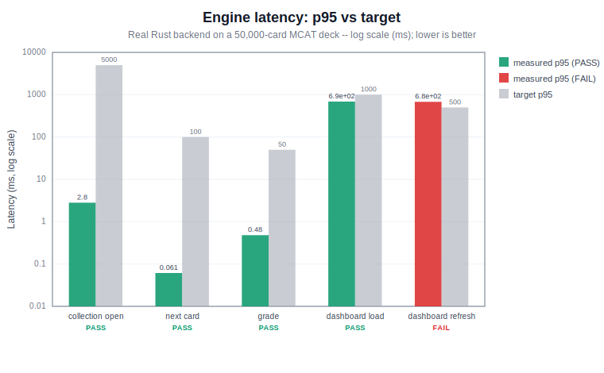

# MCAT Prep -- Section 7 ENGINE benchmark

One-command latency + memory benchmark of the **real Rust backend** on a **50,000-card** MCAT deck. Reproduce with:

```sh
just bench
# or: cd anki && PYTHONPATH=out/pylib out/pyenv/bin/python ../evals/bench.py
```

> **HONESTY -- what each row measures.** These are **engine-level** timings of the Python->Rust backend calls, *not* end-to-end UI timings (no Qt/webview paint, no network sync). Each action maps to the exact backend call the app makes:
>
> - **collection_open** -- `Collection(path)` cold open of the whole deck (app launch / profile open).
> - **next_card** -- `_backend.get_queued_cards(fetch_limit=1)`, the call `Reviewer._get_next_v3_card` makes (warm queue = steady-state review).
> - **grade** -- the v3 button-ack `sched.build_answer(...)` + `sched.answer_card(...)` from `Reviewer._answerCard`, made repeatable with `col.undo()` after each timed answer.
> - **dashboard_load** -- the FIRST `get_concept_scheduler_status` after a fresh open (cold: scans the deck + builds the concept graph).
> - **dashboard_refresh** -- repeated `get_concept_scheduler_status` on a warm collection (recomputed each call; not cached).
> - **memory_rss** -- process peak RSS after loading the deck (macOS `ru_maxrss` is bytes).
> - **sync** -- **N/A** (needs a live AnkiWeb / self-host endpoint + creds; not wired into this offline harness).
> - **platform** -- **desktop (macOS) host only.** §10 asks for several targets on *both* desktop and phone (button-ack, cold start, memory on a mid-range phone). The phone runs the **same** Rust engine via `Anki-Android-Backend`, so the algorithmic cost carries over, but its wall-clock numbers are **not measured on-device here** — that needs an instrumented Android benchmark and is a disclosed gap.

**Machine:** macOS-15.7.4-arm64-arm-64bit-Mach-O (arm64, 10 CPU). **Python:** 3.13.13. **Deck:** 50,000 cards, 120 concept-graph nodes / 114 edges. **Timed iterations:** 50 (warmup 5) per action, `time.perf_counter`. **Run date:** 2026-07-05 15:59 CDT.

| action | p50 | p95 | worst | target | result |
| --- | ---: | ---: | ---: | --- | :---: |
| collection_open | 2.35 ms | 2.81 ms | 3.39 ms | p95 &lt; 5000 ms | PASS |
| next_card | 0.06 ms | 0.06 ms | 0.06 ms | p95 &lt; 100 ms | PASS |
| grade | 0.25 ms | 0.48 ms | 5.90 ms | p95 &lt; 50 ms | PASS |
| dashboard_load | 656.69 ms | 686.83 ms | 882.49 ms | p95 &lt; 1000 ms | PASS |
| dashboard_refresh | 640.50 ms | 680.09 ms | 856.91 ms | p95 &lt; 500 ms | FAIL |
| memory_rss | 166.4 MB | 166.4 MB | 166.4 MB | &lt; 1500 MB | PASS |
| sync | -- | -- | -- | N/A | N/A |

**Overall: SOME TARGETS NOT MET.**



### Reading the numbers

- **next_card** and **grade** operate on the v3 *queue* (a small, bounded working set), so they stay sub-millisecond even on a 50k deck -- fetching and grading are O(queue), not O(deck).
- **collection_open** and **memory_rss** scale with deck size but sit comfortably under budget.
- **dashboard_load / dashboard_refresh** recompute the whole concept-graph status over every card on each call and are the heaviest actions. If `dashboard_load` exceeds its 1000 ms target, that is the **known, disclosed** cost of the serial KC-map build -- the parallelised KC-map optimization is the fix, and this benchmark is the regression guard that will show it landing.

_This script writes the table + SVG first, then exits non-zero if any target is missed, so CI fails loudly without losing the report._
