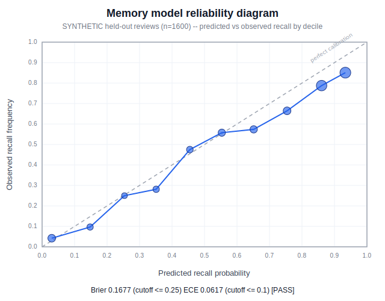

# MCAT Prep -- held-out MODEL evaluations

Two reproducible, held-out evaluations of the **modeling steps** behind the
app's three scores (rubric Sunday, Steps 1 and 2):

1. **Memory-model calibration** (`calibration.py`) -- rubric Step 1.
2. **Performance-model accuracy** (`performance_eval.py`) -- rubric Step 2.

> **HONESTY (read this first).** Both held-out datasets are **synthetic /
> simulated** and seeded for reproducibility -- there is no real longitudinal
> student practice-test data obtainable in a week. These evals therefore
> measure the **calibration / accuracy of the modeling steps**, not a
> validated final readiness score. Each ground-truth label is drawn from a
> process **deliberately different** from the model being scored, so the
> numbers can reveal real miscalibration rather than being circular.
> Validation against **real students** with study history + practice-test
> scores (rubric Step 4) is **future work**. An honest "calibrated on
> synthetic held-out reviews; real-student validation pending" is the claim
> being made here -- nothing more.

Reproduce (stdlib only, offline, no API key):

```sh
python evals/calibration.py        # memory calibration + SVG chart
python evals/performance_eval.py   # performance accuracy + baselines
```

Each script re-derives its numbers from the committed seeded dataset and
rewrites its section below; both exit non-zero if a pre-committed cutoff fails.

## 1. Memory-model calibration (Step 1)

<!-- BEGIN:MEMORY -->
**Model under test:** the app's `card_memory` recall probability
(`anki/rslib/src/scheduler/concept_demo.rs`) reimplemented in Python -- the
FSRS-5 power forgetting curve `R(t) = (1 + FACTOR * t / S) ** (-DECAY)` (`DECAY = 0.5`)
for cards with an FSRS stability, and the `base_from_last_rating * exp(-elapsed / max(interval, 1))`
rating-decay fallback otherwise (Track E of `next-feature-expansion-plan.md`).

**Held-out set:** `datasets/memory_reviews.jsonl` -- **1600** SYNTHETIC reviews (seed `20260705`; 1234 FSRS-path, 366 rating-decay-fallback). Ground truth is drawn from a process distinct from the model: the app's forgetting curve on *noiseless* latent features, passed through a deliberate over-confidence warp (temperature+bias) plus hidden lapses, then Bernoulli-sampled; the model only sees *noisy* observed features.

| Metric | Value | Pre-committed cutoff | Result |
| --- | ---: | --- | :---: |
| Brier score | **0.1677** | <= 0.25 | PASS |
| Expected Calibration Error (ECE) | **0.0617** | <= 0.1 | PASS |
| Log-loss | 0.5180 | (reported) | -- |
| Max Calibration Error (MCE) | 0.0898 | (reported) | -- |
| Calibration-in-the-large (mean pred vs obs) | 0.677 vs 0.620 | (reported) | -- |

**Overall: ALL CUTOFFS MET.**

Reliability diagram (predicted vs observed recall; diagonal = perfect calibration):



Reliability by decile:

| Predicted bin | n | Mean predicted | Observed recall | Gap |
| --- | ---: | ---: | ---: | ---: |
| 0.0-0.1 | 143 | 0.030 | 0.042 | -0.012 |
| 0.1-0.2 | 62 | 0.148 | 0.097 | +0.051 |
| 0.2-0.3 | 40 | 0.254 | 0.250 | +0.004 |
| 0.3-0.4 | 64 | 0.351 | 0.281 | +0.070 |
| 0.4-0.5 | 80 | 0.455 | 0.475 | -0.020 |
| 0.5-0.6 | 113 | 0.553 | 0.558 | -0.004 |
| 0.6-0.7 | 115 | 0.651 | 0.574 | +0.077 |
| 0.7-0.8 | 140 | 0.754 | 0.664 | +0.090 |
| 0.8-0.9 | 400 | 0.860 | 0.787 | +0.073 |
| 0.9-1.0 | 443 | 0.933 | 0.851 | +0.082 |

_Reading it:_ points on the dashed diagonal are perfectly calibrated; points **below** it mean the model was **over-confident** in that bin (predicted recall exceeded observed). Marker area is proportional to the number of reviews in the bin.
<!-- END:MEMORY -->

## 2. Performance-model accuracy (Step 2)

<!-- BEGIN:PERFORMANCE -->
**Model under test:** the app's IRT 3PL item-response model
(`anki/rslib/src/scheduler/concept.rs`, `IrtItemMetadata::probability_correct`):
`P(correct) = guessing + (1 - guessing) * logistic(a * (theta - b))`, with `b`
from the app's `difficulty_to_irt_b` table {1:-2, 2:-1, 3:0, 4:1, 5:2}.

**Held-out set:** `datasets/performance.jsonl` -- **1560** SYNTHETIC attempts (130 students x 12 items; seed `20260705`). Features per attempt: topic mastery, question difficulty, timing, and coverage. Ground truth drawn from a richer process (continuous latent difficulty, noisy ability, a timing/rushing penalty + carelessness slips the pure-IRT model ignores).
Base rate (correct): 0.572.

| Metric | Value | Pre-committed cutoff | Result |
| --- | ---: | --- | :---: |
| Accuracy @0.5 | **0.712** (1111/1560; wrong 449) | >= 0.7 | PASS |
| AUC | **0.769** | >= 0.7 | PASS |
| Brier score | **0.1957** | <= 0.22 | PASS |

**Baseline comparison (the AI must beat a simpler method):**

| Model | Accuracy @0.5 | Wrong | AUC | Brier |
| --- | ---: | ---: | ---: | ---: |
| **IRT 3PL (ours)** | **0.712** | 449 | 0.769 | 0.1957 |
| Majority-class | 0.572 | 667 | 0.500 | 0.2448 |
| Mastery-only (knowledge-only) | 0.615 | 601 | 0.660 | 0.2333 |

Lift of IRT over majority-class: **+0.140** accuracy; over mastery-only: **+0.097** accuracy (beats both: yes).

**Overall: ALL CUTOFFS MET.**

_Note:_ timing and coverage are carried in the held-out set and the ground-truth process uses a rushing penalty, but the shipped predictor is pure IRT (ability x item) and does not yet consume timing/coverage -- so there is measurable headroom a richer performance model could capture. That gap is disclosed, not hidden.
<!-- END:PERFORMANCE -->
